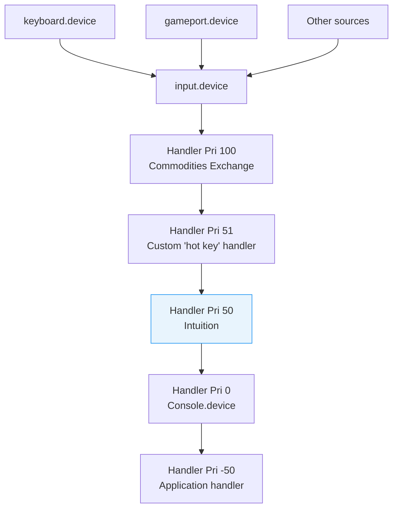

[← Home](../README.md) · [Devices](README.md)

# input.device — Input Event Handler Chain

## Overview

`input.device` is the central dispatcher for all input events on AmigaOS. It collects raw events from keyboard, mouse, joystick, and other sources, then distributes them through a **priority-ordered handler chain**. Intuition sits at priority 50 in this chain — custom input handlers can intercept events before or after Intuition.

---

## Handler Chain Architecture



Events flow from highest to lowest priority. Each handler can:
- **Pass** the event through (return the event list unchanged)
- **Modify** the event (e.g., remap keys)
- **Consume** the event (remove from chain — lower handlers never see it)
- **Insert** new synthetic events

---

## InputEvent Structure

```c
/* devices/inputevent.h — NDK39 */
struct InputEvent {
    struct InputEvent *ie_NextEvent;  /* linked list */
    UBYTE  ie_Class;        /* event type (IECLASS_*) */
    UBYTE  ie_SubClass;     /* subclass */
    UWORD  ie_Code;         /* key code, button, qualifier */
    UWORD  ie_Qualifier;    /* modifier keys state */
    union {
        struct {
            WORD ie_x;      /* mouse X delta or absolute */
            WORD ie_y;      /* mouse Y delta or absolute */
        } ie_xy;
        APTR ie_addr;       /* pointer data */
    } ie_position;
    struct timeval ie_TimeStamp;  /* when event occurred */
};
```

### Event Classes

| Class | Constant | Source |
|---|---|---|
| $01 | `IECLASS_RAWKEY` | Raw key press/release |
| $02 | `IECLASS_RAWMOUSE` | Mouse movement + buttons |
| $04 | `IECLASS_TIMER` | Timer tick event |
| $07 | `IECLASS_NEWPOINTERPOS` | Absolute pointer position |
| $09 | `IECLASS_DISKINSERTED` | Disk inserted |
| $0A | `IECLASS_DISKREMOVED` | Disk removed |
| $0D | `IECLASS_NEWPREFS` | Preferences changed |

### Qualifier Bits

| Bit | Constant | Key |
|---|---|---|
| 0 | `IEQUALIFIER_LSHIFT` | Left Shift |
| 1 | `IEQUALIFIER_RSHIFT` | Right Shift |
| 2 | `IEQUALIFIER_CAPSLOCK` | Caps Lock |
| 3 | `IEQUALIFIER_CONTROL` | Ctrl |
| 4 | `IEQUALIFIER_LALT` | Left Alt |
| 5 | `IEQUALIFIER_RALT` | Right Alt |
| 6 | `IEQUALIFIER_LCOMMAND` | Left Amiga |
| 7 | `IEQUALIFIER_RCOMMAND` | Right Amiga |
| 8 | `IEQUALIFIER_NUMERICPAD` | Key is on numeric pad |
| 9 | `IEQUALIFIER_REPEAT` | Key repeat (auto-repeat) |
| 10 | `IEQUALIFIER_INTERRUPT` | Event from interrupt |
| 11 | `IEQUALIFIER_MULTIBROADCAST` | Broadcast to all handlers |
| 12 | `IEQUALIFIER_MIDBUTTON` | Middle mouse button |
| 13 | `IEQUALIFIER_RBUTTON` | Right mouse button |
| 14 | `IEQUALIFIER_LEFTBUTTON` | Left mouse button |
| 15 | `IEQUALIFIER_RELATIVEMOUSE` | Mouse values are deltas |

---

## Installing a Custom Input Handler

```c
#include <devices/input.h>
#include <devices/inputevent.h>

/* Handler function — called from input.device context: */
struct InputEvent * __saveds __asm MyHandler(
    register __a0 struct InputEvent *events,
    register __a1 APTR handlerData)
{
    struct InputEvent *ev;
    for (ev = events; ev; ev = ev->ie_NextEvent)
    {
        if (ev->ie_Class == IECLASS_RAWKEY)
        {
            UWORD key = ev->ie_Code & 0x7F;
            BOOL  up  = ev->ie_Code & 0x80;

            /* Example: remap F10 ($59) to Escape ($45): */
            if (key == 0x59)
                ev->ie_Code = (up ? 0x80 : 0x00) | 0x45;
        }
    }
    return events;  /* pass all events to next handler */
}

/* Install the handler: */
struct Interrupt handlerInt;
handlerInt.is_Node.ln_Type = NT_INTERRUPT;
handlerInt.is_Node.ln_Pri  = 51;  /* just above Intuition (50) */
handlerInt.is_Node.ln_Name = "MyKeyMapper";
handlerInt.is_Data = myData;
handlerInt.is_Code = (APTR)MyHandler;

struct MsgPort *inputPort = CreateMsgPort();
struct IOStdReq *inputReq = (struct IOStdReq *)
    CreateIORequest(inputPort, sizeof(struct IOStdReq));
OpenDevice("input.device", 0, (struct IORequest *)inputReq, 0);

inputReq->io_Command = IND_ADDHANDLER;
inputReq->io_Data    = (APTR)&handlerInt;
DoIO((struct IORequest *)inputReq);

/* ... handler is now active ... */

/* Remove handler before exit: */
inputReq->io_Command = IND_REMHANDLER;
inputReq->io_Data    = (APTR)&handlerInt;
DoIO((struct IORequest *)inputReq);
```

### Consuming Events (Blocking)

```c
/* To consume an event (prevent it from reaching Intuition): */
struct InputEvent * __saveds __asm BlockEscape(
    register __a0 struct InputEvent *events,
    register __a1 APTR data)
{
    struct InputEvent *ev, *prev = NULL;
    for (ev = events; ev; )
    {
        if (ev->ie_Class == IECLASS_RAWKEY &&
            (ev->ie_Code & 0x7F) == 0x45)  /* Escape */
        {
            /* Remove from chain: */
            if (prev)
                prev->ie_NextEvent = ev->ie_NextEvent;
            else
                events = ev->ie_NextEvent;
            ev = ev->ie_NextEvent;
            continue;
        }
        prev = ev;
        ev = ev->ie_NextEvent;
    }
    return events;
}
```

---

## Injecting Synthetic Events

```c
/* Send a fake key press: */
struct InputEvent fake;
fake.ie_Class     = IECLASS_RAWKEY;
fake.ie_Code      = 0x45;  /* Escape, key down */
fake.ie_Qualifier = 0;

inputReq->io_Command = IND_WRITEEVENT;
inputReq->io_Data    = (APTR)&fake;
inputReq->io_Length  = sizeof(struct InputEvent);
DoIO((struct IORequest *)inputReq);
```

---

## Commodities Exchange

The Commodities Exchange (`commodities.library`) provides a high-level framework for input handlers:

```c
/* Define a hot key: */
CxObj *broker = CxBroker(&newBroker, NULL);
CxObj *filter = CxFilter("rawkey control esc");  /* Ctrl+Esc */
CxObj *sender = CxSender(brokerPort, EVT_HOTKEY);
AttachCxObj(filter, sender);
AttachCxObj(broker, filter);
ActivateCxObj(broker, TRUE);
```

This is the preferred method for applications — avoids writing raw input handlers.

---

## References

- NDK39: `devices/input.h`, `devices/inputevent.h`
- ADCD 2.1: input.device autodocs
- See also: [keyboard.md](keyboard.md) — raw key code map
- See also: [idcmp.md](../09_intuition/idcmp.md) — Intuition input handling
- See also: [input_events.md](../09_intuition/input_events.md) — event flow through Intuition
