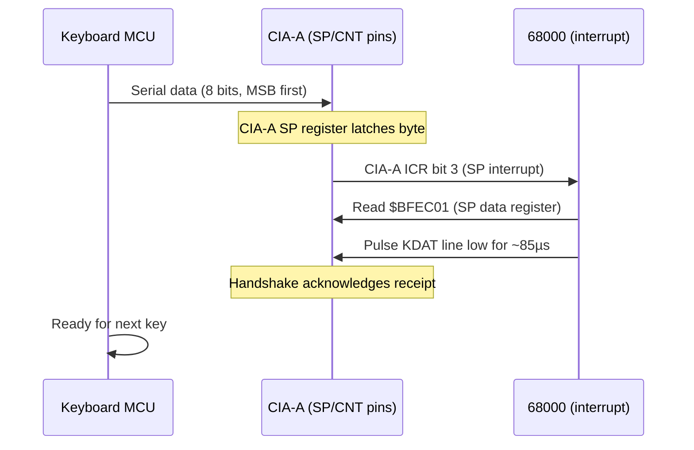

[← Home](../README.md) · [Devices](README.md)

# keyboard.device — Keyboard Hardware and Raw Key Codes

## Overview

`keyboard.device` provides access to the Amiga keyboard via the CIA-A serial port handshake protocol. The keyboard controller (a dedicated 6500/1 or 68HC05 microcontroller inside the keyboard) transmits **raw key codes** as serial data through CIA-A. Understanding this protocol is essential for FPGA core implementation.

---

## Hardware Protocol



### CIA-A Registers Used

| Register | Address | Bit | Function |
|---|---|---|---|
| `CIASDR` | `$BFEC01` | 7:0 | Serial data register — receives raw key code |
| `CIACRA` | `$BFEE01` | 6 | SP direction: 0=input (keyboard), 1=output |
| `CIAICR` | `$BFED01` | 3 | SP interrupt flag — set when byte received |

### Raw Key Code Format

The keyboard sends an 8-bit value where:
- **Bit 7** = key state: 0 = **pressed**, 1 = **released**
- **Bits 6:0** = key code (0–127)

```c
/* Decode a raw key event: */
UBYTE raw = ~(cia->ciaSDR);    /* invert (active low) */
raw = (raw >> 1) | (raw << 7); /* rotate right 1 bit */
UBYTE keycode = raw & 0x7F;
BOOL  keyup   = raw & 0x80;
```

> **Bit rotation**: The keyboard transmits bits in a rotated format. The software must rotate the received byte right by 1 bit to get the actual key code. This is a hardware design quirk.

### Handshake Timing

After reading the key code, the CPU must acknowledge by pulsing the KDAT line:

```asm
; Acknowledge key reception:
    OR.B    #$40, $BFEE01     ; CIACRA — set SP to output
    ; Wait at least 85 µs
    MOVE.B  #0, $BFEC01       ; drive KDAT low
    ; (timer or loop delay ~85 µs)
    AND.B   #~$40, $BFEE01    ; CIACRA — set SP back to input
    ; Keyboard is now ready to send next key
```

> **FPGA note**: If the handshake acknowledgement is too fast (<75µs) or too slow (>200ms), the keyboard MCU will resend the key code or initiate a reset sequence.

---

## Raw Key Code Map

### Main Keys

| Code | Key | Code | Key | Code | Key |
|---|---|---|---|---|---|
| $00 | `` ` `` (backtick) | $01 | `1` | $02 | `2` |
| $03 | `3` | $04 | `4` | $05 | `5` |
| $06 | `6` | $07 | `7` | $08 | `8` |
| $09 | `9` | $0A | `0` | $0B | `-` |
| $0C | `=` | $0D | `\` | $10 | `Q` |
| $11 | `W` | $12 | `E` | $13 | `R` |
| $14 | `T` | $15 | `Y` | $16 | `U` |
| $17 | `I` | $18 | `O` | $19 | `P` |
| $1A | `[` | $1B | `]` | $20 | `A` |
| $21 | `S` | $22 | `D` | $23 | `F` |
| $24 | `G` | $25 | `H` | $26 | `J` |
| $27 | `K` | $28 | `L` | $29 | `;` |
| $2A | `'` | $31 | `Z` | $32 | `X` |
| $33 | `C` | $34 | `V` | $35 | `B` |
| $36 | `N` | $37 | `M` | $38 | `,` |
| $39 | `.` | $3A | `/` | $40 | `Space` |
| $41 | `Backspace` | $42 | `Tab` | $43 | `Numpad Enter` |
| $44 | `Return` | $45 | `Escape` | $46 | `Delete` |

### Modifier and Special Keys

| Code | Key | Code | Key |
|---|---|---|---|
| $60 | `Left Shift` | $61 | `Right Shift` |
| $62 | `Caps Lock` | $63 | `Ctrl` |
| $64 | `Left Alt` | $65 | `Right Alt` |
| $66 | `Left Amiga` | $67 | `Right Amiga` |

### Cursor and Function Keys

| Code | Key | Code | Key |
|---|---|---|---|
| $4C | `Cursor Up` | $4D | `Cursor Down` |
| $4E | `Cursor Right` | $4F | `Cursor Left` |
| $50–$59 | `F1`–`F10` | $5F | `Help` |

### Special Codes

| Code | Meaning |
|---|---|
| $78 | **Reset warning** — Ctrl+Amiga+Amiga pressed (keyboard sends this before resetting) |
| $F9 | Last key code was bad (parity error) — resend |
| $FA | Keyboard buffer overflow |
| $FC | Keyboard self-test failed |
| $FD | Initiate power-up key stream |
| $FE | Terminate power-up key stream |

---

## Using keyboard.device (OS Level)

Most applications receive key events through Intuition IDCMP (see [idcmp.md](../09_intuition/idcmp.md)). Direct keyboard.device use is for system-level software:

```c
struct MsgPort *kbPort = CreateMsgPort();
struct IOStdReq *kbReq = (struct IOStdReq *)
    CreateIORequest(kbPort, sizeof(struct IOStdReq));

OpenDevice("keyboard.device", 0, (struct IORequest *)kbReq, 0);

/* Read raw key events: */
struct InputEvent ie;
kbReq->io_Command = KBD_READMATRIX;
kbReq->io_Data    = &keyMatrix;      /* 16-byte key matrix bitmap */
kbReq->io_Length  = 16;
DoIO((struct IORequest *)kbReq);
/* keyMatrix bit N = 1 if key code N is currently held down */

/* Reset keyboard (force self-test): */
kbReq->io_Command = KBD_RESETHANDLER;
DoIO((struct IORequest *)kbReq);
```

### Key Matrix

The `KBD_READMATRIX` command returns a 16-byte (128-bit) bitmap where each bit corresponds to a raw key code:

```c
UBYTE keyMatrix[16];
/* Bit test: is key $45 (Escape) pressed? */
BOOL escPressed = keyMatrix[0x45 / 8] & (1 << (0x45 % 8));
```

---

## Keyboard Reset Sequence

The Ctrl+Amiga+Amiga three-key combination triggers a hardware reset:

1. User presses Ctrl+Left Amiga+Right Amiga
2. Keyboard MCU detects the combo
3. Sends raw code `$78` (reset warning) — gives software ~10 seconds to clean up
4. Pulls KBRST line low → triggers 68000 reset via RESET pin

> **FPGA**: The core must implement this reset path. The `$78` warning code allows software (e.g., debuggers) to save state before reset.

---

## References

- NDK39: `devices/keyboard.h`, `devices/inputevent.h`
- HRM: *Amiga Hardware Reference Manual* — Keyboard chapter
- See also: [input.md](input.md) — input.device handler chain
- See also: [idcmp.md](../09_intuition/idcmp.md) — high-level key events via Intuition
