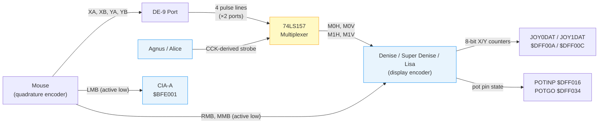
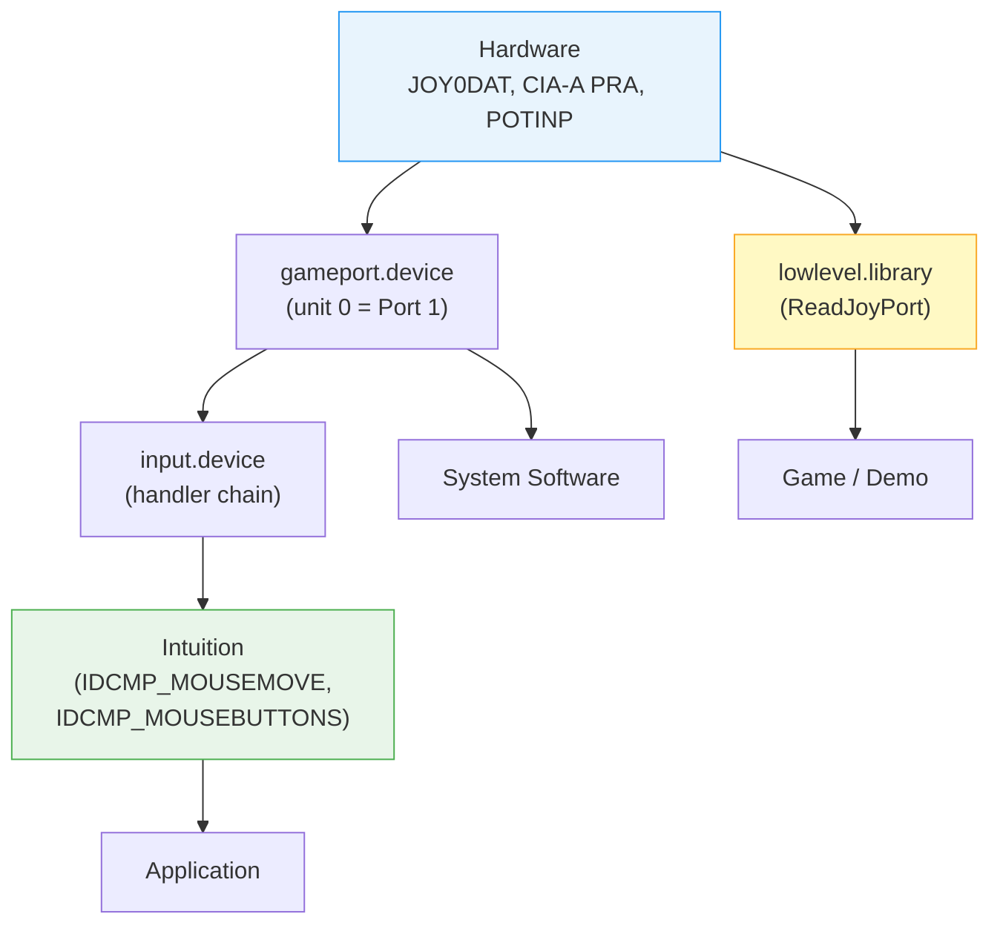
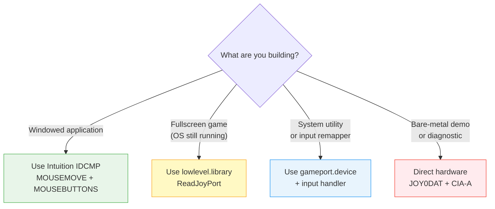

[← Home](../README.md) · [Devices](README.md)

# Mouse Input — Hardware Quadrature Decoding, Polling Architecture, and Button Demultiplexing

## Overview

The Amiga mouse is a **dumb peripheral** — a pair of slotted encoder wheels, three switches, and nothing else. No microcontroller, no firmware, no serial protocol. It sends raw quadrature pulse trains down four wires, and the custom chipset counts them automatically in hardware. This is the opposite of every modern input device, and it is the reason an Amiga can track a mouse with **zero CPU overhead** between vertical blanking interrupts.

The hardware does the counting. The display encoder chip — **Denise** (OCS), **Super Denise** (ECS), or **Lisa** (AGA) — contains quadrature decoding logic and maintains two pairs of 8-bit counters (X and Y) in the `JOY0DAT` and `JOY1DAT` registers. Software never sees individual pulses. It reads the counters, subtracts the previous value, and gets a signed delta. Between the mouse connector and the display encoder sits an **external interface circuit** — a 74LS157 multiplexer on the A500/A2000, a 74HCT166 shift register on the A4000, or integrated logic on later models — that routes both ports' signals into the display encoder's four input pins. The entire mouse subsystem, from connector pin to application event, involves the interface circuit, the display encoder, Paula, and CIA-A, plus exactly **one interrupt** — the vertical blanking interrupt that triggers the polling.

The standard "Tank Mouse" (A2000/A3000 era) produces approximately **200 counts per inch** (CPI). At typical desk speeds, the 8-bit counters change by 2–20 counts per frame — well within the ±127 range that avoids wrap-around ambiguity. Move the mouse faster than ~16 inches per frame (~1000 inches/second), and the counter wraps. In practice, this never happens.

---

## Hardware Architecture

### Signal Path



The mouse connects via a **DE-9** (commonly called DB-9) connector. Four pins carry quadrature signals; three carry button states through two different chips. This split across chips — movement and RMB/MMB in the display encoder, left button in CIA-A — is a recurring source of complexity.

### Chip Ownership Across Chipset Generations

The quadrature counter registers (`JOY0DAT`, `JOY1DAT`, `JOYTEST`) and the pot pin registers (`POTINP`, `POTGO`) are all owned by the **display encoder chip**, which changed name with each generation but maintained backward-compatible register addresses:

| Generation | Display Encoder | Movement Counters | Pot Pins (RMB/MMB) | Notes |
|------------|----------------|-------------------|---------------------|-------|
| **OCS** | **Denise** (8362) | `JOY0DAT`, `JOY1DAT`, `JOYTEST` | `POTINP`, `POTGO` | Original chipset |
| **ECS** | **Super Denise** (8373) | Same registers, same addresses | Same | Added SuperHires, programmable scan rates |
| **AGA** | **Lisa** (4203) | Same registers, same addresses | Same | 32-bit bus, 256-color palette, backward compatible |

> [!NOTE]
> Despite the common misconception that `POTINP`/`POTGO` belong to Paula, the HRM register tables consistently mark them with a **"D"** (Denise). Paula owns the related but distinct `POT0DAT`/`POT1DAT` registers ($DFF012/$DFF014) used for analog paddle counting. The digital button-state bits read via `POTINP` are handled by the display encoder.

The **external interface circuit** sits between the DE-9 connector pins and the display encoder's input pins (M0H, M0V, M1H, M1V). Because the Amiga has two controller ports (8 quadrature lines total) but the display encoder has only 4 input pins, the interface circuit time-division-multiplexes both ports. The address generator chip (Agnus or Alice) drives the strobe with a **CCK-derived signal** (~3.58 MHz NTSC / ~3.55 MHz PAL), alternating between Port 1 and Port 2 signals every half color-clock cycle.

### Per-Model Interface Circuit

While the display encoder's internal quadrature counting logic remained consistent across all models, the **external interface circuit** between the DE-9 connectors and the display encoder changed significantly across motherboard revisions:

| Model(s) | Interface IC | Type | Designation | Logic Family |
|----------|-------------|------|-------------|-------------|
| **A500, A2000** | **74LS157** | Quad 2-to-1 multiplexer | U15/U16 | LS TTL |
| **A3000** | **74F157** | Quad 2-to-1 multiplexer | — | Fast TTL |
| **A4000** | **74HCT166** | 8-bit parallel-load shift register | U975/U976 | HCT CMOS |
| **A1200** | Integrated | Part of Budgie/Gayle complex | — | CMOS |
| **A600** | Integrated | Part of Gayle complex | — | CMOS |
| **CD32** | Integrated | Part of Akiko complex | — | CMOS |

The A500/A2000 design is the simplest: a 74LS157 multiplexer selects between Port 1 and Port 2 inputs on each CCK half-cycle. The A4000's shift-register approach (74HCT166) is architecturally different — it captures the parallel state of all port signals and shifts them serially into the Lisa chip. This design was chosen for the A4000's higher-integration board layout and provides better noise immunity (HCT logic levels), but introduces a different failure mode: if the shift register fails or its traces corrode, **movement dies while buttons continue to work** (since buttons route through separate CIA and pot-pin paths).

> [!WARNING]
> **A4000 battery corrosion hazard.** The A4000's NiCd barrel battery (Varta) is notorious for leaking electrolyte that corrodes traces around U975/U976. This commonly kills mouse movement while leaving buttons functional — the quadrature signal path is physically close to the battery, while the button paths (CIA-A, pot pins) route through different board areas. If mouse movement fails on an A4000 but buttons work, inspect U975/U976 and surrounding traces and test continuity from the DE-9 connector pins to the shift register inputs.

### Connector Pinout

| Pin | Signal | Destination | Description |
|-----|--------|-------------|-------------|
| 1 | V-pulse (YA) | 74LS157 → Denise | Vertical quadrature channel A |
| 2 | H-pulse (XA) | 74LS157 → Denise | Horizontal quadrature channel A |
| 3 | VQ-pulse (YB) | 74LS157 → Denise | Vertical quadrature channel B |
| 4 | HQ-pulse (XB) | 74LS157 → Denise | Horizontal quadrature channel B |
| 5 | Middle button | Denise (POTINP) | Active low — directly to pot pin |
| 6 | Left button | CIA-A (PRA) | Active low — directly to CIA |
| 7 | +5V DC | — | Power supply |
| 8 | GND | — | Ground |
| 9 | Right button | Denise (POTINP) | Active low — directly to pot pin |

> [!WARNING]
> The Amiga and Atari ST both use DE-9 connectors with quadrature protocols, but the **pin assignments differ** — specifically, pins 1 and 4 are swapped. Plugging an Atari ST mouse into an Amiga (or vice versa) produces inverted vertical movement. A simple pin-swap adapter fixes this.

### Quadrature Encoding

Each axis has two signal lines (A and B) that produce pulse trains 90° out of phase. The phase offset is a property of the encoder wheel geometry — not derived from any system clock:

```
Forward motion:
  A: ──┐  ┌──┐  ┌──┐  ┌──
       │  │  │  │  │  │
       └──┘  └──┘  └──┘

  B: ───┐  ┌──┐  ┌──┐  ┌─
        │  │  │  │  │  │
        └──┘  └──┘  └──┘
  (B leads A → counter increments)

Backward motion:
  A leads B → counter decrements
```

The display encoder chip contains **asynchronous edge-detection logic** that responds to transitions on the quadrature inputs — it is not clocked at any fixed rate. Each transition on either signal line (both rising and falling edges) increments or decrements the counter by 1, yielding **4 counts per full encoder slot cycle** (4× decoding). The pulse frequency depends entirely on how fast the user moves the mouse, not on any system clock. The hardware handles direction detection automatically from the phase relationship.

> [!NOTE]
> The CCK-derived strobe (~3.58 MHz) mentioned in the signal path controls **only the port multiplexer** — it alternates which port's signals reach Denise. The quadrature counting logic itself is asynchronous. A 200 CPI mouse moved at 10 inches/second produces pulses at ~2 kHz — orders of magnitude below the multiplexer rate.

---

## Hardware Registers

### Movement Registers (Denise / Lisa)

| Address | Name | R/W | Description |
|---------|------|-----|-------------|
| `$DFF00A` | `JOY0DAT` | R | Port 1 (mouse port) — quadrature counters |
| `$DFF00C` | `JOY1DAT` | R | Port 2 (joystick port) — quadrature counters |
| `$DFF036` | `JOYTEST` | W | Write test value to both counter pairs |

#### JOYxDAT Bit Layout

```
 15  14  13  12  11  10   9   8   7   6   5   4   3   2   1   0
┌───┬───┬───┬───┬───┬───┬───┬───┬───┬───┬───┬───┬───┬───┬───┬───┐
│Y7 │Y6 │Y5 │Y4 │Y3 │Y2 │Y1 │Y0 │X7 │X6 │X5 │X4 │X3 │X2 │X1 │X0 │
└───┴───┴───┴───┴───┴───┴───┴───┴───┴───┴───┴───┴───┴───┴───┴───┘
  ─────── Y counter ───────   ─────── X counter ───────
        (bits 15–8)                 (bits 7–0)
```

Both counters are unsigned 8-bit values that wrap from 255→0 (incrementing) and 0→255 (decrementing). The counters are **free-running** — the hardware never resets them. Software computes deltas by subtracting the previous reading.

> [!NOTE]
> Bits 1 and 0 of each counter also represent the current quadrature pin states. This is why the same register serves double duty for joystick direction decoding (see [gameport.md](gameport.md)) — joystick direction bits are XOR'd from these counter bits.

### Button Registers (CIA-A and Denise)

| Address | Name | R/W | Bit(s) | Port | Button |
|---------|------|-----|--------|------|--------|
| `$BFE001` | CIA-A PRA | R | 6 | Port 1 | Left mouse button (active low) |
| `$BFE001` | CIA-A PRA | R | 7 | Port 2 | Left / fire button (active low) |
| `$DFF016` | `POTINP` | R | 10 | Port 1 | Right mouse button (active low) |
| `$DFF016` | `POTINP` | R | 8 | Port 1 | Middle mouse button (active low) |
| `$DFF016` | `POTINP` | R | 14 | Port 2 | Right mouse button (active low) |
| `$DFF016` | `POTINP` | R | 12 | Port 2 | Middle mouse button (active low) |
| `$DFF034` | `POTGO` | W | — | Both | Pot pin direction control |

> [!IMPORTANT]
> Before reading RMB/MMB from `POTINP`, the corresponding pot pins must be configured as **inputs** via `POTGO`. If a game or previous program sets them as outputs, the button bits read garbage. The OS configures this during boot, but bare-metal code must set `POTGO` explicitly.

### POTINP Bit Map (Relevant to Mouse Buttons)

```
 15  14  13  12  11  10   9   8   7   6   5   4   3   2   1   0
┌───┬───┬───┬───┬───┬───┬───┬───┬───┬───┬───┬───┬───┬───┬───┬───┐
│   │P2R│   │P2M│   │P1R│   │P1M│   │   │   │   │   │   │   │   │
└───┴───┴───┴───┴───┴───┴───┴───┴───┴───┴───┴───┴───┴───┴───┴───┘
      14      12      10       8
     P2 RMB  P2 MMB  P1 RMB  P1 MMB     (all active low)
```

> [!WARNING]
> Bits 1–7 of `POTINP` should always read 0 on functional hardware. If any of these bits are set, the display encoder's pot pin logic may be damaged. Diagnostic tools (observable in reverse-engineered diagnostic ROMs) check this condition and disable button reading to prevent stuck-button lockups.

---

## Delta Calculation — The Core Algorithm

Computing mouse movement requires reading the counter, subtracting the previous value, and sign-extending the 8-bit result. Because the counters wrap, 8-bit subtraction handles overflow naturally — no branches required.

### Basic C Implementation

```c
/* Read mouse delta — call once per vertical blank: */
static UWORD prev_joy = 0;

UWORD joy = *(volatile UWORD *)0xDFF00A;  /* JOY0DAT */

/* 8-bit subtraction handles wrap-around automatically: */
BYTE dx = (BYTE)((joy & 0xFF) - (prev_joy & 0xFF));
BYTE dy = (BYTE)((joy >> 8)   - (prev_joy >> 8));

prev_joy = joy;

/* dx, dy are now signed deltas: -128 to +127 */
cursor_x += dx;
cursor_y += dy;
```

### Optimized 68000 Assembly (Branchless)

Kickstart procedure uses an elegant branchless technique inside the VERTB interrupt handler for mouse polling. The handler extracts both X and Y deltas from a single 16-bit register read using **byte-level subtraction and word rotation** — no branches, no sign-extension instructions:

```asm
; Branchless delta extraction (reconstructed from RE of VERTB handler)
; Input:  A0 = custom chip base ($DFF000)
;         A2 = per-unit data (contains saved previous counters)
;         D1 = port index offset (0 for Port 1, 4 for Port 2)
;
; Output: D0.W = [Y_delta | X_delta] (signed bytes)

    LSR     #1,D1                   ; Convert offset: 0→0, 4→2
    MOVE.W  JOY0DAT(A0,D1.W),D0    ; D0 = [Y_new | X_new]
    MOVE.W  D0,D2                   ; Save raw for storage
    ROR.W   #8,D0                   ; D0 = [X_new | Y_new]
    SUB.B   (A2),D0                 ; D0 = [X_new | (Y_new - Y_old)]
    ROR.W   #8,D0                   ; D0 = [(Y_new-Y_old) | X_new]
    SUB.B   1(A2),D0               ; D0 = [(Y_new-Y_old) | (X_new-X_old)]
    MOVE.W  D2,(A2)                 ; Save new counters for next frame
```

The trick: `ROR.W #8` swaps the high and low bytes. By interleaving rotations and byte-subtractions, the routine computes both deltas in the **high and low bytes of a single word** — all in 7 instructions, zero branches, ~28 cycles.

The caller then sign-extends each byte to a 16-bit word and accumulates:

```asm
; Sign-extend and accumulate (reconstructed from RE)
    MOVE.B  D0,D1           ; D1.B = X delta
    EXT.W   D1              ; sign-extend to 16 bits
    ADD.W   D1,X_ACCUM(A2)  ; accumulate X

    ASR.W   #8,D0           ; D0.W = sign-extended Y delta
    ADD.W   D0,Y_ACCUM(A2)  ; accumulate Y
```

> [!NOTE]
> This approach means the OS accumulates deltas across multiple VERTB frames. An application reading events from `gameport.device` receives the accumulated value, not per-frame snapshots. If the application is slow to respond, multiple frames of motion are summed into a single report.

---

## Button Decoding

### Left Mouse Button (CIA-A)

The LMB is wired directly to CIA-A Port A. For Port 1, it is bit 6; for Port 2, bit 7. Both are active low.

```c
/* Direct hardware read: */
BOOL lmb_pressed = !(*(volatile UBYTE *)0xBFE001 & (1 << 6));  /* Port 1 */
BOOL p2_fire     = !(*(volatile UBYTE *)0xBFE001 & (1 << 7));  /* Port 2 */
```

Reverse engineering of the Kickstart ROM reveals a parameterized approach: the port index is used to compute the bit position dynamically, sharing a single code path for both ports:

```asm
; Parameterized LMB read (reconstructed from RE)
; D1 = port index (0 for Port 1, 4 for Port 2)
    LSR     #2,D1           ; 0→0, 4→1
    ADDQ    #6,D1           ; 0→6 (bit 6), 1→7 (bit 7)
    BTST    D1,CIAAPRA      ; test correct bit
    ; Z flag set = button pressed (active low)
```

### Right and Middle Buttons (Paula POTINP)

RMB and MMB are read from Paula's `POTINP` register (`$DFF016`). The bit positions differ between ports, but OS uses a single routine with shift-based demultiplexing:

```asm
; Parameterized RMB/MMB read (reconstructed from RE)
; D1 = port index (0 for Port 1, 4 for Port 2)
    MOVE.W  POTINP(A0),D0   ; read all pot pins
    LSR     D1,D0            ; Port 2 bits 14/12 shift right by 4 → align to 10/8
    NOT.W   D0               ; invert (active low → active high)
    ANDI.W  #$0500,D0        ; mask bit 10 (RMB) and bit 8 (MMB)
```

This is remarkably compact: a single `LSR D1,D0` instruction handles the port selection. For Port 1 (`D1=0`), no shift occurs and bits 10/8 are already in position. For Port 2 (`D1=4`), bits 14/12 are shifted right by 4 into positions 10/8 — the same mask then extracts both buttons.

---

## OS-Level Access Layers

The Amiga provides three distinct APIs for mouse input, each at a different abstraction level:



### Layer 1: gameport.device (Interrupt-Driven)

The lowest OS-level access. The device registers a VERTB interrupt handler that polls `JOY0DAT`/`JOY1DAT` every frame, computes deltas using the branchless technique described above, and generates `InputEvent` reports. Applications open a specific unit (Unit 0 for Port 1, Unit 1 for Port 2) and read events via I/O requests.

```c
struct MsgPort *port = CreateMsgPort();
struct IOStdReq *req = (struct IOStdReq *)
    CreateIORequest(port, sizeof(struct IOStdReq));

/* Open mouse port (Port 1 = unit 0): */
OpenDevice("gameport.device", 0, (struct IORequest *)req, 0);

/* Configure as mouse: */
UBYTE type = GPCT_MOUSE;
req->io_Command = GPD_SETCTYPE;
req->io_Data    = (APTR)&type;
req->io_Length  = 1;
DoIO((struct IORequest *)req);

/* Set trigger — report any movement: */
struct GamePortTrigger trigger;
trigger.gpt_Keys   = GPTF_UPKEYS | GPTF_DOWNKEYS;
trigger.gpt_Timeout = 0;
trigger.gpt_XDelta  = 1;   /* any X movement */
trigger.gpt_YDelta  = 1;   /* any Y movement */
req->io_Command = GPD_SETTRIGGER;
req->io_Data    = (APTR)&trigger;
req->io_Length  = sizeof(trigger);
DoIO((struct IORequest *)req);

/* Async read: */
struct InputEvent ie;
req->io_Command = GPD_READEVENT;
req->io_Data    = (APTR)&ie;
req->io_Length  = sizeof(ie);
SendIO((struct IORequest *)req);

/* Wait for mouse event: */
Wait(1L << port->mp_SigBit);
WaitIO((struct IORequest *)req);

/* ie.ie_position.ie_xy.ie_x/ie_y = accumulated delta */
/* ie.ie_Qualifier = button state */

/* Cleanup: */
CloseDevice((struct IORequest *)req);
DeleteIORequest((struct IORequest *)req);
DeleteMsgPort(port);
```

### Layer 2: Intuition IDCMP (Recommended for Applications)

Most applications receive mouse events through Intuition's IDCMP system. This is the preferred approach — zero polling, zero CPU while idle:

```c
struct Window *win = OpenWindowTags(NULL,
    WA_IDCMP,  IDCMP_MOUSEBUTTONS | IDCMP_MOUSEMOVE,
    WA_Flags,  WFLG_REPORTMOUSE,  /* enable MOUSEMOVE */
    /* ... */
    TAG_DONE);

/* Event loop: */
struct IntuiMessage *msg;
while ((msg = (struct IntuiMessage *)GetMsg(win->UserPort)))
{
    ULONG class = msg->Class;
    UWORD code  = msg->Code;
    WORD  mx    = msg->MouseX;   /* relative to window */
    WORD  my    = msg->MouseY;
    ReplyMsg((struct Message *)msg);

    switch (class)
    {
        case IDCMP_MOUSEBUTTONS:
            if (code == SELECTDOWN) { /* LMB pressed */ }
            if (code == MENUDOWN)   { /* RMB pressed */ }
            if (code == MIDDLEDOWN) { /* MMB pressed */ }
            break;

        case IDCMP_MOUSEMOVE:
            /* mx, my = absolute position within window */
            break;
    }
}
```

See [idcmp.md](../09_intuition/idcmp.md) for comprehensive event loop patterns.

### Layer 3: lowlevel.library ReadJoyPort (OS 3.1+)

`ReadJoyPort` is a streamlined alternative introduced with the CD32 and backported to OS 3.1. Unlike `gameport.device`, it does **not** accumulate deltas — it returns the raw `JOYxDAT` counters directly, along with a device type flag.

```c
#include <libraries/lowlevel.h>

ULONG result = ReadJoyPort(0);  /* Port 1 */

if ((result & JP_TYPE_MASK) == JP_TYPE_MOUSE)
{
    UWORD counters = result & 0xFFFF;   /* raw JOYxDAT value */
    UBYTE x_count = counters & 0xFF;
    UBYTE y_count = counters >> 8;

    /* Compute delta against previous reading yourself: */
    BYTE dx = (BYTE)(x_count - prev_x);
    BYTE dy = (BYTE)(y_count - prev_y);
    prev_x = x_count;
    prev_y = y_count;

    /* Button bits in upper word: */
    BOOL lmb = result & JPF_BUTTON_RED;
    BOOL rmb = result & JPF_BUTTON_BLUE;
    BOOL mmb = result & JPF_BUTTON_PLAY;
}
```

Reverse engineering reveals that `ReadJoyPort` includes device-type validation: it monitors successive counter values across VERTB frames and flags the port as `JP_TYPE_JOYSTK` if it detects abrupt coordinate jumps characteristic of digital joystick switches. This guards against misidentifying a plugged-in joystick as a mouse.

### Decision Guide



| Criterion | Intuition IDCMP | gameport.device | lowlevel.library | Direct HW |
|-----------|-----------------|-----------------|-------------------|-----------|
| **When to use** | GUI applications | System-level tools, input handlers | CD32 games, fast polling | Demos, diagnostics, bare-metal |
| **Delta handling** | Automatic (absolute coords) | Accumulated by VERTB handler | Raw counters (caller computes) | Raw counters (caller computes) |
| **Button decoding** | Via IDCMP codes | Via InputEvent qualifiers | Via return value flags | Manual register reads |
| **CPU cost (idle)** | Zero | Zero (interrupt-driven) | Polling overhead | Polling overhead |
| **Multitasking safe** | Yes | Yes | Yes | No — bypasses OS |
| **Minimum OS** | 1.0+ | 1.0+ | 3.1+ | Any (bare metal) |

---

## Bare-Metal Mouse Reading (Game/Demo)

For software that takes over the system (demos, trackloaded games, diagnostic tools), direct hardware access is the only option:

```c
/* Complete bare-metal mouse polling: */
#include <hardware/custom.h>

#define CUSTOM ((volatile struct Custom *)0xDFF000)
#define CIAA   ((volatile UBYTE *)0xBFE001)

static UWORD prev_joy0;

void InitMouse(void)
{
    prev_joy0 = CUSTOM->joy0dat;

    /* Configure POTGO for button input: */
    CUSTOM->potgo = 0xFF00;  /* all pot pins as inputs */
}

/* Call from VERTB interrupt handler: */
void ReadMouse(WORD *dx, WORD *dy, UWORD *buttons)
{
    UWORD joy = CUSTOM->joy0dat;

    /* Delta calculation — 8-bit subtraction handles wrap: */
    *dx = (BYTE)((joy & 0xFF) - (prev_joy0 & 0xFF));
    *dy = (BYTE)((joy >> 8)   - (prev_joy0 >> 8));
    prev_joy0 = joy;

    /* Button state: */
    *buttons = 0;
    if (!(*CIAA & (1 << 6)))             *buttons |= 1;  /* LMB */
    if (!(CUSTOM->potinp & (1 << 10)))   *buttons |= 2;  /* RMB */
    if (!(CUSTOM->potinp & (1 << 8)))    *buttons |= 4;  /* MMB */
}
```

> [!WARNING]
> **Requires Chip RAM awareness.** The custom chip registers are memory-mapped. Accessing `CUSTOM->joy0dat` from Fast RAM works normally (bus access), but any DMA buffers associated with `POTGO`/`POTINP` must reside in Chip RAM. The mouse counters themselves have no DMA requirement.

---

## Diagnostic Considerations

[DiagROM](https://github.com/ChuckyGang/DiagROMV2) is a popular open-source diagnostic ROM that reveals interesting resilience techniques bare-metal mouse code should consider:

### Dual-Port Combining

Diagnostic tools often poll **both** ports simultaneously and combine the results into a single cursor position. This allows the user to control the diagnostic interface with a mouse in either port — critical when testing a machine where one port may be faulty:

```c
/* Dual-port mouse reading (diagnostic pattern): */
UWORD joy0 = CUSTOM->joy0dat;
UWORD joy1 = CUSTOM->joy1dat;

BYTE dx = (BYTE)((joy0 & 0xFF) - (prev0 & 0xFF))
         + (BYTE)((joy1 & 0xFF) - (prev1 & 0xFF));
BYTE dy = (BYTE)((joy0 >> 8) - (prev0 >> 8))
         + (BYTE)((joy1 >> 8) - (prev1 >> 8));
```

### Paula Health Validation

Before relying on `POTINP` for button state, diagnostic code checks whether bits 1–7 (which should always be 0) are unexpectedly set. If they are, the Paula chip is flagged as defective and button reading is disabled entirely — preventing stuck-button states from locking up the UI.

### Overflow Protection

Some diagnostic implementations add explicit overflow guards: if the raw counter delta exceeds 128 in a single frame, the direction is assumed to be reversed (the counter wrapped), and the delta is recalculated as `255 - delta` with inverted sign. The OS's 8-bit subtraction approach handles this implicitly, but diagnostic tools sometimes add the guard for clarity.

### Why DiagROM Succeeds Where AmigaOS Fails

A common real-world scenario, particularly on A4000 machines: the mouse moves perfectly in DiagROM but fails partially or completely under AmigaOS. This is not a bug in either — it reveals how their fundamentally different architectures interact with degraded hardware.

**The key difference is the execution model:**

| Aspect | DiagROM (bare metal) | AmigaOS (interrupt-driven) |
|--------|---------------------|---------------------------|
| **Polling** | Synchronous — tight loop, polls registers directly | Asynchronous — VERTB interrupt handler via `gameport.device` |
| **Port routing** | Reads **both** ports, combines into one cursor | Opens **one** unit (Unit 0 = Port 1) exclusively |
| **Interrupt dependency** | None — interrupts disabled/ignored | Entire chain depends on VERTB interrupt firing reliably |
| **POTGO initialization** | Sets `POTGO` once at startup | OS manages via `potgo.resource` — contention possible |
| **System load** | Zero — only program running | Full OS: multitasking, DMA, disk I/O competing for bus time |
| **Signal threshold** | Reads whatever the register contains | Requires clean interrupt delivery through CIA → Paula → Exec chain |

**The most common failure scenarios:**

1. **Degraded signal path (A4000 battery corrosion).** If traces between the DE-9 connector and the 74HCT166 shift register (U975) are partially corroded, the quadrature signals become marginal. DiagROM's direct register polling in a quiet system may still capture enough transitions, while AmigaOS — with DMA, disk, and audio contention on the bus — sees the weakened signals drop below the noise floor. The shift register latches garbage, and the display encoder's counters stop updating.

2. **CIA interrupt chain failure.** AmigaOS relies on a functioning interrupt chain: Paula asserts VERTB → CIA generates the interrupt → Exec dispatches to `gameport.device`'s handler → handler reads `JOY0DAT` and computes deltas. If a CIA chip is partially failing (particularly CIA-B, which handles the TOD clock used for system timing), the VERTB interrupt may fire erratically or not at all. DiagROM bypasses this entirely — it polls registers in a tight loop with no interrupt dependency.

3. **Dual-port masking.** DiagROM reads both `JOY0DAT` and `JOY1DAT` and sums the deltas. If Port 1's circuitry is damaged but Port 2 is intact, plugging the mouse into Port 2 still works in DiagROM. AmigaOS's `gameport.device` only reads the unit it was opened with — if the application opens Unit 0 (Port 1) and that port's shift register is dead, there is no fallback.

4. **POTGO resource contention.** Under AmigaOS, `potgo.resource` arbitrates access to the pot pins. If a badly written program or commodity fails to release its POTGO allocation, the pins may be left in output mode — making RMB/MMB reads return garbage. DiagROM writes `POTGO` directly with no arbitration.

> [!NOTE]
> **Diagnostic rule of thumb:** If mouse movement works in DiagROM but not AmigaOS, the hardware is *marginal* — not dead. Focus on: (1) trace continuity from DE-9 pins to the interface IC (74LS157 or 74HCT166), (2) CIA chip health (swap CIA-A and CIA-B to see if the fault moves), (3) resistor pack integrity near the controller ports, and (4) stable +5V on the mouse port (Pin 7).

---

## Antipatterns

### 1. "The Lazy Reader" — Reading Delta Without Saving Previous State

```c
/* BUG: computing delta against zero every frame */
WORD dx = (WORD)(CUSTOM->joy0dat & 0xFF);  /* Not a delta! */
```

This reads the **absolute counter value**, not the delta. The cursor will jump to seemingly random positions. Always subtract the previous reading.

### 2. "The 16-Bit Trap" — Using Word Subtraction for 8-Bit Counters

```c
/* BUG: 16-bit subtraction doesn't handle independent counter wrap */
WORD dx = (WORD)joy - (WORD)prev_joy;  /* WRONG */
```

The X and Y counters wrap **independently**. A 16-bit subtraction treats them as a single 16-bit value, causing Y overflow to corrupt the X delta. Always extract each byte separately.

### 3. "The Missing POTGO" — Reading RMB Without Configuring Pin Direction

```c
/* BUG: POTGO not configured — pins may be in output mode */
BOOL rmb = !(CUSTOM->potinp & (1 << 10));  /* Reads garbage! */
```

Always write `POTGO` to configure pot pins as inputs before reading `POTINP`.

### 4. "The Polling Pig" — Busy-Looping on JOY0DAT

```c
/* ANTIPATTERN: burns CPU waiting for movement */
while (1) {
    UWORD joy = CUSTOM->joy0dat;
    if (joy != prev_joy) { /* handle */ }  /* 100% CPU usage */
}
```

Poll in the VERTB interrupt handler (50/60 Hz), not in a tight loop. Between frames, the counters cannot change — the Denise samples at fixed intervals.

---

## Pitfalls and Common Mistakes

### 1. Forgetting to Acknowledge POTGO Charge Cycle

The pot pins use a charge/discharge cycle for analog paddle reading. When used for digital buttons (RMB/MMB), the read value can be momentarily invalid during the charge phase:

```c
/* RISKY: reading POTINP immediately after POTGO write */
CUSTOM->potgo = 0xFF00;
BOOL rmb = !(CUSTOM->potinp & (1 << 10));  /* May read stale data! */

/* CORRECT: wait at least one frame after POTGO write */
CUSTOM->potgo = 0xFF00;
/* ... next VERTB ... */
BOOL rmb = !(CUSTOM->potinp & (1 << 10));  /* Now valid */
```

### 2. Not Clamping Cursor to Screen Bounds

The mouse counters are unbounded deltas. The application must clamp the accumulated position:

```c
cursor_x += dx;
cursor_y += dy;

/* Clamp to screen dimensions: */
if (cursor_x < 0)           cursor_x = 0;
if (cursor_x >= SCREEN_W)   cursor_x = SCREEN_W - 1;
if (cursor_y < 0)           cursor_y = 0;
if (cursor_y >= SCREEN_H)   cursor_y = SCREEN_H - 1;
```

### 3. Reading Mouse from the Wrong Unit

Port numbering is counterintuitive: the mouse port (left side of the machine, labeled "1") is **unit 0** in `gameport.device`, and the joystick port (right side, labeled "2") is **unit 1**:

```c
/* BUG: opens joystick port for mouse */
OpenDevice("gameport.device", 1, req, 0);  /* Port 2! */

/* CORRECT: Port 1 = unit 0 */
OpenDevice("gameport.device", 0, req, 0);
```

---

## Historical Context and Competitive Landscape

### Contemporary Mouse Protocols (1985–1994)

| Feature | Amiga | Atari ST | Macintosh (early) | Macintosh ADB | IBM PC (bus/serial) |
|---------|-------|----------|-------------------|---------------|---------------------|
| **Protocol** | Quadrature (4-wire parallel) | Quadrature (4-wire parallel) | Quadrature (4-wire parallel) | ADB serial bus | RS-232 serial or bus |
| **Mouse intelligence** | Dumb — raw encoder output | Dumb — raw encoder output | Dumb — raw encoder output | Smart — onboard MCU | Smart — onboard MCU |
| **Decoding hardware** | Custom chip (Denise) — zero CPU | Keyboard MCU (6301) — minimal CPU | CPU (VIA/SCC) — interrupt per pulse | CPU polls ADB bus (~4.5ms) | UART or bus card — interrupt per byte |
| **Buttons** | 2 standard, 3 supported | 2 (early 1, later 2) | 1 | 1 | 2–3 |
| **Resolution** | ~200 CPI | ~200 CPI | ~200 CPI | ~200 CPI | 100–400 CPI |
| **Connector** | DE-9 | DE-9 (different pinout!) | DE-9 (proprietary) | 4-pin mini-DIN | DE-9 (serial) or bus |
| **CPU overhead** | Zero (until VERTB read) | Low (MCU pre-filters) | High (interrupt per pulse) | Medium (bus polling) | Low (UART buffered) |

The Amiga's approach was unique: offloading quadrature decoding to dedicated silicon. The Atari ST used its keyboard microcontroller — cheaper but adding latency. The Mac initially used CPU interrupts for every quadrature transition — workable at 200 CPI, but problematic at higher resolutions. ADB (1987) and the PC's serial mouse protocol moved intelligence into the mouse itself, prefiguring the modern USB HID approach.

### Modern Analogies

| Amiga Concept | Modern Equivalent | Notes |
|---------------|-------------------|-------|
| JOY0DAT quadrature counters | USB HID relative movement reports | USB mice do their own counting and send deltas — the Amiga chipset does the counting in hardware |
| VERTB polling | USB polling interval (1–8ms) | Similar concept — periodic sampling. USB uses 125µs intervals on high-speed |
| POTINP button bits | USB HID button bitmap | Same concept — a bitmask of button states |
| gameport.device events | `/dev/input/mouseN` (Linux evdev) | OS-level event abstraction over hardware |
| Intuition IDCMP_MOUSEMOVE | `WM_MOUSEMOVE` (Win32), `NSMouseMoved` (Cocoa) | Window-relative mouse events |
| lowlevel.library ReadJoyPort | `SDL_GetMouseState()` | Polling API that returns raw state |

---

## Impact on FPGA / Emulation

### Quadrature Counter Accuracy

FPGA cores must implement the Denise counter logic precisely:
- Each quadrature transition (both edges of both signals) increments or decrements by 1 (4× decoding)
- Counters must wrap naturally at 8-bit boundaries
- Both ports must update simultaneously

### Sampling Rate

The hardware samples mouse signals at the **color clock rate** (3.58 MHz NTSC / 3.54 MHz PAL). At 200 CPI, even extremely fast mouse movement produces pulses well within this sampling rate. FPGA cores that sample at lower rates may miss pulses.

### JOYTEST Register

`JOYTEST` (`$DFF036`) writes to both counters of both ports simultaneously. The write format is:

```
Bits 15–8: Written to Y counters of both ports
Bits 7–0:  Written to X counters of both ports
```

Some software (particularly diagnostic tools) uses `JOYTEST` to reset counters to known values. FPGA cores must implement this write path.

### Button Timing

The `POTGO`/`POTINP` charge cycle for pot pins takes approximately **one frame** (312/262 scan lines). Games that read `POTINP` immediately after writing `POTGO` expect valid data by the next frame. The FPGA core must model this timing.

---

## When to Use / When NOT to Use

### When to Use Direct Mouse Hardware
- **Bare-metal demos** with no OS — the only option
- **Diagnostic tools** testing hardware integrity
- **Performance-critical games** that have taken over the system
- **VERTB interrupt handlers** — the natural place for 50/60 Hz polling

### When NOT to Use Direct Mouse Hardware
- **Windowed GUI applications** — use Intuition IDCMP; it handles coordinate spaces, clipping, and multi-window routing
- **Cooperative multitasking programs** — direct hardware access may conflict with other tasks using `gameport.device`
- **CD32 games** — prefer `lowlevel.library` for controller-type auto-detection

---

## References

- HRM: *Amiga Hardware Reference Manual* — Controller Ports chapter
- NDK39: `devices/gameport.h`, `hardware/custom.h`, `hardware/cia.h`, `libraries/lowlevel.h`
- [DiagROM](https://github.com/ChuckyGang/DiagROMV2) — open-source diagnostic ROM with bare-metal mouse polling, dual-port combining, and hardware validation ([diagrom.com](https://www.diagrom.com))
- See also: [gameport.md](gameport.md) — gameport.device API and joystick decoding
- See also: [input.md](input.md) — input handler chain and InputEvent structure
- See also: [keyboard.md](keyboard.md) — keyboard shares CIA-A interrupt infrastructure
- See also: [idcmp.md](../09_intuition/idcmp.md) — Intuition event delivery for mouse clicks and movement
- See also: [custom_chip_registers.md](../14_references/custom_chip_registers.md) — full register map including JOY0DAT, POTINP, POTGO
