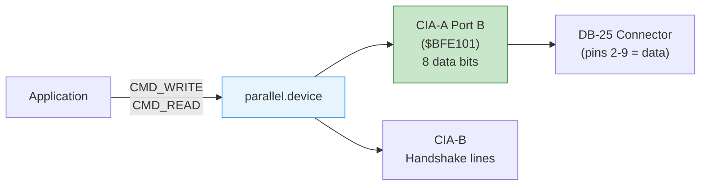

[← Home](../README.md) · [Devices](README.md)

# parallel.device — Centronics Parallel Port

## Overview

`parallel.device` provides I/O for the Amiga's Centronics-compatible 25-pin parallel port. Primarily used for printers, it also serves as a general-purpose 8-bit data port for hardware projects, dongles, MIDI interfaces, and inter-machine transfers (Laplink-style).

The parallel port is directly connected to **CIA-A** Port B data register (`$BFE101`) with handshake lines on CIA-A and CIA-B.



---

## Hardware Pinout

| Pin | Signal | Direction | Description |
|---|---|---|---|
| 1 | /STROBE | Output | Data strobe (active low) |
| 2–9 | D0–D7 | I/O | 8-bit bidirectional data |
| 10 | /ACK | Input | Acknowledge from printer |
| 11 | BUSY | Input | Printer busy |
| 12 | POUT | Input | Paper out |
| 13 | SELECT | Input | Printer selected |
| 14–17 | — | — | Reserved / unused |
| 18–25 | GND | — | Ground |

---

## Opening

```c
struct MsgPort *parPort = CreateMsgPort();
struct IOExtPar *par = (struct IOExtPar *)
    CreateIORequest(parPort, sizeof(struct IOExtPar));

if (OpenDevice("parallel.device", 0, (struct IORequest *)par, 0))
{
    Printf("Cannot open parallel.device\n");
    /* Port may be in use by another application (printer, etc.) */
}
```

> [!NOTE]
> Only **one** application can have the parallel port open at a time. If the port is busy (e.g., printer spooler has it), `OpenDevice` will fail. This is unlike serial.device which supports shared modes.

---

## Commands

| Code | Constant | Description |
|---|---|---|
| 2 | `CMD_READ` | Read bytes (bidirectional mode) |
| 3 | `CMD_WRITE` | Write bytes to the port |
| 5 | `CMD_CLEAR` | Clear internal buffers |
| 7 | `CMD_RESET` | Reset the device |
| 8 | `CMD_FLUSH` | Abort all pending I/O |
| 9 | `PDCMD_QUERY` | Get port status (busy, paper out, etc.) |
| 10 | `PDCMD_SETPARAMS` | Configure port parameters |

### Writing Data

```c
/* Send data to the parallel port: */
char printData[] = "Hello, Printer!\r\n";
par->IOPar.io_Command = CMD_WRITE;
par->IOPar.io_Data    = printData;
par->IOPar.io_Length  = sizeof(printData) - 1;
DoIO((struct IORequest *)par);

if (par->IOPar.io_Error)
    Printf("Write error: %ld\n", par->IOPar.io_Error);
```

### Querying Status

```c
par->IOPar.io_Command = PDCMD_QUERY;
DoIO((struct IORequest *)par);

UBYTE status = par->io_Status;
if (status & IOPTF_PARBUSY)   Printf("Printer busy\n");
if (status & IOPTF_PAPEROUT)  Printf("Paper out\n");
if (status & IOPTF_PARSEL)    Printf("Printer selected\n");
```

### Setting Parameters

```c
/* Configure for custom use (e.g., no handshaking): */
par->IOPar.io_Command = PDCMD_SETPARAMS;
par->io_ParFlags = PARF_SHARED;      /* shared access (OS 2.0+) */
DoIO((struct IORequest *)par);
```

---

## Direct Hardware Access

For hardware projects that need precise control (bypassing the device driver):

```c
/* Direct CIA-A Port B access: */
volatile UBYTE *ciaaPrb  = (UBYTE *)0xBFE101;  /* data register */
volatile UBYTE *ciaaDdrb = (UBYTE *)0xBFE301;  /* data direction */

/* Set all 8 bits as output: */
*ciaaDdrb = 0xFF;

/* Write a byte: */
*ciaaPrb = 0x42;

/* Set as input: */
*ciaaDdrb = 0x00;
UBYTE value = *ciaaPrb;
```

> [!CAUTION]
> Direct hardware access bypasses the OS completely. Do not mix direct register access with parallel.device operations — close the device first or don't open it at all.

---

## Common Uses

| Use Case | Method |
|---|---|
| Printer output | `CMD_WRITE` through printer.device (which opens parallel.device) |
| Hardware dongle | Direct CIA-A Port B register read |
| MIDI interface | Parallel-to-MIDI adapter with custom timing |
| Amiga-to-PC transfer | Laplink cable with ParNet or ParBench software |
| Sampling hardware | ADC/DAC connected to data lines |

---

## References

- NDK39: `devices/parallel.h`
- ADCD 2.1: parallel.device autodocs
- See also: [serial.md](serial.md) — serial port I/O
- See also: [cia_chips.md](../01_hardware/common/cia_chips.md) — CIA register details
