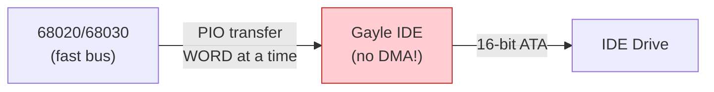

[← Home](../README.md) · [Devices](README.md)

# scsi.device — Hard Disk, CD-ROM, and Mass Storage I/O

## Overview

SCSI and IDE hard disks on the Amiga are accessed through `scsi.device` or compatible device drivers. The API is consistent across implementations — the same IORequest structure and commands work regardless of whether the underlying hardware is Commodore's native Gayle IDE, a Zorro SCSI card, or an accelerator-integrated controller.

---

## Disk Interfaces by Amiga Model

| Model | Interface | Controller | Device Name | Bandwidth Limit |
|---|---|---|---|---|
| A500 | None (stock) | — | — | Requires external SCSI card |
| A500+ | None (stock) | — | — | Requires external SCSI card |
| A600 | IDE (44-pin) | **Gayle** | `scsi.device` | ~1.5 MB/s (PIO, 16-bit CIA) |
| A1000 | None (stock) | — | — | Requires SCSI sidecar |
| A1200 | IDE (44-pin) | **Gayle** | `scsi.device` | ~1.5 MB/s (PIO) |
| A2000 | None (stock) | — | — | Zorro II SCSI cards |
| A3000 | SCSI (50-pin) | **WD33C93** | `scsi.device` | ~3 MB/s (DMA) |
| A4000 | IDE (40-pin) | **A4000 IDE** | `scsi.device` | ~2 MB/s (PIO) |
| A4000T | SCSI (50-pin) + IDE | **NCR 53C710** + IDE | `2nd.scsi.device` / `scsi.device` | ~10 MB/s (SCSI DMA) |
| CD32 | IDE (internal CD) | **Akiko** | `scsi.device` | ~1.5 MB/s |
| CDTV | SCSI (internal CD) | **DMAC + WD33C93** | `scsi.device` | ~150 KB/s (1× CD) |

### Why Native Bandwidth Is Limited

The A600/A1200 **Gayle** IDE interface is the most common and the most constrained:



| Bottleneck | Explanation |
|---|---|
| **No DMA** | Gayle has no DMA engine — every word must be moved by the CPU (`MOVE.W` loop) |
| **16-bit bus** | Gayle connects via 16-bit data path even on 32-bit CPUs |
| **PIO mode 0** | Stock Gayle supports only PIO mode 0 (~3.3 MB/s theoretical, ~1.5 MB/s actual) |
| **CIA timing** | CIA chip access introduces wait states |
| **CPU overhead** | 100% CPU utilisation during transfers — no multitasking during disk I/O |

### Community Solutions — Fast IDE

| Solution | Method | Improvement |
|---|---|---|
| **FastATA** (E-Matrix/Elbox) | Zorro SCSI/IDE card with DMA | Up to ~10 MB/s, frees CPU |
| **Buddha/Catweasel** | Clock port / Zorro IDE with optimised driver | ~2–3 MB/s, multiple IDE channels |
| **Blizzard SCSI** | Accelerator-integrated SCSI | Up to ~5 MB/s with DMA |
| **GVP Series II** | Zorro II SCSI with custom DMA ASIC | ~3 MB/s, DMA frees CPU |
| **A4091** | Zorro III SCSI (NCR 53C710) | **~10 MB/s** — fastest stock Amiga SCSI |
| **CF adapters** | CompactFlash in IDE socket | Same speed, but no mechanical seek latency |
| **SD/microSD** | Adapter on clock port | Varies, typically slow but no noise |

---

## Native vs. Vendor Drivers — Software Differences

All drivers expose the same `CMD_READ`/`CMD_WRITE`/`HD_SCSICMD` API, but internal differences matter:

| Aspect | Commodore `scsi.device` | Vendor Drivers (GVP, A4091, etc.) |
|---|---|---|
| **Source** | Commodore ROM or Devs: | Third-party (ships with hardware) |
| **DMA support** | None (Gayle PIO) | Often DMA-capable |
| **Interrupt handling** | Level 2 interrupt (CIA) | Card-specific interrupt level |
| **TD64 / NSD** | Added via patches | Often built-in from factory |
| **Multi-LUN** | Usually ignored | Proper LUN scanning on SCSI |
| **Disconnect/reselect** | Not supported (Gayle) | SCSI disconnect on good controllers |
| **Tagged queuing** | No | Some advanced SCSI controllers |
| **CD-ROM support** | Basic (atapi.device) | Full ATAPI/SCSI CD support |
| **Removable media** | Basic change detection | Proper unit attention handling |

> [!IMPORTANT]
> When writing software that accesses disks, **always use the device name from the mountlist** — don't hardcode `scsi.device`. Different systems use different device names for the same physical drive.

---

## Opening

```c
struct MsgPort *diskPort = CreateMsgPort();
struct IOStdReq *diskReq = (struct IOStdReq *)
    CreateIORequest(diskPort, sizeof(struct IOStdReq));

/* Unit 0 = first device on the bus (master/ID 0): */
if (OpenDevice("scsi.device", 0, (struct IORequest *)diskReq, 0))
{
    Printf("Cannot open scsi.device unit 0\n");
}
```

### Units

| Unit | SCSI Meaning | IDE Meaning |
|---|---|---|
| 0 | SCSI ID 0 | Master |
| 1 | SCSI ID 1 | Slave |
| 2–6 | SCSI ID 2–6 | N/A |
| 7 | Host adapter (reserved) | N/A |

---

## Standard Commands

```c
/* Read 512 bytes from byte offset on disk: */
diskReq->io_Command = CMD_READ;
diskReq->io_Data    = buffer;
diskReq->io_Length  = 512;
diskReq->io_Offset  = 0;           /* byte offset */
DoIO((struct IORequest *)diskReq);

/* Write: */
diskReq->io_Command = CMD_WRITE;
diskReq->io_Data    = buffer;
diskReq->io_Length  = 512;
diskReq->io_Offset  = 512;
DoIO((struct IORequest *)diskReq);

/* Flush write cache: */
diskReq->io_Command = CMD_UPDATE;
DoIO((struct IORequest *)diskReq);
```

> [!IMPORTANT]
> The `io_Offset` field is a `ULONG` (32-bit), limiting addressable space to **4 GB**. For larger drives, use TD64/NSD 64-bit commands.

---

## Direct SCSI Commands (HD_SCSICMD)

For operations beyond read/write — device identification, mode pages, CD-ROM commands:

```c
#include <devices/scsidisk.h>

struct SCSICmd scsicmd;
UBYTE cdb[10], sense[20], data[512];

/* READ(10) — read 1 sector at LBA 0: */
memset(cdb, 0, sizeof(cdb));
cdb[0] = 0x28;                    /* READ(10) opcode */
cdb[7] = 0; cdb[8] = 1;          /* transfer length = 1 sector */

scsicmd.scsi_Data       = (UWORD *)data;
scsicmd.scsi_Length      = 512;
scsicmd.scsi_Command     = cdb;
scsicmd.scsi_CmdLength   = 10;
scsicmd.scsi_Flags       = SCSIF_READ | SCSIF_AUTOSENSE;
scsicmd.scsi_SenseData   = sense;
scsicmd.scsi_SenseLength = sizeof(sense);

diskReq->io_Command = HD_SCSICMD;
diskReq->io_Data    = &scsicmd;
diskReq->io_Length  = sizeof(scsicmd);
DoIO((struct IORequest *)diskReq);

if (scsicmd.scsi_Status != 0)
    Printf("SCSI error: status=%ld, sense key=%ld\n",
           scsicmd.scsi_Status, sense[2] & 0x0F);
```

### Common SCSI Commands

| Opcode | Name | CDB | Description |
|---|---|---|---|
| `0x00` | TEST UNIT READY | 6 | Check device readiness |
| `0x03` | REQUEST SENSE | 6 | Get error details |
| `0x12` | INQUIRY | 6 | Device identification |
| `0x1A` | MODE SENSE(6) | 6 | Read device parameters |
| `0x25` | READ CAPACITY | 10 | Get total sectors and sector size |
| `0x28` | READ(10) | 10 | Read sectors (32-bit LBA) |
| `0x2A` | WRITE(10) | 10 | Write sectors |
| `0x35` | SYNCHRONIZE CACHE | 10 | Flush write cache |
| `0x43` | READ TOC | 10 | Read CD table of contents |
| `0xBE` | READ CD | 12 | Read CD sector (any format) |

---

## CD-ROM Specifics

CD-ROM drives require special handling — they use ATAPI (IDE) or SCSI commands but with CD-specific extensions:

### Opening a CD-ROM

```c
/* CD-ROM is typically on a different device or unit: */
/* A1200 + ATAPI CD: */
OpenDevice("scsi.device", 2, req, 0);  /* unit 2 = slave on second channel */

/* External SCSI CD: */
OpenDevice("2nd.scsi.device", 3, req, 0);  /* SCSI ID 3 */

/* AmiCDFS or CacheCDFS handles mounting automatically via:
   DEVS:DOSDrivers/CD0 mountlist entry */
```

### Reading the Table of Contents

```c
UBYTE tocData[804];  /* max TOC size */
memset(cdb, 0, 10);
cdb[0] = 0x43;       /* READ TOC */
cdb[6] = 1;          /* starting track */
cdb[7] = (sizeof(tocData) >> 8) & 0xFF;
cdb[8] = sizeof(tocData) & 0xFF;

scsicmd.scsi_Data      = (UWORD *)tocData;
scsicmd.scsi_Length     = sizeof(tocData);
scsicmd.scsi_Command    = cdb;
scsicmd.scsi_CmdLength  = 10;
scsicmd.scsi_Flags      = SCSIF_READ | SCSIF_AUTOSENSE;
DoIO((struct IORequest *)diskReq);
```

### Audio CD Playback

```c
/* PLAY AUDIO MSF — play from start to end: */
memset(cdb, 0, 10);
cdb[0] = 0x47;       /* PLAY AUDIO MSF */
cdb[3] = 0;          /* start minute */
cdb[4] = 2;          /* start second */
cdb[5] = 0;          /* start frame */
cdb[6] = 60;         /* end minute */
cdb[7] = 0;          /* end second */
cdb[8] = 0;          /* end frame */

scsicmd.scsi_Flags = SCSIF_READ;
DoIO((struct IORequest *)diskReq);
```

### CD Filesystem Drivers

| Driver | Type | Features |
|---|---|---|
| **AmiCDFS** | Commodore (stock) | Basic ISO 9660, slow |
| **CacheCDFS** | Third-party (popular) | ISO 9660 + Joliet + RockRidge, caching, fast |
| **AsimCDFS** | Third-party | Similar to CacheCDFS, commercial |

---

## 64-Bit Addressing (TD64 / NSD)

For drives larger than 4 GB:

```c
/* TD64 — uses io_Actual for high 32 bits: */
diskReq->io_Command = NSCMD_TD_READ64;
diskReq->io_Data    = buffer;
diskReq->io_Length  = 512;
diskReq->io_Offset  = lowOffset;      /* low 32 bits */
diskReq->io_Actual  = highOffset;     /* high 32 bits */
DoIO((struct IORequest *)diskReq);
```

> [!TIP]
> **New Style Device (NSD)** provides a standard way to query 64-bit support: send `NSCMD_DEVICEQUERY` and check the returned command list.

---

## MiSTer / FPGA Notes

| Aspect | Implementation |
|---|---|
| IDE emulation | MiSTer emulates Gayle IDE — presents virtual ATA backed by SD card `.hdf` |
| SCSI emulation | A2091/A3000 SCSI cores map targets to `.hdf` files |
| Sector size | Must be 512 bytes — all Amiga drivers assume this |
| RDB | Rigid Disk Block at sectors 0–15 — must be present for HDToolBox |
| Performance | Virtual IDE is faster than real Gayle (no PIO bottleneck) |

---

## References

- NDK39: `devices/scsidisk.h`, `devices/trackdisk.h`
- ADCD 2.1: scsi.device autodocs
- SCSI-2 standard: ANSI X3.131-1994
- See also: [trackdisk.md](trackdisk.md) — floppy I/O (shares the same API model)
- See also: [CDTV Hardware](../01_hardware/ocs_a500/cdtv_hardware.md) — DMAC/WD33C93 SCSI CD-ROM controller
- See also: [Akiko — CD32](../01_hardware/aga_a1200_a4000/akiko_cd32.md) — CD32 CD-ROM controller (Akiko PIO, not SCSI)
- See also: [Gayle IDE & PCMCIA](../01_hardware/common/gayle_ide_pcmcia.md) — A600/A1200 IDE controller
- See also: [Gary — A3000](../01_hardware/ecs_a600_a3000/gary_system_controller.md) — A3000 SDMAC/WD33C93 SCSI integration
