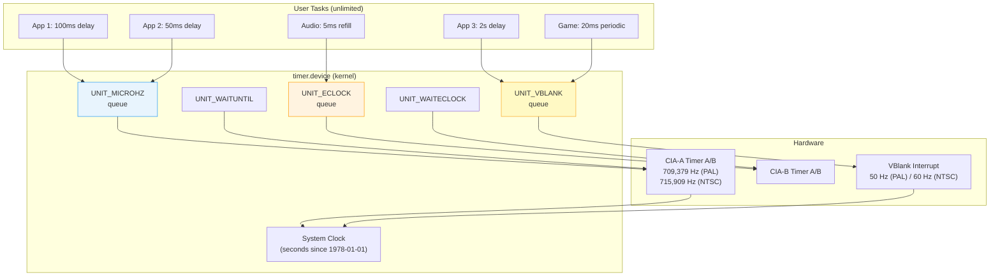
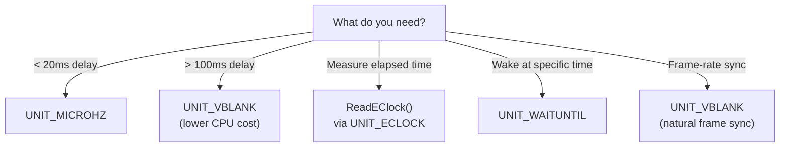
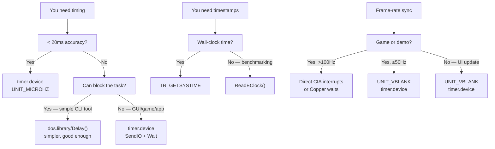

[← Home](../README.md) · [Devices](README.md)

# timer.device — Timing, Delays, and High-Resolution Timestamps

## Overview

`timer.device` is the system's central timing service — every delay, timeout, periodic callback, and timestamp on AmigaOS flows through it. Unlike most devices that map to one piece of hardware, timer.device **virtualises** two physical clock sources ([CIA timers](../01_hardware/common/cia_chips.md) and the vertical blank interrupt) into an unlimited number of independent timer requests.

> For low-level CIA register programming and hardware timer theory, see [CIA Chips — Hardware Reference](../01_hardware/common/cia_chips.md). This article covers the OS-level `timer.device` API that sits on top of that hardware.

**Key insight**: timer.device is **fully multiplexed**. Any number of tasks can have active timer requests simultaneously — the device maintains a sorted queue of pending requests and satisfies them from the same hardware clocks. There is no "one subscriber per timer" limit.

---

## System Architecture



### How Multiplexing Works

timer.device keeps a **sorted linked list** of pending requests per unit. When a `TR_ADDREQUEST` arrives:

1. The device calculates the absolute expiry time (current time + requested delay)
2. Inserts the request into the sorted queue
3. Programs the hardware timer to fire at the **soonest** expiry time
4. When the timer interrupt fires, the device scans the queue, replies all expired requests, and reprograms for the next one

This means 1000 applications can each have an active timer — the device just has one hardware timer firing at the nearest deadline. The overhead is the sorted insertion (O(n) in the worst case, but n is rarely large).

### Can You Run Out of Timer Resources?

**Short answer**: timer.device itself never runs out — you can queue an unlimited number of requests. But the **surrounding resources** can be exhausted:

| Resource | Limit | What Happens When Exhausted |
|---|---|---|
| **Signal bits** | **32 per task** (and ~16 are reserved by the system) | `CreateMsgPort()` returns NULL because `AllocSignal()` can't find a free bit. You can't create a new MsgPort — but you can share one port across multiple timers (see "Multiple Timers Per Task" below). |
| **Memory for IORequests** | Available RAM | `CreateIORequest()` returns NULL. Each `timerequest` is 40 bytes — you'd need thousands to notice. |
| **Queue depth (device internal)** | Unbounded linked list | Theoretically infinite. In practice, if you queue 10,000+ pending requests, the O(n) sorted insertion becomes noticeable — each new request must walk the list to find its insertion point. At ~50,000+ the system may feel sluggish. |
| **Hardware timers (CIA)** | 4 total (2 per CIA) | **Not your problem.** timer.device owns the hardware timers and virtualises them. You never directly compete for CIA timer resources — the device multiplexes everything internally. |
| **VBlank slots** | 1 per frame (50/60 Hz) | Not a resource limit — VBlank fires once per frame regardless of how many UNIT_VBLANK requests are queued. All expired requests are serviced in the same interrupt. |

**The real bottleneck is signal bits.** A task only has 32, and each `CreateMsgPort` consumes one. If your application already uses signals for windows, ARexx, commodities, and other devices, you may only have 5–10 left. The solution is **sharing a single MsgPort** across multiple timer requests and using `GetMsg()` to distinguish which timer fired (compare the reply message pointer to each `timerequest`).

> [!TIP]
> `OpenDevice("timer.device", ...)` itself never fails — timer.device is always available and has no "maximum open count". You can open it thousands of times. It's `CreateMsgPort` (signal bits) and `CreateIORequest` (memory) that can fail.

---

## Units — When to Use What

| Unit | Constant | Resolution | Clock Source | Best For |
|---|---|---|---|---|
| 0 | `UNIT_MICROHZ` | ~1.4 µs | CIA-A Timer A | Sub-millisecond delays, benchmarking |
| 1 | `UNIT_VBLANK` | 20 ms (PAL) / 16.7 ms (NTSC) | VBlank IRQ | Game loops, UI timeouts, long waits |
| 2 | `UNIT_ECLOCK` | ~1.4 µs | CIA-B Timer A | Highest resolution measurement (OS 2.0+) |
| 3 | `UNIT_WAITUNTIL` | absolute | System clock | Wake at specific wall-clock time |
| 4 | `UNIT_WAITECLOCK` | E-clock ticks | CIA | Wait until specific E-clock count |



> [!IMPORTANT]
> **UNIT_VBLANK has 20ms granularity** — requesting a 5ms delay will actually wait 0–20ms. For anything shorter than one frame, use UNIT_MICROHZ or UNIT_ECLOCK.

---

## Hardware Foundation

### CIA Timer Internals

| CIA | Base Address | Timer | E-Clock Frequency |
|---|---|---|---|
| CIA-A | `$BFE001` | Timer A, Timer B | 709,379 Hz (PAL) / 715,909 Hz (NTSC) |
| CIA-B | `$BFD000` | Timer A, Timer B | Same |

The **E-clock** is derived from the system clock ÷ 10:
- PAL: 7,093,790 Hz / 10 = **709,379 Hz** → tick = **1.410 µs**
- NTSC: 7,159,090 Hz / 10 = **715,909 Hz** → tick = **1.397 µs**

### VBlank Timing

UNIT_VBLANK is synchronized to the display's vertical blank interrupt:

| Standard | VBlank Rate | Period | Use |
|---|---|---|---|
| PAL | 50 Hz | 20.0 ms | European systems |
| NTSC | 60 Hz | 16.7 ms | American/Japanese systems |

VBlank is the natural heartbeat of the system — graphics updates, animation, and game logic are traditionally synced to it.

---

## Structures

```c
/* devices/timer.h — NDK39 */
struct timeval {
    ULONG tv_secs;    /* seconds (since midnight 1 Jan 1978) */
    ULONG tv_micro;   /* microseconds (0–999999) */
};

struct timerequest {
    struct IORequest tr_node;  /* standard I/O request header */
    struct timeval   tr_time;  /* delay/time value */
};

struct EClockVal {      /* OS 2.0+ */
    ULONG ev_hi;        /* high 32 bits of 64-bit tick counter */
    ULONG ev_lo;        /* low 32 bits */
};
```

---

## Proper Initialization and Shutdown

timer.device uses the standard Exec I/O model: a **MsgPort** for signal delivery, an **IORequest** to describe the operation, and an explicit **open/close** lifecycle. Every step matters — skipping any one causes subtle or catastrophic failures.

### Opening (The Right Way)

The correct sequence is: create a MsgPort (for reply signals) → create an IORequest (the "ticket" for timer operations) → open the device (binds the IORequest to the hardware). Each step depends on the previous one, so errors must unwind in reverse order:

```c
struct MsgPort *timerPort = CreateMsgPort();
if (!timerPort) { /* handle error */ }

struct timerequest *tr = (struct timerequest *)
    CreateIORequest(timerPort, sizeof(struct timerequest));
if (!tr) { DeleteMsgPort(timerPort); /* handle error */ }

BYTE err = OpenDevice("timer.device", UNIT_MICROHZ,
                       (struct IORequest *)tr, 0);
if (err != 0)
{
    DeleteIORequest((struct IORequest *)tr);
    DeleteMsgPort(timerPort);
    /* handle error — timer.device should always be available */
}

/* After opening, get TimerBase for utility functions: */
struct Library *TimerBase = (struct Library *)tr->tr_node.io_Device;
/* Now AddTime(), SubTime(), CmpTime(), ReadEClock() are available */
```

**Why each step is mandatory:**

| Shortcut | Consequence |
|---|---|
| Skip `CreateMsgPort` | No signal bit allocated → `Wait()` will never wake up. Or worse: signal bit 0 (CTRL-C) gets reused, causing random task termination. |
| Skip error check on `CreateIORequest` | NULL IORequest passed to `OpenDevice` → immediate crash (NULL pointer dereference in Exec). |
| Skip `OpenDevice` error check | If device can't open (e.g. wrong unit), the IORequest is uninitialized — any subsequent `DoIO`/`SendIO` writes to random memory → Guru Meditation. |
| Use `AllocMem` instead of `CreateIORequest` | IORequest fields (`io_Message.mn_ReplyPort`, `io_Message.mn_Length`) are not initialized → device replies to garbage address → memory corruption. |
| Not saving `TimerBase` | Can't call `AddTime`/`SubTime`/`CmpTime`/`ReadEClock` — they require the device's library base in A6. |

### Shutdown (The Right Way)

Shutdown must drain all pending I/O before freeing anything. The device's internal request queue holds a pointer to your IORequest — if you free it while it's still queued, the next timer interrupt dereferences freed memory.

```c
/* CRITICAL: abort any pending request before closing! */
if (!CheckIO((struct IORequest *)tr))
{
    AbortIO((struct IORequest *)tr);
    WaitIO((struct IORequest *)tr);   /* MUST wait even after abort */
}

CloseDevice((struct IORequest *)tr);
DeleteIORequest((struct IORequest *)tr);
DeleteMsgPort(timerPort);
```

**Why `AbortIO` + `WaitIO` — not just one or the other:**

- **`AbortIO` alone is not enough**: `AbortIO` marks the request for cancellation, but the device may be in the middle of processing it (e.g., inside the timer interrupt handler). The request isn't truly "done" until the device replies it back to your MsgPort. `WaitIO` collects that reply.
- **`WaitIO` alone is not enough**: If you `WaitIO` a request that has 5 minutes left, your task blocks for 5 minutes. `AbortIO` tells the device "cancel this immediately" so `WaitIO` returns right away.
- **Skipping both**: The IORequest stays in the device's sorted queue. When the timer fires later, the device writes to your (now freed) IORequest → memory corruption → delayed Guru Meditation, often in an unrelated task.

> [!WARNING]
> **Never call `CloseDevice` with a pending timer request.** This corrupts the device's internal queue and will eventually Guru Meditation. Always `AbortIO` + `WaitIO` first. This is the single most common timer.device bug in Amiga software.

---

## Use-Case Cookbook

### 1. Simple Blocking Delay

```c
/* Block the current task for exactly 2.5 seconds: */
tr->tr_node.io_Command = TR_ADDREQUEST;
tr->tr_time.tv_secs  = 2;
tr->tr_time.tv_micro = 500000;  /* 500ms */
DoIO((struct IORequest *)tr);
/* Task is now blocked — other tasks run during this time */
```

---

### 2. 2: Non-Blocking Timeout (UI Pattern)

The standard Intuition event loop with a timeout — essential for UI applications that need to update periodically:

```c
/* Classic Intuition event loop with timer: */
ULONG timerSig  = 1L << timerPort->mp_SigBit;
ULONG windowSig = 1L << window->UserPort->mp_SigBit;
BOOL timerPending = FALSE;

/* Start a 1-second timeout: */
tr->tr_node.io_Command = TR_ADDREQUEST;
tr->tr_time.tv_secs  = 1;
tr->tr_time.tv_micro = 0;
SendIO((struct IORequest *)tr);
timerPending = TRUE;

BOOL running = TRUE;
while (running)
{
    ULONG sigs = Wait(timerSig | windowSig | SIGBREAKF_CTRL_C);

    /* Handle window events: */
    if (sigs & windowSig)
    {
        struct IntuiMessage *msg;
        while ((msg = (struct IntuiMessage *)GetMsg(window->UserPort)))
        {
            switch (msg->Class)
            {
                case IDCMP_CLOSEWINDOW:
                    running = FALSE;
                    break;
                case IDCMP_GADGETUP:
                    HandleGadget(msg);
                    break;
            }
            ReplyMsg((struct Message *)msg);
        }
    }

    /* Handle timer expiry: */
    if (sigs & timerSig)
    {
        WaitIO((struct IORequest *)tr);
        timerPending = FALSE;

        /* --- Update UI clock, animation, status bar, etc. --- */
        UpdateStatusBar();

        /* Re-arm timer for next second: */
        tr->tr_node.io_Command = TR_ADDREQUEST;
        tr->tr_time.tv_secs  = 1;
        tr->tr_time.tv_micro = 0;
        SendIO((struct IORequest *)tr);
        timerPending = TRUE;
    }

    if (sigs & SIGBREAKF_CTRL_C)
        running = FALSE;
}

/* Clean shutdown: */
if (timerPending)
{
    AbortIO((struct IORequest *)tr);
    WaitIO((struct IORequest *)tr);
}
```

---

### 3. 3: Game/Demo Frame Sync (Periodic Timer)

```c
/* 50 Hz game loop synchronized to PAL frame rate: */
#define FRAME_USEC  20000  /* 1/50th second = 20ms */

void GameLoop(void)
{
    ULONG timerSig = 1L << timerPort->mp_SigBit;

    tr->tr_node.io_Command = TR_ADDREQUEST;
    tr->tr_time.tv_secs  = 0;
    tr->tr_time.tv_micro = FRAME_USEC;
    SendIO((struct IORequest *)tr);

    BOOL running = TRUE;
    while (running)
    {
        ULONG sigs = Wait(timerSig | SIGBREAKF_CTRL_C);

        if (sigs & timerSig)
        {
            WaitIO((struct IORequest *)tr);

            /* === Frame logic === */
            ReadInput();
            UpdatePhysics();
            RenderFrame();
            SwapBuffers();

            /* Re-arm for next frame: */
            tr->tr_time.tv_secs  = 0;
            tr->tr_time.tv_micro = FRAME_USEC;
            SendIO((struct IORequest *)tr);
        }

        if (sigs & SIGBREAKF_CTRL_C)
            running = FALSE;
    }

    AbortIO((struct IORequest *)tr);
    WaitIO((struct IORequest *)tr);
}
```

> **Demo effects**: For smooth copper-style effects at higher rates (100+ Hz), demos typically bypass timer.device entirely and use direct CIA timer interrupts or copper waits. timer.device is better suited for system-friendly applications.

---

### 4. 4: Audio Buffer Refill

```c
/* Double-buffered audio playback with timer-driven refill: */
#define AUDIO_BUFFER_MS  10  /* refill every 10ms */

void AudioRefillLoop(void)
{
    ULONG timerSig = 1L << timerPort->mp_SigBit;

    /* Use UNIT_MICROHZ for sub-frame precision: */
    tr->tr_node.io_Command = TR_ADDREQUEST;
    tr->tr_time.tv_secs  = 0;
    tr->tr_time.tv_micro = AUDIO_BUFFER_MS * 1000;
    SendIO((struct IORequest *)tr);

    while (!quit)
    {
        Wait(timerSig);
        WaitIO((struct IORequest *)tr);

        /* Fill the next audio DMA buffer: */
        FillAudioBuffer(currentBuffer);
        SwapAudioBuffers();

        /* Re-arm: */
        tr->tr_time.tv_secs  = 0;
        tr->tr_time.tv_micro = AUDIO_BUFFER_MS * 1000;
        SendIO((struct IORequest *)tr);
    }

    AbortIO((struct IORequest *)tr);
    WaitIO((struct IORequest *)tr);
}
```

---

### 5. 5: Benchmarking with ReadEClock

```c
/* Precise code benchmarking using E-clock: */
struct EClockVal start, end;
ULONG efreq = ReadEClock(&start);

/* --- Code to benchmark --- */
SortLargeArray(data, count);
/* --- End benchmark --- */

ReadEClock(&end);

/* Calculate elapsed microseconds: */
ULONG ticks = end.ev_lo - start.ev_lo;
ULONG usecs = (ULONG)((UQUAD)ticks * 1000000ULL / efreq);
Printf("Elapsed: %lu µs (%lu E-clock ticks at %lu Hz)\n",
       usecs, ticks, efreq);
```

---

### 6. 6: Getting System Time

```c
/* Read wall-clock time: */
tr->tr_node.io_Command = TR_GETSYSTIME;
DoIO((struct IORequest *)tr);
Printf("Seconds since 1978-01-01: %lu.%06lu\n",
       tr->tr_time.tv_secs, tr->tr_time.tv_micro);

/* Time arithmetic: */
struct timeval t1, t2, elapsed;
/* ... get t1, do work, get t2 ... */
elapsed = t2;
SubTime(&elapsed, &t1);
Printf("Operation took: %lu.%06lu s\n",
       elapsed.tv_secs, elapsed.tv_micro);

/* Compare times: */
LONG cmp = CmpTime(&t1, &t2);
/* Returns: -1 if t1 > t2, 0 if equal, +1 if t1 < t2 */
/* WARNING: return values are opposite to strcmp convention! */
```

---

## Multiple Timers Per Task

A single task can have **multiple simultaneous timer requests** — just use separate `timerequest` structures sharing the same MsgPort:

```c
/* Two independent timers on one port: */
struct timerequest *tr_fast = CreateIORequest(port, sizeof(*tr_fast));
struct timerequest *tr_slow = CreateIORequest(port, sizeof(*tr_slow));

OpenDevice("timer.device", UNIT_MICROHZ, (struct IORequest *)tr_fast, 0);

/* Clone the device for the second request: */
*tr_slow = *tr_fast;  /* copy device/unit/port */

/* Start both timers: */
tr_fast->tr_time.tv_micro = 50000;   /* 50ms — UI animation */
SendIO((struct IORequest *)tr_fast);

tr_slow->tr_time.tv_secs = 5;        /* 5s — autosave */
SendIO((struct IORequest *)tr_slow);

/* Wait for either: */
while (running)
{
    ULONG sigs = Wait(1L << port->mp_SigBit);
    struct Message *msg;
    while ((msg = GetMsg(port)))
    {
        if (msg == (struct Message *)tr_fast)
        {
            /* Fast timer expired — animate */
            WaitIO((struct IORequest *)tr_fast);
            AnimateUI();
            tr_fast->tr_time.tv_micro = 50000;
            SendIO((struct IORequest *)tr_fast);
        }
        else if (msg == (struct Message *)tr_slow)
        {
            /* Slow timer expired — autosave */
            WaitIO((struct IORequest *)tr_slow);
            AutoSave();
            tr_slow->tr_time.tv_secs = 5;
            SendIO((struct IORequest *)tr_slow);
        }
    }
}
```

---

## Named Antipatterns

### 1. "The Re-Arm Without Wait"

**What fails** — calling `SendIO` on a `timerequest` that is already pending:

```c
/* BROKEN — re-arming without draining the previous request */
tr->tr_time.tv_micro = 50000;
SendIO((struct IORequest *)tr);   /* starts first timer */

/* ... some code later ... */

tr->tr_time.tv_micro = 50000;
SendIO((struct IORequest *)tr);   /* 💥 IORequest is still queued! */
```

**Why it fails:** Each `timerequest` can hold exactly one pending I/O operation. A second `SendIO` while the first is still queued corrupts the device's internal linked list — the old node pointer is overwritten before the device has finished with it. The timer interrupt handler may dereference freed or duplicated list nodes, producing silent data corruption or a Guru Meditation.

**Correct:**

```c
/* Wait for previous to finish before re-arming: */
tr->tr_time.tv_micro = 50000;
SendIO((struct IORequest *)tr);

WaitIO((struct IORequest *)tr);   /* drain it */

/* Now safe to re-arm: */
tr->tr_time.tv_micro = 50000;
SendIO((struct IORequest *)tr);
```

For cases where you need overlapping timers, use **two `timerequest` structs** (see [Multiple Timers Per Task](#multiple-timers-per-task) above).

---

### 2. "The Abandoned Abort"

**What fails** — calling `AbortIO` but not following it with `WaitIO`:

```c
/* BROKEN — aborts but never collects the reply */
AbortIO((struct IORequest *)tr);
/* ... tr is now in limbo — still queued internally ... */
CloseDevice((struct IORequest *)tr);  /* 💥 queue corruption */
```

**Why it fails:** `AbortIO` *marks* the request for cancellation; it does not guarantee the request has been removed from the device's internal queue. The device may still be inside the timer interrupt handler processing your request. Only `WaitIO` confirms the device has replied the IORequest back to your MsgPort — *that* is when the request is truly done.

**Correct:**

```c
AbortIO((struct IORequest *)tr);   /* mark for cancellation */
WaitIO((struct IORequest *)tr);    /* collect the reply — always */
/* Now tr is truly free */
CloseDevice((struct IORequest *)tr);
```

---

### 3. "The Microsecond VBlank"

**What fails** — requesting sub-20 ms delays on `UNIT_VBLANK`:

```c
/* BROKEN — 5ms request on UNIT_VBLANK */
tr->tr_time.tv_micro = 5000;
DoIO((struct IORequest *)tr);
/* Actual delay: 0–20ms. At 50 Hz, it might return instantly! */
```

**Why it fails:** `UNIT_VBLANK` fires at 50 Hz (PAL) / 60 Hz (NTSC) — one pulse every 20 ms or 16.7 ms. A request for 5 ms is rounded down to the next VBlank tick, which may already be pending. The call can return in **zero time** if a VBlank was imminent, giving the caller the false impression that a 5 ms delay was satisfied.

**Correct:**

```c
/* Use UNIT_MICROHZ for sub-20ms delays */
/* Original OpenDevice must specify UNIT_MICROHZ */
tr->tr_time.tv_micro = 5000;       /* 5ms */
DoIO((struct IORequest *)tr);      /* actually waits ~5ms */
```

---

### 4. "The Naked ReadEClock"

**What fails** — calling `ReadEClock()` without opening timer.device:

```c
/* BROKEN — TimerBase is NULL */
struct EClockVal start;
ReadEClock(&start);   /* 💥 writes to A6-relative memory at NULL */
```

**Why it fails:** `ReadEClock()` is a utility function that requires `TimerBase` in A6 (the timer.device library base). The library base is set in `io_Device` when `OpenDevice` returns — until then, `TimerBase` is NULL. The call dereferences through address 0 + function offset, crashing immediately.

**Correct:**

```c
/* Open the device first to obtain TimerBase */
BYTE err = OpenDevice("timer.device", UNIT_MICROHZ,
                       (struct IORequest *)tr, 0);
struct Library *TimerBase = (struct Library *)tr->tr_node.io_Device;
/* Now ReadEClock() is available */
struct EClockVal start;
ReadEClock(&start);
```

---

### 5. "The Hard-Coded Hertz"

**What fails** — hardcoding PAL E-clock frequency instead of querying it:

```c
/* BROKEN — assumes PAL */
#define ECLOCK_FREQ  709379
ULONG usecs = ticks * 1000000 / ECLOCK_FREQ;
/* Wrong on NTSC systems — 0.9% error */
```

**Why it fails:** The E-clock frequency differs between PAL (709,379 Hz) and NTSC (715,909 Hz). A hardcoded constant produces a ~0.9% timing error on the opposite video standard. Worse, future hardware (FPGA reimplementations, overclocked systems) may use a different master clock entirely.

**Correct:**

```c
ULONG efreq = ReadEClock(&start);   /* returns actual frequency */
/* ... do work ... */
ReadEClock(&end);
ULONG ticks = end.ev_lo - start.ev_lo;
ULONG usecs = (ULONG)((UQUAD)ticks * 1000000ULL / efreq);
```

---

### 6. "The Spin Loop"

**What fails** — polling in a loop instead of using signals:

```c
/* BROKEN — burns 100% CPU */
while (!timeout_expired)
{
    /* Do nothing, check timer, repeat — CPU never sleeps */
    if (CheckIO((struct IORequest *)tr))
        timeout_expired = TRUE;
}
```

**Why it fails:** The CPU runs continuously, stealing cycles from every other task in the system. On a single-core Amiga with preemptive multitasking, this starves every lower-priority task — no window redraws, no mouse movement, no disk I/O. The timer will still fire (it's hardware-driven), but the CPU spent every microsecond between now and then doing nothing useful.

**Correct:**

```c
/* CPU sleeps until timer or other signals arrive */
ULONG sigs = Wait(timerSig | windowSig | SIGBREAKF_CTRL_C);
if (sigs & timerSig)
{
    WaitIO((struct IORequest *)tr);
    timeout_expired = TRUE;
}
```

---

### 7. "The Leaky Shutdown"

**What fails** — calling `CloseDevice` with a still-pending timer:

```c
/* BROKEN — 5-second timer still queued internally */
tr->tr_time.tv_secs = 5;
SendIO((struct IORequest *)tr);
CloseDevice((struct IORequest *)tr);   /* 💥 queue corruption */
DeleteIORequest((struct IORequest *)tr);
/* When the 5-second timer fires, it writes to freed memory */
```

**Why it fails:** The device's internal sorted linked list still holds a pointer to your `timerequest`. When the timer interrupt eventually fires (5 seconds from now, or immediately if a shorter timer triggers a queue scan), the device replies to freed memory. This produces a **delayed Guru Meditation** — often in a completely unrelated task, making debugging nearly impossible.

**Correct:**

```c
if (!CheckIO((struct IORequest *)tr))
{
    AbortIO((struct IORequest *)tr);   /* cancel */
    WaitIO((struct IORequest *)tr);    /* drain */
}
CloseDevice((struct IORequest *)tr);   /* now safe */
DeleteIORequest((struct IORequest *)tr);
```

---

### 8. "The `Delay()` Dependency"

`dos.library/Delay()` is a convenience wrapper that uses timer.device internally, but with **fixed restrictions**:

```c
/* BROKEN in event loops — blocks entire process */
Delay(25);  /* 0.5s — can't check windows, ARexx, signals! */
```

**Why it fails:**
- **Locked to UNIT_VBLANK** — 20 ms granularity, no sub-frame precision
- **Blocks the process** — no signal checking possible during the wait
- **Takes ticks, not milliseconds** — `Delay(50)` = 1 second at 50 Hz. NTSC users get different durations from the same numeric argument
- **DOS/Packet-level** — uses the DOS packet system, adding latency vs direct `timer.device` access

Use `Delay()` only in trivial CLI tools where you don't need to respond to anything during the wait. For all GUI applications, game loops, and multi-signal event handlers, use timer.device directly with `SendIO` + `Wait`.

---

## Best Practices

1. **Always `AbortIO` + `WaitIO` before `CloseDevice`** — never skip the drain. This is the #1 timer crash vector on Amiga.
2. **Check `TimerBase` validity once after `OpenDevice`** — if the open fails, don't call `ReadEClock`/`AddTime`/`SubTime`.
3. **Use `ReadEClock` frequency for calculations** — never hardcode 709,379 or 715,909. Let the hardware tell you.
4. **Share one MsgPort across multiple `timerequest`s** — signal bits are scarce (32 per task, ~16 reserved). One MsgPort serves unlimited timers.
5. **Use UNIT_VBLANK for anything ≥ 100 ms** — the lower CPU cost of a 50/60 Hz interrupt matters at scale.
6. **Use UNIT_MICROHZ for anything < 20 ms** — VBlank granularity makes short delays unpredictable.
7. **Never call `SendIO` until `WaitIO` has confirmed the previous request is done** — or use separate `timerequest` structs.
8. **`WaitIO` after `AbortIO` even if aborted** — nothing is truly done until the device replies.
9. **Use `SendIO` + `Wait` for responsive apps** — never `DoIO` in event loops; it blocks the whole task.
10. **Don't assume PAL or NTSC** — always query the actual hardware frequency.

---

## When to Use / When NOT to Use



| Scenario | Recommended | Why |
|---|---|---|
| One-shot 2.5s blocking wait | `DoIO` + unit of choice | Simplest; blocks task but allows multitasking |
| UI clock tick every 1s | `SendIO` + `Wait(signals)` | CPU sleeps between ticks, still handles window events |
| Game loop at 50 Hz | UNIT_MICROHZ or UNIT_VBLANK | 20ms frame budget; VBlank sync is natural |
| Audio buffer refill every 10ms | UNIT_MICROHZ | Sub-frame precision matters for audio |
| Code benchmarking | `ReadEClock()` | 1.4 µs resolution, query frequency don't hardcode |
| Wake at specific wall-clock time | `UNIT_WAITUNTIL` | Compare `timeval` against current time |
| CLI tool: sleep 2 seconds | `Delay(100)` or `DoIO` | Simpler; doesn't need signal loop |
| 100+ Hz demo effect | Direct CIA or Copper | timer.device overhead is too high for sub-millisecond rates |

---

## FPGA & MiSTer Impact

timer.device's behavior is tightly coupled to the CIA chip's E-clock, which is derived from the system clock. On FPGA reimplementations (MiSTer Minimig core, Vampire V4), timer accuracy depends on how faithfully the E-clock is reproduced.

| Aspect | Real Hardware | FPGA (MiSTer) | FPGA (Vampire) |
|---|---|---|---|
| **E-Clock source** | 28.375 MHz crystal ÷ 40 | Same division in Minimig core | Derived from SAGA PLL |
| **UNIT_MICROHZ precision** | ±1 E-clock tick (1.4 µs) | Matches when cycle-accurate | Can drift if SAGA clock ≠ 28.375 |
| **VBlank rate** | 50.0 Hz (PAL) / 59.94 Hz (NTSC) | 50.0 Hz / 60.0 Hz (sometimes integer) | Configurable (50/60/100+ Hz) |
| **CIA timer count-in** | E-clock synchronous to 68000 bus | Minimig core replicates CIA faithfully | SAGA CIA reimplementation may differ |
| **`Delay()` behavior** | Tied to INTB_VERTB | Same on Minimig | May break if VBlank rate is non-standard |
| **`ReadEClock()` returns** | 709,379 or 715,909 | Should match real hardware | May return Vampire-specific value |

### What to check on FPGA

- **E-Clock frequency**: `ReadEClock()` must return the correct value for timer software to calculate microseconds correctly. If the FPGA core uses a slightly different master clock, all timer-based delays shift proportionally.
- **CIA-A timer A ownership**: timer.device monopolizes CIA-A Timer A for the system clock. On Minimig, confirm that no other core component writes to `$BFE401`/`$BFE501`.
- **VBlank interrupt → CIAB TOD**: The VBlank interrupt handler increments the CIA-B Time-of-Day clock, which feeds `TR_GETSYSTIME`. On FPGA cores with non-standard refresh rates (e.g. 100 Hz PAL), the system clock runs fast.
- **Cycle-exact CIA behavior**: The Minimig CIA implementation must handle timer reload, one-shot vs continuous mode, and count-in synchronization identically to real 8520 CIAs.

> [!NOTE]
> Most MiSTer Minimig core builds replicate CIA timers cycle-accurately from the TG68K soft CPU's perspective. The bigger issue is **non-standard refresh rates** (50 Hz forced on NTSC, or custom PAL modes) that shift the relationship between VBlank and wall-clock time.

---

## Historical Context & Modern Analogies

### 1985 Competitive Landscape

| Platform | Timing | Precision | Notes |
|---|---|---|---|
| **Amiga (timer.device)** | Multiplexed virtual timers | 1.4 µs (CIA) + 20 ms (VBlank) | Any number of tasks share 2 hardware timers |
| **C64 (CIA timers)** | Two CIA 6526 timers | 1 µs | 2 hardware timers only — no virtualisation |
| **MS-DOS (PC XT/AT)** | Intel 8254 PIT | 0.838 µs | Single programmable timer at 1.193182 MHz; shared by system clock, DRAM refresh, PC speaker — one subscriber at a time |
| **Atari ST (MFP 68901)** | 4 timers + 200 Hz system timer | 0.8 µs (MFP) / 5 ms (200 Hz) | Four hardware timers; no OS-level virtualisation in TOS |
| **Mac 128K/512K (6522 VIA)** | Two 6522 timers | Cycles at 7.8336 MHz | Used for serial I/O timing and cursor blinking; no developer-facing timer API |
| **Amiga timer.device innovation** | **Virtualisation** — 2 CIA timers + VBlank serve unlimited tasks | — | Nothing else on a consumer machine did this |

### Why Virtualised Timers Mattered

On every contemporary platform, a timer was a **scarce resource** — you had 1–4 hardware timers, period. If two applications needed a timer, they fought. The Amiga's timer.device solved this with multiplexed queues: every `TR_ADDREQUEST` gets inserted into a sorted list, the hardware timer fires at the nearest deadline, and *all* expired requests get replied in one interrupt handler pass.

This meant a clock widget could tick every second, a game could run at 50 Hz, an audio mixer could refill buffers every 10 ms, a network stack could track TCP retransmit timeouts, and an ARexx script could `WAIT 5 SEC` — **all simultaneously**, on a 7 MHz 68000 with 512 KB of RAM. This was unprecedented on a consumer microcomputer in 1985.

### Modern Analogies

| Amiga Concept | Modern Equivalent | Similarity | Key Difference |
|---|---|---|---|
| `UNIT_MICROHZ` + `SendIO` | `setTimeout()` / `setInterval()` (JS) | Async callback at specified delay | JavaScript timers use the libuv event loop, not hardware interrupts |
| `UNIT_VBLANK` | `requestAnimationFrame()` | Schedules work to align with display refresh | `requestAnimationFrame` is for rendering only; `UNIT_VBLANK` is general-purpose |
| `UNIT_WAITUNTIL` | `clock_nanosleep(TIMER_ABSTIME)` (POSIX) | Wake at absolute wall-clock time | POSIX uses CLOCK_REALTIME; timer.device uses CIA + VBlank |
| `ReadEClock()` | `rdtsc` (x86) / `mach_absolute_time()` (macOS) | CPU timestamp counter for benchmarking | Modern APIs return ticks; timer.device also returns ticks/second for µs conversion |
| `AddTime` / `SubTime` / `CmpTime` | `clock_gettime` + `timespec` arithmetic | Time interval computation | POSIX uses 64-bit ns; timer.device uses 32-bit seconds + microseconds |
| timer.device multiplexing | Linux kernel timer wheels | One hardware timer, unlimited virtual | Same principle — sorted expiry queues driving a single hardware clock |
| `MsgPort` signal delivery | epoll / kqueue / IOCP | Wait for one of several event sources to fire | Same pattern: sleep on multiple sources, wake when any is ready |

> **Notable absence**: Modern OSes do not expose a raw hardware tick counter directly to user space — high-resolution timing requires `clock_gettime()` or platform-specific monotonic clock APIs. The Amiga gave every application direct access to the 1.4 µs E-Clock counter through `ReadEClock()`, which was both powerful and dangerous (no privilege separation).

---

## FAQ

### Q: Do I need to open timer.device separately for each unit?
**No.** One `OpenDevice` call binds one IORequest to one unit. For a different unit, open again with a separate IORequest. Multiple `SendIO` calls on the same IORequest must be for the same unit.

### Q: Does UNIT_VBLANK guarantee exactly-frame pacing?
**No.** A UNIT_VBLANK request fires at the *next* VBlank interrupt. If the interrupt handler for one VBlank takes 18 ms (because 50 expired requests are being replied), the next UNIT_VBLANK request you send immediately after `WaitIO` may already be 2 ms from expiring. VBlank is frame-synchronous, not frame-precise.

### Q: Is `ReadEClock()` monotonic?
**No.** `ReadEClock()` returns the raw 64-bit E-Clock tick counter, which is derived from the CIA's free-running hardware timer. It wraps when the low 32 bits overflow (every ~6,040 seconds ≈ 100 minutes at 709 kHz). Use 64-bit subtraction with wrap-around awareness for interval measurement.

### Q: Can I use timer.device inside an interrupt handler?
**No.** timer.device uses MsgPorts and signals, which require a valid task context. In an interrupt handler there is no task context — you cannot call `Wait` or receive messages. Use direct CIA timer programming or the Copper for interrupt-level timing.

### Q: Why does my 50 Hz game loop drift over time?
Each frame fires `SendIO` → `Wait` → `WaitIO` → game logic → `SendIO` again. The 20 ms timer starts *after* `SendIO`, not after the previous frame's deadline. Frame work (input, physics, rendering) takes variable N ms → frame period = 20 + N ms → you lose synchronization every frame. For locked frame rates, use `ReadEClock` to measure frame execution time and adjust the *next* delay to absorb the variable overhead.

### Q: timer.device or `SetSignal` for self-wakeup?
`Signal` + `SetSignal` + `Wait` can also implement timed behavior, but is more cumbersome: you must manually set a signal bit on your own task and embed the timing logic in a software loop. timer.device provides a cleaner abstraction with the full `timeval` API and hardware-backed precision.

### Q: Does `OpenDevice("timer.device", ...)` ever fail?
**Effectively never.** timer.device is built into the Kickstart ROM and has no artificial open limit — there is no "maximum open count." `OpenDevice()` can theoretically return `IOERR_OPENFAIL` if the unit number is invalid, but otherwise always succeeds.

---

## References

- NDK39: `devices/timer.h`
- ADCD 2.1: timer.device autodocs
- HRM: CIA timer chapter
- See also: [CIA Chips — Hardware Reference](../01_hardware/common/cia_chips.md) — low-level CIA timer programming
- See also: [interrupts.md](../06_exec_os/interrupts.md) — VBlank interrupt chain
- See also: [multitasking.md](../06_exec_os/multitasking.md) — task scheduling and signals
- See also: [semaphores.md](../06_exec_os/semaphores.md) — `Procure`/`Vacate` with timeout via timer signals
- See also: [signals.md](../06_exec_os/signals.md) — `Wait()` with multiple signal sources
- See also: [audio.md](audio.md) — audio buffer refill timing