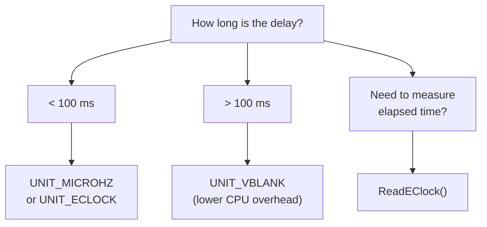

[← Home](../README.md) · [Devices](README.md)

# timer.device — Timing, Delays, and High-Resolution Timestamps

## Overview

`timer.device` provides all timing services on AmigaOS: delays, system clock queries, and high-resolution timestamps. It interfaces with two independent hardware sources — the **CIA timers** (microsecond resolution) and the **vertical blank interrupt** (frame-rate resolution).

---

## Units

| Unit | Constant | Resolution | Clock Source | Use Case |
|---|---|---|---|---|
| 0 | `UNIT_MICROHZ` | ~1.4 µs (E-clock tick) | CIA-A Timer A | Short, precise delays |
| 1 | `UNIT_VBLANK` | ~20 ms (PAL) / ~16.7 ms (NTSC) | VBlank interrupt | Long delays, low CPU overhead |
| 2 | `UNIT_ECLOCK` | ~1.4 µs | CIA-B Timer A | Highest resolution timing (OS 2.0+) |
| 3 | `UNIT_WAITUNTIL` | absolute time | System clock | Wait until specific wall-clock time |
| 4 | `UNIT_WAITECLOCK` | E-clock absolute | CIA | Wait until specific E-clock value |

### Which Unit to Use?



---

## Hardware Foundation

### CIA Timer Internals

The timing hardware lives in the two CIA (Complex Interface Adapter) chips:

| CIA | Base | Timer | E-Clock Frequency |
|---|---|---|---|
| CIA-A | `$BFE001` | Timer A, Timer B | 709,379 Hz (PAL) / 715,909 Hz (NTSC) |
| CIA-B | `$BFD000` | Timer A, Timer B | Same |

The **E-clock** is derived from the system clock ÷ 10 (PAL: 7,093,790 / 10 = 709,379 Hz). Each tick is ~1.4 µs.

```c
/* E-clock ticks per second: */
#define ECLOCK_PAL   709379
#define ECLOCK_NTSC  715909

/* Example: 100 ms delay = 70,938 ticks (PAL) */
```

### VBlank Timing

UNIT_VBLANK piggybacks on the vertical blank interrupt — one tick per video frame:

| Standard | VBlank Rate | Resolution |
|---|---|---|
| PAL | 50 Hz | 20.0 ms |
| NTSC | 60 Hz | 16.7 ms |

---

## Structures

```c
/* devices/timer.h — NDK39 */
struct timeval {
    ULONG tv_secs;    /* seconds */
    ULONG tv_micro;   /* microseconds (0–999999) */
};

struct timerequest {
    struct IORequest tr_node;
    struct timeval   tr_time;
};
/* sizeof(timerequest) = sizeof(IORequest) + 8 */
```

### EClockVal (OS 2.0+)

```c
struct EClockVal {
    ULONG ev_hi;  /* high 32 bits of 64-bit tick counter */
    ULONG ev_lo;  /* low 32 bits */
};
```

---

## Opening timer.device

```c
struct MsgPort *timerPort = CreateMsgPort();
struct timerequest *tr = (struct timerequest *)
    CreateIORequest(timerPort, sizeof(struct timerequest));

BYTE err = OpenDevice("timer.device", UNIT_MICROHZ,
                       (struct IORequest *)tr, 0);
if (err != 0) { /* handle error */ }

/* IMPORTANT: after opening, you can get TimerBase for direct calls: */
struct Library *TimerBase = (struct Library *)tr->tr_node.io_Device;
/* Now you can call AddTime(), SubTime(), CmpTime(), ReadEClock() */
```

---

## Simple Delay

```c
/* Block the current task for exactly 2.5 seconds: */
tr->tr_node.io_Command = TR_ADDREQUEST;
tr->tr_time.tv_secs  = 2;
tr->tr_time.tv_micro = 500000;  /* 0.5 sec */
DoIO((struct IORequest *)tr);    /* blocks until done */
```

### Non-Blocking Delay

```c
/* Start delay, continue doing work, then wait: */
tr->tr_node.io_Command = TR_ADDREQUEST;
tr->tr_time.tv_secs  = 0;
tr->tr_time.tv_micro = 100000;  /* 100 ms */
SendIO((struct IORequest *)tr);  /* non-blocking */

/* ... do other work ... */

/* Check if timer expired: */
if (CheckIO((struct IORequest *)tr))
{
    WaitIO((struct IORequest *)tr);  /* collect result */
    /* timer expired */
}
```

### Signal-Based Waiting

```c
/* Wait for timer OR user input: */
ULONG timerSig = 1L << timerPort->mp_SigBit;
ULONG windowSig = 1L << window->UserPort->mp_SigBit;

SendIO((struct IORequest *)tr);

ULONG sigs = Wait(timerSig | windowSig);
if (sigs & timerSig) {
    WaitIO((struct IORequest *)tr);
    /* handle timeout */
}
if (sigs & windowSig) {
    AbortIO((struct IORequest *)tr);
    WaitIO((struct IORequest *)tr);
    /* handle window event */
}
```

---

## Getting Current Time

```c
/* Get system time (wall clock since midnight Jan 1, 1978): */
tr->tr_node.io_Command = TR_GETSYSTIME;
DoIO((struct IORequest *)tr);
Printf("Time: %lu.%06lu seconds since epoch\n",
       tr->tr_time.tv_secs, tr->tr_time.tv_micro);
```

### Time Arithmetic

```c
/* After opening timer.device and getting TimerBase: */
struct timeval t1, t2, diff;

/* Measure elapsed time: */
tr->tr_node.io_Command = TR_GETSYSTIME;
DoIO((struct IORequest *)tr);
t1 = tr->tr_time;

/* ... do work ... */

DoIO((struct IORequest *)tr);
t2 = tr->tr_time;

/* Compute difference: */
diff = t2;
SubTime(&diff, &t1);
Printf("Elapsed: %lu.%06lu s\n", diff.tv_secs, diff.tv_micro);

/* Compare times: */
LONG cmp = CmpTime(&t1, &t2);  /* <0: t1<t2, 0: equal, >0: t1>t2 */
```

---

## High-Resolution Timing (ReadEClock)

```c
/* Most precise timing available — E-clock resolution: */
struct EClockVal start, end;
ULONG efreq = ReadEClock(&start);  /* returns ticks/second */

/* ... code to benchmark ... */

ReadEClock(&end);

/* Compute elapsed microseconds: */
ULONG ticks = end.ev_lo - start.ev_lo;  /* assumes <4 billion ticks */
ULONG usecs = ticks * 1000000 / efreq;
Printf("Elapsed: %lu µs (E-clock freq: %lu Hz)\n", usecs, efreq);
```

| Standard | E-clock Freq | Tick Resolution |
|---|---|---|
| PAL | 709,379 Hz | ~1.410 µs |
| NTSC | 715,909 Hz | ~1.397 µs |

---

## Periodic Timer (Game Loop / Audio Refill)

```c
/* Classic pattern: periodic callback using timer.device */
#define FRAME_USEC  20000  /* 50 Hz (PAL frame rate) */

void GameLoop(void)
{
    ULONG timerSig = 1L << timerPort->mp_SigBit;

    /* Kick off first timer request: */
    tr->tr_node.io_Command = TR_ADDREQUEST;
    tr->tr_time.tv_secs  = 0;
    tr->tr_time.tv_micro = FRAME_USEC;
    SendIO((struct IORequest *)tr);

    BOOL running = TRUE;
    while (running)
    {
        ULONG sigs = Wait(timerSig | SIGBREAKF_CTRL_C);

        if (sigs & timerSig)
        {
            WaitIO((struct IORequest *)tr);

            /* --- Game logic here --- */
            UpdateGame();
            RenderFrame();

            /* Re-arm timer: */
            tr->tr_time.tv_secs  = 0;
            tr->tr_time.tv_micro = FRAME_USEC;
            SendIO((struct IORequest *)tr);
        }

        if (sigs & SIGBREAKF_CTRL_C)
            running = FALSE;
    }

    AbortIO((struct IORequest *)tr);
    WaitIO((struct IORequest *)tr);
}
```

---

## Common Pitfalls

| Pitfall | Problem | Solution |
|---|---|---|
| Reusing active IORequest | Sending a `TR_ADDREQUEST` while previous is pending | Use two timerequest structs, or `WaitIO` first |
| Forgetting `WaitIO` after `AbortIO` | Leaves IORequest in limbo — crash on next use | Always `WaitIO` after `AbortIO`, even if aborted |
| Using `UNIT_VBLANK` for short delays | 20 ms granularity — actual delay is 0 to 20 ms | Use `UNIT_MICROHZ` for sub-20ms precision |
| Not opening timer for `ReadEClock` | `TimerBase` is NULL — crash | Must `OpenDevice` first to get `TimerBase` |
| Ignoring PAL/NTSC differences | Hardcoded periods wrong on other standard | Use `ReadEClock()` frequency for calculations |

---

## References

- NDK39: `devices/timer.h`
- ADCD 2.1: timer.device autodocs
- HRM: CIA timer chapter
- See also: [interrupts.md](../06_exec_os/interrupts.md) — VBlank interrupt chain
