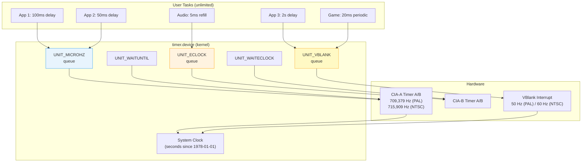
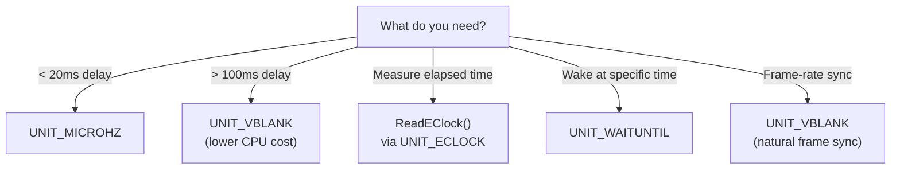

[← Home](../README.md) · [Devices](README.md)

# timer.device — Timing, Delays, and High-Resolution Timestamps

## Overview

`timer.device` is the system's central timing service — every delay, timeout, periodic callback, and timestamp on AmigaOS flows through it. Unlike most devices that map to one piece of hardware, timer.device **virtualises** two physical clock sources ([CIA timers](../01_hardware/common/cia_chips.md) and the vertical blank interrupt) into an unlimited number of independent timer requests.

> For low-level CIA register programming and hardware timer theory, see [CIA Chips — Hardware Reference](../01_hardware/common/cia_chips.md). This article covers the OS-level `timer.device` API that sits on top of that hardware.

**Key insight**: timer.device is **fully multiplexed**. Any number of tasks can have active timer requests simultaneously — the device maintains a sorted queue of pending requests and satisfies them from the same hardware clocks. There is no "one subscriber per timer" limit.

---

## System Architecture



### How Multiplexing Works

timer.device keeps a **sorted linked list** of pending requests per unit. When a `TR_ADDREQUEST` arrives:

1. The device calculates the absolute expiry time (current time + requested delay)
2. Inserts the request into the sorted queue
3. Programs the hardware timer to fire at the **soonest** expiry time
4. When the timer interrupt fires, the device scans the queue, replies all expired requests, and reprograms for the next one

This means 1000 applications can each have an active timer — the device just has one hardware timer firing at the nearest deadline. The overhead is the sorted insertion (O(n) in the worst case, but n is rarely large).

### Can You Run Out of Timer Resources?

**Short answer**: timer.device itself never runs out — you can queue an unlimited number of requests. But the **surrounding resources** can be exhausted:

| Resource | Limit | What Happens When Exhausted |
|---|---|---|
| **Signal bits** | **32 per task** (and ~16 are reserved by the system) | `CreateMsgPort()` returns NULL because `AllocSignal()` can't find a free bit. You can't create a new MsgPort — but you can share one port across multiple timers (see "Multiple Timers Per Task" below). |
| **Memory for IORequests** | Available RAM | `CreateIORequest()` returns NULL. Each `timerequest` is 40 bytes — you'd need thousands to notice. |
| **Queue depth (device internal)** | Unbounded linked list | Theoretically infinite. In practice, if you queue 10,000+ pending requests, the O(n) sorted insertion becomes noticeable — each new request must walk the list to find its insertion point. At ~50,000+ the system may feel sluggish. |
| **Hardware timers (CIA)** | 4 total (2 per CIA) | **Not your problem.** timer.device owns the hardware timers and virtualises them. You never directly compete for CIA timer resources — the device multiplexes everything internally. |
| **VBlank slots** | 1 per frame (50/60 Hz) | Not a resource limit — VBlank fires once per frame regardless of how many UNIT_VBLANK requests are queued. All expired requests are serviced in the same interrupt. |

**The real bottleneck is signal bits.** A task only has 32, and each `CreateMsgPort` consumes one. If your application already uses signals for windows, ARexx, commodities, and other devices, you may only have 5–10 left. The solution is **sharing a single MsgPort** across multiple timer requests and using `GetMsg()` to distinguish which timer fired (compare the reply message pointer to each `timerequest`).

> [!TIP]
> `OpenDevice("timer.device", ...)` itself never fails — timer.device is always available and has no "maximum open count". You can open it thousands of times. It's `CreateMsgPort` (signal bits) and `CreateIORequest` (memory) that can fail.

---

## Units — When to Use What

| Unit | Constant | Resolution | Clock Source | Best For |
|---|---|---|---|---|
| 0 | `UNIT_MICROHZ` | ~1.4 µs | CIA-A Timer A | Sub-millisecond delays, benchmarking |
| 1 | `UNIT_VBLANK` | 20 ms (PAL) / 16.7 ms (NTSC) | VBlank IRQ | Game loops, UI timeouts, long waits |
| 2 | `UNIT_ECLOCK` | ~1.4 µs | CIA-B Timer A | Highest resolution measurement (OS 2.0+) |
| 3 | `UNIT_WAITUNTIL` | absolute | System clock | Wake at specific wall-clock time |
| 4 | `UNIT_WAITECLOCK` | E-clock ticks | CIA | Wait until specific E-clock count |



> [!IMPORTANT]
> **UNIT_VBLANK has 20ms granularity** — requesting a 5ms delay will actually wait 0–20ms. For anything shorter than one frame, use UNIT_MICROHZ or UNIT_ECLOCK.

---

## Hardware Foundation

### CIA Timer Internals

| CIA | Base Address | Timer | E-Clock Frequency |
|---|---|---|---|
| CIA-A | `$BFE001` | Timer A, Timer B | 709,379 Hz (PAL) / 715,909 Hz (NTSC) |
| CIA-B | `$BFD000` | Timer A, Timer B | Same |

The **E-clock** is derived from the system clock ÷ 10:
- PAL: 7,093,790 Hz / 10 = **709,379 Hz** → tick = **1.410 µs**
- NTSC: 7,159,090 Hz / 10 = **715,909 Hz** → tick = **1.397 µs**

### VBlank Timing

UNIT_VBLANK is synchronized to the display's vertical blank interrupt:

| Standard | VBlank Rate | Period | Use |
|---|---|---|---|
| PAL | 50 Hz | 20.0 ms | European systems |
| NTSC | 60 Hz | 16.7 ms | American/Japanese systems |

VBlank is the natural heartbeat of the system — graphics updates, animation, and game logic are traditionally synced to it.

---

## Structures

```c
/* devices/timer.h — NDK39 */
struct timeval {
    ULONG tv_secs;    /* seconds (since midnight 1 Jan 1978) */
    ULONG tv_micro;   /* microseconds (0–999999) */
};

struct timerequest {
    struct IORequest tr_node;  /* standard I/O request header */
    struct timeval   tr_time;  /* delay/time value */
};

struct EClockVal {      /* OS 2.0+ */
    ULONG ev_hi;        /* high 32 bits of 64-bit tick counter */
    ULONG ev_lo;        /* low 32 bits */
};
```

---

## Proper Initialization and Shutdown

timer.device uses the standard Exec I/O model: a **MsgPort** for signal delivery, an **IORequest** to describe the operation, and an explicit **open/close** lifecycle. Every step matters — skipping any one causes subtle or catastrophic failures.

### Opening (The Right Way)

The correct sequence is: create a MsgPort (for reply signals) → create an IORequest (the "ticket" for timer operations) → open the device (binds the IORequest to the hardware). Each step depends on the previous one, so errors must unwind in reverse order:

```c
struct MsgPort *timerPort = CreateMsgPort();
if (!timerPort) { /* handle error */ }

struct timerequest *tr = (struct timerequest *)
    CreateIORequest(timerPort, sizeof(struct timerequest));
if (!tr) { DeleteMsgPort(timerPort); /* handle error */ }

BYTE err = OpenDevice("timer.device", UNIT_MICROHZ,
                       (struct IORequest *)tr, 0);
if (err != 0)
{
    DeleteIORequest((struct IORequest *)tr);
    DeleteMsgPort(timerPort);
    /* handle error — timer.device should always be available */
}

/* After opening, get TimerBase for utility functions: */
struct Library *TimerBase = (struct Library *)tr->tr_node.io_Device;
/* Now AddTime(), SubTime(), CmpTime(), ReadEClock() are available */
```

**Why each step is mandatory:**

| Shortcut | Consequence |
|---|---|
| Skip `CreateMsgPort` | No signal bit allocated → `Wait()` will never wake up. Or worse: signal bit 0 (CTRL-C) gets reused, causing random task termination. |
| Skip error check on `CreateIORequest` | NULL IORequest passed to `OpenDevice` → immediate crash (NULL pointer dereference in Exec). |
| Skip `OpenDevice` error check | If device can't open (e.g. wrong unit), the IORequest is uninitialized — any subsequent `DoIO`/`SendIO` writes to random memory → Guru Meditation. |
| Use `AllocMem` instead of `CreateIORequest` | IORequest fields (`io_Message.mn_ReplyPort`, `io_Message.mn_Length`) are not initialized → device replies to garbage address → memory corruption. |
| Not saving `TimerBase` | Can't call `AddTime`/`SubTime`/`CmpTime`/`ReadEClock` — they require the device's library base in A6. |

### Shutdown (The Right Way)

Shutdown must drain all pending I/O before freeing anything. The device's internal request queue holds a pointer to your IORequest — if you free it while it's still queued, the next timer interrupt dereferences freed memory.

```c
/* CRITICAL: abort any pending request before closing! */
if (!CheckIO((struct IORequest *)tr))
{
    AbortIO((struct IORequest *)tr);
    WaitIO((struct IORequest *)tr);   /* MUST wait even after abort */
}

CloseDevice((struct IORequest *)tr);
DeleteIORequest((struct IORequest *)tr);
DeleteMsgPort(timerPort);
```

**Why `AbortIO` + `WaitIO` — not just one or the other:**

- **`AbortIO` alone is not enough**: `AbortIO` marks the request for cancellation, but the device may be in the middle of processing it (e.g., inside the timer interrupt handler). The request isn't truly "done" until the device replies it back to your MsgPort. `WaitIO` collects that reply.
- **`WaitIO` alone is not enough**: If you `WaitIO` a request that has 5 minutes left, your task blocks for 5 minutes. `AbortIO` tells the device "cancel this immediately" so `WaitIO` returns right away.
- **Skipping both**: The IORequest stays in the device's sorted queue. When the timer fires later, the device writes to your (now freed) IORequest → memory corruption → delayed Guru Meditation, often in an unrelated task.

> [!WARNING]
> **Never call `CloseDevice` with a pending timer request.** This corrupts the device's internal queue and will eventually Guru Meditation. Always `AbortIO` + `WaitIO` first. This is the single most common timer.device bug in Amiga software.

---

## Use Case 1: Simple Blocking Delay

```c
/* Block the current task for exactly 2.5 seconds: */
tr->tr_node.io_Command = TR_ADDREQUEST;
tr->tr_time.tv_secs  = 2;
tr->tr_time.tv_micro = 500000;  /* 500ms */
DoIO((struct IORequest *)tr);
/* Task is now blocked — other tasks run during this time */
```

---

## Use Case 2: Non-Blocking Timeout (UI Pattern)

The standard Intuition event loop with a timeout — essential for UI applications that need to update periodically:

```c
/* Classic Intuition event loop with timer: */
ULONG timerSig  = 1L << timerPort->mp_SigBit;
ULONG windowSig = 1L << window->UserPort->mp_SigBit;
BOOL timerPending = FALSE;

/* Start a 1-second timeout: */
tr->tr_node.io_Command = TR_ADDREQUEST;
tr->tr_time.tv_secs  = 1;
tr->tr_time.tv_micro = 0;
SendIO((struct IORequest *)tr);
timerPending = TRUE;

BOOL running = TRUE;
while (running)
{
    ULONG sigs = Wait(timerSig | windowSig | SIGBREAKF_CTRL_C);

    /* Handle window events: */
    if (sigs & windowSig)
    {
        struct IntuiMessage *msg;
        while ((msg = (struct IntuiMessage *)GetMsg(window->UserPort)))
        {
            switch (msg->Class)
            {
                case IDCMP_CLOSEWINDOW:
                    running = FALSE;
                    break;
                case IDCMP_GADGETUP:
                    HandleGadget(msg);
                    break;
            }
            ReplyMsg((struct Message *)msg);
        }
    }

    /* Handle timer expiry: */
    if (sigs & timerSig)
    {
        WaitIO((struct IORequest *)tr);
        timerPending = FALSE;

        /* --- Update UI clock, animation, status bar, etc. --- */
        UpdateStatusBar();

        /* Re-arm timer for next second: */
        tr->tr_node.io_Command = TR_ADDREQUEST;
        tr->tr_time.tv_secs  = 1;
        tr->tr_time.tv_micro = 0;
        SendIO((struct IORequest *)tr);
        timerPending = TRUE;
    }

    if (sigs & SIGBREAKF_CTRL_C)
        running = FALSE;
}

/* Clean shutdown: */
if (timerPending)
{
    AbortIO((struct IORequest *)tr);
    WaitIO((struct IORequest *)tr);
}
```

---

## Use Case 3: Game/Demo Frame Sync (Periodic Timer)

```c
/* 50 Hz game loop synchronized to PAL frame rate: */
#define FRAME_USEC  20000  /* 1/50th second = 20ms */

void GameLoop(void)
{
    ULONG timerSig = 1L << timerPort->mp_SigBit;

    tr->tr_node.io_Command = TR_ADDREQUEST;
    tr->tr_time.tv_secs  = 0;
    tr->tr_time.tv_micro = FRAME_USEC;
    SendIO((struct IORequest *)tr);

    BOOL running = TRUE;
    while (running)
    {
        ULONG sigs = Wait(timerSig | SIGBREAKF_CTRL_C);

        if (sigs & timerSig)
        {
            WaitIO((struct IORequest *)tr);

            /* === Frame logic === */
            ReadInput();
            UpdatePhysics();
            RenderFrame();
            SwapBuffers();

            /* Re-arm for next frame: */
            tr->tr_time.tv_secs  = 0;
            tr->tr_time.tv_micro = FRAME_USEC;
            SendIO((struct IORequest *)tr);
        }

        if (sigs & SIGBREAKF_CTRL_C)
            running = FALSE;
    }

    AbortIO((struct IORequest *)tr);
    WaitIO((struct IORequest *)tr);
}
```

> **Demo effects**: For smooth copper-style effects at higher rates (100+ Hz), demos typically bypass timer.device entirely and use direct CIA timer interrupts or copper waits. timer.device is better suited for system-friendly applications.

---

## Use Case 4: Audio Buffer Refill

```c
/* Double-buffered audio playback with timer-driven refill: */
#define AUDIO_BUFFER_MS  10  /* refill every 10ms */

void AudioRefillLoop(void)
{
    ULONG timerSig = 1L << timerPort->mp_SigBit;

    /* Use UNIT_MICROHZ for sub-frame precision: */
    tr->tr_node.io_Command = TR_ADDREQUEST;
    tr->tr_time.tv_secs  = 0;
    tr->tr_time.tv_micro = AUDIO_BUFFER_MS * 1000;
    SendIO((struct IORequest *)tr);

    while (!quit)
    {
        Wait(timerSig);
        WaitIO((struct IORequest *)tr);

        /* Fill the next audio DMA buffer: */
        FillAudioBuffer(currentBuffer);
        SwapAudioBuffers();

        /* Re-arm: */
        tr->tr_time.tv_secs  = 0;
        tr->tr_time.tv_micro = AUDIO_BUFFER_MS * 1000;
        SendIO((struct IORequest *)tr);
    }

    AbortIO((struct IORequest *)tr);
    WaitIO((struct IORequest *)tr);
}
```

---

## Use Case 5: Benchmarking with ReadEClock

```c
/* Precise code benchmarking using E-clock: */
struct EClockVal start, end;
ULONG efreq = ReadEClock(&start);

/* --- Code to benchmark --- */
SortLargeArray(data, count);
/* --- End benchmark --- */

ReadEClock(&end);

/* Calculate elapsed microseconds: */
ULONG ticks = end.ev_lo - start.ev_lo;
ULONG usecs = (ULONG)((UQUAD)ticks * 1000000ULL / efreq);
Printf("Elapsed: %lu µs (%lu E-clock ticks at %lu Hz)\n",
       usecs, ticks, efreq);
```

---

## Use Case 6: Getting System Time

```c
/* Read wall-clock time: */
tr->tr_node.io_Command = TR_GETSYSTIME;
DoIO((struct IORequest *)tr);
Printf("Seconds since 1978-01-01: %lu.%06lu\n",
       tr->tr_time.tv_secs, tr->tr_time.tv_micro);

/* Time arithmetic: */
struct timeval t1, t2, elapsed;
/* ... get t1, do work, get t2 ... */
elapsed = t2;
SubTime(&elapsed, &t1);
Printf("Operation took: %lu.%06lu s\n",
       elapsed.tv_secs, elapsed.tv_micro);

/* Compare times: */
LONG cmp = CmpTime(&t1, &t2);
/* Returns: -1 if t1 > t2, 0 if equal, +1 if t1 < t2 */
/* WARNING: return values are opposite to strcmp convention! */
```

---

## Multiple Timers Per Task

A single task can have **multiple simultaneous timer requests** — just use separate `timerequest` structures sharing the same MsgPort:

```c
/* Two independent timers on one port: */
struct timerequest *tr_fast = CreateIORequest(port, sizeof(*tr_fast));
struct timerequest *tr_slow = CreateIORequest(port, sizeof(*tr_slow));

OpenDevice("timer.device", UNIT_MICROHZ, (struct IORequest *)tr_fast, 0);

/* Clone the device for the second request: */
*tr_slow = *tr_fast;  /* copy device/unit/port */

/* Start both timers: */
tr_fast->tr_time.tv_micro = 50000;   /* 50ms — UI animation */
SendIO((struct IORequest *)tr_fast);

tr_slow->tr_time.tv_secs = 5;        /* 5s — autosave */
SendIO((struct IORequest *)tr_slow);

/* Wait for either: */
while (running)
{
    ULONG sigs = Wait(1L << port->mp_SigBit);
    struct Message *msg;
    while ((msg = GetMsg(port)))
    {
        if (msg == (struct Message *)tr_fast)
        {
            /* Fast timer expired — animate */
            WaitIO((struct IORequest *)tr_fast);
            AnimateUI();
            tr_fast->tr_time.tv_micro = 50000;
            SendIO((struct IORequest *)tr_fast);
        }
        else if (msg == (struct Message *)tr_slow)
        {
            /* Slow timer expired — autosave */
            WaitIO((struct IORequest *)tr_slow);
            AutoSave();
            tr_slow->tr_time.tv_secs = 5;
            SendIO((struct IORequest *)tr_slow);
        }
    }
}
```

---

## Common Pitfalls and Anti-Patterns

| Pitfall | Problem | Solution |
|---|---|---|
| **Reusing active IORequest** | `SendIO` while previous is pending → queue corruption | Use two `timerequest` structs, or `WaitIO` first |
| **Missing `WaitIO` after `AbortIO`** | IORequest in limbo — crash on next use | **Always** `WaitIO` after `AbortIO`, even if aborted |
| **Using `UNIT_VBLANK` for short delays** | 20ms granularity — actual delay is 0–20ms | Use `UNIT_MICROHZ` for sub-20ms precision |
| **Not opening timer for `ReadEClock`** | `TimerBase` is NULL — immediate crash | Must `OpenDevice` first to get `TimerBase` |
| **Hardcoded PAL/NTSC values** | Wrong timing on the other standard | Use `ReadEClock()` frequency for calculations |
| **Polling in a loop instead of `Wait()`** | Burns 100% CPU for no benefit | Use signal-based `Wait()` — CPU sleeps until timer fires |
| **Forgetting to abort on shutdown** | Device queue contains pointer to freed memory | Always `AbortIO`+`WaitIO` before `CloseDevice` |
| **Using Delay() for everything** | `Delay()` has 20ms granularity and blocks the process | Use `SendIO` + signals for responsive apps |

### The `Delay()` Trap

`dos.library/Delay()` uses timer.device internally, but:
- Fixed to UNIT_VBLANK (20ms granularity)
- Blocks the entire process (no signal checking possible)
- Takes ticks, not milliseconds: `Delay(50)` = 1 second (at 50 Hz)

```c
/* DON'T use Delay() in event loops — use timer.device directly */
Delay(25);  /* blocks for 0.5s — can't handle window events during this! */
```

---

## References

- NDK39: `devices/timer.h`
- ADCD 2.1: timer.device autodocs
- HRM: CIA timer chapter
- See also: [interrupts.md](../06_exec_os/interrupts.md) — VBlank interrupt chain
- See also: [multitasking.md](../06_exec_os/multitasking.md) — task scheduling and signals
- See also: [audio.md](audio.md) — audio buffer timing
