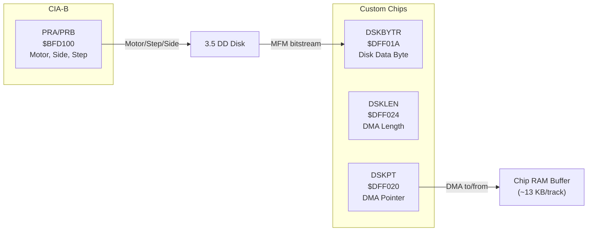
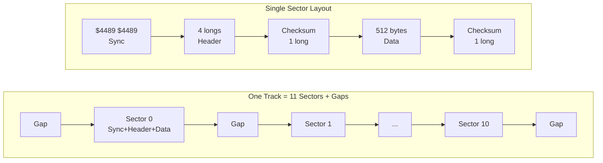
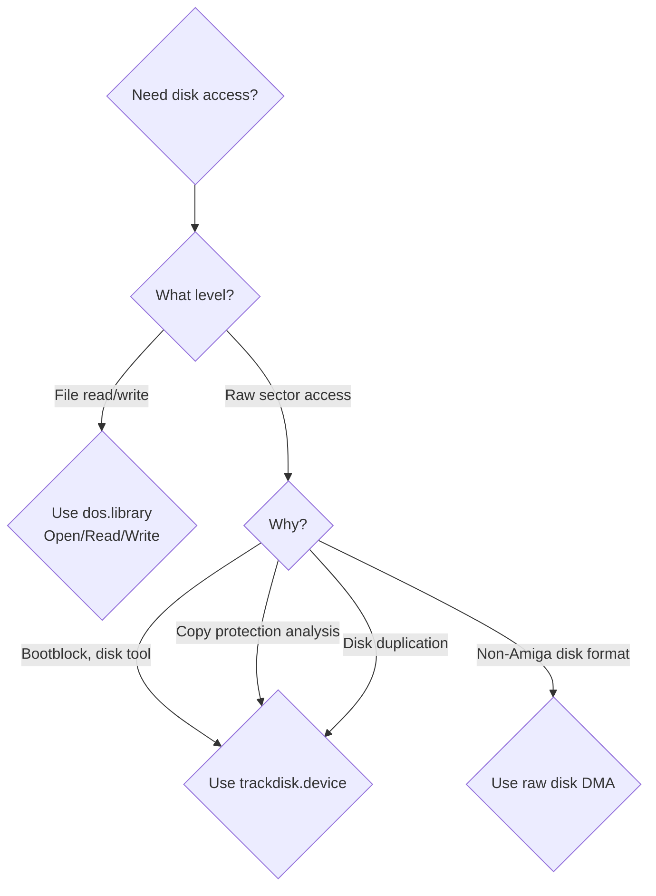

[← Home](../README.md) · [Devices](README.md)

# trackdisk.device — Floppy Disk Controller

Every Amiga shipped with a floppy drive — and every Amiga program that loaded from disk went through `trackdisk.device`. It is the lowest-level software interface to the Amiga's custom-chip floppy DMA controller, providing sector-level read/write access to 3.5" double-density disks. The Amiga's floppy controller is unusual for its era: it reads and writes **raw MFM bitstreams** rather than decoded data, giving software complete control over on-disk format. This is why the Amiga could read PC, Mac, and ST disks — and why copy-protected Amiga disks are so hard to duplicate.

> [!NOTE]
> Most application developers should use [dos.library](../07_dos/file_io.md) (`Open()`, `Read()`, `Write()`) instead of trackdisk.device directly. The filesystem handles sector-to-file mapping, buffering, and error recovery. Use trackdisk.device only when you need raw disk access: disk duplication, custom bootblocks, copy-protection analysis, or low-level diagnostics.

---

## Hardware Architecture



### Disk Geometry

| Parameter | Value |
|---|---|
| Tracks | 80 (0–79) |
| Sides | 2 (0=upper, 1=lower) |
| Sectors per track | 11 (DD), 22 (HD) |
| Bytes per sector | 512 |
| Total capacity | 880 KB (DD), 1,760 KB (HD) |
| Rotation speed | 300 RPM (1 revolution = 200 ms) |
| Transfer rate | ~250 kbit/s (DD raw MFM) |
| Track-to-track seek | ~3 ms |

### MFM Encoding

The disk stores data in **Modified Frequency Modulation** format. Each data byte becomes **16 bits** on disk — a clock bit and a data bit interleaved. The clock bit is determined by a simple rule: write a `1` clock only when both the previous data bit and current data bit are `0`.

```
Data byte:  $A1 = 1010 0001

MFM encoding (data bits underlined, clock bits computed):
  Data:   1   0   1   0   0   0   0   1
  Clock:  0   1   0   1   1   1   1   0
  MFM:   01  10  01  10  10  10  10  01
          = $4489 (the famous Amiga sync word)
```

A raw track is ~12,668 bytes of MFM data (including gaps, sync words, and sector headers).

> **Key insight**: The Amiga floppy controller does **not** decode MFM in hardware — it DMA-transfers the raw MFM bitstream directly to Chip RAM. Decoding is done in software by `trackdisk.device`. This design choice is what gives the Amiga its unique ability to read and write non-standard disk formats.

### Track Format (AmigaDOS)

```
Track = 11 sectors, each containing:

  Sync:     $4489 $4489         (2 words — MFM-encoded $A1 $A1)
  Header:   format, track, sector, sectors_to_gap (MFM-encoded)
  Header checksum: XOR of header longs
  Data:     512 bytes of payload (MFM-encoded = 1024 bytes on disk)
  Data checksum: XOR of data longs

Gaps between sectors: variable-length padding
```



> **Why sync words matter**: The controller synchronizes to the MFM bitstream by looking for the pattern `$4489 $4489`, which violates normal MFM encoding rules (a missing clock pulse). This makes sync words unambiguous — they can never appear in normal data. Copy protection schemes exploit this by placing non-standard sync patterns that normal disk copiers cannot read.

---

## Using trackdisk.device

### Opening

```c
struct MsgPort *diskPort = CreateMsgPort();
struct IOExtTD *diskReq = (struct IOExtTD *)
    CreateIORequest(diskPort, sizeof(struct IOExtTD));

/* Unit numbers: DF0:=0, DF1:=1, DF2:=2, DF3:=3 */
BYTE err = OpenDevice("trackdisk.device", 0,
                       (struct IORequest *)diskReq, 0);
```

### Reading Sectors

```c
UBYTE *buf = AllocMem(512, MEMF_CHIP);  /* MUST be Chip RAM */

diskReq->iotd_Req.io_Command = CMD_READ;
diskReq->iotd_Req.io_Data    = buf;
diskReq->iotd_Req.io_Length  = 512;       /* bytes to read */
diskReq->iotd_Req.io_Offset  = 0;        /* byte offset on disk */
/* offset = (track * 2 + side) * 11 * 512 + sector * 512 */
DoIO((struct IORequest *)diskReq);
```

### Writing + Updating (Motor Control)

```c
/* Write a sector: */
diskReq->iotd_Req.io_Command = CMD_WRITE;
diskReq->iotd_Req.io_Data    = buf;
diskReq->iotd_Req.io_Length  = 512;
diskReq->iotd_Req.io_Offset  = 512 * 10;  /* sector 10 */
DoIO((struct IORequest *)diskReq);

/* Flush write buffer to disk: */
diskReq->iotd_Req.io_Command = CMD_UPDATE;
DoIO((struct IORequest *)diskReq);

/* Turn off motor when done: */
diskReq->iotd_Req.io_Command = TD_MOTOR;
diskReq->iotd_Req.io_Length  = 0;  /* 0=off, 1=on */
DoIO((struct IORequest *)diskReq);
```

### Disk Change Notification

```c
/* Wait for disk insertion/removal: */
diskReq->iotd_Req.io_Command = TD_CHANGENUM;
DoIO((struct IORequest *)diskReq);
ULONG changeCount = diskReq->iotd_Req.io_Actual;

/* Async notification: */
diskReq->iotd_Req.io_Command = TD_ADDCHANGEINT;
diskReq->iotd_Req.io_Data    = (APTR)&myInterrupt;
SendIO((struct IORequest *)diskReq);
/* myInterrupt is signaled on disk change */
```

### Track Caching

trackdisk.device reads an **entire track** (11 sectors) into an internal buffer on each access. Subsequent reads of other sectors on the same track are served from cache:

```
Read sector 0 → DMA reads track 0 (11 sectors) → cache hit for sectors 1–10
Read sector 11 → new track → DMA reads track 1
Read sector 5 → cache hit (still in track 0 buffer)
```

> **FPGA implication**: the MiSTer core must emulate this whole-track DMA behavior for correct timing. Games that measure seek+read latency will behave incorrectly if only single sectors are transferred.

---

## Direct Hardware Access (Games/Demos)

Games often bypass trackdisk.device for speed and copy protection:

```asm
; Direct floppy read — raw track DMA:
    LEA     $DFF000, A5              ; custom base
    MOVE.L  #TrackBuffer, $20(A5)    ; DSKPT — DMA pointer (Chip RAM)
    MOVE.W  #$8210, $96(A5)          ; DMACON — enable disk DMA

    ; Select drive, side, seek to track:
    MOVE.B  #$F7, $BFD100            ; CIA-B PRB — select DF0, motor on
    ; ... step head to desired track ...

    ; Start reading one track:
    MOVE.W  #$8000|6300, $24(A5)     ; DSKLEN — enable, ~6300 words
    MOVE.W  #$8000|6300, $24(A5)     ; write twice to start DMA

    ; Wait for DMA complete (DSKBLK interrupt):
    BTST    #1, $DFF01F              ; INTREQR — DSKBLK bit
    BEQ.S   .-4
```

---

## References

### NDK Headers

- `devices/trackdisk.h` — `struct IOExtTD`, command constants
- `resources/disk.h` — disk resource management

### Documentation

- HRM: *Amiga Hardware Reference Manual* — Disk Controller chapter
- ADCD 2.1: trackdisk.device autodocs
- *Amiga ROM Kernel Reference Manual: Devices* — trackdisk chapter

### Related Knowledge Base Articles

- [filesystem.md](../07_dos/filesystem.md) — FFS/OFS block format on top of trackdisk
- [boot_block](../02_boot_sequence/dos_boot.md) — bootblock format and loading sequence
- [custom_loaders_and_drm.md](../05_reversing/custom_loaders_and_drm.md) — copy protection schemes that exploit raw disk access
- [io_requests.md](../06_exec_os/io_requests.md) — IORequest, DoIO, SendIO protocol

---

## trackdisk vs. dos.library — Decision Guide



| Criterion | dos.library | trackdisk.device | Raw DMA (CIA+custom) |
|-----------|-------------|------------------|----------------------|
| **Level** | File I/O | Sector I/O | MFM bitstream |
| **Buffer** | Any RAM | Chip RAM only | Chip RAM only |
| **Error recovery** | Automatic (retries) | Built-in (retries) | Your responsibility |
| **Filesystem aware** | Yes | No | No |
| **Write protection** | Respects WP tab | Respects WP tab | Must check yourself |
| **Disk change detection** | Automatic | TD_CHANGENUM | Must poll CIA pins |
| **Motor control** | Automatic | Manual (TD_MOTOR) | Manual (CIA PRB) |
| **Typical use** | Applications | Disk tools, bootblocks | Games, demos, protection |
| **FPGA impact** | None — OS handles it | Must emulate whole-track cache | Must emulate exact DMA timing |

---

## Command Reference

| Command | LVO | Description |
|---------|-----|-------------|
| `CMD_READ` | 0 | Read sectors from disk |
| `CMD_WRITE` | 1 | Write sectors to disk |
| `CMD_UPDATE` | 2 | Flush write buffer to disk |
| `CMD_CLEAR` | 3 | Clear read-ahead buffer |
| `TD_CHANGENUM` | 6 | Get disk change counter |
| `TD_CHANGESTATE` | 7 | Check if disk is in drive (0=in, 1=empty) |
| `TD_PROTSTATUS` | 8 | Check write-protect status |
| `TD_ADDCHANGEINT` 9 | Add disk-change interrupt handler |
| `TD_REMCHANGEINT` 10 | Remove disk-change interrupt handler |
| `TD_GETNUMTRACKS` 12 | Get total number of tracks |
| `TD_ADDTRACK` | 13 | Add track buffer (AmigaOS 2.0+) |
| `TD_FORMAT` | 4 | Format a track (write raw MFM) |
| `TD_RAWREAD` | 10 | Read raw MFM track (AmigaOS 2.0+) |
| `TD_RAWWRITE` | 11 | Write raw MFM track (AmigaOS 2.0+) |
| `TD_GETDRIVETYPE` 15 | Get drive type (AmigaOS 3.0+) |

> [!WARNING]
> All I/O buffers passed to `CMD_READ` and `CMD_WRITE` **must be in Chip RAM**. The floppy DMA engine can only access Chip RAM. Using Fast RAM causes silent data corruption.

---

## Best Practices

1. Always use `MEMF_CHIP` for trackdisk I/O buffers — the floppy DMA engine cannot reach Fast RAM
2. Call `CMD_UPDATE` after writing — the device buffers writes internally
3. Check `TD_CHANGESTATE` before critical operations — the user may have ejected the disk
4. Turn off the motor with `TD_MOTOR(0)` when done — leaving it on wears out the disk and drive
5. Use `DoIO()` (synchronous) for simple operations; `SendIO()` only when overlapping disk I/O with computation
6. Handle `TDERR_DiskChange` errors — always verify the disk hasn't been swapped mid-operation
7. For disk-to-disk copy, read a full track then write a full track — not sector by sector

---

## Named Antipatterns

### "The Fast RAM Buffer" — DMA-Corrupted Reads

```c
/* BAD: AllocMem without MEMF_CHIP returns Fast RAM on expanded systems */
UBYTE *buf = AllocMem(512, 0);  /* could be Fast RAM */
diskReq->iotd_Req.io_Data = buf;
diskReq->iotd_Req.io_Command = CMD_READ;
DoIO((struct IORequest *)diskReq);
/* DMA writes to Chip RAM, but buf points to Fast RAM — silent garbage! */
```

```c
/* CORRECT: Always use MEMF_CHIP */
UBYTE *buf = AllocMem(512, MEMF_CHIP | MEMF_CLEAR);
```

### "The Motor Hog" — Wearing Out the Drive

```c
/* BAD: Motor left running forever */
diskReq->iotd_Req.io_Command = TD_MOTOR;
diskReq->iotd_Req.io_Length  = 1;  /* motor on */
DoIO((struct IORequest *)diskReq);
/* ... read disk ... */
/* ... forget to turn motor off ... */
```

```c
/* CORRECT: Turn off motor after use */
/* ... after all disk operations ... */
diskReq->iotd_Req.io_Command = TD_MOTOR;
diskReq->iotd_Req.io_Length  = 0;  /* motor off */
DoIO((struct IORequest *)diskReq);
```

### "The Stale Disk" — Ignoring Disk Changes

```c
/* BAD: Assumes the same disk is still in the drive */
/* User swaps disk between reads — data is from wrong disk! */
ULONG oldCount = diskReq->iotd_Req.io_Actual;
/* ... much later ... */
ReadSector(buf, 0);
/* No check if disk was changed */
```

```c
/* CORRECT: Check change counter before each operation */
diskReq->iotd_Req.io_Command = TD_CHANGENUM;
DoIO((struct IORequest *)diskReq);
if (diskReq->iotd_Req.io_Actual != oldCount) {
    /* Disk was changed — re-read disk info */
}
```

---

## Pitfalls & Common Mistakes

### 1. Forgetting CMD_UPDATE After Writes

**Symptom:** Written data disappears after reboot.

**Cause:** trackdisk.device buffers writes internally. `CMD_WRITE` stores data in the device's track buffer, but does not flush to physical disk until `CMD_UPDATE` is issued.

**Fix:**
```c
diskReq->iotd_Req.io_Command = CMD_WRITE;
DoIO((struct IORequest *)diskReq);

/* MUST call CMD_UPDATE to flush: */
diskReq->iotd_Req.io_Command = CMD_UPDATE;
DoIO((struct IORequest *)diskReq);
```

### 2. Wrong Byte Offset Calculation

**Symptom:** Reading wrong sectors, corrupt data.

**Cause:** The `io_Offset` field uses **byte offsets from disk start**, not track/sector numbers.

**Fix:** Calculate offset correctly:
```c
/* Linear byte offset for track T, side S, sector SEC: */
ULONG offset = ((T * 2 + S) * 11 + SEC) * 512;
/* Example: Track 5, side 1, sector 3 = ((5*2+1)*11 + 3) * 512 = 63,488 */
```

### 3. Unit Number Out of Range

**Symptom:** `OpenDevice()` succeeds but operations fail or access wrong drive.

**Cause:** Unit numbers are DF0:=0, DF1:=1, DF2:=2, DF3:=3. Higher numbers are invalid.

**Fix:** Always validate the unit number and handle `OpenDevice()` errors.

---

## Use Cases

| Use Case | Approach | Notes |
|----------|----------|-------|
| Loading files | Use [dos.library](../07_dos/file_io.md) | Never use trackdisk directly |
| Bootblock installation | `CMD_WRITE` sector 0 | Must be Chip RAM buffer |
| Disk duplication | Read full track, write full track | Track-at-once is faster than sector-at-once |
| Copy protection detection | `TD_RAWREAD` (OS 2.0+) or raw DMA | Analyze non-standard sync words |
| Disk format tool | `TD_FORMAT` | Writes MFM sector headers + data |
| Non-Amiga disk (PC/ST) | `TD_RAWREAD` + custom MFM decode | PC uses different sector format |
| Write-protect detection | `TD_PROTSTATUS` | Returns 0=writable, 1=protected |

---

## Impact on FPGA / Emulation

The floppy controller is one of the trickiest subsystems to emulate accurately:

| Aspect | FPGA/Emulation Challenge |
|--------|--------------------------|
| **Raw MFM DMA** | Must transfer the complete raw MFM bitstream to/from memory, not decoded data |
| **Whole-track caching** | trackdisk.device caches full tracks — emulation must preserve this for correct seek timing |
| **CIA-B floppy control** | Motor, step, side select via CIA-B PRA/PRB registers — must be cycle-accurate |
| **Sync word detection** | Hardware searches for `$4489` sync in the MFM stream — must handle missing-clock encoding correctly |
| **Copy protection** | Non-standard sync words, weak bits, extra-long tracks — many games depend on exact timing |
| **Write-speed mismatch** | MFM encoding runs at 250 kbit/s regardless of CPU speed — emulation must throttle DMA |
| **TrackMotor delay** | Motor spin-up takes ~500 ms — games check this delay for protection |

> **Practical impact**: The MiSTer Amiga (Minimig) core emulates the floppy controller at the MFM level, reading ADF images and reconstructing the raw MFM bitstream. This is why copy-protected disks require special formats (IPF/CTRaw) that preserve the exact MFM encoding.

---

## FAQ

**Q: Why is the Amiga floppy format different from PC?**
A: The Amiga uses a unique sector format with `$4489` sync words and XOR checksums, whereas PCs use IBM MFM format with `$A1` address marks and CRC-16. The Amiga controller is more flexible because it processes raw MFM — the PC's uPD765 controller decodes MFM in hardware.

**Q: Can I read PC disks on an Amiga?**
A: Yes — the Amiga's raw MFM controller can read any MFM format. The `CrossDOS` filesystem (built into AmigaOS 2.1+) decodes PC MFM sectors. Hardware-wise, the drive mechanism is identical to PC double-density drives.

**Q: Why does a full disk copy take so long?**
A: 80 tracks × 2 sides × 200 ms/revolution = 32 seconds minimum (one revolution per track). With seek time (~3 ms per step) and motor spin-up (~500 ms), a full 880 KB copy takes 45–90 seconds in practice.

**Q: What is the difference between ADF and IPF?**
A: ADF stores decoded sector data (880 KB). IPF stores the raw MFM bitstream with timing information, preserving copy protection, weak bits, and non-standard formatting. See [custom_loaders_and_drm.md](../05_reversing/custom_loaders_and_drm.md).

**Q: What happens if I use Fast RAM for a DMA buffer?**
A: The DMA engine writes to the physical Chip RAM address. If your pointer is in Fast RAM, the DMA data goes to Chip RAM (wrong location) while your code reads from Fast RAM (stale or uninitialized data). The result is silent corruption — no error is reported.

---
