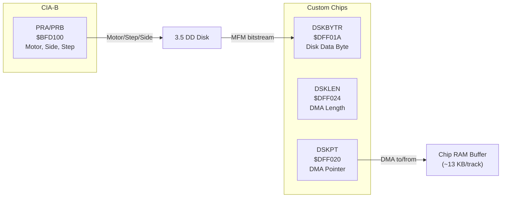

[← Home](../README.md) · [Devices](README.md)

# trackdisk.device — Floppy Disk DMA Controller

## Overview

`trackdisk.device` interfaces with the Amiga's floppy disk controller — a custom DMA engine that reads and writes raw MFM-encoded data from double-density 3.5" disks. It provides block-level access (512 bytes/sector, 11 sectors/track, 80 tracks × 2 sides = 1,760 sectors = 880 KB per disk).

---

## Hardware Architecture



### Disk Geometry

| Parameter | Value |
|---|---|
| Tracks | 80 (0–79) |
| Sides | 2 (0=upper, 1=lower) |
| Sectors per track | 11 (DD), 22 (HD) |
| Bytes per sector | 512 |
| Total capacity | 880 KB (DD), 1,760 KB (HD) |
| Rotation speed | 300 RPM (1 revolution = 200 ms) |
| Transfer rate | ~250 kbit/s (DD raw MFM) |
| Track-to-track seek | ~3 ms |

### MFM Encoding

The disk stores data in **Modified Frequency Modulation** format. Each byte becomes 16 bits on disk (clock + data interleaved):

```
Data bit:  1   0   1   1   0   0   0   1
MFM:      01  10  01  01  10  10  10  01
           ↑   ↑   ↑   ↑   ↑   ↑   ↑   ↑
           c/d pairs (clock bit inserted before each data bit)
```

A raw track is ~12,668 bytes of MFM data (including gaps, sync words, and sector headers).

### Track Format (AmigaDOS)

```
Track = 11 sectors, each containing:

  Sync:     $4489 $4489         (2 words — MFM-encoded $A1 $A1)
  Header:   format, track, sector, sectors_to_gap (MFM-encoded)
  Header checksum: XOR of header longs
  Data:     512 bytes of payload (MFM-encoded = 1024 bytes on disk)
  Data checksum: XOR of data longs

Gaps between sectors: variable-length padding
```

---

## Using trackdisk.device

### Opening

```c
struct MsgPort *diskPort = CreateMsgPort();
struct IOExtTD *diskReq = (struct IOExtTD *)
    CreateIORequest(diskPort, sizeof(struct IOExtTD));

/* Unit numbers: DF0:=0, DF1:=1, DF2:=2, DF3:=3 */
BYTE err = OpenDevice("trackdisk.device", 0,
                       (struct IORequest *)diskReq, 0);
```

### Reading Sectors

```c
UBYTE *buf = AllocMem(512, MEMF_CHIP);  /* MUST be Chip RAM */

diskReq->iotd_Req.io_Command = CMD_READ;
diskReq->iotd_Req.io_Data    = buf;
diskReq->iotd_Req.io_Length  = 512;       /* bytes to read */
diskReq->iotd_Req.io_Offset  = 0;        /* byte offset on disk */
/* offset = (track * 2 + side) * 11 * 512 + sector * 512 */
DoIO((struct IORequest *)diskReq);
```

### Writing + Updating (Motor Control)

```c
/* Write a sector: */
diskReq->iotd_Req.io_Command = CMD_WRITE;
diskReq->iotd_Req.io_Data    = buf;
diskReq->iotd_Req.io_Length  = 512;
diskReq->iotd_Req.io_Offset  = 512 * 10;  /* sector 10 */
DoIO((struct IORequest *)diskReq);

/* Flush write buffer to disk: */
diskReq->iotd_Req.io_Command = CMD_UPDATE;
DoIO((struct IORequest *)diskReq);

/* Turn off motor when done: */
diskReq->iotd_Req.io_Command = TD_MOTOR;
diskReq->iotd_Req.io_Length  = 0;  /* 0=off, 1=on */
DoIO((struct IORequest *)diskReq);
```

### Disk Change Notification

```c
/* Wait for disk insertion/removal: */
diskReq->iotd_Req.io_Command = TD_CHANGENUM;
DoIO((struct IORequest *)diskReq);
ULONG changeCount = diskReq->iotd_Req.io_Actual;

/* Async notification: */
diskReq->iotd_Req.io_Command = TD_ADDCHANGEINT;
diskReq->iotd_Req.io_Data    = (APTR)&myInterrupt;
SendIO((struct IORequest *)diskReq);
/* myInterrupt is signaled on disk change */
```

### Track Caching

trackdisk.device reads an **entire track** (11 sectors) into an internal buffer on each access. Subsequent reads of other sectors on the same track are served from cache:

```
Read sector 0 → DMA reads track 0 (11 sectors) → cache hit for sectors 1–10
Read sector 11 → new track → DMA reads track 1
Read sector 5 → cache hit (still in track 0 buffer)
```

> **FPGA implication**: the MiSTer core must emulate this whole-track DMA behavior for correct timing. Games that measure seek+read latency will behave incorrectly if only single sectors are transferred.

---

## Direct Hardware Access (Games/Demos)

Games often bypass trackdisk.device for speed and copy protection:

```asm
; Direct floppy read — raw track DMA:
    LEA     $DFF000, A5              ; custom base
    MOVE.L  #TrackBuffer, $20(A5)    ; DSKPT — DMA pointer (Chip RAM)
    MOVE.W  #$8210, $96(A5)          ; DMACON — enable disk DMA

    ; Select drive, side, seek to track:
    MOVE.B  #$F7, $BFD100            ; CIA-B PRB — select DF0, motor on
    ; ... step head to desired track ...

    ; Start reading one track:
    MOVE.W  #$8000|6300, $24(A5)     ; DSKLEN — enable, ~6300 words
    MOVE.W  #$8000|6300, $24(A5)     ; write twice to start DMA

    ; Wait for DMA complete (DSKBLK interrupt):
    BTST    #1, $DFF01F              ; INTREQR — DSKBLK bit
    BEQ.S   .-4
```

---

## References

- NDK39: `devices/trackdisk.h`, `resources/disk.h`
- HRM: *Amiga Hardware Reference Manual* — Disk Controller chapter
- ADCD 2.1: trackdisk.device autodocs
- See also: [filesystem.md](../07_dos/filesystem.md) — FFS/OFS block format on top of trackdisk
