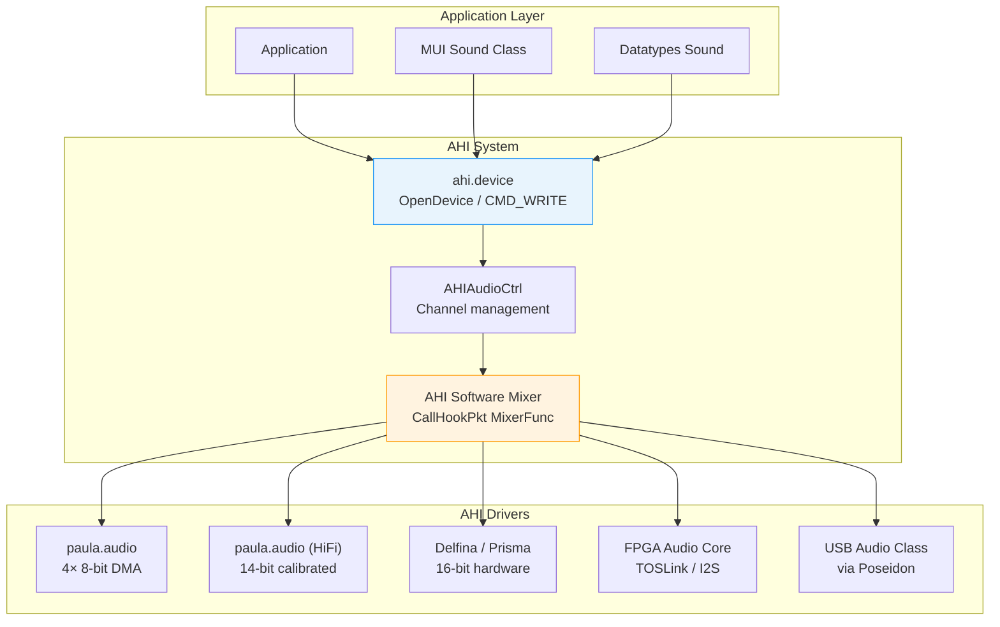
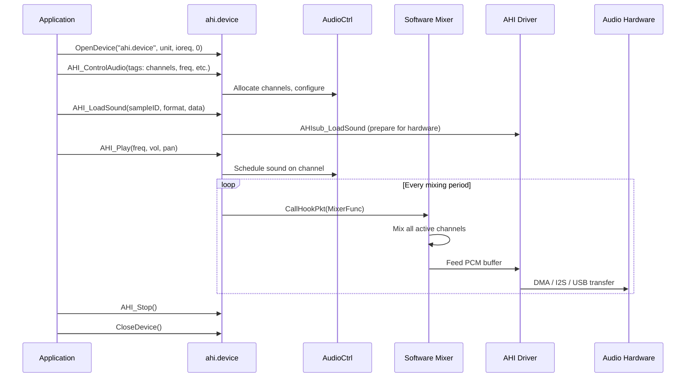
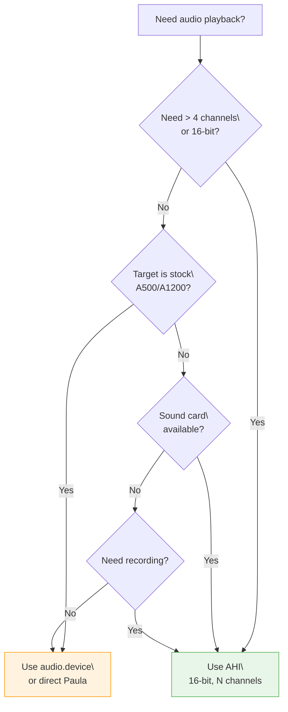
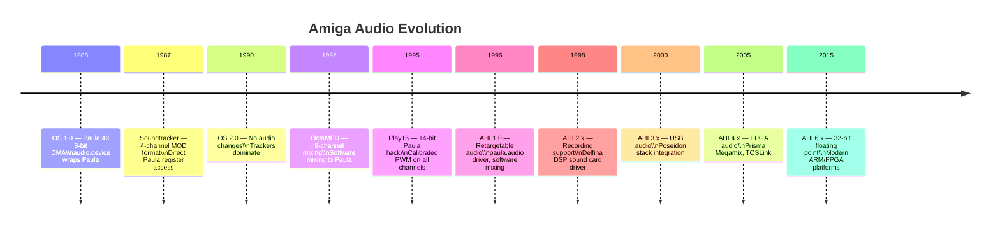

[← Home](../README.md) · [Libraries](README.md)

# AHI — Audio Hardware Interface Programming

## What Is AHI?

AHI (Audio Hardware Interface) is AmigaOS's retargetable audio system. Introduced in 1996 by Martin Blom, it solves a fundamental problem: Paula has only 4 hardware audio channels at 8-bit resolution, locked to Chip RAM. AHI provides a **hardware-agnostic API** for 16-bit (and higher) multi-channel audio with software mixing, supporting Paula, sound cards (Delfina, Prisma Megamix, X-Surf), FPGA audio cores, and USB audio devices through a uniform interface.

AHI is to audio what RTG (Picasso96/CyberGraphX) is to graphics — a retargetable abstraction layer that decouples applications from hardware specifics.



### Why AHI Matters

| Problem | Without AHI | With AHI |
|---------|------------|----------|
| > 4 channels | Manual software mixing — every app reinvents it | Built-in N-channel mixer |
| 16-bit audio | Paula can't do it natively | 16-bit playback on any hardware |
| Hardware independence | Apps hard-coded to Paula registers | Apps use AHI API, driver handles hardware |
| Recording | Only via Paula's limited ADC | Any recording-capable AHI device |
| Multi-app audio | One app owns Paula — others get silence | AHI arbitrates between applications |

---

## Architecture

### Audio Pipeline



### Component Map

| Component | Type | Description |
|-----------|------|-------------|
| `ahi.device` | Device | Exec device — opened with `OpenDevice()` |
| `AHIAudioCtrl` | Structure | Controls channel allocation, mixing, format |
| `AHI_Request` | IORequest | Standard exec I/O request for device commands |
| Mixer Hook | Hook | AHI calls this to produce mixed PCM buffers |
| Player Hook | Hook | AHI calls this to advance module position (for trackers) |
| `*.audio` driver | Shared library | Hardware-specific driver in `DEVS:AHI/` |

---

## API Reference

### Device Opening and Control

```c
#include <devices/ahi.h>
#include <proto/ahi.h>

struct MsgPort *AHImp = NULL;
struct AHIRequest *AHIio = NULL;
struct AHIAudioCtrl *AudioCtrl = NULL;
BYTE AHIDevice = -1;

BOOL InitAHI(void)
{
    AHImp = CreateMsgPort();
    if (!AHImp) return FALSE;

    AHIio = (struct AHIRequest *)CreateIORequest(
        AHImp, sizeof(struct AHIRequest));

    if (!AHIio) { DeleteMsgPort(AHImp); return FALSE; }

    AHIio->ahir_Version = 4;  /* Request AHI v4+ */

    AHIDevice = OpenDevice(AHINAME, 0, (struct IORequest *)AHIio, 0);
    if (AHIDevice)
    {
        /* AHI not available — fall back to audio.device */
        DeleteIORequest((struct IORequest *)AHIio);
        DeleteMsgPort(AHImp);
        return FALSE;
    }

    return TRUE;
}
```

### Audio Control — AHI_ControlAudio()

Configures the audio session (channels, sample rate, format):

```c
/* Create audio control structure with desired parameters */
AudioCtrl = AHI_AllocAudio(
    AHIA_AudioID,     AHI_DEFAULT_ID,
    AHIA_MixFreq,     44100,
    AHIA_Channels,    4,           /* 4 simultaneous sounds */
    AHIA_Sounds,      16,          /* up to 16 loaded samples */
    AHIA_SampleType,  AHIST_M16S,  /* 16-bit mono signed */
    AHIA_PlayerFunc,  NULL,        /* no player hook (non-module) */
    AHIA_PlayerFreq,  50,          /* mixing frequency (Hz) */
    AHIA_MinMixFreq,  8000,
    TAG_DONE);

if (!AudioCtrl)
{
    /* Fallback: try fewer channels or lower sample rate */
    AudioCtrl = AHI_AllocAudio(
        AHIA_AudioID,    AHI_DEFAULT_ID,
        AHIA_MixFreq,    22050,
        AHIA_Channels,   2,
        AHIA_Sounds,     8,
        AHIA_SampleType, AHIST_M16S,
        TAG_DONE);
}
```

### Sample Types

| Constant | Value | Description |
|----------|-------|-------------|
| `AHIST_M8S` | 0 | 8-bit mono signed |
| `AHIST_M16S` | 2 | 16-bit mono signed (most common) |
| `AHIST_S8S` | 4 | 8-bit stereo signed |
| `AHIST_S16S` | 6 | 16-bit stereo signed |
| `AHIST_M32S` | 10 | 32-bit mono signed |
| `AHIST_S32S` | 14 | 32-bit stereo signed |
| `AHIST_M16S_SYS` | — | 16-bit mono, system byte order |
| `AHIST_S16S_SYS` | — | 16-bit stereo, system byte order |

### Loading and Playing Sounds

```c
/* Define sample IDs */
enum {
    SND_JUMP = 0,
    SND_COIN,
    SND_EXPLODE,
    SND_MUSIC,
    SOUND_COUNT
};

/* Load a sample from memory */
APTR sampleData = LoadIFFSample("SYS:Sounds/jump.8svx");
ULONG sampleLength = GetSampleLength();

AHI_LoadSound(SND_JUMP,
    AHIST_M16S,          /* sample type */
    sampleData,           /* pointer to PCM data */
    sampleLength * 2,     /* number of BYTES (not samples!) */
    AudioCtrl);

/* Play the sound on channel 0 */
AHI_Play(AudioCtrl,
    AHIP_BeginChannel,  0,
    AHIP_Freq,          44100,      /* playback frequency */
    AHIP_Vol,           0x10000,    /* full volume (fixed-point 16.16) */
    AHIP_Pan,           0x8000,     /* center (0=left, 0x10000=right) */
    AHIP_Sound,         SND_JUMP,
    AHIP_EndChannel,    0,
    TAG_DONE);

/* Stop sound on channel 0 */
AHI_Play(AudioCtrl,
    AHIP_BeginChannel,  0,
    AHIP_Sound,         AHI_NOSOUND,
    AHIP_EndChannel,    0,
    TAG_DONE);
```

### Volume and Panning

```c
/* Volume: fixed-point 16.16 format */
/* 0x00000 = silence, 0x10000 = full volume, 0x20000 = +6dB boost */
AHI_SetVol(0, 0x10000, 0x8000, AudioCtrl, AHISF_IMM);

/* Pan: fixed-point 16.16 format */
/* 0x00000 = hard left, 0x8000 = center, 0x10000 = hard right */
AHI_SetVol(0, 0x8000, 0x00000, AudioCtrl, AHISF_IMM);  /* left only */
```

### Setting Frequency

```c
/* Change playback frequency of a running sound */
AHI_SetFreq(0, 22050, AudioCtrl, AHISF_IMM);

/* Play a sample at double speed (pitch shift) */
AHI_SetFreq(0, 88200, AudioCtrl, AHISF_IMM);
```

### Cleanup

```c
void CleanupAHI(void)
{
    if (AudioCtrl)
    {
        /* Stop all sounds first */
        for (int ch = 0; ch < 4; ch++)
            AHI_Play(AudioCtrl,
                AHIP_BeginChannel, ch,
                AHIP_Sound, AHI_NOSOUND,
                AHIP_EndChannel, ch,
                TAG_DONE);

        AHI_FreeAudio(AudioCtrl);
        AudioCtrl = NULL;
    }

    if (!AHIDevice)
    {
        CloseDevice((struct IORequest *)AHIio);
        AHIDevice = -1;
    }

    if (AHIio)
    {
        DeleteIORequest((struct IORequest *)AHIio);
        AHIio = NULL;
    }

    if (AHImp)
    {
        DeleteMsgPort(AHImp);
        AHImp = NULL;
    }
}
```

---

## Audio Mode Selection

### Decision Guide



### Audio Mode Comparison

| Mode | Channels | Bit Depth | Mixing Freq | Latency | Notes |
|------|----------|-----------|-------------|---------|-------|
| **audio.device** | 4 (hardware) | 8-bit signed | 28–35 kHz max | ~1 DMA cycle | Native Paula — zero CPU for playback |
| **AHI paula.audio** | 4–16 (software) | 8/16-bit | 8000–48000 Hz | ~1–20 ms | Software mixed, output via Paula |
| **AHI HiFi 14-bit** | 2 (stereo) | 14-bit | 44100 Hz | ~10–20 ms | Uses all 4 Paula channels for stereo |
| **AHI Delfina** | 16–64 | 16/24-bit | 44100–96000 | ~5 ms | Hardware DSP mixing |
| **AHI Prisma Megamix** | 8–16 | 16/24-bit | 44100–192000 | ~5 ms | FPGA-based, I2S output |
| **AHI USB Audio** | 2–8 | 16/24-bit | 44100–96000 | ~10 ms | Via Poseidon USB stack |

---

## Practical Cookbook

### Cookbook 1: Simple Sound Effects Player

```c
#include <proto/ahi.h>
#include <proto/exec.h>
#include <devices/ahi.h>

struct AHIAudioCtrl *ctrl;
APTR sounds[16];
ULONG soundLengths[16];

BOOL InitSoundSystem(void)
{
    ctrl = AHI_AllocAudio(
        AHIA_AudioID,    AHI_DEFAULT_ID,
        AHIA_MixFreq,    44100,
        AHIA_Channels,   4,
        AHIA_Sounds,     16,
        AHIA_SampleType, AHIST_M16S,
        TAG_DONE);
    return (ctrl != NULL);
}

BOOL LoadSound(ULONG id, const char *filename)
{
    /* Load raw 16-bit signed PCM from file */
    BPTR fh = Open(filename, MODE_OLDFILE);
    if (!fh) return FALSE;

    ULONG size = Seek(fh, 0, OFFSET_END);
    Seek(fh, 0, OFFSET_BEGINNING);

    APTR data = AllocMem(size, MEMF_ANY);
    if (!data) { Close(fh); return FALSE; }

    Read(fh, data, size);
    Close(fh);

    sounds[id] = data;
    soundLengths[id] = size;

    AHI_LoadSound(id, AHIST_M16S, data, size / 2, ctrl);
    return TRUE;
}

void PlaySFX(ULONG id, int channel, ULONG freq, ULONG volume)
{
    AHI_Play(ctrl,
        AHIP_BeginChannel, channel,
        AHIP_Freq,         freq,
        AHIP_Vol,          volume,
        AHIP_Pan,          0x8000,     /* center */
        AHIP_Sound,        id,
        AHIP_EndChannel,   channel,
        TAG_DONE);
}

void StopSFX(int channel)
{
    AHI_Play(ctrl,
        AHIP_BeginChannel, channel,
        AHIP_Sound,        AHI_NOSOUND,
        AHIP_EndChannel,   channel,
        TAG_DONE);
}

void CleanupSoundSystem(void)
{
    if (ctrl)
    {
        AHI_FreeAudio(ctrl);
        ctrl = NULL;
    }
    for (int i = 0; i < 16; i++)
    {
        if (sounds[i])
        {
            FreeMem(sounds[i], soundLengths[i]);
            sounds[i] = NULL;
        }
    }
}
```

### Cookbook 2: Streaming Playback (Music / Module Player)

For continuous audio streaming (playing modules, MP3, WAV), use the Player and Mixer hooks:

```c
#include <proto/ahi.h>
#include <devices/ahi.h>

#define BUFFER_SAMPLES 4096
#define NUM_BUFFERS    2

struct AHIAudioCtrl *ctrl;
struct Hook playerHook;
APTR buffers[NUM_BUFFERS];
int currentBuffer = 0;

/* Player hook — called at PlayerFreq rate.
   Fill the next buffer with decoded audio. */
LONG ASM PlayerFunc(REG(a0, struct Hook *hook),
                    REG(a2, struct AHIAudioCtrl *ctrl),
                    REG(a1, void *unused))
{
    APTR buf = buffers[currentBuffer];

    /* Decode next BUFFER_SAMPLES of audio into buf.
       This is where you'd call your MP3 decoder, MOD player, etc. */
    DecodeNextChunk(buf, BUFFER_SAMPLES);

    /* Tell AHI which buffer to play next */
    AHI_SetSound(0, AHI_NOSOUND, 0, 0, ctrl, 0);
    AHI_LoadSound(0, AHIST_S16S, buf, BUFFER_SAMPLES, ctrl);
    AHI_Play(ctrl,
        AHIP_BeginChannel, 0,
        AHIP_Freq,         44100,
        AHIP_Vol,          0x10000,
        AHIP_Pan,          0x8000,
        AHIP_Sound,        0,
        AHIP_EndChannel,   0,
        TAG_DONE);

    currentBuffer = 1 - currentBuffer;  /* ping-pong */
    return 0;
}

void StartStreaming(void)
{
    /* Allocate double-buffer */
    for (int i = 0; i < NUM_BUFFERS; i++)
        buffers[i] = AllocMem(BUFFER_SAMPLES * 4, MEMF_ANY);

    /* Set up player hook */
    playerHook.h_Entry = (HOOKFUNC)PlayerFunc;
    playerHook.h_Data  = NULL;

    ctrl = AHI_AllocAudio(
        AHIA_AudioID,     AHI_DEFAULT_ID,
        AHIA_MixFreq,     44100,
        AHIA_Channels,    2,
        AHIA_Sounds,      2,
        AHIA_SampleType,  AHIST_S16S,
        AHIA_PlayerFunc,  &playerHook,
        AHIA_PlayerFreq,  50,         /* 50 Hz callback */
        TAG_DONE);
}

void StopStreaming(void)
{
    if (ctrl) AHI_FreeAudio(ctrl);
    for (int i = 0; i < NUM_BUFFERS; i++)
        if (buffers[i]) FreeMem(buffers[i], BUFFER_SAMPLES * 4);
}
```

### Cookbook 3: Enumerating Available Audio Modes

```c
/* List all available AHI audio modes */
void ListAudioModes(void)
{
    struct AHIAudioModeRequester *req = NULL;
    ULONG modeID = AHI_INVALID_ID;

    while ((modeID = AHI_NextAudioID(modeID)) != AHI_INVALID_ID)
    {
        STRPTR name = AHI_GetAudioAttrs(modeID,
            AHIDB_Name,    TAG_DONE);
        STRPTR author = AHI_GetAudioAttrs(modeID,
            AHIDB_Author,  TAG_DONE);
        LONG bits = (LONG)AHI_GetAudioAttrs(modeID,
            AHIDB_Bits,    TAG_DONE);
        LONG chans = (LONG)AHI_GetAudioAttrs(modeID,
            AHIDB_MaxChannels, TAG_DONE);

        Printf("Mode: %s  Author: %s  Bits: %ld  Channels: %ld\n",
            name ? name : "(unknown)",
            author ? author : "(unknown)",
            bits, chans);
    }
}
```

---

## Named Antipatterns

### "The Memory Leak" — Not Freeing Sounds

```c
/* BAD: Loading sounds without freeing them.
   Each AHI_LoadSound allocates driver resources.
   If you load the same sample repeatedly without
   AHI_UnloadSound, you leak driver memory. */
void PlayNewSFX(APTR data, ULONG len)
{
    static int id = 0;
    AHI_LoadSound(id, AHIST_M16S, data, len, ctrl);
    AHI_Play(ctrl, AHIP_BeginChannel, 0,
             AHIP_Freq, 44100, AHIP_Vol, 0x10000,
             AHIP_Sound, id, AHIP_EndChannel, 0, TAG_DONE);
    id++;  /* keeps allocating new sound IDs — never freed! */
}
```

```c
/* CORRECT: Unload before reloading, or reuse sound IDs */
void PlaySFX(ULONG id, APTR data, ULONG len)
{
    AHI_UnloadSound(id, ctrl);     /* free previous */
    AHI_LoadSound(id, AHIST_M16S, data, len, ctrl);
    AHI_Play(ctrl, AHIP_BeginChannel, 0,
             AHIP_Freq, 44100, AHIP_Vol, 0x10000,
             AHIP_Sound, id, AHIP_EndChannel, 0, TAG_DONE);
}
```

### "The Stale Pointer" — Using Sound Data After Free

```c
/* BAD: AHI does NOT copy your sample data — it uses
   your pointer directly. If you free the data while
   the sound is playing, you feed garbage to the DAC. */
void PlayAndFree(APTR data, ULONG len)
{
    AHI_LoadSound(0, AHIST_M16S, data, len, ctrl);
    AHI_Play(ctrl, AHIP_BeginChannel, 0,
             AHIP_Sound, 0, AHIP_EndChannel, 0, TAG_DONE);
    FreeMem(data, len);  /* AHI still reading from data! */
}
```

```c
/* CORRECT: Keep data alive until sound finishes.
   Use a notification hook or delay, then free. */
void PlayAndWait(APTR data, ULONG len)
{
    AHI_LoadSound(0, AHIST_M16S, data, len, ctrl);
    AHI_Play(ctrl, AHIP_BeginChannel, 0,
             AHIP_Sound, 0, AHIP_EndChannel, 0, TAG_DONE);

    /* Wait for sound to finish (approximate) */
    ULONG ms = (len / 2) * 1000 / 44100;
    Delay(ms / 20);  /* tick granularity */

    AHI_UnloadSound(0, ctrl);
    FreeMem(data, len);
}
```

### "The Unchecked AllocAudio" — Assuming AHI Is Available

```c
/* BAD: AHI may not be installed, or may not support
   the requested mode. NULL AudioCtrl = crash. */
ctrl = AHI_AllocAudio(AHIA_MixFreq, 48000, TAG_DONE);
AHI_Play(ctrl, ...);  /* crash if ctrl is NULL */
```

```c
/* CORRECT: Always check, always fall back */
ctrl = AHI_AllocAudio(AHIA_MixFreq, 48000, TAG_DONE);
if (!ctrl)
    ctrl = AHI_AllocAudio(AHIA_MixFreq, 22050, TAG_DONE);
if (!ctrl)
    ctrl = AHI_AllocAudio(AHIA_MixFreq, 11025, TAG_DONE);
if (!ctrl)
{
    /* Fall back to audio.device (Paula) */
    UsePaulaDirectly();
}
```

### "The Volume Overflow" — Exceeding 0x10000

```c
/* BAD: AHI volume is fixed-point 16.16.
   0x10000 = 100% volume. Values above this can
   cause clipping distortion or driver-dependent
   behavior (some drivers clamp, some wrap). */
AHI_SetVol(0, 0x20000, 0x8000, ctrl, AHISF_IMM);  /* 200% — distorted! */
```

```c
/* CORRECT: Stay within 0x00000 to 0x10000 */
AHI_SetVol(0, 0x10000, 0x8000, ctrl, AHISF_IMM);  /* 100% — clean */
```

---

## Historical Context & Modern Analogies

### Evolution of Amiga Audio



### Competitive Landscape

| Platform | Audio System | Max Channels | Bit Depth | Software Mixing | Year |
|----------|-------------|-------------|-----------|-----------------|------|
| **Amiga Paula** | DMA hardware | 4 (hardware) | 8-bit | No — fixed 4 channels | 1985 |
| **Amiga AHI** | Retargetable API | 2–64 | 8/16/24/32-bit | Yes (configurable) | 1996 |
| **PC Sound Blaster** | DSP commands | 1 (stereo from SB16) | 8/16-bit | No | 1989 |
| **PC DirectSound** | Windows API | Unlimited | 16-bit | Yes | 1995 |
| **Mac OS Sound Manager** | OS API | 16 | 16-bit | Yes | 1991 |
| **Atari ST Yamaha** | PSG chip | 3 square waves | N/A | No — synth only | 1985 |

### Modern Analogies

| Amiga AHI Concept | Modern Equivalent | Notes |
|-------------------|-------------------|-------|
| `AHI_AllocAudio()` | `AudioContext.create()` (Web Audio) / `alcOpenDevice()` (OpenAL) | Audio session creation |
| `AHI_LoadSound()` | `AudioBuffer` (Web Audio) / `AL_BUFFER` (OpenAL) | Upload PCM to audio system |
| `AHI_Play()` | `AudioBufferSourceNode.start()` / `alSourcePlay()` | Trigger playback |
| `AHI_SetVol()` | `GainNode.gain` (Web Audio) / `alSourcef(AL_GAIN)` | Volume control |
| `AHI_SetFreq()` | `playbackRate` (Web Audio) / `AL_PITCH` (OpenAL) | Pitch/speed control |
| Player Hook | `ScriptProcessorNode` / `AudioWorklet` (Web Audio) | Callback-driven streaming |
| Mixer Hook | Custom audio graph (Web Audio) / mixing callback | Software mixing pipeline |
| `paula.audio` driver | Built-in audio driver (any OS) | Default hardware driver |
| AHI sound card drivers | ASIO / CoreAudio / ALSA drivers | Hardware-specific backends |
| `AHIA_MixFreq` | `sampleRate` (Web Audio) | Master mixing frequency |
| `AHISF_IMM` flag | `audioContext.currentTime` | Immediate vs scheduled |

---

## Use Cases

| Application | AHI Mode | Channels | Notable Pattern |
|-------------|----------|----------|-----------------|
| **AmigaAmp** | HiFi 14-bit Stereo++ | 2 (stereo) | MP3 decoding via mpega.library, streaming playback |
| **DeliTracker** | paula.audio or HiFi | 4–8 | MOD/S3M/XM multi-format module player |
| **HippoPlayer** | paula.audio | 4 | Lightweight module player |
| **Timidity** | AHI 16-bit | 2 | MIDI to WAV rendering via GUS patches |
| **Games (post-1996)** | AHI default | 4–8 | SFX playback with software mixing |
| **Video editors** | AHI default | 2 | Audio scrubbing with accurate sync |
| **Speech synthesis** | AHI 8-bit | 1 | narrator.device output via AHI |
| **Software instruments** | Prisma/FPGA | 16+ | Low-latency real-time synthesis |

---

## FPGA / MiSTer Impact

AHI is highly relevant to FPGA-based Amiga implementations:

| Platform | AHI Driver | Audio Path | Notes |
|----------|-----------|------------|-------|
| **Minimig** | paula.audio | Paula DMA (emulated) | FPGA implements Paula registers — AHI works transparently |
| **MiSTer Amiga** | paula.audio | FPGA Paula | Same as Minimig — standard Paula emulation |
| **MiSTer + Prisma Megamix** | prisma.audio | FPGA I2S output | True 16/24-bit audio via FPGA core |
| **Vampire (Apollo Core)** | paula.audio + custom | FPGA audio DAC | Higher-quality DAC than original Paula |
| **PiStorm** | paula.audio | Paula (via FPGA bus) | PiStorm uses real Paula chip on A1200/A600 |

> [!NOTE]
> AHI's `paula.audio` driver works on all FPGA Amiga implementations because they faithfully emulate Paula's DMA registers. No special FPGA driver is needed for basic AHI support.

---

## FAQ

**Q: Does AHI replace audio.device?**
A: No — AHI is a higher-level system. `audio.device` still exists for direct Paula access. AHI's `paula.audio` driver uses `audio.device` internally (or direct Paula registers) as its output path. Applications can use either API.

**Q: What's the minimum AmigaOS version for AHI?**
A: AHI requires AmigaOS 2.04+ (V37). It works on any Amiga with enough RAM. The system is a third-party addition, not part of the ROM — it installs into `DEVS:` and `LIBS:`.

**Q: Can I use AHI and audio.device at the same time?**
A: It depends on the driver. The `paula.audio` driver claims Paula's audio channels, which means `audio.device` can't use them simultaneously. Other drivers (Delfina, Prisma, USB) use separate hardware, so Paula remains free for `audio.device`.

**Q: How do I get the best audio quality on a stock Amiga?**
A: Use AHI with the "HiFi 14-bit Stereo++" mode of `paula.audio`. This uses all 4 Paula channels in a calibrated PWM configuration to achieve ~14-bit resolution at 44100 Hz stereo. The downside: no channels left for system sounds, and CPU usage is higher.

**Q: What's the latency of AHI software mixing?**
A: Typically 1–20 ms depending on `AHIA_PlayerFreq` and the driver. At 50 Hz player frequency, the buffer is ~20 ms (44100/50 = 882 samples). Lower latency requires higher player frequency but increases CPU load.

**Q: Can AHI play MP3/OGG/FLAC files directly?**
A: No — AHI is a raw PCM output system. It plays sample buffers, not compressed formats. You need a decoder library (`mpega.library` for MP3, `ogg.player` for OGG) to decompress into PCM, then feed the PCM to AHI via streaming playback (Player Hook).

**Q: How do I install AHI on my Amiga?**
A: Download the AHI distribution from Aminet (`driver/audio/ahiusr.lha`). Extract to `SYS:`, run the installer. It places `ahi.device` in `DEVS:`, driver libraries in `DEVS:AHI/`, and preferences in `SYS:Prefs/`.

---

## References

### SDK & Documentation

- **AHI Developer's Guide** — Martin Blom, distributed with AHI SDK
- **AHI User Guide** — Aminet `driver/audio/ahiusr.lha`
- **AHI SDK** — Aminet `dev/misc/ahidev.lha`

### NDK Headers

- `devices/ahi.h` — AHI device commands, sample type constants
- `libraries/ahi_sub.h` — AHI driver sub-functions (for driver authors)

### Related Knowledge Base Articles

- [audio.device](../10_devices/audio.md) — native Paula audio, 4-channel DMA, MOD format
- [Writing AHI Drivers](../16_driver_development/ahi_driver.md) — creating custom AHI drivers
- [Datatypes](datatypes.md) — sound datatype can use AHI for playback
- [translator.library](translator.md) — speech synthesis output via audio/AHI
