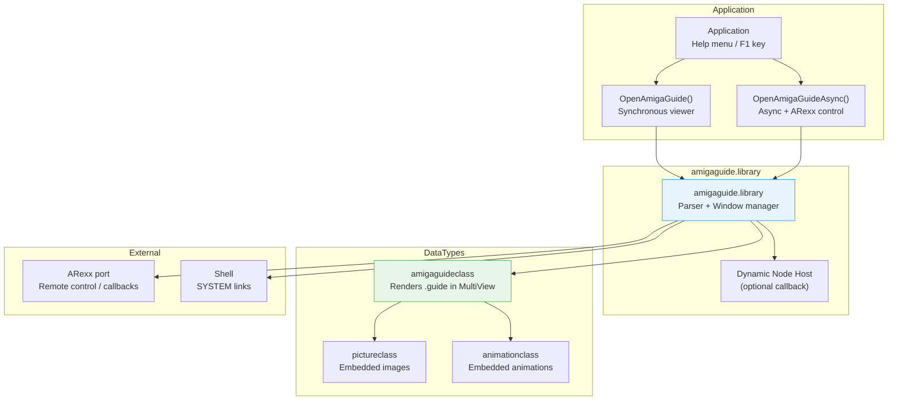

[← Home](../README.md) · [Libraries](README.md)

# AmigaGuide — Hypertext Help System and Database Format

## Overview

AmigaGuide is AmigaOS's native hypertext document format, introduced in 1991 and elevated to a system component with OS 3.0. An AmigaGuide database is a plain ASCII file annotated with `@` commands that define nodes, links, text attributes, and executable actions.

The `amigaguide.library` provides both a standalone viewer and a programmatic API, allowing applications to open help databases synchronously or asynchronously, send navigation commands via an ARexx port, and even generate content dynamically at runtime through **dynamic nodes**. Because AmigaGuide is also implemented as a DataType class (`amigaguideclass`), any application using the DataTypes framework — including MultiView — can display `.guide` files without additional code. For developers, this means a single help file format serves both standalone documentation and in-application context-sensitive help, with cross-database linking, embedded images (via DataTypes), and ARexx-driven interactivity built in.

> **Key constraint**: AmigaGuide is text-centric. While it can launch images, animations, and audio through DataType links, the document itself is linear text — there is no concept of a 2D page layout, embedded widgets, or cascading stylesheets.

---

## Architecture

### System Components



### File → Nodes → Links

An AmigaGuide database is a flat file divided into **nodes**. Each node is a self-contained document fragment. Navigation between nodes happens through **links**, which are rendered as clickable buttons in the viewer.

```
@DATABASE MyApp.guide
@INDEX Main

@NODE Main "MyApp Help"
Welcome to MyApp.

@{"Getting Started" LINK GettingStarted}
@{"Reference" LINK Reference}
@EndNode

@NODE GettingStarted "Getting Started"
1. Install the software.
2. Run from Workbench.

@{"Back to Main" LINK Main}
@EndNode
```

---

## File Format Reference

### Database-Level Commands (Global)

These commands apply to the entire database. Most must appear at the start of the file, before the first `@NODE`.

| Command | Description | Required |
|---|---|---|
| `@DATABASE <name>` | Identifies this file as an AmigaGuide database. Must be the **first line**. | Yes |
| `@INDEX <node>` | Specifies the node used for the **Index** button. Defaults to MAIN if omitted. | No |
| `@HELP <node>` | Specifies the node used for the **Help** button. | No |
| `@WIDTH <chars>` | Declares the maximum width of any node (viewer hint). | No |
| `@HEIGHT <rows>` | Declares the maximum height of any node. | No |
| `@FONT <name> <size>` | Default font for the database. | No |
| `@WORDWRAP` | Enables automatic word wrapping (V39). | No |
| `@SMARTWRAP` | Smarter wrapping: paragraphs separated by blank lines (V40). | No |
| `@TAB <spaces>` | Tab stop width (default 8) (V40). | No |
| `@AUTHOR <name>` | Author metadata. | No |
| `@(C) <text>` | Copyright notice. | No |
| `$VER: <version>` | Standard AmigaDOS version string. | No |
| `@ONOPEN <rexx>` | ARexx command to execute when the database opens (V40). | No |
| `@ONCLOSE <rexx>` | ARexx command to execute when the database closes (V40). | No |

### Node-Level Commands

| Command | Description |
|---|---|
| `@NODE <name> "<title>"` | Starts a new node. `<name>` must be unique, no spaces. `<title>` appears in the window title bar. |
| `@ENDNODE` | Ends the current node. |
| `@TITLE "<title>"` | Overrides the window title for this node (alternative to `@NODE`'s title argument). |
| `@TOC <node>` | Sets the **Contents** button target for this node. Defaults to MAIN. |
| `@PREV <node>` | Sets the **Browse <** target. Defaults to previous node in file. |
| `@NEXT <node>` | Sets the **Browse >** target. Defaults to next node in file. |
| `@REMARK <text>` | Comment — not displayed. |

### Link Syntax

Links are the core hypertext mechanism. They can appear anywhere on a line and are rendered as buttons.

```
@{"<label>" <action> <arguments>}
```

#### Action Commands

| Action | Syntax | Description |
|---|---|---|
| `LINK` | `@{"Label" LINK TargetNode}` | Jump to another node in this database. |
| `LINK` (cross-db) | `@{"Label" LINK Other.guide/NodeName}` | Jump to a node in another database. |
| `RX` | `@{"Label" RX 'ADDRESS MYPORT MyCommand'}` | Execute an ARexx command. |
| `RXS` | `@{"Label" RXS MyScript.rexx}` | Run an ARexx script file. |
| `SYSTEM` | `@{"Label" SYSTEM 'dir >ram:output'}` | Execute a Shell command. |
| `BEEP` | `@{"Label" BEEP}` | Play the system beep. |
| `QUIT` | `@{"Label" QUIT}` | Close the AmigaGuide viewer. |

> **Cross-database paths**: The path can be any AmigaDOS path, including assigns. If no path is given, AmigaGuide searches `ENV:AmigaGuide/Path`. As of OS 3.0, you can also link to any DataTypes-supported file: `@{"Picture" LINK image.iff/Main}`.

### Text Attributes

Attributes wrap text in `@{name ...}` and must be terminated with `@{uname}` (undo attribute).

| Attribute | Description | Example |
|---|---|---|
| `@{b}` / `@{ub}` | Bold on / off | `@{b}bold text@{ub}` |
| `@{i}` / `@{ui}` | Italic on / off | `@{i}italic@{ui}` |
| `@{u}` / `@{uu}` | Underline on / off | `@{u}underlined@{uu}` |
| `@{fg <n>}` / `@{ufg}` | Foreground pen color | `@{fg 2}red text@{ufg}` |
| `@{bg <n>}` / `@{ubg}` | Background pen color | `@{bg 1}highlighted@{ubg}` |
| `@{jleft}` | Left justify (default) | |
| `@{jright}` | Right justify | |
| `@{jcenter}` | Center justify | |
| `@{amigaguide}` | Embed an AmigaGuide glyph | |
| `@{clear}` | Clear to end of line | |

### Macros (V40)

Macros let you define reusable attribute sequences:

```
@MACRO warning "@{b}WARNING:@{ub} $1"

Later in text:
This is a @{"critical issue" warning "Do not power off during format."}
```

---

## Data Structures

### NewAmigaGuide

```c
/* libraries/amigaguide.h — NDK 3.9 */
struct NewAmigaGuide {
    BPTR                nag_Lock;       /* Lock on database directory */
    STRPTR              nag_Name;       /* Database file name */
    struct Screen *     nag_Screen;     /* Screen to open on, or NULL */
    STRPTR              nag_PubScreen;  /* Name of public screen */
    STRPTR              nag_HostPort;   /* App's ARexx port (unused) */
    STRPTR              nag_ClientPort; /* Base name for DB's ARexx port */
    ULONG               nag_Flags;      /* NAGF_* flags */
    STRPTR *            nag_Context;    /* NULL-terminated context array */
    STRPTR              nag_Node;       /* Starting node name */
    LONG                nag_Line;       /* Starting line number */
    struct TagItem *    nag_Extens;     /* Additional tags (V37+) */
    APTR                nag_Client;     /* Private — must be NULL */
};
```

### Flags

| Flag | Value | Meaning |
|---|---|---|
| `NAGF_LOCK` | `0x0001` | `nag_Lock` is valid |
| `NAGF_CLOSE` | `0x0002` | Close the database file when done |
| `NAGF_NOTIFY` | `0x0004` | Enable ARexx notification |
| `NAGF_HOSTPORT` | `0x0008` | `nag_HostPort` is valid |
| `NAGF_CONTEXT` | `0x0010` | `nag_Context` is valid |
| `NAGF_UNIQUE` | `0x0020` | Create unique ARexx port name |

---

## API Reference

### Synchronous Viewer

```c
#include <libraries/amigaguide.h>
#include <proto/amigaguide.h>

/* Open a modal AmigaGuide viewer. Blocks until user closes all windows. */
AMIGAGUIDECONTEXT OpenAmigaGuideA(struct NewAmigaGuide *nag,
                                  struct TagItem *attrs);
AMIGAGUIDECONTEXT OpenAmigaGuide(struct NewAmigaGuide *nag,
                                  Tag tag1, ...);

/* Close the viewer and free resources */
void CloseAmigaGuide(AMIGAGUIDECONTEXT handle);
```

**Common tags for `OpenAmigaGuide()`:**

| Tag | Description |
|---|---|
| `AGA_HelpGroup` | Unique ID for help window grouping (V39) |

### Asynchronous Viewer

```c
/* Open a non-modal viewer. Returns immediately. */
AMIGAGUIDECONTEXT OpenAmigaGuideAsyncA(struct NewAmigaGuide *nag,
                                       struct TagItem *attrs);

/* Send a command to an async AmigaGuide instance */
LONG SendAmigaGuideCmdA(AMIGAGUIDECONTEXT handle,
                        STRPTR cmd,
                        struct TagItem *attrs);

/* Send a context-sensitive help request */
LONG SendAmigaGuideContextA(AMIGAGUIDECONTEXT handle,
                            struct TagItem *attrs);
```

### Navigation Commands (SendAmigaGuideCmd)

Commands are sent as strings to the async viewer:

| Command | Effect |
|---|---|
| `"BUTTON Contents"` | Click the Contents button |
| `"BUTTON Index"` | Click the Index button |
| `"BUTTON Retrace"` | Click Retrace |
| `"BUTTON Browse <"` | Browse previous |
| `"BUTTON Browse >"` | Browse next |
| `"BUTTON Help"` | Click Help |
| `"NODE <name>"` | Jump to a specific node |
| `"QUIT"` | Close the viewer |

---

## Practical Examples

### Example 1: Minimal Help Database

```
@database MyApp.guide

@NODE Main "MyApp Help"
@{b}MyApp v1.0 Help@{ub}

Welcome to MyApp. Choose a topic:

@{"Quick Start" LINK QuickStart}
@{"Menu Reference" LINK MenuRef}
@{"Troubleshooting" LINK Troubleshoot}
@EndNode

@NODE QuickStart "Quick Start"
1. Double-click the MyApp icon.
2. Select @{"New Project" LINK NewProject} from the Project menu.
3. Save often with @{"Save" SYSTEM "echo Save reminder >CON:0/0/400/50/MyApp"}.

@{"Back to Main" LINK Main}
@EndNode

@NODE MenuRef "Menu Reference"
| Menu | Item | Action |
| Project | New | Creates a new document |
| Project | Open | Opens an existing document |
| Project | Save | Saves the current document |

@{"Back to Main" LINK Main}
@EndNode

@NODE Troubleshoot "Troubleshooting"
@{b}Common Problems@{ub}

@{b}Problem:@{ub} App crashes on startup.
@{b}Solution:@{ub} Ensure @{"MYAPP: assign" SYSTEM "assign >NIL:"} exists.

@{"Back to Main" LINK Main}
@EndNode
```

### Example 2: Open Help from an Application

```c
#include <exec/types.h>
#include <libraries/amigaguide.h>
#include <proto/amigaguide.h>
#include <proto/dos.h>

void ShowHelp(CONST_STRPTR dbPath, CONST_STRPTR nodeName)
{
    struct NewAmigaGuide nag = {0};

    nag.nag_Name = (STRPTR)dbPath;
    nag.nag_Node = (STRPTR)nodeName;
    nag.nag_Flags = NAGF_CLOSE;

    AMIGAGUIDECONTEXT ctx = OpenAmigaGuide(&nag, TAG_DONE);
    if (ctx)
    {
        /* Synchronous: blocks here until user closes viewer */
        CloseAmigaGuide(ctx);
    }
    else
    {
        LONG err = IoErr();
        Printf("Failed to open help: %ld\n", err);
    }
}
```

### Example 3: Async Help with ARexx Control

```c
#include <libraries/amigaguide.h>
#include <proto/amigaguide.h>

struct NewAmigaGuide nag = {0};
nag.nag_Name = "MyApp.guide";
nag.nag_Node = "Main";
nag.nag_Flags = NAGF_CLOSE | NAGF_NOTIFY;

AMIGAGUIDECONTEXT ctx = OpenAmigaGuideAsyncA(&nag, NULL);
if (ctx)
{
    /* Application continues running... */

    /* Later: programmatically navigate to a node */
    SendAmigaGuideCmdA(ctx, "NODE Troubleshoot", NULL);

    /* Later: close help from code */
    SendAmigaGuideCmdA(ctx, "QUIT", NULL);

    CloseAmigaGuide(ctx);
}
```

### Example 4: Context-Sensitive Help (F1 Key)

```c
/* In your IDCMP event loop: */
case IDCMP_RAWKEY:
    if (code == 0x5B)   /* Help key scancode */
    {
        /* Determine which gadget is under the mouse */
        UWORD gadID = GetGadgetIDUnderMouse(win);

        CONST_STRPTR node = "Main";
        switch (gadID)
        {
            case GAD_OPEN:   node = "FileOpen";   break;
            case GAD_SAVE:   node = "FileSave";   break;
            case GAD_PREFS:  node = "Preferences"; break;
        }

        ShowHelp("PROGDIR:MyApp.guide", node);
    }
    break;
```

---

## Decision Guide

| Criterion | AmigaGuide | Raw Text + More | IFF-FTXT |
|---|---|---|---|
| **When to use** | Application help; cross-linked docs; need buttons and ARexx | Simple one-page docs; minimal dependencies | Structured text with formatting but no interactivity |
| **Interactivity** | Links, ARexx, Shell commands | None | None |
| **Images/audio** | Via DataType links (V39+) | None | None |
| **Cross-database links** | Yes — `@{"Label" LINK other.guide/node}` | No | No |
| **Viewer required** | amigaguide.library or MultiView | Any text viewer | Any IFF text viewer |
| **OS version** | OS 2.0+ (full features: 3.0+) | Works everywhere | OS 1.3+ |
| **Embedding in app UI** | Can open standalone only; not embeddable as gadget | Display in custom read-only string gadget | Display in custom gadget |

---

## Historical Context & Modern Analogies

### The Elegance of Executable Documentation

AmigaGuide was not merely a hypertext format — it was a **programmable application extension mechanism** disguised as a help file. A developer could ship a `.guide` file that, when the user clicked a link, sent an ARexx command back to the running application, executed a shell script to repair a configuration, or opened an IFF image through the DataTypes system. The help file was not static documentation; it was an interactive partner to the application.

This design philosophy — **documentation as code** — would not resurface in mainstream computing until the rise of literate programming tools, Jupyter notebooks, and interactive web documentation in the 2010s. In 1991, it was genuinely unique.

Consider what a single AmigaGuide database could do without the host application knowing anything about its internal structure:

1. **Navigate internally** — `@NODE` and `@LINK` provide structured hypertext
2. **Control the host application** — `RX` links send ARexx commands to the app's port
3. **Modify the system** — `SYSTEM` links execute shell commands
4. **Display rich media** — cross-links to any DataType-supported image, sound, or animation
5. **Form a documentation graph** — cross-database `@{"Other" LINK lib.guide/Main}` creates a web of help files

The host application only needed to call `OpenAmigaGuideAsyncA()` with a file path. Everything else — rendering, navigation, interactivity, media embedding — was handled by `amigaguide.library` and the DataTypes framework.

### The 1991 Competitive Landscape

| Platform (1991) | System | Hypertext | Scripting | External Linking | App Control | System Integration |
|---|---|---|---|---|---|---|
| **AmigaOS** | **AmigaGuide** | Nodes | ARexx (RX/RXS) | Cross-db `.guide` | Yes — ARexx ports | DataTypes, Shell |
| **Mac OS** | **HyperCard** (1987) | Visual stacks | HyperTalk | Stack-to-stack | Limited — AppleEvents | Clipboard, File |
| **Windows 3.0** | **WinHelp** (`.hlp`) | Popups, macros | Limited macro lang | No | No | ShellExecute |
| **NeXTSTEP** | **Help** + **Digital Librarian** | Rich text | No | No | No | Search index |
| **UNIX** | **Texinfo** / **man -k`** | Cross-references | No | Info nodes only | No | man path |
| **VMS** | **Bookreader** | Structured docs | No | No | No | DEC-specific |

The critical differentiator is the **ARexx bidirectional control**. HyperCard stacks could script the Macintosh (via AppleEvents, later), but the help file could not easily send a command to a *specific running application* and expect a response. WinHelp macros were confined to the help viewer itself. AmigaGuide's `RX` links could address any ARexx port on the system — including the application that opened the help file — creating a true conversational relationship between documentation and software.

### How It Worked in Practice: The MUI Developer Reference

The **MUI (Magic User Interface)** developer reference — `MUIdev.guide` — is perhaps the finest example of AmigaGuide's power. It was not a manual; it was an ecosystem:

| Feature | Traditional Manual | MUIdev.guide |
|---|---|---|
| Class reference | Static tables | `@NODE` per class with `@TOC` navigation |
| Example code | Embedded in text | `SYSTEM` links to run example scripts |
| Cross-references | Page numbers | `@LINK` to other `.guide` databases |
| Method parameters | Text description | ARexx-driven parameter exploration (in advanced setups) |
| Updates | Re-print or new edition | Drop-in replacement `.guide` file |

A developer reading about `Listview.mui` could click a link to jump to the `List` class reference in the same file, click another to open the `Popobject.mui` reference in a separate database, and click a third to execute an ARexx script that created a live example window — all without leaving the help viewer.

### Modern Analogies

No single modern system replicates AmigaGuide's exact combination of properties, but several come close in different dimensions:

| AmigaGuide Concept | Modern Equivalent | Why It Maps (and Where It Diverges) |
|---|---|---|
| `@NODE` / modular docs | **DITA topics / DocBook `<section>`** | Modular, reusable document fragments. DITA goes further with conditional profiling (`@audience`, `@platform`); AmigaGuide has no conditional text. |
| `@{"Label" LINK Node}` | **HTML `<a href>` + anchor** | Direct hypertext navigation. HTML is richer (CSS styling, embedded media); AmigaGuide links are constrained to button-like widgets. |
| `RX` / `RXS` — app control from docs | **Jupyter Notebook cells** | Documentation that executes code and returns results. Jupyter is far more powerful (Python, visualization, stateful kernels), but requires a heavy runtime. AmigaGuide's ARexx was lightweight and system-wide. |
| `SYSTEM` — shell from docs | **Markdown code fences with `bash` execution** (e.g., R Markdown, Quarto) | Document-embedded command execution. Modern tools sandbox or prompt; AmigaGuide executed with the user's full privileges. |
| Cross-database `@LINK other.guide` | **HTML `<a href>` across files** | The web itself is the analogy — a distributed documentation graph. AmigaGuide's `ENV:AmigaGuide/Path` is a primitive `PATH` for docs. |
| `amigaguide.library` viewer | **Qt Assistant / Apple Help Viewer / DevDocs** | Dedicated offline help viewers. Modern viewers support full-text search, indexing, and CSS; AmigaGuide had none of these but loaded instantly on 68000-class hardware. |
| `.guide` as DataType | **HTML rendered in any WebKit view** | Universal rendering via shared framework. The key difference: a DataType object is an OS-native BOOPSI object; a WebKit view is an application-embedded widget. |
| `@ONOPEN` / `@ONCLOSE` | **HTML `<body onload>` / JavaScript `DOMContentLoaded`** | Event-driven document lifecycle. AmigaGuide's events are limited to ARexx commands; modern web docs have full Turing-complete scripting. |

### What Made AmigaGuide Unique (and Unreplicated)

Despite the partial modern analogies above, no contemporary system in 1991 — and few today — offered this specific combination:

1. **Zero-compilation hypertext with system-wide reach**: HyperCard required the HyperCard runtime (a separate application). WinHelp required a compiler (`hc.exe`) to build `.hlp` from `.rtf` source. AmigaGuide files are plain ASCII — editable in any text editor, viewable in any AmigaGuide-aware application, with no build step.

2. **Documentation as remote control**: The `RX` link is not merely "run a script" — it is "send a message to a named port." This means the help file can query application state (`ADDRESS MyApp GETVERSION`), trigger actions (`ADDRESS MyApp DOACTION`), or chain multiple applications together. It is RPC embedded in documentation.

3. **Late-bound media embedding**: Because AmigaGuide links to DataTypes, a `.guide` file written in 1991 could embed a PNG image in 1996, an MP3 in 2000, or a video in 2026 — without the help file or the viewer knowing what PNG, MP3, or video formats are. The DataTypes system (see [datatypes.md](datatypes.md)) handles the indirection.

4. **No host application dependency**: A `.guide` file is self-sufficient. It carries its own navigation structure (`@INDEX`, `@TOC`), styling (`@MACRO`, attributes), and actions. The host application does not need to parse, render, or understand the file format — it merely hands the path to `amigaguide.library`.

### Where the Analogies Break Down

- **No compilation step**: Unlike WinHelp (`.hlp`) or modern CHM, `.guide` files are raw text — no indexing, compression, or encryption. This is simpler but slower for large documents.
- **No full-text search**: The viewer does not index content. Navigation is entirely through pre-defined links or external tools.
- **No conditional text**: There is no `#if`, audience profiling, or platform-specific filtering. Every user sees every node.
- **Linear rendering**: Nodes are displayed as scrolling text — no pagination, no columns, no responsive layout, no CSS.
- **No security model**: `SYSTEM` and `RX` links execute with the user's full privileges. There is no sandbox, no confirmation dialog, and no capability system. A malicious `.guide` file can delete files or send harmful ARexx commands.
- **ARexx dependency**: The full power of AmigaGuide requires a functional `rexxsyslib.library` and ARexx port infrastructure. On systems without ARexx, `RX` links fail silently and async mode loses much of its utility.

---

## When to Use / When NOT to Use

### When to Use AmigaGuide

| Scenario | Why AmigaGuide Works |
|---|---|
| **Application help files** | Native OS support; opens from Help key; context-sensitive via `nag_Node` |
| **Cross-referenced documentation** | `LINK other.guide/node` creates a documentation ecosystem |
| **Interactive tutorials** | `SYSTEM` and `RX` links let users execute commands from within help |
| **Small-to-medium docs (< 200 KB)** | Raw text is efficient; no compilation overhead |
| **Integration with ARexx-enabled apps** | Help can send commands back to the application |

### When NOT to Use AmigaGuide

| Scenario | Problem | Better Alternative |
|---|---|---|
| **Large manuals (> 500 KB)** | No search; linear loading; slow navigation | Split into multiple `.guide` files or use external viewer |
| **Print-quality documentation** | No page layout, margins, or typography control | Texinfo → PostScript, or DTP tools |
| **Secure/restricted content** | No access control; plain text is trivially editable | Compiled help (WinHelp-style) or PDF |
| **Embedded in-app help pane** | Cannot embed AmigaGuide viewer as a sub-window gadget | Custom read-only BOOPSI gadget with formatted text |
| **Modern cross-platform docs** | `.guide` is Amiga-only | HTML, Markdown, or plain text |

---

## Best Practices & Antipatterns

### Best Practices

1. **Always name the first node `MAIN`** — viewers default to it if no starting node is specified.
2. **Set `@INDEX` and `@TOC`** — gives users predictable navigation buttons.
3. **Use `@SMARTWRAP` (V40) instead of `@WORDWRAP`** — produces cleaner output on all viewer versions.
4. **Provide a `@{"Back" LINK ...}` link on every non-MAIN node** — users expect a way back.
5. **Use `PROGDIR:` or assigned paths for cross-database links** — avoids breakage when the user moves the application.
6. **Set `$VER:`** — allows the `Version` command to report the help file version.
7. **Keep nodes focused** — one topic per node; deep nesting via links is better than long scrolling.
8. **Test in both MultiView and standalone AmigaGuide** — rendering differs slightly between viewers.
9. **Use `@MACRO` for consistent styling** (V40) — reduces markup repetition.
10. **Set `@ONCLOSE` to clean up** if your `@{RX}` links create temporary files or ports.

### Antipatterns

#### 1. The Missing EndNode

```
/* ANTIPATTERN — @ENDNODE omitted */
@NODE Main "Help"
Welcome to the app.
@NODE Setup "Setup"
Install instructions.
@EndNode

/* RESULT: "Setup" node includes all text from MAIN onwards
   because MAIN was never properly closed. */

/* CORRECT — always close every node */
@NODE Main "Help"
Welcome to the app.
@EndNode

@NODE Setup "Setup"
Install instructions.
@EndNode
```

#### 2. The Broken Cross-Database Link

```
/* ANTIPATTERN — relative path assumes current directory */
@{"See Also" LINK OtherApp.guide/Main}

/* If the user opens help from a different directory, this fails. */

/* CORRECT — use an assign or absolute path */
@{"See Also" LINK MYAPP:Docs/OtherApp.guide/Main}
```

#### 3. The Unclean RX Link

```
/* ANTIPATTERN — RX command with unquoted special characters */
@{"Run" RX 'ADDRESS MYPORT Run script with spaces'}

/* Parsing ambiguity — may truncate at first space in argument. */

/* CORRECT — quote the argument or use RXS for complex scripts */
@{"Run" RX 'ADDRESS MYPORT "Run script with spaces"'}
```

#### 4. The Invisible Link

```
/* ANTIPATTERN — link text that looks like body text */
For more information see the advanced topics section.

/* No clickable link — users won't know it's interactive. */

/* CORRECT — use explicit button-like labels */
For more information, @{"click here for advanced topics" LINK Advanced}.
```

---

## Pitfalls & Common Mistakes

### 1. Node Name Collisions

```
/* PITFALL — node names are case-insensitive but must be unique */
@NODE Setup "Setup"
@NODE setup "Setup Details"   /* COLLISION: "setup" == "Setup" */
```

### 2. AmigaGuide Path Not Set

```
/* PITFALL — cross-database links fail if ENV:AmigaGuide/Path is missing */
@{"External" LINK SomeLib.guide/Main}

/* If SomeLib.guide is not in the current directory or the path,
   the link silently fails. Set the path at install time:
   SetEnv AmigaGuide/Path "MYAPP:Docs" */
```

### 3. Forgetting Synchronous Blocks

```c
/* PITFALL — calling OpenAmigaGuide() from the main task freezes UI */
void OnHelpClick(void)
{
    /* This blocks until the user closes the help window! */
    OpenAmigaGuide(&nag, TAG_DONE);
    /* App is frozen — no IDCMP processing, no timer events */
}

/* CORRECT — use async mode for multi-window apps */
void OnHelpClick(void)
{
    ctx = OpenAmigaGuideAsyncA(&nag, NULL);
    /* App continues; handle help closure via ARexx or ignore */
}
```

### 4. Dynamic Node Confusion

Dynamic nodes are generated on-the-fly by an application hosting `amigaguide.library`. If you are not implementing a dynamic node host, do not use `@DNODE` — it is obsolete and ignored by modern viewers.

### 5. Attribute Nesting Errors

```
/* PITFALL — incorrect nesting of attributes */
@{b}bold @{i}bold-italic@{ub} still italic@{ui}

/* @{ub} undoes bold, but italic is still active.
   Viewer rendering is undefined. */

/* CORRECT — close in reverse order of opening (LIFO) */
@{b}bold @{i}bold-italic@{ui} bold again@{ub} normal
```

---

## Use Cases

### Real-World Software Using AmigaGuide

| Software | AmigaGuide Usage |
|---|---|
| **MultiView** (OS 3.0+) | Displays any `.guide` file via `amigaguideclass` — the default viewer |
| **SAS/C** | Compiler error explanations linked via AmigaGuide |
| **Directory Opus** | Configuration help and button reference |
| **MUI** | `MUIdev.guide` — the entire MUI developer reference is an AmigaGuide database |
| **AmigaOS installer scripts** | Post-install help often launched as AmigaGuide |
| **Aminet** | Package documentation frequently shipped as `.guide` files |

### Common Integration Patterns

**Pattern A: Context-Sensitive Help**
```
Application maintains a mapping:
  Window A + Gadget X → "NodeRef/GadgetX"
  Window B + Menu Y   → "NodeRef/MenuY"

On Help key:
  nag.nag_Node = mappedNode;
  OpenAmigaGuideAsyncA(&nag, NULL);
```

**Pattern B: ARexx-Driven Navigation**
```
Application exposes ARexx port "MYAPP.1"
AmigaGuide links use:
  @{"Do Action" RX 'ADDRESS MYAPP.1 DOACTION'}

Result: User clicks help → ARexx command sent → app performs action
```

**Pattern C: Documentation Suite**
```
MyApp.guide      (main help)
MyApp_API.guide  (function reference)
MyApp_Tools.guide (utility reference)

Cross-links:
  MyApp.guide: @{"API Reference" LINK MyApp_API.guide/Main}
  MyApp_API.guide: @{"Back to User Guide" LINK MyApp.guide/Main}
```

### AmigaOS Developer Documentation as AmigaGuide

Commodore itself structured the entire AmigaOS developer documentation corpus as AmigaGuide databases. The **Amiga Developer CD 2.1 (ADCD 2.1)** — the definitive official SDK — shipped the following manuals as `.guide` files:

| ADCD 2.1 Path | Content | Approximate Scope |
|---|---|---|
| `Libraries_Manual_guide/` | *ROM Kernel Reference Manual: Libraries* | Every system library: Exec, DOS, Intuition, Graphics, etc. |
| `Devices_Manual_guide/` | *ROM Kernel Reference Manual: Devices* | TrackDisk, Audio, Serial, Parallel, Timer, etc. |
| `Hardware_Manual_guide/` | *ROM Kernel Reference Manual: Hardware* | Custom chips, DMA, CIA, chipset registers |
| `Includes_and_Autodocs_3._guide/` | NDK 3.1 headers + autodocs | All struct definitions and function-by-function API docs |

This was not merely a packaging choice — it was an architectural statement. The same AmigaGuide viewer that displayed a game's help file could display the complete technical reference for `graphics.library` or the Blitter's minterm logic. A developer could:

1. **Browse autodocs interactively** — click `@LINK` cross-references to jump from `AllocMem` to `MemHeader` to `FreeMem`
2. **Keep docs open while coding** — the async viewer sat alongside the editor, navigable without leaving the Workbench
3. **Search with external tools** — because `.guide` files are plain ASCII, `grep` and `Search` could find text inside them; no proprietary indexing format required
4. **Ship custom subsets** — a developer could copy just the relevant autodoc nodes into a project's `Docs/` drawer

The autodoc format — a structured comment convention in NDK header files — was also converted to AmigaGuide by community tools. **New Style Autodocs** (Aminet `dev/misc/NSA_amigaguide.lha`, 2002) repackaged library autodocs as hyperlinked `.guide` files with `@NODE` per function and `@TOC` navigation, making the raw API reference far more browsable than scrolling through flat text files.

### Authoring Tools and Converters

Because AmigaGuide is plain ASCII, any text editor suffices for authoring. However, several specialized tools streamlined creation and conversion:

| Tool | Aminet Path | Purpose |
|---|---|---|
| **AGWriter** | `text/hyper/AGWriter103.lha` | GUI editor for creating, editing, and validating AmigaGuide files. Supports WYSIWYG-style node management, link insertion (`LINK`, `RX`, `RXS`, `SYSTEM`), and round-trip conversion to plain text. |
| **GuideML** | `text/hyper/guideml.lha` | AmigaGuide-to-HTML converter (C + GUI). Converts `@NODE` to HTML pages, `@LINK` to `<a href>`, and attributes to inline styles. Includes source code. |
| **ag2html** | `text/hyper/ag2html.lha` | Perl script that converts a `.guide` file into a directory of interlinked HTML files suitable for web serving. |
| **HTML2Guide** | `util/conv/HTML2Guide-1.2.lha` | Reverse converter: batch-converts `.html`/`.htm` files (including subdirectories) into a single AmigaGuide database with preserved relative links. |
| **New Style Autodocs** | `dev/misc/NSA_amigaguide.lha` | Reformats NDK autodoc text files into hyperlinked AmigaGuide databases with per-function `@NODE` entries. |

> [!NOTE]
> The ADCD 2.1 online mirror (`http://amigadev.elowar.com/read/ADCD_2.1/`) renders the original AmigaGuide `.guide` files as HTML using modern server-side conversion. The URL structure directly maps to the original ADCD directory layout, preserving the node hierarchy that Commodore established in 1994.

---

## FAQ

**Q: Can I embed an image directly in an AmigaGuide node?**
> Not inline. You link to it via `@{"Image" LINK picture.iff/Main}` (V39+). The DataTypes viewer opens the image in a separate window or replaces the current view depending on the viewer.

**Q: Why does my link to another database fail?**
> Either the path is wrong, or `ENV:AmigaGuide/Path` does not include the target directory. Always use assigns (e.g., `MYAPP:Docs/Other.guide/Main`) for reliability.

**Q: What is the difference between `RX` and `RXS`?**
> `RX` executes an inline ARexx command string. `RXS` executes an ARexx script file from disk. Use `RXS` for complex multi-line scripts.

**Q: Can I use AmigaGuide on OS 1.3?**
> No. AmigaGuide requires OS 2.0+ for the viewer, and OS 3.0+ for DataType integration (cross-linking to images/audio). On 1.3, use plain text or IFF-FTXT.

**Q: How do I make my `.guide` file open from Workbench?**
> Set the icon's default tool to `SYS:Utilities/MultiView` (OS 3.0+) or `SYS:Utilities/AmigaGuide`. Ensure `amigaguide.library` is in `LIBS:`.

**Q: Is there a size limit for AmigaGuide files?**
> No hard limit, but files over ~500 KB become unwieldy due to the lack of full-text search. Split large documentation into multiple linked databases.

**Q: Can I convert AmigaGuide to HTML?**
> Not natively. Third-party tools exist (e.g., `guide2html` on Aminet) that parse the `@` commands and emit HTML. The mapping is straightforward since the concepts are similar.

---

## References

- NDK 3.9: `libraries/amigaguide.h`, `datatypes/amigaguideclass.h`
- ADCD 2.1: `amigaguide.library` autodocs (`OpenAmigaGuide`, `OpenAmigaGuideAsync`, `SendAmigaGuideCmd`)
- *Amiga ROM Kernel Reference Manual: Libraries* — Appendix C: AmigaGuide
- See also: [datatypes.md](datatypes.md) — DataTypes framework that powers `amigaguideclass` and media embedding
- See also: [rexxsyslib.md](rexxsyslib.md) — ARexx scripting and port communication
- See also: [input_events.md](../09_intuition/input_events.md) — Handling Help key and IDCMP for context-sensitive help
- See also: [boopsi.md](../09_intuition/boopsi.md) — BOOPSI foundation underlying the AmigaGuide DataType
