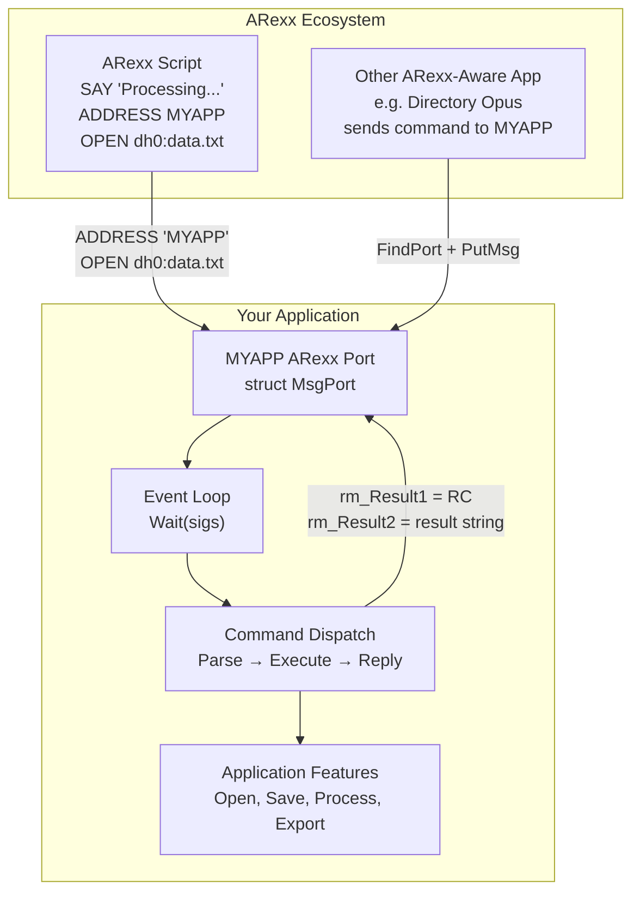
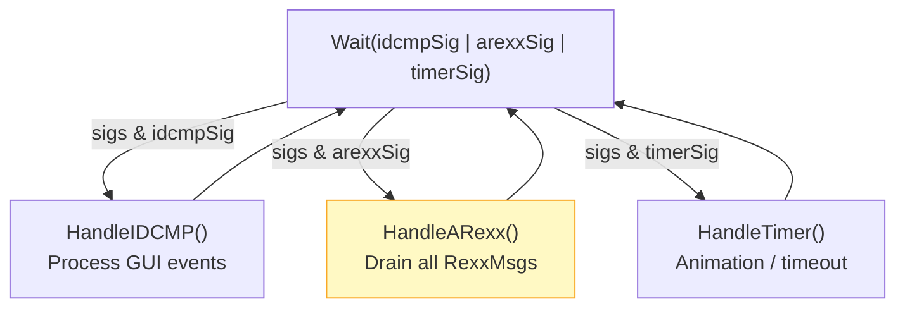
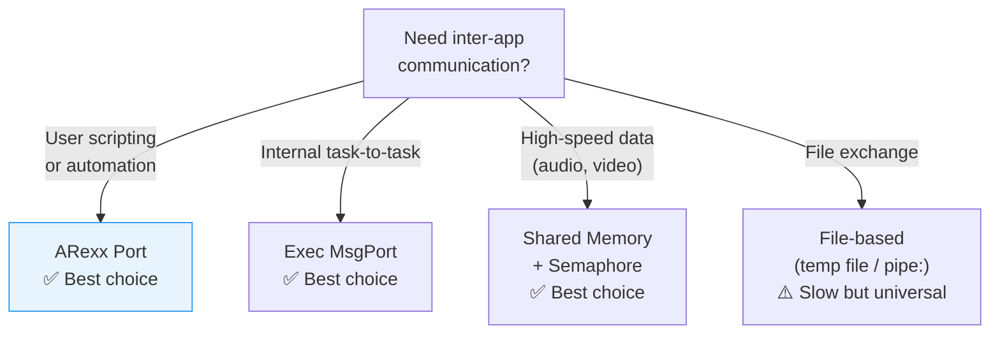

[← Home](../README.md) · [Libraries](README.md)

# ARexx Integration Guide — Exposing Application Features to Scripting

## Overview

ARexx is the Amiga's universal scripting glue — the equivalent of AppleScript on macOS, COM Automation on Windows, or D-Bus on Linux. Any C/C++ Amiga application that exposes an **ARexx port** becomes scriptable: users can automate repetitive workflows, chain your application with others in multi-step scripts, and integrate it into their custom toolchains. An application with ARexx support is a **first-class Amiga citizen** — professional software (Directory Opus, IBrowse, CygnusEd, AmiTCP) all ship with rich ARexx command sets. Conversely, an application without an ARexx port is a dead end in the Amiga software ecosystem — it cannot participate in user automation, cannot be driven by other applications, and cannot serve as a component in larger workflows. This is not a "nice to have"; it is what separates a polished Amiga product from a demo.

This article is a **complete developer's guide** to ARexx integration from C/C++ — covering port setup, command loop design, structured dispatch, result handling, standard conventions, bidirectional communication, security hardening, and the event-loop integration patterns that work in real applications. It complements the [rexxsyslib.library](rexxsyslib.md) API reference with the engineering practice those API docs don't teach.



---

## Architecture

### How ARexx Communication Works

ARexx communication is **message-passing over Exec message ports**. There is no separate ARexx protocol layer — an ARexx command is simply a `RexxMsg` (a subclass of `Message`) posted to a named public message port.

| Layer | Mechanism | Your Responsibility |
|---|---|---|
| **Transport** | `struct MsgPort` with public name, `PutMsg`/`GetMsg`/`ReplyMsg` | Create the port, drain messages, clean up |
| **Message Format** | `struct RexxMsg` wrapping the command string and arguments | Parse `rm_Args[0]` (command string), set `rm_Result1`/`rm_Result2` |
| **Addressing** | Script uses `ADDRESS 'PORTNAME'`; apps use `FindPort()` | Choose a unique, memorable port name |
| **Result Delivery** | `ReplyMsg()` unblocks the sender; results read from `rm_Result1`/`rm_Result2` | Set result fields BEFORE calling `ReplyMsg()` |

### The RexxMsg Structure

```c
/* rexx/rxslib.h — NDK39 */
struct RexxMsg {
    struct Message rm_Node;      /* Exec message — link, reply port */
    APTR           rm_TaskBlock; /* Private to ARexx interpreter */
    APTR           rm_LibBase;   /* rexxsyslib.library base */
    LONG           rm_Action;    /* RXCOMM | RXFF_RESULT flags */
    LONG           rm_Result1;   /* Primary return code (0 = success) */
    LONG           rm_Result2;   /* Secondary result (string pointer or 0) */
    STRPTR         rm_Args[16];  /* Argument strings (rm_Args[0] = command) */
    /* ... more internal fields ... */
};

/* Access macros from rexx/storage.h */
#define ARG0(msg)  ((msg)->rm_Args[0])  /* Full command string */
#define ARG1(msg)  ((msg)->rm_Args[1])  /* First argument */
#define ARG2(msg)  ((msg)->rm_Args[2])  /* Second argument */
```

> [!WARNING]
> `rm_Args[0]` contains the **entire** command string as typed by the user — not just the command name. `"OPEN dh0:data.txt AS READ"` arrives as one string in `ARG0`. You must parse sub-arguments yourself.

### Action Flags (`rm_Action`)

When sending a message, the `rm_Action` field defines how ARexx and the receiving application handle it. The primary action is combined with modifier flags:

| Flag | Purpose |
|---|---|
| `RXCOMM` | The primary action code for standard command execution |
| `RXFUNC` | Indicates a function call (rarely used for simple app IPC) |
| `RXFF_RESULT` | The sender expects a return string in `rm_Result2` |
| `RXFF_STRING` | Indicates the arguments are strings (always set for standard IPC) |
| `RXFF_COMMAND` | Used when telling the REXX daemon to execute a script file |
| `RXFF_TOKEN` | Requests ARexx to parse arguments into tokens |

---

## Phase 1: Setting Up the ARexx Port

### Basic Port Creation

```c
#include <exec/memory.h>
#include <exec/ports.h>
#include <rexx/storage.h>
#include <rexx/rxslib.h>

struct MsgPort *CreateARexxPort(CONST_STRPTR name)
{
    struct MsgPort *port = CreateMsgPort();
    if (!port) return NULL;

    port->mp_Node.ln_Name = (STRPTR)name;  /* Public port name */
    port->mp_Node.ln_Pri  = 0;
    AddPort(port);  /* Makes port findable by FindPort() */

    return port;
}
```

### Port Naming Conventions

| Convention | Example | When to Use |
|---|---|---|
| **UPPERCASE short name** | `"MYAPP"` | Single-instance applications |
| **UPPERCASE.n suffix** | `"MULTIVIEW.1"` | Multi-instance: append instance counter |
| **App-specific prefix** | `"rexx_ced"` | When uppercase clashes with another app |
| **Process-unique** | Generate dynamically | When any name collision must be avoided |

```c
/* Multi-instance port naming: */
char portName[32];
sprintf(portName, "MYAPP.%lu", instanceNumber);
struct MsgPort *port = CreateARexxPort(portName);
```

> [!WARNING]
> Port names are **case-insensitive** in ARexx (`ADDRESS 'myapp'` and `ADDRESS 'MYAPP'` both work), but the Amiga port system stores the name as-is. Don't rely on case for uniqueness — two apps named `"MyApp"` and `"MYAPP"` will conflict.

### Signal Bit Allocation

Every message port consumes one signal bit from the task's 32-bit signal space. Track it explicitly:

```c
ULONG arexxSigMask = 1L << port->mp_SigBit;
```

Combine with other signal sources in your event loop (see [Event Loop Integration](#event-loop-integration)).

---

## Phase 2: Command Loop Integration

### The Minimal Loop

```c
void ARexxEventLoop(struct MsgPort *port, BOOL *running)
{
    ULONG sigMask = 1L << port->mp_SigBit;

    while (*running)
    {
        ULONG sigs = Wait(sigMask);

        if (sigs & sigMask)
        {
            struct RexxMsg *rmsg;
            while ((rmsg = (struct RexxMsg *)GetMsg(port)))
            {
                STRPTR cmd = ARG0(rmsg);

                if (Stricmp(cmd, "QUIT") == 0)
                {
                    rmsg->rm_Result1 = RC_OK;
                    *running = FALSE;
                }
                else
                {
                    rmsg->rm_Result1 = RC_WARN;  /* Unknown command */
                }

                ReplyMsg((struct Message *)rmsg);
            }
        }
    }
}
```

### Event Loop Integration

Real applications must handle multiple signal sources simultaneously — IDCMP for GUI events, timer.device for animations, bsdsocket.library for networking, and the ARexx port for scripting. The key pattern:

```c
ULONG idcmpSig  = 1L << window->UserPort->mp_SigBit;
ULONG arexxSig  = 1L << arexxPort->mp_SigBit;
ULONG timerSig  = 1L << timerPort->mp_SigBit;

while (running)
{
    ULONG sigs = Wait(idcmpSig | arexxSig | timerSig);

    if (sigs & idcmpSig)
        HandleIDCMP(window);
    if (sigs & arexxSig)
        HandleARexx(arexxPort);
    if (sigs & timerSig)
        HandleTimer(timerPort);
}
```



> [!NOTE]
> Always drain **all** pending messages from a port before returning to `Wait()`. `GetMsg()` in a `while` loop ensures you don't miss commands that arrived between `Wait()` returning and your next `Wait()` call.

---

## Phase 3: Command Parsing & Dispatch

### String Matching Strategies

The simplest approach — `stricmp()` — works for small command sets but becomes unmaintainable beyond ~10 commands. Use it only for throwaway tools and demos.

```c
/* Adequate for ≤ 5 commands only: */
if (Stricmp(cmd, "QUIT") == 0)       { /* ... */ }
else if (Stricmp(cmd, "VERSION") == 0) { /* ... */ }
else if (Stricmp(cmd, "HELP") == 0)    { /* ... */ }
else { rmsg->rm_Result1 = RC_WARN; }
```

### Dispatch Table Pattern

For real applications, use a function-pointer dispatch table:

```c
typedef LONG (*ARexxHandler)(struct RexxMsg *, STRPTR args);

struct ARexxCommand {
    STRPTR        name;
    ARexxHandler  handler;
    STRPTR        helpText;   /* For HELP command */
};

/* Forward declarations: */
LONG CmdQuit(struct RexxMsg *msg, STRPTR args);
LONG CmdVersion(struct RexxMsg *msg, STRPTR args);
LONG CmdOpen(struct RexxMsg *msg, STRPTR args);
LONG CmdSave(struct RexxMsg *msg, STRPTR args);
LONG CmdHelp(struct RexxMsg *msg, STRPTR args);

struct ARexxCommand cmdTable[] = {
    { "QUIT",    CmdQuit,    "QUIT — Terminate the application" },
    { "VERSION", CmdVersion, "VERSION — Return application version" },
    { "OPEN",    CmdOpen,    "OPEN <filename> — Open a file" },
    { "SAVE",    CmdSave,    "SAVE <filename> — Save current document" },
    { "HELP",    CmdHelp,    "HELP [command] — Show command help" },
    { NULL, NULL, NULL }
};

LONG DispatchCommand(struct RexxMsg *rmsg)
{
    STRPTR cmd = ARG0(rmsg);

    /* Extract command name (first whitespace-delimited token): */
    char cmdName[64];
    STRPTR args = NULL;
    STRPTR space = strchr(cmd, ' ');
    if (space)
    {
        LONG len = min(space - cmd, sizeof(cmdName) - 1);
        strncpy(cmdName, cmd, len);
        cmdName[len] = '\0';
        args = space + 1;
        while (*args == ' ') args++;  /* Skip leading spaces in args */
    }
    else
    {
        strncpy(cmdName, cmd, sizeof(cmdName) - 1);
        cmdName[sizeof(cmdName) - 1] = '\0';
    }

    /* Linear search — fine for < 50 commands: */
    for (struct ARexxCommand *c = cmdTable; c->name; c++)
    {
        if (Stricmp(cmdName, c->name) == 0)
            return c->handler(rmsg, args);
    }

    return RC_WARN;  /* Unknown command */
}
```

### Subcommand Hierarchies

Many applications expose hierarchical commands (e.g., `WINDOW OPEN`, `WINDOW CLOSE`, `WINDOW LIST`). Parse the first token, then dispatch to a sub-handler:

```c
LONG CmdWindow(struct RexxMsg *rmsg, STRPTR args)
{
    if (!args) return RC_ERROR;  /* No subcommand */

    char subcmd[32];
    STRPTR subargs = NULL;
    STRPTR space = strchr(args, ' ');
    if (space)
    {
        LONG len = min(space - args, sizeof(subcmd) - 1);
        strncpy(subcmd, args, len);
        subcmd[len] = '\0';
        subargs = space + 1;
    }
    else
    {
        strncpy(subcmd, args, sizeof(subcmd) - 1);
        subcmd[sizeof(subcmd) - 1] = '\0';
    }

    if (Stricmp(subcmd, "OPEN") == 0)
        return CmdWindowOpen(rmsg, subargs);
    if (Stricmp(subcmd, "CLOSE") == 0)
        return CmdWindowClose(rmsg, subargs);
    if (Stricmp(subcmd, "LIST") == 0)
        return CmdWindowList(rmsg, subargs);

    return RC_WARN;
}
```

---

## Phase 4: Return Values & Results

### Return Code Conventions

| Constant | Value | When to Use |
|---|---|---|
| `RC_OK` | 0 | Command executed successfully |
| `RC_WARN` | 5 | Command not recognized, or warning (non-fatal) |
| `RC_ERROR` | 10 | Command failed (file not found, invalid args, etc.) |
| `RC_FATAL` | 20 | Application is shutting down — do not send more commands |

```c
/* In ARexx scripts, these map to the RC variable: */
/*
 * ADDRESS MYAPP
 * OPEN 'nonexistent'
 * IF RC ~= 0 THEN SAY 'Open failed, RC=' RC
 */
```

Set `rm_Result1` **before** `ReplyMsg()` — the caller reads it immediately after being unblocked.

### Returning String Results

ARexx scripts can receive string results via the `RESULT` variable. To return a string, you must:

1. Create an ArgString with `CreateArgstring()`
2. Set `rm_Result2` to point to it
3. The **caller** is responsible for calling `DeleteArgstring()` on the result

```c
LONG CmdVersion(struct RexxMsg *rmsg, STRPTR args)
{
    rmsg->rm_Result1 = RC_OK;

    /* Only create an ArgString if the caller requested a result: */
    if (rmsg->rm_Action & RXFF_RESULT)
        rmsg->rm_Result2 = (LONG)CreateArgstring("MyApp 2.1 (2026-04-25)", 23);
    else
        rmsg->rm_Result2 = 0;

    return RC_OK;
}
```

> [!WARNING]
> **The ArgString Lifecycle Trap**: When your application **sends** a command and receives a string result, YOU must `DeleteArgstring()` the result string. When your application **receives** a command and returns a string result, the CALLER (the ARexx interpreter or the sending app) calls `DeleteArgstring()`. Never delete a result string you returned — the caller owns it after `ReplyMsg()`.

### Returning Multiple Values

ARexx has no native multi-value return. Common workarounds:

| Strategy | Example | Pros | Cons |
|---|---|---|---|
| **Space-delimited string** | `"1024 768 8"` | Simple to parse in ARexx (`PARSE VAR RESULT w h d`) | Fragile with embedded spaces |
| **Comma-delimited** | `"1024,768,8"` | Handles spaces in values | Non-standard |
| **Stem variables** | App sets `result.name`, `result.size` | Clean ARexx syntax | Requires app-side variable manipulation (complex) |
| **Multiple commands** | `GETWIDTH` then `GETHEIGHT` | Simple implementation | Chatty — two round-trips |

```c
/* Space-delimited multi-value return: */
LONG CmdGetSize(struct RexxMsg *rmsg, STRPTR args)
{
    rmsg->rm_Result1 = RC_OK;

    if (rmsg->rm_Action & RXFF_RESULT)
    {
        char buf[64];
        sprintf(buf, "%lu %lu %lu", width, height, depth);
        rmsg->rm_Result2 = (LONG)CreateArgstring(buf, strlen(buf));
    }

    return RC_OK;
}
```

```rexx
/* ARexx script consuming multi-value result: */
ADDRESS MYAPP
GETSIZE
PARSE VAR RESULT w h d
SAY 'Width:' w 'Height:' h 'Depth:' d
```

---

## Phase 5: Standard ARexx Commands

Every ARexx-aware Amiga application should implement these six standard commands. Users expect them, and many ARexx scripts probe for them before interacting with an application.

| Command | Args | Returns | Purpose |
|---|---|---|---|
| `QUIT` | None | `RC_OK` | Terminate the application gracefully |
| `VERSION` | None | `RC_OK` + version string | Identify app version for script compatibility checks |
| `HELP` | Optional command name | `RC_OK` + help text | Discover available commands at runtime |
| `SHOW` | None | `RC_OK` | Bring application window to front |
| `HIDE` | None | `RC_OK` | Iconify or hide application window |
| `STATUS` | None | `RC_OK` + status string | Get current state (e.g., `"READY"`, `"BUSY"`, `"MODIFIED"`) |

```c
LONG CmdHelp(struct RexxMsg *rmsg, STRPTR args)
{
    rmsg->rm_Result1 = RC_OK;

    if (rmsg->rm_Action & RXFF_RESULT)
    {
        char helpBuf[1024];
        int pos = 0;

        if (args && *args)
        {
            /* Show help for a specific command: */
            for (struct ARexxCommand *c = cmdTable; c->name; c++)
            {
                if (Stricmp(args, c->name) == 0)
                {
                    pos += sprintf(helpBuf + pos, "%s\n", c->helpText);
                    break;
                }
            }
            if (pos == 0)
                pos += sprintf(helpBuf + pos, "Unknown command: %s", args);
        }
        else
        {
            /* List all commands: */
            pos += sprintf(helpBuf + pos, "Available commands:\n");
            for (struct ARexxCommand *c = cmdTable; c->name; c++)
                pos += sprintf(helpBuf + pos, "  %s\n", c->name);
        }

        rmsg->rm_Result2 = (LONG)CreateArgstring(helpBuf, pos);
    }

    return RC_OK;
}
```

---

## Phase 6: Sending Commands FROM Your Application

Your application can also send ARexx commands to other applications — enabling automated workflows and inter-app coordination.

### Synchronous Send (Request-Reply)

```c
struct Library *RexxSysBase;

LONG SendARexxCommand(CONST_STRPTR portName, CONST_STRPTR command,
                      STRPTR *resultOut)
{
    if (!RexxSysBase)
        RexxSysBase = OpenLibrary("rexxsyslib.library", 0);
    if (!RexxSysBase) return RC_FATAL;

    struct MsgPort *replyPort = CreateMsgPort();
    if (!replyPort) return RC_FATAL;

    /* Create the RexxMsg addressed to the target port: */
    struct RexxMsg *rmsg = CreateRexxMsg(replyPort, NULL, NULL);
    if (!rmsg)
    {
        DeleteMsgPort(replyPort);
        return RC_FATAL;
    }

    rmsg->rm_Args[0] = (STRPTR)CreateArgstring((STRPTR)command, strlen(command));
    rmsg->rm_Action   = RXCOMM | RXFF_RESULT;

    /* Find the target port (must be in Forbid()/Permit()): */
    Forbid();
    struct MsgPort *target = FindPort((STRPTR)portName);
    if (target)
    {
        PutMsg(target, (struct Message *)rmsg);
        Permit();

        /* Wait for reply: */
        WaitPort(replyPort);
        GetMsg(replyPort);

        if (resultOut && rmsg->rm_Result2)
        {
            *resultOut = (STRPTR)rmsg->rm_Result2;
            /* Caller must DeleteArgstring(*resultOut) later */
        }
    }
    else
    {
        Permit();
        rmsg->rm_Result1 = RC_ERROR;  /* Port not found */
    }

    LONG rc = rmsg->rm_Result1;

    /* Clean up our argument, but NOT resultOut — caller owns it: */
    DeleteArgstring(rmsg->rm_Args[0]);
    rmsg->rm_Args[0] = NULL;
    DeleteRexxMsg(rmsg);
    DeleteMsgPort(replyPort);

    return rc;
}
```

### Usage Example

```c
/* Tell IBrowse to navigate to a URL: */
LONG rc = SendARexxCommand("IBROWSE", "GOTOURL https://aminet.net", NULL);
if (rc == RC_OK)
    Printf("IBrowse navigated successfully\n");
else if (rc == RC_ERROR)
    Printf("IBrowse port not found — is it running?\n");
```

---

## Phase 7: Application Macros (App-Hosted Scripts)

A hallmark of a professional Amiga application is allowing users to bind ARexx scripts to GUI buttons or hotkeys. When the application invokes these macros, it tells the ARexx daemon to run the script, and critically, sets the `rm_PassPort` field to the application's own message port. This ensures that any `ADDRESS` commands in the script default to sending messages back to your application, creating a seamless feedback loop.

### Invoking a Macro Script

```c
LONG RunMacroScript(CONST_STRPTR scriptName, struct MsgPort *appPort)
{
    struct MsgPort *replyPort = CreateMsgPort();
    if (!replyPort) return RC_FATAL;

    /* Address the message to the main REXX resident daemon */
    struct RexxMsg *rmsg = CreateRexxMsg(replyPort, NULL, appPort->mp_Node.ln_Name);
    
    /* Set the action to execute a script file, and expect a result */
    rmsg->rm_Action = RXCOMM | RXFF_COMMAND | RXFF_RESULT;
    
    /* Tell ARexx to use our app's port as the default ADDRESS */
    rmsg->rm_PassPort = appPort; 
    
    /* arg[0] is the script filename to execute */
    rmsg->rm_Args[0] = (STRPTR)CreateArgstring((STRPTR)scriptName, strlen(scriptName));
    
    Forbid();
    struct MsgPort *rexxPort = FindPort("REXX");
    if (rexxPort)
    {
        PutMsg(rexxPort, (struct Message *)rmsg);
        Permit();
        WaitPort(replyPort);
        GetMsg(replyPort);
    }
    else
    {
        Permit();
        rmsg->rm_Result1 = RC_ERROR;
    }
    
    LONG rc = rmsg->rm_Result1;
    
    DeleteArgstring(rmsg->rm_Args[0]);
    if (rmsg->rm_Result2) DeleteArgstring((STRPTR)rmsg->rm_Result2);
    DeleteRexxMsg(rmsg);
    DeleteMsgPort(replyPort);
    
    return rc;
}
```

### The "Unknown Command as Macro" Pattern

Many legendary Amiga programs (like CygnusEd and Directory Opus) use a fallback strategy for unrecognized commands. If a command isn't found in the application's internal dispatch table, it assumes the user typed the name of a macro script and tries to execute it via the REXX daemon.

```c
LONG DispatchCommand(struct RexxMsg *rmsg)
{
    STRPTR cmdName = ExtractCommandName(ARG0(rmsg));
    STRPTR args = ExtractArguments(ARG0(rmsg));

    for (struct ARexxCommand *c = cmdTable; c->name; c++)
    {
        if (Stricmp(cmdName, c->name) == 0)
            return c->handler(rmsg, args);
    }

    /* Fallback: attempt to execute a script of the same name */
    char scriptPath[256];
    sprintf(scriptPath, "PROGDIR:Macros/%s.rexx", cmdName);
    
    /* We pass our own ARexx port as the host */
    LONG macroRC = RunMacroScript(scriptPath, rmsg->rm_Node.mn_ReplyPort);
    if (macroRC == RC_OK)
    {
        return RC_OK; /* Macro succeeded! */
    }

    return RC_WARN;  /* Unknown command AND macro failed */
}
```
This allows users to seamlessly extend your application's command set. To the user, there is no difference between a native C command and an ARexx script command.

---

## Advanced Topics

### Asynchronous Command Handling

Some commands take significant time (e.g., processing a large file). Don't block the ARexx handler — the sender is waiting on `WaitPort()`. Instead, queue long-running work and reply later:

```c
struct DeferredCommand {
    struct RexxMsg *rmsg;    /* Held until work completes */
    struct Task    *worker;  /* Task processing this command */
};

/* In ARexx handler, queue the command WITHOUT replying: */
LONG CmdExport(struct RexxMsg *rmsg, STRPTR args)
{
    /* Save args, start async export, but DO NOT ReplyMsg() yet: */
    struct DeferredCommand *dc = AllocMem(sizeof(*dc), MEMF_CLEAR);
    dc->rmsg = rmsg;
    AddTail(&pendingCommands, (struct Node *)dc);

    Signal(workerTask, WORKER_SIG);  /* Wake the worker */

    /* Return value is ignored — we haven't replied yet */
    return 0;  /* No immediate RC — reply comes later */
}

/* In worker task, after work completes: */
void ExportComplete(struct DeferredCommand *dc, LONG resultCode)
{
    dc->rmsg->rm_Result1 = resultCode;
    if (dc->rmsg->rm_Action & RXFF_RESULT)
        dc->rmsg->rm_Result2 = (LONG)CreateArgstring("Export complete", 15);

    ReplyMsg((struct Message *)dc->rmsg);  /* NOW reply */
    Remove((struct Node *)dc);
    FreeMem(dc, sizeof(*dc));
}
```

> [!WARNING]
> **Never ReplyMsg() a RexxMsg twice.** After `ReplyMsg()`, the message memory may be freed by the sender. Use a deferred reply pattern only if you are CERTAIN the message will be replied to exactly once.

### Security Considerations

ARexx ports are public — any application can find and send commands to them. Consider:

1. **Validate all input**: `ARG0` can be any string, potentially maliciously crafted
2. **Don't trust file paths**: Sanitize paths before `Open()` or `Execute()`
3. **Rate-limit dangerous commands**: A script could send 10,000 `OPEN` commands in a loop
4. **Never expose raw memory access** via ARexx commands — no `PEEK`/`POKE` equivalents
5. **Log suspicious activity** for diagnostics

```c
/* Rate-limiting example: */
#define MAX_OPEN_PER_SECOND 10

static ULONG openCount = 0;
static ULONG openWindowStart = 0;

LONG CmdOpen(struct RexxMsg *rmsg, STRPTR args)
{
    ULONG now = /* current tick count */;

    if (now - openWindowStart > 50)  /* ~1 second at 50 Hz */
    {
        openWindowStart = now;
        openCount = 0;
    }

    if (++openCount > MAX_OPEN_PER_SECOND)
    {
        rmsg->rm_Result1 = RC_ERROR;
        if (rmsg->rm_Action & RXFF_RESULT)
            rmsg->rm_Result2 = (LONG)CreateArgstring("Rate limit exceeded", 19);
        return RC_ERROR;
    }

    /* ... normal OPEN handling ... */
}
```

### ARexx Support Library (rexxsupport.library)

The `rexxsupport.library` provides higher-level ARexx utilities. It's optional but useful for complex integrations:

| Function | Purpose |
|---|---|
| `LockRexxBase()` / `UnlockRexxBase()` | Thread-safe access to ARexx internal state |
| `GetRexxVar()` | Read an ARexx variable from the calling script's context |
| `SetRexxVar()` | Set an ARexx variable in the calling script's context |

#### Setting Stem Variables
Instead of a single string return, your app can write structured data directly into the script's memory:

```c
/* Setting a stem variable for structured multi-value returns: */
struct Library *RexxSupportBase = OpenLibrary("rexxsupport.library", 0);

if (RexxSupportBase)
{
    SetRexxVar(rmsg, "RESULT.WIDTH",  "1024", 4);
    SetRexxVar(rmsg, "RESULT.HEIGHT", "768",  3);
    SetRexxVar(rmsg, "RESULT.DEPTH",  "8",    1);
}

/* In ARexx:
 * GETSIZE
 * SAY result.width result.height result.depth
 */
```

#### Fetching Complex Data with GetRexxVar()
If a script needs to pass hundreds of items to your application (like selected file paths), the 16-argument limit of `rm_Args` is insufficient. The standard pattern is for the script to set a stem variable, pass the stem name, and have the application extract the data directly:

```rexx
/* In the ARexx script: */
files.0 = 2
files.1 = 'dh0:image1.iff'
files.2 = 'dh0:image2.iff'
ADDRESS MYAPP "PROCESSFILES files"
```

```c
/* In the application's ARexx handler: */
LONG CmdProcessFiles(struct RexxMsg *rmsg, STRPTR args)
{
    /* args == "files" */
    char varName[64];
    STRPTR value = NULL;
    
    /* Read the count (files.0) */
    sprintf(varName, "%s.0", args);
    if (!GetRexxVar(rmsg, varName, &value))
    {
        LONG count = atol(value);
        FreeVec(value); /* GetRexxVar allocates memory you must free */
        
        for (LONG i = 1; i <= count; i++)
        {
            sprintf(varName, "%s.%ld", args, i);
            if (!GetRexxVar(rmsg, varName, &value))
            {
                ProcessFile(value);
                FreeVec(value);
            }
        }
    }
    return RC_OK;
}
```

---

## Named Antipatterns

### 1. "The Port Name Collider"

**Broken** — Hard-coding a common port name:
```c
/* WRONG: Will conflict with other instances or other apps */
port->mp_Node.ln_Name = "MYAPP";
AddPort(port);
```

ARexx scripts use `ADDRESS MYAPP` — if two apps register the same name, `FindPort()` returns the first match (unpredictable). Multi-instance apps MUST use unique names.

**Fixed** — Instance-unique port names:
```c
/* CORRECT: Unique name for each instance */
char name[32];
sprintf(name, "MYAPP.%lu", instNum);
port->mp_Node.ln_Name = name;
/* Also advertise the name somewhere users can discover it: */
Printf("ARexx port: %s\n", name);
```

### 2. "The Signal Starver"

**Broken** — Starving other signal sources by not draining ARexx:
```c
while (running)
{
    ULONG sigs = Wait(idcmpSig | arexxSig);
    if (sigs & idcmpSig) HandleIDCMP(window);
    if (sigs & arexxSig)
    {
        struct RexxMsg *rmsg = (struct RexxMsg *)GetMsg(arexxPort);
        /* Process ONE message only: */
        ProcessCommand(rmsg);
        ReplyMsg((struct Message *)rmsg);
    }
}
```

If 20 ARexx commands arrive in rapid succession, only one is processed per `Wait()` cycle. The ARexx port's signal stays asserted but you're only `GetMsg()`-ing once per iteration.

**Fixed** — Drain ALL pending messages:
```c
if (sigs & arexxSig)
{
    struct RexxMsg *rmsg;
    while ((rmsg = (struct RexxMsg *)GetMsg(arexxPort)))
    {
        ProcessCommand(rmsg);
        ReplyMsg((struct Message *)rmsg);
    }
}
```

### 3. "The Leaky ArgString"

**Broken** — Forgetting to free result strings after receiving them:
```c
STRPTR result;
SendARexxCommand("IBROWSE", "GETURL", &result);
Printf("Current URL: %s\n", result);
/* WRONG: result string is never freed — memory leak */
```

**Fixed** — Caller owns the result and must free it:
```c
STRPTR result;
LONG rc = SendARexxCommand("IBROWSE", "GETURL", &result);
if (rc == RC_OK && result)
{
    Printf("Current URL: %s\n", result);
    DeleteArgstring(result);  /* CORRECT: Free the result */
}
```

### 4. "The Blocking Death"

**Broken** — Performing slow I/O inside the ARexx handler:
```c
LONG CmdOpen(struct RexxMsg *rmsg, STRPTR args)
{
    /* WRONG: This blocks the entire event loop for seconds: */
    BPTR fh = Open(args, MODE_OLDFILE);
    /* ... read entire file into buffer ... */
    rmsg->rm_Result1 = RC_OK;
    ReplyMsg((struct Message *)rmsg);
}
```

The ARexx sender is blocked on `WaitPort()`, AND your GUI freezes because `Wait()` hasn't returned. A 5-second file load means a 5-second frozen application.

**Fixed** — Defer to a worker task or process in chunks:
```c
LONG CmdOpen(struct RexxMsg *rmsg, STRPTR args)
{
    /* Reply immediately with acknowledgment: */
    rmsg->rm_Result1 = RC_OK;
    ReplyMsg((struct Message *)rmsg);

    /* Queue async work: */
    Signal(workerTask, WORKER_LOAD_FILE);
    return 0;  /* Already replied */
}
```

### 5. "The Forgotten RemPort"

**Broken** — Deleting a port that's still in the public port list:
```c
void Cleanup(void)
{
    /* WRONG: Port is still findable — other apps may PutMsg to it: */
    DeleteMsgPort(arexxPort);
}
```

After `DeleteMsgPort()`, the port's memory is freed. If another application does `FindPort("MYAPP")` and `PutMsg()` to the freed memory, the system crashes.

**Fixed** — Remove from public list, drain messages, then delete:
```c
void Cleanup(void)
{
    RemPort(arexxPort);  /* Remove from public list FIRST */

    /* Drain any messages that were in-flight: */
    struct RexxMsg *rmsg;
    while ((rmsg = (struct RexxMsg *)GetMsg(arexxPort)))
    {
        rmsg->rm_Result1 = RC_FATAL;
        ReplyMsg((struct Message *)rmsg);
    }

    DeleteMsgPort(arexxPort);  /* Now safe to delete */
}
```

### 6. "The Partial Command Matcher"

**Broken** — Using `strnicmp()` without verifying the full match:
```c
/* WRONG: "CLOSETHEWINDOW" matches "CLOSE" because only 5 chars checked */
if (strnicmp(cmd, "CLOSE", 5) == 0)
    return CmdClose(rmsg, NULL);
/* WRONG: "OPEN" also matches "OPENDOOR" */
if (strnicmp(cmd, "OPEN", 4) == 0)
    return CmdOpen(rmsg, NULL);
```

Partial matches cause subtle bugs: a typo like `"OPENDOOR"` silently maps to the `OPEN` handler.

**Fixed** — Always verify the match boundary:
```c
/* CORRECT: Check that the match ends at whitespace or end-of-string */
if (strnicmp(cmd, "CLOSE", 5) == 0 &&
    (cmd[5] == '\0' || cmd[5] == ' '))
    return CmdClose(rmsg, cmd[6] == ' ' ? cmd + 6 : NULL);
```

---

## Pitfalls

### 1. Forbid()/Permit() Safety

`FindPort()` must be called inside `Forbid()`/`Permit()` to prevent the port list from being modified during traversal:

```c
/* CORRECT: */
Forbid();
struct MsgPort *target = FindPort("TARGETAPP");
if (target) PutMsg(target, (struct Message *)rmsg);
Permit();
```

Never call `WaitPort()`, `GetMsg()`, or any function that may `Wait()` between `Forbid()` and `Permit()` — this causes a deadlock.

### 2. rm_Result2 Without Checking RXFF_RESULT

Not all callers request a string result. Setting `rm_Result2` when `RXFF_RESULT` is not set creates an ArgString that will never be freed:

```c
/* WRONG: Leaks memory when caller doesn't want a result */
rmsg->rm_Result2 = (LONG)CreateArgstring("value", 5);

/* CORRECT: */
if (rmsg->rm_Action & RXFF_RESULT)
    rmsg->rm_Result2 = (LONG)CreateArgstring("value", 5);
```

### 3. Returning After ReplyMsg()

After `ReplyMsg()`, the `RexxMsg` may be freed by the sender. Do not access `rmsg` after replying:

```c
/* WRONG: rmsg is dangling after ReplyMsg() */
ReplyMsg((struct Message *)rmsg);
if (rmsg->rm_Result1 == 0)  /* Use-after-free */
    UpdateStatus();

/* CORRECT: Save what you need before replying */
LONG resultCode = rmsg->rm_Result1;
ReplyMsg((struct Message *)rmsg);
if (resultCode == 0)
    UpdateStatus();
```

### 4. Port Name Length

ARexx port names are limited to the `ln_Name` field, which is a pointer — not a fixed-length buffer. However, long port names are unwieldy for scripting. Keep names under 24 characters.

---

## Use-Case Cookbook

### Pattern 1: Window Position Automation

Allow scripts to position application windows:

```c
LONG CmdWindowPosition(struct RexxMsg *rmsg, STRPTR args)
{
    LONG x, y, w, h;
    if (sscanf(args, "%ld %ld %ld %ld", &x, &y, &w, &h) == 4)
    {
        ChangeWindowBox(window, x, y, w, h);
        rmsg->rm_Result1 = RC_OK;
    }
    else
    {
        rmsg->rm_Result1 = RC_ERROR;
    }
    return RC_OK;
}
```

```rexx
/* Restore window layout from startup script: */
ADDRESS MYAPP
WINDOW POSITION 100 50 640 480
```

### Pattern 2: Batch File Processing

```c
LONG CmdBatchProcess(struct RexxMsg *rmsg, STRPTR args)
{
    /* args = "dh0:images/#?.iff" — ARexx passes wildcards */
    struct AnchorPath *ap = AllocMem(sizeof(*ap) + 1024, MEMF_CLEAR);
    LONG count = 0;

    if (MatchFirst(args, ap) == 0)
    {
        do {
            if (ProcessFile(ap->ap_Info.fib_FileName))
                count++;
        } while (MatchNext(ap) == 0);
        MatchEnd(ap);
    }

    FreeMem(ap, sizeof(*ap) + 1024);

    rmsg->rm_Result1 = RC_OK;
    if (rmsg->rm_Action & RXFF_RESULT)
    {
        char buf[64];
        sprintf(buf, "%ld files processed", count);
        rmsg->rm_Result2 = (LONG)CreateArgstring(buf, strlen(buf));
    }
    return RC_OK;
}
```

```rexx
/* Process all IFF images overnight: */
ADDRESS MYAPP
BATCH dh0:images/#?.iff
SAY RESULT
```

### Pattern 3: Multi-App Workflow

Chain your application with others for end-to-end automation:

```rexx
/* Download → Edit → Upload workflow */
ADDRESS IBROWSE
GOTOURL 'https://example.com/file.txt'
SAVETO 'ram:file.txt'

ADDRESS CED
OPEN 'ram:file.txt'
REPLACEALL 'foo' 'bar'
SAVE

ADDRESS FTP
CONNECT 'ftp.example.com' USER 'user' PASSWORD 'pass'
PUT 'ram:file.txt' 'remote/file.txt'
QUIT
```

### Pattern 4: Regression Testing

Expose a test mode that scripts can use for automated validation:

```c
LONG CmdTest(struct RexxMsg *rmsg, STRPTR args)
{
    gInTestMode = TRUE;

    rmsg->rm_Result1 = RC_OK;
    if (rmsg->rm_Action & RXFF_RESULT)
        rmsg->rm_Result2 = (LONG)CreateArgstring("TEST MODE ACTIVE", 16);
    return RC_OK;
}
```

```rexx
/* Test script: open, verify, close */
ADDRESS MYAPP
TEST
OPEN 'testdata/input.iff'
IF RC ~= 0 THEN EXIT 10
GETSIZE
PARSE VAR RESULT w h
IF w ~= 320 | h ~= 256 THEN EXIT 20
CLOSE
QUIT
```

### Pattern 5: Dynamic Menu Injection

Let scripts add temporary menu items for custom workflows:

```c
LONG CmdMenuAdd(struct RexxMsg *rmsg, STRPTR args)
{
    /* args: "Custom Item; ADDRESS MYAPP; DOIT" */
    /* Parse menu path, label, and ARexx command to invoke */
    AddDynamicMenuItem(args);
    rmsg->rm_Result1 = RC_OK;
    return RC_OK;
}
```

---

## Decision Guide

### ARexx Port vs Exec Message Port vs Other IPC



| Criterion | ARexx Port | Exec MsgPort | Shared Memory | Clipboard |
|---|---|---|---|---|
| **Audience** | Users and other apps | Internal tasks | Internal tasks | User-driven |
| **Protocol** | String commands | Custom message structs | Raw memory | IFF chunks |
| **Overhead** | String parsing (~100 μs/cmd) | Pointer exchange (~10 μs) | Zero-copy | IFF serialization |
| **Discoverability** | `FindPort()` by name | Private (task-known) | Private (pointer) | Global clipboard |
| **Scripting** | ✅ Native ARexx | ❌ C-code only | ❌ C-code only | ❌ Manual |
| **Error Handling** | `RC` variable | Custom fields | Custom protocol | None |
| **Use When** | User automation, scripting, inter-app workflow | Real-time task coordination | Bulk data transfer | Cut/copy/paste |

---

## Historical Context

### Origins

ARexx was developed by William S. Hawes in 1987, based on IBM's REXX (Restructured Extended Executor) language created by Mike Cowlishaw. Hawes' implementation was tightly integrated with AmigaOS — unlike IBM REXX which was a standalone interpreter, ARexx could address any Amiga application's message port directly, making it a universal IPC mechanism rather than just a scripting language.

This was a revolutionary design choice: on the Mac, AppleScript wouldn't arrive until System 7 (1991), and on Windows, COM Automation wouldn't stabilize until the late 1990s. The Amiga had universal scripting in 1987 — nearly a decade ahead of its competitors.

### Competitive Landscape (1987–1994)

| Platform | Scripting / IPC Mechanism | Year | Notes |
|---|---|---|---|
| **Amiga (ARexx)** | ARexx ports + REXX language | 1987 | First universal IPC scripting; string-based; any app can be a server |
| **Macintosh** | Apple Events → AppleScript | 1991 | Object-oriented IPC; more structured but heavier |
| **Windows** | DDE → OLE Automation → COM | 1990 | Binary protocol; complex marshaling; powerful but brittle |
| **Unix** | Shell pipes + stdin/stdout | 1970s | Simple text streams; no structured IPC |
| **Atari ST** | None standard (AVR existed) | — | Third-party only; no OS integration |

### Why ARexx Became Universal

Three design decisions made ARexx the Amiga's de facto IPC standard:

1. **String-based commands** — Any app could parse commands with `stricmp()`. No binary protocol stacks, no IDL compilers, no type libraries.
2. **Port name addressing** — `ADDRESS MYAPP` is human-readable. Users could discover ports with `rx "SHOW PORTS"`.
3. **Zero-registration** — Applications didn't need to register with a "scripting manager." `AddPort()` was sufficient.

### Modern Counterparts & Architecture Differences

A common question is how ARexx compares to embedding Lua, Python, or V8 JavaScript in a modern C/C++ application. The core difference is **IPC (Inter-Process Communication) vs. In-Process Embedding**.

* **ARexx (Amiga):** The language interpreter runs as a standalone OS process (the REXX daemon). Your application **does not** embed an interpreter; it merely opens a public message port, receives strings, and returns strings.
* **Modern Embedded (Lua/Python):** The application statically or dynamically links the interpreter directly into its own memory space. The script runs inside the app's thread, calling C/C++ functions directly via native bindings (e.g., Lua C API, pybind11).

| Feature | ARexx (IPC Approach) | Embedded Scripting (In-Process) |
|---|---|---|
| **App Footprint** | Near zero (just a MsgPort and `stricmp`) | Heavy (+300KB for Lua, +15MB for Python) |
| **Multi-App Workflows** | ✅ One script orchestrates multiple apps natively | ❌ Script is trapped inside one app's sandbox |
| **Data Types** | Strings only (complex data requires stem arrays) | Native pointers, arrays, and objects |
| **Performance** | Slower (requires IPC context switches & string parsing) | Native C execution speed (nanoseconds) |
| **Security** | Open (any app can message your port) | Sandboxed (host app strictly controls API visibility) |

ARexx's design was brilliant for a floppy-disk era system: it gave every application a public API without forcing developers to bloat their binaries with interpreter engines. Today, the software industry has split this concept in two: 
1. **For high-speed internal logic** (like game engine AI or text editor macros), we use **embedded Lua/Python/V8**.
2. **For external inter-app automation**, we use **AppleScript/JXA (macOS), D-Bus (Linux), or COM/PowerShell (Windows)**. These are the direct desktop successors to ARexx, prioritizing universal orchestration over in-process execution speed.

#### The Cloud Era: REST APIs are the new ARexx
If you zoom out from the desktop environment, the true modern equivalent of ARexx is actually running on the web. ARexx allowed scripts to send strings to named ports; today, we send JSON strings to named URLs via **REST APIs**. When you write a Python script or use a visual workflow tool (like Zapier or n8n) to pull data from GitHub, transform it, and post it to Slack, you are doing *exactly* what an Amiga user did in 1990 when writing an ARexx script to pull data from an FTP client and paste it into CygnusEd. The transport mechanism changed from Exec MsgPorts to HTTP, but the architectural dream of "gluing black-box applications together" remains identically fulfilled.

---

## Real-World ARexx-Aware Applications

| Application | Port Name | Notable Commands | What It Teaches |
|---|---|---|---|
| **Directory Opus 4/5** | `DOPUS.1` | `LISTER`, `COPY`, `RENAME`, `SELECT` | The gold standard: ~200 commands, comprehensive documentation |
| **IBrowse** | `IBROWSE` | `GOTOURL`, `GETURL`, `RELOAD`, `SAVETO` | Good example of a moderate command set (~30 commands) |
| **CygnusEd** | `rexx_ced` | `OPEN`, `SAVE`, `MARK`, `CUT`, `REPLACEALL` | Shows how a text editor exposes per-buffer operations |
| **AmiTCP / Miami** | `AMITCP` / `MIAMI` | `CONNECT`, `SEND`, `RECEIVE`, `STATUS` | Asynchronous networking via synchronous ARexx (queued internally) |
| **MultiView** | `MULTIVIEW.n` | `OPEN`, `PRINT`, `QUIT` | Multi-instance port naming with `.n` suffix |
| **Workbench** | `WORKBENCH` | `WINDOW`, `MENU`, `ICON` | OS-level scripting — control the desktop from ARexx |
| **AmigaGuide** | (dynamic) | `LINK`, `QUIT` | Async help system driven by ARexx commands |

---

## Impact on FPGA / Emulation

ARexx integration is **application-layer code** — it uses standard Exec message ports and does not touch custom chips directly. This means:

- **MiSTer / FPGA**: ARexx works identically on Minimig and real hardware. No hardware dependencies.
- **UAE / WinUAE**: ARexx ports are fully functional. UAE's `uaectrl` ARexx port even exposes emulator-specific commands.
- **Performance**: No DMA, no custom chip timing. String parsing is CPU-bound — fast enough on 68000 for interactive use, but batch scripts processing thousands of commands may benefit from 68020+.

---

## FAQ

**Q: Can I have multiple ARexx ports in one application?**

Yes. Each port gets its own signal bit and name. This is useful for separating public and private command sets:

```c
struct MsgPort *publicPort  = CreateARexxPort("MYAPP");    /* User commands */
struct MsgPort *privatePort = CreateARexxPort("MYAPP.ADMIN"); /* Admin commands */
```

**Q: How do I advertise my ARexx port to users?**

The standard approach: print the port name at startup (visible in `CON:` output), include it in the About dialog, and document commands in the application's AmigaGuide help file with an `RX` or `RXS` link.

**Q: Can ARexx scripts send binary data?**

No — ARexx is string-based. For binary data, use file paths: write binary data to a temp file, send the path via ARexx, and have the receiving application read the file.

**Q: Do I need to open rexxsyslib.library to host a port?**

For **hosting** (receiving commands): No — `CreateMsgPort()`, `AddPort()`, and `ReplyMsg()` are Exec functions. You only need `rexxsyslib.library` for **sending** commands (`CreateRexxMsg()`, `DeleteRexxMsg()`, `CreateArgstring()`, `DeleteArgstring()`).

**Q: How fast is ARexx command handling?**

On a 7 MHz 68000, a simple command (stricmp + reply) takes ~100–200 μs. Complex commands depend on your handler. ARexx is fast enough for interactive automation but not suitable for real-time data streaming — use shared memory or message ports for that.

**Q: Can my application be both an ARexx host and client simultaneously?**

Yes. Use separate reply ports for outgoing commands. Your main ARexx port receives incoming commands while you send outgoing commands to other ports using `CreateRexxMsg()` + `FindPort()` + `PutMsg()`.

---

## References

- NDK39: `rexx/storage.h`, `rexx/rxslib.h`, `rexx/rexxsupport.h`
- ADCD 2.1: rexxsyslib.library autodocs, rexxsupport.library autodocs
- [rexxsyslib.md](rexxsyslib.md) — rexxsyslib.library API reference
- [multitasking.md](../06_exec_os/multitasking.md) — Exec message ports, signals, Wait()
- [idcmp.md](../09_intuition/idcmp.md) — IDCMP event loop integration with ARexx
- [amigaguide.md](amigaguide.md) — ARexx integration in AmigaGuide help systems
- [commodities.md](../09_intuition/commodities.md) — ARexx-triggered hotkeys and input chains
- *ARexx Programmer's Guide* (William S. Hawes) — The definitive reference
- *Amiga ARexx Manual* (Commodore) — Scripting language reference
