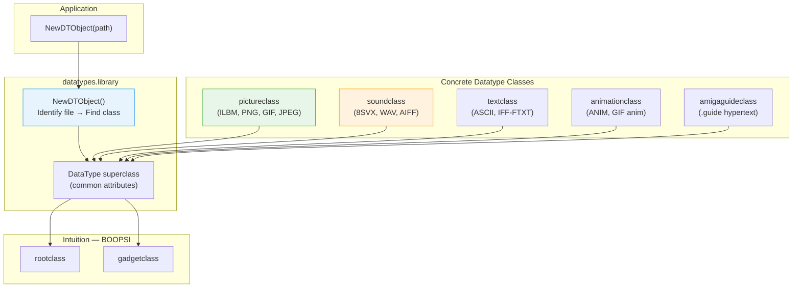
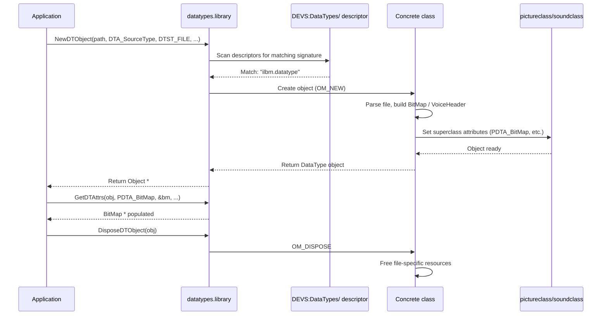
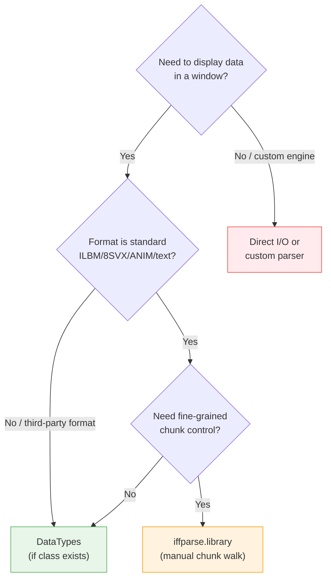

[← Home](../README.md) · [Libraries](README.md)

# Datatypes System — Object-Oriented File Loading for Images, Sound, Text, and Animation

## Overview

The DataTypes system is AmigaOS's extensible, object-oriented framework for loading, displaying, and manipulating structured data without hard-coding format-specific parsers. Built on Intuition's BOOPSI object model and introduced in OS 2.0, it allows a single API — `NewDTObject()` — to instantiate an object from an ILBM image, an 8SVX sample, an ASCII text file, or any third-party format installed on the system. The framework delegates parsing to loadable **datatype classes** (subclasses of pictureclass, soundclass, textclass, animationclass, or amigaguideclass) that live in `SYS:Classes/DataTypes/`. Each class registers itself via a descriptor in `DEVS:DataTypes/` so that `datatypes.library` can identify files by magic bytes or extension, route them to the correct parser, and present a uniform interface to the application. For the developer, this means no per-format loader code, no manual IFF chunk walking for basic tasks, and automatic clipboard integration. The trade-off is memory overhead (BOOPSI objects are larger than raw buffers) and reduced control over the parsing pipeline.

---

## Architecture

### The BOOPSI Class Hierarchy

The DataTypes framework is a layered extension of BOOPSI. Every datatype object is a BOOPSI object, and every datatype class is a BOOPSI `IClass` registered with Intuition.



### Data Flow: From File to Renderable Object



### Key Design Insight

The framework splits responsibility into three layers:

1. **datatypes.library** — file identification, class routing, common attribute management
2. **Superclass** (pictureclass, soundclass, etc.) — domain-specific rendering, clipboard serialization, standard data format
3. **Subclass** (ilbm.datatype, gif.datatype, etc.) — file parsing, conversion to superclass format

This means a picture subclass only needs to parse its format and fill a `BitMapHeader`, allocate a `BitMap`, and supply a `ColorMap`. The picture superclass handles everything else: rendering into a window, copy-to-clipboard, save-back-to-file, and color remapping.

---

## Data Structures

### DataType Header

```c
/* datatypes/datatypes.h — NDK 3.9 */
struct DataType {
    struct Node         dtn_Node;         /* ln_Name = human-readable name */
    struct DataType *   dtn_Next;         /* next in chain */
    struct DataType *   dtn_Previous;     /* previous in chain */
    ULONG               dtn_Flags;        /* DTF_* flags */
    ULONG               dtn_Labels;       /* label bitfield (for ASL requester) */
    UWORD               dtn_GroupID;      /* GID_* (picture, sound, text, etc.) */
    UWORD               dtn_ID;           /* class-specific ID */
    ULONG               dtn_CodePage;     /* text codepage, if applicable */
    STRPTR              dtn_TextAttr;     /* text attribute string */
    ULONG               dtn_Reserved[4];  /* must be zero */
};
```

### BitMapHeader (Picture Class)

```c
/* datatypes/pictureclass.h — NDK 3.9 */
struct BitMapHeader {
    UWORD bmh_Width;        /* image width in pixels */
    UWORD bmh_Height;       /* image height in pixels */
    WORD  bmh_Left;         /* x offset (usually 0) */
    WORD  bmh_Top;          /* y offset (usually 0) */
    UBYTE bmh_Depth;        /* number of bitplanes (1–8 typical) */
    UBYTE bmh_Masking;      /* 0=none, 1=has mask, 2=transparent color */
    UBYTE bmh_Compression;  /* 0=none, 1=ByteRun1 */
    UBYTE bmh_Pad;
    UWORD bmh_Transparent;  /* transparent color index */
    UBYTE bmh_XAspect;      /* pixel aspect ratio X */
    UBYTE bmh_YAspect;      /* pixel aspect ratio Y */
    WORD  bmh_PageWidth;    /* source page width */
    WORD  bmh_PageHeight;   /* source page height */
};
```

### VoiceHeader (Sound Class)

```c
/* datatypes/soundclass.h — NDK 3.9 */
struct VoiceHeader {
    ULONG vh_OneShotHiSamples;  /* one-shot part length */
    ULONG vh_RepeatHiSamples;   /* repeat part length */
    ULONG vh_SamplesPerHiCycle; /* samples per cycle */
    UWORD vh_SamplesPerSec;     /* sample rate (Hz) */
    UBYTE vh_Octaves;           /* number of octaves */
    UBYTE vh_Compression;       /* 0=none */
    ULONG vh_Volume;            /* 0–64 (or 0–65535 for 16-bit) */
};
```

### SourceType Constants

| Constant | Value | Meaning |
|---|---|---|
| `DTST_FILE` | 1 | Source is an AmigaDOS file path |
| `DTST_CLIPBOARD` | 2 | Source is the clipboard device |
| `DTST_RAM` | 3 | Source is a memory buffer |
| `DTST_HOTLINK` | 4 | Source is a hypertext link (AmigaGuide) |

---

## API Reference

### Object Lifecycle

```c
#include <datatypes/datatypes.h>
#include <proto/datatypes.h>

/* Create a DataType object from a source */
Object *NewDTObject(APTR name, ULONG tag1, ...);

/* Destroy a DataType object and all associated resources */
void DisposeDTObject(Object *o);
```

**Key tags for `NewDTObject()`:**

| Tag | Type | I/S/G | Description |
|---|---|---|---|
| `DTA_SourceType` | `ULONG` | I | `DTST_FILE`, `DTST_CLIPBOARD`, `DTST_RAM` |
| `DTA_Handle` | `BPTR` | I | File handle (if `DTST_FILE` and already open) |
| `DTA_DataType` | `struct DataType *` | G | Returns the matched DataType descriptor |
| `DTA_NominalHoriz` | `ULONG` | G | Native width in pixels (picture/animation) |
| `DTA_NominalVert` | `ULONG` | G | Native height in pixels |
| `DTA_ObjName` | `STRPTR` | G | Title/name metadata from file |
| `DTA_ObjAuthor` | `STRPTR` | G | Author metadata |
| `DTA_ObjAnnotation` | `STRPTR` | G | Annotation/comment metadata |
| `DTA_ObjCopyright` | `STRPTR` | G | Copyright string |
| `DTA_ObjVersion` | `STRPTR` | G | Version string |
| `DTA_Domain` | `STRPTR` | I | Request a specific datatype by name |
| `DTA_GroupID` | `ULONG` | I | Restrict to group (e.g., `GID_PICTURE`) |

### Attribute Access

```c
/* Get one or more attributes */
ULONG GetDTAttrs(Object *o, ULONG tag1, ...);

/* Set one or more attributes */
ULONG SetDTAttrs(Object *o, struct Window *win,
                 struct Requester *req, ULONG tag1, ...);
```

> **Note**: `SetDTAttrs()` requires a window pointer when the object is embedded in a gadget context — it triggers visual refresh through Intuition.

### Window Embedding

Because DataType objects are BOOPSI gadgets, they can be added directly to Intuition windows:

```c
/* Add a DataType object to a window as a gadget */
LONG AddDTObject(struct Window *win, struct Requester *req,
                 Object *o, LONG pos);

/* Remove from window */
void RemoveDTObject(struct Window *win, Object *o);

/* Trigger redraw (e.g., after SetDTAttrs changes visual state) */
void RefreshDTObjectA(Object *o, struct Window *win,
                      struct Requester *req, struct TagItem *attrs);
```

### Methods

```c
/* Perform a method on the object */
ULONG DoDTMethodA(Object *o, struct Window *win,
                  struct Requester *req, Msg msg);

/* Get supported method mask */
ULONG GetDTMethods(Object *obj);

/* Get supported trigger method mask */
ULONG GetDTTriggerMethods(Object *obj);
```

Common methods:

| Method | Description |
|---|---|
| `DTM_WRITE` | Save object back to file or clipboard |
| `DTM_COPY` | Copy to clipboard |
| `DTM_PRINT` | Print the object |
| `DTM_TRIGGER` | Execute a trigger (e.g., `STM_PLAY` for sound) |

### Trigger Methods

| Trigger | Description |
|---|---|
| `STM_PLAY` | Play sound / start animation |
| `STM_STOP` | Stop playback |
| `STM_PAUSE` | Pause playback |
| `STM_RESUME` | Resume playback |
| `STM_REWIND` | Rewind to start |
| `STM_FASTFORWARD` | Fast forward |

### Picture Class Attributes

| Tag | Type | Description |
|---|---|---|
| `PDTA_BitMapHeader` | `struct BitMapHeader **` | Pointer to header struct |
| `PDTA_BitMap` | `struct BitMap **` | The actual bitmap (Chip RAM!) |
| `PDTA_ColorRegisters` | `struct ColorRegister **` | Palette entries (RGB) |
| `PDTA_CRegs` | `LONG **` | Color registers for remapping |
| `PDTA_NumColors` | `ULONG` | Number of colors in palette |
| `PDTA_ModeID` | `ULONG` | Display ModeID for this image |

### Sound Class Attributes

| Tag | Type | Description |
|---|---|---|
| `SDTA_Sample` | `UBYTE **` | 8-bit sample data pointer |
| `SDTA_SampleLength` | `ULONG` | Length in bytes |
| `SDTA_Period` | `UWORD` | Paula period value |
| `SDTA_Volume` | `UWORD` | Volume 0–64 |
| `SDTA_Cycles` | `UWORD` | Loop count (0 = infinite) |
| `SDTA_VoiceHeader` | `struct VoiceHeader **` | Voice header struct |

---

## Decision Guide: DataTypes vs. Alternatives

| Criterion | DataTypes | iffparse.library | Direct File I/O |
|---|---|---|---|
| **When to use** | Quick loading of standard formats; GUI display; clipboard integration | Full control over IFF structure; need custom chunk handling | Non-standard formats; maximum performance; minimal memory |
| **Code size** | Small — one API for all formats | Medium — must handle chunks per format | Large — custom parser per format |
| **Format coverage** | Extensible via installed classes | IFF only (ILBM, 8SVX, ANIM, etc.) | Whatever you implement |
| **Memory overhead** | Higher (BOOPSI objects, BitMapHeader, ColorMap) | Low — you control allocations | Lowest — raw buffers |
| **Display integration** | Automatic — embed as gadget | Manual — parse then render yourself | Manual |
| **Save/write support** | Yes — `DTM_WRITE` delegates to class | Yes — manual chunk writing | Yes — custom writer |
| **OS version** | Requires OS 2.0+ (V37+) | Requires OS 1.3+ (iffparse) | Always works |



---

## Historical Context & Modern Analogies

### The Elegance of Zero-Recompile Extensibility

The DataTypes system embodies a design philosophy that remains radical even today: **applications should not know what file formats exist**. A developer writes a paint program that calls `NewDTObject()` on any file. Ten years later, a user installs a JPEG datatype class that did not exist when the paint program was written. The paint program — never recompiled, never patched, never reconfigured — can now load JPEG files as if the format had been built in from the start.

This is not plugin architecture in the limited sense of "my application loads plugins for itself." This is **system-wide late binding**: the OS itself brokers between applications and formats. Two files copied to disk constitute a complete installation:

1. `SYS:Classes/DataTypes/picture/jpeg.datatype` — the class binary
2. `DEVS:DataTypes/JPEG` — the descriptor (magic bytes, extension, precedence)

No registry editing. No config file parsing. No daemon restart. The next `NewDTObject()` call automatically discovers the new class through `datatypes.library`'s internal scan. Every DataTypes-aware application on the system gains the new capability simultaneously.

In 1990, this was unprecedented. Applications on every other platform carried format support inside their own binaries:

| Platform (1990) | Extensible? | Recompile Required? | Mechanism |
|---|---|---|---|
| **AmigaOS 2.0+** | **Yes** | **No** | System-wide BOOPSI classes with descriptors |
| **Atari ST / TT** | No | Yes | Each app bundles its own loaders |
| **Mac OS (System 7)** | Partial | Yes | Apps link against specific graphics libraries |
| **Windows 3.0** | No | Yes | OLE 1.0 is COM-based and app-specific, not file-centric |
| **UNIX (X11)** | No | Yes | Statically linked image libraries per application |
| **NeXTSTEP** | Partial | Partial | NXImage uses typed streams but apps must bundle readers |

The "no recompile" property is the critical differentiator. NeXTSTEP had typed streams, but an application shipped with the readers it knew about. Windows would not get system-wide file-type extensibility until the Windows 95 shell and COM IDataObject (1995). macOS would not get equivalent functionality until QuickTime importer components (1991) and later UTType (2007). Linux distributions would not standardize on MIME-type associations with shared handler plugins until the mid-2000s.

### How It Worked in Practice

The release cycle of PNG in the mid-1990s illustrates the benefit perfectly:

| Step | Traditional Platform | AmigaOS with DataTypes |
|---|---|---|
| New format emerges (PNG) | User must wait for every app vendor to add support | User waits for one developer to write a PNG datatype |
| Support arrives | Download new versions of paint program, image viewer, thumbnailer | Copy `png.datatype` and `DEVS:DataTypes/PNG` to disk |
| Integration | Each app has its own PNG decoder, color management, metadata handling | All apps share one canonical PNG decoder |
| Consistency | Colors render differently in each app | One color remap through pictureclass |
| Clipboard | Apps must add PNG import/export to their private clipboard logic | `DTST_CLIPBOARD` works automatically via the superclass |

### Modern Analogies

The closest modern equivalents to DataTypes' system-wide, zero-recompile extensibility are **media framework plugin systems** and **OS-level content-type registries**:

| DataTypes Concept | Modern Equivalent | Why It Maps |
|---|---|---|
| `NewDTObject()` → auto-routed to class | **GStreamer pipeline auto-plug** | Install an AV1 decoder plugin; ALL GStreamer applications (Totem, Cheese, Rhythmbox) can play AV1 without recompilation. They do not know AV1 exists — they ask GStreamer to "play this" and the framework negotiates the correct element. |
| Descriptor in `DEVS:DataTypes/` | **Linux MIME `.desktop` associations + shared-mime-info** | Install one MIME type definition and one application handler; all file managers, web browsers, and email clients can open that format. But: apps must still understand the data, unlike DataTypes where the OS returns a usable object. |
| pictureclass / soundclass | **ImageMagick codec delegates / GEGL operations** | Add a HEIC delegate to ImageMagick; all ImageMagick-based tools (and GIMP via plugin) gain HEIC support. The superclass (`Image` / `GeglBuffer`) abstracts format specifics. |
| `DTA_SourceType` + auto-detection | **macOS `UTType` + `QLPreviewController`** | The system identifies a file by its content (not just extension) and routes to the correct preview provider. QuickLook plugins work system-wide without host application recompilation. |
| `DTM_WRITE` serialization | **Microsoft COM `IPersistFile`** | The OS asks the format handler to serialize itself; the host application delegates save logic. But COM requires explicit interface negotiation; DataTypes uses attribute tags. |
| `DTST_CLIPBOARD` uniform transfer | **HTML5 Clipboard API `ClipboardItem`** | Applications paste "an image" without caring whether it arrived as PNG, JPEG, or BMP. The platform handles format conversion. |
| BOOPSI gadget embedding | **WPF `Image` / Qt `QLabel` with `QPixmap`** | The view widget renders from an abstract source. But modern widgets are framework-specific; a DataTypes object is an Intuition-native BOOPSI gadget addable to any window. |

### Where the Analogies Break Down

Despite the parallels, no modern system fully replicates DataTypes' combination of properties:

1. **True OS-native object model**: DataTypes objects are BOOPSI objects — they can be added directly to Intuition windows, receive input events, and participate in the layout system. Modern equivalents require wrapper widgets (Qt `QImageReader` → `QLabel`), adapter layers (GStreamer → GTK video sink), or explicit host application support (QuickLook plugins need a host that calls the API).

2. **Single-file install, no registration step**: GStreamer plugins need `gst-plugin-scanner` cache updates; ImageMagick delegates need `policy.xml` edits; macOS UTTypes need `Info.plist` declarations and app bundle restarts. Amiga DataTypes required only a file copy — `datatypes.library` rescans on demand.

3. **Write-time ignorance**: A developer in 1992 could write `NewDTObject(path, DTA_GroupID, GID_PICTURE, TAG_DONE)` and be guaranteed that every image format invented through 2026 would work, provided a datatype class existed. Modern frameworks generally require the application to at least specify a MIME type or content category.

4. **No async loading**: `NewDTObject()` is synchronous and blocking. Modern frameworks (GStreamer's async state changes, Android's `ContentResolver` async queries, web `createImageBitmap()`) use callbacks, promises, or coroutines to avoid blocking the UI thread.

5. **No streaming or progressive decode**: The entire file is parsed into a complete BOOPSI object before control returns. There is no equivalent to modern progressive JPEG decode, video frame streaming, or memory-mapped access.

6. **Planar graphics assumptions**: Color remapping, BitMap allocation, and palette management are designed for Amiga's planar display system. A modern RGBA framebuffer datatype would need a fundamentally different `pictureclass` implementation.

---

## Practical Examples

### Example 1: Load and Display an Image

```c
#include <exec/types.h>
#include <intuition/intuition.h>
#include <datatypes/datatypes.h>
#include <datatypes/pictureclass.h>
#include <proto/datatypes.h>
#include <proto/exec.h>
#include <proto/intuition.h>
#include <proto/graphics.h>

/* Load an image file and extract its BitMap */
struct BitMap *LoadPicture(CONST_STRPTR path, struct ColorMap **cmOut)
{
    struct BitMap *bm = NULL;
    struct ColorMap *cm = NULL;

    Object *dto = NewDTObject((APTR)path,
        DTA_SourceType,  DTST_FILE,
        DTA_GroupID,     GID_PICTURE,
        PDTA_Remap,      FALSE,      /* keep original colors */
        TAG_DONE);

    if (!dto)
    {
        /* File not found, or no matching picture class installed */
        return NULL;
    }

    /* Retrieve the BitMap and ColorMap from the picture superclass */
    GetDTAttrs(dto,
        PDTA_BitMap,     (ULONG)&bm,
        PDTA_ColorMap,   (ULONG)&cm,
        TAG_DONE);

    /* Note: the BitMap belongs to the object; if you need it after
       DisposeDTObject(), you must copy or detach it. */

    if (cmOut) *cmOut = cm;

    /* DisposeDTObject() will free bm and cm unless you detached them.
       For a quick blit-and-forget, keep the object alive until done. */
    return bm;   /* still valid while dto lives */
}
```

### Example 2: Play a Sound Sample

```c
#include <datatypes/datatypes.h>
#include <datatypes/soundclass.h>
#include <proto/datatypes.h>

BOOL PlaySoundFile(CONST_STRPTR path)
{
    Object *dto = NewDTObject((APTR)path,
        DTA_SourceType, DTST_FILE,
        DTA_GroupID,    GID_SOUND,
        TAG_DONE);

    if (!dto) return FALSE;

    /* Trigger playback */
    struct dtTrigger dtt;
    dtt.dtt_Method   = DTM_TRIGGER;
    dtt.dtt_GInfo    = NULL;
    dtt.dtt_Function = STM_PLAY;
    dtt.dtt_Data     = NULL;

    DoDTMethodA(dto, NULL, NULL, (Msg)&dtt);

    /* In a real app, wait for completion or provide UI to stop */
    /* For now, just let it play and clean up after a delay */
    Delay(300);   /* ~6 seconds at 50 Hz */

    DisposeDTObject(dto);
    return TRUE;
}
```

### Example 3: Embed a DataType Object in a Window

```c
#include <intuition/intuition.h>
#include <datatypes/datatypes.h>
#include <proto/datatypes.h>
#include <proto/intuition.h>

struct Window *win;
Object *dtObj;

BOOL OpenImageWindow(CONST_STRPTR path)
{
    win = OpenWindowTags(NULL,
        WA_Title,     "DataTypes Viewer",
        WA_Width,     640,
        WA_Height,    480,
        WA_Flags,     WFLG_CLOSEGADGET | WFLG_DRAGBAR |
                      WFLG_DEPTHGADGET | WFLG_ACTIVATE,
        TAG_DONE);

    if (!win) return FALSE;

    /* Create the DataType object; it acts as a BOOPSI gadget */
    dtObj = NewDTObject((APTR)path,
        DTA_SourceType, DTST_FILE,
        GA_Left,        0,
        GA_Top,         0,
        GA_RelWidth,    TRUE,
        GA_RelHeight,   TRUE,
        TAG_DONE);

    if (!dtObj)
    {
        CloseWindow(win);
        return FALSE;
    }

    /* Add to window — the object renders itself */
    AddDTObject(win, NULL, dtObj, -1);
    RefreshDTObjectA(dtObj, win, NULL, NULL);

    return TRUE;
}

void CloseImageWindow(void)
{
    if (dtObj)
    {
        RemoveDTObject(win, dtObj);
        DisposeDTObject(dtObj);
        dtObj = NULL;
    }
    if (win)
    {
        CloseWindow(win);
        win = NULL;
    }
}
```

### Example 4: Load from Clipboard

```c
#include <datatypes/datatypes.h>
#include <proto/datatypes.h>

Object *LoadFromClipboard(void)
{
    Object *dto = NewDTObject(NULL,
        DTA_SourceType, DTST_CLIPBOARD,
        DTA_GroupID,    GID_PICTURE,   /* or GID_TEXT, GID_SOUND */
        TAG_DONE);

    /* The library reads the clipboard unit 0 and identifies the
       format automatically via the descriptor signatures. */

    return dto;
}
```

---

## When to Use / When NOT to Use

### When to Use DataTypes

| Scenario | Why DataTypes Excels |
|---|---|
| **System-friendly applications** | Cooperative with Intuition; objects are valid BOOPSI gadgets |
| **Multi-format viewers** | One codebase handles ILBM, PNG, GIF, JPEG, etc. automatically |
| **Clipboard integration** | `DTST_CLIPBOARD` gives uniform read/write for free |
| **Rapid prototyping** | `NewDTObject()` + `AddDTObject()` displays an image in ~10 lines |
| **Workbench tools** | Metadata tags (`DTA_ObjName`, `DTA_ObjAuthor`) expose file info |
| **Save/export support** | `DTM_WRITE` delegates to the class; no custom serializer needed |

### When NOT to Use DataTypes

| Scenario | Problem | Better Alternative |
|---|---|---|
| **Game engine texture loading** | BOOPSI overhead, planar bitmap conversion, no async | Direct `AllocBitMap()` + custom loader; use [iffparse.library](iffparse.md) for IFF |
| **Real-time audio streaming** | Entire sample loaded synchronously; no streaming API | Direct `audio.device` with double-buffered [IORequest](../06_exec_os/io_requests.md) |
| **Memory-constrained tools** | Object overhead + full bitmap + colormap can be large | iffparse.library with on-demand decode |
| **Custom or proprietary formats** | No class exists; writing a class is more work than a parser | Direct file I/O or custom parser |
| **Batch conversion pipelines** | `NewDTObject()` → `DTM_WRITE` is convenient but slower than dedicated tools | Command-line tools (ImageMagick port, etc.) |
| **Need pixel-level access during decode** | Framework abstracts away the parsing pipeline | iffparse.library or direct loader |

### Applicability Ranges

- **Image sizes up to ~1 MB** (Chip RAM permitting): DataTypes handles comfortably
- **Audio samples > 500 KB**: Consider direct audio.device I/O to avoid duplication
- **Animation**: Use DataTypes for short clips; long sequences need custom frame management
- **Object counts**: Embedding >20 DataType gadgets in one window stresses Intuition's gadget list

---

## Best Practices & Antipatterns

### Best Practices

1. **Always check `NewDTObject()` return value** — a missing class or corrupted file returns `NULL`
2. **Set `DTA_GroupID` when the type is known** — reduces descriptor scan time and prevents misidentification
3. **Use `PDTA_Remap, FALSE` for off-screen processing** — avoids unnecessary color remapping
4. **Keep the object alive while using its BitMap/Sample** — disposing frees the underlying buffers
5. **Call `RefreshDTObjectA()` after `SetDTAttrs()` on an embedded object** — Intuition does not auto-redraw
6. **Use `RemoveDTObject()` before `DisposeDTObject()`** on window-embedded objects — prevents dangling gadget pointers
7. **Query `GetDTMethods()` before calling `DTM_WRITE`** — not all subclasses implement save
8. **Free the file handle yourself if you passed `DTA_Handle`** — the library does not close it
9. **Call `SetIoErr()` before returning `NULL` from a custom class** — proper DOS error propagation
10. **Test with `DTA_Domain` to force a specific class** — useful for debugging format detection

### Antipatterns

#### 1. The Orphaned BitMap

```c
/* ANTIPATTERN — extracting pointer then disposing the owner */
struct BitMap *bm;
GetDTAttrs(dto, PDTA_BitMap, (ULONG)&bm, TAG_DONE);
DisposeDTObject(dto);
/* bm is now a dangling pointer — the BitMap was freed */
BltBitMap(bm, ...);  /* CRASH */

/* CORRECT — either keep dto alive, or copy the BitMap */
struct BitMap *myCopy = AllocBitMap(width, height, depth,
                                    BMF_CLEAR, screen->RastPort.BitMap);
BltBitMap(bm, 0, 0, myCopy, 0, 0, width, height, 0xC0, 0x01, NULL);
DisposeDTObject(dto);
/* myCopy is now safe to use independently */
```

#### 2. The Naked Dispose

```c
/* ANTIPATTERN — disposing while still attached to window */
DisposeDTObject(dtObj);   /* Gadget list still references this object */
CloseWindow(win);          /* Intuition walks gadget list → CRASH */

/* CORRECT — remove first, then dispose */
RemoveDTObject(win, dtObj);
DisposeDTObject(dtObj);
CloseWindow(win);
```

#### 3. The Silent Failure

```c
/* ANTIPATTERN — no error checking, no diagnostics */
Object *dto = NewDTObject((APTR)path, TAG_DONE);
AddDTObject(win, NULL, dto, -1);  /* dto could be NULL */

/* CORRECT — check and report */
Object *dto = NewDTObject((APTR)path,
    DTA_SourceType, DTST_FILE,
    TAG_DONE);
if (!dto)
{
    LONG err = IoErr();
    Printf("Failed to load '%s': %ld\n", path, err);
    return FALSE;
}
```

#### 4. The Assuming Saver

```c
/* ANTIPATTERN — calling DTM_WRITE on a read-only subclass */
struct dtWrite dtw;
dtw.dtw_Method  = DTM_WRITE;
dtw.dtw_GInfo   = NULL;
dtw.dtw_FileHandle = fh;
dtw.dtw_Mode    = DTWM_RAW;
DoDTMethodA(dto, NULL, NULL, (Msg)&dtw);  /* May fail silently */

/* CORRECT — check capabilities first */
if (GetDTMethods(dto) & (1L << DTM_WRITE))
{
    /* Safe to attempt write */
}
```

---

## Pitfalls & Common Mistakes

### 1. BitMap in Chip RAM for AGA/Display

```c
/* PITFALL — assuming BitMap is displayable on custom screens */
struct BitMap *bm;
GetDTAttrs(dto, PDTA_BitMap, (ULONG)&bm, TAG_DONE);

/* On systems without graphics card, BitMap MUST be in Chip RAM
   for blitter or display DMA. DataTypes usually allocates correctly,
   but if you replace the BitMap, verify: */
if (TypeOfMem(bm) & MEMF_CHIP)
{
    /* Safe for display DMA */
}
```

> [!WARNING]
> **Requires Chip RAM**: The `PDTA_BitMap` returned by pictureclass must reside in Chip RAM if you intend to use it with the Blitter or display it via custom chip DMA. Fast RAM bitmaps are fine for CPU-only processing but will crash if passed to `BltBitMap()` or attached to a `ViewPort` on OCS/ECS/AGA.

### 2. ColorMap Lifecycle

```c
/* PITFALL — ColorMap freed with object, but ViewPort still references it */
struct ColorMap *cm;
GetDTAttrs(dto, PDTA_ColorMap, (ULONG)&cm, TAG_DONE);
viewport->ColorMap = cm;   /* ViewPort now references object's memory */
DisposeDTObject(dto);      /* cm is freed — ViewPort now has dangling pointer */

/* CORRECT — copy the ColorMap if the ViewPort outlives the object */
struct ColorMap *cmCopy = CopyColorMap(cm);
viewport->ColorMap = cmCopy;
DisposeDTObject(dto);
/* Free cmCopy later when ViewPort is torn down */
```

### 3. Forgetting to Refresh After Resize

```c
/* PITFALL — changing size attributes without refresh */
SetDTAttrs(dtObj, win, NULL,
    DTA_NominalHoriz, 320,
    DTA_NominalVert,  200,
    TAG_DONE);
/* Window still shows old size; visual garbage ensues */

/* CORRECT — trigger redraw */
SetDTAttrs(dtObj, win, NULL,
    DTA_NominalHoriz, 320,
    DTA_NominalVert,  200,
    TAG_DONE);
RefreshDTObjectA(dtObj, win, NULL, NULL);
```

### 4. Mixing DataTypes with Custom Blitter Code

```c
/* PITFALL — DataTypes BitMap may not match your RastPort's format */
struct BitMap *bm;
GetDTAttrs(dto, PDTA_BitMap, (ULONG)&bm, TAG_DONE);

/* If your RastPort is 3-plane and the image is 5-plane (HAM),
   direct BltBitMap() produces garbage. Always check depth: */
struct BitMapHeader *bmh;
GetDTAttrs(dto, PDTA_BitMapHeader, (ULONG)&bmh, TAG_DONE);
if (bmh && bmh->bmh_Depth <= myRastPort->BitMap->Depth)
{
    BltBitMap(bm, ...);  /* Safe */
}
```

### 5. Assuming DTA_Handle Ownership

```c
/* PITFALL — library closes handle if it opened it, but not if you passed it */
BPTR fh = Open(path, MODE_OLDFILE);
Object *dto = NewDTObject(NULL,
    DTA_SourceType, DTST_FILE,
    DTA_Handle,     fh,
    TAG_DONE);
DisposeDTObject(dto);
/* fh may or may not still be valid — behavior is inconsistent
   across subclasses. Always open/close yourself. */

/* CORRECT — let DataTypes open the file, or manage the handle yourself */
Object *dto = NewDTObject((APTR)path,
    DTA_SourceType, DTST_FILE,
    TAG_DONE);
DisposeDTObject(dto);
/* File was opened and closed by the framework */
```

---

## Use Cases

### Real-World Software That Relied on DataTypes

| Software | How It Used DataTypes |
|---|---|
| **MultiView** (OS 3.1+) | The canonical DataTypes viewer — opens any file DataTypes can identify; essentially a thin wrapper around `NewDTObject()` + `AddDTObject()` |
| **Directory Opus** | File viewer pane uses DataTypes for image/sound preview |
| **Personal Paint** | Uses pictureclass for import of non-native formats (GIF, JPEG via third-party classes) |
| **AmigaGuide** | The hypertext system is implemented as a DataType class; `amigaguideclass` renders pages and handles links |
| **Web browsers (AWeb, IBrowse)** | Image decoding delegated to DataTypes; new image formats installable without browser updates |
| **Audio players** | `STM_PLAY` trigger used for preview in file managers |

### Integration Patterns

**Pattern A: Thumbnail Generator**
```
For each file in directory:
    dto = NewDTObject(path, DTA_GroupID, GID_PICTURE)
    if dto:
        GetDTAttrs(dto, PDTA_BitMap, &bm, ...)
        ScaleBitMap(bm, thumbSize)   /* custom downscale */
        DisposeDTObject(dto)
```

**Pattern B: Format Validator**
```
dto = NewDTObject(path, TAG_DONE)
if dto:
    GetDTAttrs(dto, DTA_DataType, &dtn, ...)
    printf("Type: %s  Group: %s\n", dtn->dtn_Node.ln_Name, groupName[dtn->dtn_GroupID])
    DisposeDTObject(dto)
else:
    printf("Unknown or corrupted file\n")
```

**Pattern C: Clipboard Image Paste**
```
dto = NewDTObject(NULL, DTA_SourceType, DTST_CLIPBOARD, DTA_GroupID, GID_PICTURE)
if dto:
    AddDTObject(win, NULL, dto, -1)
    RefreshDTObjectA(dto, win, NULL, NULL)
```

---

## FAQ

**Q: Can I write my own DataType class?**
> Yes. You create a BOOPSI subclass of the appropriate superclass (e.g., pictureclass), implement `OM_NEW` to parse your format and fill the superclass structures, and install a descriptor in `DEVS:DataTypes/`. The OS will automatically route matching files to your class.

**Q: Why does `NewDTObject()` return NULL for a valid JPEG?**
> Either `jpeg.datatype` is not installed, or the file's magic bytes do not match the descriptor's signature. Verify the class exists in `SYS:Classes/DataTypes/` and its descriptor is in `DEVS:DataTypes/`. Also check `IoErr()` immediately after failure.

**Q: How do I know which methods an object supports?**
> Call `GetDTMethods(obj)` — it returns a bitmask of supported methods. Similarly, `GetDTTriggerMethods(obj)` returns supported triggers like `STM_PLAY`.

**Q: Is DataTypes available on OS 1.3?**
> No. DataTypes requires OS 2.0 (V37) or later, as it depends on BOOPSI (introduced in 2.0). On 1.3, use iffparse.library or direct file I/O.

**Q: Can I use DataTypes without opening an Intuition window?**
> Yes. `NewDTObject()` with `DTST_FILE` creates an off-screen object. Use `GetDTAttrs()` to extract `PDTA_BitMap` or `SDTA_Sample` and process the data directly. You only need a window if you call `AddDTObject()`.

**Q: Why is my embedded DataType object not redrawn after `SetDTAttrs()`?**
> `SetDTAttrs()` updates internal state but does not send a gadget refresh message. You must explicitly call `RefreshDTObjectA()` or use `SetGadgetAttrs()` if the object is in a window context.

**Q: Do DataType objects work with MUI?**
> Indirectly. MUI provides the `Boopsi` class to embed native BOOPSI gadgets. Create the DataType object, then embed it via `MUIA_Boopsi_Gadget` or `MUIA_Boopsi_Object` in a `BoopsiObject`.

## References

- NDK 3.9: `datatypes/datatypes.h`, `datatypes/datatypesclass.h`, `datatypes/pictureclass.h`, `datatypes/soundclass.h`, `datatypes/textclass.h`, `datatypes/animationclass.h`
- ADCD 2.1: `datatypes.library` autodocs (`datatypes.doc`, `picture_dtc.doc`, `sound_dtc.doc`)
- *Amiga ROM Kernel Reference Manual: Libraries* — Chapter 23: DataTypes
- See also: [iffparse.md](iffparse.md) — Low-level IFF parsing when DataTypes abstraction is insufficient
- See also: [boopsi.md](../09_intuition/boopsi.md) — BOOPSI object system foundation
- See also: [bitmap.md](../08_graphics/bitmap.md) — Planar BitMap structure and Chip RAM requirements
- See also: [memory_management.md](../06_exec_os/memory_management.md) — `AllocMem()` flags and Chip vs Fast RAM
