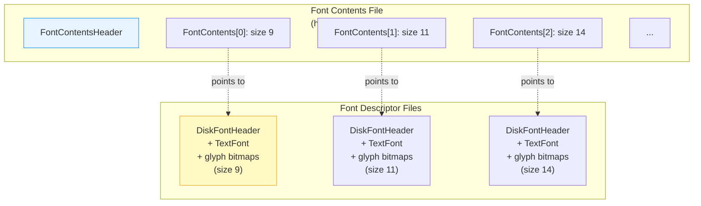
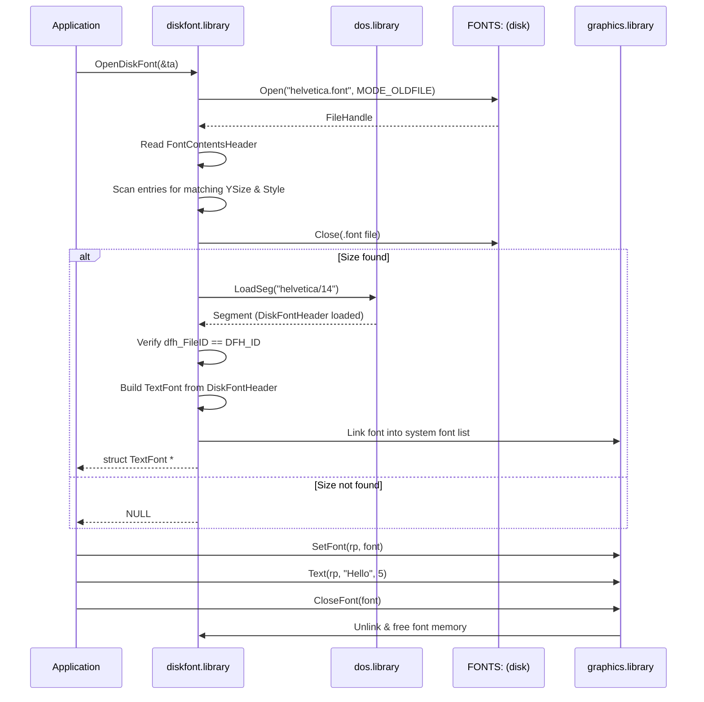
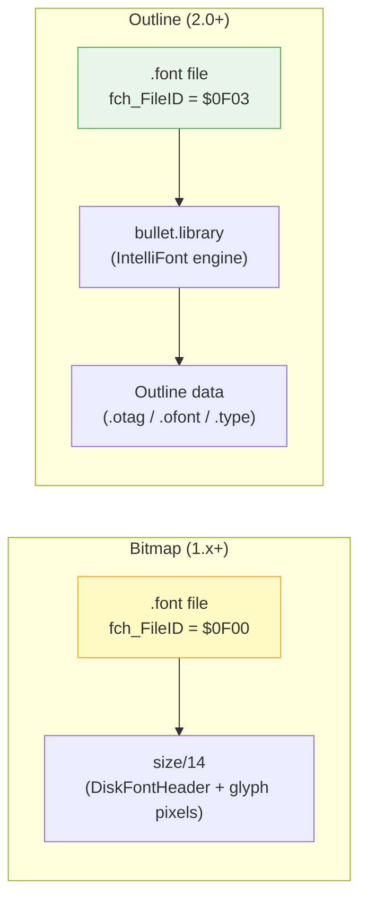
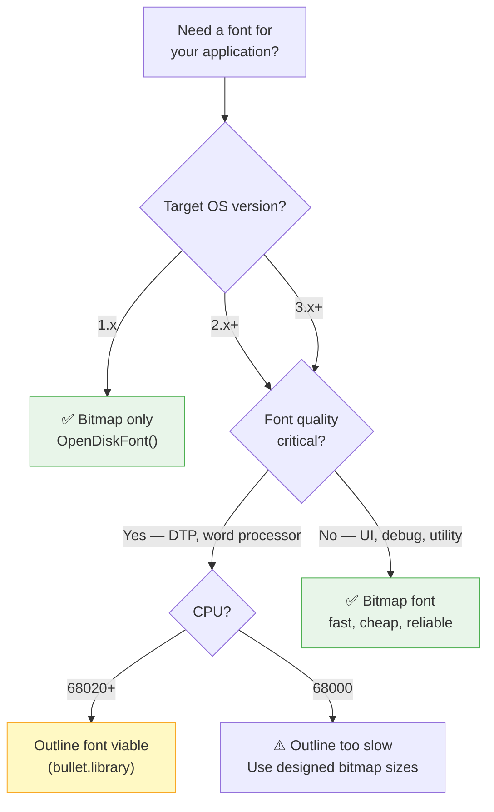

[← Home](../README.md) · [Libraries](README.md)

# diskfont.library — Amiga Bitmap Fonts: Concept, File Format, and Disk Loading

## Overview

**`diskfont.library`** loads bitmap fonts from disk into the Amiga graphics system. Unlike modern TrueType/OpenType fonts that store mathematical curve descriptions, Amiga fonts are **bitmap fonts** — each glyph is a hand-drawn grid of pixels at a fixed size. A 14-pixel "Helvetica" and a 24-pixel "Helvetica" are entirely separate files, each hand-designed (or auto-scaled) for that specific pixel height.

This was the dominant font technology of the late 1980s and early 1990s. Before CPUs were fast enough to rasterize Bézier curves on the fly, storing pre-rendered pixel data was the only practical option. The Amiga's bitmap font system was sophisticated for its era — proportional spacing, kerning, algorithmic bold/italic/underline, and color fonts (OS 3.0+) — but it was fundamentally pixel-bound.

Two fonts are built into every Amiga ROM: **topaz 8** and **topaz 9**. Every other font — helvetica, times, courier, garnet, sapphire, and any third-party font — lives on disk under the `FONTS:` assign and must be loaded via `diskfont.library`.

> [!NOTE]
> This article focuses on the **disk side** — font file formats, directory structure, loading pipeline, and the conceptual model. For the in-memory `TextFont` structure, rendering with `Text()`/`SetFont()`, and algorithmic styles, see [text_fonts.md](../08_graphics/text_fonts.md).

---

## The Bitmap Font Concept — Why Pixels Instead of Curves

### How Bitmap Fonts Work

A bitmap font stores each character as a flat pixel grid. The letter "A" at 14 pixels tall might be a 9×14 pixel array:

```
.........
..#####..
.##...##.
.##...##.
.#######.
.##...##.
.##...##.
.........
```

Every glyph at every size is pre-drawn. The OS simply copies the glyph's pixel strip to the screen — no math, no rasterization, no hinting engine. This is why Amiga text rendering is so fast: it's just `Blitter` and `BlitMaskBitMapRastPort` operations under the hood.

### Comparison with Modern TrueType / OpenType

| Aspect | Amiga Bitmap Fonts | TrueType / OpenType |
|---|---|---|
| **Storage** | Pixel grid per glyph per size | Mathematical curves (Bézier splines) |
| **Scaling** | Each size is a separate file; scaling creates distortion | Arbitrary size rendered from same outlines |
| **File size** | Small per size, but multiplies by size count | One file covers all sizes |
| **Quality at scale** | Perfect at designed size; jagged/blurry when scaled | Smooth at any size (with hinting) |
| **Rendering cost** | Near-zero — just copy pixels | Requires curve rasterization + hinting |
| **Rotation** | Impossible (pixel grid is axis-aligned) | Built-in (curves are coordinate-independent) |
| **Memory** | Full glyph bitmap in Chip RAM during use | Glyph cache; outlines are small |
| **Typographic features** | Basic: kerning, proportional spacing | Rich: ligatures, alternates, feature tables |

### Why the Amiga Used Bitmap Fonts

1. **CPU limitations**: A 7 MHz 68000 cannot rasterize TrueType curves at interactive speeds. Even on 1990s PCs, TrueType rasterization was a noticeable cost. The Amiga solved this by pre-rendering everything.
2. **Memory constraints**: A 14-pixel bitmap font for ASCII 32–127 fits in roughly 2–4 KB. Loading and blitting pixels uses zero CPU beyond the initial `LoadSeg()`.
3. **Hardware acceleration**: The Blitter can copy glyph pixels directly to the screen's planar bitmap. This hardware-accelerated text path depends on glyphs already being in planar pixel format.
4. **Era conventions**: In 1985, bitmap fonts were the industry standard. Apple's Macintosh (1984) used bitmap "suitcase" fonts. Windows 3.1 (1992) defaulted to bitmap system fonts. TrueType didn't become universal until the mid-1990s.

---

## Font File Format — The Complete On-Disk Structure

### The Two-File Architecture

Every Amiga bitmap font consists of two kinds of files:

```
FONTS:
├── helvetica.font              ← Font Contents File (descriptor)
└── helvetica/                  ← Font Data Directory
    ├── 9                       ← Font Descriptor File (size 9)
    ├── 11                      ← Font Descriptor File (size 11)
    ├── 14                      ← Font Descriptor File (size 14)
    ├── 19                      ← Font Descriptor File (size 19)
    └── 24                      ← Font Descriptor File (size 24)
```



### 1. The Font Contents File (`.font`)

This is the **index file** — it lists every available size for a given typeface. Its C structure:

```c
/* libraries/diskfont.h — NDK39 */
#define MAXFONTPATH 256

struct FontContentsHeader {
    UWORD   fch_FileID;        /* $0F00 = FCH_ID, $0F02 = TFCH_ID, $0F03 = scalable */
    UWORD   fch_NumEntries;    /* number of FontContents entries following */
    struct FontContents fch_FC[];  /* variable-length array */
};

struct FontContents {
    char    fc_FileName[MAXFONTPATH];  /* path to size directory, e.g. "helvetica/14" */
    UWORD   fc_YSize;                  /* pixel height */
    UBYTE   fc_Style;                  /* FSF_BOLD, FSF_ITALIC, etc. */
    UBYTE   fc_Flags;                  /* FPF_ROMFONT, FPF_DISKFONT, etc. */
};
```

#### File ID Values

| ID | Name | Meaning |
|---|---|---|
| `$0F00` | `FCH_ID` | Standard bitmap font (uses `FontContents` entries) |
| `$0F02` | `TFCH_ID` | Tagged bitmap font (uses `TFontContents` — supports `TA_DeviceDPI` tags) |
| `$0F03` | — | Scalable outline font (Compugraphic / IntelliFont, not bitmap) |

#### File on Disk (Binary Layout)

```
Offset  Size  Field
──────  ────  ──────────────────────────────
$00     2     fch_FileID ($0F00 for bitmap)
$02     2     fch_NumEntries (e.g. 5 sizes)
$04     260   FontContents[0]
$108    260   FontContents[1]
$20C    260   FontContents[2]
...     ...   (NumEntries × 260 bytes each)
```

Each `FontContents` entry is exactly `MAXFONTPATH + 4` = 260 bytes, regardless of actual string length. The `fc_FileName` field is null-padded.

#### Per-Entry Flags

| Flag | Bit | Meaning |
|---|---|---|
| `FPF_ROMFONT` | 0 | Font is built into ROM (topaz only) |
| `FPF_DISKFONT` | 1 | Font is loaded from disk |
| `FPF_REVPATH` | 2 | Designed for right-to-left text |
| `FPF_TALLDOT` | 3 | Designed for Hires (640-pixel) screen |
| `FPF_WIDEDOT` | 4 | Designed for Lores Interlaced screen |
| `FPF_PROPORTIONAL` | 5 | Character widths are not constant |
| `FPF_DESIGNED` | 6 | Hand-designed at this size (not scaled) |
| `FPF_REMOVED` | 7 | Font has been removed from system list |

### 2. The Font Descriptor File (numeric filename, e.g. `14`)

Each numeric file in the font directory is a **loadable DOS hunk** — it's literally wrapped as a `HUNK_CODE` so `LoadSeg()` can load it. The first two longwords contain a `MOVEQ #0,D0 : RTS` instruction pair to safely exit if the file is accidentally executed.

```c
/* libraries/diskfont.h — NDK39 */
#define MAXFONTNAME 32

struct DiskFontHeader {
    /* The 8 bytes BEFORE this struct (not part of it!) are: */
    /*   ULONG dfh_NextSegment;     // BPTR — filled by LoadSeg */
    /*   ULONG dfh_ReturnCode;      // MOVEQ #0,D0 : RTS       */

    struct Node     dfh_DF;         /* Exec Node — links loaded fonts together */
    UWORD           dfh_FileID;     /* DFH_ID ($0F80) */
    UWORD           dfh_Revision;   /* font revision number */
    LONG            dfh_Segment;    /* segment address after LoadSeg */
    char            dfh_Name[MAXFONTNAME];  /* font name, e.g. "helvetica" */
    struct TextFont dfh_TF;         /* The actual TextFont structure */
    /* Immediately after dfh_TF: glyph bitmap data, char location tables */
};
```

The `dfh_TF` is the same `struct TextFont` described in [text_fonts.md](../08_graphics/text_fonts.md). After it in memory come:

| Field | Description |
|---|---|
| `tf_CharData` | Bitmap strip containing all glyphs (one row per scanline, `tf_Modulo` bytes wide) |
| `tf_CharLoc` | Per-character location table: 2 WORDs per glyph (bit offset, width in pixels) |
| `tf_CharSpace` | Proportional spacing: 1 WORD per glyph (advance width) |
| `tf_CharKern` | Kerning table: 1 WORD per glyph (extra space after this character) |

---

## The Font Loading Pipeline



### Font Request Matching

When `OpenDiskFont()` receives a `struct TextAttr`, the library searches the `.font` file's entries:

1. **Exact YSize match**: If the requested size exists as a `fc_YSize`, that entry is selected.
2. **No match**: Returns `NULL`. Unlike modern font systems, the Amiga does **not** automatically scale to the nearest size.
3. **Style matching**: If the requested style (`FSF_BOLD`, `FSF_ITALIC`) doesn't exist at that size, `graphics.library` can algorithmically generate it (`SetSoftStyle`).
4. **Scaled fonts (`AFF_SCALED`)**: OS 2.0+ can auto-generate intermediate sizes by scaling the nearest designed size. These appear in `AvailFonts()` with the `AFF_SCALED` flag. Quality is significantly worse than hand-designed sizes.

---

## How Software Uses Different Fonts

### The Standard Pattern

```c
struct Library *DiskfontBase = OpenLibrary("diskfont.library", 0L);

/* 1. Request a specific disk font: */
struct TextAttr ta = {"helvetica.font", 14, 0, 0};
struct TextFont *font = OpenDiskFont(&ta);

if (font)
{
    /* 2. Assign it to the RastPort: */
    SetFont(rp, font);

    /* 3. Position cursor at baseline: */
    Move(rp, 10, 20 + font->tf_Baseline);

    /* 4. Render text: */
    Text(rp, "Disk-loaded font", 16);

    /* 5. Measure text for alignment: */
    UWORD w = TextLength(rp, "Centered", 8);
    Move(rp, (screenWidth - w) / 2, 50 + font->tf_Baseline);
    Text(rp, "Centered", 8);

    /* 6. Release when done: */
    CloseFont(font);
}

CloseLibrary(DiskfontBase);
```

### ROM Font vs Disk Font — When to Use Each

| Scenario | Use | Why |
|---|---|---|
| System UI, debug output, quick text | `OpenFont("topaz.font")` — ROM font | Always available, zero disk access, zero load time |
| Application body text, custom UI | `OpenDiskFont("helvetica.font")` — disk font | Professional appearance; user expects non-topaz fonts |
| Word processor, DTP, final output | `OpenDiskFont()` with `FPF_DESIGNED` | Hand-tuned glyphs look best; avoid scaled variants |
| Memory-critical (games, demos) | `OpenFont("topaz.font")` or embed custom font | Disk fonts consume Chip RAM for glyph data |
| Font enumeration / chooser | `AvailFonts()` + iterate | Build a font picker dialog |

### Getting the User's Preferred Font

Applications should respect the system font preference set in Workbench Preferences:

```c
/* Read the user's font preference: */
struct Preferences *prefs = AllocMem(sizeof(struct Preferences), MEMF_ANY);
GetPrefs(prefs, sizeof(struct Preferences));

struct TextAttr userFont = {
    prefs->FontName,          /* e.g. "helvetica.font" */
    prefs->FontSize,          /* e.g. 14 or YSIZE_DEFAULT */
    FSF_NORMAL,
    FPF_DISKFONT
};

struct TextFont *font = OpenDiskFont(&userFont);
if (!font)
{
    /* Fall back to topaz if user's font is unavailable */
    struct TextAttr fallback = {"topaz.font", 8, 0, FPF_ROMFONT};
    font = OpenFont(&fallback);
}
SetFont(rp, font);

FreeMem(prefs, sizeof(struct Preferences));
```

---

## Adding New Fonts to Amiga

### Manual Installation

1. **Copy the `.font` file** into `FONTS:`:
   ```bash
   Copy MyFont.font FONTS:
   ```

2. **Copy the font directory** into `FONTS:`:
   ```bash
   Copy MyFont FONTS: ALL
   ```

3. **Verify the structure:**
   ```
   FONTS:
   ├── MyFont.font          ← font contents (index)
   └── MyFont/
       ├── 11               ← size 11 pixels
       ├── 14               ← size 14 pixels
       └── 18               ← size 18 pixels
   ```

4. **Re-scan available fonts** (or reboot). The `AvailFonts()` function automatically picks up new fonts on the next call — no reboot needed.

### Extending the FONTS: Assign

The `FONTS:` assign can span multiple directories and volumes:

```bash
; Add a floppy disk of fonts to the search path:
Assign FONTS: FontDisk: ADD

; Add fonts from a hard drive subdirectory:
Assign FONTS: Work:MyFonts ADD

; Verify current path:
Assign FONTS:
; Output: FONTS: SYS:Fonts Work:MyFonts FontDisk:
```

Fonts on any path in the `FONTS:` assign cascade — if `helvetica.font` exists in both `SYS:Fonts` and `Work:MyFonts`, the first one found is used.

### Creating Your Own Fonts — Font Editors

| Tool | Source | Era | Notes |
|---|---|---|---|
| **FED** (Font EDitor) | Commodore (shipped with Workbench) | 1985–1990 | Basic but functional; shipped with 1.x |
| **Personal Fonts Maker** | Cloanto | 1990–1994 | Professional drawing tools; the standard for custom bitmap fonts |
| **TypeFace** | — | 1992+ | Supported both bitmap and Compugraphic outline editing |
| **Calligrapher** | — | 1991+ | Calligraphic stroke-based font design |
| **FontMachine** | — | 1993+ | AmigaGuide-based font designer |

### Outline Fonts — The Evolution Beyond Bitmaps

OS 2.0 introduced support for **Compugraphic (CG) outline fonts**, and OS 3.0 added the **Agfa IntelliFont** engine (via `bullet.library`). These are `.font` files with `fch_FileID = $0F03` that point to scalable outline data instead of fixed-size bitmaps.



Outline fonts can scale to any size from a single set of curves, eliminating the need for separate per-size files. However, they require CPU rasterization and were considered slow on 68000–68020 systems — bitmap fonts remained the default for interactive applications.

---

## Enumerating All Available Fonts

```c
struct AvailFontsHeader *afh = NULL;
LONG bufSize = 4096;

/* Retry loop — buffer may be too small: */
do {
    if (afh) { FreeMem(afh, bufSize); bufSize += 1024; }
    afh = AllocMem(bufSize, MEMF_ANY | MEMF_CLEAR);
} while (AvailFonts((STRPTR)afh, bufSize, AFF_DISK | AFF_MEMORY | AFF_SCALED) > 0);

struct AvailFonts *af = &afh->afh_AF;

for (LONG i = 0; i < afh->afh_NumEntries; i++)
{
    UWORD type = af[i].af_Type;
    const char *source =
        (type & AFF_MEMORY) ? "ROM" :
        (type & AFF_DISK)   ? "disk" :
        (type & AFF_SCALED) ? "scaled" : "other";

    Printf("%-20s  y=%2ld  %-6s  %s%s%s\n",
           af[i].af_Attr.ta_Name,
           af[i].af_Attr.ta_YSize,
           source,
           (af[i].af_Attr.ta_Style & FSF_BOLD)       ? "B" : " ",
           (af[i].af_Attr.ta_Style & FSF_ITALIC)      ? "I" : " ",
           (af[i].af_Attr.ta_Style & FSF_UNDERLINED)  ? "U" : " ");
}

FreeMem(afh, bufSize);
```

### Memory Considerations for `AvailFonts()`

The buffer must be in **any memory** (not Chip RAM). `AvailFonts()` writes `AvailFontsHeader` + N × `AvailFonts` entries. If the buffer is too small, it returns the number of **additional bytes** needed. The retry loop above handles this correctly.

---

## Color Fonts (OS 3.0+)

OS 3.0 extended bitmap fonts with **color support** — glyphs with multiple bitplanes:

```
Traditional font:  1 bitplane  → black or background color
Color font:        up to 8 bitplanes → 256 colors per glyph
```

```c
/* graphics/text.h — NDK39 */
struct ColorTextFont {
    struct TextFont ctf_TF;          /* standard TextFont */
    UWORD   ctf_Flags;              /* CT_COLORFONT, CT_GREYFONT */
    UBYTE   ctf_Depth;              /* number of bitplanes (1–8) */
    UBYTE   ctf_FgColor;            /* default foreground pen */
    UBYTE   ctf_Low;                /* lowest color register used */
    UBYTE   ctf_High;               /* highest color register used */
    APTR    ctf_PlanePick;          /* plane selection for rendering */
    APTR    ctf_PlaneOnOff;         /* plane on/off masks */
    struct ColorFontColors *ctf_ColorTable;
    APTR    ctf_CharData[8];        /* per-plane glyph data pointers */
};
```

Color fonts store each bitplane as a separate glyph bitmap. The `ctf_ColorTable` maps pen numbers to the screen's actual palette — a font's "red" might be pen 17 on one screen and pen 5 on another.

> [!WARNING]
> **Color fonts require Chip RAM** for all glyph data planes. A 24-pixel color font at 8 bitplanes uses 8× the memory of a monochrome bitmap font at the same size. On a 512 KB Chip RAM system, this can be prohibitive for multi-font applications.

---

## Historical Context

### Competitive Landscape (1985–1993)

| Platform | Font System | Scalable? | Notes |
|---|---|---|---|
| **AmigaOS 1.x–3.x** | Bitmap fonts (diskfont.library) | OS 2.0+ (Compugraphic) | Proportional, kerning, algorithmic styles; color fonts in 3.0 |
| **Macintosh System 1–6** | Bitmap "suitcase" fonts + FOND resources | No (until TrueType in System 7, 1991) | Multiple sizes per family; 72 DPI screen assumption |
| **Windows 1.x–3.0** | Bitmap `.FON` files | No (until TrueType in 3.1, 1992) | Monospaced system font; proportional in 3.0 |
| **Atari ST TOS** | GDOS bitmap fonts (optional) | No (until SpeedoGDOS, 1991) | 8×8 default system font; GDOS added proportional fonts |
| **X11 (Unix)** | BDF (Bitmap Distribution Format) | No (PostScript via display PostScript) | Server-side fonts; XFT + FreeType came much later |

The Amiga was **ahead of its contemporaries** in font quality: proportional spacing, kerning, and algorithmic style generation were available from day one (1985). The Mac didn't get TrueType until 1991; Windows until 1992. But by 1993, the industry had shifted to outline fonts, and AmigaOS's bitmap model was showing its age.

### The Compugraphic / IntelliFont Era

Commodore licensed **Agfa Compugraphic (CG) outline font technology** for AmigaOS 2.0, and later **Agfa IntelliFont** for OS 3.0. These were real outline fonts (cubic Bézier curves), rendered by `bullet.library`. The Amiga could do what macOS and Windows did with TrueType — but on slower hardware and with a smaller font library. By the time outline fonts arrived, the Amiga market was already in decline.

---

## Modern Analogies

| Amiga Concept | Modern Equivalent | Where It Matches / Differs |
|---|---|---|
| Bitmap `.font` file + per-size directory | Sprite sheets in game engines | Both are pre-rendered pixel grids; neither scales well |
| `OpenDiskFont()` → `SetFont()` → `Text()` | `CTFontCreateWithName()` → `CGContextSetFont()` → `CTLineDraw()` | Same three-step pattern; modern APIs handle scaling transparently |
| `AvailFonts()` enumeration | `NSFontManager.availableFonts` / DirectWrite `IDWriteFontCollection` | Same concept — enumerate what's installed |
| Algorithmic bold/italic | `NSFontManager.convertWeight(_:of:)` | Amiga does pixel smearing/shearing; modern does weighted stroke |
| `FONTS:` assign | `$XDG_DATA_DIRS/fonts` / Windows `C:\Windows\Fonts` | Same multi-path search concept |
| Compugraphic outline fonts | TrueType (Apple/Microsoft, 1991) | Both are Bézier outline formats; CG predates TrueType |

---

## Decision Guide — Bitmap vs Outline Fonts on Amiga



---

## Best Practices

1. **Always check `OpenDiskFont()` return value** — the font might not be installed on the user's system; fall back to topaz
2. **Use `FPF_DESIGNED` sizes** — auto-scaled (`AFF_SCALED`) fonts look jagged; prefer hand-designed bitmap sizes
3. **Close fonts when done** — `CloseFont()` decrements the accessor count; leaking fonts wastes Chip RAM
4. **Cache opened fonts** — opening the same font repeatedly reads from disk each time; keep a pointer if you'll use it again
5. **Respect the user's font preference** — read `GetPrefs()` and use the system font for UI elements
6. **Use topaz for debug/development output** — no disk dependency, always 8 or 9 pixels, predictable width
7. **Don't mix bitmap and outline font APIs** — `OpenFont()` and `OpenDiskFont()` return the same `TextFont*` type, but outline fonts interact with `bullet.library` internally

### Antipatterns

| Antipattern | Why It's Wrong | Correct Approach |
|---|---|---|
| **The Hardcoded Helvetica** | Assuming "helvetica.font/14" exists → NULL on minimal Workbench installs | Always fall back to topaz if `OpenDiskFont()` returns NULL |
| **The Leaked Accessor** | Calling `OpenDiskFont()` in a loop without `CloseFont()` → font never freed | Pair every `OpenDiskFont()` with a `CloseFont()` |
| **The AFF_SCALED Surprise** | Using `AvailFonts()` without checking `AFF_SCALED` flag → user picks a blurry scaled size | Filter out or visually flag `AFF_SCALED` entries in font pickers |
| **The Baseline Mishandling** | `Move(rp, x, y)` without adding `font->tf_Baseline` → text renders at the wrong vertical position | Always: `Move(rp, x, y + font->tf_Baseline)` |
| **The Missing FONTS: Assign** | Relying on FONTS: being available on a minimal boot → `OpenDiskFont()` fails silently | Verify `FONTS:` assign exists, or open from an explicit path |

---

## Pitfalls

### 1. `AvailFonts()` Buffer Management

**Bad** — single-shot allocation, might overflow:
```c
APTR buf = AllocMem(4096, MEMF_ANY);
AvailFonts(buf, 4096, AFF_DISK);  /* may return shortfall > 0 — data truncated! */
```

**Good** — retry loop until buffer is large enough:
```c
LONG size = 4096;
struct AvailFontsHeader *afh = NULL;
LONG shortfall;
do {
    if (afh) { FreeMem(afh, size); size += shortfall; }
    afh = AllocMem(size, MEMF_ANY | MEMF_CLEAR);
} while ((shortfall = AvailFonts((STRPTR)afh, size, AFF_DISK | AFF_MEMORY)) > 0);
```

### 2. Font Name Includes `.font` Suffix

`OpenDiskFont()` expects the full filename including the `.font` extension:

```c
/* WRONG: */
struct TextAttr ta = {"helvetica", 14, 0, 0};
OpenDiskFont(&ta);  /* → NULL */

/* CORRECT: */
struct TextAttr ta = {"helvetica.font", 14, 0, 0};
OpenDiskFont(&ta);  /* → works */
```

### 3. DiskFont Must Come from `OpenDiskFont()`, Not `OpenFont()`

`OpenFont()` searches only already-loaded (ROM/memory) fonts. `OpenDiskFont()` triggers the disk search pipeline:

```c
/* WRONG for disk fonts: */
struct TextFont *f = OpenFont(&ta);   /* only finds ROM fonts! */

/* CORRECT: */
struct TextFont *f = OpenDiskFont(&ta);  /* searches FONTS: on disk */
```

### 4. Font Not Found After Installation Without Restart

Adding fonts via `Assign FONTS: NewPath: ADD` takes effect immediately. But fonts are cached after first load — if a font was previously opened and is still in memory, the new version won't be seen until the old one is `CloseFont()`'d by all users.

---

## References

### NDK Headers
- `libraries/diskfont.h` — `FontContentsHeader`, `FontContents`, `DiskFontHeader`, `AvailFontsHeader`
- `graphics/text.h` — `TextFont`, `TextAttr`, `ColorTextFont`, style/flags constants
- `preferences.h` — `struct Preferences` (font preference fields)

### ADCD 2.1 / ROM Kernel Manual
- *Libraries Manual* — Chapter 29: "Graphics Library and Text" — section "Composition of a Bitmap Font on Disk"
- `diskfont.library` Autodocs — `OpenDiskFont()`, `AvailFonts()`

### External References
- **Andrew Graham's Amiga Bitmap Fonts series** — Deep dive into .font and descriptor file binary format:
  - [Part 1: Introduction](https://andrewgraham.dev/blog/amiga-bitmap-fonts-part-1-introduction/)
  - [Part 2: The Font Contents File](https://andrewgraham.dev/blog/amiga-bitmap-fonts-part-2-the-font-contents-file/)
  - [Part 3: The Font Descriptor File](https://andrewgraham.dev/blog/amiga-bitmap-fonts-part-3-the-font-descriptor-file/)
- **smugpie/amiga-bitmap-font-tools** — Node.js tools for reading/extracting Amiga bitmap fonts: https://github.com/smugpie/amiga-bitmap-font-tools
- **Cloanto Personal Fonts Maker** — The definitive Amiga bitmap font editor
- **AmigaOS Manual: Workbench Fonts** — Official font installation guide: https://wiki.amigaos.net/wiki/AmigaOS_Manual:_Workbench_Fonts

### Cross-References in This Knowledge Base
- [text_fonts.md](../08_graphics/text_fonts.md) — `TextFont` structure, rendering with `Text()`/`SetFont()`, algorithmic styles, font preferences
- [rastport.md](../08_graphics/rastport.md) — RastPort text rendering context, pen position, drawing mode
- [intuition_base.md](../09_intuition/intuition_base.md) — Screen font handling in Intuition
- [preferences / GetPrefs()](../07_dos/environment.md) — Reading user font preferences
