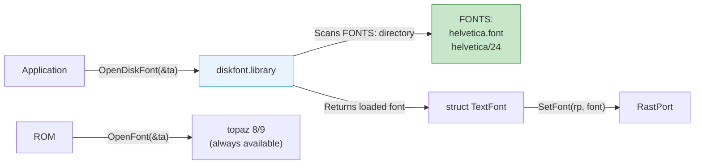

[← Home](../README.md) · [Libraries](README.md)

# diskfont.library — Disk-Based Font Loading

## Overview

`diskfont.library` loads bitmap fonts from disk (the `FONTS:` assign). Only two fonts are built into ROM — **topaz 8** and **topaz 9**. All other fonts (helvetica, times, courier, etc.) must be loaded from disk via this library.



---

## Font Directory Structure

Amiga bitmap fonts are stored as a descriptor file plus per-size data files:

```
FONTS:
  helvetica.font          ← font descriptor (FontContents header)
  helvetica/
    9                      ← bitmap data for 9-pixel height
    11                     ← bitmap data for 11-pixel height
    13                     ← bitmap data for 13-pixel height
    18                     ← bitmap data for 18-pixel height
    24                     ← bitmap data for 24-pixel height
  times.font
  times/
    11
    13
    18
    24
```

The `.font` descriptor file contains a `FontContentsHeader` listing all available sizes, styles, and flags.

---

## Loading a Disk Font

```c
struct Library *DiskfontBase = OpenLibrary("diskfont.library", 0);

/* Request a specific font and size: */
struct TextAttr ta = {"helvetica.font", 24, 0, 0};
struct TextFont *font = OpenDiskFont(&ta);

if (font)
{
    SetFont(rp, font);
    Move(rp, 10, 30);
    Text(rp, "Disk Font Text", 14);

    /* When done with the font: */
    CloseFont(font);
}
else
{
    /* Font not found — fall back to ROM font: */
    struct TextAttr fallback = {"topaz.font", 8, 0, FPF_ROMFONT};
    struct TextFont *topaz = OpenFont(&fallback);
    SetFont(rp, topaz);
}

CloseLibrary(DiskfontBase);
```

### Size Matching

If the exact requested size is not available, `OpenDiskFont` returns NULL. To find the nearest available size, use `AvailFonts` to enumerate, then request the closest match.

---

## Enumerating Available Fonts

```c
/* AvailFonts returns all fonts in ROM and on disk: */
LONG bufSize = 4096;
APTR buf = AllocMem(bufSize, MEMF_ANY | MEMF_CLEAR);

LONG shortfall = AvailFonts(buf, bufSize, AFF_DISK | AFF_MEMORY);
if (shortfall > 0)
{
    /* Buffer too small — reallocate and retry: */
    FreeMem(buf, bufSize);
    bufSize += shortfall;
    buf = AllocMem(bufSize, MEMF_ANY | MEMF_CLEAR);
    AvailFonts(buf, bufSize, AFF_DISK | AFF_MEMORY);
}

struct AvailFontsHeader *afh = (struct AvailFontsHeader *)buf;
struct AvailFonts *af = (struct AvailFonts *)&afh[1];

for (int i = 0; i < afh->afh_NumEntries; i++)
{
    Printf("%s  size %-3ld  %s\n",
           af[i].af_Attr.ta_Name,
           af[i].af_Attr.ta_YSize,
           (af[i].af_Type & AFF_DISK) ? "disk" :
           (af[i].af_Type & AFF_MEMORY) ? "ROM" : "scaled");
}

FreeMem(buf, bufSize);
```

---

## Font Types

| Flag | Source | Notes |
|---|---|---|
| `AFF_MEMORY` | ROM or already loaded in memory | topaz, or previously opened disk fonts |
| `AFF_DISK` | Available on `FONTS:` | Requires disk access to load |
| `AFF_SCALED` | Algorithmically scaled from another size | Lower quality; avoid when native size exists |
| `AFF_BITMAP` | Bitmap (pixel) font | Standard Amiga font format |
| `AFF_TAGGED` | Tagged (OS 3.0+ extended) font | Supports color fonts, outlined fonts |

---

## Color Fonts (OS 3.0+)

OS 3.0 introduced **color bitmap fonts** — each glyph can have multiple bitplanes:

```c
/* Color fonts use ColorTextFont — an extension of TextFont: */
struct ColorTextFont {
    struct TextFont ctf_TF;          /* standard TextFont */
    UWORD  ctf_Flags;               /* CT_COLORFONT etc. */
    UBYTE  ctf_Depth;               /* number of bitplanes */
    UBYTE  ctf_FgColor;             /* default foreground pen */
    UBYTE  ctf_Low;                 /* lowest color used */
    UBYTE  ctf_High;                /* highest color used */
    APTR   ctf_PlanePick;           /* plane selection */
    APTR   ctf_PlaneOnOff;          /* plane on/off defaults */
    struct ColorFontColors *ctf_ColorTable;
    APTR   ctf_CharData[8];         /* per-plane glyph data */
};
```

---

## References

- NDK39: `diskfont/diskfont.h`, `graphics/text.h`
- ADCD 2.1: diskfont.library autodocs
- See also: [text_fonts.md](../08_graphics/text_fonts.md) — TextFont structure and rendering
