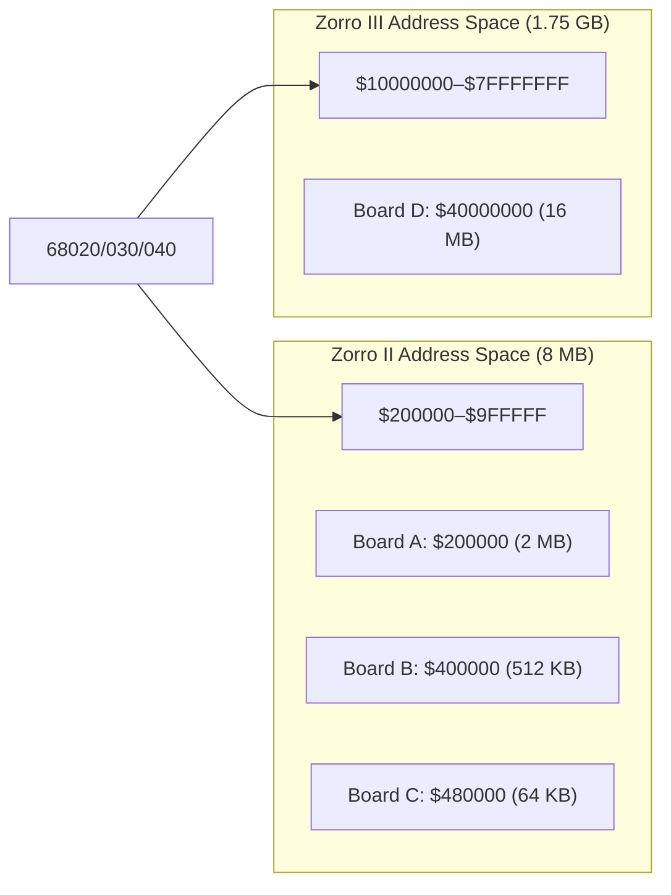
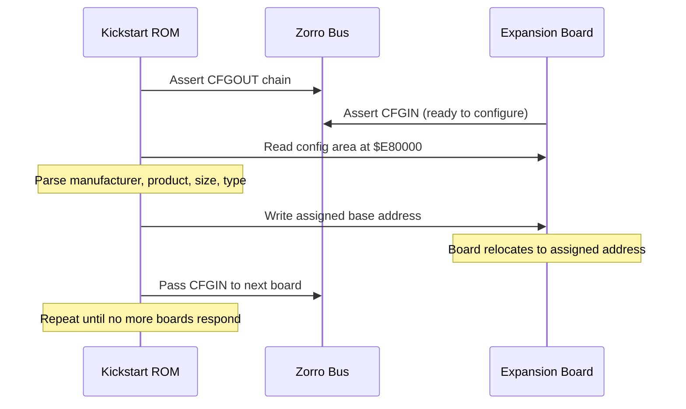

[← Home](../README.md) · [Libraries](README.md)

# expansion.library — Zorro Bus and AutoConfig

## Overview

`expansion.library` handles automatic configuration of Zorro II/III expansion boards. At boot, the OS scans the expansion bus and assigns base addresses to each board based on its **AutoConfig ROM** — a 256-byte structure that identifies the board's manufacturer, product, memory requirements, and bus type.

Understanding AutoConfig is essential for FPGA core development — MiSTer cores that emulate expansion hardware (RAM boards, accelerators, RTG cards) must present valid AutoConfig data to the boot ROM.

---

## Zorro Bus Architecture



| Feature | Zorro II | Zorro III |
|---|---|---|
| Bus width | 16-bit | 32-bit |
| Address space | $200000–$9FFFFF (8 MB) | $10000000–$7FFFFFFF |
| Max board size | 8 MB | 1 GB |
| Burst transfer | No | Yes (37 MB/s peak) |
| Auto-sizing | No | Yes (dynamic) |
| DMA capable | Yes | Yes |
| Systems | A2000, A500, A1200 | A3000, A4000 |

---

## AutoConfig Sequence

The AutoConfig mechanism runs during early boot, before DOS is loaded:



### AutoConfig ROM Layout ($E80000)

The board presents its identity at the configuration address. Each byte is read from **even** addresses only ($E80000, $E80002, $E80004...):

| Offset | Register | Bits | Description |
|---|---|---|---|
| $00 | `er_Type` | 7:6 | Board type: 11=Zorro III, 10=Zorro II |
| $00 | `er_Type` | 5 | Memory board (1) or I/O board (0) |
| $00 | `er_Type` | 4 | Chain bit — more boards follow |
| $00 | `er_Type` | 3:0 | Size code (see table below) |
| $02 | `er_Product` | 7:0 | Product number (0–255) |
| $04 | `er_Flags` | 7 | Can be shut up (mapped out) |
| $04 | `er_Flags` | 5 | Board's memory is free (add to system pool) |
| $08/$0A | `er_Manufacturer` | 15:0 | Manufacturer ID (IANA-like registry) |
| $0C–$12 | `er_SerialNumber` | 31:0 | Serial number (unique per board) |
| $20/$22 | `er_InitDiagVec` | 15:0 | Offset to optional boot ROM (DiagArea) |

### Size Code

| Code | Zorro II Size | Zorro III Size |
|---|---|---|
| $0 | 8 MB | 16 MB |
| $1 | 64 KB | 32 MB |
| $2 | 128 KB | 64 MB |
| $3 | 256 KB | 128 MB |
| $4 | 512 KB | 256 MB |
| $5 | 1 MB | 512 MB |
| $6 | 2 MB | 1 GB |
| $7 | 4 MB | — |

---

## struct ConfigDev

```c
/* libraries/configvars.h — NDK39 */
struct ConfigDev {
    struct Node      cd_Node;
    UBYTE            cd_Flags;       /* CDF_CONFIGME, CDF_BADMEMORY, etc. */
    UBYTE            cd_Pad;
    struct ExpansionRom cd_Rom;      /* AutoConfig ROM data (copied) */
    APTR             cd_BoardAddr;   /* assigned base address */
    ULONG            cd_BoardSize;   /* board size in bytes */
    UWORD            cd_SlotAddr;    /* slot address */
    UWORD            cd_SlotSize;
    APTR             cd_Driver;      /* driver bound to this board */
    struct ConfigDev *cd_NextCD;     /* next in chain */
};

struct ExpansionRom {
    UBYTE  er_Type;          /* board type + size code */
    UBYTE  er_Product;       /* product number (0–255) */
    UBYTE  er_Flags;         /* can shut up, has memory, etc. */
    UBYTE  er_Reserved03;
    UWORD  er_Manufacturer;  /* manufacturer ID (16-bit) */
    ULONG  er_SerialNumber;  /* board serial number */
    UWORD  er_InitDiagVec;   /* offset to DiagArea boot ROM */
    APTR   er_Reserved0c;
    APTR   er_Reserved10;
};
```

---

## Finding Expansion Boards

```c
struct Library *ExpansionBase = OpenLibrary("expansion.library", 0);
struct ConfigDev *cd = NULL;

/* Find all boards from a specific manufacturer+product: */
while ((cd = FindConfigDev(cd, 2167, 11)))
{
    Printf("Board at $%08lx, size %lu bytes\n",
           cd->cd_BoardAddr, cd->cd_BoardSize);
    Printf("  Manufacturer: %u, Product: %u\n",
           cd->cd_Rom.er_Manufacturer, cd->cd_Rom.er_Product);
}

/* Find ANY board: use -1 for wildcard */
cd = NULL;
while ((cd = FindConfigDev(cd, -1, -1)))
{
    Printf("Mfr=%u Prod=%u at $%08lx (%lu bytes)\n",
           cd->cd_Rom.er_Manufacturer,
           cd->cd_Rom.er_Product,
           cd->cd_BoardAddr,
           cd->cd_BoardSize);
}
```

---

## Common Manufacturer IDs

| ID | Manufacturer | Notable Products |
|---|---|---|
| 514 | Commodore | A2091 SCSI, A2065 Ethernet, A2232 serial |
| 1030 | Supra | SupraRAM, SupraDrive |
| 2017 | GVP | Impact A2000, Series II SCSI+RAM |
| 2167 | Individual Computers | Buddha, ACA500+, ACA1233 |
| 2168 | Kupke | Golem RAM |
| 4096 | University of Lowell | — |
| 4626 | ACT | Apollo accelerators |
| 4754 | MacroSystem | Retina, Warp Engine |
| 8512 | Phase5 | CyberStorm, Blizzard, CyberVision |
| 12802 | Village Tronic | Picasso II, Picasso IV |

---

## DiagArea — Boot ROMs on Expansion Boards

If `er_InitDiagVec` is non-zero, the board has a boot ROM that runs during expansion configuration:

```c
struct DiagArea {
    UBYTE  da_Config;    /* DAC_WORDWIDE, DAC_BYTEWIDE, etc. */
    UBYTE  da_Flags;     /* DAC_CONFIGTIME or DAC_BINDTIME */
    UWORD  da_Size;      /* total size of DiagArea */
    UWORD  da_DiagPoint; /* offset to diagnostic routine */
    UWORD  da_BootPoint; /* offset to boot code */
    char   da_Name[];    /* optional handler name */
};
```

Boot ROMs are used by:
- SCSI controllers (to boot from hard disk)
- Network cards (to boot via TFTP)
- Accelerator boards (to patch CPU-specific features)

---

## FPGA Implementation Notes

For MiSTer or other FPGA cores emulating Zorro expansion:

| Aspect | Requirement |
|---|---|
| AutoConfig ROM | Must present valid er_Type, er_Product, er_Manufacturer at $E80000 |
| Address assignment | Must accept base address write and relocate accordingly |
| CFGIN/CFGOUT chain | Must implement daisy-chain protocol for multi-board configs |
| Memory type flag | Set `er_Flags` bit 5 if board memory should be added to system pool |
| Shut-up | Board must go silent after configuration (stop responding at $E80000) |

---

## References

- NDK39: `libraries/configvars.h`, `libraries/expansion.h`
- ADCD 2.1: expansion.library autodocs
- Dave Haynie: *"The Amiga Zorro III Bus Specification"* — definitive bus reference
- See also: [rtg_driver.md](../16_driver_development/rtg_driver.md) — RTG cards use Zorro AutoConfig
- See also: [device_driver_basics.md](../16_driver_development/device_driver_basics.md) — driver binding to ConfigDev
