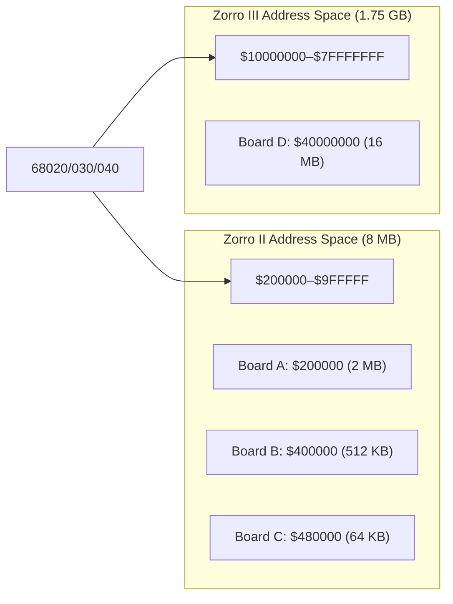
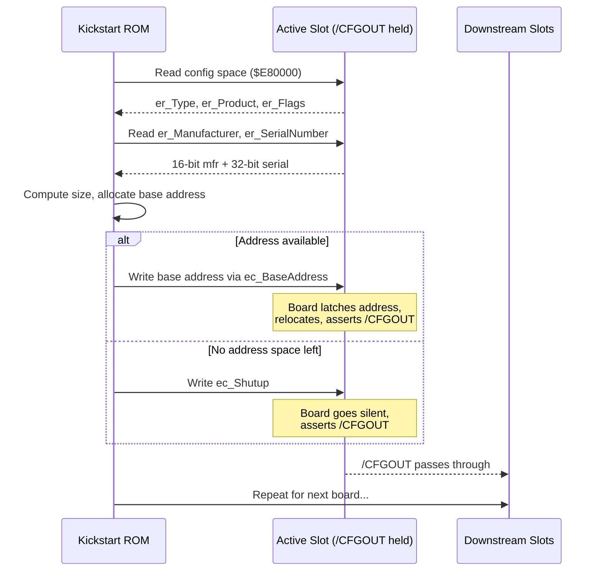
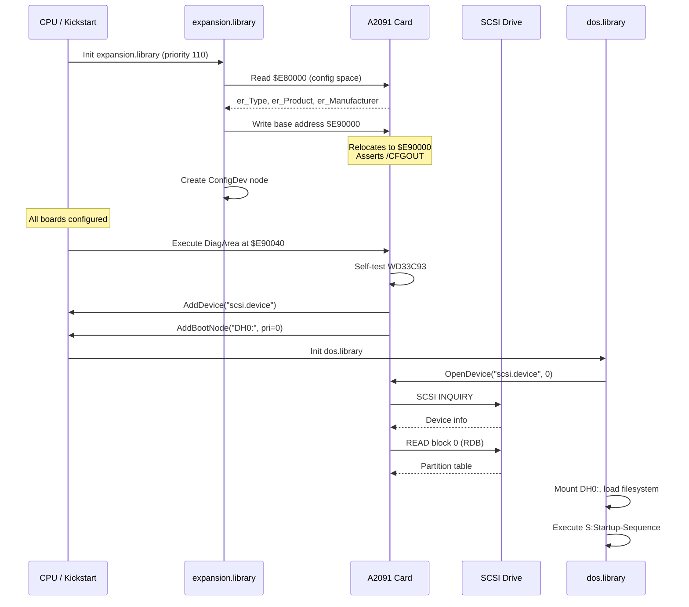

[← Home](../README.md) · [Libraries](README.md)

# expansion.library — Zorro Bus and AutoConfig

## Overview

`expansion.library` handles automatic configuration of Zorro II/III expansion boards. At boot, the OS scans the expansion bus and assigns base addresses to each board based on its **AutoConfig ROM** — a 256-byte structure that identifies the board's manufacturer, product, memory requirements, and bus type.

Understanding AutoConfig is essential for FPGA core development — MiSTer cores that emulate expansion hardware (RAM boards, accelerators, RTG cards) must present valid AutoConfig data to the boot ROM.

See [AutoConfig Protocol](../01_hardware/common/autoconfig.md) for the full hardware-level specification including the `/CFGIN`/`/CFGOUT` daisy-chain mechanics, nibble-pair ROM format, and corner cases with empty slots and third-party risers.

---

## Zorro Bus Architecture



| Feature | Zorro II | Zorro III |
|---|---|---|
| Bus width | 16-bit | 32-bit |
| Address space | $200000–$9FFFFF (8 MB) | $10000000–$7FFFFFFF |
| Max board size | 8 MB | 1 GB |
| Burst transfer | No | Yes (37 MB/s peak) |
| Auto-sizing | No | Yes (dynamic) |
| DMA capable | Yes | Yes |
| Systems | A2000, A500, A1200 | A3000, A4000 |

---

## AutoConfig Sequence

The AutoConfig mechanism runs during early boot, before DOS is loaded. `expansion.library` is initialized by `exec.library` as a resident module at **priority 110**, placing it very early in the Kickstart init sequence:

```
1. CPU Reset → Kickstart ROM entry point
2. exec.library initializes (memory, interrupts, scheduler)
3. Resident module scan → expansion.library initialized (priority 110)
4. expansion.library runs ConfigChain() → enumerates all Zorro boards
5. DiagArea boot ROMs execute (SCSI, network boot handlers)
6. dos.library initializes, mounts filesystems
7. Boot from highest-priority bootable device
```

The enumeration loop reads the configuration window (`$E80000` for Zorro II, `$FF000000` for Zorro III) in a tight polling loop. Each iteration discovers one board:



The system requires no handshake signal — once the base address is written, the board instantly relocates and the next iteration finds the next board in the window. See [AutoConfig Protocol — The Four-Phase Configuration Sequence](../01_hardware/common/autoconfig.md#the-four-phase-configuration-sequence) for full details.

### AutoConfig ROM Layout ($E80000)

The board presents its identity at the configuration address. Each logical byte is read via **two even-address accesses** (nibble-pair format): the high nibble from bits `D7–D4` at `offset`, the low nibble from bits `D7–D4` at `offset + 2`. This allows boards to use cheap 4-bit PROMs. All fields except `er_Type` are stored **inverted** in the ROM (XOR `$FF`) — an empty bus reads `$FF`, which inverts to `$00`, cleanly signaling "no more boards."

See [AutoConfig Protocol — Nibble-Pair Format](../01_hardware/common/autoconfig.md#the-nibble-pair-format--logical-inversion) for the full physical-to-logical address map.

| Offset | Register | Bits | Description |
|---|---|---|---|
| $00 | `er_Type` | 7:6 | Board type: `11`=Zorro II, `10`=Zorro III |
| $00 | `er_Type` | 5 | Memory board (1) or I/O board (0) |
| $00 | `er_Type` | 4 | Chain bit — more boards follow |
| $00 | `er_Type` | 3:0 | Size code (see table below) |
| $02 | `er_Product` | 7:0 | Product number (0–255) |
| $04 | `er_Flags` | 7 | Can be shut up (mapped out) |
| $04 | `er_Flags` | 5 | Board's memory is free (add to system pool) |
| $04 | `er_Flags` | 4 | `er_InitDiagVec` is valid (`ERFB_DIAGVALID`) |
| $08/$0A | `er_Manufacturer` | 15:0 | Manufacturer ID (assigned by Commodore) |
| $0C–$12 | `er_SerialNumber` | 31:0 | Serial number (unique per board) |
| $20/$22 | `er_InitDiagVec` | 15:0 | Offset to optional boot ROM (DiagArea) |

### Size Code

| Code | Zorro II Size | Zorro III Size |
|---|---|---|
| $0 | 8 MB | 16 MB |
| $1 | 64 KB | 32 MB |
| $2 | 128 KB | 64 MB |
| $3 | 256 KB | 128 MB |
| $4 | 512 KB | 256 MB |
| $5 | 1 MB | 512 MB |
| $6 | 2 MB | 1 GB |
| $7 | 4 MB | — |

---

## struct ConfigDev

```c
/* libraries/configvars.h — NDK39 */
struct ConfigDev {
    struct Node      cd_Node;
    UBYTE            cd_Flags;       /* see cd_Flags table below */
    UBYTE            cd_Pad;
    struct ExpansionRom cd_Rom;      /* AutoConfig ROM data (copied) */
    APTR             cd_BoardAddr;   /* assigned base address */
    ULONG            cd_BoardSize;   /* board size in bytes */
    UWORD            cd_SlotAddr;    /* slot address */
    UWORD            cd_SlotSize;
    APTR             cd_Driver;      /* driver bound to this board */
    struct ConfigDev *cd_NextCD;     /* next in chain */
    ULONG            cd_Unused[4];   /* reserved */
};

struct ExpansionRom {
    UBYTE  er_Type;          /* board type + size code */
    UBYTE  er_Product;       /* product number (0–255) */
    UBYTE  er_Flags;         /* can shut up, has memory, etc. */
    UBYTE  er_Reserved03;
    UWORD  er_Manufacturer;  /* manufacturer ID (16-bit) */
    ULONG  er_SerialNumber;  /* board serial number */
    UWORD  er_InitDiagVec;   /* offset to DiagArea boot ROM */
    APTR   er_Reserved0c;
    APTR   er_Reserved10;
};
```

### cd_Flags Values

| Flag | Value | Description |
|---|---|---|
| `CDF_SHUTUP` | `$01` | Board has been shut up (disabled via `ec_Shutup`) |
| `CDF_CONFIGME` | `$02` | Board needs a driver — set by the OS during AutoConfig, cleared when a driver claims it via `ConfigBoard()` |
| `CDF_BADMEMORY` | `$04` | Board memory failed diagnostic and should not be added to the free pool |

`CDF_CONFIGME` is the key flag for driver authors: it indicates the board has been discovered and address-mapped but no driver has claimed it yet. A well-behaved driver checks this flag, performs initialization, then clears it.

---

## API Reference

### Runtime API — Finding Expansion Boards

```c
/* Find a configured board by manufacturer and product.
 * Pass NULL to start, previous cd to continue iterating.
 * Use -1 for manufacturer or product as wildcard. */
struct ConfigDev *FindConfigDev(
    struct ConfigDev *oldConfigDev,
    LONG manufacturer,
    LONG product
);
/* LVO -72 */
```

```c
/* Bind a driver to a ConfigDev node (clears CDF_CONFIGME) */
void ConfigBoard(
    APTR boardAddr,
    struct ConfigDev *configDev
);
/* LVO -48 */
```

### Low-Level Primitives (Kickstart Internal)

These are the actual primitives used by `ConfigChain()` during the boot scan. They are exported by `expansion.library` but are not intended for application use:

```c
/* Read a board's ExpansionRom structure from the config address space.
 * Performs the nibble-pair reads and applies XOR $FF inversion. */
BOOL ReadExpansionRom(
    APTR board,                     /* config base ($E80000 or $FF000000) */
    struct ConfigDev *configDev     /* output: populated with ROM data */
);
/* LVO -96 */
```

```c
/* Write the assigned base address to the board's ec_BaseAddress register.
 * Performs nibble-pair writes that latch the address and cause the
 * board to relocate and assert /CFGOUT. */
void WriteExpansionBase(
    APTR board,                     /* config base address */
    ULONG base                      /* assigned base address */
);
/* LVO -102 */
```

### Usage Example

```c
struct Library *ExpansionBase = OpenLibrary("expansion.library", 0);
struct ConfigDev *cd = NULL;

/* Find all boards from a specific manufacturer+product: */
while ((cd = FindConfigDev(cd, 2167, 11)))
{
    Printf("Board at $%08lx, size %lu bytes\n",
           cd->cd_BoardAddr, cd->cd_BoardSize);
    Printf("  Manufacturer: %u, Product: %u\n",
           cd->cd_Rom.er_Manufacturer, cd->cd_Rom.er_Product);
}

/* Find ANY board: use -1 for wildcard */
cd = NULL;
while ((cd = FindConfigDev(cd, -1, -1)))
{
    Printf("Mfr=%u Prod=%u at $%08lx (%lu bytes)\n",
           cd->cd_Rom.er_Manufacturer,
           cd->cd_Rom.er_Product,
           cd->cd_BoardAddr,
           cd->cd_BoardSize);
}
```

---

## Common Manufacturer IDs

| ID | Manufacturer | Notable Products |
|---|---|---|
| 514 | Commodore | A2091 SCSI, A2065 Ethernet, A2232 serial |
| 1030 | Supra | SupraRAM, SupraDrive |
| 2017 | GVP | Impact A2000, Series II SCSI+RAM |
| 2167 | Individual Computers | Buddha, ACA500+, ACA1233 |
| 2168 | Kupke | Golem RAM |
| 4096 | University of Lowell | — |
| 4626 | ACT | Apollo accelerators |
| 4754 | MacroSystem | Retina, Warp Engine |
| 8512 | Phase5 | CyberStorm, Blizzard, CyberVision |
| 12802 | Village Tronic | Picasso II, Picasso IV |

---

## DiagArea — Boot ROMs on Expansion Boards

If `er_Flags` has the `ERFB_DIAGVALID` bit set, the board carries a **DiagArea** — an on-board ROM structure containing executable code that runs during AutoConfig, *before* DOS is available. The `er_InitDiagVec` field gives the byte offset from the board's configured base address to the `DiagArea` structure.

```c
struct DiagArea {
    UBYTE  da_Config;    /* DAC_WORDWIDE, DAC_BYTEWIDE, DAC_NIBBLEWIDE */
    UBYTE  da_Flags;     /* DAC_CONFIGTIME or DAC_BINDTIME */
    UWORD  da_Size;      /* total size of DiagArea in bytes */
    UWORD  da_DiagPoint; /* offset to diagnostic routine (optional) */
    UWORD  da_BootPoint; /* offset to boot code (optional) */
    char   da_Name[];    /* NUL-terminated handler name (e.g. "scsi.device") */
};
```

### da_Flags — Execution Timing

| Flag | Description |
|---|---|
| `DAC_CONFIGTIME` | Code runs immediately during the `ConfigChain()` pass, while AutoConfig is still in progress. Used by SCSI controllers that must install their `exec.device` handler before DOS mounts volumes. |
| `DAC_BINDTIME` | Code runs later, after all boards have been configured. Used by boards that depend on other expansion hardware being present first. |

### da_Config — Data Width

| Flag | Description |
|---|---|
| `DAC_BYTEWIDE` | DiagArea ROM uses byte-wide access |
| `DAC_WORDWIDE` | DiagArea ROM uses word-wide (16-bit) access |
| `DAC_NIBBLEWIDE` | DiagArea ROM uses nibble-wide (4-bit) access — same format as the AutoConfig ROM itself |

### Common Uses

- **SCSI controllers** (A2091, GVP Series II) — install `scsi.device` handler at `DAC_CONFIGTIME` so the system can boot from hard disk
- **Network cards** — install network device handler for TFTP/BOOTP boot
- **Accelerator boards** — patch CPU-specific features, install MMU tables
- **RTG graphics cards** — some cards use DiagArea to install early display initialization code

> [!NOTE]
> DiagArea execution happens at step 5 in the [boot sequence](../01_hardware/common/autoconfig.md#boot-sequence-position), after all boards have been assigned addresses but before `dos.library` loads. Without DiagArea, there is no mechanism to boot from expansion hardware.

---

## Use Case: Booting from an External SCSI Controller

This walkthrough traces the complete lifecycle of a Zorro II SCSI controller (using the A2091 as a concrete example) from power-on through disk boot. It shows every address, signal, and function call involved.

### Phase 1 — Power-On and AutoConfig Discovery

```
Power on → CPU executes Kickstart ROM at $FC0000
  → exec.library initializes
  → expansion.library init (priority 110) calls ConfigChain($E80000)
```

The motherboard asserts `/CFGIN` on Slot 1. The A2091 wakes up and responds at `$E80000`:

```
ConfigChain reads $E80000 (physical):
  $E80000/$E80002 → er_Type high/low nibble → $C1 (Zorro II, I/O board, size=64KB)
  $E80004/$E80006 → er_Product (inverted)   → $03 (product 3)
  $E80008/$E8000A → er_Flags (inverted)     → ERFB_DIAGVALID set
  $E80010–$E80016 → er_Manufacturer         → $0202 (514 = Commodore)
  $E80018–$E80026 → er_SerialNumber         → $00000000
  $E80028–$E8002E → er_InitDiagVec          → $0040 (DiagArea at base + $40)
```

### Phase 2 — Address Assignment

The OS computes: product 3, size code `$1` = 64 KB. It finds a free region in the Zorro II I/O pool (`$E90000–$EFFFFF`) and assigns base address `$E90000`:

```
ConfigChain writes base address as nibbles:
  Write $E9 high nibble → physical offset $44 (ec_BaseAddress)
  Write $00 high nibble → physical offset $46
  Write $00 high nibble → physical offset $48
```

The A2091 latches `$E90000`, stops responding at `$E80000`, starts responding at `$E90000`, and asserts `/CFGOUT`. The OS creates a `ConfigDev` node:

```c
cd->cd_BoardAddr     = 0x00E90000;   /* assigned base */
cd->cd_BoardSize     = 0x00010000;   /* 64 KB */
cd->cd_Rom.er_Manufacturer = 514;    /* Commodore */
cd->cd_Rom.er_Product      = 3;      /* A2091 */
cd->cd_Flags         = CDF_CONFIGME; /* needs a driver */
```

`ConfigChain` continues — reads `$E80000` again, finds the next board (or chain termination).

### Phase 3 — DiagArea Execution

After *all* boards are configured, Kickstart walks the `ConfigDev` list and processes boards with `ERFB_DIAGVALID`. For the A2091:

```
Board base = $E90000
er_InitDiagVec = $0040
→ DiagArea struct located at $E90040
```

Kickstart reads the `DiagArea` header:

```
$E90040: da_Config    = DAC_WORDWIDE     (word-wide ROM access)
$E90041: da_Flags     = DAC_CONFIGTIME   (execute NOW, during boot)
$E90042: da_Size      = $2000            (8 KB DiagArea ROM)
$E90044: da_DiagPoint = $0100            (diagnostic at base + $40 + $100)
$E90046: da_BootPoint = $0200            (boot code at base + $40 + $200)
$E90048: da_Name      = "scsi.device\0"
```

Because `da_Flags = DAC_CONFIGTIME`, Kickstart executes the code immediately:

**Step 3a — Diagnostic routine** (`da_DiagPoint`):
```
JSR to $E90140 (base + $40 + $100)
  → Board self-test: verify WD33C93 SCSI chip responds
  → Initialize DMA controller
  → Return D0=1 (success) or D0=0 (failure, board disabled)
```

**Step 3b — Boot code** (`da_BootPoint`):

This is the critical step. The boot code must perform four tasks, in order, using only `exec.library` and `expansion.library` calls (no DOS is available yet):

**Task 1 — Create and install the Exec device:**

The boot code allocates memory for the device handler structure and its code, then registers it with Exec:

```c
/* Simplified pseudocode — actual implementation is 68K assembly */

/* The device struct lives in memory allocated from the DiagArea code */
struct Device *scsiDev = AllocMem(sizeof(struct MyDeviceBase), MEMF_PUBLIC|MEMF_CLEAR);

/* Fill in the standard Exec Library/Device fields */
scsiDev->dd_Library.lib_Node.ln_Name = "scsi.device";
scsiDev->dd_Library.lib_Node.ln_Type = NT_DEVICE;
scsiDev->dd_Library.lib_Version      = 40;
scsiDev->dd_Library.lib_IdString     = "a2091 scsi.device 40.10";

/* Install the function vectors (the "jump table") */
/* These are negative offsets from the device base pointer */
SetFunction(scsiDev, DEV_OPEN,    myOpenFunc);     /* -6  */
SetFunction(scsiDev, DEV_CLOSE,   myCloseFunc);    /* -12 */
SetFunction(scsiDev, DEV_EXPUNGE, myExpungeFunc);   /* -18 */
SetFunction(scsiDev, DEV_BEGINIO, myBeginIOFunc);   /* -30 */
SetFunction(scsiDev, DEV_ABORTIO, myAbortIOFunc);   /* -36 */

/* Register the device with Exec's global device list */
AddDevice(scsiDev);
/* Now any code can call OpenDevice("scsi.device", unit, ...) */
```

After `AddDevice()`, the device name `"scsi.device"` is visible to the entire system. Any code — including `dos.library` later — can call `OpenDevice("scsi.device", unitNumber, ioRequest, 0)` and the Exec dispatch will route it to your `BeginIO` handler.

**Task 2 — Build a DOS device node:**

The boot code must describe the disk partition so `dos.library` knows how to mount it. This uses `expansion.library`'s `MakeDosNode()`:

```c
/* Build the parameter packet for MakeDosNode() */
/* This is a LONG array describing the DOS device: */
ULONG params[] = {
    (ULONG)"DH0:",      /* dosName — what users see in the CLI */
    (ULONG)"scsi.device",/* execName — the Exec device to open */
    0,                   /* unit number (SCSI ID 0) */
    0,                   /* flags */
    16,                  /* number of surfaces (heads) */
    1,                   /* sectors per block */
    32,                  /* blocks per track */
    0,                   /* reserved blocks at start */
    0,                   /* reserved blocks at end */
    0,                   /* interleave */
    0, 0,                /* lowCyl, highCyl — filled from RDB later */
    5,                   /* numBuffers */
    MEMF_PUBLIC,         /* bufMemType */
    0x7FFFFFFF,          /* maxTransfer */
    0xFFFFFFFE,          /* mask (all but bit 0) */
    -1,                  /* boot priority (-1 = don't auto-boot) */
    (ULONG)"FFS\0",     /* DOS type (0x444F5303 for FFS) */
};

struct DeviceNode *dn = MakeDosNode(params);
```

**Task 3 — Register as bootable:**

```c
/* AddBootNode registers the device as bootable.
 * The priority determines boot order — higher boots first.
 * dn is the DeviceNode from MakeDosNode().
 * cd is the ConfigDev pointer passed in registers by Kickstart. */

AddBootNode(0, ADNF_STARTPROC, dn, cd);
/*           ^  ^               ^   ^
 *           |  |               |   +-- ConfigDev (links device to board)
 *           |  |               +------ DeviceNode to mount
 *           |  +---------------------- Start handler process at boot
 *           +------------------------- Boot priority (0 = normal)
 */
```

> [!NOTE]
> `AddBootNode()` does NOT mount the filesystem. It adds an entry to an internal **boot node list** that `dos.library` will walk later. The `ADNF_STARTPROC` flag tells DOS to actually start a handler process for this device — without it, the node exists but remains dormant.

**Task 4 — Return to Kickstart:**

The boot code returns with `D0 = 1` (success). Kickstart continues processing any remaining DiagArea boards.

At this point, `scsi.device` is live in Exec's device list and "DH0:" is queued in the boot node list — but no disk I/O has occurred yet. The SCSI bus hasn't even been scanned. That happens next.

### Phase 4 — DOS Boot and Device Discovery

When `dos.library` initializes (Kickstart boot step 6), it performs the actual disk discovery:

**Step 4a — Walk the boot node list:**

```
dos.library sorts boot nodes by priority (highest first)
For each boot node:
  → Calls OpenDevice() with the execName and unit from the DeviceNode
  → This triggers scsi.device's Open handler (your myOpenFunc above)
```

**Step 4b — Device Open handler scans the bus:**

When `scsi.device` receives its first `OpenDevice()` call, it typically performs a deferred bus scan:

```
scsi.device Open(unit=0):
  → If first open: enumerate SCSI bus
    → Send INQUIRY to SCSI IDs 0–6
    → Record which IDs have devices
    → Send READ CAPACITY to each device (get size)
  → Set up per-unit state for the requested unit
  → Return success (or error if unit not found)
```

This deferred approach is important — scanning the SCSI bus during DiagArea (step 3b) would slow boot for every board, even if the system won't boot from that controller.

**Step 4c — RigidDiskBlock parsing:**

```
dos.library reads block 0 from the opened device
  → Looks for RDB signature ("RDSK" / $5244534B) in blocks 0–15
  → If found: parse partition table entries
    → For each partition: create/update DeviceNode with actual cylinder ranges
    → Mount the filesystem (spawn a handler process)
  → If no RDB: try to mount using the parameters from MakeDosNode()
```

**Step 4d — Filesystem boot:**

```
dos.library picks the highest-priority mounted device
  → Opens the root directory
  → Looks for L:FastFileSystem (if needed) or uses ROM filesystem
  → Reads S:Startup-Sequence
  → Begins executing commands → normal Workbench boot
```

### How Does the OS "Know" a New Controller Exists?

The answer is surprisingly simple — it's a **push model**, not a pull model:

1. **The board firmware tells the OS.** The DiagArea boot code explicitly calls `AddDevice()` and `AddBootNode()`. The OS doesn't scan for controllers — the controller announces itself.
2. **The device name is the contract.** After `AddDevice("scsi.device")`, any code can call `OpenDevice("scsi.device", unit, ...)`. There is no central "disk controller registry" — Exec's device list *is* the registry.
3. **Multiple controllers coexist by name.** If two SCSI controllers are installed, they typically use different device names (`"scsi.device"` and `"gvpscsi.device"`). Each registers its own boot nodes with different priorities. The user controls which boots first via HDToolBox (boot priority field in the RDB).
4. **Post-boot discovery works the same way.** If you add an IDE controller that doesn't use DiagArea (driver loaded from disk), the startup-sequence or user runs a mount command that calls `OpenDevice("ide.device", unit, ...)`. The OS doesn't care *when* the device was registered — only that it's in Exec's device list when needed.

### Complete Timeline



---

## Developing Compliant Expansion Board Firmware

How complex is it to develop firmware for an AutoConfig-compliant expansion board? The answer depends entirely on the device class.

### Difficulty Tiers

#### Tier 1 — Trivial: RAM Board (No Firmware Required)

A RAM expansion board needs **zero firmware**. The AutoConfig ROM is just a small PROM (or diode array) with 16 bytes of static identity data. There is no executable code, no DiagArea, no driver. The hardware requirements are:

- A 4-bit PROM or register array wired to the upper data bus (`D7–D4`)
- Address decode logic for the `$E80000` config window
- A latch to capture the assigned base address
- `/CFGIN`/`/CFGOUT` gating logic

This can be implemented with a handful of 74-series TTL chips or a single small CPLD. Many hobbyist RAM boards use exactly this approach.

#### Tier 2 — Moderate: I/O Board Without Boot (Network, Audio, Sampler)

These boards need AutoConfig ROM + a device-specific register interface. The firmware consists of:

- **AutoConfig PROM:** Same 16 bytes as a RAM board
- **Register decode logic:** Map the device chip's registers into the assigned address space
- **Interrupt routing:** Wire the device's IRQ to the Zorro INT2 or INT6 line

The *Amiga-side driver* (SANA-II `.device` for network, AHI `.driver` for audio) is loaded from disk after boot — you don't need DiagArea. This means the board firmware itself is still purely hardware logic, no executable 68K code.

**Estimated complexity:** A CPLD or small FPGA plus the device controller chip. Firmware is gate-level logic, not software.

#### Tier 3 — Complex: Bootable Storage Controller (SCSI, IDE)

This is where real firmware development begins. In addition to everything in Tier 2, you need:

- **DiagArea ROM:** Executable 68000 code stored in an EPROM on the board. This code must:
  - Self-test the controller hardware
  - Create and install an `exec.device` handler (`scsi.device` or similar)
  - Build DOS device nodes and register them as bootable via `AddBootNode()`
- **Full Exec device handler:** Your `scsi.device` must implement the standard trackdisk-compatible command set:

```c
/* Minimum command set for a bootable device */
CMD_READ        /* Read sectors */
CMD_WRITE       /* Write sectors */
CMD_UPDATE      /* Flush write cache */
CMD_CLEAR       /* Invalidate read cache */
TD_GETGEOMETRY  /* Report disk geometry */
TD_MOTOR        /* Motor control (can be no-op for SCSI) */
TD_CHANGENUM    /* Media change detection */
HD_SCSICMD      /* Direct SCSI passthrough (optional but expected) */
```

- **RDB parsing awareness:** While `dos.library` handles RigidDiskBlock parsing, your device must support the block sizes and addressing the RDB specifies.
- **Interrupt-driven I/O:** DMA completion must trigger INT2/INT6 so the CPU doesn't have to poll.

**Estimated complexity:** 2–8 KB of 68000 assembly for the DiagArea boot ROM + device handler. The A2091 ROM is approximately 8 KB. Writing and debugging this code requires:
- Knowledge of Exec device handler conventions (`BeginIO`, `AbortIO`, `Open`, `Close`)
- SCSI/ATA protocol knowledge
- Ability to test without DOS (your code runs before the filesystem exists)

> [!WARNING]
> DiagArea code runs in **Supervisor mode** with **no DOS**, **no stdio**, and **no disk access**. You cannot use `printf()`, `Open()`, or any DOS function. Only `exec.library` calls are available. Debugging typically requires a serial port or LED register on the board itself.

#### Tier 4 — Expert: RTG Graphics Card

The most demanding firmware category. Beyond Tier 3 complexity:

- **No DiagArea device handler** — RTG cards don't install an `exec.device`. Instead, they rely on a Picasso96 or CyberGraphX `.card` driver loaded from disk.
- **But** the register interface is vastly more complex — you must emulate or expose a full VGA/SVGA register set (hundreds of registers for mode setting, palette, blitter, cursor, etc.)
- **Memory-mapped framebuffer** — must support multiple pixel formats (CLUT8, RGB15, RGB16, RGB24, ARGB32) and mode switching
- **Hardware blitter** — acceleration of `BltBitMap`, `RectFill`, line drawing (optional but expected for performance)

The firmware itself (CPLD/FPGA gate logic) is substantial, but the *Amiga-side driver* is where most of the development effort lies — it must implement the entire P96 or CGX card driver API.

### Compliance Checklist

| Requirement | RAM | I/O (No Boot) | Bootable Storage | RTG |
|---|---|---|---|---|
| AutoConfig PROM (16 bytes) | ✅ | ✅ | ✅ | ✅ |
| `/CFGIN`/`/CFGOUT` logic | ✅ | ✅ | ✅ | ✅ |
| Base address latch | ✅ | ✅ | ✅ | ✅ |
| Shut-up support | ✅ | ✅ | ✅ | ✅ |
| Register decode | — | ✅ | ✅ | ✅ |
| Interrupt routing | — | Usually | ✅ | ✅ |
| DiagArea ROM | — | — | ✅ | Optional |
| Exec device handler (68K code) | — | — | ✅ | — |
| `AddBootNode()` | — | — | ✅ | — |
| Amiga-side disk driver | — | From disk | In ROM | From disk |
| Hardware complexity | Low | Medium | High | Very High |
| 68K firmware code | 0 bytes | 0 bytes | 2–8 KB | 0–2 KB |

---

## Emulator & FPGA Implementation Guide

This section is for anyone building emulated Zorro hardware — whether in an FPGA (MiSTer Minimig, Vampire), a software emulator (UAE), or a modern reimplementation. The goal is for AmigaOS to discover and use your emulated device exactly as it would a real expansion card.

### The Universal AutoConfig Contract

Every emulated Zorro board, regardless of device type, must implement these five behaviors:

**1. Present Valid AutoConfig ROM Data:**
When the board's `/CFGIN` is asserted, it must respond at the configuration address (`$E80000` for Zorro II, `$FF000000` for Zorro III) with valid `ExpansionRom` data in nibble-pair format. At minimum you need:
- `er_Type` — correct bus type bits (`11` = Z2, `10` = Z3), memory/I/O flag, and accurate size code
- `er_Product` — your product number (0–255)
- `er_Manufacturer` — a valid 16-bit manufacturer ID (use an existing registered ID or a well-known test ID like `$6502`)
- `er_Flags` — set `ERFB_MEMLIST` if the board's memory should be added to the system pool; set `ERFB_DIAGVALID` if you provide a DiagArea boot ROM

**2. Accept Base Address Write:**
When the OS writes nibbles to `ec_BaseAddress` (physical offsets `$44`–`$4E`), the board must latch the assigned address, immediately stop responding at the config window, and begin responding at the new base address.

**3. Implement `/CFGIN`/`/CFGOUT`:**
The board must only respond in the config window when `/CFGIN` is asserted. After configuration, it must assert `/CFGOUT` to allow the next board in the chain to be discovered. In software emulators this is typically handled by iterating a virtual slot array; in FPGA you must implement the actual signal chain.

**4. Support Shut-Up:**
If the OS writes to `ec_Shutup` (physical offset `$4C`), the board must go permanently silent — stop responding at both the config address and any other address. This happens when the OS has no address space left for the board.

**5. Respect Bus Width:**
Zorro II boards must respond to 16-bit access only. Zorro III boards must handle full 32-bit access. Getting this wrong causes bus errors or data corruption.

### Per-Device-Type Requirements

While AutoConfig discovery is identical for all boards, the **post-configuration behavior** varies dramatically by device class. The table below summarizes what each type needs beyond the universal contract:

#### RAM Expansion (Simplest Case)

The easiest device to emulate. No driver, no DiagArea, no interrupts.

| Aspect | Requirement |
|---|---|
| `er_Type` bit 5 | Set to `1` (memory board) |
| `er_Flags` bit 5 | Set `ERFB_MEMLIST` so OS adds memory to free pool automatically |
| DiagArea | Not needed |
| Post-config behavior | Just be readable/writable RAM at the assigned address |
| Driver | None — the OS handles everything |

> [!TIP]
> RAM boards are the ideal first test when bringing up AutoConfig on a new platform. If `AvailMem(MEMF_FAST)` shows your memory after boot, your AutoConfig implementation is correct.

#### SCSI / IDE Storage Controllers

Storage controllers are the most complex case because they must be functional *before* DOS loads.

| Aspect | Requirement |
|---|---|
| `er_Type` bit 5 | `0` (I/O board) |
| DiagArea | **Required** — must provide a `DAC_CONFIGTIME` boot ROM that installs an `exec.device` handler (e.g. `scsi.device`) |
| Interrupts | Must generate Zorro INT2 or INT6 for DMA completion and command status |
| Register space | Must emulate the controller's register set (e.g. WD33C93 for A2091, NCR 53C710 for Warp Engine) at offsets from the assigned base address |
| DMA | Must implement DMA transfers between board memory and Amiga address space |
| Boot priority | The DiagArea `da_BootPoint` code must set up a bootable device node so `dos.library` can mount the filesystem |

#### RTG Graphics Cards (Picasso, CyberVision, etc.)

RTG cards need a large framebuffer region plus a register interface. The Amiga-side software stack (Picasso96, CyberGraphX) talks to the registers and maps the framebuffer.

| Aspect | Requirement |
|---|---|
| `er_Type` bit 5 | `0` (I/O board) — even though the framebuffer is memory, it's not system RAM |
| Size code | Must request enough space for both registers and VRAM (typically 2–16 MB) |
| DiagArea | Optional but common — some cards use it for early display init |
| Register emulation | Must emulate the specific graphics chip register set (e.g. Cirrus GD5434 for Picasso IV, S3 Trio64 for CyberVision) |
| Framebuffer | Contiguous read/write memory region within the board's address space; the RTG driver stack writes pixels here directly |
| Interrupts | Required for vertical blank sync and, on some cards, blitter completion |
| Driver | Requires a Picasso96 or CyberGraphX `.card` driver on the Amiga side that knows your register layout |

> [!NOTE]
> The RTG driver stack does not use AutoConfig to *identify* the graphics chip — it uses `FindConfigDev()` to locate the board by manufacturer/product ID, then talks directly to the chip registers. Your emulated hardware must match the register layout that the corresponding `.card` driver expects.

#### Network Cards (A2065, X-Surf, Ariadne, etc.)

Network cards are I/O boards that typically use a SANA-II driver on the Amiga side.

| Aspect | Requirement |
|---|---|
| `er_Type` bit 5 | `0` (I/O board) |
| DiagArea | Optional — only needed if you want network boot (TFTP/BOOTP) |
| Register emulation | Must emulate the NIC chip register set (e.g. AMD LANCE Am7990 for A2065, RTL8019AS for X-Surf) |
| Interrupts | **Critical** — network cards are interrupt-driven; packet receive must trigger INT2/INT6 |
| DMA / buffer | Most NICs use shared memory buffers for ring descriptors and packet data; these must be accessible in the board's address space |
| Driver | SANA-II `.device` driver on the Amiga side; loaded from disk (not via DiagArea, unless doing network boot) |

**Key difference from storage:** Network cards typically don't need DiagArea because the driver loads from disk after DOS is up. The exception is network boot, where DiagArea installs a minimal handler at `DAC_CONFIGTIME`.

#### Audio Cards (Prelude, Delfina, Toccata, etc.)

Audio boards are I/O boards with sample playback/recording capability.

| Aspect | Requirement |
|---|---|
| `er_Type` bit 5 | `0` (I/O board) |
| DiagArea | Not needed |
| Register emulation | Emulate the specific audio codec/DSP registers (e.g. AD1848 for Toccata, CS4231 for Prelude, DSP56001 for Delfina) |
| Interrupts | Required for buffer-empty/buffer-full events during playback and recording |
| DMA / buffer | Audio data is typically written to an on-board FIFO or sample buffer by the driver |
| Driver | AHI `.driver` on the Amiga side; loaded from disk |

**Unique challenge:** Audio requires strict timing. The emulated hardware must generate interrupts at the correct sample rate interval (e.g. every 256 samples at 44.1 kHz), or playback will stutter, skip, or run at the wrong speed. In FPGA this maps to a hardware timer; in software emulators it requires careful cycle-accurate interrupt scheduling.

#### Samplers & Video Capture (GVP IV24, Vlab Motion, etc.)

These are specialized I/O boards that digitize external analog signals.

| Aspect | Requirement |
|---|---|
| `er_Type` bit 5 | `0` (I/O board) |
| Size code | Often large — video capture boards may need 2–8 MB for frame buffers |
| DiagArea | Not needed |
| Register emulation | Must emulate the capture chip registers (e.g. SAA7146 for Vlab Motion, Bt848 for some clone designs) |
| Interrupts | Required — frame-complete and field-complete interrupts drive the capture pipeline |
| DMA | Video capture boards typically DMA directly into Amiga memory or into an on-board frame buffer that the driver reads |
| Driver | Custom `.device` or library; loaded from disk |

**Unique challenge:** Video capture involves continuous high-bandwidth data flow. The emulated board must sustain the data rate (PAL: ~10 MB/s for uncompressed YUV) without overrunning buffers or starving the CPU. Some boards (Vlab Motion) include on-board JPEG compression hardware that must also be emulated.

### Summary: What Makes Each Device Type Different

| Device Class | AutoConfig Type | DiagArea Needed? | Interrupts? | Key Post-Config Requirement |
|---|---|---|---|---|
| **RAM** | Memory | No | No | Just be RAM |
| **SCSI/IDE** | I/O | **Yes** (`CONFIGTIME`) | Yes | Boot ROM + device handler |
| **RTG Graphics** | I/O | Optional | Yes (vblank) | Register emulation + framebuffer |
| **Network** | I/O | Only for net boot | Yes (packet RX) | NIC register emulation + shared buffers |
| **Audio** | I/O | No | Yes (sample IRQ) | Codec registers + timing-accurate IRQs |
| **Sampler/Capture** | I/O | No | Yes (frame IRQ) | High-bandwidth DMA + capture registers |

> [!IMPORTANT]
> The AutoConfig part is **identical** for all device types. The `/CFGIN`/`/CFGOUT` daisy chain, nibble-pair ROM format, base address latching, and shut-up behavior are the same whether you're emulating a $20 RAM board or a $2000 video capture card. What differs is everything that happens *after* the board is configured — register layout, interrupt behavior, DMA mechanics, and which Amiga-side driver stack talks to your hardware.

---

## References

- NDK39: `libraries/configregs.h`, `libraries/configvars.h`, `libraries/expansion.h`
- ADCD 2.1: expansion.library autodocs — http://amigadev.elowar.com/read/ADCD_2.1/Includes_and_Autodocs_3._guide/node025B.html
- Dave Haynie: *"The Amiga Zorro III Bus Specification"* — definitive bus reference
- See also: [AutoConfig Protocol](../01_hardware/common/autoconfig.md) — hardware-level specification: daisy-chain, nibble format, corner cases, boot sequence
- See also: [Zorro Bus](../01_hardware/common/zorro_bus.md) — electrical bus architecture, bandwidth, PCI bridges
- See also: [address_space.md](../01_hardware/common/address_space.md) — Amiga memory map and expansion regions
- See also: [rtg_driver.md](../16_driver_development/rtg_driver.md) — RTG cards use Zorro AutoConfig
- See also: [device_driver_basics.md](../16_driver_development/device_driver_basics.md) — driver binding to ConfigDev
