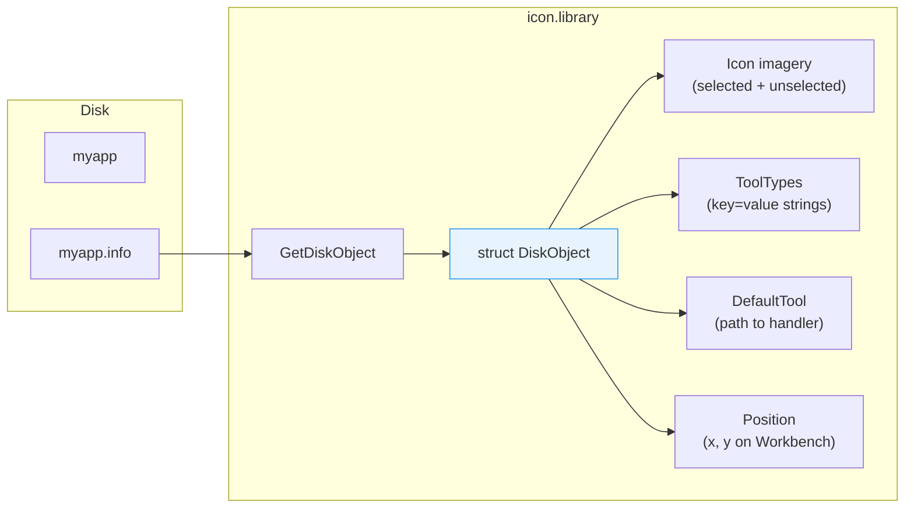

[← Home](../README.md) · [Libraries](README.md)

# icon.library — Workbench Icons (.info Files)

## Overview

Every Workbench-visible file has a companion `.info` file containing its icon imagery, tool types (key=value metadata), default tool, stack size, and position. `icon.library` provides reading, writing, and manipulating these structures.

The `.info` file format is binary, not text. icon.library handles all serialization.



---

## struct DiskObject

```c
/* workbench/workbench.h — NDK39 */
struct DiskObject {
    UWORD           do_Magic;      /* $E310 = WB_DISKMAGIC */
    UWORD           do_Version;    /* WB_DISKVERSION (1) */
    struct Gadget   do_Gadget;     /* the icon gadget (contains imagery) */
    UBYTE           do_Type;       /* icon type: WBDISK, WBTOOL, etc. */
    char           *do_DefaultTool; /* default tool path */
    char          **do_ToolTypes;   /* NULL-terminated string array */
    LONG            do_CurrentX;   /* icon X position on Workbench */
    LONG            do_CurrentY;   /* icon Y position */
    BPTR            do_DrawerData;  /* drawer window position (BPTR) */
    char           *do_ToolWindow;  /* tool window spec (CON: string) */
    LONG            do_StackSize;   /* stack size for tool launch */
};
```

---

## Icon Types

| Constant | Value | Description | Workbench Behavior |
|---|---|---|---|
| `WBDISK` | 1 | Disk/volume icon | Opens drawer showing disk contents |
| `WBDRAWER` | 2 | Drawer (directory) | Opens drawer window |
| `WBTOOL` | 3 | Executable tool | Launches the program |
| `WBPROJECT` | 4 | Project (document) | Launches `do_DefaultTool` with this file as argument |
| `WBGARBAGE` | 5 | Trashcan | Special drawer for deleted files |
| `WBDEVICE` | 6 | Device | Shown in Workbench root |
| `WBKICK` | 7 | Kickstart disk | ROM update disk |
| `WBAPPICON` | 8 | AppIcon (OS 2.0+) | Application-registered dynamic icon |

---

## Reading Icons

```c
struct Library *IconBase = OpenLibrary("icon.library", 0);

/* Load a DiskObject from disk: */
struct DiskObject *dobj = GetDiskObject("SYS:Utilities/MultiView");
if (dobj)
{
    Printf("Type: %ld\n", dobj->do_Type);
    Printf("Default tool: %s\n", dobj->do_DefaultTool ?
           dobj->do_DefaultTool : "(none)");
    Printf("Stack: %ld bytes\n", dobj->do_StackSize);

    FreeDiskObject(dobj);
}

/* Get the default icon for a file type: */
struct DiskObject *defIcon = GetDefDiskObject(WBPROJECT);
/* ... use defIcon ... */
FreeDiskObject(defIcon);
```

---

## ToolTypes — Key/Value Metadata

ToolTypes are the Amiga's equivalent of application-specific metadata. They're stored as a NULL-terminated array of strings in the `.info` file.

```c
/* Example .info file ToolTypes:
   PUBSCREEN=Workbench
   NOBLITTER=YES
   DONOTWAIT
   CX_PRIORITY=0
   (DISABLED_OPTION)
*/

struct DiskObject *dobj = GetDiskObject("myapp");
if (dobj)
{
    /* Find a specific ToolType: */
    char *screen = FindToolType(dobj->do_ToolTypes, "PUBSCREEN");
    if (screen)
        Printf("Public screen: %s\n", screen);  /* "Workbench" */

    /* Check if a ToolType exists (no value): */
    if (FindToolType(dobj->do_ToolTypes, "DONOTWAIT"))
        Printf("DONOTWAIT is set\n");

    /* Check for a specific value within a multi-value ToolType: */
    char *flags = FindToolType(dobj->do_ToolTypes, "FLAGS");
    if (MatchToolValue(flags, "DEBUG"))
        Printf("Debug mode enabled\n");

    /* Enumerate all ToolTypes: */
    char **tt = dobj->do_ToolTypes;
    while (*tt)
    {
        Printf("  ToolType: %s\n", *tt);
        tt++;
    }

    FreeDiskObject(dobj);
}
```

### ToolType Conventions

| Convention | Meaning | Example |
|---|---|---|
| `KEY=VALUE` | Named setting with value | `PUBSCREEN=Workbench` |
| `KEY` (no value) | Boolean flag — presence = true | `DONOTWAIT` |
| `(KEY)` | Disabled/commented out | `(CX_POPUP=NO)` |
| `KEY=val1|val2` | Multi-value (check with `MatchToolValue`) | `FLAGS=DEBUG|VERBOSE` |

---

## Writing / Modifying Icons

```c
/* Write a DiskObject to disk: */
PutDiskObject("myfile", dobj);

/* Create a new icon programmatically: */
struct DiskObject *newIcon = GetDefDiskObject(WBPROJECT);
newIcon->do_DefaultTool = "SYS:Utilities/MultiView";
newIcon->do_StackSize = 8192;

char *toolTypes[] = {
    "PUBSCREEN=Workbench",
    "DONOTWAIT",
    NULL
};
newIcon->do_ToolTypes = toolTypes;

PutDiskObject("myfile", newIcon);
FreeDiskObject(newIcon);
```

---

## OS 3.5+ New-Style Icons

AmigaOS 3.5 introduced **true-color icons** (PNG-based) alongside the legacy planar format. The `icon.library` v46+ handles both transparently — `GetDiskObject` returns the best available format.

| Feature | Legacy (OS 1.x–3.1) | New-Style (OS 3.5+) |
|---|---|---|
| Format | Planar bitplane imagery | PNG/true-color embedded |
| Colors | 4–16 (Workbench palette) | 24-bit true color |
| Size | Fixed (standard sizes) | Scalable |
| Transparency | 1-bit mask | 8-bit alpha channel |
| Storage | `do_Gadget.GadgetRender` | Extended chunks in `.info` |

---

## References

- NDK39: `workbench/workbench.h`, `workbench/icon.h`
- ADCD 2.1: icon.library autodocs
- See also: [workbench.md](workbench.md) — Workbench integration (AppIcon, AppWindow)
