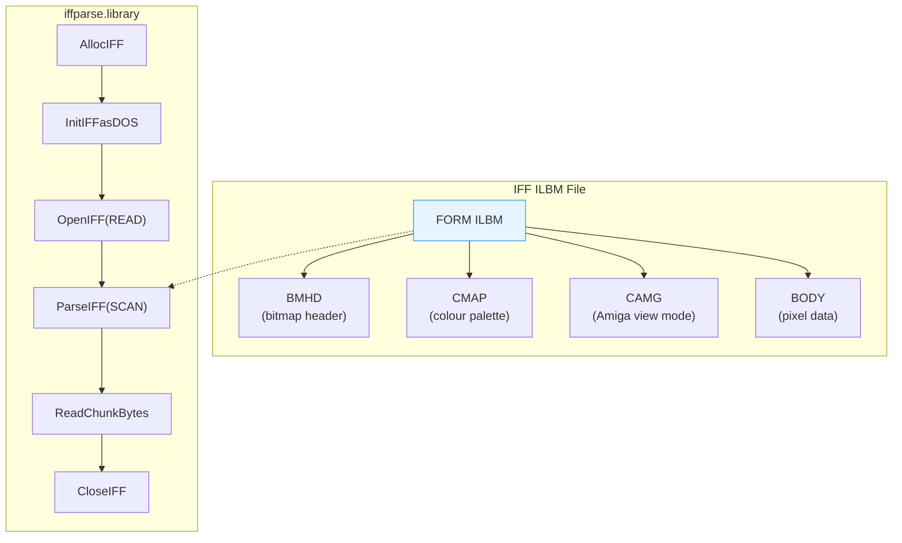

[← Home](../README.md) · [Libraries](README.md)

# iffparse.library — IFF File Parsing

## Overview

IFF (Interchange File Format) is EA/Commodore's universal container format used throughout the Amiga ecosystem. `iffparse.library` provides stream-oriented parsing and writing of IFF files, handling the nested chunk structure, byte ordering, and padding automatically.

Common IFF types:
- **ILBM** — Interleaved Bitmap (images)
- **8SVX** — 8-bit sampled voice (audio)
- **ANIM** — Animation sequences
- **FTXT** — Formatted text



---

## IFF Structure

All IFF files follow a nested chunk structure. Everything is **big-endian** (network byte order):

```
FORM <size:LONG> <type:4 chars>
    <chunk_id:4 chars> <size:LONG> <data...> [pad byte if odd size]
    <chunk_id:4 chars> <size:LONG> <data...> [pad byte]
    ...

Nested FORMs:
    LIST <size> <type>
        FORM <size> <type>
            ...
        FORM <size> <type>
            ...
```

| Container | Purpose |
|---|---|
| `FORM` | A single structured data object |
| `LIST` | Ordered collection of FORMs |
| `CAT ` | Unordered concatenation of FORMs |
| `PROP` | Default property block (within LIST) |

---

## Reading an IFF File

```c
struct Library *IFFParseBase = OpenLibrary("iffparse.library", 0);
struct IFFHandle *iff = AllocIFF();

/* Open from AmigaDOS file: */
iff->iff_Stream = (ULONG)Open("image.iff", MODE_OLDFILE);
if (!iff->iff_Stream) { /* error */ }

InitIFFasDOS(iff);  /* use DOS Read/Write/Seek hooks */

if (OpenIFF(iff, IFFF_READ)) { /* error */ }

/* Register chunks we want to stop at: */
StopChunk(iff, ID_ILBM, ID_BMHD);
StopChunk(iff, ID_ILBM, ID_CMAP);
StopChunk(iff, ID_ILBM, ID_CAMG);
StopChunk(iff, ID_ILBM, ID_BODY);

/* Parse — stops at each registered chunk: */
LONG error;
while ((error = ParseIFF(iff, IFFPARSE_SCAN)) == 0)
{
    struct ContextNode *cn = CurrentChunk(iff);

    switch (cn->cn_ID)
    {
        case ID_BMHD:
        {
            struct BitMapHeader bmhd;
            ReadChunkBytes(iff, &bmhd, sizeof(bmhd));
            Printf("Image: %ldx%ld, %ld planes\n",
                   bmhd.bmh_Width, bmhd.bmh_Height, bmhd.bmh_Depth);
            break;
        }
        case ID_CMAP:
        {
            UBYTE palette[256 * 3];
            LONG palSize = ReadChunkBytes(iff, palette, cn->cn_Size);
            LONG numColours = palSize / 3;
            Printf("Palette: %ld colours\n", numColours);
            break;
        }
        case ID_CAMG:
        {
            ULONG viewMode;
            ReadChunkBytes(iff, &viewMode, 4);
            if (viewMode & HAM) Printf("HAM mode\n");
            break;
        }
        case ID_BODY:
        {
            /* Read pixel data (may be compressed) */
            UBYTE *bodyData = AllocMem(cn->cn_Size, MEMF_ANY);
            ReadChunkBytes(iff, bodyData, cn->cn_Size);
            /* ... decompress if bmhd.bmh_Compression == 1 (ByteRun1) ... */
            FreeMem(bodyData, cn->cn_Size);
            break;
        }
    }
}

CloseIFF(iff);
Close((BPTR)iff->iff_Stream);
FreeIFF(iff);
```

---

## Writing an IFF File

```c
struct IFFHandle *iff = AllocIFF();
iff->iff_Stream = (ULONG)Open("output.iff", MODE_NEWFILE);
InitIFFasDOS(iff);
OpenIFF(iff, IFFF_WRITE);

/* Start the FORM: */
PushChunk(iff, ID_ILBM, ID_FORM, IFFSIZE_UNKNOWN);

/* Write BMHD chunk: */
PushChunk(iff, 0, ID_BMHD, sizeof(struct BitMapHeader));
WriteChunkBytes(iff, &bmhd, sizeof(bmhd));
PopChunk(iff);

/* Write CMAP chunk: */
PushChunk(iff, 0, ID_CMAP, numColours * 3);
WriteChunkBytes(iff, palette, numColours * 3);
PopChunk(iff);

/* Write BODY chunk: */
PushChunk(iff, 0, ID_BODY, IFFSIZE_UNKNOWN);
WriteChunkBytes(iff, bodyData, bodySize);
PopChunk(iff);

/* Close the FORM: */
PopChunk(iff);

CloseIFF(iff);
Close((BPTR)iff->iff_Stream);
FreeIFF(iff);
```

---

## ILBM BitMapHeader

```c
struct BitMapHeader {
    UWORD bmh_Width;        /* image width in pixels */
    UWORD bmh_Height;       /* image height in pixels */
    WORD  bmh_Left;         /* x offset (usually 0) */
    WORD  bmh_Top;          /* y offset (usually 0) */
    UBYTE bmh_Depth;        /* number of bitplanes */
    UBYTE bmh_Masking;      /* 0=none, 1=hasMask, 2=hasTransparentColor */
    UBYTE bmh_Compression;  /* 0=none, 1=ByteRun1 */
    UBYTE bmh_Pad;
    UWORD bmh_Transparent;  /* transparent colour index */
    UBYTE bmh_XAspect;      /* pixel aspect ratio */
    UBYTE bmh_YAspect;
    WORD  bmh_PageWidth;    /* source page width */
    WORD  bmh_PageHeight;   /* source page height */
};
```

---

## ByteRun1 Compression

ILBM BODY data is typically compressed with **ByteRun1** (a simple RLE):

```
For each byte n:
  0..127:   copy next n+1 bytes literally
  -1..-127: repeat next byte (-n+1) times
  -128:     no-op (skip)
```

```c
/* Decompress ByteRun1: */
void DecompressByteRun1(UBYTE *src, UBYTE *dst, LONG dstSize)
{
    UBYTE *end = dst + dstSize;
    while (dst < end)
    {
        BYTE n = *src++;
        if (n >= 0)
        {
            LONG count = n + 1;
            memcpy(dst, src, count);
            src += count;
            dst += count;
        }
        else if (n != -128)
        {
            LONG count = -n + 1;
            memset(dst, *src++, count);
            dst += count;
        }
    }
}
```

---

## Common Chunk IDs

| FORM Type | Chunk | Size | Description |
|---|---|---|---|
| `ILBM` | `BMHD` | 20 | Bitmap header (width, height, depth, compression) |
| `ILBM` | `CMAP` | n×3 | Colour map (R,G,B triples, 8-bit each) |
| `ILBM` | `CAMG` | 4 | Amiga display mode (ModeID for ViewPort) |
| `ILBM` | `BODY` | varies | Pixel data (interleaved bitplanes) |
| `ILBM` | `CRNG` | 8 | Colour cycling range (DPaint) |
| `ILBM` | `GRAB` | 4 | Hotspot (cursor/brush grab point) |
| `8SVX` | `VHDR` | 20 | Voice header (rate, volume, octaves) |
| `8SVX` | `BODY` | varies | Audio sample data (signed 8-bit) |
| `ANIM` | `ANHD` | 24 | Animation frame header |
| `ANIM` | `DLTA` | varies | Delta-compressed frame data |
| `FTXT` | `CHRS` | varies | Character string data |

---

## Using IFF with Clipboard

```c
/* Read from clipboard instead of file: */
struct IFFHandle *iff = AllocIFF();
struct ClipboardHandle *ch = OpenClipboard(PRIMARY_CLIP);
iff->iff_Stream = (ULONG)ch;
InitIFFasClip(iff);  /* use clipboard hooks instead of DOS */
OpenIFF(iff, IFFF_READ);
/* ... parse as normal ... */
CloseIFF(iff);
CloseClipboard(ch);
FreeIFF(iff);
```

---

## References

- NDK39: `libraries/iffparse.h`, `datatypes/pictureclass.h`
- EA IFF-85 specification: the original format definition
- ADCD 2.1: iffparse.library autodocs
- See also: [ham_ehb_modes.md](../08_graphics/ham_ehb_modes.md) — HAM-encoded ILBM files
