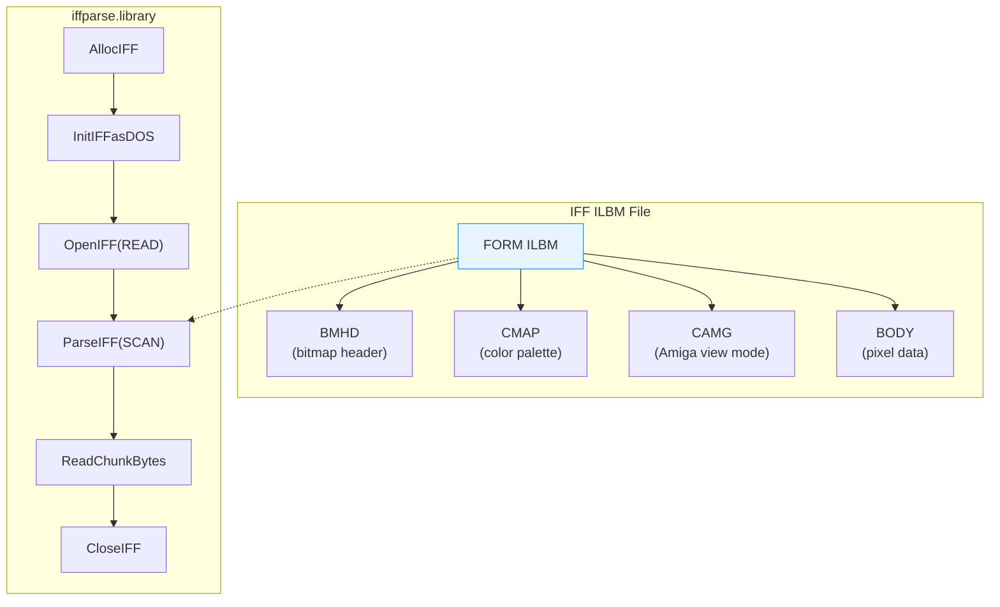
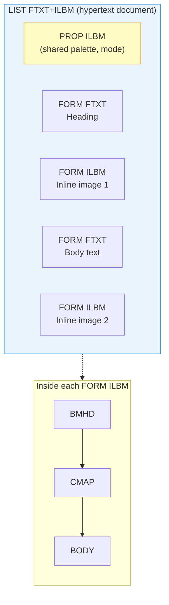
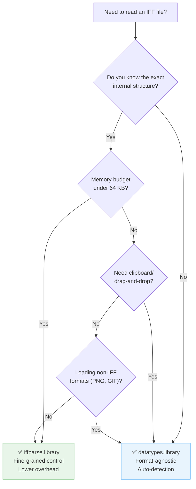

[← Home](../README.md) · [Libraries](README.md)

# iffparse.library — IFF File Parsing

## Overview

IFF (Interchange File Format) is EA/Commodore's universal container format used throughout the Amiga ecosystem. `iffparse.library` provides stream-oriented parsing and writing of IFF files, handling the nested chunk structure, byte ordering, and padding automatically.

Common IFF types:
- **ILBM** — Interleaved Bitmap (images)
- **8SVX** — 8-bit sampled voice (audio)
- **ANIM** — Animation sequences
- **FTXT** — Formatted text



---

## IFF Structure

All IFF files follow a nested chunk structure. Everything is **big-endian** (network byte order):

```
FORM <size:LONG> <type:4 chars>
    <chunk_id:4 chars> <size:LONG> <data...> [pad byte if odd size]
    <chunk_id:4 chars> <size:LONG> <data...> [pad byte]
    ...

Nested FORMs:
    LIST <size> <type>
        FORM <size> <type>
            ...
        FORM <size> <type>
            ...
```

| Container | Purpose |
|---|---|
| `FORM` | A single structured data object |
| `LIST` | Ordered collection of FORMs |
| `CAT ` | Unordered concatenation of FORMs |
| `PROP` | Default property block (within LIST) |

### Chunk Wire Format

Every IFF chunk begins with an 8-byte header — a 4-character ASCII ID followed by a 4-byte big-endian size:

```
┌───────────────────────────────────────────────────────┐
│               IFF Chunk Header (8 bytes)              │
├──────────┬──────────┬──────────┬──────────┬───────────┤
│ Offset   │ +$00     │ +$01     │ +$02     │ +$03      │
├──────────┼──────────┴──────────┴──────────┴───────────┤
│ ID       │ 4-char ASCII FOURCC (e.g. 'B' 'M' 'H' 'D') │
│          │ → ID_BMHD = 0x424D4844                     │
├──────────┼──────────┬──────────┬──────────┬───────────┤
│ Offset   │ +$04     │ +$05     │ +$06     │ +$07      │
├──────────┼──────────┴──────────┴──────────┴───────────┤
│ Size     │ 32-bit BIG-ENDIAN unsigned LONG            │
│          │ (data bytes ONLY, excludes header & pad)   │
└──────────┴────────────────────────────────────────────┘

                ┌── Data bytes (0..Size-1) ──┐
                │                            │
                │ [pad byte if Size is odd]  │
                └────────────────────────────┘
```

```c
/* The raw chunk header — 8 bytes on disk */
struct IFFChunkHeader {
    ULONG ck_ID;   /* 4-char FOURCC, e.g. 'BMHD' = 0x424D4844 */
    LONG  ck_Size; /* data length in bytes, BIG-ENDIAN */
};
```

| Field | Bytes | Type | Description |
|---|---|---|---|
| `ck_ID` | 0–3 | `ULONG` (big-endian) | FOURCC identifier. `0x424D4844` = `'B'<<24 \| 'M'<<16 \| 'H'<<8 \| 'D'` = "BMHD" |
| `ck_Size` | 4–7 | `LONG` (big-endian) | Number of data bytes following the header. **Does not include** the 8-byte header or the optional pad byte. May be 0 for empty chunks |

**Pad byte rule**: If `ck_Size` is odd, a single zero-pad byte follows the data to restore even alignment. The pad byte is **not counted** in `ck_Size`. This ensures the next chunk header always starts at an even offset from the file beginning.

### Container Headers — FORM, LIST, CAT

Container chunks (FORM, LIST, CAT) have a **12-byte header** — the standard 8-byte chunk header plus a 4-byte form type:

```
┌──────────────────────────────────────────────────────────────────┐
│           Container Chunk Header (12 bytes minimum)              │
├──────────┬──────────┬──────────┬──────────┬──────────────────────┤
│ Offset   │ +$00–$03 │ +$04–$07 │ +$08–$0B │ +$0C...              │
├──────────┼──────────┼──────────┼──────────┼──────────────────────┤
│ Field    │ ck_ID    │ ck_Size  │ FormType │ Sub-chunks...        │
│          │ "FORM"   │ (includes│ "ILBM"   │                      │
│          │ "LIST"   │  FormType│ "FTXT"   │                      │
│          │ "CAT "   │ + subs)  │ "PBM "   │                      │
└──────────┴──────────┴──────────┴──────────┴──────────────────────┘
```

> [!NOTE]
> **Critical detail**: `ck_Size` in a container header **includes the 4-byte FormType plus all nested sub-chunks**. For example, a FORM ILBM with BMHD (20 bytes) + CMAP (48 bytes) + BODY (32,000 bytes) has `ck_Size = 4 + 20 + 48 + 32000 = 32072`. The 4-byte FormType is part of the counted size.

### Computing Offsets — Walking a File Manually

When reading an IFF file without iffparse.library, you walk chunks by reading the header and advancing:

```
next_chunk_offset = current_offset + 8 + ck_Size + (ck_Size & 1)
                     │              │      │         │
                     │              │      │         └─ pad byte if odd
                     │              │      └─────────── data bytes
                     │              └────────────────── chunk header (8 bytes)
                     └───────────────────────────────── where we are now
```

```c
/* Manual IFF chunk walker — for reading without iffparse.library */
LONG WalkIFFChunks(BPTR fh)
{
    LONG offset = 0;
    struct IFFChunkHeader hdr;

    while (Read(fh, &hdr, sizeof(hdr)) == sizeof(hdr))
    {
        Printf("Offset $%08lx: chunk '%c%c%c%c', size=%ld\n",
               offset,
               (char)(hdr.ck_ID >> 24), (char)(hdr.ck_ID >> 16),
               (char)(hdr.ck_ID >> 8),  (char)(hdr.ck_ID),
               hdr.ck_Size);

        if (hdr.ck_ID == ID_FORM || hdr.ck_ID == ID_LIST ||
            hdr.ck_ID == ID_CAT)
        {
            /* Read the 4-char FormType after the header */
            ULONG formType;
            Read(fh, &formType, 4);
            Printf("  → Container type: '%c%c%c%c'\n",
                   (char)(formType >> 24), (char)(formType >> 16),
                   (char)(formType >> 8),  (char)(formType));
            /* formType is included in ck_Size — adjust remaining data */
            LONG dataAfterType = hdr.ck_Size - 4;
            /* Skip the nested contents */
            Seek(fh, dataAfterType, OFFSET_CURRENT);
            offset += 8 + 4 + dataAfterType;
        }
        else
        {
            /* Regular chunk — skip its data + optional pad */
            Seek(fh, hdr.ck_Size, OFFSET_CURRENT);
            offset += 8 + hdr.ck_Size;
        }

        /* Skip pad byte if data was odd-sized */
        if (hdr.ck_Size & 1)
        {
            Seek(fh, 1, OFFSET_CURRENT);
            offset += 1;
        }

        offset += 8;  /* header already read, accounted in next loop */
    }
    return offset;  /* total file size walked */
}
```

### Identifying Content Types

To determine what kind of data an IFF file contains, read the **top-level FormType** (the 4 bytes following the `FORM` header):

| Top-Level Signature | Content Type | Sub-chunks to Expect |
|---|---|---|
| `FORM .... ILBM` | Interleaved Bitmap image | `BMHD`, `CMAP`, `CAMG`(opt), `BODY`, `CRNG`(opt) |
| `FORM .... 8SVX` | 8-bit Sampled Voice (audio) | `VHDR`, `BODY`, `CHAN`(opt), `NAME`(opt) |
| `FORM .... ANIM` | Animation (ILBM frames with timing) | `ANHD`, sub-`FORM ILBM` frames, `DLTA`(opt) |
| `FORM .... FTXT` | Formatted Text | `CHRS` — character data with style markers |
| `FORM .... SMUS` | Simple Musical Score | `SHDR`, `TRAK` — tracker-style music data |
| `FORM .... PBM ` | Planar BitMap (non-interleaved ILBM) | Same chunks as ILBM, but BODY is plane-contiguous |
| `FORM .... AIFF` | Audio Interchange File Format | `COMM`, `SSND`, `MARK`(opt), `INST`(opt) |
| `LIST .... FTXT` | AmigaGuide hypertext document | `PROP ILBM`, nested `FORM FTXT` + `FORM ILBM` |
| `CAT  .... ILBM` | Concatenated bitmap collection | Multiple `FORM ILBM` sub-chunks (sprite sheet) |

> [!NOTE]
> The spaces after `CAT ` and `PBM ` are intentional — FOURCCs are always exactly 4 characters. `CAT ` = `0x43415420`, `PBM ` = `0x50424D20`.

**Quick identification in a hex editor**:
```
Offset  00 01 02 03 04 05 06 07  08 09 0A 0B 0C 0D 0E 0F   ASCII
------  -------------------------------------------------   -----
$0000   46 4F 52 4D 00 00 7D 18  49 4C 42 4D 42 4D 48 44  FORM..}.ILBMBMHD
        └─"FORM"──┘ └─size──┘  └─"ILBM"─┘ └─"BMHD"──────┘
        ck_ID       ck_Size    FormType    first sub-chunk
                     = 32024 bytes total   starts here
```

### FTXT — Formatted Text

Unlike raw ASCII where every character is a single byte of glyph data, FTXT encodes **styled text** with inline formatting commands. The `CHRS` chunk contains a stream of characters interspersed with control codes that change font, color, alignment, and spacing:

| FTXT Command | Code | Effect |
|---|---|---|
| `\n` | `$0A` | Line break (same as ASCII LF) |
| `\t` | `$09` | Tab (same as ASCII HT) |
| **SetFont** | `$80 nn` | Switch to font number `nn` (pre-loaded via `FONS` chunk) |
| **SetColor** | `$81 rr gg bb` | Set text color to 24-bit RGB |
| **SetJustification** | `$82 mm` | `0`=left, `1`=center, `2`=right, `3`=full justify |
| **SetLeftMargin** | `$83 wwww` | Set left margin in pixels (big-endian WORD) |
| **SetRightMargin** | `$84 wwww` | Set right margin in pixels |
| **Indent** | `$85 wwww` | Indent first line of paragraph |
| **SetLeading** | `$86 wwww` | Line spacing in pixels |
| **SetKerning** | `$87 nn` | `0`=off, `1`=on |
| **PageBreak** | `$8C` | Force new page |
| **CenterText** | `$8D` | Center current line |
| **SetTabs** | `$8E nn wwww...` | Define `nn` tab stops (list of big-endian WORDs) |

```c
/* A CHRS stream might look like this in memory: */
UBYTE chrs[] = {
    0x82, 0x01,              /* SetJustification → center */
    0x81, 0xFF, 0x00, 0x00,  /* SetColor → red */
    'H', 'e', 'a', 'd', 'i', 'n', 'g', 0x0A,
    0x81, 0x00, 0x00, 0x00,  /* SetColor → black */
    0x82, 0x00,              /* SetJustification → left */
    'B', 'o', 'd', 'y', ' ', 't', 'e', 'x', 't', '.', 0x0A
};
```

**How FTXT differs from raw ASCII:**
- Raw text is just bytes → glyphs. FTXT is a **serialized stream of layout instructions** that a renderer executes sequentially.
- Font changes are explicit (`SetFont nn`) — you can mix proportional and monospace fonts in the same document.
- Color is per-span, not per-character — `SetColor` applies to all subsequent text until the next `SetColor`.
- The `FONS` chunk (optional) pre-declares which fonts the document needs, so the renderer can load them before parsing `CHRS`.

FTXT is the text layer underlying **AmigaGuide** hypertext. An AmigaGuide file (`LIST FTXT+ILBM`) is a collection of FTXT pages (each a `FORM FTXT`) with inline image references (`FORM ILBM`), linked by `@{"linkname"}` cross-reference markers embedded in the character stream.

### ANIM — Animation Format

An IFF ANIM file is physically a **sequence of ILBM frames** packaged in a single FORM, with an animation header (`ANHD`) that describes timing and playback parameters:

```
FORM ANIM
├── ANHD        ← animation header (frame count, timing, mode)
├── FORM ILBM   ← frame 0 (full image — mandatory keyframe)
├── DLTA        ← frame 1 delta data (only changed pixels from frame 0)
├── DLTA        ← frame 2 delta data (only changed pixels from frame 1)
├── ...
└── FORM ILBM   ← optional refresh keyframe every N frames
```

| ANHD Field | Size | Description |
|---|---|---|
| `ah_Operation` | UBYTE | `0`=standard (DLTA are XOR deltas), `2`=long-delta mode (individual longword patches), `7`=set-delta (replace, not XOR) |
| `ah_Mask` | UBYTE | Interleaving mask bits (which planes the delta covers) |
| `ah_Width/ah_Height` | UWORD | Frame dimensions |
| `ah_Left/ah_Top` | WORD | Frame offset within display |
| `ah_AbsTime` | ULONG | Frame display time in **jiffies** (1/60s NTSC, 1/50s PAL) |
| `ah_RelTime` | ULONG | Inter-frame delay in jiffies |
| `ah_Interleave` | UBYTE | `0`=no interleaving, `1`=interleaved storage |
| `ah_Pad0/ah_Pad1` | UBYTE | Padding for alignment |
| `ah_Flags` | ULONG | `1`=interleaved, `2`=half-brite mode |

**How ANIM works physically:**

1. **Frame 0 is always a full ILBM** — it serves as the reference image and defines the palette (CMAP) for the entire animation.
2. **Subsequent frames are DLTA chunks** — they contain only the pixels that *changed* from the previous frame, encoded as (offset, data) pairs. This is essentially a binary diff format at the pixel level.
3. **DLTA data is XOR-applied** — the decoder reads the previous frame's pixel data, XORs the delta bytes on top, and produces the new frame. XOR means you can animate both directions (a pixel that was set can be cleared).
4. **Refresh frames** (full ILBMs) appear periodically to prevent accumulated delta errors and to allow seeking.

> [!WARNING]
> ANIM frames share a single palette (CMAP from frame 0). If your frames have different palettes, you cannot use IFF ANIM — use a custom multi-ILBM format or ANIM5/ANIM7 extensions (rare).

**Performance characteristics:** On a stock A500 (68000), ANIM playback can achieve ~6–10 FPS at 320×200×5 bitplanes using standard DLTA mode. Long-delta mode (`ah_Operation=2`) is faster on 68020+ because it copies aligned longwords rather than byte-by-byte XOR. The ANIM format was used by Deluxe Paint's "Anim" feature, SCALA multimedia presentations, and countless Amiga game cutscenes.

> See also: [animation.md](../08_graphics/animation.md) — the GEL system (BOBs, VSprites, AnimObs) for real-time sprite animation, which is a completely different mechanism from IFF ANIM file playback.

### 8SVX — 8-bit Sampled Voice

8SVX is the Amiga's native digital audio format — equivalent to what WAV became on Windows, but simpler and with chunk-based extensibility built in from the start.

```
FORM 8SVX
├── VHDR        ← voice header (sample rate, volume, compression)
├── NAME        ← optional sample name string
├── CHAN        ← optional panning/volume per channel
└── BODY        ← raw sample data (signed 8-bit PCM, or compressed)
```

| VHDR Field | Size | Description |
|---|---|---|
| `vh_OneShotHiSamples` | ULONG | Number of samples (big-endian) — hi word of 32-bit count |
| `vh_RepeatHiSamples` | ULONG | Repeat offset for looping instruments |
| `vh_SamplesPerCycle` | ULONG | Playback rate in **Hz** (e.g., 22050, 11025, 8363) |
| `vh_Octaves` | UWORD | Number of frequency octaves (usually 1) |
| `vh_Compression` | ULONG | `0`=signed 8-bit PCM, `1`=Fibonacci delta, `2`=Exponential delta |
| `vh_Volume` | ULONG | Playback volume (0–65535, linear scale) |

**8SVX vs WAV analogies:**

| Aspect | IFF 8SVX (1985) | RIFF WAV (1991) |
|---|---|---|
| **Container** | IFF FORM (big-endian) | RIFF chunk (little-endian) |
| **Sample data chunk** | `BODY` | `data` |
| **Header chunk** | `VHDR` (20 bytes, fixed layout) | `fmt ` (variable size, extensible) |
| **Sample format** | Signed 8-bit PCM only (in practice) | 8/16/24/32-bit, PCM or float |
| **Compression** | Fibonacci delta (lossy), Exponential delta (lossy) | μ-law, ADPCM, MP3 (in theory) |
| **Loop points** | `vh_RepeatHiSamples` + `vh_OneShotHiSamples` define a sustain loop | `smpl` chunk with loop points |
| **Multi-channel** | One sample per 8SVX; stereo = two 8SVX files | Multi-channel interleaved in single file |
| **Legacy** | Died with the Amiga; converted to WAV via SoX/ffmpeg | Still the universal PCM container |

> [!WARNING]
> 8SVX samples are **signed 8-bit** (range -128 to +127). If you read them as unsigned (0–255), every sample shifts by 128 — silence becomes a loud DC offset. This is the #1 cause of "8SVX sounds like static" bug reports.

**Fibonacci delta compression** (`vh_Compression=1`) encodes the difference between consecutive samples using Fibonacci-encoded values. It achieves ~4:1 compression on typical speech, but is lossy — repeated encode/decode cycles degrade quality. Most modern tools convert 8SVX to WAV on import rather than handling Fibonacci delta natively.

> See also: [audio.md](../10_devices/audio.md) — audio.device DMA channel programming for real-time sample playback on Paula.

### Nested Containers in Practice

An ILBM file is a single FORM, but IFF supports deep nesting for multi-object documents:



| Container | Use Case | iffparse Behavior |
|---|---|---|
| `FORM ILBM` | Single image | `StopChunk(iff, ID_ILBM, ID_BMHD)` stops at BMHD within this FORM only |
| `LIST FTXT+ILBM` | AmigaGuide article with inline images | `ParseIFF` descends into LIST, then into each FORM — context node stack tracks nesting |
| `CAT ILBM` | Sprite sheet (unrelated images concatenated) | Same API as LIST; `CurrentChunk()` returns the innermost context |

iffparse.library maintains an internal **context stack**. Each `PushChunk`/entry into a FORM pushes a new `ContextNode`, and each `PopChunk`/exit restores the parent. The `cn_Type` field tells you whether you're inside a FORM (`IFF_FORMTYPE`), LIST (`IFF_LISTTYPE`), or CAT (`IFF_CATTYPE`).

### IFF Design Philosophy

IFF was not designed as an image format — it was designed as a **universal data interchange container**. Jerry Morrison of Electronic Arts authored the "EA IFF 85" specification (January 14, 1985) with a single goal: files that could move between applications, operating systems, and even different computers without losing structure. Every IFF file self-describes its contents via FOURCC chunk IDs (4-character ASCII codes like `BMHD`, `CMAP`, `BODY`). An application that encounters an unknown chunk simply **skips it** by reading its size and advancing the file pointer — no error, no corruption, just graceful ignorance.

This "skip what you don't understand" contract is the single most important design decision in IFF. It means a file created by Deluxe Paint in 1986 with a custom `DPAN` chunk (DPaint animation settings) can be opened by a modern image viewer — the viewer skips `DPAN` and renders the image from `BMHD` + `CMAP` + `BODY`. This is exactly how DataTypes descriptors work a decade later, and it's the same philosophy behind PNG's ancillary chunks and XML namespaces.

### IFF vs Contemporary Formats (1984–1990)

| Format | Year | Platform | Type | Extensible? | Compression | Palette | Multi-Image | Byte Order |
|---|---|---|---|---|---|---|---|---|
| **IFF ILBM** | 1985 | Amiga | Nested container | ✅ Yes — unknown chunks skipped safely | ByteRun1 RLE (optional) | 1–256 colors (CMAP) | ✅ Yes (LIST, CAT) | Big-Endian |
| **MacPaint** | 1984 | Macintosh | Fixed bitmap | ❌ No — 576×720 only, no header version | None | 1-bit only | ❌ No | Big-Endian |
| **PCX** | 1984 | PC DOS (ZSoft) | Single image | ❌ No — fixed header layout | RLE (mandatory) | 1–256 colors (EGA/VGA) | ❌ No | Little-Endian |
| **BMP (DIB)** | 1985 | Windows 1.0 | Single image | ⚠️ Partial — later versions added header fields but no chunk skip | RLE (rarely used) | 1–256 colors (palette) | ❌ No | Little-Endian |
| **GIF 87a** | 1987 | CompuServe | Multi-image (non-animated) | ⚠️ Partial — extension blocks in GIF89a | LZW (mandatory) | 1–256 colors (global + local palette) | ✅ Yes (multiple images) | Little-Endian |
| **TIFF** | 1986 | Aldus (Mac/PC) | Tag-based container | ✅ Yes — IFD tags with skip rule | Multiple codecs (RLE, LZW, CCITT, JPEG later) | 1–24-bit (tag-defined) | ✅ Yes (multiple IFDs) | Both (magic: `II`/`MM`) |
| **IMG (GEM)** | 1985 | Atari ST (Digital Research) | Single image | ❌ No — rigid header | None (later versions: PackBits) | 1–16 colors | ❌ No | Big-Endian |

**Key takeaways from the era:**

1. **IFF was the only format that was a true container from day one.** BMP, PCX, and MacPaint were rigid: one file = one image with a fixed header. IFF could hold multiple FORMs in a LIST, nest metadata inside PROP chunks, and intermix text (FTXT) with images (ILBM) in the same file — essential for AmigaGuide hypertext.

2. **IFF and TIFF were the only extensible formats.** TIFF's tag-based approach (IFD entries with numeric tags) was more flexible than IFF's FOURCC chunks, but also more complex — a TIFF reader must parse the IFD chain before it can skip unknown tags. An IFF reader skips unknown chunks with zero metadata lookup. Both, however, shared the same core insight: **a format that can't grow is already dead.**

3. **PCX and GIF owned the PC world for different reasons.** PCX was dead-simple — a 128-byte header followed by RLE data — and every DOS paint program supported it. GIF owned online services (CompuServe) and the early web because LZW compression produced smaller files than RLE on synthetic graphics, and the 87a spec included multi-image support before any other format except IFF.

4. **BMP won by platform monopoly, not technical merit.** BMP (Device Independent Bitmap) was Windows' native image format. It had no compression in practice (RLE was specified but almost never used), no extensibility, and no multi-image support. It survived because every Windows application was forced to support it. IFF was technically superior in every dimension — but Microsoft's platform dominance made BMP the default, just as it made WAV (RIFF) the default over IFF 8SVX.

5. **Byte order was a religious war.** IFF and MacPaint used big-endian (Motorola 68000 native). PCX, BMP, and GIF used little-endian (Intel x86 native). TIFF supported both with a magic-number flag. IFF's big-endian choice was natural for the Amiga but created an eternal annoyance for cross-platform tools — reading an IFF file on a PC required byte-swapping every LONG and WORD.

---

## Reading an IFF File

```c
struct Library *IFFParseBase = OpenLibrary("iffparse.library", 0);
struct IFFHandle *iff = AllocIFF();

/* Open from AmigaDOS file: */
iff->iff_Stream = (ULONG)Open("image.iff", MODE_OLDFILE);
if (!iff->iff_Stream) { /* error */ }

InitIFFasDOS(iff);  /* use DOS Read/Write/Seek hooks */

if (OpenIFF(iff, IFFF_READ)) { /* error */ }

/* Register chunks we want to stop at: */
StopChunk(iff, ID_ILBM, ID_BMHD);
StopChunk(iff, ID_ILBM, ID_CMAP);
StopChunk(iff, ID_ILBM, ID_CAMG);
StopChunk(iff, ID_ILBM, ID_BODY);

/* Parse — stops at each registered chunk: */
LONG error;
while ((error = ParseIFF(iff, IFFPARSE_SCAN)) == 0)
{
    struct ContextNode *cn = CurrentChunk(iff);

    switch (cn->cn_ID)
    {
        case ID_BMHD:
        {
            struct BitMapHeader bmhd;
            ReadChunkBytes(iff, &bmhd, sizeof(bmhd));
            Printf("Image: %ldx%ld, %ld planes\n",
                   bmhd.bmh_Width, bmhd.bmh_Height, bmhd.bmh_Depth);
            break;
        }
        case ID_CMAP:
        {
            UBYTE palette[256 * 3];
            LONG palSize = ReadChunkBytes(iff, palette, cn->cn_Size);
            LONG numColors = palSize / 3;
            Printf("Palette: %ld colors\n", numColors);
            break;
        }
        case ID_CAMG:
        {
            ULONG viewMode;
            ReadChunkBytes(iff, &viewMode, 4);
            if (viewMode & HAM) Printf("HAM mode\n");
            break;
        }
        case ID_BODY:
        {
            /* Read pixel data (may be compressed) */
            UBYTE *bodyData = AllocMem(cn->cn_Size, MEMF_ANY);
            ReadChunkBytes(iff, bodyData, cn->cn_Size);
            /* ... decompress if bmhd.bmh_Compression == 1 (ByteRun1) ... */
            FreeMem(bodyData, cn->cn_Size);
            break;
        }
    }
}

CloseIFF(iff);
Close((BPTR)iff->iff_Stream);
FreeIFF(iff);
```

---

## Writing an IFF File

```c
struct IFFHandle *iff = AllocIFF();
iff->iff_Stream = (ULONG)Open("output.iff", MODE_NEWFILE);
InitIFFasDOS(iff);
OpenIFF(iff, IFFF_WRITE);

/* Start the FORM: */
PushChunk(iff, ID_ILBM, ID_FORM, IFFSIZE_UNKNOWN);

/* Write BMHD chunk: */
PushChunk(iff, 0, ID_BMHD, sizeof(struct BitMapHeader));
WriteChunkBytes(iff, &bmhd, sizeof(bmhd));
PopChunk(iff);

/* Write CMAP chunk: */
PushChunk(iff, 0, ID_CMAP, numColors * 3);
WriteChunkBytes(iff, palette, numColors * 3);
PopChunk(iff);

/* Write BODY chunk: */
PushChunk(iff, 0, ID_BODY, IFFSIZE_UNKNOWN);
WriteChunkBytes(iff, bodyData, bodySize);
PopChunk(iff);

/* Close the FORM: */
PopChunk(iff);

CloseIFF(iff);
Close((BPTR)iff->iff_Stream);
FreeIFF(iff);
```

---

## ILBM BitMapHeader

```c
struct BitMapHeader {
    UWORD bmh_Width;        /* image width in pixels */
    UWORD bmh_Height;       /* image height in pixels */
    WORD  bmh_Left;         /* x offset (usually 0) */
    WORD  bmh_Top;          /* y offset (usually 0) */
    UBYTE bmh_Depth;        /* number of bitplanes */
    UBYTE bmh_Masking;      /* 0=none, 1=hasMask, 2=hasTransparentColor */
    UBYTE bmh_Compression;  /* 0=none, 1=ByteRun1 */
    UBYTE bmh_Pad;
    UWORD bmh_Transparent;  /* transparent color index */
    UBYTE bmh_XAspect;      /* pixel aspect ratio */
    UBYTE bmh_YAspect;
    WORD  bmh_PageWidth;    /* source page width */
    WORD  bmh_PageHeight;   /* source page height */
};
```

---

## ByteRun1 Compression

ILBM BODY data is typically compressed with **ByteRun1** (a simple RLE):

```
For each byte n:
  0..127:   copy next n+1 bytes literally
  -1..-127: repeat next byte (-n+1) times
  -128:     no-op (skip)
```

```c
/* Decompress ByteRun1: */
void DecompressByteRun1(UBYTE *src, UBYTE *dst, LONG dstSize)
{
    UBYTE *end = dst + dstSize;
    while (dst < end)
    {
        BYTE n = *src++;
        if (n >= 0)
        {
            LONG count = n + 1;
            memcpy(dst, src, count);
            src += count;
            dst += count;
        }
        else if (n != -128)
        {
            LONG count = -n + 1;
            memset(dst, *src++, count);
            dst += count;
        }
    }
}
```

---

## Reading Planar Bitmap Data from BODY

After decompressing the BODY chunk, you have **interleaved bitplanes** — row 0 of plane 0, row 0 of plane 1, ..., row 0 of plane n, then row 1 of plane 0, ... This is the raw ILBM layout. To build a usable `BitMap` structure, you must deinterleave and convert to Amiga bitplane order.

### Deinterleaving the BODY

```c
/* Given a decompressed BODY buffer and a BMHD header,
 * fill a struct BitMap with per-plane pointers: */
struct BitMap *BuildBitMap(UBYTE *bodyData, struct BitMapHeader *bmhd)
{
    struct BitMap *bm = AllocMem(sizeof(struct BitMap), MEMF_CLEAR);
    ULONG widthBytes  = (bmhd->bmh_Width + 15) / 16 * 2;  /* word-aligned row width */
    ULONG planeSize   = widthBytes * bmhd->bmh_Height;
    UBYTE depth       = bmhd->bmh_Depth;

    InitBitMap(bm, depth, widthBytes * 8, bmhd->bmh_Height);

    /* Allocate each plane separately (Chip RAM if DMA needed): */
    for (UBYTE p = 0; p < depth; p++)
    {
        bm->Planes[p] = AllocMem(planeSize, MEMF_CHIP | MEMF_CLEAR);
        if (!bm->Planes[p]) { /* OOM — free prior planes */ }
    }

    /* Deinterleave: ILBM stores row-interleaved, Amiga wants per-plane contiguous */
    for (ULONG y = 0; y < bmhd->bmh_Height; y++)
    {
        for (UBYTE p = 0; p < depth; p++)
        {
            /* Source: p-th plane of this row in interleaved BODY */
            UBYTE *src = bodyData + (y * depth + p) * widthBytes;
            /* Dest: row y of plane p */
            UBYTE *dst = bm->Planes[p] + y * widthBytes;
            memcpy(dst, src, widthBytes);
        }
    }

    return bm;
}
```

> [!NOTE]
> The ILBM BODY interleaves by **(row × depth)**, not by depth-first. If you get the deinterleaving wrong, you'll see "striped" images where each group of depth rows came from the wrong plane.

### PBM (Planar BitMap) vs ILBM

| Aspect | ILBM (Interleaved) | PBM (Planar) |
|---|---|---|
| **Channel order** | Row 0 → all planes → Row 1 → all planes... | Plane 0 → all rows → Plane 1 → all rows... |
| **Faster for...** | Rendering one row at a time (line-by-line drawing) | Blitter copy (`BltBitMap`) — each plane is contiguous |
| **BODY layout** | Default ILBMalen format | `BODY` chunk identical, but "PBM " FORM type signals planar intent |
| **iffparse support** | Standard `ID_ILBM` + `ID_BMHD` + `ID_BODY` | Same parsing; `ID_PBM` chunk ID (`0x50424D20`) if present |

| FORM Type | Chunk | Size | Description |
|---|---|---|---|
| `ILBM` | `BMHD` | 20 | Bitmap header (width, height, depth, compression) |
| `ILBM` | `CMAP` | n×3 | Color map (R,G,B triples, 8-bit each) |
| `ILBM` | `CAMG` | 4 | Amiga display mode (ModeID for ViewPort) |
| `ILBM` | `BODY` | varies | Pixel data (interleaved bitplanes) |
| `ILBM` | `CRNG` | 8 | Color cycling range (DPaint) |
| `ILBM` | `GRAB` | 4 | Hotspot (cursor/brush grab point) |
| `8SVX` | `VHDR` | 20 | Voice header (rate, volume, octaves) |
| `8SVX` | `BODY` | varies | Audio sample data (signed 8-bit) |
| `ANIM` | `ANHD` | 24 | Animation frame header |
| `ANIM` | `DLTA` | varies | Delta-compressed frame data |
| `FTXT` | `CHRS` | varies | Character string data |

---

## Using IFF with Clipboard

```c
/* Read from clipboard instead of file: */
struct IFFHandle *iff = AllocIFF();
struct ClipboardHandle *ch = OpenClipboard(PRIMARY_CLIP);
iff->iff_Stream = (ULONG)ch;
InitIFFasClip(iff);  /* use clipboard hooks instead of DOS */
OpenIFF(iff, IFFF_READ);
/* ... parse as normal ... */
CloseIFF(iff);
CloseClipboard(ch);
FreeIFF(iff);
```

---

## When to Use IFFParse vs DataTypes

Both `iffparse.library` and the [DataTypes](datatypes.md) system can load IFF ILBM images, but they serve different needs:



| Criterion | iffparse.library | datatypes.library |
|---|---|---|
| **Parsing granularity** | Per-chunk — you decide what to read and when | Per-object — library reads everything |
| **Format support** | Any IFF file (ILBM, 8SVX, ANIM, FTXT, custom) | IFF + PNG, GIF, JPEG, WAV, AIFF (via subclass) |
| **Stream source** | DOS file, clipboard, memory (custom hook) | DOS file, clipboard |
| **Writing** | Full control via `PushChunk`/`PopChunk` | Not supported — DataTypes is read-only |
| **Memory overhead** | ~2 KB for IFFHandle + context stack | ~20–50 KB for BOOPSI object + decoded bitmap |
| **API complexity** | 10 functions, manual state management | 3 functions, Booleans for auto-everything |
| **Best for** | IFF-specific tools, crunchers, conversion utilities | Application file loading, thumbnails, format-agnostic viewers |

> [!NOTE]
> If you need to **write** files in any format, use iffparse.library. DataTypes cannot serialize objects back to disk — it's strictly a reader.

---

## Pitfalls & Common Mistakes

### 1. Forgetting the Odd-Byte Padding

Every chunk's data must be padded to an even byte boundary. When writing, iffparse handles this automatically. When reading raw bytes outside iffparse (manual parsing), you must account for the pad byte yourself:

```c
/* BAD: Hard-coding chunk position without pad accounting */
LONG chunkSize = ReadLong(fh);        /* e.g., 21 bytes */
Read(fh, buffer, chunkSize);          /* reads 21 bytes */
LONG nextChunkID = ReadLong(fh);      /* WRONG: if 21 is odd, this reads the pad byte as ID! */

/* CORRECT: Skip pad byte if chunk size is odd */
LONG chunkSize = ReadLong(fh);
Read(fh, buffer, chunkSize);
if (chunkSize & 1) Read(fh, &pad, 1);  /* consume pad byte */
LONG nextChunkID = ReadLong(fh);       /* now at correct position */
```

> [!WARNING]
> iffparse.library's `ReadChunkBytes` handles padding internally, but only if you use the library's own `InitIFFasDOS` hook. If you provide custom stream hooks, you are responsible for pad-byte alignment.

### 2. Reading Chunk Size as Little-Endian

The 68000 is **big-endian**. IFF sizes are also big-endian (network byte order). If you cast chunk bytes to a LONG without byte-swapping on a little-endian system (cross-compiled test harness, PC-hosted IFF validator), you'll read garbage:

```c
/* DANGEROUS on x86 test rigs: */
LONG size = *(LONG *)chunkHeader;  /* bytes are 00 00 00 14 → x86 reads 0x14000000! */

/* SAFE: always use explicit big-endian parse */
LONG size = (chunk[0] << 24) | (chunk[1] << 16) | (chunk[2] << 8) | chunk[3];
```

### 3. Missing StopChunk Registration

If you don't call `StopChunk()` for a chunk type, `ParseIFF(IFFPARSE_SCAN)` skips right over it. This is by design, but it's a common surprise:

```c
/* Only BMHD and BODY are registered — CMAP is silently skipped! */
StopChunk(iff, ID_ILBM, ID_BMHD);
StopChunk(iff, ID_ILBM, ID_BODY);
/* Missing: StopChunk(iff, ID_ILBM, ID_CMAP); */

while (ParseIFF(iff, IFFPARSE_SCAN) == 0) {
    /* Will see BMHD → BODY, never CMAP */
}
```

### 4. Closing the DOS Filehandle Before CloseIFF

`CloseIFF` may need to seek or read trailer data. If you close the underlying file handle first, `CloseIFF` operates on a stale/garbage `iff_Stream`:

```c
/* BAD: Stream closed before library */
Close((BPTR)iff->iff_Stream);  /* gone! */
CloseIFF(iff);                  /* operates on freed handle → undefined behavior */

/* CORRECT: Library first, then stream */
CloseIFF(iff);
Close((BPTR)iff->iff_Stream);
FreeIFF(iff);
```

### 5. EHB / Extra-HalfBrite Pitfall

EHB mode uses 64 colors where the upper 32 are half-brightness versions of the lower 32. If `CAMG` indicates EHB (`$80`), the CMAP chunk still has only 64 entries — but `bmh_Depth` is 6, not 5. Relying on `bmh_Depth` to calculate palette size will give wrong results:

```c
/* BAD: bmh_Depth==6 for EHB suggests 2^6=64 colors, but only 64 are stored */
LONG expectedColors = 1 << bmh_Depth;   /* 64 — correct by coincidence */

/* CORRECT: CMAP chunk size determines real color count */
LONG numColors = cn->cn_Size / 3;        /* always accurate */

/* Extra check: EHB flag in CAMG */
if (viewMode & EXTRA_HALFBRITE)
    Printf("EHB mode: 32 base colors + 32 half-bright variants\n");
```

---

## Named Antipatterns

### 6. "The Blind Write": Forgetting IFFSIZE_UNKNOWN

When writing an IFF file where the body size isn't known until after encoding, you must use `IFFSIZE_UNKNOWN`. Pushing with a hard-coded size that turns out wrong produces a corrupt file:

```c
/* BAD: Guessing size before encoding */
PushChunk(iff, 0, ID_BODY, 32000);  /* hope this is enough */
WriteChunkBytes(iff, data, actualSize);  /* actualSize might be 48000! */
/* iffparse writes only min(32000, actualSize) — data loss */

/* CORRECT: Let iffparse handle unknown sizes */
PushChunk(iff, 0, ID_BODY, IFFSIZE_UNKNOWN);
WriteChunkBytes(iff, data, actualSize);
PopChunk(iff);  /* iffparse seeks back and patches the correct size */
```

### 7. "The Leaky Parser": Skipping FreeIFF

`AllocIFF` allocates an `IFFHandle` plus internal buffers. Forgetting to call `FreeIFF` leaks memory even if the file was closed. This is particularly insidious in image batch converters:

```c
/* BAD: Loop that leaks an IFFHandle per iteration */
for (int i = 0; i < numFiles; i++) {
    struct IFFHandle *iff = AllocIFF();
    /* ... parse one file ... */
    CloseIFF(iff);
    Close((BPTR)iff->iff_Stream);
    /* Missing FreeIFF(iff) — leaks ~2 KB per file! */
}

/* CORRECT: Always free the handle */
for (int i = 0; i < numFiles; i++) {
    struct IFFHandle *iff = AllocIFF();
    /* ... parse ... */
    CloseIFF(iff);
    Close((BPTR)iff->iff_Stream);
    FreeIFF(iff);  /* return handle to system */
}
```

### 8. "The Chunk Swallower": Reading More Than cn_Size

`ReadChunkBytes` returns the actual number of bytes read, which may be less than requested if you asked for more than the chunk contains. The `ContextNode->cn_Size` is authoritative:

```c
/* BAD: Blind ReadChunkBytes for fixed-size struct without checking */
struct BitMapHeader bmhd;
ReadChunkBytes(iff, &bmhd, sizeof(bmhd));  /* what if chunk is smaller? */

/* CORRECT: Respect cn_Size */
struct BitMapHeader bmhd;
LONG toRead = min(cn->cn_Size, sizeof(bmhd));
LONG actuallyRead = ReadChunkBytes(iff, &bmhd, toRead);
if (actuallyRead < toRead)
    Printf("Warning: truncated BMHD chunk\n");
```

---

## FAQ

**Q: Can I parse two IFF files concurrently?**

Yes. Each `AllocIFF()` returns an independent `IFFHandle`. You can interleave `ParseIFF` calls on two handles without interference — useful for comparing or merging IFF files.

**Q: What happens if I don't register StopChunk for BODY?**

`ParseIFF` skips the pixel data entirely and proceeds to the next chunk (or end of FORM). This is actually useful for extracting only metadata (BMHD, CMAP) from large images without allocating memory for the BODY.

**Q: Can I use iffparse to validate an IFF file structure?**

Yes. Run `ParseIFF(iff, IFFPARSE_SCAN)` until it returns `IFFERR_EOC` (end of context). If it returns any other error before that, the file is malformed. Use `IFFPARSE_STEP` instead of `IFFPARSE_SCAN` to walk one level at a time for detailed error reporting.

**Q: Does iffparse handle AmigaGuide files?**

Yes — AmigaGuide `.guide` files are IFF `FORM FTXT+ILBM` under the hood. `iffparse.library` can parse them at the chunk level, but [amigaguide.library](amigaguide.md) provides a higher-level API for displaying and navigating AmigaGuide documents.

**Q: Why does my 8SVX file sound like static after parsing with iffparse?**

8SVX samples are **signed 8-bit** PCM. If you treat them as unsigned (common on PC sound APIs), the zero-crossing shifts polarity. The `VHDR` chunk's `vh_Compression` field tells you the encoding: 0 = signed 8-bit PCM, 1 = Fibonacci delta, 2 = Exponential delta.

---

## Use-Case Cookbook

### 1. Metadata Extractor — Read Only BMHD and CMAP

For thumbnail generation or file cataloging, skip the BODY entirely:

```c
struct IFFHandle *iff = AllocIFF();
iff->iff_Stream = (ULONG)Open(file, MODE_OLDFILE);
InitIFFasDOS(iff);
OpenIFF(iff, IFFF_READ);

/* Register only metadata chunks — BODY is skipped automatically */
StopChunk(iff, ID_ILBM, ID_BMHD);
StopChunk(iff, ID_ILBM, ID_CMAP);

LONG error;
while ((error = ParseIFF(iff, IFFPARSE_SCAN)) == 0)
{
    struct ContextNode *cn = CurrentChunk(iff);
    if (cn->cn_ID == ID_BMHD) {
        ReadChunkBytes(iff, &meta.bmhd, sizeof(meta.bmhd));
    } else if (cn->cn_ID == ID_CMAP) {
        meta.palSize = ReadChunkBytes(iff, meta.palette, cn->cn_Size);
    }
}

CloseIFF(iff); Close((BPTR)iff->iff_Stream); FreeIFF(iff);
```

### 2. Batch IFF-to-Raw Converter

```c
void ConvertILBMtoRaw(STRPTR input, STRPTR output)
{
    struct IFFHandle *iff = AllocIFF();
    iff->iff_Stream = (ULONG)Open(input, MODE_OLDFILE);
    InitIFFasDOS(iff); OpenIFF(iff, IFFF_READ);

    StopChunk(iff, ID_ILBM, ID_BMHD);
    StopChunk(iff, ID_ILBM, ID_BODY);

    struct BitMapHeader bmhd;
    UBYTE *bodyData = NULL;

    while (ParseIFF(iff, IFFPARSE_SCAN) == 0)
    {
        struct ContextNode *cn = CurrentChunk(iff);
        if (cn->cn_ID == ID_BMHD)
            ReadChunkBytes(iff, &bmhd, sizeof(bmhd));
        else if (cn->cn_ID == ID_BODY)
        {
            bodyData = AllocMem(cn->cn_Size, MEMF_ANY);
            ReadChunkBytes(iff, bodyData, cn->cn_Size);

            /* Decompress if needed */
            if (bmhd.bmh_Compression == 1)
            {
                ULONG rawSize = ((bmhd.bmh_Width + 15) / 16 * 2)
                              * bmhd.bmh_Height * bmhd.bmh_Depth;
                UBYTE *raw = AllocMem(rawSize, MEMF_ANY);
                DecompressByteRun1(bodyData, raw, rawSize);
                FreeMem(bodyData, cn->cn_Size);
                bodyData = raw;
            }
        }
    }

    /* Write raw planar data to output file */
    if (bodyData)
    {
        BPTR fh = Open(output, MODE_NEWFILE);
        ULONG bodySize = ((bmhd.bmh_Width + 15) / 16 * 2)
                        * bmhd.bmh_Height * bmhd.bmh_Depth;
        Write(fh, bodyData, bodySize);
        Close(fh);
        FreeMem(bodyData, bodySize);
    }

    CloseIFF(iff); Close((BPTR)iff->iff_Stream); FreeIFF(iff);
}
```

### 3. Building a Composite IFF (Sprite Sheet from Multiple ILBMs)

```c
/* Create a CAT ILBM containing multiple sub-images: */
struct IFFHandle *iff = AllocIFF();
iff->iff_Stream = (ULONG)Open("sprites.iff", MODE_NEWFILE);
InitIFFasDOS(iff);
OpenIFF(iff, IFFF_WRITE);

PushChunk(iff, ID_ILBM, ID_CAT, IFFSIZE_UNKNOWN);

for (int i = 0; i < numFrames; i++)
{
    /* Each frame is a FORM ILBM */
    PushChunk(iff, ID_ILBM, ID_FORM, IFFSIZE_UNKNOWN);
    /* Write BMHD, CMAP, BODY for this frame... */
    PopChunk(iff);  /* close this FORM */
}

PopChunk(iff);  /* close the CAT */
CloseIFF(iff); Close((BPTR)iff->iff_Stream); FreeIFF(iff);
```

---

## IFF as a Container — Comparison Across Eras

IFF was not just another image format — it was a **general-purpose binary container** for any kind of structured data. The FOURCC + size + data + pad pattern is a design template that recurred in dozens of later formats. This section compares IFF against both historical contemporaries and modern containers on container-design dimensions.

### Container Feature Matrix

| Dimension | IFF (1985) | RIFF (1991) | TIFF (1986) | PNG (1996) | ISOBMFF / MP4 (2001) | Matroska / EBML (2002) | ZIP (1989) |
|---|---|---|---|---|---|---|---|
| **Identification** | `FORM`/`LIST`/`CAT ` FOURCC at file start | `RIFF`/`RIFX` + form-type FOURCC | `II` or `MM` magic + offset to first IFD | `\x89PNG\r\n\x1a\n` 8-byte signature | `ftyp` box with brand code | `\x1a\x45\xdf\xa3` EBML header + DocType | `PK\x03\x04` local file header |
| **Chunk ID scheme** | 4-char ASCII FOURCC (`BMHD`, `CMAP`) | 4-char ASCII FOURCC (`fmt `, `data`) | 16-bit numeric tag IDs (256, 257...) | 4-char ASCII (`IHDR`, `IDAT`, `IEND`) | 4-char ASCII (`moov`, `mdat`, `trak`) | Variable-length integer Element ID | Filename string (directory-based) |
| **Unknown-chunk skip** | ✅ Safe — reader skips by `size` field | ✅ Same as IFF | ⚠️ IFD chain must be parsed first | ✅ Same as IFF — fundamental design goal | ✅ Box size in header enables skip | ✅ EBML variable-length size | ❌ Not applicable — files are opaque entries |
| **Nesting depth** | Arbitrary (FORM in LIST in FORM) | Same as IFF | 2 levels (IFD → sub-IFD) | Single-level (chunks within file only) | Arbitrary (boxes contain boxes) | Arbitrary (elements contain elements) | Flat (file list, no nesting) |
| **Size-at-write-unknown** | ✅ `IFFSIZE_UNKNOWN` + seek-and-patch | ✅ Same mechanism | ❌ Must know sizes before writing IFD offsets | ❌ `IDAT` size must be determined at write time | ✅ `mdat` can be large + `moov` offsets patched | ✅ EBML Unknown-Size marker | ✅ Central directory written after file data |
| **Multi-stream** | ✅ Multiple FORMs in LIST/CAT | ✅ Multiple LIST chunks | ✅ Multiple IFDs (multi-page TIFF) | ❌ Single image only (APNG extends later) | ✅ Multiple tracks (video + audio + subtitles) | ✅ Multiple tracks + attachments + chapters | ✅ Multiple files in archive |
| **Endianness** | Big-Endian (Motorola) | Little-Endian (RIFF) or Big (RIFX) | Both (`II`=LE, `MM`=BE) | Big-Endian (network byte order) | Big-Endian (network byte order) | Big-Endian | Not applicable (per-file) |
| **Compression model** | Per-chunk optional (BODY may be ByteRun1, others raw) | Per-chunk optional (codec in format chunk) | Per-image codec tag | Mandatory: all IDAT is zlib-deflated | Per-track codec | Per-track codec | Per-file (deflate, store, bzip2...) |
| **Extensibility mindset** | Add new chunks — old readers skip them | Add new chunks — old readers skip them | Add new tags — old readers skip unknown | Add ancillary chunks — critical chunks can't be skipped | Add new boxes — old readers skip unknown | Add new elements — old readers skip unknown | Add new files to archive |
| **Primary use case** | Any structured data (images, audio, text, hypertext) | Multimedia (WAV audio, AVI video, ANI cursors) | Document imaging, DTP, scanning | Lossless compressed images | MP4 video, M4A audio, 3GP mobile | MKV/MKA/MKS — video, audio, subtitles | Generic file bundling |

### What Each Container Got Right (and Wrong)

**IFF (1985)** — The original template. Its single greatest contribution was the **skip-unknown-chunk contract**: a reader that encounters an unrecognized FOURCC simply reads the 4-byte size and advances past the data. This means any IFF file created in 1986 can be opened by any IFF reader written in 2026, regardless of what chunks were added in between. The limitation was that IFF required chunks to be strictly nested (no overlapping), which turned out to be too rigid for some streaming scenarios.

**RIFF (1991)** — Microsoft and IBM essentially copied IFF and flipped the byte order to little-endian. This was a pragmatic decision (x86 native), but it broke interoperability with IFF files. RIFF added the `RIFX` variant for big-endian, but almost nothing used it. RIFF's dominance came from WAV (1991) and AVI (1992) — formats that still underpin audio and video on Windows. The RIFF container is a direct IFF descendant wearing an Intel shirt.

**TIFF (1986)** — Aldus took a different approach: instead of FOURCC chunk IDs, TIFF uses numeric tags in an Image File Directory (IFD). This is more compact and machine-friendly, but harder to inspect with a hex editor. TIFF's key innovation was **tag typing** (BYTE, ASCII, SHORT, LONG, RATIONAL) — a type system for metadata that IFF lacked. The downside: a TIFF reader must parse the IFD chain to locate image data, while an IFF reader can scan linearly. TIFF won desktop publishing; IFF won multimedia interchange.

**PNG (1996)** — PNG is IFF's most successful spiritual descendant. The 4-character chunk IDs (`IHDR`, `IDAT`, `IEND`, `tEXt`, `zTXt`), the skip-unknown-chunk rule, and the big-endian byte order are all direct IFF heritage. PNG added two innovations: **critical vs ancillary chunks** (unknown ancillary chunks are skipped; unknown critical chunks cause error), and a **mandatory compression layer** (zlib). The critical/ancillary distinction solved IFF's unresolved question: what if a chunk is essential to rendering? In IFF, the answer was always "skip it anyway" — in PNG, you can declare that a chunk must be understood or the file is invalid.

**ISOBMFF / MP4 (2001)** — The ISO Base Media File Format (used by MP4, 3GP, MOV) is a box-structured container that descends conceptually from IFF. Each box has a 4-byte size, 4-char type, and optional 8-byte extended size — nearly identical to IFF chunks. The key difference: ISOBMFF boxes can reference each other via file offsets (e.g., `moov` box has a table pointing into `mdat`), creating a **non-linear structure** that IFF cannot express. This enables streaming (metadata at the end is still usable) but requires a two-pass read for some operations.

**Matroska / EBML (2002)** — Matroska uses Extensible Binary Meta Language (EBML), which generalizes IFF's chunk concept to **variable-length element IDs and sizes**. A 1-byte element ID means "this is a common field" and a 4-byte ID means "this is a rare extension". This variable-length encoding is more space-efficient than IFF's fixed 4-byte FOURCCs, but it requires a schema (the `DocType`) to interpret element meaning — you can't just read the bytes and know what you're looking at. IFF's FOURCCs are self-documenting (`CMAP` in a hex dump is obviously "color map"); EBML's numeric IDs are not.

**ZIP (1989)** — A different paradigm: ZIP is a **directory-indexed archive**, not a structured container. Files are stored sequentially with local headers, and a central directory at the end maps filenames to offsets. This is the same "size unknown at write time" problem solved differently: IFF seeks back and patches the chunk size; ZIP appends a separate index. For bundling unrelated files, ZIP wins (one file = many independent entries). For structured data with internal relationships, IFF wins (one file = one logical object with nested parts).

### IFF's Container Design — Pros and Cons

| ✅ Advantage | ❌ Limitation |
|---|---|
| **Self-describing**: FOURCCs are human-readable ASCII — `BMHD` is obviously "bitmap header" in a hex dump | **Fixed 4-byte IDs**: wastes space on common chunks that could use 1-byte IDs (EBML solved this) |
| **Linear scannable**: reader can walk file start-to-end without back-references | **No random access**: cannot jump directly to a specific chunk without scanning from the start (TIFF IFD offsets solved this) |
| **Pad-byte rule**: simple and deterministic — always align to word boundary | **No compression at container level**: compression is per-chunk, not per-file (ZIP/zlib solved this) |
| **Unknown-chunk skip**: forward-compatible forever — the defining feature | **No critical vs ancillary distinction**: IFF cannot declare a chunk as mandatory (PNG solved this) |
| **Write-friendly**: `IFFSIZE_UNKNOWN` enables streaming writes with retroactive size patching | **Seek required**: `PopChunk` must seek back to patch the size — breaks on non-seekable streams |
| **Rich nesting**: LIST/PROP/CAT cover structured documents, sprite sheets, and hypertext | **No cross-references**: chunks cannot point to data in other chunks by offset (ISOBMFF solved this) |

---

## References

- NDK39: `libraries/iffparse.h`, `datatypes/pictureclass.h`
- EA IFF-85 specification: the original format definition
- ADCD 2.1: iffparse.library autodocs
- See also: [datatypes.md](datatypes.md) — higher-level data loading system that supersedes iffparse for most application use cases
- See also: [ham_ehb_modes.md](../08_graphics/ham_ehb_modes.md) — HAM-encoded ILBM files
- See also: [amigaguide.md](amigaguide.md) — AmigaGuide hypertext system (IFF FTXT+ILBM under the hood)
