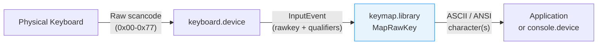

[← Home](../README.md) · [Libraries](README.md)

# keymap.library — Keyboard Mapping

## Overview

`keymap.library` translates **raw keycodes** from `keyboard.device` into character codes using the active keymap. The Amiga keyboard generates hardware scancodes (0x00–0x77); the keymap defines how each physical key maps to characters, including shifted variants, dead keys (accented characters), and string sequences (function keys).



---

## Key Functions

```c
#include <devices/inputevent.h>
#include <libraries/keymap.h>

/* Map a raw keycode + qualifiers to characters: */
struct InputEvent ie;
ie.ie_Class       = IECLASS_RAWKEY;
ie.ie_Code        = rawKeyCode;     /* 0x00–0x77 */
ie.ie_Qualifier   = qualifiers;     /* IEQUALIFIER_LSHIFT, etc. */
ie.ie_EventAddress = NULL;

char buffer[16];
LONG numChars = MapRawKey(&ie, buffer, sizeof(buffer), NULL);
/* Returns number of characters, or -1 if buffer too small */
/* numChars=0 means the key doesn't produce a character (e.g., Shift alone) */

/* Map ANSI characters back to raw key events: */
WORD result = MapANSI(string, numChars,
                      outBuffer, outLength,
                      NULL);  /* NULL = use default keymap */
```

---

## struct KeyMap

```c
/* devices/keymap.h — NDK39 */
struct KeyMap {
    UBYTE *km_LoKeyMapTypes;    /* type byte per key, 0x00–0x3F */
    ULONG *km_LoKeyMap;         /* mapping data per key, 0x00–0x3F */
    UBYTE *km_LoCapsable;       /* caps-lock bitmap (1 bit per key) */
    UBYTE *km_LoRepeatable;     /* auto-repeat bitmap */
    UBYTE *km_HiKeyMapTypes;    /* type byte per key, 0x40–0x77 */
    ULONG *km_HiKeyMap;         /* mapping data per key, 0x40–0x77 */
    UBYTE *km_HiCapsable;
    UBYTE *km_HiRepeatable;
};
```

The keymap is split into two halves:
- **Lo keys** (0x00–0x3F): main keyboard area (letters, numbers, symbols)
- **Hi keys** (0x40–0x77): function keys, cursor keys, keypad, special keys

### Key Type Flags

| Flag | Meaning |
|---|---|
| `KCF_SHIFT` | Key has shifted variant |
| `KCF_ALT` | Key has Alt variant |
| `KCF_CONTROL` | Key has Control variant |
| `KCF_DEAD` | Dead key (accent prefix — combines with next keypress) |
| `KCF_STRING` | Key produces a multi-byte string (e.g., function keys → escape sequences) |
| `KCF_NOP` | Key produces no character |

---

## Raw Keycodes

Key physical positions are fixed across all Amiga keyboards:

| Rawkey | Key | Rawkey | Key |
|---|---|---|---|
| `0x00` | \` (backtick) | `0x40` | Space |
| `0x01` | 1 | `0x41` | Backspace |
| `0x02` | 2 | `0x42` | Tab |
| `0x03`–`0x0A` | 3–0 | `0x43` | Enter (keypad) |
| `0x10`–`0x19` | Q–P row | `0x44` | Return |
| `0x20`–`0x28` | A–L row | `0x45` | Escape |
| `0x31`–`0x39` | Z–/ row | `0x46` | Delete |
| `0x30` | — | `0x4C` | Cursor Up |
| | | `0x4D` | Cursor Down |
| | | `0x4E` | Cursor Right |
| | | `0x4F` | Cursor Left |
| `0x50`–`0x59` | F1–F10 | `0x60` | Left Shift |
| | | `0x61` | Right Shift |
| | | `0x63` | Control |
| | | `0x64` | Left Alt |
| | | `0x65` | Right Alt |
| | | `0x66` | Left Amiga |
| | | `0x67` | Right Amiga |

> [!NOTE]
> **Key-up events** have bit 7 set: rawkey `0x80 | keycode`. So rawkey `0xC5` = Escape key released.

---

## Dead Keys (Accented Characters)

Dead keys work in two presses:
1. Press the dead key (e.g., Alt+H = acute accent ´)
2. Press the base letter (e.g., e)
3. Result: é

```c
/* Dead key handling is automatic in MapRawKey if you pass
   the previous dead key's InputEvent via ie_EventAddress: */
struct InputEvent deadEvent;
/* ... first keypress (dead key) stored here ... */

ie.ie_EventAddress = (APTR)&deadEvent;  /* chain to dead key */
numChars = MapRawKey(&ie, buffer, sizeof(buffer), NULL);
/* buffer now contains the composed character */
```

---

## Changing Keymaps

```c
/* Set a different keymap: */
struct KeyMap *germanMap;
/* Load from DEVS:Keymaps/d (German layout) */

/* System-wide change via Preferences: */
/* Use the Input prefs editor, or: */
SetKeyMapDefault(newKeyMap);
```

Available keymaps in `DEVS:Keymaps/`:

| File | Layout |
|---|---|
| `usa` | US English (QWERTY) — default |
| `gb` | British English |
| `d` | German (QWERTZ) |
| `f` | French (AZERTY) |
| `i` | Italian |
| `e` | Spanish |
| `dk` | Danish |
| `s` | Swedish |
| `n` | Norwegian |

---

## References

- NDK39: `devices/keymap.h`, `libraries/keymap.h`
- ADCD 2.1: keymap.library autodocs
- See also: [console.md](../10_devices/console.md) — console.device uses keymap for input
- See also: [input_events.md](../09_intuition/input_events.md) — InputEvent structure
