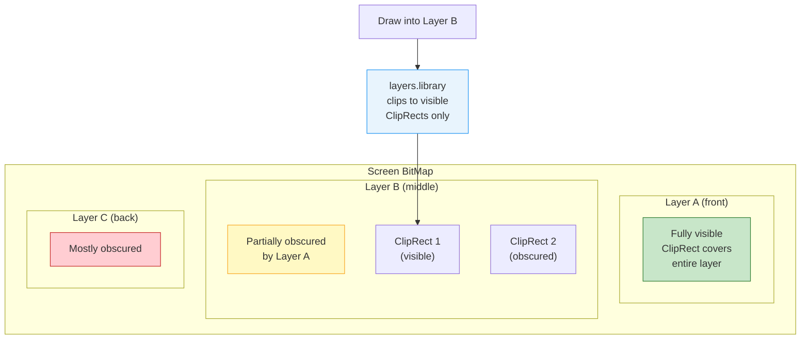
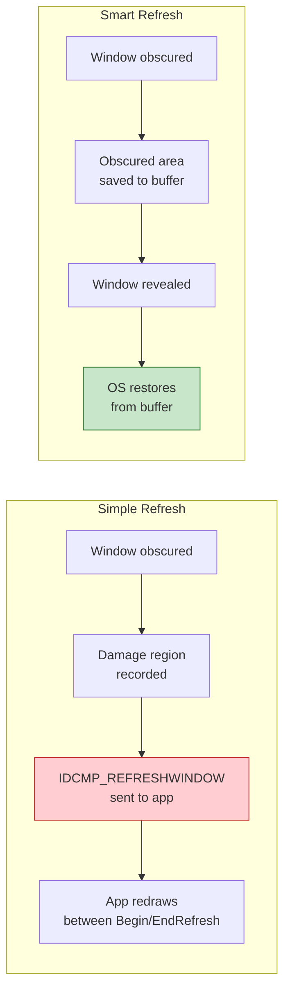

[← Home](../README.md) · [Libraries](README.md)

# layers.library — Window Clipping and Damage Repair

## Overview

`layers.library` provides the clipping and damage-repair infrastructure that Intuition windows are built on. Every window's `RastPort` is backed by a `Layer` that manages overlapping regions, damage tracking, and optional backing-store for obscured content.

When you draw to a window, all drawing operations are automatically clipped to the window's visible area by the layer system. You never draw "outside" your window or over another window — layers enforces this transparently.



---

## Layer Types

| Flag | Type | Backing Store | Damage Handling | Memory Cost |
|---|---|---|---|---|
| `LAYERSIMPLE` | Simple Refresh | None | App must redraw on `IDCMP_REFRESHWINDOW` | Minimal |
| `LAYERSMART` | Smart Refresh | Auto — obscured regions saved/restored | Automatic — OS handles damage | Moderate |
| `LAYERSUPER` | Super BitMap | Full off-screen bitmap (app provides) | Full bitmap always valid | High |
| `LAYERBACKDROP` | Backdrop | Modifier — behind all normal layers | Depends on refresh type | — |



---

## ClipRects — The Clipping Engine

Each layer maintains a linked list of **ClipRects** — rectangles that define how each region of the layer should be handled:

```c
struct ClipRect {
    struct ClipRect *Next;       /* next in chain */
    struct ClipRect *prev;       /* previous */
    struct Layer    *lobs;       /* layer that obscures this rect (NULL if visible) */
    struct BitMap   *BitMap;     /* backing store bitmap (Smart Refresh) */
    LONG            reserved;
    LONG            Flags;
    struct Rectangle bounds;     /* x1,y1,x2,y2 of this rect */
};
```

When drawing to a partially obscured layer:
1. The drawing call (e.g., `RectFill`) enters `graphics.library`
2. Graphics detects `rp->Layer != NULL`
3. For each **visible ClipRect**, the drawing is performed clipped to that rectangle
4. For **obscured ClipRects** (Smart Refresh), drawing goes to the backing-store bitmap instead
5. The application sees nothing — clipping is fully transparent

---

## Creating Layers Directly

While Intuition normally creates layers for windows, you can create them manually for custom display systems:

```c
struct Layer_Info *li = NewLayerInfo();

/* Create a layer on top: */
struct Layer *frontLayer = CreateUpfrontLayer(li, screenBitMap,
    10, 10, 200, 100,     /* bounds: x1, y1, x2, y2 */
    LAYERSMART,            /* type */
    NULL);                 /* super bitmap (NULL for non-SUPER) */

/* Create behind existing layers: */
struct Layer *backLayer = CreateBehindLayer(li, screenBitMap,
    50, 50, 250, 150,
    LAYERSIMPLE | LAYERBACKDROP,
    NULL);

/* Get the RastPort for drawing: */
struct RastPort *rp = frontLayer->rp;
SetAPen(rp, 1);
RectFill(rp, 0, 0, 190, 90);  /* coordinates relative to layer */
```

---

## Layer Operations

### Locking

**Always lock a layer before drawing** if other tasks might modify it simultaneously:

```c
LockLayer(0, layer);
/* ... safe to draw ... */
UnlockLayer(layer);

/* Lock ALL layers (for bulk operations): */
LockLayers(layerInfo);
UnlockLayers(layerInfo);

/* Lock a layer for multiple operations: */
LockLayerInfo(layerInfo);
/* ... manipulate layer stack ... */
UnlockLayerInfo(layerInfo);
```

### Moving and Resizing

```c
/* Move layer by delta: */
MoveLayer(0, layer, dx, dy);

/* Resize layer by delta: */
SizeLayer(0, layer, dw, dh);

/* Move to front/back of stack: */
UpfrontLayer(0, layer);
BehindLayer(0, layer);
```

### Damage and Refresh

```c
/* For Simple Refresh windows — handle IDCMP_REFRESHWINDOW: */
BeginRefresh(window);
/* ... redraw damaged area only ... */
/* The ClipRect list is temporarily set to damaged regions only */
EndRefresh(window, TRUE);  /* TRUE = damage fully repaired */
```

### Install Backfill Hook

```c
/* Custom backfill instead of default (clear to pen 0): */
struct Hook backfillHook;
backfillHook.h_Entry = (HOOKFUNC)MyBackfillFunc;
InstallLayerHook(layer, &backfillHook);

/* The hook is called whenever a region needs to be filled
   (e.g., when a window is moved and new area is exposed) */
```

---

## Super BitMap Layers

Super BitMap layers maintain a full-sized off-screen bitmap that the application owns. The visible portion is blitted to the screen; the rest is always valid in the off-screen buffer:

```c
/* Allocate the full bitmap: */
struct BitMap *superBM = AllocBitMap(640, 480, depth,
                                     BMF_CLEAR, NULL);

/* Create super bitmap layer: */
struct Layer *superLayer = CreateUpfrontLayer(li, screenBitMap,
    0, 0, 319, 255,          /* visible area on screen */
    LAYERSUPER,
    superBM);                 /* the full-size bitmap */

/* Scroll the view within the super bitmap: */
ScrollLayer(0, superLayer, dx, dy);

/* Sync super bitmap with display after drawing: */
SyncSBitMap(superLayer);

/* Copy display back to super bitmap before hiding: */
CopySBitMap(superLayer);
```

---

## Cleanup

```c
/* Remove layers in reverse order: */
DeleteLayer(0, layer);

/* Dispose the layer info: */
DisposeLayerInfo(li);

/* If using super bitmap, free it after DeleteLayer: */
FreeBitMap(superBM);
```

---

## References

- NDK39: `graphics/layers.h`, `graphics/clip.h`, `graphics/gfx.h`
- ADCD 2.1: layers.library autodocs
- See also: [rastport.md](../08_graphics/rastport.md) — drawing through layers
- See also: [screens.md](../09_intuition/screens.md) — Intuition screen/window layer management
