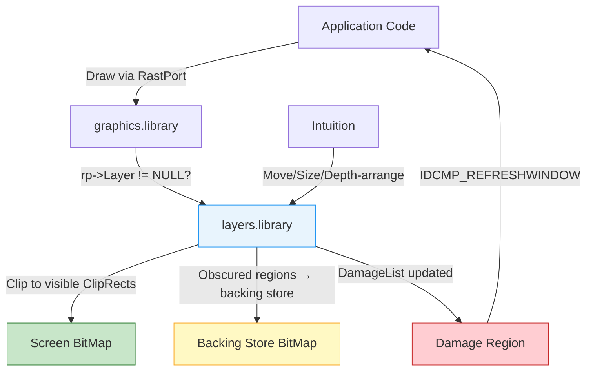
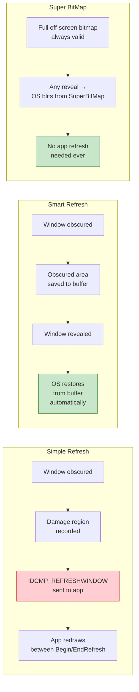
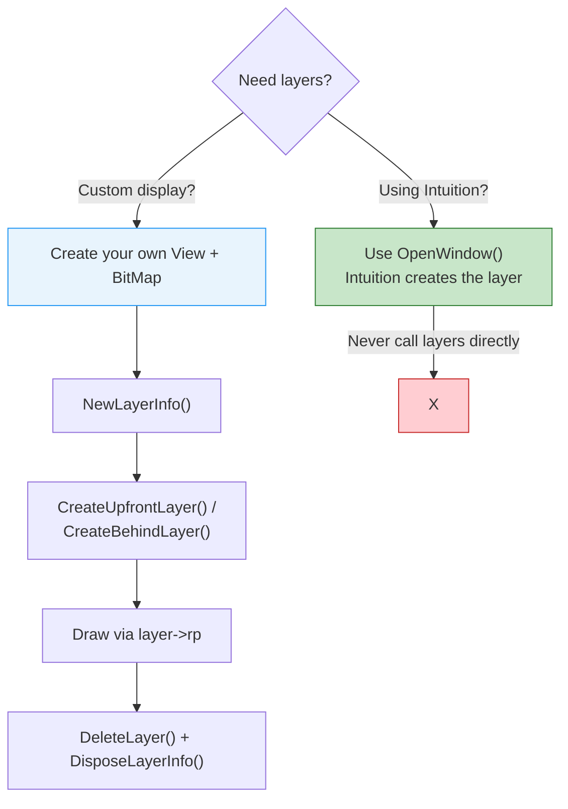
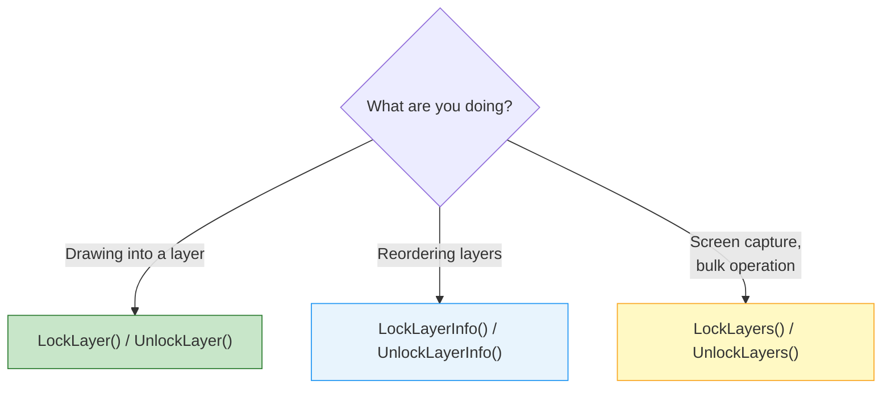

[← Home](../README.md) · [Libraries](README.md)

# layers.library — Window Clipping, Damage Repair, and Layer Management

## Overview

`layers.library` is the invisible engine behind every Intuition window. It manages overlapping rectangular regions on a shared `BitMap`, clips drawing operations to visible areas, tracks damage when windows move or resize, and optionally restores obscured content from backing store. Intuition builds its entire windowing system on top of layers — every window is a layer, and every layer is a linked list of `ClipRect` structures.

The library is small (~14 KB in ROM, 60th library initialized at boot) but its impact is enormous. Without layers, there would be no overlapping windows, no drag-to-reveal, no multi-tasking GUI on a 7 MHz 68000 with 512 KB of RAM.



---

## Layer Types

| Flag | Type | Backing Store | Damage Handling | Memory Cost |
|------|------|--------------|-----------------|-------------|
| `LAYERSIMPLE` | Simple Refresh | None | App must redraw on `IDCMP_REFRESHWINDOW` | Minimal |
| `LAYERSMART` | Smart Refresh | Auto — obscured regions saved/restored | Automatic — OS handles damage (except resize) | Moderate |
| `LAYERSUPER` | Super BitMap | Full off-screen bitmap (app provides) | Full bitmap always valid — OS restores automatically | High |
| `LAYERBACKDROP` | Backdrop | Modifier — behind all normal layers | Depends on base refresh type | — |

> [!WARNING]
> The three layer-type flags (`LAYERSIMPLE`, `LAYERSMART`, `LAYERSUPER`) are **mutually exclusive**. Only one may be specified per layer. `LAYERBACKDROP` is a modifier that can be OR'd with any of them.



### Refresh Type Decision Guide

| Scenario | Recommended Type | Rationale |
|----------|-----------------|-----------|
| Standard Intuition window (menus, gadgets) | `LAYERSMART` | OS handles most damage automatically |
| Custom display with full content regeneration | `LAYERSIMPLE` | Lowest memory — app redraws everything anyway |
| Scrollable viewport (maps, documents) | `LAYERSUPER` | Full off-screen buffer enables ScrollLayer() without damage |
| Backdrop window (WB pattern) | `LAYERSIMPLE \| LAYERBACKDROP` | Behind everything, rarely damaged |
| Memory-constrained game | `LAYERSIMPLE` | Zero backing-store overhead |
| Status bar / clock on screen | `LAYERSIMPLE \| LAYERBACKDROP` | Minimal content, easy to redraw |

---

## Core Data Structures

### struct Layer

```c
/* graphics/clip.h — NDK39 */
struct Layer {
    struct Layer    *front;         /* next layer towards front (higher priority) */
    struct Layer    *back;          /* next layer towards back */
    struct ClipRect *ClipRect;      /* head of ClipRect list for this layer */
    struct RastPort *rp;            /* RastPort for drawing into this layer */
    struct Rectangle bounds;        /* layer bounds (x1,y1,x2,y2) in screen coords */
    /* ... internal fields ... */
    UWORD           Flags;          /* LAYERSIMPLE/LAYERSMART/LAYERSUPER/LAYERBACKDROP */
    struct BitMap   *SuperBitMap;   /* non-NULL for LAYERSUPER */
    /* ... internal fields ... */
    struct Region   *DamageList;    /* damaged rectangles needing refresh */
    /* ... more internal fields ... */
};
```

**Readable fields** (read-only — never modify directly):

| Field | Purpose |
|-------|---------|
| `front`, `back` | Doubly-linked layer stack — front = higher priority (drawn on top) |
| `ClipRect` | Head of the clipping rectangle list — graphics.library walks this |
| `rp` | The RastPort for drawing — coordinates are relative to the layer's top-left |
| `bounds` | Absolute screen coordinates of the layer |
| `Flags` | Layer type + state bits (`LAYERREFRESH`, `LAYERUPDATING`, etc.) |
| `SuperBitMap` | The app-provided off-screen bitmap (`LAYERSUPER` only) |
| `DamageList` | Region list of rectangles needing redraw |

### struct ClipRect

```c
/* graphics/clip.h — NDK39 */
struct ClipRect {
    struct ClipRect *Next;       /* next in chain */
    struct ClipRect *prev;       /* previous */
    struct Layer    *lobs;       /* layer that obscures this rect (NULL = visible) */
    struct BitMap   *BitMap;     /* backing store bitmap (Smart refresh, obscured only) */
    LONG            reserved;
    LONG            Flags;       /* CR_NEEDS_NO_CONCEALED_RASTERS, etc. */
    struct Rectangle bounds;     /* x1,y1,x2,y2 of this rect */
};
```

When drawing to a partially obscured layer:
1. The drawing call (e.g. `RectFill`) enters `graphics.library`
2. Graphics detects `rp->Layer != NULL`
3. For each **visible ClipRect** (`lobs == NULL`), drawing is performed clipped to that rectangle
4. For **obscured ClipRects** (`lobs != NULL`, Smart refresh), drawing goes to the backing-store bitmap instead
5. The application sees nothing — clipping is fully transparent

### struct Layer_Info

```c
/* graphics/layers.h — NDK39 */
struct Layer_Info {
    struct Layer    *top_layer;     /* frontmost layer */
    struct Layer    *check_layer;   /* layer being examined (internal) */
    struct ClipRect *obs;           /* accumulation of obscured rectangles (internal) */
    struct Region   *damage_list;   /* layers with damage (internal) */
    struct RastPort *blank_hook;    /* backfill RastPort (internal) */
    struct Layer    *save_layer;    /* layer saved for BeginRefresh (internal) */
    UWORD           Flags;         /* LIFLG_SUPPORT_IOFFERS, etc. */
    BOOL            fatten_count;  /* nesting level of FattenLayerInfo() */
    struct SignalSemaphore Lock;    /* V39: semaphore for intertask safety */
    /* ... more fields ... */
};
```

Every display shared by multiple layers requires **one** `Layer_Info`. Intuition screens already have one at `screen->LayerInfo`. For custom displays, allocate with `NewLayerInfo()`.

---

## Creating Layers Directly

> [!WARNING]
> **Never create layers on an Intuition screen directly.** Intuition windows are the only supported method of adding layers to Intuition screens. Only the locking/unlocking functions are safe to use with Intuition-managed layers. Create your own `View` if you need direct layer control.



### Full Lifecycle Example

```c
#include <proto/exec.h>
#include <proto/graphics.h>
#include <proto/layers.h>
#include <graphics/gfx.h>
#include <graphics/gfxbase.h>
#include <graphics/layers.h>
#include <graphics/clip.h>
#include <graphics/rastport.h>
#include <graphics/view.h>

void custom_layer_demo(void)
{
    struct BitMap screenBM;
    struct View view;
    struct ViewPort vport;

    /* 1. Set up your own View + ViewPort + BitMap (not shown —
       see graphics.library View system docs for full setup) */
    InitBitMap(&screenBM, 4, 640, 256);  /* 4 bitplanes, 640x256 */
    for (int i = 0; i < 4; i++)
        screenBM.Planes[i] = AllocRaster(640, 256);

    /* 2. Allocate Layer_Info */
    struct Layer_Info *li = NewLayerInfo();
    if (!li) goto cleanup_bitmap;

    /* 3. Create layers */
    struct Layer *front = CreateUpfrontLayer(li, &screenBM,
        10, 10, 300, 200,
        LAYERSMART, NULL);

    struct Layer *back = CreateBehindLayer(li, &screenBM,
        50, 50, 350, 250,
        LAYERSIMPLE, NULL);

    if (!front || !back) goto cleanup_layers;

    /* 4. Draw into front layer */
    struct RastPort *rp = front->rp;
    SetAPen(rp, 1);
    SetDrMd(rp, JAM2);
    RectFill(rp, 0, 0, 290, 190);  /* coords relative to layer */

    /* 5. Move front layer — back layer takes damage */
    MoveLayer(0, front, 50, 30);

    /* 6. Check back layer for damage */
    if (back->Flags & LAYERREFRESH) {
        BeginRefresh(back->rp);  /* sets ClipRects to damaged regions only */
        SetAPen(back->rp, 2);
        RectFill(back->rp, 0, 0, 9999, 9999);  /* fills damaged area */
        EndRefresh(back->rp, TRUE);
    }

cleanup_layers:
    /* 7. Delete layers in reverse order (back first, then front) */
    if (back)  DeleteLayer(0, back);
    if (front) DeleteLayer(0, front);
    DisposeLayerInfo(li);

cleanup_bitmap:
    for (int i = 0; i < 4; i++)
        if (screenBM.Planes[i])
            FreeRaster(screenBM.Planes[i], 640, 256);
}
```

---

## Layer Operations

### API Reference

#### Creating and Destroying

| Function | LVO | Purpose |
|----------|-----|---------|
| `CreateUpfrontLayer()` | -30 | Create layer in front of all others |
| `CreateBehindLayer()` | -36 | Create layer behind all others |
| `DeleteLayer()` | -42 | Remove a layer and free its resources |
| `NewLayerInfo()` | -66 | Allocate a new `Layer_Info` structure |
| `DisposeLayerInfo()` | -72 | Free a `Layer_Info` |
| `FattenLayerInfo()` | -78 | Allocate internal pools for clip regions |
| `ThinLayerInfo()` | -84 | Release pools allocated by FattenLayerInfo |

#### Moving, Sizing, Reordering

| Function | LVO | Purpose |
|----------|-----|---------|
| `MoveLayer()` | -48 | Move layer by delta (dx, dy) |
| `SizeLayer()` | -54 | Resize layer by delta (dw, dh) |
| `UpfrontLayer()` | -24 | Move layer to front of stack |
| `BehindLayer()` | -18 | Move layer behind all others |
| `MoveLayerInFrontOf()` | -90 | Move layer to specific position in stack |
| `ScrollLayer()` | -60 | Scroll viewport within a Super BitMap layer |

#### Locking

| Function | LVO | Purpose |
|----------|-----|---------|
| `LockLayer()` | -6 | Lock a single layer for exclusive access |
| `UnlockLayer()` | -12 | Unlock a previously locked layer |
| `LockLayers()` | -96 | Lock all layers in the `Layer_Info` |
| `UnlockLayers()` | -102 | Unlock all layers |
| `LockLayerInfo()` | -108 | Lock the `Layer_Info` for layer stack operations |
| `UnlockLayerInfo()` | -114 | Unlock the `Layer_Info` |

#### Damage and Refresh

| Function | LVO | Purpose |
|----------|-----|---------|
| `BeginRefresh()` | -126 | Set ClipRects to damaged regions only |
| `EndRefresh()` | -132 | Complete refresh, clear damage list |
| `InstallLayerHook()` | -138 | Set custom backfill hook for a layer |
| `InstallClipRegion()` | -150 | Install a graphics Region for additional clipping |

### Locking Strategy

**Always lock a layer before drawing** if other tasks might modify it simultaneously:

```c
/* Lock a single layer for drawing: */
LockLayer(0, layer);
/* ... safe to draw ... */
UnlockLayer(layer);

/* Lock ALL layers (for bulk operations like screen capture): */
LockLayers(layerInfo);
/* ... no layer can move, resize, or be deleted ... */
UnlockLayers(layerInfo);

/* Lock the Layer_Info itself (for stack manipulation): */
LockLayerInfo(layerInfo);
/* ... UpfrontLayer, BehindLayer, MoveLayerInFrontOf ... */
UnlockLayerInfo(layerInfo);
```



### Damage and Refresh

When a layer operation reveals previously obscured areas, the newly exposed region is **damaged** and needs repair:

```c
/* For Simple Refresh windows — handle IDCMP_REFRESHWINDOW: */
BeginRefresh(window);
/* ... redraw damaged area only ... */
/* The ClipRect list is temporarily set to damaged regions only */
EndRefresh(window, TRUE);  /* TRUE = damage fully repaired */
```

The `BeginRefresh()` / `EndRefresh()` pair is critical:
1. `BeginRefresh()` restructures the ClipRect list to cover **only damaged rectangles** — your redraw only touches areas that actually need repair
2. During refresh, other tasks cannot modify the layer (it is implicitly locked)
3. `EndRefresh(TRUE)` clears the damage list and restores normal ClipRects
4. `EndRefresh(FALSE)` means "I didn't finish" — damage remains for the next refresh cycle

---

## Backfill Hooks

When a region of a layer is exposed (e.g., another window moves away), the exposed area must be **filled** before the application redraws content. By default, layers clears the area to pen 0 (background color). A custom backfill hook lets you fill with a pattern, gradient, or bitmap instead.

```c
/* Custom backfill hook — fills exposed areas with a tiled pattern */
LONG ASM MyBackfillFunc(
    REG(a0, struct Hook *hook),
    REG(a1, struct Layer *layer),
    REG(a2, struct RastPort *rp),
    REG(a3, struct BackFillMsg *msg)
{
    /* msg->Bounds contains the rectangle to fill (layer-relative) */
    /* msg->Layer is the layer being refilled */
    /* rp is a special RastPort for backfill — use it, not layer->rp */

    if (msg->OffsetX == 0 && msg->OffsetY == 0) {
        /* Full layer clear — use simple fill */
        SetAPen(rp, 0);
        RectFill(rp,
            msg->Bounds.MinX, msg->Bounds.MinY,
            msg->Bounds.MaxX, msg->Bounds.MaxY);
    } else {
        /* Partial exposure — tile a pattern at the offset */
        SetAPen(rp, 1);
        SetDrMd(rp, JAM2);
        RectFill(rp,
            msg->Bounds.MinX, msg->Bounds.MinY,
            msg->Bounds.MaxX, msg->Bounds.MaxY);
    }

    return 0;  /* always return 0 */
}

/* Installation: */
struct Hook backfillHook;
backfillHook.h_Entry = (HOOKFUNC)MyBackfillFunc;
InstallLayerHook(layer, &backfillHook);

/* To restore default backfill: */
InstallLayerHook(layer, LAYERS_BACKFILL);  /* NULL also works */
```

> [!WARNING]
> The backfill hook receives a **special RastPort** (parameter `a2`) — not the layer's normal `rp`. Always use this RastPort for drawing inside the hook. Drawing to the layer's normal `rp` from a backfill hook corrupts the ClipRect state.

---

## Super BitMap Layers

Super BitMap layers maintain a full-sized off-screen bitmap that the application owns. The visible portion is blitted to the screen; the rest is always valid in the off-screen buffer:

```c
/* Allocate the full bitmap: */
struct BitMap *superBM = AllocBitMap(640, 480, depth,
                                     BMF_CLEAR, NULL);

/* Create super bitmap layer: */
struct Layer *superLayer = CreateUpfrontLayer(li, screenBitMap,
    0, 0, 319, 255,          /* visible area on screen */
    LAYERSUPER,
    superBM);                 /* the full-size bitmap */

/* Scroll the view within the super bitmap: */
ScrollLayer(0, superLayer, dx, dy);

/* Sync super bitmap with display after drawing: */
SyncSBitMap(superLayer);

/* Copy display back to super bitmap before hiding: */
CopySBitMap(superLayer);
```

### Super BitMap Use Cases

| Use Case | Why Super BitMap | Example |
|----------|-----------------|---------|
| Scrolling map viewer | Smooth scroll without redraw penalty | Strategy games (Cannon Fodder map) |
| Large document viewer | Full content always in memory | Text editors, image viewers |
| Virtual desktop | Screen shows a viewport into a larger space | DTP software (PageStream) |
| Undo buffer | Keep previous state in off-screen bitmap | Drawing programs (Deluxe Paint) |

---

## Optimized Refresh Techniques

### ClipBlit vs ScrollRaster for Scrolling

For scrolling content within a Smart Refresh layer, `ClipBlit()` provides better CPU/Blitter overlap than `ScrollRaster()`:

| Operation | `ScrollRaster()` | `ClipBlit()` |
|-----------|------------------|-------------|
| Blitter ops | 2: scroll + clear | 1: scroll only |
| CPU overlap | Waits for blit to finish | Returns while blit runs |
| Damage | Generates damage in cleared region | No damage (no clear) |
| Memory | No extra allocation | No extra allocation |

```c
/* BAD: ScrollRaster waits for blit, then clears — two blits */
ScrollRaster(rp, 0, -16, 0, 0, 639, 255);
/* Must also handle IDCMP_REFRESHWINDOW for the cleared strip */

/* BETTER: ClipBlit overlaps with CPU — one blit, no damage */
ClipBlit(rp, 0, 16, rp, 0, 0, 640, 240, 0xC0);
/* Now fill the bottom 16 lines with new content */
SetAPen(rp, 0);
RectFill(rp, 0, 240, 639, 255);
```

### Using Multiple RastPorts

For complex windows with multiple drawing regions, allocate separate `RastPort` structures that share the same `BitMap`. This avoids repeated `SetAPen`/`SetDrMd` calls when switching between regions:

```c
struct RastPort headerRP, contentRP, statusRP;

InitRastPort(&headerRP);
InitRastPort(&contentRP);
InitRastPort(&statusRP);

/* All share the window's bitmap but have independent pens/modes */
headerRP.BitMap  = window->RPort->BitMap;
contentRP.BitMap = window->RPort->BitMap;
statusRP.BitMap  = window->RPort->BitMap;

/* Set up once: */
SetAPen(&headerRP, 2);  SetDrMd(&headerRP, JAM2);
SetAPen(&contentRP, 1); SetDrMd(&contentRP, JAM1);
SetAPen(&statusRP, 3);  SetDrMd(&statusRP, JAM2);
```

---

## Historical Context & Modern Analogies

### Amiga Layers vs. Contemporaries

| Platform | Window Clipping | Backing Store | Damage Tracking | Overlapping Windows |
|----------|----------------|---------------|-----------------|---------------------|
| **Amiga layers.library** | ClipRect linked list | Smart refresh auto-saves | `DamageList` + `LAYERREFRESH` bit | Yes, hardware-agnostic |
| **Mac OS (Classic)** | Region-based clipping | Off-screen port (manual) | Window Manager event | Yes |
| **Atari ST GEM** | Rectangle clipping only | None | Full redraw on expose | Limited (not truly overlapping) |
| **Windows 1.x–3.x** | Region clipping | None (3.x added PATBLT) | `WM_PAINT` messages | Tiled (1.x), overlapping (2.x+) |
| **X11** | Server-side region clipping | Backing store (optional) | Expose events | Yes |

The Amiga's approach was notable for its **automatic backing store** (Smart refresh) at a time when most platforms required the application to handle all redraw. This came at a memory cost — significant on a 512 KB machine.

### Modern Analogies

| Amiga Concept | Modern Equivalent | Notes |
|--------------|-------------------|-------|
| `Layer` | compositor surface (Wayland `wl_surface`, macOS `CALayer`) | Amiga layers are region-clipped; modern compositors texture-sample |
| `ClipRect` | damage region (Wayland `wl_surface.damage`) | Same concept: track what needs redraw |
| `LAYERSMART` backing store | Wayland compositor shadow buffer | OS saves obscured content automatically |
| `LAYERSUPER` | macOS `NSBitmapImageRep` + `NSImageView` | Full off-screen buffer, viewport scrolls through it |
| `BeginRefresh` / `EndRefresh` | `drawRect:` (macOS) / `WM_PAINT` (Windows) | Scope the damage region for targeted redraw |
| `LAYERBACKDROP` | desktop wallpaper layer | Always behind normal windows |
| `InstallLayerHook` | `drawsBackground` delegate (macOS/iOS) | Customize how exposed regions are filled |

The key difference: modern compositors use **full-screen textures** and a GPU to composite. Amiga layers use **region math** and the Blitter — no GPU, no texture memory, just rectangle algebra on a single framebuffer.

---

## Best Practices

1. **Use `LAYERSMART` for Intuition windows** — the OS handles most damage automatically, and the memory cost is modest
2. **Always lock before drawing** — `LockLayer()` prevents other tasks from moving your window mid-draw
3. **Use `BeginRefresh()` / `EndRefresh()` for damage repair** — never redraw outside this pair
4. **Pass `TRUE` to `EndRefresh()`** unless you genuinely couldn't complete the redraw
5. **Use `ClipBlit()` over `ScrollRaster()`** for scrolling — better CPU/Blitter overlap
6. **Never modify `Layer` struct fields directly** — use the API functions
7. **Delete layers in reverse creation order** — back layers first, front layers last
8. **Don't hold layer locks across I/O or `Wait()` calls** — lock, draw, unlock
9. **Use `InstallClipRegion()`** for complex non-rectangular clipping within a layer
10. **Test with multiple overlapping windows** — damage bugs only appear when windows overlap

---

## Named Antipatterns

### "The Intuition Layer Creep" — Creating Layers on an Intuition Screen

```c
/* BAD: Creating a raw layer on an Intuition screen's BitMap */
struct Layer *bad = CreateUpfrontLayer(
    &screen->LayerInfo,    /* Intuition owns this LayerInfo! */
    screen->RastPort.BitMap,
    10, 10, 200, 100,
    LAYERSMART, NULL);
/* Undefined behavior — corrupts Intuition's layer tracking */
```

```c
/* CORRECT: Use OpenWindow() for Intuition screens */
struct Window *win = OpenWindowTags(NULL,
    WA_Left, 10,
    WA_Top, 10,
    WA_Width, 190,
    WA_Height, 90,
    WA_Flags, WFLG_SIZEGADGET | WFLG_DRAGBAR | WFLG_DEPTHGADGET,
    WA_IDCMP, IDCMP_REFRESHWINDOW,
    TAG_DONE);
```

### "The Phantom Refresh" — Drawing Outside BeginRefresh/EndRefresh

```c
/* BAD: Drawing directly on damage without BeginRefresh() —
   draws to ALL ClipRects (visible AND obscured), causing
   double-drawing and corruption */
if (layer->Flags & LAYERREFRESH) {
    SetAPen(layer->rp, 1);
    RectFill(layer->rp, 0, 0, 9999, 9999);  /* redraws EVERYTHING */
}
```

```c
/* CORRECT: BeginRefresh() restricts ClipRects to damaged regions only */
if (layer->Flags & LAYERREFRESH) {
    BeginRefresh(layer->rp);
    SetAPen(layer->rp, 1);
    RectFill(layer->rp, 0, 0, 9999, 9999);  /* only touches damaged areas */
    EndRefresh(layer->rp, TRUE);
}
```

### "The Backfill RastPort Mix-Up" — Using the Wrong RastPort in a Hook

```c
/* BAD: Using layer->rp inside a backfill hook — corrupts ClipRect state */
LONG ASM MyBadBackfill(
    REG(a0, struct Hook *hook),
    REG(a1, struct Layer *layer),
    REG(a2, struct RastPort *rp),   /* THIS is the correct RastPort */
    REG(a3, struct BackFillMsg *msg))
{
    SetAPen(layer->rp, 1);  /* WRONG! */
    RectFill(layer->rp,     /* WRONG! */
        msg->Bounds.MinX, msg->Bounds.MinY,
        msg->Bounds.MaxX, msg->Bounds.MaxY);
    return 0;
}
```

```c
/* CORRECT: Always use the RastPort passed as parameter a2 */
LONG ASM MyGoodBackfill(
    REG(a0, struct Hook *hook),
    REG(a1, struct Layer *layer),
    REG(a2, struct RastPort *rp),   /* use this one */
    REG(a3, struct BackFillMsg *msg))
{
    SetAPen(rp, 1);         /* CORRECT */
    RectFill(rp,            /* CORRECT */
        msg->Bounds.MinX, msg->Bounds.MinY,
        msg->Bounds.MaxX, msg->Bounds.MaxY);
    return 0;
}
```

### "The Stale Lock" — Holding a Layer Lock Across Wait()

```c
/* BAD: Locking a layer, then sleeping — other tasks are blocked */
LockLayer(0, layer);
DrawMyContent(layer->rp);
Wait(SIGF_INTERRUPT);     /* task sleeps while holding the lock! */
UnlockLayer(layer);       /* other tasks were frozen this whole time */
```

```c
/* CORRECT: Lock, draw, unlock — then wait */
LockLayer(0, layer);
DrawMyContent(layer->rp);
UnlockLayer(layer);       /* release immediately */

Wait(SIGF_INTERRUPT);     /* safe to sleep now */
```

---

## Pitfalls & Common Mistakes

### 1. Infinite Refresh Loop

**Symptom:** `IDCMP_REFRESHWINDOW` messages arrive endlessly; CPU at 100%.

**Cause:** Drawing outside the damaged region causes *new* damage, which triggers another `IDCMP_REFRESHWINDOW`, which causes more drawing, which causes more damage...

**Fix:** Only draw between `BeginRefresh()` and `EndRefresh()` — and always pass `TRUE` to `EndRefresh()` when done:

```c
/* In the IDCMP event loop: */
case IDCMP_REFRESHWINDOW:
    BeginRefresh(win);
    RedrawContent(win->RPort, win);
    EndRefresh(win, TRUE);   /* must be TRUE to clear damage */
    break;
```

### 2. LAYERREFRESH Bit Stays Set

**Symptom:** The window flickers or the refresh message keeps firing even after redrawing.

**Cause:** You called `EndRefresh()` with `FALSE` (indicating incomplete refresh) but never followed up with a second refresh pass. Or you drew directly without `BeginRefresh()` so the damage list was never cleared.

**Fix:** Always pair `BeginRefresh()` + `EndRefresh(TRUE)`. If you must use `EndRefresh(FALSE)`, schedule another refresh immediately.

### 3. Smart Refresh Resize Damage

**Symptom:** Garbage appears in the newly exposed area when a Smart Refresh window is made larger.

**Cause:** Smart refresh only saves **obscured** regions — when the window grows, the new area was never obscured, so there's no backing store to restore from. The `LAYERREFRESH` bit is set, and the app must fill the new area.

**Fix:** Check for `IDCMP_NEWSIZE` alongside `IDCMP_REFRESHWINDOW`:

```c
case IDCMP_NEWSIZE:
    /* Window resized — new area needs drawing */
    RedrawContent(win->RPort, win);
    break;
```

### 4. LayerInfo Deadlock with Intuition

**Symptom:** System hangs when opening a window.

**Cause:** You called `LockLayerInfo(&screen->LayerInfo)` before `OpenWindow()`. Intuition also locks the same `LayerInfo` internally, causing a deadlock.

**Fix:** Never lock Intuition's `LayerInfo` manually. See the warning in [screens.md](../09_intuition/screens.md).

---

## Use Cases

| Software Type | Layer Usage | Refresh Type | Notes |
|--------------|-------------|--------------|-------|
| Workbench (OS) | One layer per window | `LAYERSMART` | Default for all WB windows |
| Productivity apps (Final Writer, PageStream) | Multiple windows, some scrolling | `LAYERSMART` + `LAYERSUPER` for scroll views | Backfill hooks for custom backgrounds |
| Games (strategy / GUI-based) | Custom layers for panels | `LAYERSIMPLE` | Games typically bypass Intuition entirely |
| Terminal emulators | Scrolling text layer | `LAYERSMART` with `ClipBlit()` scroll | Backfill hook for background color |
| Drawing programs (Deluxe Paint) | Canvas as Super BitMap | `LAYERSUPER` | Undo via off-screen buffer swap |
| Screen grabbers | Lock all layers, read BitMap | Lock only | Must lock to get consistent snapshot |
| Demo scene (GUI intros) | Overlapping effect regions | `LAYERSIMPLE` | Minimal overhead, full content regeneration |

---

## FAQ

**Q: Do I need to open layers.library explicitly?**
A: Intuition opens it automatically. If you call `NewLayerInfo()` or `CreateUpfrontLayer()` for a custom display, open it with `OpenLibrary("layers.library", 0)`.

**Q: What happens if I draw to a layer without locking it?**
A: On a single-tasking system, nothing visible. In a multitasking environment, another task could move or resize the layer while you're mid-draw, causing tearing, partial draws, or corruption. Always lock.

**Q: Can I have more than one `Layer_Info` per display?**
A: No — each display (each `BitMap` shared by layers) needs exactly one `Layer_Info`. Multiple `Layer_Info` structures would each track overlapping independently.

**Q: What's the performance cost of Smart refresh?**
A: Each obscured ClipRect requires a backing-store `BitMap` allocation. For a typical Workbench window partially obscured by one other window, this costs ~10–20 KB. The Blitter handles the copy, so the CPU cost is minimal. The real cost is memory, not time.

**Q: When should I use `InstallClipRegion()` vs. `BeginRefresh()`?**
A: `InstallClipRegion()` installs a **permanent** clipping region (like cutting a hole in your window). `BeginRefresh()` temporarily restricts drawing to **damage** regions only. They serve different purposes.

**Q: What does `FattenLayerInfo()` do?**
A: It pre-allocates internal memory pools for ClipRect and Region operations. Without it, every layer operation allocates and frees memory dynamically. Call it once after `NewLayerInfo()` for performance-critical custom displays.

**Q: Can layers.library be used for off-screen rendering?**
A: No — layers manage overlapping regions on a single `BitMap`. For off-screen rendering, use `AllocBitMap()` + `InitRastPort()` directly, or use a `LAYERSUPER` layer with a custom bitmap that's never displayed.

---

## References

### NDK Headers

- `graphics/layers.h` — `Layer_Info`, function prototypes
- `graphics/clip.h` — `Layer`, `ClipRect` structures
- `graphics/gfx.h` — `BitMap`, `Rectangle`
- `graphics/rastport.h` — `RastPort` structure

### Autodocs

- ADCD 2.1: layers.library autodocs
- ADCD 2.1: graphics.library (drawing through layers)

### Related Knowledge Base Articles

- [RastPort](../08_graphics/rastport.md) — drawing through layers, the Layer field
- [Screens](../09_intuition/screens.md) — Intuition screen layer management, LayerInfo deadlock
- [Windows](../09_intuition/windows.md) — every window is a layer
- [Bitmaps](../08_graphics/bitmap.md) — the pixel storage that layers clip onto
- [Blitter](../08_graphics/blitter/blitter.md) — hardware that performs the actual copy operations for layers
- [Utility](utility.md) — `Hook` structure used by backfill hooks
