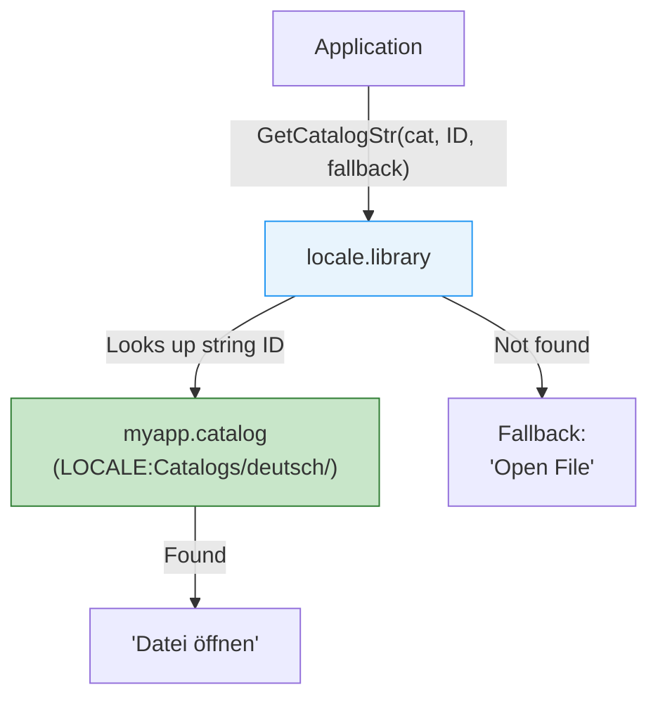

[← Home](../README.md) · [Libraries](README.md)

# locale.library — Internationalisation

## Overview

`locale.library` (OS 2.1+) provides the Amiga's internationalisation (i18n) framework: language-aware string lookup via catalogues, locale-sensitive date/number/currency formatting, and character classification. Applications that use locale.library display in the user's preferred language automatically.



---

## Catalogue System

### Creating String IDs

```c
/* Typically in a generated header (from CatComp or FlexCat): */
#define MSG_OPEN_FILE    1
#define MSG_SAVE_FILE    2
#define MSG_QUIT         3
#define MSG_ERROR_NOTFOUND 100

/* Built-in English strings (fallback): */
static const char *builtinStrings[] = {
    [MSG_OPEN_FILE]       = "Open File",
    [MSG_SAVE_FILE]       = "Save File",
    [MSG_QUIT]            = "Quit",
    [MSG_ERROR_NOTFOUND]  = "File not found",
};
```

### Using Catalogues

```c
struct Library *LocaleBase = OpenLibrary("locale.library", 38);

/* Open the application's catalogue: */
struct Catalog *cat = OpenCatalog(NULL, "myapp.catalog",
    OC_BuiltInLanguage, (ULONG)"english",
    TAG_DONE);
/* NULL for first arg = use current locale */

/* Get localised string (with English fallback): */
STRPTR openStr = GetCatalogStr(cat, MSG_OPEN_FILE, "Open File");
/* Returns German "Datei öffnen" if German catalogue exists,
   otherwise the fallback "Open File" */

/* Use throughout the application: */
Printf("%s\n", GetCatalogStr(cat, MSG_QUIT, "Quit"));

/* Cleanup: */
CloseCatalog(cat);
CloseLibrary(LocaleBase);
```

### Catalogue File Structure

```
LOCALE:Catalogs/deutsch/myapp.catalog     ← German
LOCALE:Catalogs/français/myapp.catalog    ← French
LOCALE:Catalogs/italiano/myapp.catalog    ← Italian
```

Catalogues are compiled from `.cd` (catalogue description) and `.ct` (catalogue translation) files using **CatComp** or **FlexCat**:

```
; myapp.cd — catalogue description
MSG_OPEN_FILE (1//)
Open File
;
MSG_SAVE_FILE (2//)
Save File
;
```

```
; myapp_deutsch.ct — German translation
MSG_OPEN_FILE
Datei öffnen
;
MSG_SAVE_FILE
Datei speichern
;
```

---

## Locale-Aware Formatting

```c
struct Locale *loc = OpenLocale(NULL);  /* user's default locale */

Printf("Country: %s\n", loc->loc_CountryName);
Printf("Language: %s\n", loc->loc_PrefLanguages[0]);
Printf("Decimal: '%s'\n", loc->loc_DecimalPoint);     /* "." or "," */
Printf("Grouping: '%s'\n", loc->loc_GroupSeparator);   /* "," or "." */
Printf("Currency: '%s'\n", loc->loc_MonCS);            /* "$", "€", "£" */
```

### Date Formatting

```c
/* Format a date stamp according to locale: */
struct DateStamp ds;
DateStamp(&ds);

/* FormatDate uses a hook to receive characters: */
char dateBuf[64];
int pos = 0;

/* Simple hook that fills a buffer: */
void __saveds __asm DateHookFunc(
    register __a0 struct Hook *hook,
    register __a1 char ch)
{
    char *buf = hook->h_Data;
    buf[pos++] = ch;
    buf[pos] = 0;
}

struct Hook dateHook;
dateHook.h_Entry = (HOOKFUNC)DateHookFunc;
dateHook.h_Data = dateBuf;

FormatDate(loc, "%A, %e %B %Y", &ds, &dateHook);
/* Result (German locale): "Mittwoch, 23 April 2025" */
/* Result (US locale):     "Wednesday, 23 April 2025" */
```

### Format Codes

| Code | Output | Example |
|---|---|---|
| `%A` | Full weekday name | "Wednesday" / "Mittwoch" |
| `%a` | Abbreviated weekday | "Wed" / "Mi" |
| `%B` | Full month name | "April" |
| `%b` | Abbreviated month | "Apr" |
| `%d` | Day (01–31) | "23" |
| `%e` | Day (1–31, no leading zero) | "23" |
| `%H` | Hour (00–23) | "14" |
| `%I` | Hour (01–12) | "02" |
| `%M` | Minute (00–59) | "30" |
| `%S` | Second (00–59) | "00" |
| `%p` | AM/PM | "PM" |
| `%Y` | 4-digit year | "2025" |
| `%y` | 2-digit year | "25" |

---

## Character Classification

```c
/* Locale-aware character checks: */
if (IsAlpha(loc, ch))   /* alphabetic (language-aware) */
if (IsUpper(loc, ch))   /* uppercase */
if (IsLower(loc, ch))   /* lowercase */
if (IsDigit(loc, ch))   /* digit */
if (IsAlNum(loc, ch))   /* alphanumeric */
if (IsPunct(loc, ch))   /* punctuation */
if (IsSpace(loc, ch))   /* whitespace */

/* Locale-aware case conversion: */
char upper = ConvToUpper(loc, ch);
char lower = ConvToLower(loc, ch);

/* Locale-aware string comparison: */
LONG result = StrnCmp(loc, str1, str2, -1, SC_COLLATE2);
/* SC_ASCII = byte comparison */
/* SC_COLLATE1 = primary collation (ignores accents) */
/* SC_COLLATE2 = full collation */
```

---

## References

- NDK39: `libraries/locale.h`
- ADCD 2.1: locale.library autodocs
- CatComp / FlexCat documentation for catalogue compilation
