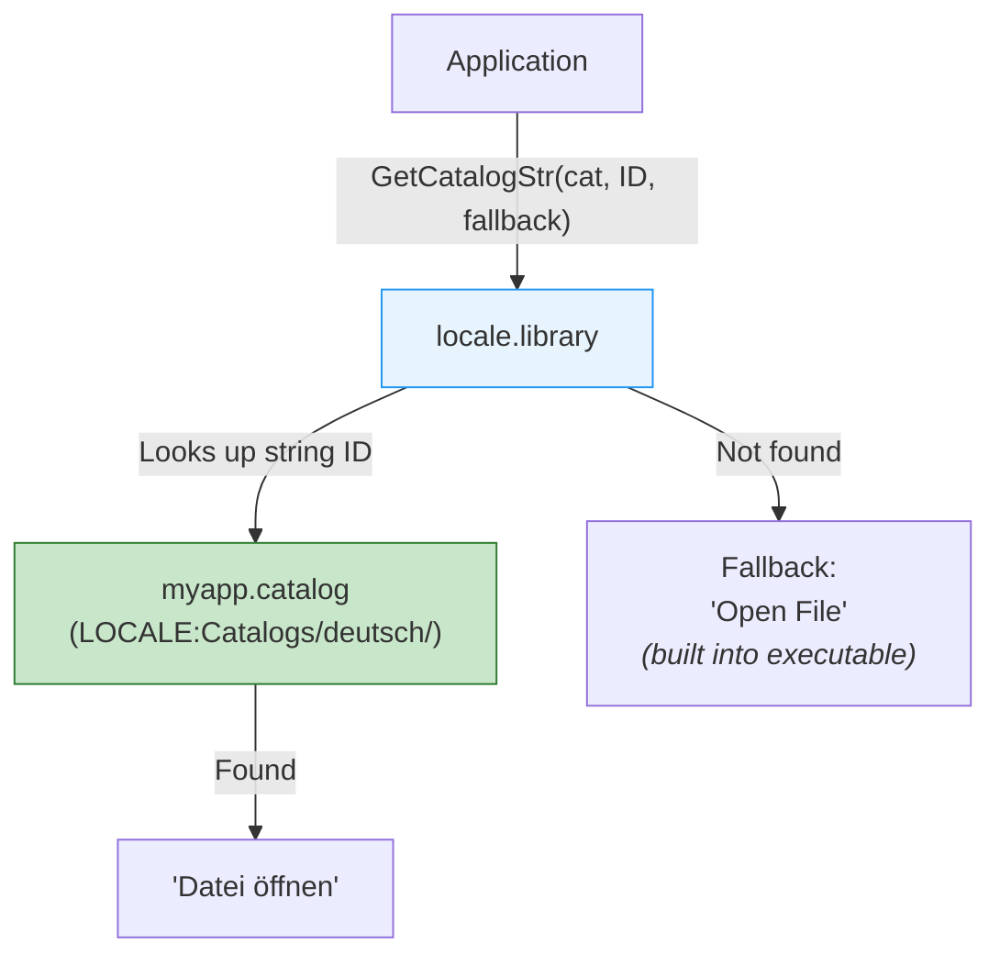

[← Home](../README.md) · [Libraries](README.md)

# locale.library — Internationalization

## Overview

`locale.library` (OS 2.1+) provides the Amiga's internationalization (i18n) framework: language-aware string lookup via catalogs, locale-sensitive date/number/currency formatting, and character classification. Applications that use locale.library display in the user's preferred language automatically.



---

## Catalog System

### Creating String IDs

```c
/* Typically in a generated header (from CatComp or FlexCat): */
#define MSG_OPEN_FILE    1
#define MSG_SAVE_FILE    2
#define MSG_QUIT         3
#define MSG_ERROR_NOTFOUND 100

/* Built-in English strings (fallback): */
static const char *builtinStrings[] = {
    [MSG_OPEN_FILE]       = "Open File",
    [MSG_SAVE_FILE]       = "Save File",
    [MSG_QUIT]            = "Quit",
    [MSG_ERROR_NOTFOUND]  = "File not found",
};
```

### Using Catalogs

```c
struct Library *LocaleBase = OpenLibrary("locale.library", 38);

/* Open the application's catalog: */
struct Catalog *cat = OpenCatalog(NULL, "myapp.catalog",
    OC_BuiltInLanguage, (ULONG)"english",
    TAG_DONE);
/* NULL for first arg = use current locale */

/* Get localised string (with English fallback): */
STRPTR openStr = GetCatalogStr(cat, MSG_OPEN_FILE, "Open File");
/* Returns German "Datei öffnen" if German catalog exists,
   otherwise the fallback "Open File" */

/* Use throughout the application: */
Printf("%s\n", GetCatalogStr(cat, MSG_QUIT, "Quit"));

/* Cleanup: */
CloseCatalog(cat);
CloseLibrary(LocaleBase);
```

### Catalog File Structure

```
LOCALE:Catalogs/deutsch/myapp.catalog     ← German
LOCALE:Catalogs/français/myapp.catalog    ← French
LOCALE:Catalogs/italiano/myapp.catalog    ← Italian
```

Catalogs are compiled from `.cd` (catalog description) and `.ct` (catalog translation) files using **CatComp** or **FlexCat**:

```
; myapp.cd — catalog description
MSG_OPEN_FILE (1//)
Open File
;
MSG_SAVE_FILE (2//)
Save File
;
```

```
; myapp_deutsch.ct — German translation
MSG_OPEN_FILE
Datei öffnen
;
MSG_SAVE_FILE
Datei speichern
;
```

---

## Locale-Aware Formatting

```c
struct Locale *loc = OpenLocale(NULL);  /* user's default locale */

Printf("Country: %s\n", loc->loc_CountryName);
Printf("Language: %s\n", loc->loc_PrefLanguages[0]);
Printf("Decimal: '%s'\n", loc->loc_DecimalPoint);     /* "." or "," */
Printf("Grouping: '%s'\n", loc->loc_GroupSeparator);   /* "," or "." */
Printf("Currency: '%s'\n", loc->loc_MonCS);            /* "$", "€", "£" */
```

### Date Formatting

```c
/* Format a date stamp according to locale: */
struct DateStamp ds;
DateStamp(&ds);

/* FormatDate uses a hook to receive characters: */
char dateBuf[64];
int pos = 0;

/* Simple hook that fills a buffer: */
void __saveds __asm DateHookFunc(
    register __a0 struct Hook *hook,
    register __a1 char ch)
{
    char *buf = hook->h_Data;
    buf[pos++] = ch;
    buf[pos] = 0;
}

struct Hook dateHook;
dateHook.h_Entry = (HOOKFUNC)DateHookFunc;
dateHook.h_Data = dateBuf;

FormatDate(loc, "%A, %e %B %Y", &ds, &dateHook);
/* Result (German locale): "Mittwoch, 23 April 2025" */
/* Result (US locale):     "Wednesday, 23 April 2025" */
```

### Format Codes

| Code | Output | Example |
|---|---|---|
| `%A` | Full weekday name | "Wednesday" / "Mittwoch" |
| `%a` | Abbreviated weekday | "Wed" / "Mi" |
| `%B` | Full month name | "April" |
| `%b` | Abbreviated month | "Apr" |
| `%d` | Day (01–31) | "23" |
| `%e` | Day (1–31, no leading zero) | "23" |
| `%H` | Hour (00–23) | "14" |
| `%I` | Hour (01–12) | "02" |
| `%M` | Minute (00–59) | "30" |
| `%S` | Second (00–59) | "00" |
| `%p` | AM/PM | "PM" |
| `%Y` | 4-digit year | "2025" |
| `%y` | 2-digit year | "25" |

---

## Character Classification

```c
/* Locale-aware character checks: */
if (IsAlpha(loc, ch))   /* alphabetic (language-aware) */
if (IsUpper(loc, ch))   /* uppercase */
if (IsLower(loc, ch))   /* lowercase */
if (IsDigit(loc, ch))   /* digit */
if (IsAlNum(loc, ch))   /* alphanumeric */
if (IsPunct(loc, ch))   /* punctuation */
if (IsSpace(loc, ch))   /* whitespace */

/* Locale-aware case conversion: */
char upper = ConvToUpper(loc, ch);
char lower = ConvToLower(loc, ch);

/* Locale-aware string comparison: */
LONG result = StrnCmp(loc, str1, str2, -1, SC_COLLATE2);
/* SC_ASCII = byte comparison */
/* SC_COLLATE1 = primary collation (ignores accents) */
/* SC_COLLATE2 = full collation */
```

---

## Historical Perspective — i18n in the Early 1990s

locale.library shipped with Amiga OS 2.1 in 1992, at a time when internationalization was barely on the radar of most operating systems. The landscape was fragmented and primitive:

### The State of Internationalization (1990–1992)

| Platform | i18n Mechanism | String Lookup | Recompilation Required? | Number/Date Locale | Character Classification |
|---|---|---|---|---|---|
| **Amiga OS 2.1** | locale.library + external catalogs | Numeric ID → catalog file | ❌ No — drop a new `.catalog` file in the locale directory | ✅ FormatDate, FormatString, decimal/group separators | ✅ IsAlpha, IsUpper, collation (SC_COLLATE1/2) |
| **Classic Mac OS (System 7)** | STR# resources + `GetIndString` | Integer ID → resource fork | ❌ No — ResEdit the resource fork | ❌ No — TextUtils had minimal formatting | ❌ No — ASCII-only on 68k Macs |
| **Windows 3.1** | String table resources (`.rc` → `.res`) | Integer ID → resource DLL | ✅ Yes — re-link the resource DLL if separate; otherwise recompile | ❌ No — `GetNumberFormat`/`GetDateFormat` arrived in Win32 (NT 3.1, 1993) | ❌ No — `IsCharAlpha` was ASCII-only |
| **Unix / X11 (Motif)** | `catgets()` (XPG3) or manual `#ifdef LANG_DE` | Numeric set+message ID → `.cat` file | ❌ No — message catalogs external | ⚠️ Partial — `setlocale()` + `nl_langinfo()`, but implementation was spotty across vendors | ⚠️ Partial — `isalpha()` was locale-aware only if the C library supported it |
| **Atari ST (TOS)** | Nothing | — | — | — | — |
| **NeXTSTEP 3.x** | `.strings` files + `NSLocalizedString()` | Natural-language key → `.strings` file | ❌ No — `.strings` files loaded at runtime | ✅ NSNumberFormatter, NSDateFormatter | ✅ NSString character methods |

### What Made locale.library Innovative

**1. External catalog files with zero-recompile extensibility.** This was the single most important design decision. An Amiga application ships with English strings compiled in. A translator in Germany creates `myapp.catalog` using CatComp/FlexCat, drops it into `LOCALE:Catalogs/deutsch/`, and the application immediately speaks German — no patches, no resource editing, no recompilation. Windows 3.1 could do this with separate resource DLLs, but only if the developer shipped them separately from the start — retrofitting an existing English-only app required recompilation. Mac OS System 7 required editing the resource fork with ResEdit. locale.library made localization a deployment decision, not a build decision.

**2. Numeric string IDs decouple code from language.** The application never hard-codes a German string — it hard-codes `MSG_OPEN_FILE = 1`. The catalog maps `1 → "Datei öffnen"`. This means translators never touch source code, developers never touch translations, and the same binary works in any language. Compare with early Unix practices where developers sprinkled `#ifdef LANG_DE ... #elif LANG_FR ...` throughout the source.

**3. Graceful fallback is built-in, not bolted-on.** `GetCatalogStr(cat, ID, "Open File")` always returns *something* — either the translated string from the catalog, or the English fallback. If the catalog file is missing, corrupted, or doesn't contain the requested ID, the application still works. This is the same principle that makes IFF safe (skip unknown chunks) — the system degrades gracefully under incomplete data.

**4. Locale-aware formatting is separate from string translation.** This was unusual for 1992. `FormatDate()` uses the user's locale preferences for date ordering (`DD/MM/YY` vs `MM/DD/YY`), weekday/month names, and decimal separators — but it doesn't require the application to be translated. A German user running an English application still sees `"Mittwoch, 23. April 1992"` if their locale is set to German, even though menu strings remain in English. This separation of concerns — content translation vs presentation formatting — wouldn't become standard until the late 1990s.

**5. Hook-based formatting for extensibility.** `FormatDate()` takes a `struct Hook *` callback rather than writing to a fixed buffer. The callback receives one character at a time, giving the application complete control over output — write to a window, send to a printer, stream to a file, or concatenate into a growing buffer. Qt's `QLocale` and macOS's `NSDateFormatter` return fixed `QString`/`NSString` objects; the Amiga's hook approach was both more primitive and more flexible.

> [!NOTE]
> **NeXTSTEP deserves special mention.** It had `NSLocalizedString()` and `.strings` files in 1991, predating locale.library. NeXT's approach used **natural-language keys** (`"Open File" = "Datei öffnen";`) rather than numeric IDs — simpler for humans but fragile: if the developer tweaked the English string, the key changed and every translation broke. locale.library's numeric IDs are stable across English string edits.

---

## Modern Analogies — locale.library vs Today's Frameworks

Amiga's i18n architecture maps surprisingly well to modern frameworks — many of its design patterns became industry standards:

### Framework Comparison

| Concept | Amiga locale.library (1992) | Qt (1995–) | POSIX gettext (1990s–) | macOS / iOS (2000s–) | Android (2008–) |
|---|---|---|---|---|---|
| **String lookup function** | `GetCatalogStr(cat, ID, fallback)` | `QObject::tr("source")` or `QT_TR_NOOP()` | `gettext("original")` | `NSLocalizedString(@"key", @"comment")` | `getString(R.string.id)` |
| **Translation key type** | Numeric integer ID (stable) | Source string as key (fragile) | Source string as key (fragile) | Natural-language key string (stable if chosen carefully) | Auto-generated integer ID from XML |
| **Translation storage** | Binary `.catalog` (compiled from `.cd` + `.ct`) | `.qm` (compiled from `.ts` XML) | `.mo` (compiled from `.po`) | `.strings` plist/dictionary | `strings.xml` in `res/values-<locale>/` |
| **External file** | ✅ `LOCALE:Catalogs/<lang>/` | ✅ loaded from filesystem | ✅ `/usr/share/locale/<lang>/LC_MESSAGES/` | ✅ `.lproj` bundles | ✅ APK resources, no post-install modification |
| **Fallback chain** | Built-in English string passed as parameter | Source string in code → untranslated | Source string in code → untranslated | Key string → untranslated | Default `strings.xml` → key shown |
| **Number/date formatting** | `FormatDate()`, `FormatString()`, `loc_DecimalPoint` | `QLocale::toString()`, `QDate::toString()` | `strftime()`, `nl_langinfo()` | `NSDateFormatter`, `NSNumberFormatter` | `DateFormat`, `NumberFormat` |
| **Character classification** | `IsAlpha()`, `IsUpper()`, `ConvToUpper()`, `StrnCmp()` with collation | `QChar::isLetter()`, `QString::localeAwareCompare()` | `iswalpha()`, `wcscoll()` (C95) | `NSCharacterSet`, `localizedCompare:` | `Character.isLetter()`, `Collator` |
| **Post-install translation** | ✅ Drop `.catalog` file — no app restart needed | ⚠️ `.qm` loaded at startup; need `QTranslator::load()` signal | ⚠️ `.mo` cached; need `bindtextdomain` reload | ❌ `.strings` in bundle — app resigning required | ❌ Resources baked into APK |
| **Translator tooling** | CatComp, FlexCat | `lupdate`/`lrelease` + Qt Linguist | `xgettext`/`msgfmt` + Poedit | `genstrings` + Xcode | Android Studio translation editor |

### Architecture Patterns That Survived

**External resource files.** Every modern i18n system separates translations from code. locale.library was among the first consumer-OS frameworks to make this the *default* rather than a bolt-on. The directory convention `LOCALE:Catalogs/<language>/` prefigured `/usr/share/locale/` and `res/values-de/` by years.

**String ID indirection.** Whether it's `MSG_OPEN_FILE = 1` (Amiga), `R.string.open_file` (Android), or a `.strings` key (macOS), the pattern is identical: code references an abstract identifier, and the runtime resolves it to a language-specific string. locale.library's numeric IDs are arguable the most robust form — they can't accidentally change when someone rewrites the source string.

**Fallback chains.** `GetCatalogStr(cat, ID, "Open File")` prefigures Qt's `tr("Open File")` and Android's resource fallback. The key difference: locale.library requires the fallback as an explicit parameter, which means it's always in the executable. Qt and gettext use the source string as both key and fallback — simpler API but couples translation to the exact English phrasing.

**Formatter/translator separation.** The fact that `FormatDate()` works independently of catalog files — formatting weekday names from the active locale even when the app is untranslated — is a design subtlety that took other platforms years to replicate. Windows didn't separate locale formatting from UI language until Vista (2006).

### locale.library Design — Pros and Cons

| Advantage | Limitation |
|---|---|
| **Zero-recompile localization** — the killer feature. A translator never touches source code | **Binary catalog format** — proprietary and unversioned. No way to inspect a `.catalog` file without CatComp tools |
| **Stable numeric IDs** — changing an English string doesn't invalidate translations | **Numeric IDs require tooling** — you need CatComp or FlexCat to generate the `#define` header. Manual ID assignment invites collisions |
| **Graceful fallback** — missing catalog = English, not crash | **Zero-recompile also means zero-deploy tooling** — there's no package manager, so `.catalog` files are manually copied. AmigaOS never solved distribution |
| **Formatting independent of translation** — German dates even in English apps | **Single-byte character set only** — locale.library predates Unicode. Languages with >256 characters (Japanese, Chinese, Korean) are impossible without hacks |
| **Hook-based formatting** — application controls output destination | **No plural rules** — `GetCatalogStr` returns one string. Modern gettext has `ngettext()` for plural forms; Qt has `tr("%n files", "", n)` |
| **Built into the OS** — no third-party library needed, consistent across all apps | **Limited adoption outside Amiga** — Commodore's bankruptcy meant the approach never influenced broader industry standards |

> [!NOTE]
> **The Qt connection is not accidental.** Qt's `tr()` system — source strings as keys, compiled `.qm` files, `lupdate`/`lrelease` toolchain, and `QLocale` for formatting — is the closest spiritual successor to locale.library in the modern world. Both share the same core insight: i18n must be a **runtime deployment decision**, not a compile-time `#ifdef`. The key architectural difference: Qt uses source strings as translation keys (simpler for developers, fragile on rewrites); locale.library uses numeric IDs (stable, but requires tooling to generate).

---

## References

- NDK39: `libraries/locale.h`
- ADCD 2.1: locale.library autodocs
- CatComp / FlexCat documentation for catalog compilation
