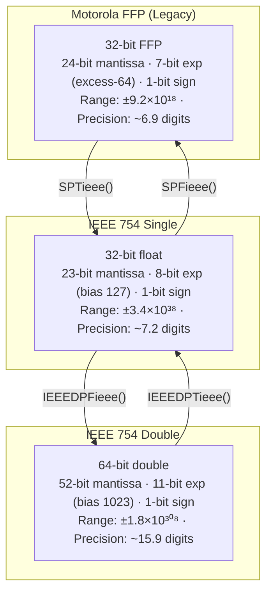
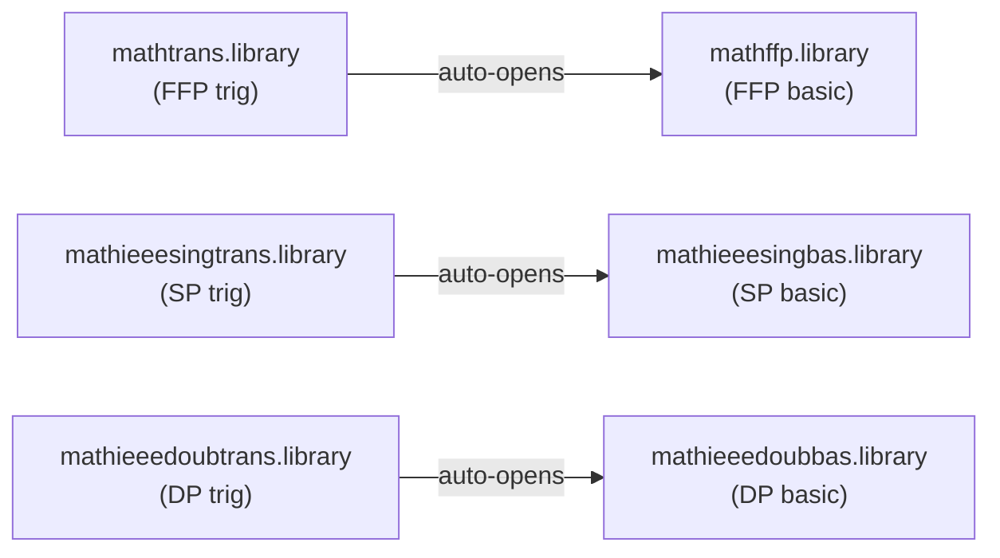
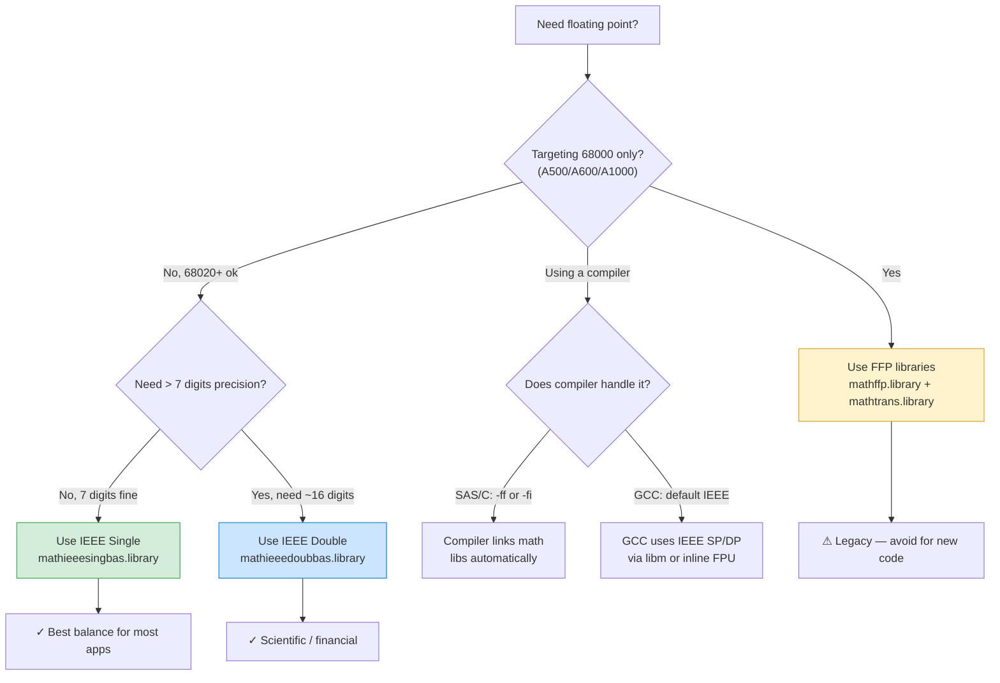
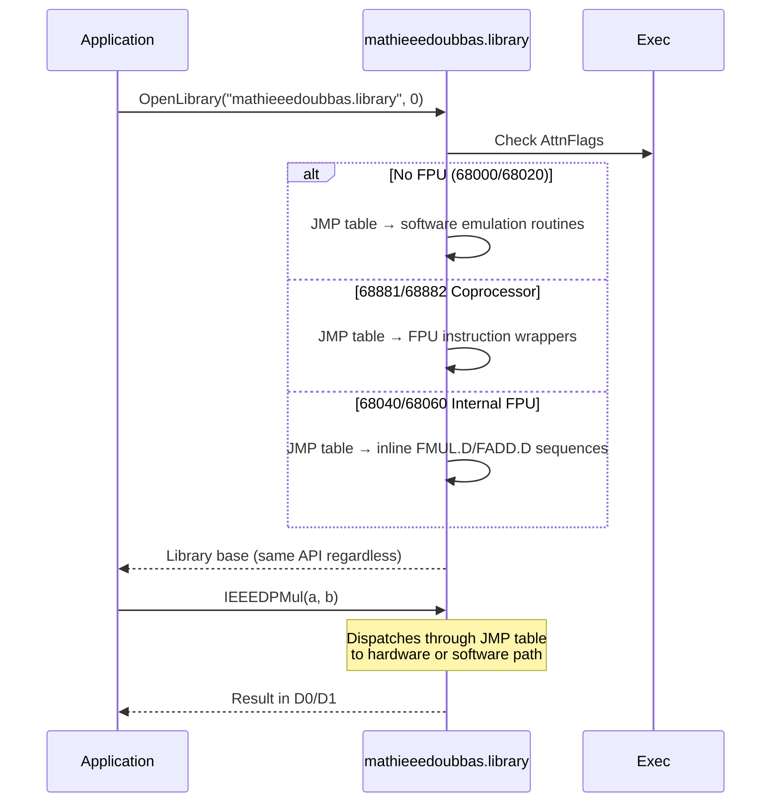
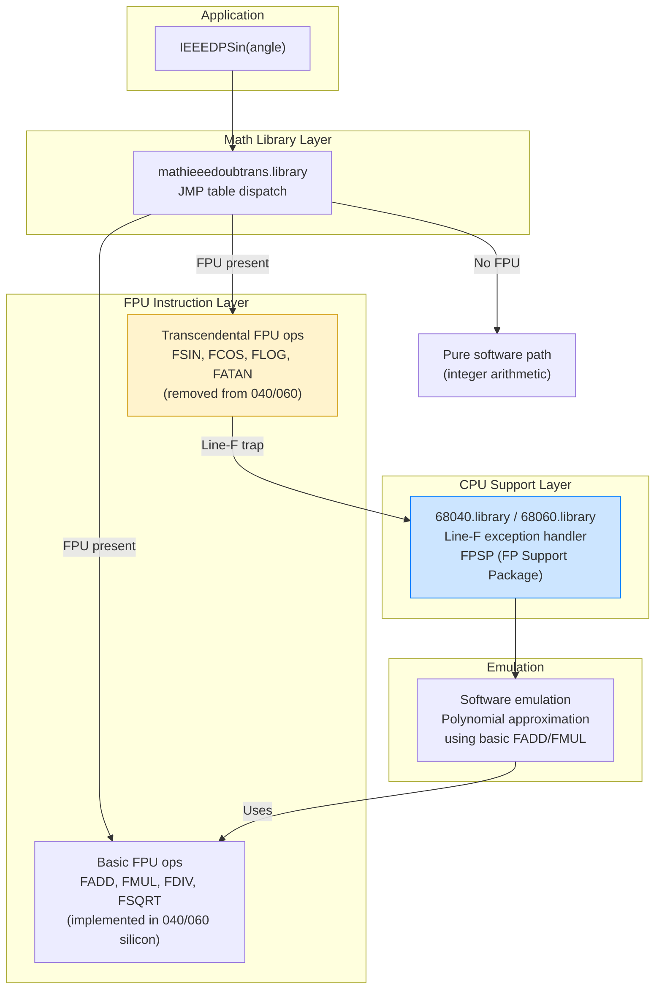
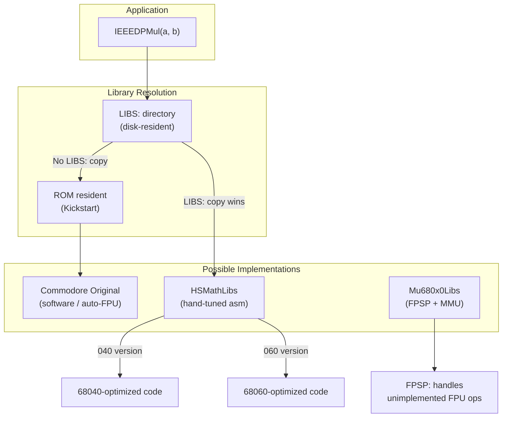

[← Home](../README.md) · [Libraries](README.md)

# Math Libraries — Floating Point Architecture

## Overview

AmigaOS provides a layered floating-point system designed to work transparently across the entire 68k family — from a bare 68000 with no FPU to a 68060 with integrated hardware floating point. The same application binary runs unchanged on all hardware; the libraries detect the CPU/FPU at open time and dispatch to the optimal implementation.

This is one of Amiga's most elegant architectural decisions: **the library JMP table is the abstraction layer**.

---

## The Three Numeric Formats



### Bit Layout Comparison

```
FFP (32-bit):   MMMMMMMM MMMMMMMM MMMMMMMM ESSSSSSS
                ╰── 24-bit mantissa ──╯╰exp╯╰sign╯

IEEE SP (32-bit): SEEEEEEE EMMMMMMM MMMMMMMM MMMMMMMM
                  ╰s╯╰─ 8-bit exp ─╯╰── 23-bit mantissa ──╯

IEEE DP (64-bit): SEEEEEEE EEEEMMMM MMMMMMMM MMMMMMMM
                  MMMMMMMM MMMMMMMM MMMMMMMM MMMMMMMM
                  ╰s╯╰─ 11-bit exp ──╯╰──── 52-bit mantissa ────╯
```

> **FFP is NOT IEEE 754.** It predates the standard. The sign bit is at bit 0, the exponent uses excess-64 encoding, and the mantissa occupies the upper 24 bits. Mixing FFP and IEEE values without conversion causes silent data corruption.

---

## Library Matrix — Six Libraries, Three Formats

| Library | Format | Functions | In ROM? | Base Variable |
|---|---|---|---|---|
| `mathffp.library` | FFP | Basic: add, sub, mul, div, fix, flt | Yes | `MathBase` |
| `mathtrans.library` | FFP | Transcendental: sin, cos, tan, sqrt, exp, log | No (disk) | `MathTransBase` |
| `mathieeesingbas.library` | IEEE SP | Basic arithmetic (V36+) | Yes | `MathIeeeSingBasBase` |
| `mathieeesingtrans.library` | IEEE SP | Transcendentals (V36+) | No (disk) | `MathIeeeSingTransBase` |
| `mathieeedoubbas.library` | IEEE DP | Basic arithmetic | No (disk) | `MathIeeeDoubBasBase` |
| `mathieeedoubtrans.library` | IEEE DP | Transcendentals | No (disk) | `MathIeeeDoubTransBase` |

### Dependency Chain



> **Important:** The transcendental library auto-opens the corresponding basic library. But if you need both, you must explicitly open the basic library yourself to get `MathBase` / `MathIeeeSingBasBase` / `MathIeeeDoubBasBase`.

---

## How to Choose — Developer Decision Guide



### Quick Recommendation

| Scenario | Library | Why |
|---|---|---|
| **New code, any CPU** | IEEE Single (`mathieeesingbas`) | Industry standard, auto-uses FPU when present |
| **Scientific / financial** | IEEE Double (`mathieeedoubbas`) | 15+ digits, no precision loss on long chains |
| **Legacy A500 compatibility** | FFP (`mathffp`) | Only choice for pure 68000 before V36 |
| **Game math (3D, physics)** | IEEE Single or direct FPU asm | Speed-critical — consider inline 68881 code |
| **GCC cross-compiler** | GCC built-in `float`/`double` | GCC generates FPU instructions or links soft-float |

---

## FPU Detection and Transparent Acceleration

When an FPU is present, the IEEE math libraries **automatically replace their JMP table entries** with native FPU instructions. The application sees no API change:

```c
#include <exec/execbase.h>

/* Check FPU type */
if (SysBase->AttnFlags & AFF_68881)   /* 68881 or 68882 coprocessor */
if (SysBase->AttnFlags & AFF_68882)   /* specifically 68882 */
if (SysBase->AttnFlags & AFF_FPU40)   /* 68040 integrated FPU */
if (SysBase->AttnFlags & AFF_68060)   /* 68060 (check for LC variant!) */
```

### What Happens Under the Hood



---

## 68040.library / 68060.library — The CPU Support Layer

The math libraries are only half the story. The 68040 and 68060 **removed hardware microcode** for many FPU instructions that the 68881/68882 coprocessor supported natively. When the math libraries (or user code) execute these instructions on a 040/060, the CPU raises a **Line-F exception**. The CPU support libraries trap this exception and emulate the missing instruction in software.

> **Without `68040.library` or `68060.library`, any transcendental FPU instruction (`FSIN`, `FCOS`, `FLOG`, etc.) causes an immediate Guru Meditation on 040/060 hardware.**

See [68040_68060_libraries.md](../15_fpu_mmu_cache/68040_68060_libraries.md) for the full instruction list and internals.

### The Complete Math Execution Stack



### Library Variants and Sources

| Library | Version | Source | Notes |
|---|---|---|---|
| `68040.library` 37.4 | OS 3.0 | Commodore | Original distribution |
| `68040.library` 40.1 | OS 3.1 | Commodore | Improved precision |
| `68060.library` 40.1 | — | Phase5 | For Blizzard/CyberStorm accelerators |
| `68060.library` 46.x | — | Motorola FPSP reference | Best precision and compatibility |
| `Mu68040.library` | — | Thomas Richter (MMULib) | Enhanced, with MMU support |
| `Mu68060.library` | — | Thomas Richter (MMULib) | Enhanced, with MMU + optimizations |

### Three CPU Flavours

| CPU | FPU | Math Behavior |
|---|---|---|
| **68040** (full) | ✅ Built-in | Basic FPU ops in hardware. Transcendentals trapped → 68040.library |
| **68LC040** | ❌ No FPU | ALL FPU ops trap → needs 68040.library + SoftIEEE or full emulation |
| **68060** (full) | ✅ Built-in | Same as 040 but different removed set. Uses 68060.library |
| **68LC060** | ❌ No FPU | ALL FPU ops trap → needs 68060.library + SoftIEEE |
| **68EC040** | ❌ No FPU/MMU | Same as LC040 but also no MMU |

> **LC = Low Cost** — these were cheaper variants that physically removed the FPU (and sometimes MMU) from the die. Many accelerator cards used LC variants to reduce cost. Applications must handle this gracefully.

### Performance Impact

Software emulation of transcendental FPU instructions through the Line-F trap is **10–100× slower** than the 68881/68882 hardware microcode:

| Operation | 68882 (hardware) | 68040 + 68040.library | Ratio |
|---|---|---|---|
| FSIN | ~200 cycles | ~4000 cycles | ~20× |
| FCOS | ~200 cycles | ~4000 cycles | ~20× |
| FATAN | ~300 cycles | ~6000 cycles | ~20× |
| FLOG | ~400 cycles | ~8000 cycles | ~20× |

Performance-critical code should use lookup tables, CORDIC algorithms, or polynomial approximations instead of relying on FSIN/FCOS in tight loops.

---

## Third-Party Replacement Libraries

The Amiga's library system allows **drop-in replacements** — you simply copy an optimized `.library` to `LIBS:` and it supersedes the ROM version. Several third-party packages exploit this for dramatic speedups.

### HSMathLibs (Matthias Henze)

The most comprehensive third-party math library replacement. Written entirely in hand-tuned assembler for specific CPU targets, achieving significant speedups over Commodore's original code.

| Package | Target CPU | Aminet |
|---|---|---|
| `HSMathLibs_040` | MC68040 | `util/libs/HSMathLibs_040.lha` |
| `HSMathLibs_060` | MC68060 | `util/libs/HSMathLibs_060.lha` |

**Replaces:**
- `mathieeedoubbas.library` — full replacement
- `mathieeedoubtrans.library` — full replacement
- `mathieeesingtrans.library` — full replacement
- `mathtrans.library` — full replacement
- `mathffp.library` — patched (via `mathffp-Patch` command)
- `mathieeesingbas.library` — patched (via `mathieeesingbas-Patch` command)

**Key Properties:**
- Precision equal to or better than Commodore originals
- CPU-specific instruction scheduling (040 vs 060 pipelines differ significantly)
- Includes installer and uninstaller scripts
- Active development through v46.00 (2011)

> **Install the correct version for your CPU.** The 040 and 060 have different pipeline architectures; using the wrong version may be slower than the originals or cause incorrect results.

### Mu680x0Libs / MMULib (Thomas Richter)

Part of the MMULib package, these provide optimized CPU-specific libraries including math support:

| Package | Aminet |
|---|---|
| `Mu680x0Libs` | `util/sys/Mu680x0Libs.lha` |

**Scope:** Primarily CPU support libraries (`68040.library`, `68060.library`) that include proper FPSP (Floating Point Support Package) for unimplemented FPU instructions. While not direct math library replacements, they ensure the hardware FPU is fully operational, which the standard math libraries then leverage.

### SoftIEEE — Virtual FPU for LC/EC Variants

For **68LC040** and **68LC060** processors (cost-reduced variants with no FPU silicon), `SoftIEEE` provides a complete FPU emulator:

| Package | Aminet |
|---|---|
| `SoftIEEE` | `util/libs/SoftIEEE.lha` |

Without SoftIEEE (or equivalent), any code that executes an FPU instruction on an LC variant causes an immediate **Line-F exception** → Guru Meditation. SoftIEEE traps these exceptions and emulates the FPU in software.

### MuRedox — JIT FPU Acceleration

For systems using FPU emulation (LC/EC processors), `MuRedox` provides a JIT (Just-In-Time) compilation approach:

| Package | Aminet |
|---|---|
| `MuRedox` | `util/boot/MuRedox.lha` |

Instead of trapping every FPU instruction via the exception handler, MuRedox patches the calling code in-place on first execution, replacing the FPU instruction with an equivalent software sequence. Subsequent calls skip the exception overhead entirely.

### Replacement Architecture



---

## Register Conventions (Assembly Interface)

All math library functions follow the AmigaOS register calling convention:

### Single Precision / FFP (32-bit)

```asm
; Input:  D0 = argument 1 (IEEE SP or FFP)
;         D1 = argument 2 (for binary ops)
; Output: D0 = result
; Base:   A6 = library base

    MOVEA.L _MathIeeeSingBasBase, A6
    MOVE.L  arg1, D0
    MOVE.L  arg2, D1
    JSR     _LVOIEEESPMul(A6)      ; D0 = arg1 * arg2
```

### Double Precision (64-bit)

```asm
; Input:  D0/D1 = argument 1 (high/low longwords)
;         D2/D3 = argument 2
; Output: D0/D1 = result
; Base:   A6 = library base

    MOVEA.L _MathIeeeDoubBasBase, A6
    MOVEM.L arg1, D0-D1             ; 64-bit value in D0:D1
    MOVEM.L arg2, D2-D3
    JSR     _LVOIEEEDPMul(A6)      ; D0:D1 = arg1 * arg2
```

---

## Complete Function Reference

### Basic Functions (all three formats)

| Function | FFP (`SP*`) | IEEE SP (`IEEESP*`) | IEEE DP (`IEEEDP*`) |
|---|---|---|---|
| Fix to int | `SPFix` | `IEEESPFix` | `IEEEDPFix` |
| Int to float | `SPFlt` | `IEEESPFlt` | `IEEEDPFlt` |
| Compare | `SPCmp` | `IEEESPCmp` | `IEEEDPCmp` |
| Test sign | `SPTst` | `IEEESPTst` | `IEEEDPTst` |
| Absolute | `SPAbs` | `IEEESPAbs` | `IEEEDPAbs` |
| Negate | `SPNeg` | `IEEESPNeg` | `IEEEDPNeg` |
| Add | `SPAdd` | `IEEESPAdd` | `IEEEDPAdd` |
| Subtract | `SPSub` | `IEEESPSub` | `IEEEDPSub` |
| Multiply | `SPMul` | `IEEESPMul` | `IEEEDPMul` |
| Divide | `SPDiv` | `IEEESPDiv` | `IEEEDPDiv` |
| Ceiling | `SPCeil` | `IEEESPCeil` | `IEEEDPCeil` |
| Floor | `SPFloor` | `IEEESPFloor` | `IEEEDPFloor` |

### Transcendental Functions

| Function | FFP (`SP*`) | IEEE SP (`IEEESP*`) | IEEE DP (`IEEEDP*`) |
|---|---|---|---|
| Sine | `SPSin` | `IEEESPSin` | `IEEEDPSin` |
| Cosine | `SPCos` | `IEEESPCos` | `IEEEDPCos` |
| Tangent | `SPTan` | `IEEESPTan` | `IEEEDPTan` |
| Sin+Cos | `SPSincos` | `IEEESPSincos` | `IEEEDPSincos` |
| Arcsine | `SPAsin` | `IEEESPAsin` | `IEEEDPAsin` |
| Arccosine | `SPAcos` | `IEEESPAcos` | `IEEEDPAcos` |
| Arctangent | `SPAtan` | `IEEESPAtan` | `IEEEDPAtan` |
| Sinh | `SPSinh` | `IEEESPSinh` | `IEEEDPSinh` |
| Cosh | `SPCosh` | `IEEESPCosh` | `IEEEDPCosh` |
| Tanh | `SPTanh` | `IEEESPTanh` | `IEEEDPTanh` |
| Exponential | `SPExp` | `IEEESPExp` | `IEEEDPExp` |
| Nat. log | `SPLog` | `IEEESPLog` | `IEEEDPLog` |
| Log base 10 | `SPLog10` | `IEEESPLog10` | `IEEEDPLog10` |
| Power | `SPPow` | `IEEESPPow` | `IEEEDPPow` |
| Square root | `SPSqrt` | `IEEESPSqrt` | `IEEEDPSqrt` |

### Conversion Functions (FFP ↔ IEEE)

| Function | Direction |
|---|---|
| `SPTieee(ffp)` | FFP → IEEE single |
| `SPFieee(ieee)` | IEEE single → FFP |
| `IEEEDPTieee(dp)` | IEEE double → IEEE single |
| `IEEEDPFieee(sp)` | IEEE single → IEEE double |

### String Conversion (FFP only, in `amiga.lib`)

| Function | Purpose |
|---|---|
| `afp(string)` | ASCII → FFP |
| `fpa(ffp, buf)` | FFP → ASCII |
| `arnd(places, exp, buf)` | ASCII rounding |
| `dbf(exp, mantissa)` | Decimal base → FFP |

---

## Compiler Integration

### SAS/C

```
sc MATH=IEEE        ; use IEEE single (default: FFP)
sc MATH=IEEEDP      ; use IEEE double
sc MATH=FFP         ; use FFP (default)
sc MATH=68881       ; direct 68881 code generation (not portable)
```

SAS/C automatically links the correct math library and generates the appropriate `JSR LVO(A6)` calls.

### GCC (vbcc / m68k-amigaos-gcc)

```bash
m68k-amigaos-gcc -m68020 -m68881 prog.c -lm   # hardware FPU
m68k-amigaos-gcc -msoft-float prog.c -lm       # software float
```

GCC uses IEEE format natively. With `-m68881`, it generates inline FPU instructions. Without it, it links a soft-float library.

### vbcc

```bash
vc +aos68k -fpu=68881 prog.c -lmieee           # FPU code
vc +aos68k prog.c -lmieee                       # software IEEE
```

---

## Common Pitfalls

1. **Mixing FFP and IEEE** — FFP and IEEE SP are both 32-bit but have incompatible layouts. Passing an FFP value to an IEEE function (or vice versa) produces garbage. Always convert with `SPTieee()` / `SPFieee()`.

2. **Not opening basic + trans** — If you open `mathtrans.library`, it auto-opens `mathffp.library` internally. But `MathBase` won't be set in your code. If you need both basic and transcendental functions, open both explicitly.

3. **Sharing base pointers between tasks** — Each task must call `OpenLibrary()` independently. The library base may contain per-opener state. Do not share `MathIeeeDoubBasBase` across tasks.

4. **68LC040/060 crashes** — Code that works on full 68040 Gurus on LC variants. Install `SoftIEEE` or equivalent FPSP to trap Line-F exceptions from unimplemented FPU instructions.

5. **HSMathLibs CPU mismatch** — Installing the 040-optimized libraries on a 060 (or vice versa) can cause incorrect results or reduced performance. The pipeline timings are architecturally different.

---

## References

- RKRM: *Libraries Manual* — Math Libraries chapter
- [AmigaOS Wiki: Math Libraries](https://wiki.amigaos.net/wiki/Math_Libraries)
- NDK39: `libraries/mathffp.h`, `libraries/mathieeesp.h`, `libraries/mathieeedp.h`
- HSMathLibs: Aminet `util/libs/HSMathLibs_040.lha`, `util/libs/HSMathLibs_060.lha`
- Mu680x0Libs: Aminet `util/sys/Mu680x0Libs.lha`
- SoftIEEE: Aminet `util/libs/SoftIEEE.lha`
- MuRedox: Aminet `util/boot/MuRedox.lha`
