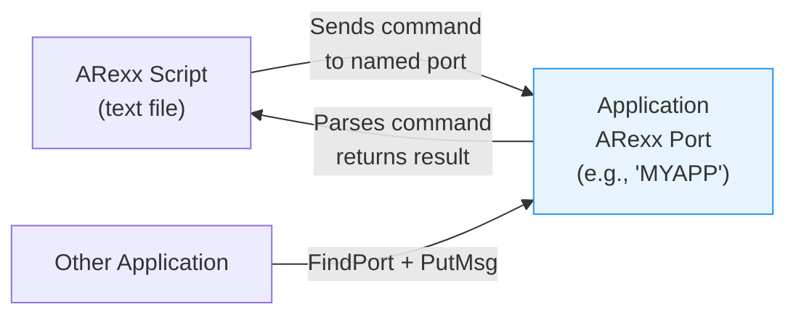

[← Home](../README.md) · [Libraries](README.md)

# rexxsyslib.library — ARexx Scripting Interface

## Overview

ARexx is the Amiga's built-in macro/scripting language (based on IBM's REXX). Any application can host an **ARexx port** to receive commands from scripts and other applications — this is the Amiga's primary inter-application communication mechanism for user-facing scripting.



---

## Adding an ARexx Port to Your Application

```c
#include <rexx/storage.h>
#include <rexx/rxslib.h>

struct MsgPort *arexxPort = CreateMsgPort();
arexxPort->mp_Node.ln_Name = "MYAPP";  /* public port name */
arexxPort->mp_Node.ln_Pri  = 0;
AddPort(arexxPort);  /* make it publicly findable */

/* In your main event loop, combine with IDCMP: */
ULONG arexxSig = 1 << arexxPort->mp_SigBit;
ULONG idcmpSig = 1 << window->UserPort->mp_SigBit;

ULONG sigs = Wait(arexxSig | idcmpSig);

if (sigs & arexxSig)
{
    struct RexxMsg *rmsg;
    while ((rmsg = (struct RexxMsg *)GetMsg(arexxPort)))
    {
        STRPTR cmd = ARG0(rmsg);  /* the command string */

        /* Parse and execute: */
        if (stricmp(cmd, "QUIT") == 0)
        {
            rmsg->rm_Result1 = 0;  /* RC = 0 (success) */
            rmsg->rm_Result2 = 0;
            running = FALSE;
        }
        else if (strnicmp(cmd, "OPEN ", 5) == 0)
        {
            char *filename = cmd + 5;
            LONG rc = OpenFile(filename);
            rmsg->rm_Result1 = rc ? 0 : 10;  /* 0=ok, 10=error */
            rmsg->rm_Result2 = 0;
        }
        else if (stricmp(cmd, "VERSION") == 0)
        {
            rmsg->rm_Result1 = 0;
            /* Return a string result: */
            if (rmsg->rm_Action & RXFF_RESULT)
                rmsg->rm_Result2 = (LONG)CreateArgstring("1.0", 3);
        }
        else
        {
            rmsg->rm_Result1 = 5;  /* RC_WARN — unknown command */
            rmsg->rm_Result2 = 0;
        }

        ReplyMsg((struct Message *)rmsg);
    }
}

/* Cleanup: */
RemPort(arexxPort);
/* Drain remaining messages: */
struct RexxMsg *rmsg;
while ((rmsg = (struct RexxMsg *)GetMsg(arexxPort)))
{
    rmsg->rm_Result1 = 20;  /* RC_FATAL */
    ReplyMsg((struct Message *)rmsg);
}
DeleteMsgPort(arexxPort);
```

---

## Sending ARexx Commands

```c
struct Library *RexxSysBase = OpenLibrary("rexxsyslib.library", 0);

struct MsgPort *replyPort = CreateMsgPort();
struct RexxMsg *rmsg = CreateRexxMsg(replyPort, NULL, "MYAPP");
rmsg->rm_Args[0] = (STRPTR)CreateArgstring("OPEN test.txt", 13);
rmsg->rm_Action  = RXCOMM | RXFF_RESULT;

/* Find the target application's port: */
Forbid();
struct MsgPort *target = FindPort("TARGETAPP");
if (target)
{
    PutMsg(target, &rmsg->rm_Node);
    Permit();
    WaitPort(replyPort);
    GetMsg(replyPort);

    Printf("Return code: %ld\n", rmsg->rm_Result1);
    if (rmsg->rm_Result1 == 0 && rmsg->rm_Result2)
    {
        Printf("Result: %s\n", (char *)rmsg->rm_Result2);
        DeleteArgstring((STRPTR)rmsg->rm_Result2);
    }
}
else
{
    Permit();
    Printf("Target port not found\n");
}

DeleteArgstring(rmsg->rm_Args[0]);
DeleteRexxMsg(rmsg);
DeleteMsgPort(replyPort);
```

---

## ARexx Script Example

```rexx
/* MyScript.rexx — control MYAPP from ARexx */
ADDRESS 'MYAPP'

OPEN 'work:data/image.iff'
IF RC > 0 THEN DO
    SAY 'Failed to open file, RC=' RC
    EXIT 10
END

VERSION
SAY 'App version:' RESULT
QUIT
```

---

## Return Codes

| Value | Constant | Meaning |
|---|---|---|
| 0 | `RC_OK` | Success |
| 5 | `RC_WARN` | Warning (command not understood, etc.) |
| 10 | `RC_ERROR` | Error (command failed) |
| 20 | `RC_FATAL` | Fatal error (port shutting down) |

---

## Common ARexx-Aware Applications

| Application | Port Name | Example Commands |
|---|---|---|
| Workbench | `WORKBENCH` | `OPEN`, `CLOSE`, `WINDOW` |
| MultiView | `MULTIVIEW.n` | `OPEN`, `PRINT`, `QUIT` |
| IBrowse | `IBROWSE` | `GOTOURL`, `RELOAD` |
| CygnusEd | `rexx_ced` | `OPEN`, `SAVE`, `MARK`, `CUT` |
| TextPad | `TEXTPAD` | `LOAD`, `SAVE`, `FIND` |

---

## References

- NDK39: `rexx/storage.h`, `rexx/rxslib.h`
- ADCD 2.1: rexxsyslib.library autodocs
- See also: [process_management.md](../07_dos/process_management.md) — process/task message ports
