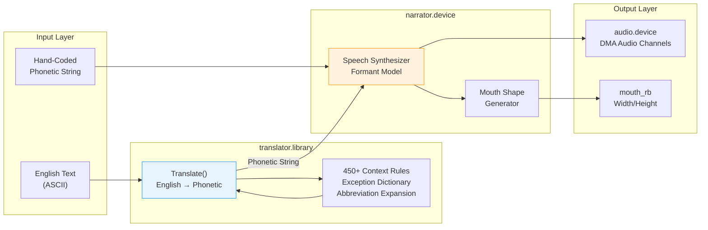

[← Home](../README.md) · [Libraries](README.md)

# translator.library — English-to-Phonetic Translation for Speech Synthesis

## Overview

`translator.library` is the front half of the Amiga's built-in text-to-speech pipeline: a single-function library that converts unrestricted English text into **phonetic strings** — the expanded ARPABET phoneme codes used by `narrator.device` to generate human-like speech through the Amiga's audio hardware. Introduced with AmigaOS 1.2 and distributed as a disk-based library in `LIBS:`, it encapsulates over 450 context-sensitive pronunciation rules, an exception dictionary for irregular words (through, though, cough), abbreviation expansion (Dr., Prof., lb.), and automatic content-word accentuation — all in a single call: `Translate()`. The output is a string of space-delimited phoneme codes with stress markers that can be passed directly to `narrator.device` via `CMD_WRITE`, stored for later playback, or analyzed for phonetic research. While hand-coded phonetics always produce higher-quality speech, `Translate()` is the only practical option when the input is arbitrary user text at runtime.

---

## Architecture

### The Amiga Speech Pipeline



### Library Base

| Name | Type | Description |
|---|---|---|
| `TranslatorBase` | `struct Library *` | Library base pointer returned by `OpenLibrary()` |
| `ITranslator` | Interface pointer (OS 4.x+) | Interface-based access for AmigaOS 4+ |

`translator.library` is a **disk-based** library — it lives in `LIBS:translator.library`, not in ROM. This means `OpenLibrary()` can fail if the file is missing, and the library can be expunged from memory under low-memory conditions.

### Key Design Decisions

| Decision | Rationale |
|---|---|
| **Single-function API** | Translation is inherently stateless — input text, output phonetics. No session, no configuration |
| **Disk-based, not ROM** | Phonetic dictionary is large (~20+ KB of rules); keeping it out of ROM saves Kickstart space |
| **Negative return codes for overflow** | Allows progressive translation of long texts without pre-allocating a huge buffer |
| **Rule-based, not neural** | 1985 technology couldn't run a neural TTS; the 450 context-sensitive rules were state-of-the-art for the era |

---

## API Reference

### Opening and Closing

```c
/* Classic AmigaOS (1.x–3.x) — LVO -30 */
struct Library *TranslatorBase;

TranslatorBase = OpenLibrary("translator.library", 0);
if (!TranslatorBase) { /* LIBS:translator.library not found */ }

/* ... use Translate() ... */

CloseLibrary(TranslatorBase);
```

```c
/* AmigaOS 4.x — Interface-based */
struct Library *TranslatorBase;
struct TranslatorIFace *ITranslator;

TranslatorBase = IExec->OpenLibrary("translator.library", 0);
if (TranslatorBase)
{
    ITranslator = (struct TranslatorIFace *)
        IExec->GetInterface(TranslatorBase, "main", 1, NULL);
    if (ITranslator)
    {
        /* ... use ITranslator->Translate() ... */
    }
    IExec->DropInterface((struct Interface *)ITranslator);
}
IExec->CloseLibrary(TranslatorBase);
```

### Translate()

```c
/* LVO -36 — Converts English text to phonetic string */
LONG Translate(STRPTR input,     /* a0: English input string */
               LONG   inputLen,   /* d0: length of input */
               STRPTR output,    /* a1: output buffer for phonetics */
               LONG   outputSize  /* d0: size of output buffer */);
```

| Parameter | Description |
|---|---|
| `input` | Null-terminated or length-delimited English ASCII string. Case-insensitive; punctuation is preserved where it affects pronunciation |
| `inputLen` | Number of characters to translate from `input`. Use `strlen(input)` for the full string |
| `output` | Pre-allocated buffer to receive the phonetic string. **Must be large enough** — phonetics are typically 2–4× the input length |
| `outputSize` | Size of the output buffer in bytes |

**Return value:**

| Return | Meaning |
|---|---|
| `0` | Full translation succeeded; output buffer was large enough |
| **Negative** value | Buffer overflow — translation stopped at a word boundary. `-(rtnCode)` is the character offset in the input string where translation ended. Resume by calling `Translate(input + offset, inputLen - offset, output, outputSize)` |
| Other non-zero | Translation error (unlikely — the library tries to translate literally if rules fail) |

> [!NOTE]
> The negative return value always stops at a **word boundary** (space or punctuation), not mid-word. This prevents split phonemes and makes resumption seamless.

### Output Format

The output is a space-delimited string of **ARPABET phoneme codes** with **stress markers** appended to vowels:

```
Input:  "This is Amiga speaking."
Output: "DH IH1 Z   IH1 Z   AE1 M IH0 G AH0   S P IY1 K IH0 NG ."
        └─ "This" ─┘ └"is"─┘ └─── "Amiga" ───┘ └─── "speaking" ───┘
```

| Marker | Meaning | Example |
|---|---|---|
| `0` | No stress (unstressed vowel) | `IH0` = unstressed "i" (as in "rabbit") |
| `1` | Primary stress | `IY1` = stressed "ee" (as in "speak") |
| `2` | Secondary stress | `OW2` = secondary "oh" (as in "overflow") |
| `3` | Emphatic stress (rare) | Used for contrastive emphasis |

---

## Phonetic Output Examples

| English Input | Phonetic Output (approx.) |
|---|---|
| `Hello world.` | `HH EH0 L OW1   W ER1 L D .` |
| `The quick brown fox.` | `DH AH0   K W IH1 K   B R AW1 N   F AA1 K S .` |
| `Amiga` | `AE1 M IH0 G AH0` or `AH0 M IY1 G AH0` (both valid) |
| `Commodore` | `K AA1 M AH0 D AO1 R` |
| `Guru Meditation` | `G UH1 R UW0   M EH2 D IH0 T EY1 SH AH0 N` |

> [!WARNING]
> The translator library was designed for **American English** pronunciation. British spellings (colour, centre) and non-English words will be translated using American phonetic rules and may sound odd.

---

## Integration with narrator.device

The standard workflow:

```c
#include <devices/narrator.h>
#include <clib/translator_protos.h>

/* 1. Open translator */
struct Library *TranslatorBase = OpenLibrary("translator.library", 0);

/* 2. Open narrator device */
struct MsgPort *mp = CreatePort(NULL, 0);
struct narrator_rb *voiceIO = (struct narrator_rb *)
    CreateExtIO(mp, sizeof(struct narrator_rb));
OpenDevice("narrator.device", 0, (struct IORequest *)voiceIO, 0);

/* 3. Translate English → phonetic */
#define PHONBUF_SIZE 2048
STRPTR english = "Welcome to the Amiga speech system.";
UBYTE phonBuffer[PHONBUF_SIZE];
LONG result = Translate(english, strlen(english),
                        (STRPTR)phonBuffer, PHONBUF_SIZE);

if (result == 0)
{
    /* 4. Configure voice parameters */
    voiceIO->rate     = 150;   /* words per minute */
    voiceIO->pitch    = 110;   /* Hz baseline */
    voiceIO->sex      = 0;     /* 0=male, 1=female */
    voiceIO->volume   = 64;    /* 0–64 */
    voiceIO->sampfreq = 22200; /* Hz (Amiga native rate) */

    /* 5. Send to narrator */
    voiceIO->message.io_Command = CMD_WRITE;
    voiceIO->message.io_Data    = phonBuffer;
    voiceIO->message.io_Length  = strlen((STRPTR)phonBuffer);
    DoIO((struct IORequest *)voiceIO);
}

/* 6. Cleanup */
CloseDevice((struct IORequest *)voiceIO);
DeleteExtIO((struct IORequest *)voiceIO);
DeletePort(mp);
CloseLibrary(TranslatorBase);
```

---

## When to Use / When NOT to Use

| Scenario | Use `Translate()`? | Rationale |
|---|---|---|
| **Unrestricted user input** (text editor, terminal, chat) | ✅ Yes | Only practical option — you can't pre-code phonetics for arbitrary text |
| **Fixed application strings** (game dialog, error messages) | ❌ No | Hand-code phonetics once; ship the phonetic strings. Much better quality |
| **Accessibility screen reader** | ✅ Yes | Essential — must speak whatever is on screen |
| **Demo/game with iconic lines** | ❌ No | Hand-tune phonetics, stress, and timing for maximum impact |
| **Multi-language support** | ❌ No | translator.library is English-only; use a third-party TTS or pre-recorded samples |
| **Phonetic research/analysis** | ⚠️ Maybe | Output is useful for analysis but not linguistically rigorous — use as a starting point |
| **Speaking numbers/dates** | ⚠️ Maybe | Library handles some abbreviations but not all; pre-process complex formats into spelled-out words |

---

## Pitfalls & Common Mistakes

### 1. Underestimating Phonetic Buffer Size

The phonetic representation is **always longer** than the input English. A 100-character sentence typically produces 300–500 bytes of phonetics:

```c
/* BAD: Same-sized buffer — will overflow on first long word */
UBYTE phonBuf[256];
STRPTR english = "The extraordinarily complicated implementation...";
LONG result = Translate(english, strlen(english), (STRPTR)phonBuf, 256);
/* result will be negative — phonetic for "extraordinarily" alone is ~40 chars */

/* CORRECT: Allocate 4× input length, minimum 512 bytes */
#define PHONBUF_SIZE(maxInput) (((maxInput) * 4) + 512)
UBYTE *phonBuf = AllocMem(PHONBUF_SIZE(strlen(english)), MEMF_ANY);
```

### 2. Ignoring Negative Return Code

A negative return from `Translate()` is a **resumption offset**, not a fatal error:

```c
/* BAD: Treats partial translation as failure */
LONG rtn = Translate(text, len, buf, size);
if (rtn != 0) { /* panic — but text was partially translated! */ }

/* CORRECT: Resume from offset on negative return */
LONG offset = 0;
while (offset < len)
{
    LONG rtn = Translate(text + offset, len - offset, buf, BUF_SIZE);
    if (rtn == 0) break;                    /* done */
    if (rtn < 0) offset += (-rtn);          /* resume from word boundary */
    else { /* unexpected error */ break; }
}
```

### 3. Passing Non-Null-Terminated Input with Wrong Length

If `inputLen` doesn't match the actual string, `Translate()` reads garbage or stops early:

```c
/* BAD: strlen() on a buffer that may not be null-terminated */
UBYTE buf[256];
Read(fh, buf, 256);                 /* may fill entire buffer — no terminator */
Translate((STRPTR)buf, strlen((STRPTR)buf), out, 1024);
/* strlen() may read past the buffer! */

/* CORRECT: Use the explicit read count */
LONG actual = Read(fh, buf, 256);
Translate((STRPTR)buf, actual, out, 1024);
```

### 4. Not Checking for Missing Disk-Based Library

Unlike ROM libraries, `translator.library` may not be present:

```c
/* BAD: Assumes library is always available */
struct Library *TranslatorBase = OpenLibrary("translator.library", 0);
Translate("Hello", 5, buf, 512);  /* crash if TranslatorBase == NULL! */

/* CORRECT: Always check the return */
struct Library *TranslatorBase = OpenLibrary("translator.library", 0);
if (TranslatorBase)
{
    Translate("Hello", 5, buf, 512);
    CloseLibrary(TranslatorBase);
}
else
{
    Printf("Speech not available — translator.library missing\n");
}
```

---

## Named Antipatterns

### "The Mumbler" — Unrealistic Rate/Pitch

Setting `rate` extremely high makes speech unintelligible, but the translator itself has nothing to do with it — the problem is feeding valid phonetics to a misconfigured narrator:

```c
/* BAD: Chipmunk speech */
voiceIO->rate  = 400;   /* 400 words/min — unintelligible */
voiceIO->pitch = 255;   /* extremely high pitch */

/* Sensible defaults: */
voiceIO->rate  = 150;   /* natural conversational speed */
voiceIO->pitch = 110;   /* male baseline (85–110 for male, 160–220 for female) */
voiceIO->sex   = 0;     /* 0=male, 1=female */
```

### "The Silent Speaker" — Mismatched Audio Allocation

The narrator device must allocate audio channels. If another application holds all four channels, `OpenDevice("narrator.device", ...)` succeeds but speech may not be audible:

```c
/* BAD: No check on audio channel availability */
OpenDevice("narrator.device", 0, (struct IORequest *)voiceIO, 0);
/* Speech may be silent if audio channels are all in use */

/* CORRECT: Set channel mask to request specific channels */
UBYTE chanMasks[] = { 0x03, 0x0C, 0x30, 0xC0 };  /* try channels 0-1, 2-3, 4-5, 6-7 */
voiceIO->ch_masks = chanMasks;
voiceIO->nm_masks = 4;
```

### "The Echo" — Forgetting io_Data Nesting

When you send a `CMD_WRITE` to the narrator device, the `io_Data` pointer must remain valid until the I/O completes. Using a stack buffer with `DoIO()` is fine (blocking); using `SendIO()` (asynchronous) with a stack buffer is not:

```c
/* BAD: Stack buffer with async I/O */
void SpeakAsync(STRPTR text)
{
    UBYTE phonBuf[512];                              /* stack — disappears on return! */
    Translate(text, strlen(text), (STRPTR)phonBuf, 512);
    voiceIO->message.io_Data = phonBuf;
    SendIO((struct IORequest *)voiceIO);             /* async — phonBuf gone when this returns */
}

/* CORRECT: Allocate or use static buffer for async */
UBYTE phonBuf[2048];  /* static — stays valid */
void SpeakAsync(STRPTR text)
{
    Translate(text, strlen(text), (STRPTR)phonBuf, sizeof(phonBuf));
    voiceIO->message.io_Data = phonBuf;
    SendIO((struct IORequest *)voiceIO);
    /* phonBuf lives until AbortIO or CMD_FLUSH */
}
```

---

## FAQ

**Q: Can I use translator.library without narrator.device?**

Yes. The phonetic output is a plain ASCII string — you can save it, analyze it, send it over a network, or use it as input to a custom speech synthesizer. The translator and narrator are independent.

**Q: Why does the same word sometimes translate differently?**

The translator uses **context-sensitive** rules. The pronunciation of "read" depends on surrounding tense markers; "record" as a noun vs. verb gets different stress. The same word in different sentences may produce different phonetics — this is correct behavior.

**Q: How do I make the narrator sound female?**

Set `voiceIO->sex = 1` (female). This adjusts formant frequencies and baseline pitch. For manual fine-tuning, adjust `voiceIO->pitch` (160–220 Hz for female) and `voiceIO->F1adj` through `F3adj` (formant shifts).

**Q: Can translator.library handle multiple languages?**

No. The rule set and exception dictionary are English-only. German, French, or other languages will be treated as misspelled English and produce garbled phonetics. Use locale-specific TTS solutions for non-English speech.

**Q: How big is the output buffer really needed?**

Empirically, 4× the input length plus a 512-byte safety margin. The longest single English word phonetics (like "supercalifragilisticexpialidocious") is roughly 80 characters from 34 input characters. A typical sentence expands 2.5–3×.

**Q: Does Translate() handle punctuation?**

Yes. Punctuation marks (`.`, `,`, `?`, `!`, `;`, `:`) are passed through to the phonetic output. The narrator device interprets them as prosody cues: `.` = falling intonation, `?` = rising intonation.

---

## Use-Case Cookbook

### 1. Simple One-Shot Speech

The blocking pattern — suitable for alert messages, game notifications, short announcements:

```c
void Say(STRPTR english)
{
    struct Library *TranslatorBase = OpenLibrary("translator.library", 0);
    if (!TranslatorBase) return;

    UBYTE phonBuf[2048];
    LONG rtn = Translate(english, strlen(english),
                        (STRPTR)phonBuf, sizeof(phonBuf));
    if (rtn == 0)
    {
        struct MsgPort *mp = CreatePort(NULL, 0);
        struct narrator_rb *vio = (struct narrator_rb *)
            CreateExtIO(mp, sizeof(struct narrator_rb));

        if (OpenDevice("narrator.device", 0, (struct IORequest *)vio, 0) == 0)
        {
            vio->rate     = 150;
            vio->pitch    = 110;
            vio->volume   = 64;
            vio->sampfreq = 22200;

            vio->message.io_Command = CMD_WRITE;
            vio->message.io_Data    = phonBuf;
            vio->message.io_Length  = strlen((STRPTR)phonBuf);
            DoIO((struct IORequest *)vio);

            CloseDevice((struct IORequest *)vio);
        }
        DeleteExtIO((struct IORequest *)vio);
        DeletePort(mp);
    }
    CloseLibrary(TranslatorBase);
}

/* Usage: */
Say("Game over. Insert coin to continue.");
```

### 2. Animated Talking Head (with Mouth Shapes)

The narrator can generate mouth width/height data while speaking:

```c
/* Open two I/O requests — one for speech, one for mouth data */
struct narrator_rb *voiceIO = /* ... */;
struct mouth_rb   *mouthIO = (struct mouth_rb *)
    CreateExtIO(mp, sizeof(struct mouth_rb));

/* Enable mouth shape generation */
voiceIO->mouths = 1;  /* non-zero = generate mouth data */

/* Send speech command */
voiceIO->message.io_Command = CMD_WRITE;
voiceIO->message.io_Data    = phonBuf;
voiceIO->message.io_Length  = strlen((STRPTR)phonBuf);
SendIO((struct IORequest *)voiceIO);

/* While speaking, read mouth shapes */
while (!CheckIO((struct IORequest *)voiceIO))
{
    mouthIO->voice.message.io_Command = CMD_READ;
    mouthIO->voice.message.io_Data    = phonBuf;  /* same buffer — narrator correlates */
    mouthIO->voice.message.io_Length  = strlen((STRPTR)phonBuf);
    DoIO((struct IORequest *)mouthIO);

    /* mouthIO->width  = 0..255 (closed → wide open) */
    /* mouthIO->height = 0..255 (closed → wide open) */
    AnimateMouth(mouthIO->width, mouthIO->height);
}
```

### 3. Progressive Translation of Long Text

For documents or long-form text where a single 2 KB buffer won't suffice:

```c
LONG TranslateLongText(STRPTR text, LONG totalLen, BPTR outputFH)
{
    UBYTE phonBuf[2048];
    LONG offset = 0;

    while (offset < totalLen)
    {
        LONG bytesAvail = totalLen - offset;
        LONG rtn = Translate(text + offset, bytesAvail,
                            (STRPTR)phonBuf, sizeof(phonBuf));

        if (rtn == 0)
        {
            /* Final chunk — write and done */
            LONG phonLen = strlen((STRPTR)phonBuf);
            Write(outputFH, phonBuf, phonLen);
            break;
        }
        else if (rtn < 0)
        {
            /* Write completed portion, resume at word boundary */
            LONG phonLen = strlen((STRPTR)phonBuf);
            Write(outputFH, phonBuf, phonLen);
            offset += (-rtn);
        }
        else
        {
            /* unexpected error */
            return rtn;
        }
    }
    return 0;
}
```

---

## Modern Analogies

| Amiga Concept | Modern Equivalent | Why It Maps | Where It Diverges |
|---|---|---|---|
| **translator.library** | macOS `NSSpeechSynthesizer` / Windows SAPI Text-to-Speech | Both accept English text and produce speech. The API philosophy — text in, audio out — is identical | Modern APIs bundle translation and synthesis; Amiga splits them into library (translate) and device (speak) |
| **ARPABET phonemes** | IPA (International Phonetic Alphabet) | Both encode pronunciation as discrete symbols. ARPABET is a machine-readable subset of IPA | ARPABET is English-only; IPA is universal. ARPABET uses ASCII, IPA uses Unicode |
| **450 context-sensitive rules** | Modern TTS neural networks (Tacotron, FastSpeech) | Both learn pronunciation from data — rules are a 1985 hand-crafted "model" | Neural TTS requires gigabytes of training data; rule-based works with zero training |
| **narrator.device formant synthesis** | Vocaloid / singing synthesis | Both use formant models (F0, F1, F2...) to generate vocal sounds | Narrator.device is a 1985-era 8-bit formant synth; Vocaloid uses concatenative sampling + ML |
| **`Say` command / `speak:` handler** | `say` command on macOS / `espeak` on Linux | Both provide command-line text-to-speech | Amiga `Say` feeds translator.library → narrator.device; macOS `say` uses a system-wide speech server |

---

## References

- ADCD 2.1: *ROM Kernel Reference Manual: Libraries* — Chapter 36: Translator Library
- ADCD 2.1: *ROM Kernel Reference Manual: Devices* — Chapter 8: Narrator Device
- NDK 3.9: `devices/narrator.h` — `narrator_rb` and `mouth_rb` structures
- NDK 3.9: `clib/translator_protos.h` — `Translate()` prototype
- AmigaOS Documentation Wiki: [Narrator Device](https://wiki.amigaos.net/wiki/Narrator_Device) — complete phoneme table and phonetic writing guide
- AmigaOS Documentation Wiki: [Translator Library](https://wiki.amigaos.net/wiki/Translator_Library) — OS 4.x interface reference
- See also: [audio.md](../10_devices/audio.md) — audio.device DMA channel allocation used by narrator
- See also: [iffparse.md](iffparse.md) — IFF FTXT parsing (the AmigaGuide format sometimes wraps speech metadata in IFF chunks)
