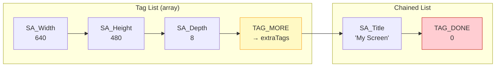

[← Home](../README.md) · [Libraries](README.md)

# utility.library — TagItems, Hooks, Date Utilities

## Overview

`utility.library` (OS 2.0+) provides the universal tag-based parameter passing system, callback hooks, and date/time utilities used throughout AmigaOS. Nearly every OS 2.0+ API uses TagItem lists for extensible parameter passing — understanding this library is essential.

---

## TagItem System

### Structure

```c
/* utility/tagitem.h — NDK39 */
struct TagItem {
    ULONG ti_Tag;   /* tag identifier */
    ULONG ti_Data;  /* tag value (ULONG — often cast from pointer) */
};
```

### Special Tags

| Tag | Value | Purpose |
|---|---|---|
| `TAG_DONE` | 0 | Terminates a tag list — must be the last entry |
| `TAG_IGNORE` | 1 | Skip this tag (placeholder) |
| `TAG_MORE` | 2 | `ti_Data` = pointer to another TagItem array (chain lists) |
| `TAG_SKIP` | 3 | Skip next `ti_Data` tags in the list |
| `TAG_USER` | `1<<31` | User-defined tags start at this value |

### How Tag Lists Work



```c
/* Typical usage: */
struct Screen *scr = OpenScreenTags(NULL,
    SA_Width,     640,
    SA_Height,    480,
    SA_Depth,     8,
    SA_Title,     (ULONG)"My Screen",
    SA_ShowTitle, TRUE,
    TAG_DONE);

/* Tag list as array: */
struct TagItem tags[] = {
    { SA_Width,  640 },
    { SA_Height, 480 },
    { SA_Depth,  8 },
    { TAG_DONE,  0 }
};
struct Screen *scr = OpenScreenTagList(NULL, tags);
```

### Tag Utility Functions

| Function | Description |
|---|---|
| `FindTagItem(tag, tagList)` | Find first matching tag; returns `TagItem *` or NULL |
| `GetTagData(tag, default, tagList)` | Get tag value, or default if tag not found |
| `NextTagItem(&tagListPtr)` | Iterator — handles TAG_MORE, TAG_SKIP, TAG_IGNORE transparently |
| `TagInArray(tag, array)` | Check if a tag ID is in a ULONG array |
| `FilterTagItems(tagList, filter, logic)` | Remove/keep tags matching a filter array |
| `CloneTagItems(tagList)` | Allocate a copy of the entire tag list |
| `FreeTagItems(tagList)` | Free a cloned tag list |
| `MapTags(tagList, mapList, flags)` | Remap tag IDs (for converting between APIs) |
| `PackBoolTags(initialFlags, tagList, boolMap)` | Convert boolean tags to a flags word |

### Iterating a Tag List

```c
/* The correct way to iterate — handles all special tags: */
struct TagItem *tag;
struct TagItem *tstate = tagList;

while ((tag = NextTagItem(&tstate)))
{
    switch (tag->ti_Tag)
    {
        case MY_WIDTH:  width  = tag->ti_Data; break;
        case MY_HEIGHT: height = tag->ti_Data; break;
        case MY_TITLE:  title  = (char *)tag->ti_Data; break;
    }
}
```

> [!IMPORTANT]
> **Never iterate tag lists manually** with `for` loops. Always use `NextTagItem()` — it correctly handles `TAG_MORE` chains, `TAG_SKIP`, and `TAG_IGNORE`. Manual iteration will break on chained or filtered lists.

---

## Hook System

Hooks provide a standardised callback mechanism used throughout AmigaOS — Intuition, BOOPSI, layers.library, and locale.library all use them.

### Structure

```c
/* utility/hooks.h */
struct Hook {
    struct MinNode  h_MinNode;     /* for linking into lists */
    ULONG         (*h_Entry)(void);   /* assembler entry point */
    ULONG         (*h_SubEntry)(void); /* C function pointer */
    APTR            h_Data;            /* user data */
};
```

### Register Convention

When a hook is called, registers are set up as:
- **A0** = pointer to the `Hook` itself
- **A2** = the "object" (context-dependent)
- **A1** = the "message" (context-dependent)

```c
/* SAS/C / GCC with register args: */
ULONG __saveds __asm MyHookFunc(
    register __a0 struct Hook *hook,
    register __a2 APTR object,
    register __a1 APTR message)
{
    struct MyData *data = (struct MyData *)hook->h_Data;
    /* ... process callback ... */
    return 0;
}

/* Initialise the hook: */
struct Hook myHook;
myHook.h_Entry    = (HOOKFUNC)HookEntry;  /* utility.library glue */
myHook.h_SubEntry = (HOOKFUNC)MyHookFunc;
myHook.h_Data     = myPrivateData;
```

### Common Hook Uses

| API | Object (A2) | Message (A1) |
|---|---|---|
| BOOPSI `OM_SET` | BOOPSI object | `opSet` message |
| `InstallLayerHook` | Layer | `struct BackFillMessage` |
| Locale `FormatString` | — | Format data |
| `DoMethod` (MUI) | MUI object | Method message |

---

## Date Utilities

```c
#include <utility/date.h>

struct ClockData {
    UWORD sec;    /* 0–59 */
    UWORD min;    /* 0–59 */
    UWORD hour;   /* 0–23 */
    UWORD mday;   /* 1–31 */
    UWORD month;  /* 1–12 */
    UWORD year;   /* 1978+ */
    UWORD wday;   /* 0=Sunday */
};

/* Convert Amiga timestamp to date components: */
struct ClockData cd;
Amiga2Date(seconds, &cd);
Printf("%02d/%02d/%04d %02d:%02d:%02d\n",
       cd.mday, cd.month, cd.year,
       cd.hour, cd.min, cd.sec);

/* Convert date to Amiga timestamp: */
cd.year = 2024; cd.month = 3; cd.mday = 15;
cd.hour = 14; cd.min = 30; cd.sec = 0;
ULONG secs = Date2Amiga(&cd);

/* Validate a date and get timestamp: */
ULONG secs = CheckDate(&cd);  /* returns 0 if invalid */
```

> [!NOTE]
> The Amiga epoch is **January 1, 1978 00:00:00 UTC**. To convert to/from Unix timestamps (epoch 1970-01-01), add/subtract **252,460,800** seconds (8 years + 2 leap days).

---

## References

- NDK39: `utility/tagitem.h`, `utility/hooks.h`, `utility/date.h`
- ADCD 2.1: utility.library autodocs
- See also: [boopsi.md](../09_intuition/boopsi.md) — BOOPSI uses hooks extensively
