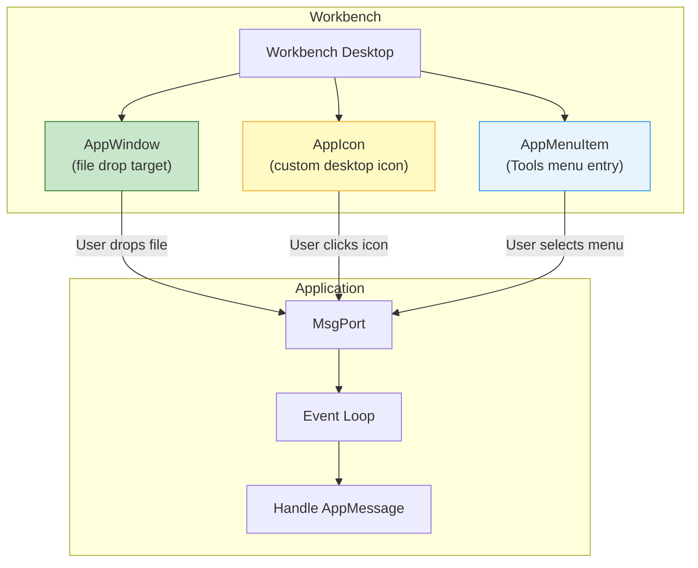

[← Home](../README.md) · [Libraries](README.md)

# workbench.library — Workbench Integration

## Overview

`workbench.library` provides APIs for interacting with the Workbench desktop environment: receiving startup arguments, registering **AppWindows** (drag-and-drop targets), **AppIcons** (desktop icons), and **AppMenuItems** (Workbench Tools menu entries).



---

## WBStartup Message

When launched from Workbench (double-click an icon), the program receives a `WBStartup` message instead of CLI arguments:

```c
struct WBStartup {
    struct Message sm_Message;
    struct MsgPort *sm_Process;   /* process that sent us */
    BPTR   sm_Segment;            /* our loaded segment list */
    LONG   sm_NumArgs;            /* number of arguments (1 = just the tool) */
    char  *sm_ToolWindow;         /* tool window spec (CON: string) */
    struct WBArg *sm_ArgList;     /* array of arguments */
};

struct WBArg {
    BPTR   wa_Lock;    /* directory lock (BPTR) */
    BYTE  *wa_Name;    /* filename (relative to wa_Lock) */
};
```

### Handling WBStartup

```c
/* In main(): */
struct WBStartup *wbmsg = NULL;

if (argc == 0)
{
    /* Launched from Workbench — get the startup message: */
    struct Process *me = (struct Process *)FindTask(NULL);
    WaitPort(&me->pr_MsgPort);
    wbmsg = (struct WBStartup *)GetMsg(&me->pr_MsgPort);

    /* ArgList[0] = the tool itself (our icon) */
    /* ArgList[1..n] = files the user shift-clicked or dropped on us */

    /* CD to the tool's directory for file access: */
    BPTR oldDir = CurrentDir(wbmsg->sm_ArgList[0].wa_Lock);

    /* Process dropped files: */
    for (int i = 1; i < wbmsg->sm_NumArgs; i++)
    {
        BPTR dir = wbmsg->sm_ArgList[i].wa_Lock;
        char *name = wbmsg->sm_ArgList[i].wa_Name;
        BPTR old = CurrentDir(dir);
        /* ... open and process file 'name' ... */
        CurrentDir(old);
    }

    /* Read our ToolTypes: */
    struct DiskObject *dobj = GetDiskObject(wbmsg->sm_ArgList[0].wa_Name);
    if (dobj)
    {
        char *pubscreen = FindToolType(dobj->do_ToolTypes, "PUBSCREEN");
        FreeDiskObject(dobj);
    }

    CurrentDir(oldDir);
}

/* ... main program logic ... */

/* MUST reply before exiting: */
if (wbmsg)
{
    Forbid();
    ReplyMsg((struct Message *)wbmsg);
}
```

> [!CAUTION]
> You **must** reply the WBStartup message before exiting, and you **must** call `Forbid()` before `ReplyMsg()`. If you reply without Forbid, Workbench may unload your code segment before your process finishes exiting → crash.

---

## AppWindow — File Drop Target

Register a window to receive files when the user drags icons to it:

```c
struct MsgPort *appPort = CreateMsgPort();

/* Register the window: */
struct AppWindow *appWin = AddAppWindow(
    1,            /* ID (your choice — returned in AppMessage) */
    0,            /* user data */
    window,       /* the Intuition Window */
    appPort,      /* port for AppMessages */
    NULL);        /* tags (NULL = defaults) */

/* In event loop: */
struct AppMessage *amsg;
while ((amsg = (struct AppMessage *)GetMsg(appPort)))
{
    for (int i = 0; i < amsg->am_NumArgs; i++)
    {
        BPTR old = CurrentDir(amsg->am_ArgList[i].wa_Lock);
        Printf("Dropped: %s\n", amsg->am_ArgList[i].wa_Name);
        /* ... open and process file ... */
        CurrentDir(old);
    }
    ReplyMsg((struct Message *)amsg);
}

/* Cleanup: */
RemoveAppWindow(appWin);
DeleteMsgPort(appPort);
```

---

## AppIcon — Desktop Icon

Place a custom icon on the Workbench desktop:

```c
struct DiskObject *icon = GetDiskObject("PROGDIR:myapp");

struct AppIcon *appIcon = AddAppIcon(
    1,            /* ID */
    0,            /* user data */
    "My App",     /* label under the icon */
    appPort,      /* port for messages */
    NULL,         /* lock (NULL = Workbench root) */
    icon,         /* the icon imagery */
    NULL);        /* tags */

/* When user double-clicks or drops files on the AppIcon: */
/* → AppMessage received on appPort (same as AppWindow) */

RemoveAppIcon(appIcon);
FreeDiskObject(icon);
```

---

## AppMenuItem — Tools Menu Entry

Add an entry to the Workbench "Tools" menu:

```c
struct AppMenuItem *appMenu = AddAppMenuItem(
    1,            /* ID */
    0,            /* user data */
    "My Tool",    /* menu text */
    appPort,      /* port for messages */
    NULL);        /* tags */

/* When user selects the menu item: */
/* → AppMessage received, am_NumArgs=0 (no file args) */

RemoveAppMenuItem(appMenu);
```

---

## References

- NDK39: `workbench/workbench.h`, `workbench/startup.h`
- ADCD 2.1: workbench.library autodocs
- See also: [icon.md](icon.md) — icon.library for reading .info files and ToolTypes
