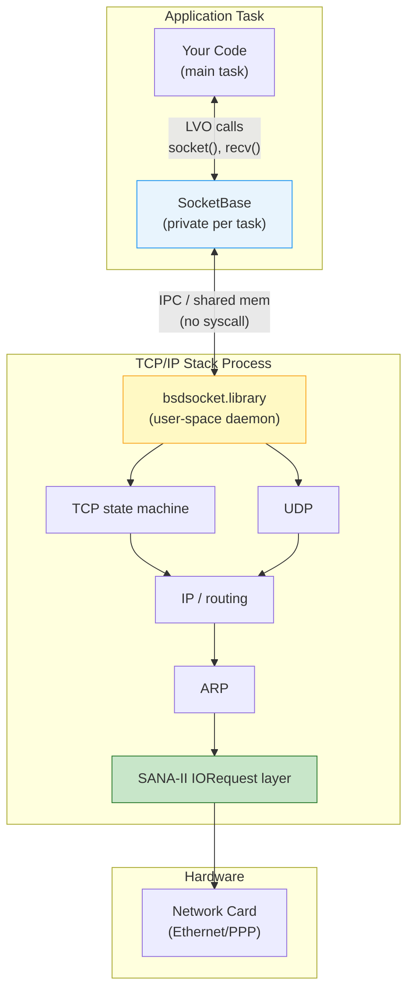

[← Home](../README.md) · [Networking](README.md)

# bsdsocket.library — BSD Sockets on AmigaOS: Event Loops, WaitSelect, and Non-Blocking I/O

## Overview

`bsdsocket.library` is the AmigaOS implementation of the BSD socket API, provided by third-party TCP/IP stacks (AmiTCP, Miami, Roadshow). Unlike Unix where sockets are kernel-managed file descriptors accessed via system calls, Amiga sockets live entirely in user space — each task opens its own private library base with isolated socket state. This means **no context switches** for socket operations, but also **no memory protection** between the application and the stack.

The defining feature of the Amiga socket API is [`WaitSelect()`](#waitselect-deep-dive) — a `select()` replacement that simultaneously waits on socket I/O **and** Exec signal bits (window events, timers, ARexx). A single event loop handles network, GUI, and timing without threads — a design that made responsive networked applications possible on a 7 MHz 68000.

Key constraints:
- **Per-task `SocketBase`** — never share between tasks; each task must `OpenLibrary` its own copy
- **Big-endian** — all multi-byte network values are Motorola byte order; `htons()` / `htonl()` are no-ops but must still be used for portability
- **No IPv6** — classic Amiga stacks are IPv4-only
- **User-space stack** — any crash in the stack process (or a misbehaving app) can corrupt socket state for the entire system

---

## Architecture

### Where bsdsocket.library Sits



### The Per-Task Library Base Model

Every task that calls `OpenLibrary("bsdsocket.library", ...)` receives a **distinct library base** with its own socket descriptor table, error state, and tag configuration. There is no global fd table in kernel space. This is elegant for cooperative multitasking but fragile:

| Aspect | Unix Kernel Socket | Amiga bsdsocket.library |
|---|---|---|
| API entry | System call (trap) | Library call (JSR through LVO) |
| fd table | Per-process, kernel-managed | Per-opener, in stack process memory |
| Context switch | Yes (user→kernel→user) | No — stays in user space |
| Cross-task sharing | fd inherited on fork | **Forbidden** — each task needs own `SocketBase` |
| Protection | Memory-isolated kernel | None — stack runs in user space |
| Crash impact | Kernel panic (rare) | Stack dies, all sockets lost |

> [!WARNING]
> `bsdsocket.library` runs in the same address space as your application. A stray write through a bad pointer can corrupt the TCP state machine. Use Enforcer or a memory-protected emulator when debugging network code.

---

## Per-Task Setup

### Opening the Library and Configuring Error Handling

```c
/* proto/socket.h, netinet/in.h — stack-provided headers */
#include <proto/socket.h>
#include <netinet/in.h>

struct Library *SocketBase = NULL;
LONG myErrno = 0;

BOOL initNetwork(void)
{
    /* Minimum API version: 4 covers all functions used here */
    SocketBase = OpenLibrary("bsdsocket.library", 4);
    if (!SocketBase)
    {
        Printf("No TCP/IP stack running. Start AmiTCP, Miami, or Roadshow.\n");
        return FALSE;
    }

    /* Route errno into our own variable so we can use it like Unix errno */
    SocketBaseTags(
        SBTM_SETVAL(SBTC_ERRNOPTR(sizeof(LONG))), (ULONG)&myErrno,
        SBTM_SETVAL(SBTC_LOGTAGPTR),              (ULONG)"MyApp",
        TAG_DONE);

    return TRUE;
}

void cleanupNetwork(void)
{
    if (SocketBase)
    {
        CloseLibrary(SocketBase);
        SocketBase = NULL;
    }
}
```

> [!CAUTION]
> **Never share `SocketBase` between tasks.** Each task MUST `OpenLibrary` its own copy. Sharing causes socket state corruption and random crashes. This is the #1 Amiga networking bug.

---

## Data Structures

### Socket Address

```c
/* netinet/in.h */
struct sockaddr_in {
    UBYTE       sin_len;        /* V39+ Roadshow; 0 on older stacks */
    UBYTE       sin_family;     /* AF_INET */
    UWORD       sin_port;       /* Network byte order — use htons() */
    struct in_addr sin_addr;    /* IP address in network byte order */
    UBYTE       sin_zero[8];    /* Padding to match struct sockaddr */
};

struct in_addr {
    ULONG       s_addr;         /* Big-endian 32-bit IPv4 address */
};
```

### fd_set and timeval

```c
/* sys/time.h */
struct timeval {
    LONG tv_sec;        /* seconds */
    LONG tv_usec;       /* microseconds */
};

/* sys/socket.h */
#define FD_SETSIZE  64

typedef struct fd_set {
    ULONG fds_bits[FD_SETSIZE / 32];   /* Bitmap of descriptors */
} fd_set;

#define FD_ZERO(set)        /* clear all bits */
#define FD_SET(fd, set)     /* set bit for fd */
#define FD_CLR(fd, set)     /* clear bit for fd */
#define FD_ISSET(fd, set)   /* test bit for fd */
```

> [!NOTE]
> `FD_SETSIZE` is typically 64 on Amiga stacks. If you need more concurrent sockets, check your stack's headers — Roadshow may support larger values. The `nfds` parameter to `WaitSelect` is the **highest socket number + 1**, not the count of sockets.

---

## API Reference

### Core Socket Lifecycle

| LVO | Function | Description |
|---|---|---|
| −30 | `socket(domain, type, protocol)` | Create a socket descriptor |
| −36 | `bind(sock, addr, addrlen)` | Bind to local address/port |
| −42 | `listen(sock, backlog)` | Mark socket as passive listener |
| −48 | `accept(sock, addr, addrlen)` | Accept incoming connection |
| −54 | `connect(sock, addr, addrlen)` | Initiate outgoing connection |
| −174 | `CloseSocket(sock)` | Close a socket (NOT `close()`) |
| −84 | `shutdown(sock, how)` | Partially close (send/receive/both) |

### Data Transfer

| LVO | Function | Description |
|---|---|---|
| −66 | `send(sock, buf, len, flags)` | Send on connected socket |
| −60 | `sendto(sock, buf, len, flags, addr, addrlen)` | Send datagram to address |
| −78 | `recv(sock, buf, len, flags)` | Receive from connected socket |
| −72 | `recvfrom(sock, buf, len, flags, from, fromlen)` | Receive datagram with source |

### I/O Multiplexing and Control

| LVO | Function | Description |
|---|---|---|
| −180 | `WaitSelect(nfds, rd, wr, ex, timeout, sigmask)` | `select()` + Exec signal integration |
| −186 | `IoctlSocket(d, request, argp)` | Socket control (FIONBIO, FIONREAD, etc.) |
| −90 | `setsockopt(...)` | Set socket options |
| −96 | `getsockopt(...)` | Get socket options |

### Name Resolution

| LVO | Function | Description |
|---|---|---|
| −102 | `gethostbyname(name)` | Resolve hostname to IP (blocking) |
| −108 | `gethostbyaddr(addr, len, type)` | Reverse DNS lookup |
| −210 | `inet_addr(cp)` | Parse dotted-decimal string to `in_addr` |
| −216 | `Inet_NtoA(in)` | Format `in_addr` to dotted-decimal string |
| −252 | `getservbyname(name, proto)` | Resolve service name to port |

### Error and Configuration

| LVO | Function | Description |
|---|---|---|
| −168 | `Errno()` | Return last error code for this task |
| −270 | `SocketBaseTagList(tags)` | Configure per-task behavior |

---

## WaitSelect Deep Dive

`WaitSelect()` is the single most important function in Amiga network programming. It replaces both Unix `select()` and the need for threads in most applications.

```c
LONG WaitSelect(LONG nfds,
                fd_set *readfds, fd_set *writefds, fd_set *exceptfds,
                struct timeval *timeout,
                ULONG *sigmask);
```

### The Bidirectional Sigmask

The `sigmask` parameter is **bidirectional** — a pattern unique to AmigaOS:

- **On entry**: `*sigmask` contains the Exec signal bits you also want to wait for (e.g., window port signal, Ctrl-C, timer signal)
- **On exit**: `*sigmask` contains which of those signals actually fired

```c
ULONG sigmask = winSig | timerSig | SIGBREAKF_CTRL_C;

LONG result = WaitSelect(maxFd + 1, &readfds, NULL, NULL, &tv, &sigmask);

/* sigmask now tells us WHICH non-socket events occurred */
if (sigmask & winSig)    { /* handle window events */ }
if (sigmask & timerSig)  { /* handle timer tick */ }
if (sigmask & SIGBREAKF_CTRL_C) { running = FALSE; }
```

### Timeout Behavior and the Reinitialization Requirement

> [!WARNING]
> `WaitSelect` may **modify** the `struct timeval` you pass in, decrementing it by the elapsed time (like POSIX `select`). You must **reinitialize `timeout` before every call**. Reusing the same struct after a timeout will eventually collapse to zero and cause busy-polling.

```c
/* CORRECT: reinitialize timeout every iteration */
while (running)
{
    struct timeval tv;
    tv.tv_sec  = 1;   /* 1 second */
    tv.tv_usec = 0;

    fd_set rfds = masterReadSet;  /* copy, because WaitSelect modifies */
    ULONG sigmask = mySignals;

    LONG n = WaitSelect(maxFd + 1, &rfds, NULL, NULL, &tv, &sigmask);
    /* ... */
}
```

### Return Value Semantics

| Return | Meaning |
|---|---|
| `> 0` | Number of socket descriptors ready |
| `0` | Timeout expired — no sockets ready, no signals received |
| `< 0` | Error — call `Errno()` to get code (`EINTR`, `EBADF`, etc.) |

### The fd_set Destruction Rule

Like POSIX `select()`, `WaitSelect` **modifies** the `fd_set` arguments. Only descriptors that are ready remain set. You must reinitialize or copy your fd_sets on every call.

```c
/* WRONG: reusing the same fd_set without re-init */
FD_SET(sock, &readfds);
while (running) {
    WaitSelect(sock + 1, &readfds, NULL, NULL, &tv, &sigmask);
    /* After first success, readfds is modified! */
}

/* CORRECT: rebuild or copy each iteration */
while (running) {
    fd_set rfds;
    FD_ZERO(&rfds);
    FD_SET(sock, &rfds);
    WaitSelect(sock + 1, &rfds, NULL, NULL, &tv, &sigmask);
}
```

---

## Event Loop Patterns

### Pattern 1: Single Socket + GUI (The Classic)

A responsive client application that handles both network data and window events without threads:

```c
ULONG winSig  = 1L << window->UserPort->mp_SigBit;
ULONG ctrlSig = SIGBREAKF_CTRL_C;
BOOL running  = TRUE;

while (running)
{
    struct timeval tv = { 1, 0 };   /* 1 second timeout */
    fd_set rfds;
    FD_ZERO(&rfds);
    FD_SET(sock, &rfds);

    ULONG sigmask = winSig | ctrlSig;

    LONG n = WaitSelect(sock + 1, &rfds, NULL, NULL, &tv, &sigmask);

    if (n > 0 && FD_ISSET(sock, &rfds))
    {
        char buf[4096];
        LONG got = recv(sock, buf, sizeof(buf) - 1, 0);
        if (got > 0)
        {
            buf[got] = '\0';
            /* Process network data */
        }
        else if (got == 0)
        {
            /* Peer closed connection */
            running = FALSE;
        }
        else /* got < 0 */
        {
            LONG err = Errno();
            if (err != EINTR)
            {
                Printf("recv error: %ld\n", err);
                running = FALSE;
            }
        }
    }

    if (sigmask & winSig)
    {
        struct IntuiMessage *imsg;
        while ((imsg = (struct IntuiMessage *)GetMsg(window->UserPort)))
        {
            switch (imsg->Class)
            {
                case IDCMP_CLOSEWINDOW:
                    running = FALSE;
                    break;
                /* ... other IDCMP classes ... */
            }
            ReplyMsg((struct Message *)imsg);
        }
    }

    if (sigmask & ctrlSig)
    {
        Printf("*** Break\n");
        running = FALSE;
    }
}
```

### Pattern 2: Multi-Socket Server with Dynamic Clients

A TCP server that accepts new connections and monitors all clients in one loop:

```c
#define MAX_CLIENTS 16

struct Client {
    LONG sock;
    BOOL active;
} clients[MAX_CLIENTS] = {0};

LONG listenSock;
ULONG winSig, ctrlSig;
BOOL running = TRUE;

while (running)
{
    fd_set rfds;
    FD_ZERO(&rfds);
    FD_SET(listenSock, &rfds);
    LONG maxFd = listenSock;

    for (int i = 0; i < MAX_CLIENTS; i++)
    {
        if (clients[i].active)
        {
            FD_SET(clients[i].sock, &rfds);
            if (clients[i].sock > maxFd) maxFd = clients[i].sock;
        }
    }

    struct timeval tv = { 0, 500000 };  /* 500ms */
    ULONG sigmask = winSig | ctrlSig;

    LONG n = WaitSelect(maxFd + 1, &rfds, NULL, NULL, &tv, &sigmask);

    /* Accept new connection? */
    if (n > 0 && FD_ISSET(listenSock, &rfds))
    {
        struct sockaddr_in clientAddr;
        LONG addrLen = sizeof(clientAddr);
        LONG newSock = accept(listenSock,
                              (struct sockaddr *)&clientAddr, &addrLen);
        if (newSock >= 0)
        {
            int added = 0;
            for (int i = 0; i < MAX_CLIENTS; i++)
            {
                if (!clients[i].active)
                {
                    clients[i].sock   = newSock;
                    clients[i].active = TRUE;
                    added = 1;
                    break;
                }
            }
            if (!added)
            {
                Printf("Server full, dropping connection\n");
                CloseSocket(newSock);
            }
        }
    }

    /* Check client sockets */
    for (int i = 0; i < MAX_CLIENTS; i++)
    {
        if (clients[i].active && FD_ISSET(clients[i].sock, &rfds))
        {
            char buf[1024];
            LONG got = recv(clients[i].sock, buf, sizeof(buf), 0);
            if (got > 0)
            {
                /* Echo back */
                send(clients[i].sock, buf, got, 0);
            }
            else
            {
                /* Disconnect or error */
                CloseSocket(clients[i].sock);
                clients[i].active = FALSE;
            }
        }
    }

    /* Handle window events / Ctrl-C ... */
}
```

### Pattern 3: Three-Source Loop (Socket + Timer + GUI)

Add a `timer.device` IORequest for periodic tasks (keepalive pings, timeouts, animation frames):

```c
/* Setup timer device (see timer.md for full details) */
struct timerequest *tr;
struct MsgPort *timerPort = CreateMsgPort();
/* OpenDevice(TIMERNAME, UNIT_MICROHZ, (struct IORequest *)tr, 0) ... */

ULONG timerSig = 1L << timerPort->mp_SigBit;
ULONG winSig   = 1L << window->UserPort->mp_SigBit;

while (running)
{
    /* Re-queue timer for next tick */
    tr->tr_time.tv_secs  = 0;
    tr->tr_time.tv_micro = 16667;  /* ~60 Hz */
    SendIO((struct IORequest *)tr);

    fd_set rfds;
    FD_ZERO(&rfds);
    FD_SET(sock, &rfds);

    struct timeval tv = { 5, 0 };  /* 5 second safety timeout */
    ULONG sigmask = winSig | timerSig | SIGBREAKF_CTRL_C;

    LONG n = WaitSelect(sock + 1, &rfds, NULL, NULL, &tv, &sigmask);

    if (n > 0 && FD_ISSET(sock, &rfds))
    {
        /* Handle socket data */
    }

    if (sigmask & timerSig)
    {
        WaitIO((struct IORequest *)tr);  /* reclaim IORequest */
        /* 60 Hz tick: update UI, send keepalive, etc. */
    }

    if (sigmask & winSig) { /* handle IDCMP */ }
}
```

---

## Non-Blocking Async I/O

### Setting Non-Blocking Mode

Use `IoctlSocket()` with `FIONBIO` to enable non-blocking I/O:

```c
ULONG on = 1;
if (IoctlSocket(sock, FIONBIO, (char *)&on) < 0)
{
    Printf("IoctlSocket(FIONBIO) failed: %ld\n", Errno());
}
```

> [!NOTE]
> Non-blocking UDP sockets work reliably on all stacks. Non-blocking TCP is supported by Miami and Roadshow; early AmiTCP versions had issues with non-blocking TCP `connect()`. Test on your target stack.

### The Non-Blocking Connect Pattern

A blocking `connect()` can hang for minutes on an unreachable host. The non-blocking pattern:

```c
/* 1. Create non-blocking socket */
LONG sock = socket(AF_INET, SOCK_STREAM, 0);
ULONG on = 1;
IoctlSocket(sock, FIONBIO, (char *)&on);

/* 2. Initiate connection (will likely return EINPROGRESS) */
LONG rc = connect(sock, (struct sockaddr *)&sa, sizeof(sa));
if (rc < 0 && Errno() != EINPROGRESS)
{
    Printf("connect failed immediately: %ld\n", Errno());
    CloseSocket(sock);
    return;
}

/* 3. Wait for writable with timeout */
fd_set wfds;
struct timeval tv = { 10, 0 };  /* 10 second timeout */

FD_ZERO(&wfds);
FD_SET(sock, &wfds);

rc = WaitSelect(sock + 1, NULL, &wfds, NULL, &tv, NULL);
if (rc > 0 && FD_ISSET(sock, &wfds))
{
    /* 4. Check SO_ERROR to confirm success */
    LONG so_err = 0;
    LONG optlen = sizeof(so_err);
    getsockopt(sock, SOL_SOCKET, SO_ERROR, (char *)&so_err, &optlen);

    if (so_err == 0)
    {
        Printf("Connected!\n");
        /* Optionally restore blocking mode */
        ULONG off = 0;
        IoctlSocket(sock, FIONBIO, (char *)&off);
    }
    else
    {
        Printf("Connection failed: %ld\n", so_err);
        CloseSocket(sock);
    }
}
else if (rc == 0)
{
    Printf("Connection timeout\n");
    CloseSocket(sock);
}
```

### Handling EWOULDBLOCK

With non-blocking sockets, `send()` and `recv()` return `-1` with `EWOULDBLOCK` (or `EAGAIN`) when the operation would block:

```c
LONG n = recv(sock, buf, sizeof(buf), 0);
if (n < 0)
{
    LONG err = Errno();
    if (err == EWOULDBLOCK || err == EAGAIN)
    {
        /* No data ready — normal for non-blocking */
        /* Will be picked up by next WaitSelect cycle */
    }
    else
    {
        /* Real error */
    }
}
```

---

## DNS Resolution

`gethostbyname()` is **synchronous and blocking** — it does not return until the DNS response arrives (or times out). On Amiga this typically takes 2–5 seconds per failed query.

```c
struct hostent *he = gethostbyname("www.amiga.org");
if (he)
{
    struct in_addr addr;
    CopyMem(he->h_addr, &addr, sizeof(addr));
    Printf("Host: %s  IP: %s\n", he->h_name, Inet_NtoA(addr.s_addr));

    /* Multiple addresses are common for load balancing */
    char **p;
    for (p = he->h_addr_list; *p; p++)
    {
        CopyMem(*p, &addr, sizeof(addr));
        Printf("  Addr: %s\n", Inet_NtoA(addr.s_addr));
    }
}
else
{
    /* gethostbyname does not set errno — use h_errno equivalent
     * On Amiga, check Errno() anyway; some stacks set it.
     */
    Printf("DNS lookup failed (errno=%ld)\n", Errno());
}
```

> [!WARNING]
> `gethostbyname()` returns a pointer to a **static buffer** owned by the stack. The result is valid only until the next call to `gethostbyname()` or `gethostbyaddr()` in the same task. Copy the address data before calling again.

---

## Decision Guides

### Blocking vs Non-Blocking vs WaitSelect

| Approach | When to Use | Caveats |
|---|---|---|
| **Blocking** | Simple scripts, single-connection tools | GUI freezes; no signal handling during I/O |
| **Non-blocking + WaitSelect** | GUI apps, servers, multi-socket code | More complex; must handle `EWOULDBLOCK` |
| **WaitSelect only (blocking sockets)** | Most Amiga applications | Simpler logic; `WaitSelect` tells you when data is ready |

### Do I Need Threads?

Almost never on AmigaOS. `WaitSelect` + signals provides the same concurrency model as `select()` + event loop on Unix. Threads add complexity in a non-memory-protected OS where a crash in any task brings down the system.

| Scenario | Amiga Approach |
|---|---|
| Handle GUI while downloading | `WaitSelect` on socket + window port |
| Timeout a slow connect | Non-blocking `connect` + `WaitSelect` on writefds |
| Server with many clients | Single loop monitoring all sockets in `readfds` |
| Background file transfer | Separate task with its own `SocketBase`, communicate via MsgPort |

---

## Historical Context & Modern Analogies

### Why Amiga Went User-Space

When the Amiga launched in 1985, TCP/IP was an academic curiosity. By the early 1990s, Commodore had added no networking to the OS — the `bsdsocket.library` model emerged from third-party developers (AmiTCP, 1991) who had to work within the existing Exec architecture. Running the stack as a user-space process was not a design choice but a necessity: there was no kernel to extend.

Surprisingly, this had advantages:
- **No syscall overhead** — socket calls are simple JSR instructions
- **Stack swapability** — users could switch between AmiTCP, Miami, and Roadshow without rebooting (in some cases)
- **No kernel panics** — a stack crash doesn't bring down the OS (though it kills all network state)

And disadvantages:
- **Zero protection** — any program can corrupt the stack's memory
- **No kernel buffer cache** — data copies between stack and app add overhead
- **Single-address-space fragility** — the 68000 has no MMU on most models

### Competitive Landscape (1992–1996)

| Platform | Networking Model | Socket API |
|---|---|---|
| Amiga | User-space stack (bsdsocket) | BSD sockets via library |
| Atari ST | No standard; STiNG / MiNT later | MiNT had BSD sockets in kernel |
| Macintosh | MacTCP (user-space) | MacTCP API (not BSD) |
| DOS | Trumpet/WATTCP packet drivers | BSD-like but fragmented |
| Windows 3.1 | Winsock 1.1 (user DLL) | BSD-compatible |
| Linux 1.0 | Kernel TCP/IP | True BSD sockets |

The Amiga's approach was most similar to MacTCP and Winsock — both user-space networking layers — but unlike those, AmigaOS had no OS vendor providing the stack. Third-party competition drove rapid innovation (Miami's GUI, Roadshow's stability) but also fragmentation.

### Modern Analogies

| Amiga Concept | Modern Equivalent | Analogy Strength |
|---|---|---|
| `WaitSelect` + signals | `epoll`/`kqueue` + event loop | Strong — single-threaded multiplexing |
| `bsdsocket.library` | `libuv`, `libevent` | Moderate — both user-space, but libuv is a library not a daemon |
| Per-task `SocketBase` | Thread-local storage | Weak — TLS is per-thread, SocketBase is per-opener |
| SANA-II device | NDIS / Linux net_device | Strong — standardized driver interface |
| User-space stack | DPDK, netmap | Moderate — both bypass kernel, but DPDK is for performance |

The key insight for modern developers: Amiga network programming feels like writing an `epoll`-based server in C on Linux, except there's no kernel boundary. The mental model of "register descriptors with a multiplexer, then dispatch events" translates directly.

---

## Practical Examples

### Complete Non-Blocking HTTP Client with Timeout

```c
#include <proto/exec.h>
#include <proto/dos.h>
#include <proto/socket.h>
#include <netinet/in.h>
#include <sys/time.h>

struct Library *SocketBase = NULL;
LONG myErrno = 0;

LONG httpGet(const char *host, UWORD port, const char *path)
{
    LONG sock = socket(AF_INET, SOCK_STREAM, 0);
    if (sock < 0) return -1;

    /* Non-blocking connect with 10-second timeout */
    ULONG nb = 1;
    IoctlSocket(sock, FIONBIO, (char *)&nb);

    struct hostent *he = gethostbyname(host);
    if (!he) { CloseSocket(sock); return -1; }

    struct sockaddr_in sa = {0};
    sa.sin_family = AF_INET;
    sa.sin_port   = htons(port);
    CopyMem(he->h_addr, &sa.sin_addr, he->h_length);

    LONG rc = connect(sock, (struct sockaddr *)&sa, sizeof(sa));
    if (rc < 0 && myErrno != EINPROGRESS)
    {
        CloseSocket(sock);
        return -1;
    }

    /* Wait for connection */
    fd_set wfds;
    FD_ZERO(&wfds);
    FD_SET(sock, &wfds);
    struct timeval tv = { 10, 0 };

    rc = WaitSelect(sock + 1, NULL, &wfds, NULL, &tv, NULL);
    if (rc <= 0 || !FD_ISSET(sock, &wfds))
    {
        CloseSocket(sock);
        return -1;
    }

    LONG so_err = 0;
    LONG optlen = sizeof(so_err);
    getsockopt(sock, SOL_SOCKET, SO_ERROR, (char *)&so_err, &optlen);
    if (so_err != 0) { CloseSocket(sock); return -1; }

    /* Restore blocking for simple send/recv */
    nb = 0;
    IoctlSocket(sock, FIONBIO, (char *)&nb);

    /* Send request */
    char req[256];
    snprintf(req, sizeof(req),
             "GET %s HTTP/1.0\r\nHost: %s\r\n\r\n", path, host);
    send(sock, req, strlen(req), 0);

    /* Receive response */
    char buf[4096];
    LONG total = 0;
    LONG n;
    while ((n = recv(sock, buf, sizeof(buf) - 1, 0)) > 0)
    {
        buf[n] = '\0';
        Printf("%s", buf);
        total += n;
    }

    CloseSocket(sock);
    return total;
}

int main(void)
{
    SocketBase = OpenLibrary("bsdsocket.library", 4);
    if (!SocketBase) {
        Printf("No TCP/IP stack\n");
        return 20;
    }
    SocketBaseTags(
        SBTM_SETVAL(SBTC_ERRNOPTR(sizeof(LONG))), (ULONG)&myErrno,
        TAG_DONE);

    httpGet("www.example.com", 80, "/");

    CloseLibrary(SocketBase);
    return 0;
}
```

---

## When to Use / When NOT to Use

### When to Use bsdsocket.library

- Any Amiga application that communicates over TCP/IP or UDP
- GUI applications that must remain responsive during network I/O — `WaitSelect` makes this natural
- Servers handling up to a few dozen concurrent connections — the single-event-loop model scales well here
- Applications integrating network I/O with IDCMP, ARexx, or timer events

### When NOT to Use bsdsocket.library

- **High-throughput file transfers** — the user-space stack with 680x0 CPU copying can bottleneck below 1 MB/s even on Fast Ethernet. Consider SANA-II direct frame access for custom protocols.
- **Real-time streaming** — `WaitSelect` timer granularity and stack latency introduce jitter. For 50/60 Hz synchronized data, use UDP with carefully sized buffers or bypass TCP entirely.
- **IPv6 networks** — classic Amiga stacks do not support IPv6. For dual-stack environments, use a NAT64 gateway or run a modern TCP/IP stack under emulation.
- **Memory-constrained 512 KB systems** — the TCP/IP stack itself consumes 100–300 KB. On unexpanded A500 systems, networking is impractical.

---

## Best Practices & Antipatterns

### Best Practices

1. Always open `bsdsocket.library` at version 4 or higher for full API coverage
2. Always configure `SBTC_ERRNOPTR` so you can read errors like Unix `errno`
3. Always use `CloseSocket()`, never AmigaDOS `Close()` — sockets are not file handles
4. Always reinitialize `struct timeval` before each `WaitSelect` call
5. Always copy `fd_set` structures before passing to `WaitSelect`; the function modifies them
6. Always check `SO_ERROR` after a non-blocking `connect` succeeds in `writefds`
7. Always call `CloseSocket()` on every socket before `CloseLibrary(SocketBase)`
8. Copy `gethostbyname()` results immediately — the returned pointer is to static stack memory
9. Use `SIGBREAKF_CTRL_C` in your `WaitSelect` sigmask for clean shutdown
10. Test on your target stack (AmiTCP vs Miami vs Roadshow) — behavior varies subtly

### Named Antipatterns

#### "The Shared SocketBase" — Passing SocketBase Between Tasks

```c
/* BAD: Task A opens, Task B uses */
struct Library *SocketBase;  /* global */

/* Task A */
SocketBase = OpenLibrary("bsdsocket.library", 4);

/* Task B (separate task!) */
socket(AF_INET, SOCK_STREAM, 0);  /* Crash or silent corruption */
```

```c
/* CORRECT: Each task opens its own */
/* Task A */
struct Library *sbA = OpenLibrary("bsdsocket.library", 4);

/* Task B */
struct Library *sbB = OpenLibrary("bsdsocket.library", 4);
```

#### "The Stale fd_set" — Reusing fd_set After WaitSelect

```c
/* BAD */
FD_SET(sock, &readfds);
while (running) {
    WaitSelect(sock + 1, &readfds, NULL, NULL, &tv, &sigmask);
    /* After first iteration, readfds is destroyed! */
}
```

```c
/* CORRECT */
while (running) {
    fd_set rfds;
    FD_ZERO(&rfds);
    FD_SET(sock, &rfds);
    WaitSelect(sock + 1, &rfds, NULL, NULL, &tv, &sigmask);
}
```

#### "The select() Refugee" — Using close() Instead of CloseSocket()

```c
/* BAD: Unix habit */
close(sock);   /* Closes an AmigaDOS file handle, not the socket! */

/* CORRECT */
CloseSocket(sock);
```

#### "The Forgotten Timeout Reset" — Collapsing tv to Zero

```c
/* BAD */
struct timeval tv = { 1, 0 };
while (running) {
    WaitSelect(..., &tv, ...);  /* tv becomes {0, 0} after first timeout */
    /* Now busy-polls at 100% CPU! */
}
```

```c
/* CORRECT */
while (running) {
    struct timeval tv = { 1, 0 };  /* fresh each iteration */
    WaitSelect(..., &tv, ...);
}
```

#### "The Phantom Hostent" — Keeping gethostbyname Result Past Next Call

```c
/* BAD */
struct hostent *he = gethostbyname("foo.com");
/* ... later ... */
struct hostent *he2 = gethostbyname("bar.com");
/* he->h_addr is now invalid — may point to bar.com's data! */
CopyMem(he->h_addr, &addr, sizeof(addr));
```

```c
/* CORRECT */
struct hostent *he = gethostbyname("foo.com");
struct in_addr addr;
CopyMem(he->h_addr, &addr, sizeof(addr));  /* copy immediately */
/* now safe to call gethostbyname again */
```

---

## Pitfalls & Common Mistakes

### 1. Per-Task SocketBase Sharing

**Symptom:** Random crashes, sockets returning invalid data, `Errno()` returning garbage.

**Cause:** Two tasks share one `SocketBase`. The stack maintains per-opener state; when two tasks interleave calls, descriptor tables get corrupted.

**Fix:** Every task that does socket I/O must call `OpenLibrary("bsdsocket.library", ...)` independently. Use message ports, not shared library bases, for inter-task communication.

### 2. WaitSelect Timeout Not Reinitialized

**Symptom:** Application starts responsive, then after a few seconds CPU usage spikes to 100%.

**Cause:** POSIX `select()` and Amiga `WaitSelect()` may modify the timeout struct to show remaining time. Reusing it causes the timeout to shrink to zero, creating a busy loop.

**Fix:** Declare `struct timeval` inside the loop or reassign before each call.

### 3. Confusing Sigmask Directionality

**Symptom:** Signals are never detected, or `WaitSelect` returns immediately with spurious signals.

**Cause:** Forgetting that `sigmask` is both input and output. If you don't reinitialize it, stale output bits from the previous call leak into the next wait set.

**Fix:**
```c
ULONG sigmask = winSig | timerSig;  /* always reinitialize */
WaitSelect(..., &sigmask);
```

### 4. Big-Endian Blindness

**Symptom:** `connect()` fails with `EADDRNOTAVAIL` or binds to wrong port.

**Cause:** The 68000 is big-endian. Port numbers and IP addresses must be in network byte order. `htons(80)` is `0x0050` on Amiga (same as big-endian network order), but writing `sa.sin_port = 80` produces `0x5000` which is port 20480.

**Fix:** Always use `htons()` / `htonl()` / `ntohs()` / `ntohl()`. They compile to no-ops on big-endian but make the intent explicit and keep the code portable.

### 5. Stack-Specific Behavior Differences

**Symptom:** Code works on Miami but fails on AmiTCP, or vice versa.

**Cause:** Early AmiTCP (v3) lacks some v4 APIs, handles non-blocking TCP differently, and has a smaller fd_set size. Roadshow has the most complete implementation but may behave differently with `gethostbyname` timeouts.

**Fix:** Open the library at the API version you need (`OpenLibrary(..., 4)`). Document your minimum supported stack. Test on all target configurations.

---

## Use Cases

### Real-World Software

| Software | bsdsocket Pattern | Notes |
|---|---|---|
| **IBrowse** | `WaitSelect` + IDCMP | Single-threaded; tabs share one event loop |
| **AmiFTP** | Blocking + `WaitSelect` fallback | Data channel uses `WaitSelect`; control channel often blocking |
| **AmIRC** | Multi-socket `WaitSelect` | Server connection + DCC sends monitored together |
| **Voyager** | Non-blocking + `WaitSelect` | Heavy use of `IoctlSocket(FIONBIO)` for parallel HTTP requests |
| **Genesis** | Stack-provided utilities | `ping`, `traceroute`, `telnet` use blocking sockets |
| **MiamiDX** | `WaitSelect` + ARexx | GUI and scriptable via ARexx port in same event loop |

### Integration Patterns

- **HTTP client:** Non-blocking `connect` → `WaitSelect` → blocking send/recv for simplicity
- **Chat client:** `WaitSelect` on server socket + window port + ARexx port
- **File server:** Listener in `readfds`; accepted sockets added to master set
- **Game netcode:** UDP `recvfrom` in `WaitSelect` loop at 60 Hz with timer.device

---

## Performance

### Rough Benchmarks (68030/50 MHz, Fast RAM)

| Operation | Approximate Time | Notes |
|---|---|---|
| `socket()` + `bind()` | < 1 ms | User-space, no syscall |
| `connect()` localhost | 1–3 ms | Stack loopback |
| `connect()` LAN host | 5–20 ms | ARP + TCP handshake |
| `connect()` WAN host | 50–300 ms | RTT dependent |
| `send()` 1 KB | 0.1–0.5 ms | Memory copy into stack buffers |
| `recv()` 1 KB | 0.1–0.5 ms | Copy from stack to app buffer |
| `WaitSelect` wake | < 1 ms | Signal-based, no polling |
| `gethostbyname()` cache hit | < 1 ms | Miami/Roadshow cache |
| `gethostbyname()` cache miss | 2000–5000 ms | UDP DNS timeout on failure |
| Max throughput (68030/50) | ~300–500 KB/s | CPU-bound on copy + TCP stack processing |
| Max throughput (68060) | ~1–2 MB/s | Fast RAM, optimized stack (Roadshow) |

### Bottlenecks

1. **CPU copy overhead** — every `send()`/`recv()` copies data between app and stack buffers
2. **Stack processing** — TCP checksums, segmentation, reassembly on 680x0
3. **SANA-II driver** — Some drivers are polled; interrupt-driven drivers (X-Surf 100) perform better
4. **Chip RAM contention** — if stack or driver buffers are in Chip RAM, Blitter/Audio/DMA steal cycles

---

## FAQ

**Q: Can I use `select()` instead of `WaitSelect()`?**
A: No — Amiga stacks do not provide POSIX `select()`. `WaitSelect` is the only multiplexing primitive. It is a superset of `select()` (adds signal support).

**Q: How many sockets can I monitor?**
A: Typically 64 (`FD_SETSIZE`). Check your stack's `sys/socket.h`. For more, some stacks support larger fd_sets at compile time, or you can use multiple tasks each with their own socket set.

**Q: Do I need `htons()` on a big-endian CPU?**
A: Yes — it compiles to a no-op, but it documents intent and keeps code portable to emulators or future ports.

**Q: Can I mix `bsdsocket` I/O with DOS file I/O in the same `WaitSelect`?**
A: No — AmigaDOS file handles are not socket descriptors and cannot be passed to `WaitSelect`. Use `WaitSelect` for sockets and a separate signal-based mechanism for async DOS I/O, or use a background DOS task with a MsgPort.

**Q: Why does my non-blocking TCP `connect()` return `EINPROGRESS` then immediately fail?**
A: Some early AmiTCP versions do not support non-blocking TCP connect. Use Miami or Roadshow for reliable non-blocking behavior.

**Q: How do I set socket send/receive buffer sizes?**
A: `setsockopt(sock, SOL_SOCKET, SO_SNDBUF, &size, sizeof(size))` and `SO_RCVBUF`. Not all stacks honor large values; test your target.

**Q: Is `Errno()` thread-safe?**
A: On AmigaOS "thread-safe" is less meaningful because there are no threads in the POSIX sense — only tasks. `Errno()` returns the error for the **current task**. Setting `SBTC_ERRNOPTR` routes errors to a per-task variable, which is task-safe.

## References

- Roadshow SDK documentation: http://roadshow.apc-tcp.de/
- AmiTCP SDK: Aminet `comm/tcp/AmiTCP-SDK-4.3.lha`
- Genesis (free AmiTCP fork): Aminet `comm/tcp/Genesis.lha`
- SANA-II specification: Aminet `docs/hard/sana2.lha`
- NDK 3.9 `proto/socket.h`, `netinet/in.h`, `sys/socket.h`, `sys/time.h`
- See also: [tcp_ip_stacks.md](tcp_ip_stacks.md) — stack architecture and configuration
- See also: [protocols.md](protocols.md) — DNS, TCP, UDP working examples
- See also: [sana2.md](sana2.md) — SANA-II driver layer below the stack
- See also: [signals.md](../06_exec_os/signals.md) — Exec signal fundamentals
- See also: [message_ports.md](../06_exec_os/message_ports.md) — MsgPort and message passing
