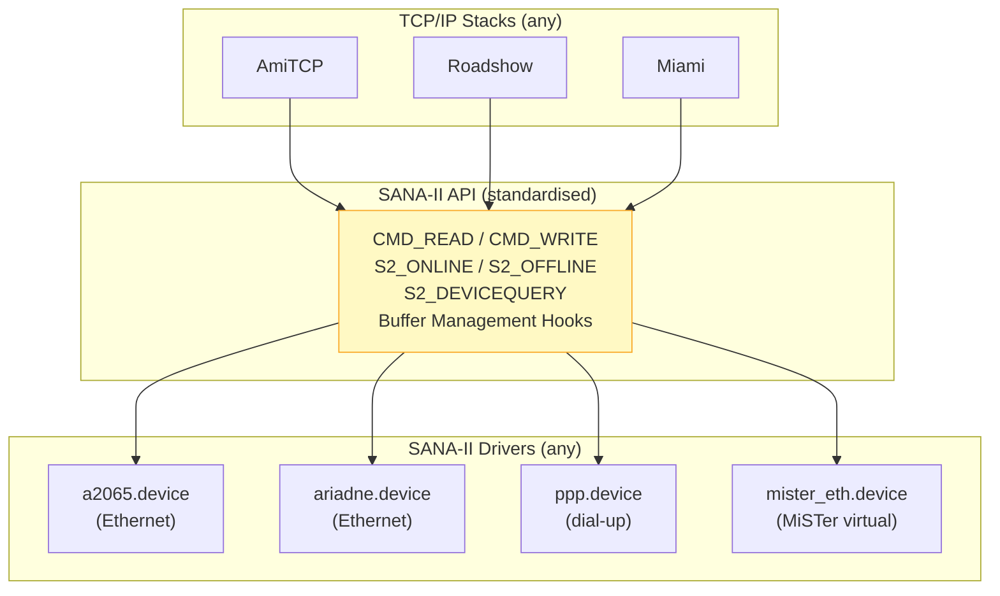

[← Home](../README.md) · [Networking](README.md)

# SANA-II — Standard Amiga Network Architecture

## Overview

SANA-II (Standard Amiga Networking Architecture, version II) is the standardised `exec.device` interface between TCP/IP stacks and network hardware drivers. Any SANA-II compliant driver works with any SANA-II compliant stack — providing hardware independence analogous to NDIS on Windows or the Linux kernel network driver model.

See [TCP/IP Stacks](tcp_ip_stacks.md) for how SANA-II fits into the full networking architecture.



---

## Opening a SANA-II Device

SANA-II drivers require **buffer management hooks** — callback functions the driver uses to copy packet data to/from the application's buffers:

```c
#include <devices/sana2.h>

struct MsgPort *port = CreateMsgPort();
struct IOSana2Req *s2req = (struct IOSana2Req *)
    CreateIORequest(port, sizeof(struct IOSana2Req));

/* Buffer management hooks (required): */
static struct TagItem bufferTags[] = {
    { S2_CopyToBuff,   (ULONG)MyCopyToBuff },
    { S2_CopyFromBuff, (ULONG)MyCopyFromBuff },
    { TAG_DONE, 0 }
};
s2req->ios2_BufferManagement = bufferTags;

if (OpenDevice("a2065.device", 0, (struct IORequest *)s2req, 0))
{
    Printf("Cannot open network device\n");
}
```

### Buffer Management Hooks

```c
/* Called by the driver to copy received data into your buffer: */
BOOL __asm MyCopyToBuff(register __a0 APTR to,
                         register __a1 APTR from,
                         register __d0 ULONG length)
{
    CopyMem(from, to, length);
    return TRUE;
}

/* Called by the driver to copy transmit data from your buffer: */
BOOL __asm MyCopyFromBuff(register __a0 APTR to,
                           register __a1 APTR from,
                           register __d0 ULONG length)
{
    CopyMem(from, to, length);
    return TRUE;
}
```

> [!NOTE]
> Buffer management hooks exist because SANA-II drivers may use DMA or special memory regions. The hooks let the driver control how data is copied — the stack never accesses driver buffers directly.

---

## Commands

| Code | Constant | Direction | Description |
|---|---|---|---|
| 2 | `CMD_READ` | Receive | Read a packet (kept outstanding; completed when packet arrives) |
| 3 | `CMD_WRITE` | Transmit | Send a packet |
| 9 | `S2_DEVICEQUERY` | Query | Get hardware capabilities (type, MTU, speed) |
| 10 | `S2_GETSTATIONADDRESS` | Query | Get hardware (MAC) address |
| 11 | `S2_CONFIGINTERFACE` | Config | Set the hardware address |
| 14 | `S2_ONLINE` | Control | Bring interface up (start receiving) |
| 15 | `S2_OFFLINE` | Control | Take interface down |
| 16 | `S2_ADDMULTICASTADDRESS` | Config | Subscribe to multicast address |
| 17 | `S2_DELMULTICASTADDRESS` | Config | Unsubscribe from multicast |
| 21 | `S2_GETGLOBALSTATS` | Query | Get packet/byte counters |
| 22 | `S2_GETSPECIALSTATS` | Query | Get driver-specific statistics |

---

## Sending a Packet

```c
/* Prepare an Ethernet frame: */
s2req->ios2_Req.io_Command = CMD_WRITE;
s2req->ios2_WireError = 0;
s2req->ios2_PacketType = 0x0800;  /* IPv4 EtherType */
s2req->ios2_DataLength = packetLength;

/* Set destination MAC: */
CopyMem(destMAC, s2req->ios2_DstAddr, 6);

/* ios2_Data points to the packet payload (after Ethernet header): */
s2req->ios2_Data = packetData;

DoIO((struct IORequest *)s2req);
if (s2req->ios2_Req.io_Error)
    Printf("Send error: %ld (wire: %ld)\n",
           s2req->ios2_Req.io_Error, s2req->ios2_WireError);
```

---

## Receiving Packets

The stack posts **multiple read requests** to keep a pipeline full:

```c
/* Post a read request (non-blocking): */
s2req->ios2_Req.io_Command = CMD_READ;
s2req->ios2_WireError = 0;
s2req->ios2_PacketType = 0x0800;  /* only IPv4 packets */
SendIO((struct IORequest *)s2req);

/* Wait for a packet: */
WaitIO((struct IORequest *)s2req);

Printf("Received %ld bytes from %02x:%02x:%02x:%02x:%02x:%02x\n",
       s2req->ios2_DataLength,
       s2req->ios2_SrcAddr[0], s2req->ios2_SrcAddr[1],
       s2req->ios2_SrcAddr[2], s2req->ios2_SrcAddr[3],
       s2req->ios2_SrcAddr[4], s2req->ios2_SrcAddr[5]);

/* Immediately post another read to keep the pipeline full: */
s2req->ios2_Req.io_Command = CMD_READ;
SendIO((struct IORequest *)s2req);
```

---

## Querying Device Capabilities

```c
struct Sana2DeviceQuery query;
query.SizeAvailable = sizeof(query);

s2req->ios2_Req.io_Command = S2_DEVICEQUERY;
s2req->ios2_StatData = &query;
DoIO((struct IORequest *)s2req);

Printf("Hardware type: %ld\n", query.HardwareType);  /* 1 = Ethernet */
Printf("MTU: %ld bytes\n", query.MTU);                /* 1500 for Ethernet */
Printf("Speed: %ld bps\n", query.BPS);                /* 10000000 for 10 Mbps */
Printf("Address size: %ld bits\n", query.AddrFieldSize); /* 48 for Ethernet MAC */
```

---

## Writing a SANA-II Driver

A SANA-II driver is a standard exec.device that implements the SANA-II command set. Key requirements:

| Requirement | Detail |
|---|---|
| Must be an exec.device | Standard `Open/Close/BeginIO/AbortIO` entry points |
| Buffer management | Must use the caller's buffer hooks — never copy directly |
| Multiple openers | Must support multiple tasks opening the device simultaneously |
| Promiscuous mode | Should support `S2_ONEVENT` for link-level monitoring |
| Error reporting | Must set both `io_Error` and `ios2_WireError` |

---

## References

- SANA-II Network Device Driver Specification (Commodore, 1992)
- NDK39: `devices/sana2.h`
- Aminet: `docs/hard/sana2.lha` — specification document
- See also: [tcp_ip_stacks.md](tcp_ip_stacks.md) — stack architecture
- See also: [bsdsocket.md](bsdsocket.md) — socket API above SANA-II
