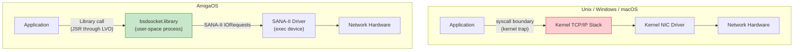
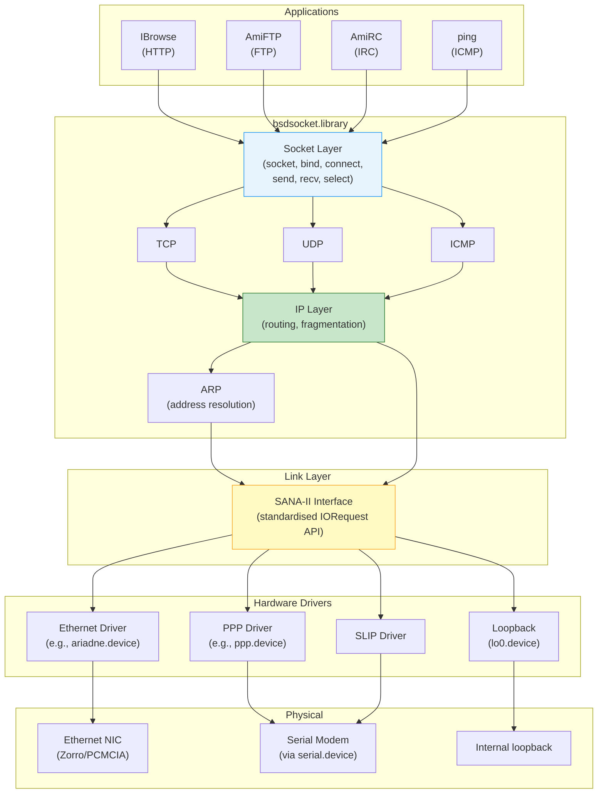
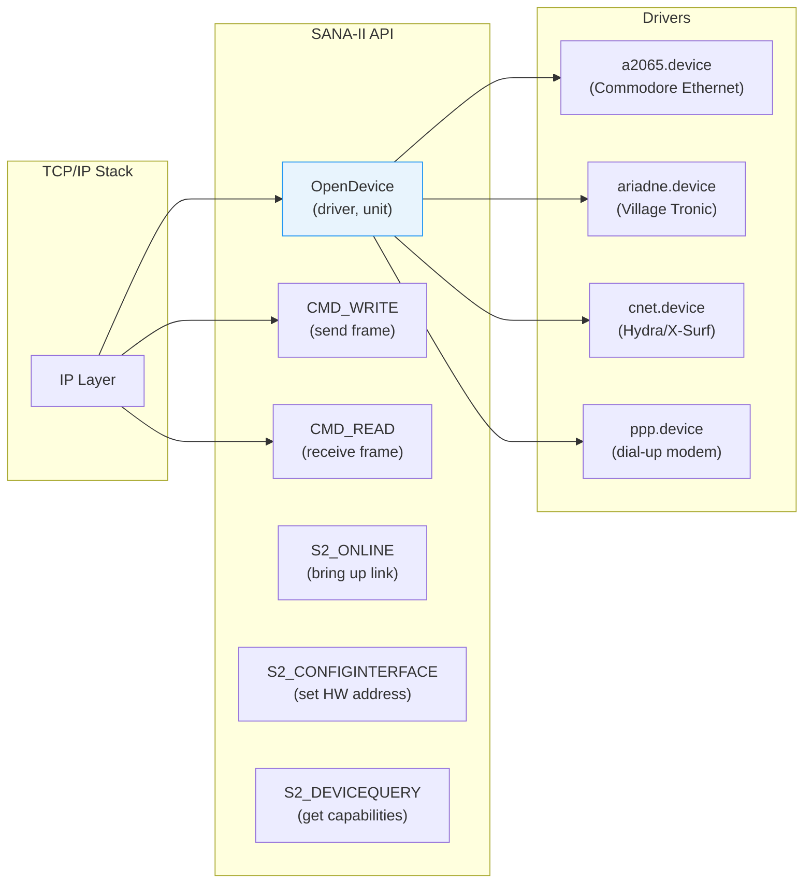
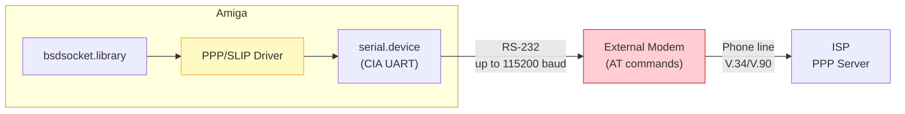

[← Home](../README.md) · [Networking](README.md)

# TCP/IP Stacks — Architecture, Integration, and Configuration

## Overview

AmigaOS has **no built-in TCP/IP stack** — networking is entirely provided by third-party software that installs as an Amiga shared library (`bsdsocket.library`). This is fundamentally different from every other major OS where TCP/IP is a kernel subsystem.

---

## Architecture — How Amiga TCP/IP Differs

### The Library Model vs. Kernel Sockets



| Aspect | Unix/Linux/Windows | AmigaOS |
|---|---|---|
| **Stack location** | Kernel (ring 0) | User-space process (same address space) |
| **Socket API** | System calls (trap to kernel) | Library vector calls (JSR) — no context switch |
| **Driver model** | Kernel module / NDIS | SANA-II exec.device (user-space) |
| **Multiple stacks** | One per kernel | Multiple possible (only one active) |
| **Per-process state** | fd table in kernel | Socket "library base" per opener |
| **Protection** | Full memory protection | None — any process can corrupt stack state |
| **Signal integration** | select/poll/epoll | WaitSelect + Exec signal bits |
| **Performance** | Optimized kernel path | No syscall overhead, but no DMA offload |

### The Full Network Stack



### Per-Opener Library Base

Each Amiga task that opens `bsdsocket.library` gets its own **private library base** with isolated socket state — there is no kernel fd table. This means `SocketBase` must **never** be shared between tasks. See [bsdsocket.md](bsdsocket.md) for the full API reference and per-task setup pattern.

---

## SANA-II — The Network Driver Layer

SANA-II (Standard Amiga Networking Architecture, version II) is the standardised interface between TCP/IP stacks and network hardware drivers. It's an `exec.device` protocol — drivers communicate via IORequests.



### How the Stack Sends a Packet

1. Application calls `send(sock, data, len, 0)`
2. TCP/IP stack builds TCP segment + IP header
3. ARP resolves destination MAC address (or uses cached entry)
4. Stack fills a `struct IOSana2Req` with the complete Ethernet frame
5. `DoIO` / `SendIO` to the SANA-II driver
6. Driver writes frame to hardware registers / DMA buffer

### How the Stack Receives a Packet

1. Stack posts **read requests** (`CMD_READ`) to the SANA-II driver (kept outstanding)
2. When a frame arrives, the driver completes the IORequest
3. Stack parses the Ethernet frame → IP → TCP/UDP → delivers to socket buffer
4. Application's `recv()` or `WaitSelect()` returns the data
5. Stack immediately posts a new `CMD_READ` to keep the pipeline full

---

## Dial-Up Networking — PPP and SLIP

Before broadband, most Amiga internet connections were via **serial modem** using PPP or SLIP over `serial.device`:



### PPP Connection Sequence

```
1. Modem initialization:
   → ATZ                    (reset modem)
   ← OK
   → AT&F1                  (factory defaults, hardware flow control)
   ← OK

2. Dial ISP:
   → ATDT 555-1234          (tone dial)
   ← CONNECT 33600          (connected at 33.6 kbps)

3. PPP negotiation (automatic):
   ← LCP Configure-Request
   → LCP Configure-Ack
   → LCP Configure-Request
   ← LCP Configure-Ack
   → PAP Authenticate (username/password)
   ← PAP Authenticate-Ack
   → IPCP Configure-Request
   ← IPCP Configure-Ack (IP=203.0.113.42, DNS=203.0.113.1)

4. Link up — IP traffic flows over PPP frames on serial line
```

### PPP Configuration (Miami)

Miami had the most user-friendly dial-up setup:

| Setting | Value | Notes |
|---|---|---|
| Serial device | `serial.device` | Or `duart.device` for A2232 multi-port |
| Unit | 0 | |
| Baud rate | 57600 or 115200 | Must match modem's DTE rate |
| Flow control | RTS/CTS (hardware) | **Required** — XON/XOFF causes corruption |
| Init string | `ATZ` then `AT&F1` | Hardware flow control defaults |
| Dial command | `ATDT <number>` | |
| Login | PAP or script-based | |
| VJ compression | Yes | Van Jacobson TCP header compression |

### PPP Configuration (AmiTCP)

```
; AmiTCP:db/interfaces
ppp0 DEV=DEVS:Networks/ppp.device UNIT=0

; AmiTCP:bin/startnet script must:
; 1. Open serial port
; 2. Send modem commands
; 3. Wait for CONNECT
; 4. Hand off to PPP
```

### SLIP (Serial Line IP)

SLIP is the simpler, older protocol — no authentication, no compression, no error detection:

```
; AmiTCP:db/interfaces
sl0 DEV=DEVS:Networks/slip.device UNIT=0

; SLIP frames:
; Each IP packet is framed with END bytes (0xC0)
; ESC (0xDB) used to escape END and ESC within data
```

| Feature | SLIP | PPP |
|---|---|---|
| Authentication | None | PAP, CHAP |
| IP negotiation | Manual (both sides must know IPs) | Automatic (IPCP) |
| Compression | None | VJ header compression |
| Error detection | None | FCS (frame check) |
| Multi-protocol | IP only | IP, IPX, AppleTalk |

---

## Stack Comparison (Detailed)

| Feature | AmiTCP 3.0b2 / Genesis | Miami 3.2 | Roadshow 1.15 |
|---|---|---|---|
| **License** | Free (Genesis fork) | Commercial ($30) | Commercial (demo: 5-min limit) |
| **API version** | bsdsocket.library v3 | v4 | v4 |
| **Based on** | NetBSD TCP/IP stack | Custom implementation | Custom implementation |
| **IPv6** | No | No | No |
| **PPP** | External (AmiPPP) | Built-in dialer + PPP | Via SANA-II PPP driver |
| **SLIP** | Yes | Yes | Via SANA-II SLIP driver |
| **DHCP** | External (dhclient) | Built-in | Built-in |
| **DNS cache** | No | Yes | Yes |
| **DNS over TCP** | No | Yes | Yes |
| **Multi-homing** | Limited | Yes | Yes (multiple interfaces) |
| **SANA-II v2** | Yes | Yes | Yes |
| **GUI config** | Genesis MUI prefs | Miami prefs GUI | Roadshow prefs editor |
| **CLI config** | `ifconfig`, `route` | Via GUI only | Text file + CLI tools |
| **Syslog** | Yes | Yes | Yes |
| **Active development** | No (last: ~2002) | No (last: ~2003) | Yes (Olaf Barthel, ongoing) |
| **Stability** | Good | Good | Excellent |
| **MiSTer notes** | ✅ Free, easy to set up | ❌ Requires registration | ✅ Most capable, demo limit |

### Which Stack for MiSTer?

- **AmiTCP / Genesis**: Free, works well for basic networking. Use `Genesis.lha` from Aminet.
- **Roadshow**: Most capable and actively maintained. Demo works for 5 minutes at a time — sufficient for testing. Full license recommended for permanent setups.

---

## Ethernet Cards (SANA-II Hardware)

| Card | Device | Bus | Chipset | Speed |
|---|---|---|---|---|
| Commodore A2065 | `a2065.device` | Zorro II | AMD LANCE | 10 Mbps |
| Village Tronic Ariadne | `ariadne.device` | Zorro II | AMD PCnet | 10 Mbps |
| Village Tronic Ariadne II | `ariadne2.device` | Zorro II | SMC 91C94 | 10 Mbps |
| Hydra Systems Amiganet | `amiganet.device` | Zorro II | AMD LANCE | 10 Mbps |
| X-Surf | `xsurf.device` | Clock port | RTL8019AS | 10 Mbps |
| X-Surf 100 | `xsurf100.device` | Zorro II/III | AX88796B | 100 Mbps |
| PCMCIA Ethernet | `cnet.device` | PCMCIA (A600/A1200) | Various | 10 Mbps |

### MiSTer Virtual NIC

MiSTer emulates a network interface that bridges to the Linux HPS network:

```
; DEVS:NetInterfaces/mister0  (Roadshow)
DEVICE=mister_eth.device
UNIT=0
IPTYPE=DHCP
MTU=1500
```

The virtual driver presents a standard SANA-II interface — the TCP/IP stack sees no difference from a real Ethernet card.

---

## Configuration — Roadshow

### Network Interface

```
; DEVS:NetInterfaces/eth0
DEVICE=ariadne.device       ; or your card's device name
UNIT=0
IPTYPE=DHCP                 ; or STATIC for manual

; Static configuration:
; ADDRESS=192.168.1.100
; NETMASK=255.255.255.0
```

### Name Resolution

```
; DEVS:Internet/name_resolution
NAMESERVER 8.8.8.8
NAMESERVER 8.8.4.4
DOMAIN local
SEARCH local
```

### Default Gateway

```
; DEVS:Internet/default_gateway
DEVICE=ariadne.device
UNIT=0
GATEWAY=192.168.1.1
```

### Startup

```
; S:User-Startup
Run >NIL: C:AddNetInterface eth0
WaitForPort AMITCP
; Stack is now ready
```

---

## Configuration — AmiTCP / Genesis

### Interface Configuration

```
; AmiTCP:db/interfaces
eth0 DEV=DEVS:Networks/ariadne.device UNIT=0 IP=DHCP

; Static:
; eth0 DEV=DEVS:Networks/ariadne.device UNIT=0 IP=192.168.1.100 NETMASK=255.255.255.0
```

### DNS and Hosts

```
; AmiTCP:db/netdb-myhost
HOST 127.0.0.1 localhost
HOST 192.168.1.1 gateway
NAMESERVER 8.8.8.8
DOMAIN local
```

### Startup

```
; S:User-Startup
Run >NIL: AmiTCP:AmiTCP
WaitForPort AMITCP
; bsdsocket.library is now available
```

---

## Verifying the Network

```
; CLI commands (provided by the stack):
ifconfig              ; show interface configuration
netstat -r            ; show routing table
netstat -a            ; show active connections
ping 8.8.8.8          ; test connectivity
nslookup amiga.org    ; test DNS resolution
traceroute 8.8.8.8    ; trace route to destination
```

```c
/* Programmatic check: */
struct Library *SocketBase = OpenLibrary("bsdsocket.library", 4);
if (!SocketBase)
    Printf("No TCP/IP stack running — start AmiTCP or Roadshow\n");
else
    CloseLibrary(SocketBase);
```

---

## References

- Roadshow SDK: http://roadshow.apc-tcp.de/
- AmiTCP SDK: Aminet `comm/tcp/AmiTCP-SDK-4.3.lha`
- Genesis (free AmiTCP fork): Aminet `comm/tcp/Genesis.lha`
- SANA-II specification: Aminet `docs/hard/sana2.lha`
- See also: [bsdsocket.md](bsdsocket.md) — socket API reference
- See also: [sana2.md](sana2.md) — SANA-II driver specification
- See also: [protocols.md](protocols.md) — DNS, HTTP, UDP implementation examples
