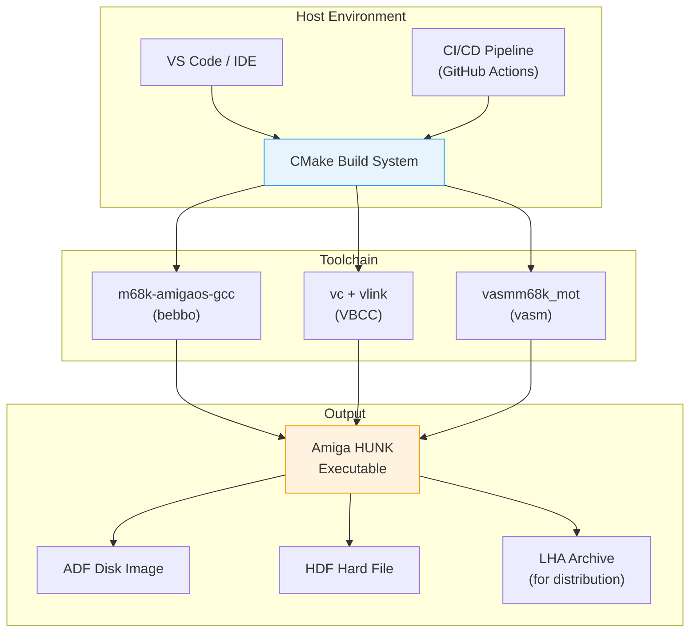
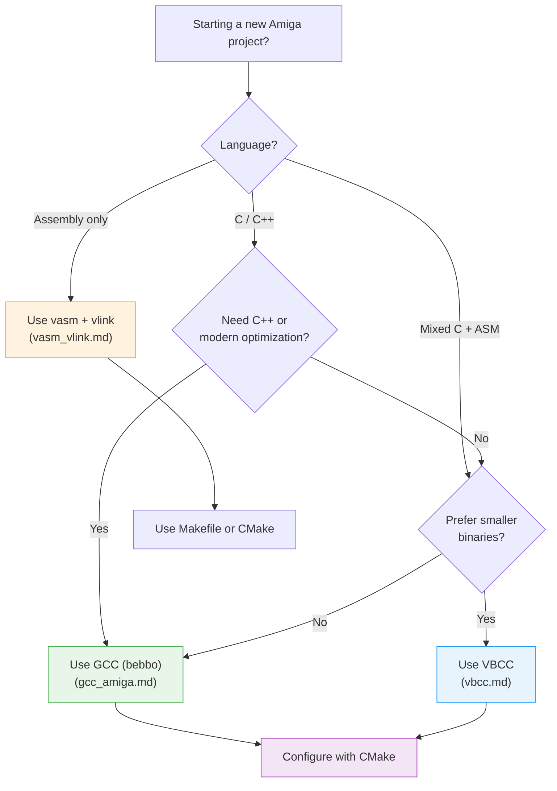
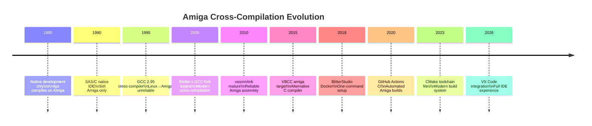

[← Home](../README.md) · [Toolchain](README.md)

# Modern Cross-Compilation Guide — CMake, VS Code, CI/CD

## Overview

Building Amiga software in 2026 means writing C/C++ on a modern host (Linux, macOS, or Windows) and producing 68000 hunk executables. This guide covers the **build system integration** layer: CMake project configuration, VS Code debugging setup, and CI/CD pipelines — connecting the compiler tools documented in [gcc_amiga.md](gcc_amiga.md), [vbcc.md](vbcc.md), and [vasm_vlink.md](vasm_vlink.md).



---

## Toolchain Selection Decision Guide



| Toolchain | Best For | Binary Size | C++ Support | Optimization |
|-----------|----------|-------------|-------------|-------------|
| **GCC (bebbo)** | C/C++, modern standards, libraries | Larger | C++14 | Strong (GCC 6.5 optimizer) |
| **VBCC** | C, size-critical code, demos | Smaller | No | Good (vbcc optimizer) |
| **vasm only** | Pure assembly, bootblocks, demos | Smallest | N/A | Manual |

---

## CMake Configuration

### Toolchain File for GCC (bebbo)

Create `toolchain/m68k-amigaos.cmake`:

```cmake
# CMake toolchain file for m68k-amigaos-gcc (bebbo)
set(CMAKE_SYSTEM_NAME Generic)
set(CMAKE_SYSTEM_PROCESSOR m68k)

# Toolchain prefix
set(TOOLCHAIN_PREFIX m68k-amigaos)

# Find tools
find_program(CMAKE_C_COMPILER ${TOOLCHAIN_PREFIX}-gcc)
find_program(CMAKE_CXX_COMPILER ${TOOLCHAIN_PREFIX}-g++)
find_program(CMAKE_ASM_COMPILER ${TOOLCHAIN_PREFIX}-gcc)
find_program(CMAKE_AR ${TOOLCHAIN_PREFIX}-ar)
find_program(CMAKE_STRIP ${TOOLCHAIN_PREFIX}-strip)
find_program(CMAKE_RANLIB ${TOOLCHAIN_PREFIX}-ranlib)

# Amiga-specific flags
set(CMAKE_C_FLAGS_INIT "-noixemul -m68000 -Os -fomit-frame-pointer -Wall")
set(CMAKE_CXX_FLAGS_INIT "-noixemul -m68000 -Os -fomit-frame-pointer -Wall")
set(CMAKE_EXE_LINKER_FLAGS_INIT "-noixemul -Wl,--gc-sections")

# Don't build host executables for tests
set(CMAKE_CROSSCOMPILING TRUE)
set(CMAKE_TRY_COMPILE_TARGET_TYPE STATIC_LIBRARY)

# Output suffix for Amiga executables
set(CMAKE_EXECUTABLE_SUFFIX "")
```

### Toolchain File for VBCC

Create `toolchain/vbcc-m68k-amigaos.cmake`:

```cmake
# CMake toolchain file for VBCC m68k-amigaos
set(CMAKE_SYSTEM_NAME Generic)
set(CMAKE_SYSTEM_PROCESSOR m68k)

# VBCC uses 'vc' as compiler driver
find_program(CMAKE_C_COMPILER vc)

# VBCC flags
set(CMAKE_C_FLAGS_INIT "-m68000 -O2 -c99 -DCPU_68000")
set(CMAKE_EXE_LINKER_FLAGS_INIT "")

# VBCC doesn't have ar/ranlib in standard form
set(CMAKE_AR ${TOOLCHAIN_PREFIX}-ar)
set(CMAKE_RANLIB ${TOOLCHAIN_PREFIX}-ranlib)

set(CMAKE_CROSSCOMPILING TRUE)
set(CMAKE_TRY_COMPILE_TARGET_TYPE STATIC_LIBRARY)
set(CMAKE_EXECUTABLE_SUFFIX "")
```

### Project CMakeLists.txt

```cmake
cmake_minimum_required(VERSION 3.20)
project(MyAmigaApp C)

# Source files
set(SOURCES
    src/main.c
    src/gfx.c
    src/input.c
    src/audio.c
)

# Assembly files (vasm, Motorola syntax)
set(ASSEMBLY
    asm/copper.s
    asm/blitter.s
)

# NDK includes
include_directories(
    ${CMAKE_SOURCE_DIR}/include
    ${CMAKE_SOURCE_DIR}/ndk/include
)

# Build executable
add_executable(${PROJECT_NAME} ${SOURCES} ${ASSEMBLY})

# Link against Amiga libraries
target_link_libraries(${PROJECT_NAME} amiga)

# Custom command: generate ADF after build
add_custom_command(TARGET ${PROJECT_NAME} POST_BUILD
    COMMAND ${CMAKE_SOURCE_DIR}/scripts/makeadf.sh
        $<TARGET_FILE:${PROJECT_NAME}>
        ${CMAKE_BINARY_DIR}/${PROJECT_NAME}.adf
    COMMENT "Creating ADF disk image"
)
```

### Building

```bash
# Configure (GCC toolchain)
cmake -B build -DCMAKE_TOOLCHAIN_FILE=toolchain/m68k-amigaos.cmake .

# Configure (VBCC toolchain)
cmake -B build -DCMAKE_TOOLCHAIN_FILE=toolchain/vbcc-m68k-amigaos.cmake .

# Build
cmake --build build -j$(nproc)

# Output: build/MyAmigaApp (Amiga hunk executable)
```

---

## VS Code Integration

### launch.json — Debug with FS-UAE

```json
{
    "version": "0.2.0",
    "configurations": [
        {
            "name": "Run in FS-UAE",
            "type": "cppdbg",
            "request": "launch",
            "program": "${workspaceFolder}/build/MyAmigaApp",
            "args": [],
            "stopAtEntry": false,
            "cwd": "${workspaceFolder}",
            "environment": [],
            "externalConsole": false,
            "preLaunchTask": "build",
            "postDebugTask": "launch-fsuae",
            "miDebuggerPath": "/usr/bin/m68k-amigaos-gdb"
        }
    ]
}
```

### tasks.json — Build + Launch

```json
{
    "version": "2.0.0",
    "tasks": [
        {
            "label": "configure",
            "type": "shell",
            "command": "cmake",
            "args": ["-B", "build", "-DCMAKE_TOOLCHAIN_FILE=toolchain/m68k-amigaos.cmake", "."]
        },
        {
            "label": "build",
            "type": "shell",
            "command": "cmake",
            "args": ["--build", "build", "-j4"],
            "group": {
                "kind": "build",
                "isDefault": true
            },
            "dependsOn": "configure",
            "problemMatcher": "$gcc"
        },
        {
            "label": "launch-fsuae",
            "type": "shell",
            "command": "fs-uae",
            "args": [
                "--hard_drive_0=${workspaceFolder}/build/disk.hdf",
                "--amiga_model=A1200"
            ]
        }
    ]
}
```

### settings.json — IntelliSense

```json
{
    "C_Cpp.default.compilerPath": "m68k-amigaos-gcc",
    "C_Cpp.default.includePath": [
        "${workspaceFolder}/include",
        "${workspaceFolder}/ndk/include"
    ],
    "C_Cpp.default.defines": [
        "AMIGA",
        "CPU_68000",
        "__AMIGADATE__=20260101"
    ],
    "C_Cpp.default.compilerArgs": ["-noixemul"],
    "C_Cpp.default.cStandard": "c99"
}
```

---

## CI/CD — GitHub Actions

### Complete Pipeline: Build, Test, Package

```yaml
# .github/workflows/amiga-build.yml
name: Amiga Build

on:
    push:
        branches: [main]
    pull_request:
        branches: [main]

jobs:
    build:
        runs-on: ubuntu-latest
        container:
            image: bebbo/amiga-gcc:latest

        steps:
            - uses: actions/checkout@v4

            - name: Configure CMake
              run: |
                cmake -B build \
                  -DCMAKE_TOOLCHAIN_FILE=toolchain/m68k-amigaos.cmake \
                  -DCMAKE_BUILD_TYPE=Release .

            - name: Build
              run: cmake --build build -j$(nproc)

            - name: Strip executable
              run: m68k-amigaos-strip build/MyAmigaApp

            - name: Create ADF disk image
              run: |
                pip install amitools
                xdftool build/disk.adf format "MyApp" ffs
                xdftool build/disk.adf makedir MyApp
                xdftool build/disk.adf write build/MyAmigaApp MyApp/MyAmigaApp

            - name: Create LHA distribution
              run: |
                lha a build/MyApp-$(git rev-parse --short HEAD).lha \
                  build/MyAmigaApp README.md

            - name: Upload artifacts
              uses: actions/upload-artifact@v4
              with:
                name: amiga-build
                path: |
                  build/MyAmigaApp
                  build/disk.adf
                  build/*.lha
```

### Docker-based Build (Alternative)

```yaml
# For toolchains not available as Docker images
jobs:
    build-vbcc:
        runs-on: ubuntu-latest
        steps:
            - uses: actions/checkout@v4

            - name: Install VBCC
              run: |
                wget http://www.sun.hasenbraten.de/~frank/vbcc/vbcc_0_9.tar.gz
                tar xzf vbcc_0_9.tar.gz
                cd vbcc
                make TARGET=m68k
                echo "$(pwd)/bin" >> $GITHUB_PATH

            - name: Build with VBCC
              run: |
                vc -m68000 -O2 -c99 -o build/MyApp src/main.c
```

---

## Mixed C + Assembly Projects

### CMake Configuration for Mixed Sources

```cmake
# Enable assembly language
enable_language(ASM_M68K)

# Tell CMake to use vasm for .s files
set(CMAKE_ASM_M68K_COMPILER vasmm68k_mot)
set(CMAKE_ASM_M68K_FLAGS "-m68000 -Fhunk -phxass")

# Assembly sources get compiled separately
add_executable(${PROJECT_NAME}
    src/main.c
    src/gfx.c
    asm/copper.s      # vasm Motorola syntax
    asm/blitter.s
)

# Custom include for generated headers from assembly
target_include_directories(${PROJECT_NAME} PRIVATE
    ${CMAKE_BINARY_DIR}/generated
)
```

### Calling Convention: C ↔ Assembly

```c
/* ---- C side (main.c) ---- */

/* Function implemented in assembly */
extern void SetupCopper(void *copperlist);
extern void BlitCopy(const void *src, void *dst, WORD width, WORD height);

/* Function called FROM assembly */
void OnVBlank(void)
{
    /* Called from copper interrupt — keep it short */
    UpdateDisplay();
}
```

```asm
; ---- Assembly side (copper.s) ----
; Amiga C calling convention:
;   D0/D1 = scratch (return value in D0)
;   A0/A1 = scratch
;   D2-D7/A2-A6 = saved by callee
;   Parameters: D0, D1, A0, A1 (left to right, first 4)
;   Stack: remaining parameters

    section text,code

    xdef _SetupCopper
    xdef _BlitCopy
    xref _OnVBlank        ; defined in C

; void SetupCopper(void *copperlist);
; A0 = copperlist pointer
_SetupCopper:
    movem.l d2-d7/a2-a6, -(sp)
    move.l  a0, a2             ; save copperlist pointer
    ; ... build copper list ...
    move.l  a2, $dff080        ; COP1LCH
    movem.l (sp)+, d2-d7/a2-a6
    rts

; void BlitCopy(const void *src, void *dst, WORD width, WORD height);
; A0 = src, A1 = dst, D0 = width, D1 = height
_BlitCopy:
    movem.l d2-d7/a2-a6, -(sp)
    ; ... blitter setup ...
    movem.l (sp)+, d2-d7/a2-a6
    rts
```

---

## Named Antipatterns

### "The Host Header Leak" — Including Host Headers

```c
/* BAD: Including standard POSIX headers that don't exist
   on AmigaOS. This compiles on Linux (host headers found)
   but the resulting binary is broken — Amiga doesn't have
   stdio.h in the same way, or <sys/mman.h> at all. */
#include <stdio.h>        /* exists in libnix but limited */
#include <sys/mman.h>     /* does NOT exist on Amiga */
#include <pthread.h>      /* does NOT exist on Amiga */
```

```c
/* CORRECT: Use AmigaOS-native APIs */
#include <proto/dos.h>    /* Open/Read/Write/Close */
#include <proto/exec.h>   /* AllocMem/FreeMem */
#include <exec/memory.h>  /* MEMF_CHIP, MEMF_CLEAR */

/* Amiga has no mmap — use AllocMem() */
APTR buf = AllocMem(size, MEMF_CHIP | MEMF_CLEAR);
FreeMem(buf, size);
```

### "The ixemul Trap" — Mixing ixemul and noixemul

```makefile
# BAD: Mixing ixemul and noixemul flags.
# ixemul provides a POSIX layer (fopen, malloc, etc.)
# noixemul means direct AmigaOS calls.
# Linking both causes symbol conflicts and mysterious crashes.
CFLAGS = -noixemul -m68000
LDFLAGS = -lixemul    # CONFLICT: ixemul AND noixemul!
```

```makefile
# CORRECT: Choose one and be consistent
# Option A: noixemul (most Amiga-native, smaller binary)
CFLAGS  = -noixemul -m68000
LDFLAGS = -noixemul -lamiga

# Option B: ixemul (easier porting from POSIX code)
CFLAGS  = -m68000
LDFLAGS = -lixemul
```

### "The Missing NDK Include Path"

```cmake
# BAD: CMake can't find AmigaOS headers.
# The NDK include path must be explicitly provided.
# Without it, #include <exec/types.h> fails.
target_compile_definitions(myapp PRIVATE AMIGA)
# No include path! Compiler errors on every Amiga header.
```

```cmake
# CORRECT: Always specify NDK include path
target_include_directories(myapp PRIVATE
    ${CMAKE_SOURCE_DIR}/ndk/include   # NDK 3.9 headers
    ${CMAKE_SOURCE_DIR}/include       # project headers
)
```

### "The Unstripped Binary" — Shipping Debug Symbols

```bash
# BAD: Amiga executables with debug symbols waste RAM.
# On an A500 with 512 KB Chip RAM, every byte counts.
# Unstripped binaries can be 2-5× larger.
cmake --build build
cp build/MyApp dist/MyApp   # 250 KB — includes symbols!
```

```bash
# CORRECT: Always strip for release
cmake --build build
m68k-amigaos-strip build/MyApp -o dist/MyApp   # 80 KB
# Or in CMakeLists.txt:
#   set(CMAKE_C_FLAGS_RELEASE "-Os -DNDEBUG")
#   add_custom_command(TARGET myapp POST_BUILD
#       COMMAND m68k-amigaos-strip $<TARGET_FILE:myapp>)
```

---

## Historical Context & Modern Analogies

### Cross-Platform Amiga Development Timeline



### Modern Analogies

| Amiga Concept | Modern Equivalent | Notes |
|--------------|-------------------|-------|
| `m68k-amigaos-gcc` | `aarch64-linux-gnu-gcc` (ARM cross-compiler) | Same GCC cross-compilation model |
| `-noixemul` flag | `-nostdlib` (embedded ARM) | Don't link standard library |
| vasm Motorola syntax | `arm-none-eabi-as` | Cross-assembler for target |
| vlink hunk output | `objcopy -O binary` | Produce target binary format |
| ADF disk image | `.img` (Raspberry Pi SD card) | Bootable media for target |
| FS-UAE debugger | QEMU GDB stub | Emulator-based remote debugging |
| CMake toolchain file | `arm-toolchain.cmake` for embedded | Identical CMake pattern |
| GitHub Actions + Docker | Same for any cross-compilation target | Containerized builds |

---

## FAQ

**Q: Should I use GCC or VBCC for a new project?**
A: Use GCC if you need C++, modern C features, or extensive library support. Use VBCC if binary size is critical (demos, bootblocks) or you want a simpler, faster compilation. Both produce valid Amiga executables.

**Q: Can I use C++ for Amiga development?**
A: Yes — bebbo's GCC supports C++14 with some limitations: no RTTI (run-time type info) by default, exceptions are limited, and the C++ standard library (`libstdc++`) has reduced functionality. Many Amiga projects use C++ for class-based organization but avoid heavy STL usage.

**Q: How do I test my cross-compiled binary?**
A: Use an emulator (FS-UAE or WinUAE) or a real Amiga with a Gotek floppy emulator. For rapid iteration, FS-UAE with a hard-file (.hdf) is fastest — just copy the binary into the HDF and reboot.

**Q: Can I debug cross-compiled code with GDB?**
A: Limited. `m68k-amigaos-gdb` exists but requires an Amiga-side GDB stub, which is complex to set up. Most developers use WinUAE/FS-UAE's built-in debugger instead, or `printf` debugging via serial port.

**Q: How do I package my app for distribution?**
A: The standard Amiga distribution format is **LHA** archives. Include the executable, a `.info` icon file, and optionally an `Install` script. For floppy-disk distribution, create an ADF using `xdftool` (from `amitools` Python package).

**Q: Can I use CMake with assembly-only projects?**
A: Yes — CMake supports assembly via `enable_language(ASM_M68K)` and `set(CMAKE_ASM_M68K_COMPILER vasmm68k_mot)`. Alternatively, use a simple Makefile for assembly projects (see [makefiles.md](makefiles.md)).

---

## References

### Related Toolchain Articles

- [gcc_amiga.md](gcc_amiga.md) — bebbo GCC cross-compiler: installation, flags, CPU targets, Docker
- [vbcc.md](vbcc.md) — VBCC portable compiler: `__reg()`, cross-compilation, size optimization
- [vasm_vlink.md](vasm_vlink.md) — vasm assembler & vlink linker: modular architecture, linker scripts
- [makefiles.md](makefiles.md) — Makefile patterns for cross-compilation, mixed C+asm
- [ndk.md](ndk.md) — NDK versions and header organization
- [debugging.md](debugging.md) — debugging tools: Enforcer, SnoopDOS, FS-UAE GDB remote

### External Resources

- **bebbo/amiga-gcc**: https://github.com/bebbo/amiga-gcc
- **BlitterStudio/amiga-gcc**: https://github.com/BlitterStudio/amiga-gcc (with platform build docs)
- **amitools**: https://github.com/cnvogelg/amitools (xdftool, vamkftools)
- **FS-UAE**: https://fs-uae.net
