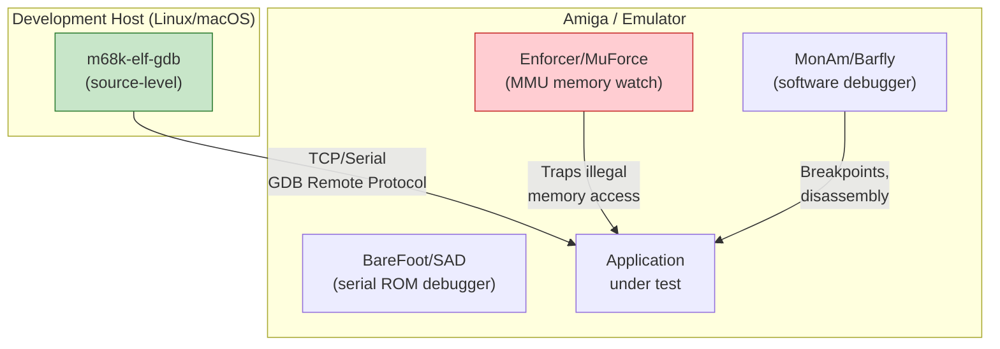

[← Home](../README.md) · [Toolchain](README.md)

# Debugging Tools — Enforcer, BareFoot, GDB Remote

## Overview

Debugging Amiga programs spans from hardware-level ROM debuggers through MMU-based memory watchers to modern cross-debugging via GDB stubs. The unique Amiga challenges — no memory protection, shared address space, custom chip state — require specialised tools.



---

## Tool Comparison

| Tool | Type | Requires | Best For |
|---|---|---|---|
| **Enforcer** | MMU memory watchdog | 68020+ with MMU | Catching NULL ptr, illegal reads/writes |
| **MuForce** | MMU memory watchdog | 68040/060 | Same as Enforcer, optimised for 040/060 |
| **MuGuardianAngel** | Stack overflow detector | 68040/060 | Catching stack overflow crashes |
| **BareFoot** | Serial kernel debugger | Serial cable + terminal | Exec internals, boot crashes, system hangs |
| **wack / SAD** | ROM-resident debugger | Guru Meditation (crash) | Post-crash analysis, ROM debugging |
| **MonAm** | Software monitor/debugger | AmigaOS | Interactive breakpoints, register inspection |
| **SnoopDOS** | DOS call tracer | AmigaOS 2.0+ | Tracing file/library opens, locks |
| **CPR** | Debug output viewer | AmigaOS | Capturing `kprintf` and `RawPutChar` output |
| **m68k-elf-gdb** | Cross-debugger | FS-UAE or vamos | Source-level C debugging from host |
| **IDA Pro** | Static + remote | Cross-platform | Static RE, decompilation |

---

## Enforcer / MuForce — Memory Access Watchdog

The most essential Amiga debugging tool. Uses the MMU to trap **all invalid memory accesses** — reading from address 0 (NULL pointer), writing to ROM, accessing non-existent memory, etc.

```
; Start Enforcer (runs in background):
run >NIL: Enforcer

; For 040/060 systems:
run >NIL: MuForce

; Output goes to the serial port by default.
; Redirect to a file or console:
run >NIL: Enforcer STDOUT
run >NIL: Enforcer FILE RAM:enforcer.log
```

### Reading Enforcer Hits

```
WORD-READ from $00000004  by "myapp"  at $00020456
Data: $00000000  USP: $0007FFF0  PC: $00020456

     --- Loss of  Register  Dump ---
  D0 00000000  D1 0003A2F0  D2 00000010  D3 00000001
  D4 00000000  D5 FFFFFFFF  D6 00000000  D7 00000000
  A0 00000000  A1 0003A2F0  A2 00070000  A3 00040000
  A4 00020000  A5 00000000  A6 0003F000  A7 0007FFF0
```

| Field | Meaning |
|---|---|
| `WORD-READ from $00000004` | Tried to read a WORD from address 4 (low memory = NULL struct deref) |
| `by "myapp"` | Task name that caused the hit |
| `at $00020456` | PC (program counter) where the access occurred |

> [!TIP]
> **Address $00000004 = reading `ExecBase` through NULL pointer.** This is the #1 Enforcer hit — it means code is dereferencing a NULL pointer to a structure and accessing field at offset 4. Find the instruction at the PC address in your disassembly.

### Common Enforcer Hit Patterns

| Address Range | Likely Cause |
|---|---|
| `$00000000–$000003FF` | NULL pointer dereference (struct field at offset N) |
| `$00F00000–$00FFFFFF` | Reading from ROM area (write-to-ROM bug) |
| `$00C00000–$00DFFFFF` | Accessing custom chip area with bad address |
| `$01000000+` | Accessing memory beyond physical RAM |

---

## SnoopDOS — System Call Tracer

Monitors all DOS and library calls system-wide — essential for understanding why programs fail to find files or libraries:

```
; Start SnoopDOS (MUI GUI):
SnoopDos

; Typical output:
Open          "myapp"  LIBS:mytool.library    OK    (Lock=$0003A000)
Open          "myapp"  DEVS:Keymaps/usa       FAIL  (Object not found)
Lock          "myapp"  SYS:Prefs/Env-Archive  OK    (Lock=$00042000)
OpenLibrary   "myapp"  intuition.library v39   OK    (Base=$0003F000)
```

---

## FS-UAE GDB Remote Debugging

Modern source-level debugging from your development host:

```bash
# In fs-uae.conf:
remote_debugger = 1
remote_debugger_port = 6860

# Start FS-UAE, then from your development machine:
m68k-elf-gdb myapp

(gdb) target remote localhost:6860
(gdb) symbol-file myapp            # load debug symbols
(gdb) break main
(gdb) continue
(gdb) print myVariable
(gdb) info registers
(gdb) x/10i $pc                    # disassemble at PC
(gdb) backtrace                    # show call stack
```

### Building with Debug Info

```bash
# GCC — include DWARF debug info in hunk format:
m68k-amigaos-gcc -g -noixemul -o myapp main.c

# SAS/C — include SAS debug info:
lc -d2 main.c
blink main.o TO myapp LIB lib:sc.lib lib:amiga.lib DEBUG
```

---

## kprintf / RawPutChar — Debug Output

For printf-style debugging without a console:

```c
/* kprintf writes directly to the serial port,
   bypassing all OS output — works even during interrupts: */
#include <clib/debug_protos.h>

kprintf("Value: %ld at %lx\n", value, address);

/* RawPutChar — single character to serial: */
RawPutChar('X');
```

Capture with a terminal emulator on the serial port, or use **CPR** (Capture Raw Putchar) to redirect to a window or file.

---

## Debugging Checklist

| Symptom | Tool | Action |
|---|---|---|
| Guru Meditation | wack/SAD | Note crash address, check code at that PC |
| Random crashes | Enforcer | Run Enforcer, look for illegal accesses before the crash |
| "Can't open library" | SnoopDOS | See what path the open is trying |
| Memory leak | MungWall | Tracks AllocMem/FreeMem, reports leaks at exit |
| Stack overflow | MuGuardianAngel | Detects stack underflow on 040/060 |
| Performance issue | sprof (SAS/C) | Profile C functions |
| File not found | SnoopDOS | See where the OS is looking for the file |

---

## References

- Enforcer: Aminet `dev/debug/Enforcer.lha`
- MuForce: Aminet `dev/debug/MuForce.lha`
- SnoopDOS: Aminet `util/monitor/SnoopDos.lha`
- BareFoot: Aminet `dev/debug/BareFoot.lha`
- MungWall: Aminet `dev/debug/MungWall.lha`
- CPR: Aminet `dev/debug/cpr.lha`
