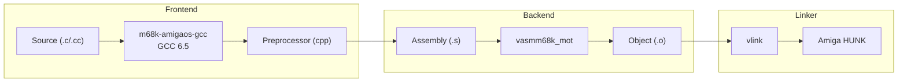
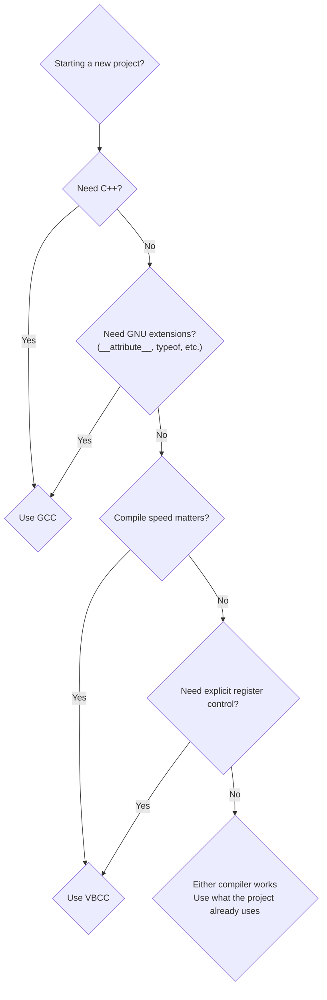

[← Home](../README.md) · [Toolchain](README.md)

# m68k-amigaos-gcc — GCC Cross-Compiler for AmigaOS

In 2025, building Amiga software looks nothing like 1993. The **bebbo toolchain** — GCC 6.5 retargeted for m68k-amigaos — cross-compiles on Linux, macOS, and Windows, producing native Amiga hunk executables from modern C and C++ source. It replaced the ancient GCC 2.95 cross-compiler that lived on Aminet for two decades, bringing modern optimization, C++14 support, and a Docker-based workflow that takes **under five minutes** to set up.

The toolchain ships with [vasm](vasm_vlink.md) as its default assembler and [vlink](vasm_vlink.md) as its linker. GCC emits assembly, vasm assembles it, and vlink produces the final hunk executable. This replaces the aging GNU `as` and `ld` that produced unreliable Amiga binaries.

---

## Architecture

### Compiler Pipeline



bebbo's GCC is based on **GCC 6.5.0** with a custom m68k-amigaos backend. Unlike the original GCC 2.95 cross-compiler (which used GNU `as` and `ld`), bebbo's fork integrates [vasm](vasm_vlink.md) and [vlink](vasm_vlink.md) as the default assembler and linker. This produces more reliable Amiga hunk-format executables.

### What Ships in the Toolchain

| Component | Binary | Purpose |
|-----------|--------|----------|
| GCC C compiler | `m68k-amigaos-gcc` | C frontend, optimizer, code generator |
| GCC C++ compiler | `m68k-amigaos-g++` | C++ frontend (supports C++14) |
| Assembler | `vasmm68k_mot` | Motorola-syntax assembler (replaces GNU `as`) |
| Linker | `vlink` | Multi-format linker (replaces GNU `ld`) |
| Archiver | `m68k-amigaos-ar` | Static library (.a) creation |
| Strip | `m68k-amigaos-strip` | Symbol removal |
| objdump | `m68k-amigaos-objdump` | Disassembly and inspection |
| NDK headers | `/opt/amiga/m68k-amigaos/ndk-include/` | AmigaOS API definitions |
| libnix | `/opt/amiga/m68k-amigaos/lib/` | Lightweight C runtime |

---

## Installation

### Quick Start: Docker (All Platforms)

The fastest path to a working toolchain on any OS:

```bash
# Pull the pre-built image:
docker pull amigadev/m68k-amigaos-gcc

# Compile a single file:
docker run --rm -v "$(pwd):/work" amigadev/m68k-amigaos-gcc \
    m68k-amigaos-gcc -noixemul -o hello hello.c

# Interactive shell with toolchain available:
docker run --rm -it -v "$(pwd):/work" amigadev/m68k-amigaos-gcc bash
```

> [!NOTE]
> The Docker image is maintained at [hub.docker.com/r/amigadev/m68k-amigaos-gcc](https://hub.docker.com/r/amigadev/m68k-amigaos-gcc). It includes the full toolchain, NDK headers, and libnix runtime.

### Source Repositories

bebbo's original repository was removed from GitHub. Use the maintained forks:

| Mirror | URL | Notes |
|--------|-----|-------|
| BlitterStudio | https://github.com/BlitterStudio/amiga-gcc | Most active, primary fork |
| Codeberg | https://codeberg.org/bebbo/amiga-gcc | Official mirror |
| Pre-built Windows installer | http://franke.ms/download/setup-amiga-gcc.exe | MSYS2-based, includes GUI installer |

---

### Linux

#### Ubuntu / Debian — Prerequisites

```bash
sudo apt install make wget git gcc g++ lhasa libgmp-dev libmpfr-dev \
    libmpc-dev flex bison gettext texinfo ncurses-dev autoconf rsync \
    libreadline-dev
```

#### Fedora — Prerequisites

```bash
sudo dnf install wget gcc gcc-c++ python git perl-Pod-Simple gperf patch \
    autoconf automake make makedepend bison flex ncurses-devel gmp-devel \
    mpfr-devel libmpc-devel gettext-devel texinfo rsync readline-devel
```

#### CentOS / RHEL — Prerequisites

```bash
sudo yum install wget gcc gcc-c++ python git perl-Pod-Simple gperf patch \
    autoconf automake make makedepend bison flex ncurses-devel gmp-devel \
    mpfr-devel libmpc-devel gettext-devel texinfo rsync readline-devel
```

#### Build

```bash
git clone https://github.com/BlitterStudio/amiga-gcc.git
cd amiga-gcc
make update

# Build everything (adjust -j to your core count):
make all -j$(nproc)
# Installs to /opt/amiga/ by default

# If /opt/amiga is not writable by your user:
sudo mkdir /opt/amiga
sudo chgrp users /opt/amiga
sudo chmod 775 /opt/amiga
sudo usermod -a -G users $USER   # then log out and back in

# Or install to a user-writable location:
make all -j$(nproc) PREFIX=$HOME/amiga
```

Add to your shell profile:
```bash
export PATH=/opt/amiga/bin:$PATH
```

Build time: **~10 minutes** on a modern Linux box with `-j4` or higher.

---

### macOS

macOS requires **Xcode Command Line Tools** and **Homebrew**. The default `/bin/bash` is too old (macOS ships bash 3.2); you must use Homebrew's bash.

#### Prerequisites

```bash
# Install Xcode CLI tools (if not already installed):
xcode-select --install

# Install Homebrew (https://brew.sh) if not already installed,
# then install the required packages:
brew install bash wget make lhasa gmp mpfr libmpc flex gettext \
    gnu-sed texinfo gcc@12 make autoconf bison
```

#### Build

```bash
git clone https://github.com/BlitterStudio/amiga-gcc.git
cd amiga-gcc
make update

# CRITICAL: macOS default bash is too old — always use Homebrew's bash:
make all -j$(sysctl -n hw.ncpu) SHELL=$(brew --prefix)/bin/bash

# If the build fails with system clang errors, force Homebrew's GCC:
CC=gcc-12 CXX=g++-12 make all -j$(sysctl -n hw.ncpu) SHELL=$(brew --prefix)/bin/bash
```

Add to your shell profile:
```bash
export PATH=/opt/amiga/bin:$PATH
```

#### Apple Silicon (M1 / M2 / M3 / M4)

Native builds on Apple Silicon are **directly supported** — no Rosetta needed. The build compiles the m68k cross-compiler toolchain and does not run any m68k code on the host, so the host architecture is irrelevant.

The only Apple Silicon caveat: some Homebrew packages install into `/opt/homebrew/` instead of `/usr/local/`. The `$(brew --prefix)` calls above handle this automatically.

#### Building GDB on macOS

GDB requires a newer `bison` than macOS provides. Use the Homebrew version:

```bash
export PATH=$(brew --prefix bison)/bin:$PATH
make gdb SHELL=$(brew --prefix)/bin/bash
```

---

### Windows

Three options, in order of recommendation:

#### MSYS2 (Recommended)

[MSYS2](https://www.msys2.org/) provides a Unix-like build environment on Windows with native performance (no virtualization).

```bash
# Install MSYS2 from https://www.msys2.org/, then open an MSYS2 terminal:
pacman -S git base-devel gcc flex gmp-devel mpc-devel mpfr-devel \
    ncurses-devel rsync autoconf automake

# Clone and build:
git clone https://github.com/BlitterStudio/amiga-gcc.git
cd amiga-gcc
make update

# IMPORTANT: cd into an absolute path — MSYS2 has a bug where
# relative paths can cause file-not-found errors during build:
cd /c/Users/you/amiga-gcc
make all -j4
```

Add to your Windows `PATH`: `%USERPROFILE%\msys64\opt\amiga\bin` (adjust if MSYS2 is installed elsewhere).

> [!WARNING]
> You **must** `cd` into an absolute MSYS2 path (e.g. `/c/msys64/home/test/amiga-gcc/`) before running `make`. Building from a relative path fails because some source files aren't found correctly — this is an MSYS2 path translation bug.

#### WSL — Ubuntu on Windows

If you already use WSL (Windows Subsystem for Linux), the build is identical to Ubuntu:

```bash
# In WSL Ubuntu terminal:
sudo apt install make wget git gcc g++ lhasa libgmp-dev libmpfr-dev \
    libmpc-dev flex bison gettext texinfo ncurses-dev autoconf rsync \
    libreadline-dev

git clone https://github.com/BlitterStudio/amiga-gcc.git
cd amiga-gcc && make update && make all -j$(nproc)
```

The toolchain ends up in `/opt/amiga/` inside WSL. To access compiled binaries from Windows Explorer, look in `\\wsl$\\Ubuntu\\opt\\amiga\\bin`.

#### Cygwin (Legacy)

Cygwin works but is **significantly slower** than MSYS2 or WSL. The build can take over an hour on the same hardware that completes in 10 minutes under MSYS2.

```bash
# Install Cygwin from https://cygwin.com/, then in the Cygwin terminal:
wget https://raw.githubusercontent.com/transcode-open/apt-cyg/master/apt-cyg
install apt-cyg /bin
apt-cyg install gcc-core gcc-g++ python git perl-Pod-Simple gperf patch \
    automake make makedepend bison flex libncurses-devel python-devel \
    gettext-devel libgmp-devel libmpc-devel libmpfr-devel rsync

git clone https://github.com/BlitterStudio/amiga-gcc.git
cd amiga-gcc && make update && make all -j$(nproc)
```

#### Pre-built Installer

For those who want a zero-build option, there is a community-maintained Windows installer:

- **Download:** http://franke.ms/download/setup-amiga-gcc.exe
- Includes the full toolchain, NDK headers, libnix, and an MSYS2-based runtime
- Install and add the `bin/` directory to your `PATH`

> [!NOTE]
> The pre-built installer may lag behind the latest Git commits. Check the version after installing with `m68k-amigaos-gcc --version`.

---

### Post-Install Verification

After building or installing by any method, verify the toolchain:

```bash
# Check GCC version:
m68k-amigaos-gcc --version
# Expected: gcc (GCC) 6.5.0 + Amiga patches

# Check assembler:
vasmm68k_mot -V

# Check linker:
vlink -V

# Compile and inspect a test binary:
echo 'int main(void) { return 0; }' > test.c
m68k-amigaos-gcc -noixemul -m68000 -o test test.c
m68k-amigaos-objdump -d test | head -20
rm -f test test.c
```

### Platform Comparison

| Aspect | Linux | macOS | Windows MSYS2 | Windows WSL | Docker |
|--------|-------|-------|---------------|-------------|--------|
| **Build time** | ~10 min | ~15 min | ~15-20 min | ~10 min | N/A (pre-built) |
| **Host compiler** | System GCC/Clang | Homebrew GCC | MSYS2 GCC | Ubuntu GCC | N/A |
| **Shell requirement** | Any bash | Homebrew bash | MSYS2 bash | Any bash | Any |
| **Path quirks** | None | `/opt/homebrew` on ARM | Absolute paths only | None | Volume mounts |
| **Apple Silicon** | N/A | Native, no Rosetta | N/A | N/A | Via Rosetta |
| **Setups for beginners** | Easy | Medium | Medium | Easy | Easiest |
| **Updates** | `make update && make all` | Same + `SHELL=` | Same + absolute `cd` | Same as Linux | `docker pull` |

---

## Compilation Flags

### CPU Target Flags

| Flag | Target | Instructions Available | Typical Use |
|------|--------|----------------------|-------------|
| `-m68000` | 68000 | Baseline | A500, A1000, CDTV — smallest code |
| `-m68020` | 68020 | `MULS.L`, `DIVS.L`, 32-bit math | A1200, A3000 — best default |
| `-m68030` | 68030 | + MMU instructions | Accelerated A1200 |
| `-m68040` | 68040 | + hardware FPU | A4000, CyberStorm |
| `-m68060` | 68060 | + superscalar | 060 accelerators |
| `-m68881` | 68881/68882 | FPU coprocessor | For 68000/020 with FPU |

### Amiga-Specific Flags

| Flag | Purpose |
|------|----------|
| `-noixemul` | Use libnix runtime — no `ixemul.library` dependency. **Always use this** unless you need POSIX compatibility. |
| `-fbaserel` | Base-relative addressing (small data model). Reduces code size, uses A4 as data base pointer. |
| `-resident` | Generate resident-capable code (for libraries and devices). |
| `-fomit-frame-pointer` | Frees A5 from frame-pointer duty. Safe for AmigaOS code — do not use with `-pg` profiling. |
| `-malways-restore-a4` | Force A4 save/restore in every function (needed for small data model with callbacks). |
| `-mrestore-a4` | Save/restore A4 only when needed (less conservative than `-malways-restore-a4`). |

### Optimization Flags

| Flag | Effect | Use When |
|------|--------|----------|
| `-O0` | No optimization | Debugging — all variables in memory |
| `-O1` | Basic optimization | Development — fast compile, some speedup |
| `-O2` | Full optimization | **Release** — best speed/size balance |
| `-O3` | Aggressive optimization | Inner loops — may increase code size |
| `-Os` | Optimize for size | Memory-constrained — smallest binary |
| `-fomit-frame-pointer` | Eliminate frame pointer | All release builds — frees A5 |

---

---

## Startup Code & Runtime Libraries

### libnix (Recommended)

**libnix** is a minimal C runtime that requires no shared library on the target Amiga. It is the default when using `-noixemul`. Programs linked with libnix run on any Amiga with no extra dependencies.


| Startup Module | Use For | Auto-Opens Libraries |
|---------------|---------|---------------------|
| `libnix` (default) | CLI programs | None — minimal overhead |
| `libnix` + `-resident` | Shared libraries / devices | None |
| Custom `crt0.o` | Bootblock, tracker-loader | None — you own the entry point |

### ixemul (Legacy)

**ixemul** provides a Unix-like C runtime (`malloc()`, `printf()`, POSIX file I/O) but requires the `ixemul.library` to be installed on the target Amiga. This is useful for porting Unix software but creates a runtime dependency.

```c
/* WITHOUT -noixemul (ixemul mode): */
#include <stdio.h>  /* ixemul provides standard C I/O */

int main(void) {
    printf("Hello via ixemul\n");  /* Works like any Unix program */
    return 0;
}
```

> [!WARNING]
> Never ship ixemul-linked programs to end users unless you also ship `ixemul.library`. For standalone Amiga programs, always use `-noixemul`.

### Startup Decision Guide

| Scenario | Startup | Flags |
|----------|---------|-------|
| CLI tool, standalone | libnix CLI | `-noixemul` |
| Workbench tool | libnix WB startup | `-noixemul` + handle `WBStartup` message |
| Shared library | libnix resident | `-noixemul -resident` |
| Bootblock / custom loader | No runtime | `-noixemul -nostartfiles` + custom `crt0.o` |
| Unix port | ixemul | Omit `-noixemul` |

---

---

## Inline/Pragma System Calls

GCC uses **inline assembly stubs** in `<inline/*.h>` headers to map C function calls directly onto the AmigaOS register-based calling convention. The `<proto/*.h>` headers include the appropriate inline or pragma version automatically.

```c
/* Use proto headers (recommended — auto-selects best available mechanism): */
#include <proto/exec.h>
#include <proto/dos.h>
#include <proto/graphics.h>

/* The proto header expands Open() into an inline asm stub like: */
/*   MOVE.L name, D1
     MOVE.L mode, D2
     MOVEA.L _DOSBase, A6
     JSR -30(A6)          */
```

### How Inline Stubs Work

GCC's inline headers use `__asm()` extensions to place arguments in the correct registers:

```c
/* Simplified version of what inline/dos.h contains: */
static __inline BPTR Open(CONST_STRPTR name, LONG accessMode)
{
    register BPTR res __asm("d0");     /* return value in D0 */
    register CONST_STRPTR r_d1 __asm("d1") = name;
    register LONG r_d2 __asm("d2") = accessMode;
    __asm volatile (
        "movea.l %1,%%a6\n\t"
        "jsr -30(%%a6)"
        : "=r"(res)
        : "r"(DOSBase), "r"(r_d1), "r"(r_d2)
        : "d0", "d1", "d2", "a0", "a1", "memory"
    );
    return res;
}
```

See [compiler_stubs.md](../04_linking_and_libraries/compiler_stubs.md) for a cross-compiler comparison of stub generation.

---

---

## Practical Examples

### Minimal CLI Program

```c
/* hello.c — minimal Amiga CLI program with libnix */
#include <proto/dos.h>
#include <proto/exec.h>

int main(void)
{
    BPTR output = Output();  /* get stdout handle */
    char msg[] = "Hello, Amiga!\n";
    Write(output, msg, sizeof(msg) - 1);
    return 0;
}
```

```bash
m68k-amigaos-gcc -noixemul -m68000 -Os -o hello hello.c
```

### Workbench Program with Tooltypes

```c
/* wbapp.c — program that runs from both CLI and Workbench */
#include <proto/dos.h>
#include <proto/exec.h>
#include <workbench/startup.h>
#include <stdio.h>   /* only with ixemul; use RawDoFmt() with libnix */

int main(int argc, char **argv)
{
    if (argc == 0)
    {
        /* Launched from Workbench — argv points to WBStartup */
        struct WBStartup *wb = (struct WBStartup *)argv;
        struct WBArg *arg = &wb->sm_ArgList[0];
        /* arg->wa_ToolTypes contains the tooltype array */
    }
    else
    {
        /* Launched from CLI */
        Printf("Running from CLI with %ld arguments\n", argc);
    }
    return 0;
}
```

```bash
m68k-amigaos-gcc -noixemul -m68000 -O2 -o wbapp wbapp.c
```

### Shared Library Skeleton

```c
/* mylib.c — minimal shared library for AmigaOS */
#include <proto/exec.h>
#include <exec/libraries.h>
#include <exec/resident.h>

/* The library function table */
LONG MyLibFunction(ULONG val)
{
    return val * 2;
}

/* Function table — NULL terminated */
static const APTR funcTable[] = {
    (APTR)LIBENT_0,     /* Open() — auto-generated */
    (APTR)LIBENT_1,     /* Close() — auto-generated */
    (APTR)LIBENT_2,     /* Expunge() — auto-generated */
    (APTR)LIBENT_3,     /* Reserved */
    (APTR)MyLibFunction,
    (APTR)-1            /* end of table */
};

/* Library init table */
static const struct LibInitTable {
    APTR *libBase;
    APTR *funcTable;
    APTR *dataTable;
    APTR (*init)(APTR libBase, BPTR segList, struct ExecBase *sysBase);
} libInit = {
    (APTR *)NULL,  /* filled by MakeLibrary */
    (APTR *)funcTable,
    (APTR *)NULL,  /* data table */
    NULL           /* init function */
};
```

```bash
m68k-amigaos-gcc -noixemul -resident -m68000 -O2 -o mylib.library mylib.c
```

### CMake Integration

```cmake
# CMakeLists.txt for m68k-amigaos-gcc

cmake_minimum_required(VERSION 3.14)
project(MyAmigaApp C)

set(CMAKE_SYSTEM_NAME Generic)
set(CMAKE_SYSTEM_PROCESSOR m68k)

set(TOOLPREFIX "m68k-amigaos-")
set(CMAKE_C_COMPILER   "${TOOLPREFIX}gcc")
set(CMAKE_AR           "${TOOLPREFIX}ar")
set(CMAKE_STRIP        "${TOOLPREFIX}strip")

# No standard library — we use libnix
set(CMAKE_C_FLAGS "-noixemul -m68000 -O2 -Wall -Wextra")

add_executable(myapp main.c util.c)

# Strip the final binary
add_custom_command(TARGET myapp POST_BUILD
    COMMAND ${CMAKE_STRIP} $<TARGET_FILE:myapp>)
```

```bash
mkdir build && cd build
cmake -DCMAKE_TOOLCHAIN_FILE=../toolchain-m68k-amigaos.cmake ..
make
```

---

## GCC vs VBCC Decision Guide



| Criterion | GCC bebbo | VBCC |
|-----------|-----------|------|
| **C++ support** | Yes (C++14) | No |
| **C standard** | C11 | C89 (+ partial C99) |
| **GNU extensions** | Yes | No |
| **Compile speed** | Slow (large optimizer) | Fast |
| **Code quality** | Good (mature backend) | Excellent (tight m68k code) |
| **Register control** | `__asm("d1")` inline | `__reg("d1")` storage class |
| **Linker** | vlink (default) | vlink |
| **Debug info** | HUNK_DEBUG + GDB remote | HUNK_DEBUG |
| **Active maintenance** | Yes (BlitterStudio) | Yes (Volker Barthelmann) |
| **AmigaOS 4 / MorphOS** | Yes | Yes |
| **Smallest binary** | With `-Os` | With `-size` (often smaller) |

See [vbcc.md](vbcc.md) for the VBCC deep dive.

---

## Best Practices

1. Always use `-noixemul` for standalone programs — ixemul requires a runtime library
2. Target `-m68000` unless you know your audience has an accelerator — A500 is the largest installed base
3. Use `-Os` for size-constrained programs; `-O2` for performance-critical code
4. Add `-fomit-frame-pointer` in release builds to free A5 for general use
5. Strip release binaries with `-s` or `m68k-amigaos-strip`
6. Use `proto/*.h` headers — never call raw LVO offsets manually in C
7. Set up a Makefile or CMake build — see [makefiles.md](makefiles.md) for templates
8. Keep NDK headers up to date — NDK 3.9 is the last official release
9. Test on both FS-UAE and real hardware — timing-sensitive code behaves differently
10. For mixed C + assembly, use GCC for C and [vasm](vasm_vlink.md) for asm, link with vlink

---

## Named Antipatterns

### "The ixemul Dependence" — Shipping Without -noixemul

```c
/* BAD: Compiles fine, but requires ixemul.library on the target */
#include <stdio.h>
int main(void) {
    printf("Hello\n");  /* ixemul provides printf */
    return 0;
}
/* Build: m68k-amigaos-gcc -o hello hello.c   (missing -noixemul!) */
```

```c
/* CORRECT: Uses AmigaOS native I/O, no dependencies */
#include <proto/dos.h>
int main(void) {
    Write(Output(), "Hello\n", 6);
    return 0;
}
/* Build: m68k-amigaos-gcc -noixemul -o hello hello.c */
```

### "The Phantom Frame Pointer" — A5 Corruption

```c
/* BAD: Without -fomit-frame-pointer, A5 is used as frame pointer.
   If your code or an OS callback corrupts A5, every local variable
   in the calling chain becomes garbage. */
void callback(void) {
    /* A5 points to caller's frame — but we were called from OS code */
    int x = 42;  /* stored at A5+offset — WRONG frame! */
}
```

```c
/* CORRECT: Use -fomit-frame-pointer so A5 is free,
   and explicitly save/restore registers in callbacks */
void callback(void) {
    register int x __asm("d3") = 42;  /* in register, not on frame */
    /* ... */
}
/* Build: m68k-amigaos-gcc -noixemul -fomit-frame-pointer ... */
```

### "The Wrong CPU" — 68020 Code on 68000

```bash
# BAD: Compiles with 68020 instructions, crashes on A500
m68k-amigaos-gcc -noixemul -m68020 -O2 -o game game.c
# The binary contains MULS.L, DIVS.L — illegal on 68000
```

```bash
# CORRECT: Target the lowest common denominator
m68k-amigaos-gcc -noixemul -m68000 -O2 -o game game.c
# Or use runtime detection and provide two code paths
```

### "The Chip RAM Blind Spot" — Allocating Fast for DMA

```c
/* BAD: AllocMem with MEMF_FAST — not accessible by custom chip DMA */
APTR bitmap_data = AllocMem(width * height / 8, MEMF_FAST);
/* Blitter cannot reach this memory! Silent corruption or crash. */
```

```c
/* CORRECT: DMA-visible memory must be Chip RAM */
APTR bitmap_data = AllocMem(width * height / 8, MEMF_CHIP | MEMF_CLEAR);
/* Now Blitter, Copper, and bitplane DMA can access it */
```

> [!WARNING]
> This is not a GCC-specific bug — it is the single most common Amiga programming mistake. **Any data touched by custom chip DMA must be in Chip RAM.** See [memory_types.md](../01_hardware/common/memory_types.md).

---

## Pitfalls & Common Mistakes

### 1. Stack Size Too Small

**Symptom:** Random crashes after running for a while, especially in functions with large local arrays.

**Cause:** AmigaOS default stack size is only **4,096 bytes** for CLI programs and **4,000 bytes** for Workbench programs. GCC does not warn about stack overflow.

**Fix:** Set stack size explicitly in the icon or via the `Stack` command:
```bash
# In CLI:
Stack 10000
myapp

# Or embed in .info icon with icon tool type:
STACK=10000
```

### 2. Volatile Hardware Registers

**Symptom:** Blitter or Copper register writes disappear or happen in the wrong order.

**Cause:** GCC's optimizer eliminates or reorders memory accesses to non-volatile pointers.

**Fix:** Always use `volatile` for hardware registers:
```c
#include <hardware/custom.h>
extern volatile struct Custom custom;  /* NDK does this for you */

/* For custom register pointers: */
volatile UWORD *myReg = (volatile UWORD *)0xDFF100;
*myReg = 0xFF;  /* guaranteed emit */
```

### 3. Big-Endian Data in File Formats

**Symptom:** File I/O reads wrong values on modern x86 development machines.

**Cause:** The 68000 is **big-endian**. When testing file parsing code on the host (x86), byte order is reversed. Cross-compiled code runs correctly on Amiga, but unit tests on the host may fail.

**Fix:** Use explicit byte-swap functions or test only on the target:
```c
#include <exec/types.h>  /* UWORD, ULONG are defined here */

/* Reading a big-endian ULONG from a file — works on both host and target */
ULONG read_be32(UBYTE *buf) {
    return ((ULONG)buf[0] << 24) | ((ULONG)buf[1] << 16) |
           ((ULONG)buf[2] << 8)  |  (ULONG)buf[3];
}
```

### 4. Missing NDK Include Paths

**Symptom:** `fatal error: proto/exec.h: No such file or directory`

**Cause:** bebbo's toolchain installs NDK headers in `/opt/amiga/m68k-amigaos/ndk-include/`, which is not a default GCC search path.

**Fix:** Add the include path explicitly:
```bash
m68k-amigaos-gcc -noixemul -I/opt/amiga/m68k-amigaos/ndk-include -o app app.c
# Or use the Makefile template from makefiles.md
```

### 5. Mixing GCC and VBCC Object Files

**Symptom:** Link errors, undefined references to internal runtime functions.

**Cause:** GCC and VBCC use different internal calling conventions for their runtime helpers (division, stack checking, etc.).

**Fix:** Compile the entire project with one compiler. If mixing assembly, use [vasm](vasm_vlink.md) and link with `vlink`.

---

## FAQ

**Q: What version of GCC does bebbo's toolchain use?**
A: GCC 6.5.0 with a custom m68k-amigaos backend. This is much newer than the ancient GCC 2.95 that was the standard for decades.

**Q: Can I compile C++ for Amiga?**
A: Yes — use `m68k-amigaos-g++` with the same flags. C++14 is supported. Note that C++ exceptions and RTTI increase code size significantly on m68k.

**Q: Where are bebbo's original repos?**
A: bebbo removed his repositories from GitHub. Use the [BlitterStudio fork](https://github.com/BlitterStudio/amiga-gcc) or the [Codeberg mirror](https://codeberg.org/bebbo/amiga-gcc).

**Q: Can I use GCC inline assembly for OS calls?**
A: Yes, but prefer `<proto/*.h>` headers — they handle the register allocation correctly. See [compiler_stubs.md](../04_linking_and_libraries/compiler_stubs.md) for the full comparison.

**Q: How do I debug cross-compiled programs?**
A: Use FS-UAE with GDB remote debugging (`-s` flag), or add `kprintf()` / `Printf()` tracing. The `-g` flag emits HUNK_DEBUG symbols.

**Q: Does GCC support AmigaOS 4 or MorphOS?**
A: GCC bebbo targets AmigaOS 3.x (m68k). For AmigaOS 4 (PPC), use the official SDK. For MorphOS, use the MorphOS SDK with GCC.

**Q: What is the difference between `-fbaserel` and small data model?**
A: `-fbaserel` enables base-relative addressing where frequently-accessed global data is accessed relative to A4. This reduces code size but requires A4 to be set up correctly — handled by libnix startup code.

---

## References

### Toolchain

- BlitterStudio fork: https://github.com/BlitterStudio/amiga-gcc
- Codeberg mirror: https://codeberg.org/bebbo/amiga-gcc
- Docker image: https://hub.docker.com/r/amigadev/m68k-amigaos-gcc

### Related Knowledge Base Articles

- [vasm & vlink](vasm_vlink.md) — assembler and linker used by this toolchain
- [VBCC](vbcc.md) — alternative cross-compiler comparison
- [SAS/C](sasc.md) — native AmigaOS compiler (historical)
- [Makefiles](makefiles.md) — build templates for GCC cross-compilation
- [NDK](ndk.md) — NDK versions and include paths
- [Compiler Stubs](../04_linking_and_libraries/compiler_stubs.md) — how GCC generates library call stubs
- [Register Conventions](../04_linking_and_libraries/register_conventions.md) — AmigaOS register ABI
- [Compiler Fingerprints](../05_reversing/compiler_fingerprints.md) — recognizing GCC output in disassembly
