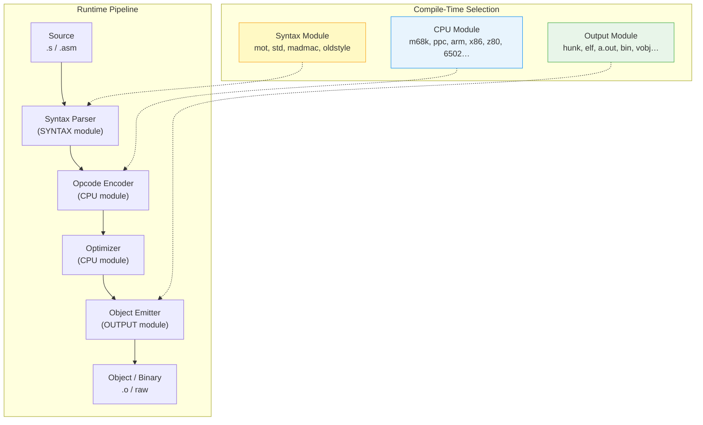
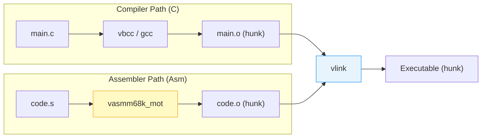
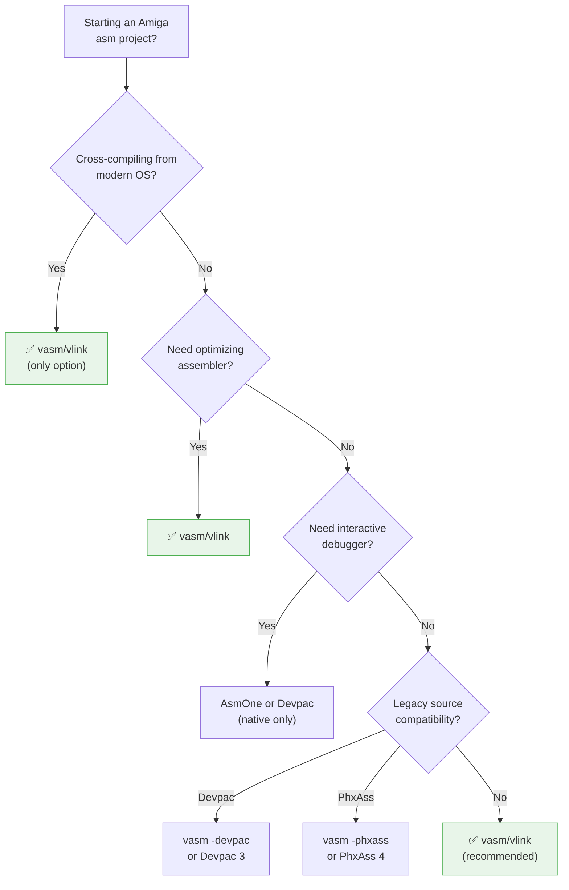

[← Home](../README.md) · [Toolchain](README.md)

# vasm & vlink — Portable Assembler and Linker for Amiga

## Overview

**vasm** is a modern, free, portable assembler by Frank Wille and Volker Barthelmann.

**vlink** is its companion linker.

Together they form the primary open-source toolchain for 68k Amiga development — replacing the proprietary Devpac/PhxAss assemblers and the aging `blink` linker from SAS/C.

**vasm** compiles on any host (Linux, macOS, Windows, AmigaOS, MorphOS, Atari TOS) and targets 17+ CPU families with 4 syntax dialects and 30+ output formats.

Unlike legacy assemblers tied to one platform, vasm's modular architecture lets you **cross-assemble** Amiga executables from a modern development machine. Combined with vlink's multi-format linking, GNU-style linker scripts, and support for Amiga hunk, ELF, a.out, and raw binary formats, this toolchain bridges retro development with modern CI/CD workflows.

---

## Architecture — The Modular Engine

### Three Independent Module Layers

vasm separates concerns into three orthogonal modules. You pick one of each at compile time:



This design means the M68k backend works identically whether you write Motorola syntax (Devpac-compatible), GNU-as style (`std`), Atari MadMac syntax, or old-style 8-bit mnemonics. Adding a new CPU requires only a new CPU module — all existing syntax and output modules work immediately.

### CPU Modules

| Module | Target | Amiga Relevance |
|---|---|---|
| **m68k** | 68000–68060, CPU32, 68881/2, 68851 MMU, Apollo 68080 | Primary Amiga target |
| **ppc** | POWER, 40x, 440, 6xx, 7xx, Book-E, e300, e500 | WarpOS / AmigaOS 4 |
| **coldfire** | V2, V3, V4, V4e | Amiga clone hardware |
| **arm** | ARMv1–v4, THUMB | Cross-platform / emulator tools |
| **x86** | IA32 8/16/32-bit (AT&T syntax) | AROS / cross-tools |
| **6502** | 6502, 65C02, 65816, Mega65 | Retro platforms |
| **z80** | Z80, 8080, 8085, GBZ80 | Retro platforms |

### Syntax Modules

| Module | Style | Equivalent To |
|---|---|---|
| **mot** | Motorola 68k | Devpac, PhxAss, AsmOne, Barfly |
| **std** | GNU-as AT&T | `m68k-elf-as`, `powerpc-elf-as` |
| **madmac** | Atari MadMac | Atari ST assemblers (6502, 68k, Jaguar) |
| **oldstyle** | Classic 8-bit | 6502/Z80 era assemblers |

---

## Installation

### From Source (All Platforms)

```bash
# vasm — assembler
wget http://sun.hasenbraten.de/vasm/release/vasm.tar.gz
tar xzf vasm.tar.gz && cd vasm

# Build M68k with Motorola syntax (Amiga target):
make CPU=m68k SYNTAX=mot
# Produces: vasmm68k_mot

# Build with Devpac compatibility flags baked in:
make CPU=m68k SYNTAX=mot
# Use -devpac flag at runtime for full compatibility

# vlink — linker
wget http://sun.hasenbraten.de/vlink/release/vlink.tar.gz
tar xzf vlink.tar.gz && cd vlink
make
# Produces: vlink
```

### Host-Specific Makefiles

vasm ships with platform-specific Makefiles for native Amiga and retro hosts:

| Makefile | Target Platform |
|---|---|
| `Makefile` | Linux / macOS / Unix (gcc) |
| `Makefile.68k` | AmigaOS 68020+ (vbcc) |
| `Makefile.OS4` | AmigaOS 4 (vbcc) |
| `Makefile.MOS` | MorphOS (vbcc) |
| `Makefile.WOS` | WarpOS (vbcc) |
| `Makefile.TOS` | Atari TOS 68000 (vbcc) |
| `Makefile.MiNT` | Atari MiNT 68020+ (vbcc) |
| `Makefile.Win32` | Windows (MSVC) |
| `Makefile.Win32FromLinux` | Cross-compile Windows binary from Linux |

### CMake Build

```bash
mkdir build && cd build
cmake -DVASM_CPU=m68k -DVASM_SYNTAX=mot ..
make
```

The resulting binary is named `vasm<CPU>_<SYNTAX>` — e.g. `vasmm68k_mot`, `vasmppc_std`.

### Pre-Built Binaries

Both daily snapshots and tagged release binaries are available from the official site for Windows, AmigaOS, MorphOS, and Linux. These are the easiest path for beginners.

---

## vasm Usage — Comprehensive Reference

### Basic Invocation

```bash
vasmm68k_mot -Fhunk -o output.o input.s
```

### Complete Flag Reference

| Flag | Description |
|---|---|
| `-Fhunk` | Output Amiga hunk format object file |
| `-Felf` | Output ELF object file |
| `-Fbin` | Output raw binary (no headers, no relocations) |
| `-Fvobj` | Output VOBJ (versatile object format, vlink-native) |
| `-Faout` | Output a.out object file |
| `-o <file>` | Output file name |
| `-L <file>` | Generate listing file |
| `-I<path>` | Add include path |
| `-D<sym>=<val>` | Define symbol with value |
| `-D<sym>` | Define symbol = 1 |
| `-m68000` | Target 68000 (default) |
| `-m68020` | Target 68020+ |
| `-m68030` | Target 68030+ |
| `-m68040` | Target 68040+ |
| `-m68060` | Target 68060 |
| `-no-opt` | Disable all assembler optimizations |
| `-no-fpu` | Disable FPU instructions (68881/68882) |
| `-no-mmu` | Disable MMU instructions (68851) |
| `-devpac` | Devpac compatibility mode |
| `-phxass` | PhxAss compatibility mode |
| `-chklabels` | Warn on unused/redefined labels (default) |
| `-nocase` | Case-insensitive symbols |
| `-align` | Enable automatic alignment |
| `-spaces` | Allow spaces in operands (Devpac compatible) |
| `-ldots` | Accept `...` for local labels (PhxAss compatible) |
| `-warnunaligned` | Warn on odd-address memory accesses |
| `-quiet` | Suppress banner and progress |
| `-version` | Print version and module info |

### Devpac Compatibility Mode (`-devpac`)

Enables the full Devpac dialect: unsigned right-shifts, named macro arguments, `OPT` directive parsing, `STRUCT`/`RS` directives with Devpac semantics, and Devpac-style local label scoping (`\@`).

```bash
vasmm68k_mot -Fhunk -devpac -o output.o input.s
```

### PhxAss Compatibility Mode (`-phxass`)

Enables PhxAss-specific extensions: `NEAR CODE`/`NEAR DATA`, `OPT` as PhxAss directive, and PhxAss local label rules.

---

## M68k CPU Module — Deep Dive

### Supported Instructions

Full 68000 through 68060 instruction sets including:
- All integer instructions per CPU level
- 68881/68882 FPU (`FMOVE`, `FADD`, `FMUL`, `FDIV`, `FSQRT`, etc.)
- 68851 PMMU (`PLOAD`, `PTEST`, `PFLUSH`, `PMOVE`, etc.)
- Apollo 68080 extensions (`MOVEIW`, `ADDIW`, `SUBIW`, `CMPIW`, `LPSTOP`)

### Automatically Selected Instruction Variants

When targeting higher CPUs, vasm selects the appropriate encoding automatically:

```asm
; These produce different encodings depending on -m68000 vs -m68020:
MOVE.L  D0, (A0)+        ; 68000: MOVE.L (An)+ form
                         ; 68020+: uses scaled addressing if beneficial

MULS.L  D1, D2:D3        ; 68000: ERROR (32-bit MULS requires 68020+)
                         ; 68020+: valid

BFEXTU  (A0){4:8}, D0    ; 68000: ERROR
                         ; 68020+: valid bitfield extract

; Apollo 68080 special:
ANDI.L  #$FF, D0         ; -m68080: optimized to EXTUB.L D0
```

### Addressing Mode Optimization

vasm automatically optimizes addressing modes:

```asm
; Written by programmer:
LEA     label(PC), A0     ; PC-relative LEA
MOVE.L  label, D0          ; Absolute long → may relax to PC-relative

; vasm may rewrite:
MOVE.L  label, D0          ; → MOVE.L label(PC), D0  (shorter, position-independent)
BRA     far_target         ; → JMP far_target if out of 16-bit range
```

---

## Optimization System

vasm performs multiple optimization passes by default. All optimizations are safe for position-independent code.

### Default Optimizations (always on)

| Optimization | Description |
|---|---|
| **Branch shortening** | Choose smallest encoding: `BRA.S` vs `BRA.W` vs `JMP` |
| **Absolute → PC-relative** | Convert `MOVE.L abs, Dn` to `MOVE.L abs(PC), Dn` |
| **Addressing mode** | Replace slower addressing with faster equivalent |
| **LEA optimization** | Convert `LEA (An), An` to `MOVE.L An, An` |
| **MOVEQ** | `MOVE.L #0–127, Dn` → `MOVEQ #n, Dn` |
| **ADDQ/SUBQ** | `ADDI #1–8, Dn` → `ADDQ #n, Dn` |
| **CLR** | `MOVE.L #0, Dn` → `CLR.L Dn` (or `MOVEQ #0, Dn`) |

### CPU-Specific Optimizations

```
-m68020+:    MOVE.W #0, (An)+  →  CLR.W (An)+
-m68040+:    Use MOVE16 for block copies (when beneficial)
-m68060:     Avoid pipeline stalls (instruction reordering lite)
-m68080:     EXTUB.L, ADDIW/SUBIW, CMPIW, LPSTOP
```

### Disabling Optimizations

```bash
vasmm68k_mot -no-opt -Fhunk -o output.o input.s    ; All optimizations off
```

> [!NOTE]
> Disabling optimizations is useful when comparing output with another assembler, or when generating exact byte-identical builds from known-good disassembly.

---

## vlink — Architecture & Usage

### Overview

vlink is a multi-format linker that can read and write 30+ object and executable formats. For Amiga development, its primary role is linking hunk-format object files into AmigaOS executables, but it also handles ELF→hunk conversion, binary output for ROM images, and cross-format linking.

### How vlink Differs from blink

| Feature | vlink | SAS/C blink |
|---|---|---|
| **Input formats** | hunk, ELF, a.out, VOBJ, TOS, o65 | hunk only |
| **Output formats** | hunk, ELF, a.out, raw, hex, S-rec | hunk only |
| **Linker scripts** | GNU-style `.cmd` files | Manual `FROM`/`TO` |
| **Dead-code elimination** | `KEEP()` / garbage collection | None |
| **Cross-platform** | Linux, macOS, Windows, Amiga | Amiga only |
| **Active maintenance** | Yes (v0.18a, 2025) | No (abandoned 1990s) |

### Basic Invocation

```bash
# Link hunk objects into Amiga executable:
vlink -bamigahunk -o myapp input1.o input2.o -Llib -lexec -ldos

# Link with a linker script:
vlink -bamigahunk -o myapp input.o -L. -T vlink.cmd
```

### Complete Flag Reference

| Flag | Description |
|---|---|
| `-bamigahunk` | Output Amiga hunk executable |
| `-brawbin` | Output raw binary |
| `-belf32m68k` | Output ELF 32-bit M68k |
| `-o <file>` | Output file name |
| `-s` | Strip all symbols from output |
| `-x` | Strip local symbols only |
| `-r` | Relocatable output (partial link) |
| `-L<path>` | Library search path |
| `-l<lib>` | Link with library (`lib<lib>.a` or `<lib>.lib`) |
| `-T <file>` | Use linker script |
| `-Map <file>` | Generate link map |
| `-Rshort` | Prefer short (16-bit) relocations |
| `-minalign <n>` | Minimum section alignment |
| `-nostdlib` | Don't link standard startup/libraries |
| `-e <sym>` | Set entry point symbol |
| `-defsym <sym>=<val>` | Define symbol |
| `-baseoff` | Output base-relative (position-independent) |
| `-kick1` | Kickstart 1.x compatible executable |
| `-wfail` | Treat warnings as errors |

### Linker Scripts — GNU-Style Control

vlink linker scripts use a memory-regions + section-mapping model:

```ld
/* vlink.cmd — Linker script for AmigaOS executable */

/* Define memory regions */
MEMORY
{
    CODE:   ORIGIN=0x00000000  LENGTH=512K
    DATA:   ORIGIN=0x00080000  LENGTH=256K
}

/* Map input sections to output sections */
SECTIONS
{
    .text :
    {
        *(.text .text.*)        /* All code sections */
        *(.rodata .rodata.*)    /* Read-only data */
        KEEP(*(.init .init.*))  /* Never garbage-collect init */
        KEEP(*(.fini .fini.*))
    } > CODE

    .data :
    {
        *(.data .data.*)
        *(COMMON)
    } > DATA

    .bss (NOLOAD) :
    {
        *(.bss .bss.*)
    } > DATA

    /* Constructor/destructor lists */
    VBCC_CONSTRUCTORS
}
```

> [!NOTE]
> When no linker script is provided, vlink uses sensible defaults: all code sections merged into one HUNK_CODE, all data into HUNK_DATA, and BSS into HUNK_BSS.

### Library Resolution

vlink resolves library references using the standard Amiga naming conventions:

```bash
# These are equivalent on Amiga:
vlink -lamiga myapp.o -Llib:
# Links against lib:amiga.lib

# -l<name> searches for <name>.lib or lib<name>.a in -L paths
vlink -lexec -ldos myapp.o -Llib: -L.
```

---

## Complete Worked Examples

### Example 1: Minimal Amiga Executable (Motorola Syntax)

```asm
; hello.s — Minimal AmigaOS executable using vasm mot-syntax
        SECTION code,CODE

start:
        move.l  4.w,a6              ; SysBase → A6
        lea     dosname(pc),a1      ; library name
        moveq   #0,d0               ; any version
        jsr     -552(a6)            ; OpenLibrary()

        tst.l   d0
        beq.s   .exit               ; library not found
        move.l  d0,a6               ; DOSBase → A6

        ; Write("Hello Amiga!\n") to stdout
        jsr     -60(a6)             ; Output() → stdout handle
        move.l  d0,d1               ; D1 = file handle
        lea     msg(pc),a0
        move.l  a0,d2               ; D2 = buffer pointer
        moveq   #13,d3              ; D3 = length
        jsr     -48(a6)             ; Write(fh, buf, len)

        ; Cleanup
        move.l  a6,a1               ; DOSBase
        move.l  4.w,a6              ; SysBase → A6
        jsr     -414(a6)            ; CloseLibrary()

.exit:
        moveq   #0,d0               ; return code
        rts

dosname: dc.b "dos.library",0
msg:     dc.b "Hello Amiga!",10
        EVEN
```

Build and link:

```bash
vasmm68k_mot -Fhunk -o hello.o hello.s
vlink -bamigahunk -o hello hello.o
```

### Example 2: Multi-File Project with Data Section

```asm
; main.s — Code hunk
        SECTION code,CODE
        xdef    _start

_start:
        move.l  4.w,a6
        lea     libname(pc),a1
        moveq   #0,d0
        jsr     -552(a6)            ; OpenLibrary("dos.library")
        move.l  d0,a5
        beq     .exit

        ; Print pre-initialized string from data section
        jsr     -60(a5)             ; Output()
        move.l  d0,d1
        lea     message,a0          ; Absolute reference → needs reloc
        move.l  a0,d2
        moveq   #msg_len,d3
        jsr     -48(a5)             ; Write()

        move.l  a5,a1
        move.l  4.w,a6
        jsr     -414(a6)            ; CloseLibrary()
.exit:  moveq   #0,d0
        rts

libname: dc.b "dos.library",0

; data.s — Data hunk
        SECTION data,DATA
        xdef    message,msg_len

message: dc.b "Hello from DATA hunk!",10
msg_len  equ   *-message
```

Build:

```bash
vasmm68k_mot -Fhunk -o main.o main.s
vasmm68k_mot -Fhunk -o data.o data.s
vlink -bamigahunk -o myapp main.o data.o
```

### Example 3: Calling C from Assembly (vbcc Integration)

```asm
; asm_part.s — Assembly file linked with C
        SECTION code,CODE
        xdef    _Multiply
        ; int32_t Multiply(int32_t a, int32_t b);
        ; Args: D0 = a, D1 = b. Return: D0

_Multiply:
        muls.l  d1,d0               ; D0 = a * b (requires 68020+)
        rts

        xdef    _SwapBytes
        ; uint32_t SwapBytes(uint32_t val);
        ; Args: D0 = val. Return: D0

_SwapBytes:
        ror.w   #8,d0
        swap    d0
        ror.w   #8,d0
        rts
```

```c
// main.c — C file compiled with vbcc
extern int32_t Multiply(int32_t a, int32_t b);
extern uint32_t SwapBytes(uint32_t val);

int main(void)
{
    int32_t result = Multiply(7, 6);      // → 42
    uint32_t swapped = SwapBytes(0x12345678); // → 0x78563412
    return 0;
}
```

Build with vasm + vbcc + vlink:

```bash
vasmm68k_mot -Fhunk -m68020 -o asm_part.o asm_part.s
vc +aos68k -c main.c -o main.o
vlink -bamigahunk -o program main.o asm_part.o -L$VBCC/ targets/m68k-amigaos/lib -lvc
```

### Example 4: Linker Script for ROM Image

```asm
; rom.s — Code for a ROM image (absolute addressing)
        SECTION rom_code,CODE
        org     $00F80000            ; ROM base in Amiga address space

ROM_Entry:
        move.w  #$4EF9,(ROM_Jump)    ; JMP opcode
        lea     InitCode(pc),a0
        move.l  a0,(ROM_Jump+2)
        jmp     InitCode
ROM_Jump: ds.l 2

InitCode:
        ; Hardware initialization
        lea     $DFF000,a0
        move.w  #$7FFF,$9A(a0)       ; Disable all interrupts
        ; ... more init ...
        rts
```

```ld
/* rom.cmd — Linker script for ROM binary */
MEMORY
{
    ROM: ORIGIN=0x00F80000  LENGTH=512K
}

SECTIONS
{
    .text :
    {
        *(.text .text.*)
    } > ROM
}
```

```bash
vasmm68k_mot -Fhunk -o rom.o rom.s
vlink -brawbin -T rom.cmd -o kickstart.rom rom.o
```

### Example 5: Macros and Conditional Assembly

```asm
; macros.i — Include file demonstrating vasm macro features

; Debug print macro (conditional on DEBUG symbol)
        ifd     DEBUG
DEBUG_PRINT macro
        movem.l d0-d1/a0-a1,-(sp)
        move.l  \1,d1               ; file handle
        lea     \2(pc),a0           ; string
        move.l  a0,d2
        moveq   #\3,d3              ; length
        jsr     -48(a6)
        movem.l (sp)+,d0-d1/a0-a1
        endm
        else
DEBUG_PRINT macro
        ; No-op when DEBUG not defined
        endm
        endc

; Struct definition using RS directives
        STRUCTURE Player,0
        LONG    px,py                ; Position
        WORD    hp                   ; Hit points
        BYTE    alive                ; 0 = dead, 1 = alive
        BYTE    pad
        LONG    sprite_ptr           ; Pointer to sprite data
        sizeof  Player_SIZE
```

---

## Comparison with Other Amiga Assemblers

### Feature Matrix

| Feature | vasm | Devpac 3 | PhxAss 4 | AsmOne | Barfly |
|---|---|---|---|---|---|
| **Free / Open Source** | ✓ | ✗ | ✓ | ✗ | ✗ |
| **Cross-platform host** | ✓ | ✗ | ✗ | ✗ | ✗ |
| **M68k up to 68060** | ✓ | 68030 | 68040+FPU | 68060 | 68060 |
| **68080 (Apollo)** | ✓ | ✗ | ✗ | ✗ | ✗ |
| **Automatic optimizations** | ✓ | ✗ | ✗ | ✗ | ✗ |
| **Branch relaxation** | ✓ | ✗ | ✗ | ✗ | ✓ |
| **Macro system** | ✓ | ✓ | ✓ | ✓ | ✓ |
| **Multiple output formats** | 30+ | 1 (hunk) | 1 (hunk) | 1 (hunk) | 2 |
| **Linker** | vlink (multi-format) | blink | blink | blink | blink |
| **Linker scripts** | ✓ | ✗ | ✗ | ✗ | ✗ |
| **Active development** | ✓ (2026) | ✗ (1994) | ✗ (1998) | ✗ (1996) | ✗ (2000) |
| **IDE / debugger** | ✗ | ✓ (MonAm) | ✗ | ✓ (built-in) | ✗ |

### When to Choose Each

| Assembler | Best For |
|---|---|
| **vasm** | Cross-development, modern CI/CD, multi-platform projects, optimizing for size |
| **Devpac** | Native Amiga development with MonAm debugger, legacy source compatibility |
| **PhxAss** | Legacy source that uses `NEAR CODE`/`NEAR DATA` or PhxAss-specific macros |
| **AsmOne** | Interactive debugging on native hardware, quick test cycles |
| **Barfly** | Legacy projects already using Barfly-specific features |

---

## Integration with the Amiga Toolchain

vasm and vlink are the assembler/linker pair used by **vbcc** and **bebbo's GCC 6.x toolchain**. The typical workflow:



### Companion Tools

| Tool | Role | Integration |
|---|---|---|
| [vbcc](vbcc.md) | C compiler | Uses vasm as assembler, vlink as linker |
| **bebbo's GCC** | C/C++ cross-compiler | Uses vasm/vlink (configurable) |
| **IRA** | Disassembler → reassembler | Emits vasm-compatible Motorola syntax |
| **Aira Force** | Reassembler pipeline | Uses vasm as reassembly engine |
| [FD files](fd_files.md) | Library jump table generation | Used with `fd2pragma` → C headers |

---

## Decision Guide — When to Use vasm/vlink



### When to Use vasm/vlink

1. **Cross-compiling** from Linux, macOS, or Windows — native assemblers won't run
2. **New Amiga projects** — no legacy constraints, modern toolchain from day one
3. **Integrating C and assembly** — vlink handles mixed-language linking cleanly
4. **Automated builds / CI/CD** — command-line only, no GUI dependency
5. **Targeting 68020+ features** — vasm has better 020/030/040/060 support than legacy assemblers
6. **ROM / absolute code** — vlink linker scripts give precise memory layout control
7. **Size optimization** — vasm's automatic optimization often produces smaller code than hand-tuned assembly

### When NOT to Use vasm/vlink

1. **Interactive debugging on native hardware** — AsmOne's built-in debugger (breakpoints, single-step, register dump) has no equivalent in the vasm/vlink workflow
2. **Legacy source with undocumented Devpac quirks** — some old source relies on Devpac bugs or undocumented behavior that `-devpac` mode doesn't replicate
3. **Macro-heavy PhxAss source** — PhxAss has a unique macro syntax parser; `-phxass` mode covers most but not all edge cases

---

## Best Practices

1. **Always specify `-Fhunk` explicitly** — don't rely on defaults; be explicit about output format
2. **Use `-devpac` for legacy source** — avoids porting Devpac-specific directives by hand
3. **Let the optimizer work** — don't disable optimizations unless debugging output differences
4. **Use `xdef`/`xref` consistently** — vasm enforces symbol visibility; undeclared `xref` symbols generate warnings (use `-chklabels` to catch typos)
5. **Separate code and data into sections** — use `SECTION code,CODE` and `SECTION data,DATA` for proper hunk separation
6. **Use a linker script for complex layouts** — ROM images, overlay systems, and custom memory maps benefit from explicit script control
7. **Build both debug and release configurations** — use `-DDEBUG` for conditional debug code (see Example 5)
8. **Pin tool versions for reproducibility** — vasm/vlink are actively developed; use the same version in CI that you develop with

### Antipatterns

| Antipattern | Why It's Wrong | Correct Approach |
|---|---|---|
| **The Vanishing Reference** | Using `xref` but forgetting to actually provide the symbol in another object → linker error at final link | `xdef` the symbol in exactly one source file; verify with `-Map` output |
| **The Mixed Syntax** | Writing half Devpac, half GNU-as syntax in the same file | Pick one syntax module (`mot` or `std`) at project start and stick with it |
| **The Naked ORG** | Using `org` without a linker script → sections overlap silently | Use linker scripts (`-T`) to define memory regions for absolute code |
| **The Optimization Gambler** | Disabling optimizations everywhere for "consistency" → larger, slower code | Only disable per-file when debugging output differences; use `-no-opt` surgically |
| **The Sectionless Source** | Not declaring sections → all code goes into a default unnamed section → no control over hunk layout | Always use `SECTION name,type` at the top of each file |

---

## Pitfalls

### 1. Case Sensitivity of Symbols

vasm symbols are case-sensitive by default. Devpac was case-insensitive. If you get "undefined symbol" errors when assembling old Devpac source:

```bash
# Fix: enable case-insensitive mode
vasmm68k_mot -Fhunk -nocase -o output.o input.s
```

### 2. Section Attributes for Hunk Output

The hunk output module reads the **second argument** of the `SECTION` directive to determine the hunk type:

```asm
SECTION code,CODE    ; → HUNK_CODE    ($3E9)
SECTION data,DATA    ; → HUNK_DATA    ($3EA)
SECTION bss,BSS      ; → HUNK_BSS     ($3EB) — zero-filled, no content emitted
```

Using `SECTION text,CODE` (GNU convention) works but `SECTION mycode` (no type) produces a generic hunk that may confuse the Amiga loader.

### 3. Absolute vs PC-Relative References

vasm may convert absolute references to PC-relative silently. This is correct behavior but can surprise developers inspecting the binary:

```asm
MOVE.L  MyData, D0     ; May become MOVE.L MyData(PC), D0
```

If you need an absolute reference (e.g., writing to custom chip registers at fixed addresses), it will remain absolute. Only relocatable symbols are eligible for conversion.

### 4. Library Resolution Order

vlink resolves libraries **left-to-right**. If `libA` depends on symbols from `libB`, `libB` must appear after `libA` on the command line:

```bash
# WRONG: libA needs libB symbols, but libB is searched first
vlink -bamigahunk -o app main.o -lB -lA

# CORRECT: libA searched first, then libB resolves its dependencies
vlink -bamigahunk -o app main.o -lA -lB
```

### 5. Kickstart 1.x Compatibility

AmigaOS 1.x (`kickstart 1.2`/`1.3`) has a simpler hunk loader. Use the `-kick1` flag to generate compatible executables:

```bash
vlink -bamigahunk -kick1 -o app main.o -lamiga
```

Without this flag, vlink may emit hunk structures (HUNK_RELRELOC32, HUNK_DEBUG, HUNK_BREAK) that Kickstart 1.x doesn't understand.

---

## Historical Context

### The Assembler Landscape (1985–1995)

In the Amiga's commercial era, developers chose between several closed-source assemblers:

| Assembler | Era | Developer | Fate |
|---|---|---|---|
| **AssemPro** | 1986–1990 | Softec | Abandoned |
| **A68k** | 1987–1992 | Alpha Software | Abandoned |
| **ArgAsm** | 1987–1991 | Argonaut Software | Abandoned |
| **Devpac** | 1989–1994 | HiSoft | Abandoned |
| **AsmOne** | 1991–1996 | Rune Gram-Madsen | Abandoned |
| **Barfly** | 1993–2000 | K. J. Down | Abandoned |
| **PhxAss** | 1993–1998 | Frank Wille | Became vasm foundation |

PhxAss, also by Frank Wille, was the direct ancestor of vasm. When vbcc (by Volker Barthelmann) needed a portable assembler that could run on any host, the PhxAss compiler code was refactored into the modular vasm architecture. The M68k + mot-syntax combination retains deep PhxAss/Devpac compatibility.

### Modern Relevance

vasm/vlink are now the de facto standard assembler/linker for:
- The **Amiga demo scene** — size-constrained productions (4K/64K intros, demos)
- **MiSTer FPGA** and Minimig development — cross-compiling from ARM/Linux
- **AmigaOS 4** and **MorphOS** development — vasm targets PPC, vlink handles EHF and ELF
- **Game preservation** — reassembling disassembled game code with IRA → vasm → vlink

---

## References

### Official Sources

- **vasm home**: http://sun.hasenbraten.de/vasm/
- **vlink home**: http://sun.hasenbraten.de/vlink/
- **vbcc home**: http://sun.hasenbraten.de/vbcc/ (vasm/vlink are part of this toolchain)
- **vasm manual (PDF)**: http://sun.hasenbraten.de/vasm/release/vasm.pdf
- **vlink manual (PDF)**: http://sun.hasenbraten.de/vlink/release/vlink.pdf

### GitHub Mirrors & Community Repos

| Repository | Description |
|---|---|
| [retro-vault/vasm](https://github.com/retro-vault/vasm) | Git mirror of vasm — updated regularly |
| [retro-vault/vlink](https://github.com/retro-vault/vlink) | Git mirror of vlink — updated regularly |
| [StarWolf3000/vasm-mirror](https://github.com/StarWolf3000/vasm-mirror) | Git mirror of vasm (formerly hosted at mbitsnbites) |
| [dbuchwald/vasm](https://github.com/dbuchwald/vasm) | Git mirror with CI integration |
| [ezrec/vasm](https://github.com/ezrec/vasm) | Mirror with additional CPU backends |
| [kusma/amiga-dev](https://github.com/kusma/amiga-dev) | Pre-packaged Amiga dev environment (VBCC + vasm + vlink + PosixLib) |

### Related Articles in This Knowledge Base

- [vbcc](vbcc.md) — C compiler that uses vasm/vlink as its assembler/linker
- [gcc_amiga.md](gcc_amiga.md) — bebbo's GCC toolchain (configurable to use vasm/vlink)
- [FD files](fd_files.md) — FD/SFD file format; `fd2pragma` generates C headers used with vbcc+vasm
- [Makefiles](makefiles.md) — Makefile patterns for vasm/vlink and mixed C+asm projects
- [HUNK Format](../03_loader_and_exec_format/hunk_format.md) — The executable format vlink outputs and vasm can emit
- [Debugging](debugging.md) — Tools that work with vasm/vlink output (Enforcer, SnoopDOS, FS-UAE GDB)
- [Register Conventions](../04_linking_and_libraries/register_conventions.md) — ABI for C↔asm interop with vbcc

### Community Resources

- **English Amiga Board (EAB)**: Active forum with vasm/vlink troubleshooting threads
- **Atari-Forum**: Cross-platform vasm/vlink discussions (many Amiga developers also target Atari)
- **AmigaSource**: Curated link collection pointing to vasm/vlink resources
- **Reaktor Crash Course**: Tutorial for Amiga assembly with vasm: https://www.reaktor.com/insights-and-events/crash-course-to-amiga-assembly-programming
