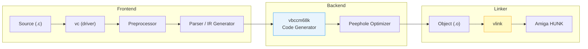
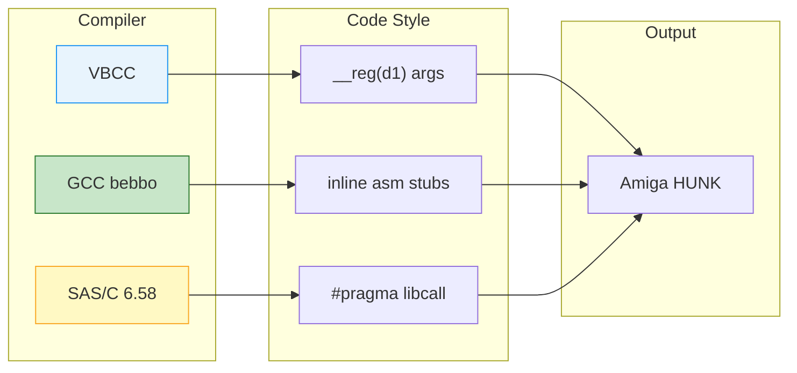

[← Home](../README.md) · [Toolchain](README.md)

# VBCC — Volker Barthelmann's Portable C Compiler for AmigaOS

## Overview

**VBCC** is a portable, retargetable ISO C89 compiler created by **Volker Barthelmann** in the mid-1990s. It is the second most widely used cross-compiler for AmigaOS after GCC bebbo, and unlike GCC it was designed from the ground up as a lightweight, fast compiler with aggressively optimized code generation. The Amiga m68k backend (`vbccm68k`) is actively maintained and supports AmigaOS 3.x, AmigaOS 4, MorphOS, and AROS from a single toolchain.

The defining feature of VBCC on Amiga is the **`__reg()` storage class** — a compiler extension that lets C programmers explicitly place variables and function arguments in specific 68000 registers. This maps naturally onto the AmigaOS register-based library calling convention, making OS API calls intuitive without the macro gymnastics required by GCC inline assembly.

Key constraints:
- **C89 only** — no C++, no GNU extensions (use `-c99` for limited C99 support)
- **Cross-compiler** — runs on Linux, macOS, Windows; no native Amiga IDE
- **vlink required** — VBCC does not use GNU `ld`; it links with `vlink` (also by the vbcc team)
- **Config-driven** — target behavior is controlled by text config files in `vbcc/config/`

---

## Architecture

### Compiler Pipeline



### The Config System

VBCC uses **text-based target configuration files** rather than hardcoded backend behavior. The driver `vc` reads `vbcc/config/` to determine which preprocessor, compiler, assembler, and linker to invoke:

```
vbcc/
  bin/
    vc              ; frontend driver
    vbccm68k        ; m68k code generator
  config/
    m68k-amigaos    ; AmigaOS 3.x target config
    m68k-amigaos4   ; AmigaOS 4 target
    ppc-amigaos     ; PPC MorphOS / AmigaOS 4
  targets/
    m68k-amigaos/
      ; startup code, runtime libraries
```

The config file (`m68k-amigaos`) is a plain-text script that tells `vc`:
- Which preprocessor flags to pass
- Which code generator binary to run (`vbccm68k`)
- Which assembler syntax to emit (Motorola)
- Which linker (`vlink`) and which linker script
- Default include paths and library paths

This design means adding a new Amiga-like target requires only a new config file and a backend — no recompilation of the compiler itself.

---

## Installation

### Linux / macOS Cross-Compiler Setup

```bash
# 1. Download latest binaries from vbcc homepage:
# http://sun.hasenbraten.de/vbcc/

# 2. Extract and set environment:
export VBCC=/opt/vbcc
export PATH=$VBCC/bin:$PATH

# 3. Untar the m68k-amigaos target archive into $VBCC/
# This populates targets/m68k-amigaos/ with startup code and libs

# 4. Verify:
vc +m68k-amigaos -v hello.c
# Should compile and link to Amiga hunk format
```

### Windows (MSYS2 / WSL)

The same binaries work under WSL. For native Windows, use the provided `vc.exe` and `vlink.exe` with MinGW or MSYS2 paths.

---

## The `__reg()` Storage Class

VBCC's most powerful Amiga-specific extension is `__reg()`, which places C variables in named CPU registers. This eliminates the need for inline assembly wrappers when calling AmigaOS libraries.

### Basic Syntax

```c
/* Place a variable in register D0 */
int __reg("d0") result;

/* Place a pointer in register A0 */
char * __reg("a0") buffer;

/* Function with register arguments — matches AmigaOS .fd conventions */
BPTR __reg("d0") MyOpen(
    __reg("d1") CONST_STRPTR name,
    __reg("d2") LONG accessMode);
```

### AmigaOS Library Call Example

```c
#include <proto/dos.h>

/* Without __reg() — compiler uses stack, stub fixes it up */
/* With __reg() — compiler generates exact register layout */

struct DosLibrary *DOSBase;

void writeHello(void)
{
    BPTR fh = Open("CON:0/0/640/200/Hello", MODE_NEWFILE);
    if (fh)
    {
        char msg[] = "Hello from VBCC\n";
        Write(fh, msg, sizeof(msg) - 1);
        Close(fh);
    }
}
```

The `<proto/dos.h>` header for VBCC uses `__reg()` internally:

```c
/* proto/dos.h (VBCC version) — simplified */
#pragma amicall(DOSBase, 0x1E, Open(__reg("d1") CONST_STRPTR name,
                                    __reg("d2") LONG accessMode))
```

This produces the same machine code as hand-written assembly:

```asm
; VBCC-generated code for Open("foo", MODE_OLDFILE):
MOVEA.L _DOSBase, A6
LEA     .str_foo, A0
MOVE.L  A0, D1          ; name → D1
MOVEQ   #1002, D2       ; MODE_OLDFILE → D2
JSR     -30(A6)         ; Open() LVO = -30
; D0 = file handle
```

### Register Allocation Rules

| Register | `__reg()` String | Safe For |
|---|---|---|
| D0 | `"d0"` | Return values, scratch |
| D1–D7 | `"d1"` … `"d7"` | Arguments, local variables |
| A0 | `"a0"` | Arguments, scratch pointers |
| A1–A3 | `"a1"` … `"a3"` | Arguments |
| A4 | `"a4"` | Small-data base (see below) |
| A5 | `"a5"` | Frame pointer (rarely used) |
| A6 | `"a6"` | Library base (OS calls only) |
| A7 | `"a7"` | Stack pointer — **never use** |

> [!WARNING]
> `__reg("a6")` is reserved for library base pointers during OS calls. Using it for general variables will corrupt the next `JSR -LVO(A6)` and crash. `__reg("a7")` is the stack pointer — the compiler will reject this or generate broken code.

---

## Pragmas and FD File Conversion

### VBCC Pragma Format

VBCC pragmas are simpler than SAS/C's numeric encoding:

```c
/* dos_pragmas.h for VBCC */
#pragma amicall(DOSBase, 0x1E, Open(d1,d2))
#pragma amicall(DOSBase, 0x24, Close(d1))
#pragma amicall(DOSBase, 0x2A, Read(d1,d2,d3))
```

- `0x1E` = LVO offset (hex) — the compiler computes the actual JSR offset
- `Open(d1,d2)` = function name and argument registers (left to right)
- The compiler generates `__reg()` assignments automatically

### Converting FD Files with `cvinclude.pl`

VBCC ships `cvinclude.pl` — a Perl script that converts Amiga `.fd` files into VBCC pragma headers:

```bash
# Generate VBCC pragmas from an FD file:
cvinclude.pl -v -a dos_lib.fd > dos_pragmas.h

# Generate inline-style prototypes:
cvinclude.pl -v -i exec_lib.fd > exec_inline.h
```

| Tool | Input | Output | Compiler |
|---|---|---|---|
| `fd2pragma` | `.fd` | SAS/C `#pragma libcall` | SAS/C |
| `fd2inline` | `.fd` | GCC inline asm | GCC |
| `cvinclude.pl` | `.fd` | VBCC `#pragma amicall` | VBCC |

---

## Compilation Workflow

### Command-Line Usage

```bash
# Compile and link in one step:
vc +m68k-amigaos -o myapp myapp.c

# Compile only (object file):
vc +m68k-amigaos -c -o myapp.o myapp.c

# Link separately:
vlink -bamigahunk -o myapp myapp.o -L/opt/vbcc/targets/m68k-amigaos/lib -lamiga
```

### Common Flags

| Flag | Description |
|---|---|
| `+m68k-amigaos` | Select AmigaOS 3.x target config |
| `+m68k-amigaos4` | Select AmigaOS 4 target |
| `-O` | Enable optimizations |
| `-speed` | Optimize for speed (aggressive inlining, loop unrolling) |
| `-size` | Optimize for code size |
| `-m68000` | Target plain 68000 (default) |
| `-m68020` | Target 68020+ |
| `-m68030` | Target 68030 |
| `-m68040` | Target 68040 |
| `-m68060` | Target 68060 |
| `-fpu` | Enable FPU instructions (68881/68882/040/060) |
| `-c99` | Enable C99 features (limited support) |
| `-I<path>` | Add include path |
| `-L<path>` | Add library path |
| `-l<lib>` | Link with library |
| `-g` | Include debug info (HUNK_DEBUG) |
| `-s` | Strip symbols |
| `-v` | Verbose output |
| `-k` | Keep intermediate files |

### CPU Target Decision Matrix

| Target | Use When | Code Size | Notes |
|---|---|---|---|
| `-m68000` | A500, A1000, A2000, CDTV | Smallest | No 32-bit multiply/divide in hardware |
| `-m68020` | A1200, A3000, A4000/030 | Medium | `MULS.L`, `DIVS.L`, `BFEXTU` available |
| `-m68030` | A4000/030, accelerated systems | Medium | Adds `MMU` instructions (rarely used) |
| `-m68040` | 040 accelerators | Larger | Hardware FPU; disable with `-m68040 -no-fpu` for LC/EC |
| `-m68060` | 060 accelerators | Largest | Superscalar; some instructions emulated in software |

---

## Startup Code and Runtime

VBCC provides several startup modules for different application types:

| Startup Module | Use For | Notes |
|---|---|---|
| `minstart.o` | Minimal CLI programs | No C library; smallest possible binary |
| `amiga.o` / `startup.o` | Standard CLI programs | Opens DOS, sets up stdin/stdout |
| `wbstart.o` | Workbench programs | Handles WBStartup message, tooltypes |
| `libinit.o` | Shared libraries | RTF_AUTOINIT compatible entry point |

The startup module is linked automatically by the target config unless you override it.

```bash
# Link with custom startup (no default C runtime):
vc +m68k-amigaos -nostdlib -o raw.bin main.c minstart.o
```

---

## VBCC vs. GCC vs. SAS/C



| Feature | VBCC | GCC bebbo | SAS/C 6.58 | Clang/LLVM (conceptual) |
|---|---|---|---|---|
| **License** | Free (personal use) | GPL | Commercial (abandonware) | Apache 2.0 |
| **Host OS** | Linux, macOS, Windows | Linux, macOS, Windows | AmigaOS only | Linux, macOS, Windows |
| **C standard** | C89 (+ `-c99` partial) | C11 (GCC 6.5) | C89 | C11/C17/C23 |
| **C++** | No | Yes | No | Yes (full C++20/23) |
| **Register control** | `__reg()` | `__asm("d1")` inline | `#pragma libcall` | Not needed (no m68k backend) |
| **Code quality** | Excellent, tight | Good, mature | Good (best for 1980s-era 68000) | Excellent (LLVM optimizer) |
| **Optimizations** | Aggressive peephole | GCC -O3 | Global optimizer + peephole | Multi-pass SSA-based |
| **Compile speed** | **Fast** | Slow | Medium | Medium-fast |
| **Linker** | `vlink` | `vlink` or GNU `ld` | `blink` (integrated) | `lld` (or system linker) |
| **Active dev** | Yes (2020s) | Yes (bebbo) | No (1990s) | Yes (very active) |
| **AmigaOS 4** | Yes | Yes | No | No m68k backend |
| **MorphOS** | Yes | Limited | No | No m68k backend |
| **AROS** | Yes | Yes | No | No m68k backend |
| **Debugging** | HUNK_DEBUG | HUNK_DEBUG + GDB remote | SAS stabs | DWARF (no Amiga output) |
| **Architecture** | Single monolithic backend per target | Monolithic with frontend/middle/backend layers | Monolithic (native only) | Modular: frontend → IR → optimizer → backend |

### Architectural Similarities to Clang/LLVM

VBCC and Clang share a surprising number of design philosophies despite being separated by two decades and targeting opposite ends of the performance spectrum:

| Design Aspect | VBCC | Clang/LLVM | Why It's Similar |
|---|---|---|---|
| **Driver + backend split** | `vc` driver invokes `vbccm68k` | `clang` driver invokes LLVM backend | Both separate the user-facing interface from the code generator; the driver handles flags, preprocessing, and toolchain orchestration |
| **Retargetable by design** | New target = new config file + backend binary | New target = new LLVM backend (TableGen `.td` files) | Both were architected from day one to support multiple architectures, unlike GCC which grew retargetability organically |
| **Text-based target description** | `config/m68k-amigaos` plain-text scripts | LLVM TableGen `.td` files (declarative DSL) | Both externalize target knowledge into data rather than hardcoding it in the compiler source. VBCC's config is procedural; Clang's is declarative |
| **Library-based architecture** | Backend is a separate binary (`vbccm68k`) | LLVM is a set of libraries (`libLLVMCore`, `libLLVMCodeGen`) | Both avoid monolithic compiler design. VBCC communicates via pipes/processes; LLVM communicates in-process via API calls |
| **Focus on clean IR** | Simple three-address IR with virtual registers | LLVM IR (SSA-based, typed) | Both use an intermediate representation to decouple the frontend from code generation. VBCC's IR is much simpler (no SSA, no phi nodes) |
| **Peephole optimization emphasis** | Primary optimization strategy | `llvm/lib/CodeGen/PeepholeOptimizer.cpp` | Both recognize that target-specific peephole patterns yield the biggest wins for simple ISAs like m68k |

### Where VBCC Diverges from Clang/LLVM

| Design Aspect | VBCC | Clang/LLVM | Practical Impact |
|---|---|---|---|
| **IR complexity** | Linear three-address code, no SSA | Full SSA with phi nodes, metadata, debug info | VBCC is much simpler to understand and debug; LLVM enables far more sophisticated optimizations (LTO, PGO, vectorization) |
| **Optimization pipeline** | Single peephole pass | Multi-pass: SROA, GVN, LICM, inlining, vectorization, etc. | VBCC cannot match LLVM on complex C++ or compute-heavy workloads, but is perfectly adequate for the C89-level code typical of Amiga programs |
| **Frontend language support** | C only (hand-written parser) | C, C++, ObjC, ObjC++, Swift, Rust, Julia, etc. | VBCC's parser is ~15,000 lines; Clang's is millions. The tradeoff is compile speed vs language coverage |
| **ABI knowledge** | All ABI logic in the backend config | TargetInfo + ABIInfo in Clang, calling convention in LLVM backend | VBCC's approach is simpler and more transparent for AmigaOS's register-based convention; LLVM's is more general but harder to customize for exotic ABIs |
| **Intermediate output** | Assembly text only (Motorola syntax) | LLVM IR (`.ll`), bitcode (`.bc`), assembly, object files | LLVM's multi-level IR enables link-time optimization and cross-module analysis; VBCC has no equivalent |
| **Open source** | Source available on request, free for personal use | Fully open source (Apache 2.0) | LLVM can be forked, modified, and redistributed freely; VBCC is maintained by a single author with controlled distribution |

### When to Choose VBCC

- **Rapid iteration** — VBCC compiles significantly faster than GCC, making it ideal for edit-compile-test cycles
- **Standards compliance** — stricter C89 checking than GCC; catches subtle portability bugs
- **Clean assembly output** — easier to read and audit than GCC's heavily macro-expanded output
- **Modern Amiga targets** — best support for AmigaOS 4, MorphOS, and AROS from one toolchain
- **Smaller binaries** — with `-size`, VBCC often beats GCC on code density

### When to Choose GCC Instead

- **C++ required** — VBCC does not support C++ at all
- **GNU extensions** — code using `__attribute__`, nested functions, or other GCCisms
- **Existing GCC codebase** — projects already using bebbo toolchain or libnix
- **GDB debugging** — GCC's GDB remote debugging is more mature than VBCC's limited debug output

---

## Practical Examples

### Minimal VBCC Program (CLI)

```c
/* hello.c */
#include <proto/dos.h>
#include <proto/exec.h>

int main(void)
{
    Printf("Hello, AmigaOS from VBCC!\n");
    return 0;
}
```

```bash
vc +m68k-amigaos -O -o hello hello.c
```

### Workbench Program with Tooltypes

```c
/* wbhello.c */
#include <proto/dos.h>
#include <proto/exec.h>
#include <workbench/startup.h>

int main(int argc, char **argv)
{
    struct WBStartup *wbmsg = NULL;

    if (argc == 0)
    {
        /* Launched from Workbench */
        wbmsg = (struct WBStartup *)argv;
        /* Read tooltypes from wbmsg->sm_ArgList->wa_ToolTypes */
    }
    else
    {
        /* Launched from CLI */
        Printf("Args: %ld\n", argc);
    }

    Printf("VBCC Workbench program running\n");
    return 0;
}
```

```bash
vc +m68k-amigaos -O -o wbhello wbhello.c
```

### Custom Register Function (Hand-Optimized Blitter Call)

```c
/* blitfast.c — hand-optimized blitter call using __reg() */
#include <hardware/custom.h>
#include <hardware/blit.h>

extern volatile struct Custom custom;

/* Match the hardware register layout exactly */
void __reg("d0") BlitWait(void)
{
    /* Wait for blitter DMA to finish */
    while (custom.dmaconr & (1 << 14))  /* BBUSY bit */
        ;
}

void __reg("a0") SetupBlit(
    __reg("d0") UWORD bltcon0,
    __reg("d1") UWORD bltcon1,
    __reg("d2") APTR srcA,
    __reg("d3") APTR srcB,
    __reg("d4") APTR dst)
{
    BlitWait();
    custom.bltcon0 = bltcon0;
    custom.bltcon1 = bltcon1;
    custom.bltapt  = srcA;
    custom.bltbpt  = srcB;
    custom.bltdpt  = dst;
}
```

```bash
vc +m68k-amigaos -O -speed -o blitfast blitfast.c
```

> [!WARNING]
> `__reg()` on function parameters is powerful but dangerous. If you mismatch the register with the actual hardware or OS expectation, you get silent corruption. Always verify against the `.fd` file or hardware register documentation.

---

## Best Practices & Antipatterns

### Best Practices

1. Always use `+m68k-amigaos` explicitly — do not rely on a default config
2. Use `-O` or `-speed` for release builds; `-size` for tight memory constraints
3. Prefer `__reg()` in performance-critical paths; let the compiler choose registers for general code
4. Verify register assignments against NDK `.fd` files before hand-rolling OS calls
5. Use `vlink` for linking — do not mix GNU `ld` with VBCC object files
6. Set `VBCC` environment variable correctly — the driver searches paths relative to it
7. Use `-g` for debug builds; VBCC emits HUNK_DEBUG compatible with most Amiga debuggers
8. Test on real hardware or accurate emulator — VBCC's optimizer may reorder memory accesses in ways that behave differently on 68000 vs 68060
9. For AmigaOS 4 or MorphOS, use the dedicated target configs (`+m68k-amigaos4`, `+ppc-morphos`)
10. Keep a local copy of generated pragma headers — `cvinclude.pl` is a build dependency

### Named Antipatterns

#### "The Register Mismatch" — Wrong `__reg()` for OS Calls

```c
/* BAD: D0 and D1 swapped — Open() expects name in D1, mode in D2 */
BPTR __reg("d0") Open(__reg("d0") CONST_STRPTR name,
                      __reg("d1") LONG mode);

/* The JSR -30(A6) will place name in D0 (wrong) and mode in D1 (wrong).
   Crash or silent corruption guaranteed. */
```

```c
/* CORRECT: Match the .fd specification exactly */
/* dos_lib.fd: Open(name,accessMode)(d1,d2) */
#pragma amicall(DOSBase, 0x1E, Open(d1,d2))
```

#### "The GCC Refugee" — Using `__asm()` Inline for OS Calls

```c
/* BAD: Porting GCC inline asm to VBCC — unnecessary and fragile */
static __inline APTR AllocMem(ULONG size, ULONG flags)
{
    register APTR _r __asm("d0");  /* GCC syntax — not VBCC! */
    /* ... */
}
```

```c
/* CORRECT: Use VBCC's __reg() or proto headers */
#include <proto/exec.h>
APTR mem = AllocMem(1024, MEMF_CLEAR);
```

#### "The Missing vlink" — Linking with GNU ld

```bash
# BAD: GNU ld does not understand VBCC's HUNK output conventions
m68k-amigaos-ld -o myapp myapp.o
# Produces broken executable or link errors

# CORRECT: Use vlink
vlink -bamigahunk -o myapp myapp.o -lamiga
```

#### "The A6 Squatter" — Using `__reg("a6")` for Variables

```c
/* BAD: A6 is sacred — it must always point to the library base during OS calls */
struct MyData * __reg("a6") myptr;
/* ... later ... */
JSR -198(A6);  /* Calls AllocMem with garbage in A6! Crash. */
```

```c
/* CORRECT: Use A2–A5 for persistent pointers */
struct MyData * __reg("a2") myptr;
```

---

## Pitfalls & Common Mistakes

### 1. Forgetting the Target Config

**Symptom:** `vc` compiles but emits x86 code, or fails with "unknown target".

**Cause:** The `vc` driver requires `+target` to select a backend. Without it, `vc` may default to the host architecture or error out.

**Fix:** Always specify the target:
```bash
vc +m68k-amigaos -o app app.c   # Correct
vc -o app app.c                  # Wrong — may default to host
```

### 2. C99 Code in C89 Mode

**Symptom:** Errors like `// comments not allowed` or `variable declaration after statement`.

**Cause:** VBCC defaults to strict C89. `//` comments, mixed declarations, and `inline` keyword are not accepted.

**Fix:** Use `-c99` for partial C99 support, or rewrite to C89:
```c
/* C89 compatible */
int i;
for (i = 0; i < 10; i++) { }

/* Use /* */ comments exclusively unless -c99 is set */
```

### 3. Missing `VBCC` Environment Variable

**Symptom:** `vc` cannot find config files, startup code, or standard headers.

**Cause:** `vc` resolves config paths relative to the `VBCC` environment variable. If unset, it searches relative to the binary location, which fails on many installations.

**Fix:**
```bash
export VBCC=/opt/vbcc
export PATH=$VBCC/bin:$PATH
```

### 4. Optimizer Reordering Hardware Register Accesses

**Symptom:** Blitter or CIA register writes happen in the wrong order, or hardware state reads return stale values.

**Cause:** VBCC's optimizer does not know that `volatile struct Custom` memory-mapped I/O has side effects. It may reorder or eliminate reads.

**Fix:** Always declare hardware pointers as `volatile`:
```c
extern volatile struct Custom custom;  /* hardware/custom.h does this */
```

For custom hardware structs not in the NDK, add `volatile` manually:
```c
volatile UWORD * const myreg = (volatile UWORD *)0xDFF100;
*myreg = 0xFF;  /* guaranteed emit, not optimized away */
```

### 5. Mixing VBCC and GCC Object Files

**Symptom:** Link errors, undefined references, or runtime crashes.

**Cause:** VBCC and GCC use different calling conventions for their own internal runtime functions (division helpers, stack check prologues). Object files are ABI-incompatible at the runtime-library level.

**Fix:** Compile the entire project with one compiler. If mixing assembly (vasm) with C, use VBCC for C and vasm for asm, then link with `vlink`.

---

## Use Cases

### Software Built with VBCC

VBCC is the compiler of choice for many modern Amiga projects because it is actively maintained and produces reliable code:

| Project | Target | Notes |
|---|---|---|
| **ScummVM** (Amiga port) | AmigaOS 3 / 4 | Large C codebase; VBCC handles the strict C requirements well |
| **DoomAttack** | AmigaOS 3 | 68000-optimized Doom port |
| **Various SDL games** | AmigaOS 3 / MorphOS | SDL-Amiga wrappers compiled with VBCC |
| **MUI 5 applications** | AmigaOS 3+ | MUI custom classes in C |
| **AROS core** | AROS | VBCC is one of the supported compilers for AROS build |
| **AmigaOS 4 system software** | AmigaOS 4 | Hyperion's SDK supports VBCC |

### Typical Project Types

- **Retro game development** — cross-compile on Linux, test in FS-UAE
- **Utility/tools** — small CLI programs where compile speed matters
- **Shared libraries** — `libinit.o` startup makes library authoring straightforward
- **MorphOS/AROS ports** — single codebase compiles to multiple Amiga-like OSes

---

## FAQ

**Q: Does VBCC support C++?**
A: No. VBCC is a C compiler only. For C++ on Amiga, use GCC bebbo or StormC.

**Q: Can I use VBCC as a native Amiga compiler?**
A: The VBCC compiler itself does not run on AmigaOS — it is a cross-compiler. However, there have been ports of earlier versions. Modern development uses Linux/macOS/Windows hosts.

**Q: Why does my code compile with GCC but fail with VBCC?**
A: VBCC is stricter about C89 compliance. Common issues: `//` comments, variable declarations after executable statements, missing function prototypes, and GNU `__attribute__` extensions.

**Q: How do I debug VBCC-compiled programs?**
A: Use `-g` to emit HUNK_DEBUG information. Load the executable into an Amiga debugger (like the one in UAE/FS-UAE with symbol support) or use `kprintf()` tracing.

**Q: Can I mix VBCC-compiled C with vasm assembly?**
A: Yes — this is the recommended combination. Compile C with `vc`, assemble with `vasmm68k_mot`, link with `vlink`. All three tools share compatible object formats.

**Q: What is the difference between `-speed` and `-O`?**
A: `-O` enables standard optimizations. `-speed` enables aggressive optimizations that may increase code size (loop unrolling, function inlining). Use `-size` for the opposite tradeoff.

**Q: Does VBCC support 68060-specific optimizations?**
A: Yes with `-m68060`. The backend avoids unimplemented instructions and uses the dual-pipeline effectively. However, it does not perform instruction scheduling to exploit superscalar execution — hand-tuning assembly may still outperform the compiler on tight inner loops.

---

## References

### VBCC & Related Tools (Volker Barthelmann)

- VBCC homepage: http://sun.hasenbraten.de/vbcc/
- VBCC manual (PDF): http://www.ibaug.de/vbcc/doc/vbcc.pdf
- vlink linker: http://sun.hasenbraten.de/vlink/
- vasm assembler: http://sun.hasenbraten.de/vasm/
- Aminet `dev/c/vbcc` — target archives and updates

### Other Compilers & Tools Mentioned

- **GCC bebbo**: [gcc_amiga.md](gcc_amiga.md) · https://franke.ms/git/bebbo/amiga-gcc (mirror: https://github.com/AmigaPorts/m68k-amigaos-gcc)
- **SAS/C**: [sasc.md](sasc.md) — SAS/C 6.x native compiler
- **StormC**: [stormc.md](stormc.md) — StormC 4 IDE and compiler
- **Clang/LLVM**: https://llvm.org/ · https://clang.llvm.org/
- **GNU Binutils (ld)**: https://www.gnu.org/software/binutils/
- **lld**: https://lld.llvm.org/ — LLVM linker
- **GDB**: https://www.sourceware.org/gdb/ — GNU debugger
- **libnix**: Aminet `dev/c/libnix` — lightweight Amiga C runtime library

### FD Toolchain

- `fd2pragma` / `fd2inline`: shipped with NDK 3.9 (`NDK_3.9/Tools/`)
- `cvinclude.pl`: bundled with VBCC in `vbcc/bin/`

### Related Knowledge Base Articles

- [vasm_vlink.md](vasm_vlink.md) — vasm assembler and vlink linker
- [register_conventions.md](../04_linking_and_libraries/register_conventions.md) — AmigaOS register calling conventions
- [inline_stubs.md](../04_linking_and_libraries/inline_stubs.md) — `__reg()` and pragma mechanisms compared across compilers
- [compiler_stubs.md](../04_linking_and_libraries/compiler_stubs.md) — compiler-specific library call generation
- [compiler_fingerprints.md](../05_reversing/compiler_fingerprints.md) — recognizing VBCC-generated code in disassembly
