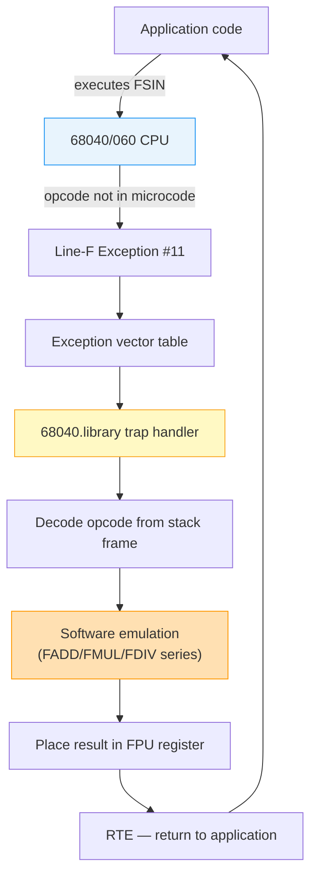

[← Home](../README.md) · [CPU & MMU](README.md)

# 68040.library and 68060.library — CPU Support Libraries

## Overview

The 68040 and 68060 processors **removed certain instructions** that the 68020/68030 and 68881/68882 FPU supported in hardware. These "unimplemented" instructions cause a Line-F exception (vector $2C) when executed. The `68040.library` and `68060.library` are **trap handler libraries** that catch these exceptions and **emulate the missing instructions in software**, providing transparent backward compatibility.

### Why Were Instructions Removed?

Motorola's 68040 design made a strategic tradeoff: **fit MMU, FPU, and dual caches onto a single die** while reaching competitive clock speeds — all within a ~1.2 million transistor budget. To achieve this, two painful decisions were made:

1. **Drop microcode-heavy FPU instructions.** Trigonometric (`FSIN`, `FCOS`), logarithmic (`FLOG2`, `FLOGN`), and exponential (`FETOX`, `FTWOTOX`) functions require ROM lookup tables and iterative algorithms in microcode, consuming thousands of transistors. Sacrificing them freed silicon for the on-chip 4 KB data + 4 KB instruction caches — a much larger performance win for typical integer-heavy Amiga software.

2. **Eliminate the barrel shifter.** The dedicated barrel shifter circuit was removed, simplifying the critical timing path and allowing higher clock speeds. This is why certain integer instructions (`MOVEP`) were also dropped.

The 68060 doubled down: additional integer instructions (`MOVEP`, `CMP2`, `CAS2`, `CHK2`) were removed to make the instruction decoder leaner, enabling **superscalar execution** (up to two instructions per clock in the best case).

### The Tradeoff: Pros and Cons

| Pro | Con |
|---|---|
| Smaller die → lower cost, higher yield | Programs crash without the trap library |
| Fewer transistors → less heat, lower power | Trap overhead: ~30–200 cycles per emulated instruction (vs ~15–80 if native) |
| Cleaner critical paths → higher MHz | 68040.library (~24 KB) + 68060.library (~40 KB) must ship separately |
| Freed silicon enabled on-chip MMU + larger caches | Some instructions (`FSINCOS`) have **no software workaround** |
| Fewer microcode bugs (68881/68882 errata avoided) | Timing unpredictability — trap latency varies by instruction |

**Bottom line:** Motorola bet that most applications lean on integer math (games, productivity, OS), where the larger caches and higher clocks delivered a clear win, while the small fraction of transcendental-heavy code could tolerate software emulation. For the Amiga ecosystem this was a good bet — every accelerator card shipped with SetPatch and the 68040.library on its install disk, making compatibility a one-time setup concern.

Without these libraries, any program using the affected instructions would crash with a Line-F exception on 040/060 hardware.

---

## What Instructions Are Emulated?

### 68040.library

The 68040 removed several FPU instructions that the 68881/68882 supported:

| Category | Missing Instructions | Description |
|---|---|---|
| Transcendental FPU | `FSIN`, `FCOS`, `FTAN`, `FASIN`, `FACOS`, `FATAN` | Trig functions |
| Transcendental FPU | `FSINH`, `FCOSH`, `FTANH`, `FATANH` | Hyperbolic functions |
| Transcendental FPU | `FLOG2`, `FLOG10`, `FLOGN`, `FLOGNP1` | Logarithms |
| Transcendental FPU | `FETOX`, `FETOXM1`, `FTWOTOX`, `FTENTOX` | Exponentials |
| Other FPU | `FMOD`, `FREM` | Modulo/remainder |
| Other FPU | `FGETEXP`, `FGETMAN` | Get exponent/mantissa |
| Other FPU | `FSGLDIV`, `FSGLMUL` | Single-precision ops |
| Integer | `MOVEP` | Move peripheral (not on all 040 revisions) |

### 68060.library

The 68060 removed **everything the 040 removed** plus additional instructions:

| Category | Additionally Missing | Description |
|---|---|---|
| Integer | `MOVEP` | Move peripheral (byte-strided) |
| Integer | `CAS2` | Compare-and-swap dual |
| Integer | `CHK2`, `CMP2` | Range check |
| Integer | `MULU.L (64-bit)` | 64-bit unsigned multiply |
| Integer | `MULS.L (64-bit)` | 64-bit signed multiply |
| Integer | `DIVU.L (64-bit)` | 64-bit unsigned divide |
| Integer | `DIVS.L (64-bit)` | 64-bit signed divide |
| FPU | All 68040-missing FPU ops | Same as above |
| FPU | `FMOVECR` | Move constant ROM |
| FPU | `FDABS`, `FDSQRT`, etc. | Some double-precision ops |

---

## How They Work

```
1. Program executes FSIN (opcode $F200 xxxx)
2. 68040/060 CPU has no microcode for this → Line-F exception (#11)
3. CPU vectors to the Line-F exception handler
4. 68040.library's handler decodes the opcode from the stack frame
5. Software emulates FSIN using basic FADD/FMUL/FDIV
6. Result is placed in the correct FPU register
7. Handler returns → program continues as if nothing happened
```



---

## Installation

These libraries are **loaded at boot time** as resident modules. They install themselves as the Line-F exception vector handler.

```
; In startup-sequence or user-startup:
LIBS:68040.library    ; for 68040 systems
; or:
LIBS:68060.library    ; for 68060 systems (replaces 68040.library)
```

The library is typically loaded by `SetPatch` or an explicit `C:LoadModule`:

```
C:LoadModule LIBS:68040.library
; or for 68060:
C:LoadModule LIBS:68060.library
```

---

## struct (ROM Tag)

Both libraries register as `RTF_COLDSTART` resident modules with high priority to ensure they are initialised before any user code runs:

```c
/* Typical RomTag for 68040.library: */
static struct Resident romtag = {
    RTC_MATCHWORD,         /* $4AFC */
    &romtag,
    &endskip,
    RTF_COLDSTART,         /* flags: cold start */
    40,                    /* version */
    NT_LIBRARY,
    105,                   /* priority: very high */
    "68040.library",
    "68040.library 40.1 (1.1.93)\r\n",
    initRoutine
};
```

---

## Detection

```c
/* Check which CPU is present: */
if (SysBase->AttnFlags & AFF_68040)  /* 68040 */
if (SysBase->AttnFlags & AFF_68060)  /* 68060 */

/* AttnFlags bits: */
#define AFB_68010   0
#define AFB_68020   1
#define AFB_68030   2
#define AFB_68040   3
#define AFB_68060   7   /* added by 68060.library */
#define AFB_68881   4   /* FPU present */
#define AFB_68882   5
#define AFB_FPU40   6   /* 040 internal FPU */
```

---

## Performance Impact

Software emulation of transcendental FPU instructions is **10–100x slower** than the 68881/68882 hardware implementation. Performance-critical code should:
- Use lookup tables for trig functions
- Use polynomial approximations (Chebyshev, CORDIC)
- Avoid `FSIN`/`FCOS` in tight loops

---

## Common Sources

| Library | Source |
|---|---|
| 68040.library 37.4 | Commodore (OS 3.0 distribution) |
| 68040.library 40.1 | Commodore (OS 3.1 distribution) |
| 68060.library 40.1 | Phase5 (original 68060 accelerators) |
| 68060.library 46.x | Motorola reference implementation |

---

## When to Use / When NOT to Use

| Scenario | Use Library? | Why |
|---|---|---|
| Running FPU-heavy code compiled for 68881/68882 on 040 | **Yes** | Missing transcendental instructions will crash |
| Running FPU-heavy code compiled for 68881/68882 on 060 | **Yes** | 68060.library replaces 68040.library; covers more missing ops |
| Your code only uses basic FPU (FADD/FMUL/FDIV) | **No** | These are native on 040/060 — no library needed |
| Your code uses MOVEP on 040 (some revisions) | **Yes** | Some 040 masks lack MOVEP microcode |
| Code uses CAS2 or CHK2 on 060 | **Yes** | 68060 removed these integer ops |
| Published application targeting 68000–060 | **Yes** | Ship both libraries as dependencies |
| Benchmarking FPU performance | **No** | Emulation skews results; use native ops only |

---

## Named Antipatterns

### 1. "The Missing Library" — No 68040.library on 040

**Symptom:** Program works on 68030, crashes with Line-F exception on 68040.

**Why it fails:** The software used `FSIN` (or another removed instruction) from a 68881 FPU library compiled for 68030. The 68040 has no microcode for it, and without the trap library, the exception is unhandled.

**Fix:** Always install `68040.library` on 040 systems and `68060.library` on 060 systems. `SetPatch` typically does this, but verify it loaded.

### 2. "The Trig Loop" — FSIN/FCOS in Inner Loops on 040

**Symptom:** Acceptable performance on 68030+68881, but drops to single-digit FPS on 68040.

```c
/* BROKEN — software-emulated FSIN on every frame */
for (int i = 0; i < count; i++) {
    float angle = i * step;
    points[i].x = sin(angle);  /* calls FSIN via library emulation */
}
```

**Fix:** Precompute a lookup table, or use a polynomial approximation that only needs FADD/FMUL:

```c
/* CORRECT — lookup table: no FSIN at runtime */
float sin_table[360];
for (int i = 0; i < 360; i++)
    sin_table[i] = sin(i * M_PI / 180.0);  /* done once at startup */
```

### 3. "The Wrong CPU Check" — Testing AFF_68040 on 68060

**Symptom:** Code detects CPU as 68040 when running on 68060, then loads wrong library.

```c
/* BROKEN — 68060 matches AFF_68040 check */
if (SysBase->AttnFlags & AFF_68040)
    LoadModule("LIBS:68040.library");  /* wrong library on 060! */
```

**Fix:** Check 68060 first — it's a superset:

```c
/* CORRECT — check most specific first */
if (SysBase->AttnFlags & AFF_68060)
    LoadModule("LIBS:68060.library");
else if (SysBase->AttnFlags & AFF_68040)
    LoadModule("LIBS:68040.library");
```

---

## Pitfalls

### 1. 68060.library Without First Installing 68040.library

Some setups load `68060.library` directly without also installing `68040.library`. The 68060 library is a **replacement** for the 68040 library (it includes all 040 emulation plus 060-specific additions), but boot scripts that check-for-library-before-loading can fail if both aren't present.

```
; WRONG — 68040.library may be needed by other components
C:LoadModule LIBS:68060.library

; CORRECT — install both or let 68060 supersede
C:LoadModule LIBS:68040.library LIBS:68060.library
; 68060.library patches over 68040.library's functions
```

### 2. Forgetting Library on Emulated 68040/060

On UAE or MiSTer with 68040/060 emulation enabled, the same Line-F exceptions occur. The emulated CPU has the same missing instructions as real silicon. Always include the libraries in your emulated Workbench setup.

---

## Impact on FPGA/Emulation — MiSTer & UAE

### TG68K Core

The Minimig-AGA core on MiSTer uses the TG68K CPU core, which implements **68020 only**. It does not implement the 68040 or 68060 instruction sets, so 68040.library and 68060.library are **not needed** on MiSTer's Minimig core.

### UAE Emulation

WinUAE and FS-UAE can emulate 68040 and 68060 CPUs. When these are enabled:
- The emulator's CPU **correctly triggers Line-F exceptions** for removed instructions
- The same trap libraries must be installed in the emulated Amiga's `LIBS:` directory
- Omitting them produces the same crashes as real hardware

### M68040 / M68060 FPGA Cores

If building a custom FPGA core with a 68040 or 68060 implementation (e.g., the `m68040` project in this workspace), the core must:
- Raise a Line-F exception for unimplemented opcodes
- Provide a valid exception stack frame so the library can decode the opcode
- Not silently execute removed instructions (producing wrong results with no error)

---

## Modern Analogies

| Amiga Concept | Modern Equivalent | Why It's the Same Pattern |
|---|---|---|
| 68040.library emulating FSIN | CPU microcode patches (Intel/AMD Spectre/Meltdown mitigations) | Hardware defect or missing feature patched by software at exception time |
| 68060.library superseding 68040.library | ARM exception levels with nested handlers | More-capable handler replaces less-capable one at same exception vector |
| Library auto-detection via `AttnFlags` | CPUID instruction + feature flag checking | Runtime query determines which code path to use |
| Trap-and-emulate for missing ops | Rosetta 2 (x86 → ARM translation) | Transparent instruction emulation invisible to application |

---

## FAQ

### Does 68060.library replace 68040.library entirely?

Yes. 68060.library contains all 68040.library emulation plus additional routines for instructions the 68060 removed beyond what the 040 removed (CAS2, CHK2, 64-bit MUL/DIV, etc.). It patches the same exception vector and supersedes the 040 library.

### Can I use FSIN in code shipped to 68040 customers?

Yes, but you must document that `68040.library` is required. The library will emulate FSIN transparently. However, be aware that emulated FSIN is 10–100x slower than native 68881 FSIN — avoid it in performance-critical paths.

### Does the library handle MOVE16 on 68040?

No. `MOVE16` is a **native** 68040 instruction — it is not emulated by the library. The confusion arises because `MOVEP` (a different instruction, byte-strided) IS emulated on 68040 revisions without microcode for it.

---

## References

- Motorola: *MC68040 User's Manual* — unimplemented instruction list
- Motorola: *MC68060 User's Manual* — unimplemented instruction list  
- NDK39: `exec/execbase.h` — `AttnFlags`
- Phase5: 68060.library source (public domain)
