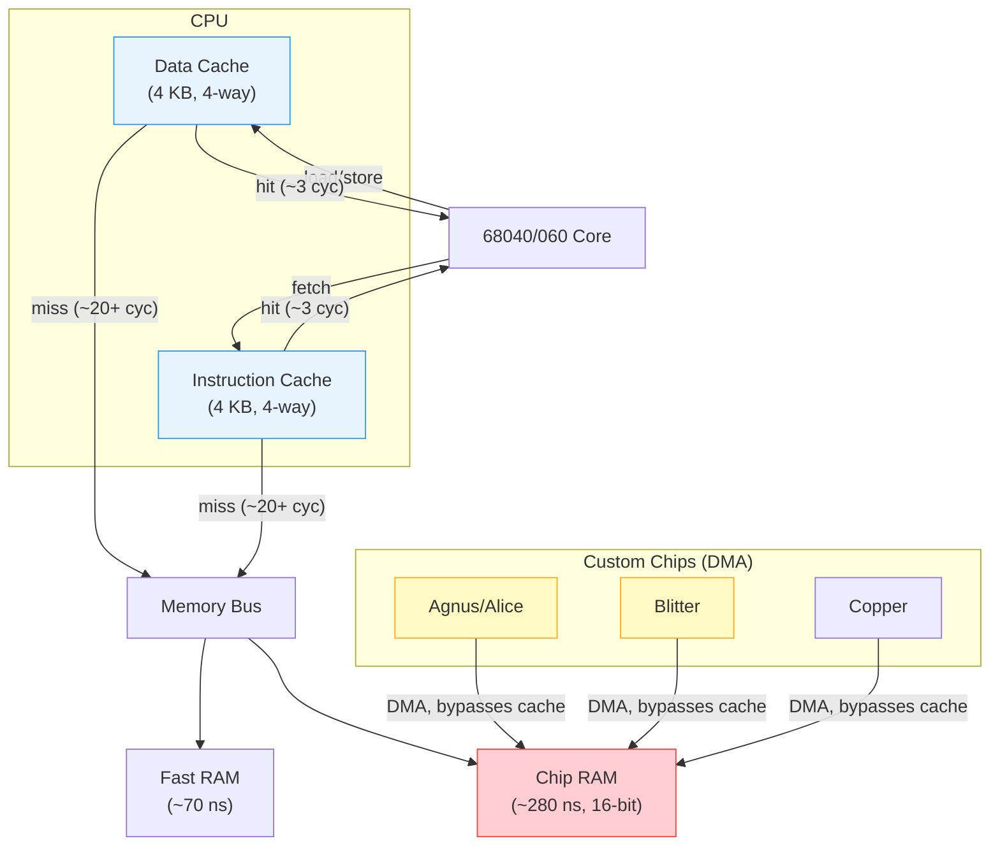
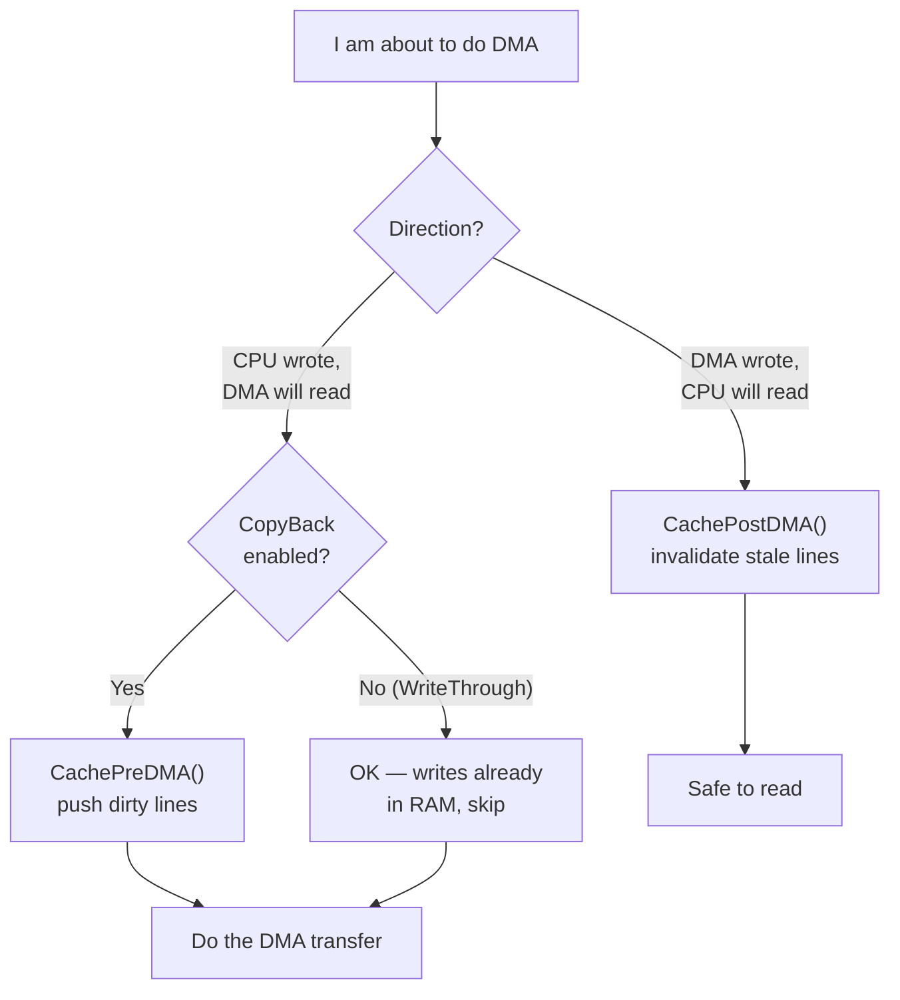

[← Home](../README.md) · [CPU & MMU](README.md)

# Cache Management — CacheClearU, CacheControl, CACR

## Overview

68020+ processors have instruction and data caches that must be managed correctly, especially when loading code (hunks), self-modifying code, or DMA operations. AmigaOS provides `exec.library` functions for safe cache management.

---

## exec.library Cache Functions

| LVO | Function | Description |
|---|---|---|
| −636 | `CacheClearU()` | Flush all caches (user-friendly, safe) |
| −642 | `CacheClearE(addr, len, caches)` | Flush specific address range |
| −648 | `CacheControl(cacheBits, cacheMask)` | Enable/disable cache features |
| −762 | `CachePreDMA(addr, &len, flags)` | Prepare for DMA transfer |
| −768 | `CachePostDMA(addr, &len, flags)` | Cleanup after DMA transfer |

---

## When to Flush Caches

| Scenario | Function to Call |
|---|---|
| After loading code from disk | `CacheClearU()` |
| After JIT / dynamic code generation | `CacheClearE(code, len, CACRF_ClearI)` |
| Before DMA read from memory | `CachePreDMA()` (flush dirty data cache) |
| After DMA write to memory | `CachePostDMA()` (invalidate stale data cache) |
| After `SetFunction()` patching | `CacheClearU()` |

---

## CacheControl Bits

```c
/* exec/execbase.h — NDK39 */
#define CACRF_EnableI      (1<<0)  /* enable instruction cache */
#define CACRF_FreezeI      (1<<1)  /* freeze instruction cache */
#define CACRF_ClearI       (1<<3)  /* clear instruction cache */
#define CACRF_IBE          (1<<4)  /* instruction burst enable */
#define CACRF_EnableD      (1<<8)  /* enable data cache */
#define CACRF_FreezeD      (1<<9)  /* freeze data cache */
#define CACRF_ClearD       (1<<11) /* clear data cache */
#define CACRF_DBE          (1<<12) /* data burst enable */
#define CACRF_WriteAllocate (1<<13) /* write-allocate data cache */
#define CACRF_EnableE      (1<<30) /* enable external cache (A3640) */
#define CACRF_CopyBack     (1<<31) /* enable copyback mode */
```

---

## CACR Register (Direct Access)

For direct hardware access (bypassing `exec.library`), the Cache Control Register bits:

### 68040 CACR

| Bit | Name | Map to CACRF | Description |
|---|---|---|---|
| 15 | DBE | `CACRF_DBE` | Data Burst Enable — burst mode for data cache line fills |
| 14 | DC | `CACRF_ClearD` | Data Cache Clear — writing 1 clears all data cache entries |
| 13 | DF | `CACRF_FreezeD` | Data Freeze — freeze data cache (no new allocations) |
| 12 | DE | `CACRF_EnableD` | Data Enable — enable data cache |
| 11 | IBE | `CACRF_IBE` | Instruction Burst Enable |
| 10 | IC | `CACRF_ClearI` | Instruction Cache Clear |
| 9 | IF | `CACRF_FreezeI` | Instruction Freeze |
| 8 | IE | `CACRF_EnableI` | Instruction Enable — enable instruction cache |
| 4 | WA | `CACRF_WriteAllocate` | Write Allocate — cache writes allocate new lines |
| 31 | CB | `CACRF_CopyBack` | CopyBack mode — dirty lines written back on eviction |
| 30 | CE | `CACRF_EnableE` | External Cache Enable (A3640 board) |

### 68030 CACR

The 68030 CACR is narrower:

| Bit | Name | Description |
|---|---|---|
| 15 | DE | Data cache Enable |
| 14 | DF | Data cache Freeze |
| 13-12 | — | (reserved) |
| 11 | DC | Data cache Clear |
| 10 | IE | Instruction cache Enable (not on all 030 revisions) |
| 9 | IF | Instruction cache Freeze |
| 8 | IC | Instruction cache Clear |
| 3 | EBC | Enable Burst Cache (fills cache lines from ATC) |

```asm
; Read CACR:
    movec.l cacr,d0

; Flush all caches (68040/060):
    cpusha  dc              ; push data cache
    cpusha  ic              ; push instruction cache
    cinva   dc              ; invalidate data cache
    cinva   ic              ; invalidate instruction cache

; 68030 — set ClearI + ClearD bits:
    movec.l cacr,d0
    ori.l   #$0808,d0       ; set bit 11 (DC) + bit 3 (IC)
    movec.l d0,cacr
```

---

## Cache Hierarchy and DMA Path



---

## Quantified Performance

Cache misses are expensive, especially when the destination is Chip RAM:

| Operation | Cycles (68040 @ 25 MHz) | Notes |
|---|---|---|
| Cache hit (L1 data) | ~3 | Best case — keep working sets small |
| Cache miss → Fast RAM | ~12–20 | Depends on bus arbitration |
| Cache miss → Chip RAM | ~50–70 | 16-bit bus + shared with DMA |
| `CacheClearU()` (full flush) | ~200 | Writes entire cache to memory if CopyBack |
| `CacheClearE()` (range flush) | ~20 + len/4 | Selective flush — preferred when possible |
| `CachePreDMA` + `CachePostDMA` | ~100 + len/4 | Two-pass: push then invalidate |

> [!WARNING]
> During C2P (Chunky-to-Planar) conversion, the CPU reads from Fast RAM (chunky buffer) and writes to Chip RAM (bitplanes). If CopyBack mode is active on 68040, the write phase leaves dirty cache lines that the display DMA never sees. Always flush the data cache after C2P: `moveq #CACRF_ClearD,d0; movec d0,cacr`.

---

## Named Antipatterns

### 1. "The Post-DMA Read" — Reading DMA-Written Data Without Cache Invalidation

**Symptom:** Program reads stale (pre-DMA) values from memory after a Blitter or Copper write.

```c
/* BROKEN — cache line still holds pre-Blitter data */
OwnBlitter();
DoBlit(...);           /* Blitter writes to tempbuf in Chip RAM */
WaitBlit();
process(tempbuf);      /* reads stale cached data, not Blitter output! */
```

**Fix:**

```c
/* CORRECT — invalidate cache before reading DMA-written memory */
OwnBlitter();
DoBlit(...);
WaitBlit();
CachePostDMA(tempbuf, &len, 0);  /* invalidate stale cache lines */
process(tempbuf);
```

### 2. "The Pre-DMA Forget" — DMA Reading CPU-Written Data Without Cache Flush

**Symptom:** Blitter reads old data from memory because the CPU's write is still dirty in the data cache.

**Fix:**

```c
/* CORRECT — push dirty cache lines before DMA reads */
fill_buffer(tempbuf, data, len);  /* CPU writes to buffer */
CachePreDMA(tempbuf, &len, DMA_ReadFromRAM);  /* push dirty lines to RAM */
DoBlit(...);                         /* Blitter now reads correct data */
```

### 3. "The Whole-Cache Flush" — Using CacheClearU When CacheClearE Would Suffice

**Symptom:** Unnecessary performance loss from flushing the entire cache for a tiny buffer.

```c
/* BAD — full cache flush for 32 bytes */
process_small_buffer(buf);
CacheClearU();  /* flushes all 4 KB of data cache */

/* GOOD — selective flush */
process_small_buffer(buf);
CacheClearE(buf, 32, CACRF_ClearD);  /* flushes only affected lines */
```

---

## DMA and Cache Coherency

Amiga custom chips (blitter, copper, audio, disk) perform DMA directly to/from Chip RAM, bypassing the CPU cache. This creates coherency issues on 68040/060:

```c
/* Before blitter reads data you just wrote: */
CachePreDMA(data, &length, DMA_ReadFromRAM);

/* After blitter writes data you want to read: */
CachePostDMA(data, &length, 0);
```

---

## Pitfalls

### 1. CopyBack Mode + Blitter DMA = Silent Data Loss

Enabling CopyBack (`CACRF_CopyBack`) means CPU writes may never reach RAM until the cache line is evicted. If the Blitter reads from those same addresses before eviction, it sees stale data.

```asm
; WRONG — CopyBack enabled, no flush before Blitter read
    movec.l copyback_cacr,cacr    ; CB=1
    move.l  d0,(a0)               ; write goes to cache, NOT to Chip RAM yet
    ; ... Blitter reads from (a0) — sees OLD data!

; CORRECT — push before DMA, or use WriteThrough
    move.l  d0,(a0)
    cpushl  dc,(a0)               ; push this cache line to memory
    ; ... Blitter now reads correct data
```

### 2. Wrong `caches` Parameter to CacheClearE

`CacheClearE(addr, len, CACRF_ClearD)` only clears DATA cache. If you just loaded and patched code, you need `CACRF_ClearI` instead:

```c
/* WRONG — flushed data cache, but instruction cache still has old code */
CacheClearE(new_code, code_len, CACRF_ClearD);

/* CORRECT — flush instruction cache for new code */
CacheClearE(new_code, code_len, CACRF_ClearI);
```

---

## Decision Flowchart — Cache Management for DMA



---

## Impact on FPGA/Emulation — MiSTer & UAE

### TG68K Core Cache

The TG68K core in MiSTer's Minimig-AGA implements a **simplified cache model**. It does not have separate instruction and data caches and does not support CopyBack mode. `CACR` writes are accepted but may be **silently ignored** for bits not implemented in the TG68K microarchitecture.

**Implications:**
- `CacheClearU()` and `CacheClearE()` are safe to call — they are no-ops on TG68K if caches aren't modeled
- `CachePreDMA()` / `CachePostDMA()` are not strictly necessary but should still be called for compatibility with UAE/real hardware
- CopyBack-dependent code patterns (updating memory from cache) will work correctly because TG68K is effectively WriteThrough

### UAE Emulation

WinUAE implements full 68040/060 cache behavior, including CopyBack. Cache management functions must be used exactly as on real hardware. UAE's "immediate blitter" and "cycle-exact" modes affect cache-DMA timing.

### M68040 FPGA Core

For custom 68040 FPGA implementations:
- Implement `CPUSHL`/`CPUSHP`/`CINVL`/`CINVP` instructions for cache line push/invalidate
- Map `CACRF` bit writes to the CACR register correctly (see table above)
- Ensure DMA transactions snoop or invalidate the data cache

---

## Use-Case Cookbook

### 1. Safe DMA Transaction Wrapper

```c
void safe_dma_blit(APTR buffer, ULONG length, BOOL cpu_written_first)
{
    if (cpu_written_first)
        CachePreDMA(buffer, &length, DMA_ReadFromRAM);

    OwnBlitter();
    DoBlit(buffer, ...);
    WaitBlit();

    CachePostDMA(buffer, &length, 0);  /* always invalidate after */
}
```

### 2. Loading and Patching Code at Runtime

```c
/* Load a code hunk from disk, apply patches, then execute */
APTR code = AllocMem(code_size, MEMF_PUBLIC);
read(fh, code, code_size);

/* Apply runtime patches (e.g., SetFunction replacements) */
patch_functions(code);

/* Flush instruction cache — the CPU may have stale cache lines */
CacheClearE(code, code_size, CACRF_ClearI);

/* Now safe to jump to patched code */
((void (*)(void))code)();
```

---

## FAQ

### Can I ignore cache management if I only target 68020?

Yes — the 68020 has only a 256-byte instruction cache that is transparent and requires no software management. AmigaOS `CacheClearU()` is a no-op on 68020 unless an external data cache (A2630/A3640 board) is present.

### Why does my C2P routine produce shimmering pixels on 68040 but works on 68030?

Classic cache coherency bug. The 68030 does not have CopyBack. On 68040 in CopyBack mode, the CPU's C2P writes are cached and never reach Chip RAM before the display DMA reads the bitplanes. Add `moveq #CACRF_ClearD,d0; movec d0,cacr` after your C2P routine.

### Do I need cache management for audio DMA?

The audio DMA reads from Chip RAM only. If your audio sample data is written to by the CPU into a Chip RAM buffer, flush with `CacheClearE(buf, len, CACRF_ClearD)` before starting playback.

---

## References

- NDK39: `exec/execbase.h`
- Motorola: *MC68040 User's Manual* — cache chapter
- ADCD 2.1: `CacheClearU`, `CacheClearE`, `CacheControl`
