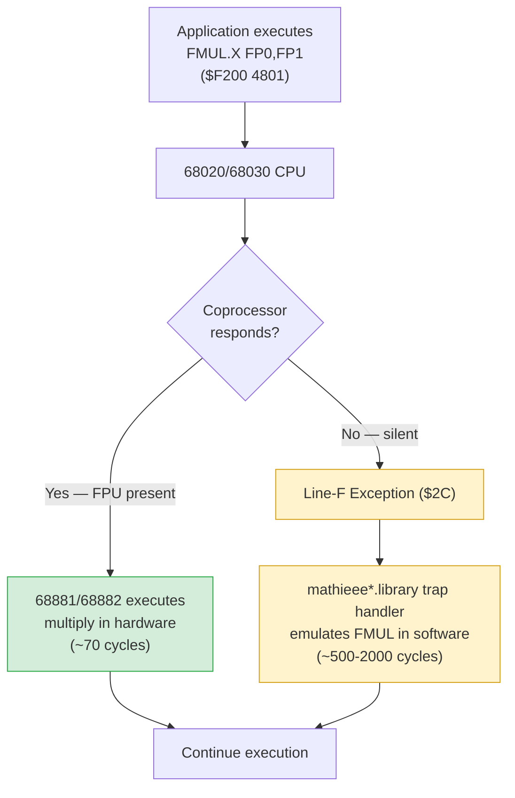
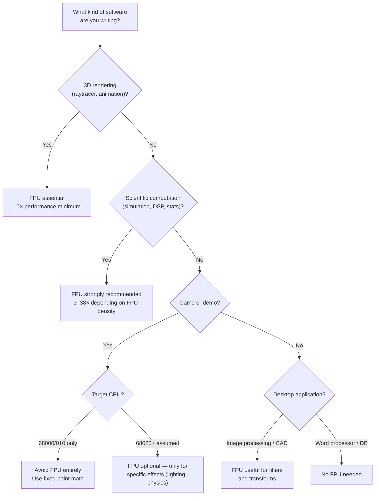

[← Home](../README.md) · [FPU, MMU & Cache](README.md)

# FPU Architecture & History — 68881, 68882, 68040, 68060

## Overview

In 1985, the Amiga had the best graphics chipset in the world — and a CPU that couldn't do math. The 68000 was an integer-only processor: brilliant at moving pixels and playing samples, helpless at trigonometry.

Ask it to compute `sin(0.7)` and it would freeze for **two and a half video scanlines**, churning through thousands of software instructions to emulate what a pocket calculator does in silicon. A single raytraced frame at 320×256 could take all night — literally 4 to 8 hours — on a machine whose entire selling pitch was real-time graphics.

That was the problem the FPU solved. Motorola shipped four generations of floating-point hardware between 1984 and 1994, each designed by engineers wrestling with the same brutal equation: floating-point circuits are **30× more complex** than integer circuits, and transistor budgets were unforgiving.

The **MC68881** (1984) and faster, pipelined **MC68882** (1987) were external coprocessors paired with 68020 and 68030 CPUs — plug-in optional extras, bought only if you actually needed decimal math. No stock Amiga shipped with an FPU socket; Commodore never put one on the A500 or A1200 motherboard. The socket came from third-party accelerator boards (GVP, Phase5, Apollo, Commodore's own A2620/A2630), which added a 68-pin PLCC or PGA footprint alongside the faster CPU.

The **MC68040** (1990) finally merged CPU and FPU onto one 1.2-million-transistor die, but had to gut its transcendental microcode — `FSIN`, `FCOS`, `FLOG` — to fit.

The **MC68060** (1994) added a pipelined, superscalar FPU and then went further, stripping even `MOVEP` and 64-bit integer multiply to keep the decoder lean. A parallel ecosystem of third-party libraries — MuLib, SoftIEEE, HSMathLibs — filled the gaps Motorola's trade-offs created.

The FPU didn't just speed up math. It was the difference between an Amiga being a toy and a professional workstation. **LightWave 3D** frames rendered during a coffee break instead of overnight. **Frontier: Elite II** ran at 15 FPS instead of as a slideshow. Without an FPU, none of that was possible — the Amiga was just a very pretty integer machine.

---

## How Numbers Live in Memory — Integer vs. Floating-Point Hardware

Before asking *why* an FPU is needed, it helps to understand *how* the CPU stores and operates on numbers in the first place. The gap between integer hardware and floating-point hardware isn't just about decimal points — it's about two fundamentally different data representations, each with its own arithmetic circuits.

### Integer Storage — Two's Complement

An integer is a **whole number** stored as a fixed-width binary word. On the 68000, integers are 8, 16, or 32 bits wide. The value of each bit position is a power of two:

```
Bit position (16-bit word):  15   14    13   12   11   10   9   8   7    6   5   4   3   2   1   0
Weight (unsigned):         32768 16384 8192 4096 2048 1024 512 256 128  64  32  16   8   4   2   1
Weight (signed, bit 15=sign):  -32768  ←──────────────── same as above ─────────────────→
```

For **unsigned** integers (`0` to `65535`), every bit counts upward. The value is simply the sum of all weights where the bit is `1`. The number `42` in a 16-bit word:

```
┌─15──────────────────────────────────────────────0─┐
│ 0  0  0  0  0  0  0  0  0  0  1  0  1  0  1  0    │  = 32 + 8 + 2 = 42
└───────────────────────────────────────────────────┘
```

For **signed** integers (`-32768` to `32767`), the 68000 — like virtually all modern CPUs — uses **two's complement**. The most significant bit (bit 15 for 16-bit, bit 31 for 32-bit) is the **sign bit**: `0` = positive, `1` = negative. To negate a number, you **invert all bits and add 1**:

```
Decimal +42:   0000 0000 0010 1010
Invert bits:   1111 1111 1101 0101
Add 1:         1111 1111 1101 0110   = Decimal -42
```

Two's complement is elegant because **addition works identically for signed and unsigned operands**: the same adder circuit handles both. The CPU doesn't track "is this signed?" — it just adds the bits. Overflow and carry flags in the Status Register let the programmer interpret the result correctly.

### Integer Arithmetic — The ALU in Silicon

The **Arithmetic Logic Unit (ALU)** is the chunk of the CPU die that performs integer math. Its operations are deterministic, exact, and measured in single-digit clock cycles. Here is what happens at the gate level:

#### Addition (ADD)

Two 32-bit values feed into an array of **full adders** — one per bit position. Each full adder takes three inputs (bit A, bit B, carry-in from the previous bit) and produces two outputs (sum bit, carry-out to the next bit):

```
Bit 0:    A₀ + B₀ + 0        → sum₀, carry₁
Bit 1:    A₁ + B₁ + carry₁   → sum₁, carry₂
Bit 2:    A₂ + B₂ + carry₂   → sum₂, carry₃
  ...
Bit 31:   A₃₁ + B₃₁ + carry₃₁ → sum₃₁, carry₃₂ (= overflow flag)
```

This chain is called a **ripple-carry adder**. On the 68000, a 32-bit ADD takes **6–8 clock cycles** — most of that is memory access, not the actual addition (which is near-instantaneous once the operands are in registers). Faster CPUs use **carry-lookahead adders** that compute carries in parallel rather than rippling.

#### Subtraction (SUB)

There is no subtractor circuit. The ALU reuses the adder by applying the two's complement identity: **A − B = A + (−B)**. The hardware inverts B's bits and feeds a carry-in of `1` to bit 0:

```
SUB.L D1,D0    →    internal:  ADD.L (D0 + ~D1 + 1)
```

This is why the 68000's `SUB` instruction sets both Carry and Extend flags — the carry chain from the internal addition is exposed.

#### Multiplication (MULU / MULS)

Integer multiplication is **shift-and-add**. Think of long multiplication by hand:

```
    1011  (13 decimal)
  ×  1101  (13 decimal)
  ─────────
    1011   ← multiply by bit 0 (1): copy
   0000    ← multiply by bit 1 (0): shift, add zero
  1011     ← multiply by bit 2 (1): shift, add
 1011      ← multiply by bit 3 (1): shift, add
 ─────────
10001111   = 169 decimal (13×13)
```

The ALU performs this iteratively: test each bit of the multiplier; if `1`, add the shifted multiplicand to a running sum. On the 68000, `MULU.W D1,D0` (16×16→32 bit multiply) takes up to **70 clock cycles** — the slowest single instruction on the chip. The 68020 added a hardware barrel shifter and partial-product accumulator that cut this to ~28 cycles, but the fundamental shift-and-add algorithm is the same.

> [!NOTE]
> The 68000 has no 32×32→64 multiply. Multiplying two 32-bit integers requires four 16×16 multiplies and three 32-bit additions stitched together — a software routine costing several hundred cycles.

#### Division (DIVU / DIVS)

Division is the slowest and most complex integer operation. The ALU uses **non-restoring division**: a sequence of shift-and-subtract steps that produces one quotient bit per iteration:

```
Divide 169 ($A9) by 13 ($0D):
1. Shift divisor left until aligned with dividend's most significant bits
2. Subtract from partial remainder
3. If result is negative → quotient bit = 0, restore
4. If result is positive → quotient bit = 1, keep
5. Shift divisor right, repeat for each bit of precision
```

On the 68000, `DIVU.W D1,D0` (32÷16→16 bit) takes up to **140 clock cycles**. A 32÷32→32 division requires the same chained-16-bit trick as multiplication.

### Floating-Point Storage — IEEE 754

A floating-point number stores a value as **sign × mantissa × 2^exponent** — scientific notation in binary. The IEEE 754 standard (1985) defines the layout. The 68881/68882 implement all three precisions natively.

This is not just "an integer with a decimal point." An integer is one field (the value) stored flat in a register — add two integers and the ALU is done in one cycle. A float has **three fields** (sign, exponent, mantissa); every operation must independently handle all three, then recombine and round the result. The internal datapath is wider (67 bits in the 68881 vs. the 68000's 32-bit ALU), the microcode is deeper, and special cases — denormals, NaN, infinities, gradual underflow — all need dedicated handling that integer circuits don't have. This structural overhead is the entire reason the FPU needs its own silicon.

```
IEEE 754 Single Precision (32-bit) — the workhorse format for 3D graphics:
┌───┬────────┬──────────────────────────┐
│ S │  Exp   │        Mantissa          │
│ 1 │  8 bit │        23 bit            │
└───┴────────┴──────────────────────────┘
 bit 31   30-23         22-0

IEEE 754 Double Precision (64-bit) — scientific computing:
┌───┬──────────┬──────────────────────────────────────────┐
│ S │   Exp    │                Mantissa                  │
│ 1 │  11 bit  │                 52 bit                   │
└───┴──────────┴──────────────────────────────────────────┘
 bit 63   62-52                 51-0

68881/68882 Extended Precision (80-bit) — internal representation:
┌───┬──────────┬──┬──────────────────────────────────────────────┐
│ S │   Exp    │I │                Mantissa                      │
│ 1 │  15 bit  │1 │                 64 bit                       │
└───┴──────────┴──┴──────────────────────────────────────────────┘
 bit 79   78-64   63               62-0
```

**Key details:**

| Feature | Single | Double | Extended |
|---|---|---|---|
| Significand precision | ~7 decimal digits | ~15 decimal digits | ~19 decimal digits |
| Exponent bias | 127 | 1023 | 16383 |
| Approx. range | ±10^±38 | ±10^±308 | ±10^±4932 |
| Hidden bit | Yes (implicit 1) | Yes (implicit 1) | Explicit (bit 63 = I) |

#### Why 80-Bit Extended Precision?

The 68881/68882 use 80-bit registers **internally only** — for computation. Inputs and outputs to memory are always 32-bit (single) or 64-bit (double); the FPU converts to 80-bit on load, operates, and rounds back to the requested precision on store. The 80-bit format is never written to RAM by the FPU itself (though the `FMOVEM.X` instruction can save/restore full 80-bit register state for context switches).

Motorola chose 80 bits for three reasons:

1. **Guard against accumulated rounding error.** A 64-bit double provides ~15 decimal digits of precision. That sounds like a lot, but after 10–20 chained operations (a 3×3 matrix multiply plus projection, typical of graphics), each intermediate result loses a fraction of a bit. By accumulating at 80 bits internally and rounding only once at the end, the 68881 preserves ~19 digits through the entire computation chain — the final double-precision result is accurate to the last bit. Without extended precision, chained operations degrade to ~12–13 usable digits.

2. **Transcendental accuracy.** `FSIN`, `FCOS`, `FLOG`, and `FETOX` are implemented via polynomial approximations (CORDIC or minimax) that iterate 8–16 times internally. Each iteration accumulates error. Starting from an 80-bit seed with 64-bit mantissa gives the microcode enough headroom that the final result, when rounded to double precision, is correct to within 1 ULP (Unit in the Last Place) — the gold standard for math libraries.

3. **Simpler microcode.** The explicit integer bit (the `I` field at bit 63) means the mantissa is always `I.ffff…` — no hidden-bit logic needed in the internal datapath. When the ALU reads an 80-bit register, it sees the complete number with no implicit bits to reconstruct. This saves a microcode step on every operation.

**Trade-offs:**

| Pro | Con |
|---|---|
| Chained operations stay accurate to ~19 digits internally; final result degrades minimally | Registers are 80 bits × 8 = 640 bits of FPU register file — 2.5× larger than eight 64-bit registers |
| Transcendental functions can deliver correct rounding to double precision | Memory ↔ register transfers take more cycles (80-bit internal bus vs. 32-bit data bus on 68020/68030) |
| No double-rounding penalty (round once to double at output, not once to 80-bit then again to 64-bit) | Not portable — x87's 80-bit format has a different layout; saving 80-bit state locks you to 68K |
| Explicit integer bit eliminates hidden-bit reconstruction in microcode | No standard language type maps to 80-bit (`long double` in C is 80-bit on x86, 64-bit or 128-bit on most other platforms) |

> [!NOTE]
> x86 FPUs (8087 through Pentium) also use 80-bit extended precision internally — Intel made the same decision for the same reasons. But Motorola's 80-bit format is **not** bit-compatible with Intel's. The 68881 stores the integer bit explicitly at bit 63; the 8087 uses the same hidden-bit convention as single/double, making the 68881's internal format slightly simpler to decode in microcode.

**The hidden bit trick.** Normalized floating-point numbers always have a leading `1` in the mantissa (e.g., `1.01011 × 2^3`). Since that leading `1` is *always* there, IEEE 754 doesn't store it — saving one bit of precision for free. The 23-bit mantissa field actually delivers 24 bits of precision. The 80-bit extended format makes the integer bit explicit (the `I` bit) to simplify internal FPU microcode.

**Special values.** The IEEE 754 encoding reserves certain exponent values:

| Exponent | Mantissa | Meaning |
|---|---|---|
| All 0s | All 0s | **Zero** (signed: +0 or −0) |
| All 0s | Non-zero | **Denormalized number** (gradual underflow — very tiny values with reduced precision) |
| All 1s | All 0s | **Infinity** (signed: +∞ or −∞) |
| All 1s | Non-zero | **NaN** (Not a Number — e.g., result of 0/0 or √−1) |

This is the first major difference from integers: floating-point has **error states baked into the encoding**. You can compute `0.0 / 0.0` without crashing — you get NaN, and a status flag is set.

#### Example: Encoding 6.625 in IEEE 754 Single Precision

```
Step 1: Convert to binary.  6.625 = 110.101₂
        (6 = 110₂, 0.625 = 0.5+0.125 = 0.101₂)

Step 2: Normalize.  110.101 = 1.10101 × 2²
        Mantissa = 10101... (drop the leading 1)
        Exponent = 2

Step 3: Apply bias.  Stored exponent = 2 + 127 = 129 = 10000001₂

Step 4: Combine.  Sign = 0 (positive)
        ┌─┬────────┬──────────────────────────┐
        │0│10000001│10101000000000000000000   │
        └─┴────────┴──────────────────────────┘
         = $40D40000 in hex
```

### Floating-Point Arithmetic — Why It Needs Dedicated Hardware

Every floating-point operation requires **multiple sub-operations** that integer circuits cannot perform directly:

#### Addition / Subtraction

```
Calculate: 1.5 × 10¹ + 9.25 × 10⁰   (in decimal, for illustration)

1. Align exponents: 9.25 × 10⁰  →  0.925 × 10¹
2. Add mantissas:   1.500 + 0.925 = 2.425
3. Normalize:       2.425 × 10¹  →  2.425 × 10¹  (already normalized)
4. Round:           2.425 → depends on rounding mode
5. Check for overflow/underflow/special values
```

In hardware, each step is a separate micro-operation:
- **Exponent compare** → determines shift amount (subtractor circuit)
- **Barrel shift** → aligns the smaller mantissa (shifter — not in integer ALU)
- **Mantissa add** → uses a wider adder than integer ALU (e.g., ~67-bit for 80-bit extended)
- **Leading-zero detect** → finds how many bits to shift for normalization (priority encoder)
- **Barrel shift again** → normalizes
- **Round** → examines guard/round/sticky bits, may increment LSB, may re-normalize

#### Multiplication

```
Calculate: 1.5 × 10¹ × 2.0 × 10³

1. XOR signs:     + × + = +
2. Add exponents:  1 + 3 = 4
3. Multiply mantissas: 1.5 × 2.0 = 3.0  (integer multiplier but wider)
4. Normalize:      3.0 × 10⁴  →  already normalized (leading digit 1–9)
5. Round, check special cases
```

#### Division

```
Calculate: 1.5 × 10¹ ÷ 2.0 × 10³

1. XOR signs:     + ÷ + = +
2. Subtract exponents: 1 − 3 = −2
3. Divide mantissas: 1.5 ÷ 2.0 = 0.75
4. Normalize:      0.75 × 10⁻²  →  7.5 × 10⁻³
5. Round, check special cases
```

#### Why This Is Expensive Without Hardware

Every single floating-point operation requires a **pre-operation phase** (decode fields, check for zeros/NaNs/infinities), the **operation itself** (mantissa add/mul/div with extra-wide precision), and a **post-operation phase** (normalize, round, re-pack). This is roughly **3–10× more micro-operations** than the equivalent integer instruction — before you even get to transcendental functions.

With an FPU, all of this runs in dedicated silicon with wide internal datapaths. The 68881 does a single-precision multiply in ~70 cycles. Without an FPU, the software emulation of these steps consumes 200+ cycles for the same multiply — and 2,500+ cycles for `sin()`.

### Integer vs. Floating-Point — The Fundamental Gap

| Property | Integer (68000 ALU) | Floating-Point (68881 FPU) |
|---|---|---|
| **Precision** | Exact — every integer in range is representable | Approximate — gaps between representable values grow with magnitude |
| **Range (32-bit)** | ±2.1×10⁹ (signed) | ±3.4×10³⁸ (single) |
| **Smallest non-zero** | 1 | ~1.2×10⁻³⁸ (single, normalized) |
| **Operations** | Add, sub, mul, div via simple gate arrays | Add, sub, mul, div, sqrt via multi-phase microcoded pipelines |
| **Error states** | Overflow sets V flag; no other errors | NaN, ±∞, denormals, inexact, underflow, overflow, divide-by-zero |
| **Rounding** | None — truncation toward zero on divide | Four IEEE modes: nearest, toward zero, toward +∞, toward −∞ |
| **Transcendental** | Not available in hardware | FSIN, FCOS, FTAN, FLOG, FETOX, etc. (microcode ROM on 68881/68882) |
| **Gate count** | ~5,000 transistors (68000 ALU) | ~155,000 transistors (68881 — ×30 larger) |

The gate count tells the story: an FPU is roughly **30× more complex** than an integer ALU. That's why it started as a separate chip, and why integrating it onto the 68040 die in 1990 required a 0.65 µm process and 1.2 million transistors.

### The Same Trade-Off, Forty Years Later — AI, LLMs, and Quantization

The tension between integer and floating-point — precision vs. silicon cost vs. speed — didn't end in 1994. It is the central engineering problem of modern AI hardware. Every large language model (GPT, Claude, Llama, Gemini) faces exactly the same constraint the 68881 did: **wider precision costs more transistors, more power, and more time**. The difference is scale: a 68881 has ~155,000 transistors; an NVIDIA H100 has **80 billion**.

#### The Quantization Ladder — Cutting Bits to Go Faster

The history of AI inference is a march **down** the precision ladder. Each step cuts memory bandwidth and increases throughput, at the cost of numerical accuracy:

```
Precision evolution (1985–2025):

  Amiga era                          AI era
  ─────────                          ──────

  FP64 (IEEE 754 double)     ◄── training gold standard until ~2020
  FP32 (IEEE 754 single)     ◄── standard training/inference until ~2018
  80-bit (68881 internal)    ◄─►  TF32 (NVIDIA Ampere, 2020): 19-bit mantissa, trains like FP32
  FP16 (IEEE 754 half)       ◄── inference workhorse since ~2019
   16.16 fixed-point (Amiga) ◄─►  BF16 (Google Brain float, 2018): same range as FP32, 7-bit mantissa
                             ◄──  FP8 (NVIDIA Hopper, 2022): two formats (E4M3, E5M2)
   24.8 fixed-point          ◄─►  FP4 (NVIDIA Blackwell, 2024): 4-bit float with 2-bit mantissa
                             ◄──  INT8 / INT4 / NF4 (integer quantization, 2023+)
   8.8 fixed-point           ◄─►  Binary / ternary (1-2 bit, research frontier)
```

#### Why This Looks Exactly Like the Amiga's Fixed-Point Story

The connection is not superficial. When a 1987 Amiga developer chose **16.16 fixed-point** instead of soft-float, they were making the same engineering decision as NVIDIA choosing **INT8 quantization** for LLM inference:

| Decision | Amiga Fixed-Point (1987) | AI Quantization (2023) |
|---|---|---|
| **Problem** | Soft-float `FMUL` = 200+ cycles | FP32 matmul = 1× speed, 4× memory |
| **Solution** | Store coordinates as 16.16 integers; multiply with `MULS` (70 cycles) then shift right 16 bits | Store weights as INT8; multiply in tensor cores (~2–4× FP16 throughput) |
| **Cost** | Overflow risk, accumulated drift over 20+ chained ops | Accuracy loss, perplexity degradation, calibration required |
| **Mitigation** | Scale values carefully, clamp, check range | Post-training quantization (PTQ), quantization-aware training (QAT) |
| **Why it works** | Integer multiply is 3× faster than soft-float and deterministic | INT8 tensor core throughput is 2–4× FP16; memory bandwidth is the bottleneck |

The Amiga developer's 16.16 fixed-point hack and the ML engineer's INT8 quantization are the **same idea separated by 35 years**: use cheaper integer circuits to approximate what would otherwise require expensive floating-point hardware.

#### Float vs. Integer Quantization — Why Both Exist

| Format | Bits | Significand | Exponent | Max Value | Typical Use |
|---|---|---|---|---|---|
| **FP32** | 32 | 23 bits (~7 digits) | 8 bits | 3.4×10³⁸ | Reference, training (pre-2020) |
| **TF32** | 19 | 10 bits | 8 bits | 3.4×10³⁸ | Training on A100/H100 — FP32 range, FP16 speed |
| **BF16** | 16 | 7 bits | 8 bits | 3.4×10³⁸ | Training, inference — same range as FP32, less precision |
| **FP16** | 16 | 10 bits | 5 bits | 6.5×10⁴ | Inference, some training — narrow range, loss scaling needed |
| **FP8 (E4M3)** | 8 | 3 bits | 4 bits | 448 | H100/Blackwell inference — 2× throughput of FP16 |
| **FP8 (E5M2)** | 8 | 2 bits | 5 bits | 5.7×10⁴ | H100/Blackwell — wider range, less mantissa precision |
| **FP4 (E2M1)** | 4 | 1 bit | 2 bits | 6 | Blackwell (2024) — requires careful calibration |
| **INT8** | 8 | 8-bit signed integer | — | ±127 | Inference with scale factors — 2× throughput of FP16 |
| **INT4** | 4 | 4-bit signed integer | — | ±7 | Aggressive inference — 2× throughput of INT8 |
| **NF4** | 4 | non-uniform (quantile-based) | — | ±1.0 (normalized) | QLoRA / bitsandbytes — outperforms uniform INT4 for LLMs |

> [!NOTE]
> **FP4 (E2M1) has only 16 possible values.** It can represent: 0, ±0.5, ±1, ±1.5, ±2, ±3, ±4, ±6 — and nothing beyond 6. This is barely more expressive than binary on/off. Yet it works for quantizing parts of an LLM because weights and activations in specific layers are statistically narrow, and the scale factor (stored separately at higher precision) shifts this tiny set to cover the actual value range of each tensor.

#### The Throughput Math — Why Lower Precision Wins

On an NVIDIA H100 (2022), the tensor core throughput scales inversely with precision:

| Format | Throughput (TFLOPS, dense) | Speedup vs FP32 |
|---|---|---|
| FP64 | 67 | 0.33× (slower!) |
| TF32 | 989 | 1× (reference) |
| FP16 / BF16 | 1,979 | 2× |
| FP8 | 3,958 | 4× |
| INT8 | 3,958 | 4× |

The pattern is identical to the 68881: **halving the bit width roughly doubles throughput**. And just as the 68881's 80-bit internal format was wider than any externally stored format (to preserve accuracy through intermediate calculations), modern AI chips accumulate products at higher precision (FP32 or FP16) before rounding down for storage.

#### Back to the Amiga — The Lesson Repeats

In 1992, an Amiga developer choosing between an FPU and fixed-point math was asking: *"Can I tolerate the precision loss of 16.16 fixed-point to run at 15 FPS on a 68000, or do I need an FPU to handle the dynamic range?"*

In 2025, an ML engineer choosing between BF16 and INT4 quantization is asking: *"Can I tolerate the perplexity loss of INT4 to fit the model in GPU memory and run at interactive speed, or do I need BF16 to preserve accuracy?"*

The question is the same. Only the transistor budgets have changed — from 68,000 to 80 billion.

---

## Why Floating Point Matters — The Problem Integer CPUs Can't Solve Natively

### The Core Problem: CPUs Only Understand Whole Numbers

Imagine trying to calculate your taxes using an abacus that can only count pebbles — no decimal points allowed. That's the world of a CPU without floating-point hardware. The 68000, like every microprocessor of its era, was an **integer-only** machine. It could add, subtract, and multiply whole numbers natively. But introduce a decimal point — `3.14159 × 2.71828` — and the programmer faces an invisible tax: hundreds of integer instructions to emulate in software what the FPU does in a single hardware operation.

To multiply two decimal numbers without an FPU, software must manually perform every step that scientific calculators automated in silicon:

1. **Parse the format** — Is it IEEE 754? Motorola FFP? A custom fixed-point representation?
2. **Extract mantissa and exponent** — Shift and mask operations on each operand
3. **Multiply the mantissas** — A 32×32 → 64-bit integer multiply (not even a single instruction on 68000 — requires multiple 16×16 multiplies stitched together)
4. **Add the exponents** — Handle bias, check for overflow/underflow
5. **Normalize the result** — Shift until the leading bit is 1, adjust exponent
6. **Re-pack into the target format**

This sequence costs **50–200 integer instructions** per floating-point operation. But that's just `multiply`. What about `sin(0.7)`? A software sine requires a Taylor series or CORDIC algorithm — a dozen multiply-add iterations — devouring **thousands of cycles**. And `sin()` is the most basic building block of 3D rotation. Every vertex in every spaceship in every frame of a wireframe game needs multiple sine/cosine evaluations just to rotate into view.

### What This Actually Feels Like: Real Numbers from the 7.14 MHz 68000

On a stock 7.14 MHz Amiga 500 (the most common Amiga sold, ~5 million units), here is what soft-float costs the user:

| Operation | Soft-Float (68000) | With 68882 @ 50 MHz | Speedup |
|---|---|---|---|
| **Multiply** (`3.14 × 2.72`) | ~30 µs (~214 cycles) | ~1.4 µs (70 cycles) | **21×** |
| **Divide** (`3.14 ÷ 2.72`) | ~45 µs (~321 cycles) | ~2.0 µs (100 cycles) | **22×** |
| **Square root** (`√2`) | ~120 µs (~857 cycles) | ~4.4 µs (220 cycles) | **27×** |
| **Sine** (`sin(0.7)`) | ~350 µs (~2,500 cycles) | ~2.0 µs (100 cycles) | **175×** |
| **Cosine** (`cos(1.2)`) | ~350 µs (~2,500 cycles) | ~2.0 µs (100 cycles) | **175×** |
| **Tangent** (`tan(0.5)`) | ~600 µs (~4,300 cycles) | ~3.0 µs (150 cycles) | **200×** |
| **Exponential** (`e^2.5`) | ~700 µs (~5,000 cycles) | ~3.4 µs (170 cycles) | **206×** |
| **Natural log** (`ln(3.1)`) | ~800 µs (~5,700 cycles) | ~4.0 µs (200 cycles) | **200×** |

> **Why this table matters — the Quake litmus test.** id Software's *Quake* (1996) was the first major game to **require** an FPU — it would not launch on a 486SX. The software renderer performs floating-point work at every layer of every frame:
>
> - **Vertex pipeline:** ~600–900 polygons per frame, each with 3–4 vertices. Every vertex runs through model→world→view matrices (≈28 FP muls/adds each) plus a perspective divide — roughly **50,000–100,000 FP operations** just to position triangles in screen space.
> - **Span rasterizer:** Michael Abrash's inner loop performs "several FP operations every 16 pixels" for perspective-correct texture mapping. At 320×200 with overdraw, that's another **200,000–500,000 FP ops** per frame.
> - **Lightmap sampling:** Bilinear interpolation of the precomputed light grid, per pixel, adds thousands more.
>
> Total: roughly **300,000–600,000 floating-point operations per frame**. At 30 FPS, that's **9–18 million FP ops/second** — well within the Pentium 133's ~20–30 MFLOPS budget, barely scraping by on a 486DX2-66 (~5–8 FPS at minimum screen size), and **impossible** on a 486SX. On a 7 MHz 68000 with soft-float, where a single `FMUL` costs ~200 cycles (~28 µs), 500,000 multiplies per frame would take **14 seconds** — about 0.07 FPS. Even the fastest Amiga FPU (68882 @ 50 MHz, ~0.5 MFLOPS peak) would be roughly 30–60× too slow for Quake at playable speed.
>
> The FPU doesn't just "speed up math." It determines whether a class of software can exist at all.

### Why "Just Use a Lookup Table" Doesn't Solve It

Amiga developers did use precomputed sine/cosine tables — a 1024-entry table stored in RAM that maps angle → precomputed value, avoiding the slow software `sin()`. This was standard practice. But lookup tables have hard limits:

**Precision costs RAM.** A 1024-entry sine table with 16-bit precision (adequate for 2D rotation at low resolution) costs 2 KB. That's fine for one table. But a 3D game needs sines AND cosines at multiple precisions for rotation matrices, at different granularities for different distances. A high-quality table of 4096 entries at 32-bit precision costs 16 KB — per function. On a machine with 512 KB total RAM, that budget disappears fast.

**Fixed-point wobble.** Even with a table, the multiplication of the table value by a coordinate uses 16.16 or 24.8 fixed-point integer math (a hack where "the top 16 bits are the whole number, the bottom 16 bits are the fraction"). Every multiply in fixed point must be manually shifted back after the operation. Over a chain of 20–30 operations (a single vertex rotated through a 3×3 matrix, projected, and clipped), accumulated rounding errors cause vertices to **drift** — objects visibly wobble, edges don't meet, surfaces shimmer. This is why early 3D games jittered even when the player stood still.

**The Elite lesson.** David Braben and Ian Bell's *Elite* (1984) ran wireframe 3D on a 1 MHz 6502 with **logarithm tables** — a clever hack that turned multiplication into addition at the cost of precision. Even with that trick, the BBC Micro version managed only ~6 frames per second on static scenes. Porting the same wireframe engine to the 7 MHz 68000 helped, but the fundamental constraint remained: without an FPU, every rotation, every projection, every visibility check cost dozens to hundreds of instructions. When *Frontier: Elite II* arrived on the Amiga in 1993 with filled-polygon 3D and a full-scale galaxy, the FPU difference was brutal — unplayable slideshow without one, smooth 15–20 FPS with a 68882.

### What the User Actually Experiences

| Task | 68000 Soft-Float | 68030 + 68882 @ 50 MHz | The Difference |
|---|---|---|---|
| **Raytrace one frame** (320×256, simple scene) | ~4–8 hours | ~8–20 minutes | "Go to sleep" vs "Go make coffee" |
| **Raytrace one frame** (complex: reflections, textures) | ~20–50 hours | ~30–90 minutes | "Wait a weekend" vs "Watch a movie" |
| **Terrain generation** (VistaPro, 512×512) | ~5–10 minutes | ~20–45 seconds | "Tap your fingers" vs "Instant" |
| **3D flight sim** (TFX, one frame) | ~2–4 FPS (unplayable) | ~12–20 FPS (smooth) | "Slideshow" vs "Actually flying" |
| **Mandelbrot zoom** (800×600, 256 iterations) | ~8–12 minutes | ~15–25 seconds | "Make tea" vs "Watch it happen" |
| **FFT audio filter** (44.1 kHz, 1024-sample window) | ~800 ms (audible gap) | ~30 ms (real-time) | "Glitch" vs "Seamless" |

> **The FPU turns overnight renders into coffee-break renders.** In 1991, an Amiga 3000 with a 25 MHz 68882 could raytrace a frame of *LightWave 3D* animation in roughly the time a stock A500 needed to render a single test preview at 1/4 resolution. This was the difference between the Amiga being a toy and a professional television graphics workstation — and why NewTek's Video Toaster + LightWave bundle explicitly required a 68030 with FPU.

All of this — the hundreds of instructions per multiply, the drift from chained fixed-point operations, the memory pressure of lookup tables, the hours-long render times — collapses when an FPU is present. The 68881/68882 executes `FMUL` in hardware (~70 cycles) instead of software emulation (~200+ cycles). `FSIN` goes from thousands of cycles to about 100. The application doesn't change. The code doesn't change. The math libraries detect the FPU at startup and swap every JMP table entry from the soft-float fallback to the hardware-accelerated path. The user just sees a program that was unusable become fluid.

---

## The Die Budget Problem — Why the FPU Started Separate

### Transistor Economics of the 1980s

In 1979, Motorola's 68000 packed **68,000 transistors** onto a ~44 mm² die using a 3.5 µm HMOS process. That transistor count — roughly one transistor per dollar of the chip's launch price — was near the practical limit for affordable consumer microprocessors.

The 68881 FPU, introduced in 1984, required approximately **155,000 transistors** — more than double the entire 68000. Adding it to the CPU die in 1979 would have meant a ~3.3× larger chip with roughly 5–8× the manufacturing defect rate, making the combined part commercially unviable.

### Transistor Count Evolution Across 68K Generations

| Chip | Year | Transistors | Process | Die Size | Notes |
|---|---|---|---|---|---|
| **MC68000** | 1979 | 68,000 | 3.5 µm HMOS | ~44 mm² | 16-bit data bus, 24-bit address (16 MB) |
| **MC68020** | 1984 | 190,000 | 2.0 µm HCMOS | ~85 mm² | 32-bit data/address, 256-byte I-cache |
| **MC68881** | 1984 | ~155,000 | 2.0 µm HCMOS | ~65 mm² | External FPU coprocessor |
| **MC68882** | 1987 | ~176,000 | 1.5 µm HCMOS | ~60 mm² | Enhanced FPU, same socket |
| **MC68030** | 1987 | 273,000 | 0.8 µm HCMOS | ~102 mm² | On-chip MMU, 256B I+D cache |
| **MC68040** | 1990 | 1,200,000 | 0.65 µm HCMOS | ~152 mm² | **Integrated FPU + MMU + 8 KB caches** |
| **MC68060** | 1994 | 2,500,000 | 0.5 µm HCMOS | ~140 mm² | Superscalar, 16 KB caches, pipelined FPU |

### Why 1984 Was the Inflection Point

By 1984, process shrinks (3.5 µm → 2.0 µm) made the 68881 viable as a separate chip. The coprocessor model was the right answer for its time:

1. **Optionality** — Most Amiga buyers in 1985–1990 didn't need floating point. Bundling an FPU into every CPU would force every customer to pay for silicon they'd never use.
2. **Yield economics** — Two smaller chips have much better combined yield than one large chip. If a defect kills an FPU section on a combined die, the whole CPU is scrap. Separate chips mean the CPU can be sold even if an FPU die fails testing.
3. **Upgrade path** — The 68881 used a standard PGA socket on accelerator boards. Users could add it later when needs (and budget) aligned.

> [!NOTE]
> Intel faced identical economics. The 8087 FPU (45,000 transistors) was sold separately from the 8088 CPU (29,000 transistors) for exactly these reasons. The 8087 was announced in 1980, a year after the 8086/8088. The coprocessor socket was a ubiquitous feature of 1980s PC motherboards.

---

## The 68881/68882 Coprocessor — Architecture Deep Dive

### Physical & Electrical

The 68881 and 68882 are **memory-mapped coprocessors** in 68-pin PGA (Pin Grid Array) packages. They sit on the CPU's local bus and snoop the address and data lines, watching for **F-line instructions** (opcodes beginning with `$F`). The CPU and FPU operate **asynchronously** — the CPU can continue executing integer instructions while the FPU processes a floating-point operation, a primitive form of instruction-level parallelism.

```
┌──────────────────────────────────────────────────────────┐
│                    MC68881/68882 FPU                     │
│                                                          │
│  ┌──────────────────────┐    ┌───────────────────────┐   │
│  │   8 × 80-bit Data    │    │    Control Registers  │   │
│  │   Registers (FP0–FP7)│    │   FPCR (32-bit)       │   │
│  │                      │    │   FPSR (32-bit)       │   │
│  │   ┌────────────────┐ │    │   FPIAR (32-bit)      │   │
│  │   │ 1-bit sign     │ │    └───────────────────────┘   │
│  │   │ 15-bit exponent│ │                                │
│  │   │ 64-bit mantissa│ │    ┌───────────────────────┐   │
│  │  ...                 │    │  Microcode ROM        │   │
│  └──────────────────────┘    │  FSIN, FCOS, FATAN,   │   │
│                              │  FLOG, FETOX, etc.    │   │
│  ┌──────────────────────┐    └───────────────────────┘   │
│  │  67-bit Arithmetic   │                                │
│  │  Unit (mantissa ops) │    ┌───────────────────────┐   │
│  └──────────────────────┘    │  Bus Interface Unit   │   │
│                              │  (snoops CPU bus)     │   │
│                              └───────────────────────┘   │
└──────────────────────────────────────────────────────────┘
```

### Register File — 8 × 80-bit Extended Precision

The FPU provides **eight general-purpose floating-point data registers** (FP0–FP7), each 80 bits wide. This "extended precision" format (1-bit sign, 15-bit exponent, 64-bit mantissa) is the native internal representation. It exceeds IEEE 754 double precision (64-bit) and was designed to minimize rounding error during intermediate calculations.

| Register | Width | Purpose |
|---|---|---|
| **FP0–FP7** | 80-bit | General-purpose floating-point data registers |
| **FPCR** | 32-bit | Floating-Point Control Register — rounding mode, exception enables |
| **FPSR** | 32-bit | Floating-Point Status Register — condition codes, exception flags, accrued exception byte |
| **FPIAR** | 32-bit | Floating-Point Instruction Address Register — saved PC of faulting FPU op |

### Microcode ROM — Transcendental Functions in Hardware

The 68881/68882 contain a **microcode ROM** that implements transcendental functions directly in silicon:

| Category | Instructions | Hardware Implementation |
|---|---|---|
| **Trigonometric** | `FSIN`, `FCOS`, `FTAN`, `FASIN`, `FACOS`, `FATAN` | CORDIC or table-driven polynomial |
| **Hyperbolic** | `FSINH`, `FCOSH`, `FTANH`, `FATANH` | CORDIC variant |
| **Logarithmic** | `FLOG2`, `FLOG10`, `FLOGN`, `FLOGNP1` | Range reduction + polynomial |
| **Exponential** | `FETOX`, `FETOXM1`, `FTWOTOX`, `FTENTOX` | Range reduction + polynomial |
| **Modulo** | `FMOD`, `FREM` | Division-based mantissa subtraction |
| **Conversion** | `FGETEXP`, `FGETMAN`, `FSCALE` | Bit-field extraction/insertion |

These are the instructions Motorola later **removed from the 68040's microcode ROM** to save die area — the single most important fact to understand about the 040 FPU.

### 68881 vs 68882 — What Changed

| Feature | 68881 | 68882 |
|---|---|---|
| **Transistors** | ~155,000 | ~176,000 |
| **Year** | 1984 | 1987 |
| **Process** | 2.0 µm HCMOS | 1.5 µm HCMOS |
| **Max clock** | 20 MHz | 50 MHz |
| **Peak MFLOPS** | ~160 kFLOPS @ 20 MHz | ~528 kFLOPS @ 50 MHz |
| **Concurrency** | Single operation at a time | Pipelined — can accept new op while previous completes |
| **Instruction set** | Full | Identical — same opcodes, same microcode ROM |
| **Socket compatibility** | 68-pin PGA | 68-pin PGA (drop-in replacement) |

The 68882 is a **drop-in upgrade** for any socket designed for a 68881. The pipeline means that on code with many independent FPU operations (common in 3D vertex transforms), the 68882 can sustain higher throughput at the same clock speed.

### Clock Speed Independence

The 68881/68882 can run at a **different clock frequency** from the CPU. A 25 MHz 68030 can pair with a 50 MHz 68882 — the FPU simply completes operations faster and signals readiness sooner via the coprocessor interface handshake. This was common on Amiga accelerators, where FPU clock crystals were socketed separately.

---

## Coprocessor Interface Protocol — How CPU and FPU Talk

The 68K coprocessor interface is unusually elegant. Rather than memory-mapped I/O (like Intel's x87 which uses I/O ports `$F0–$FF`), the 68K family uses **instruction-set extension**:

### The F-Line Mechanism

```
                                                      is an F-line instruction
┌──────────┐                                          ┌────────────┐
│   68020  │  1. Fetches $F200 xxxx from memory  ───▶ │  68881/82  │
│   CPU    │  2. Asserts coprocessor select           │   FPU      │
│          │  3. FPU responds → CPU releases bus      │            │
│          │  4. CPU continues or waits               │            │
│          │  5. FPU signals completion via response  │            │
└──────────┘                                          └────────────┘
```

1. The CPU fetches an instruction whose first nibble is `$F` (F-line).
2. The CPU checks the **Coprocessor ID field** (bits 11–9). ID `001` = FPU (68881/68882).
3. The CPU asserts the appropriate coprocessor select line. The FPU responds with a **primitive** (bus cycle type).
4. **If the FPU is not present**, no device responds → the CPU raises a **Line-F exception** ($2C). This is how soft-float libraries detect FPU absence and emulate the instruction.
5. **If the FPU is present**, data transfers occur via the CPU bus. The CPU can either **wait** for the FPU (synchronous, for dependent operations) or **continue** executing non-FPU instructions (asynchronous, for independent operations).

### Data Transfer Primitives

| Primitive | Direction | Purpose |
|---|---|---|
| **Evaluate** | CPU → FPU | Send an opword + optionally effective address data |
| **Transfer** | FPU → CPU | FPU returns result register(s) to CPU |
| **Take Address** | FPU → CPU | FPU requests the effective address from a previous Evaluate |
| **Take Operand** | FPU → CPU | FPU requests operand data from memory |

### No FPU Present? The Line-F Trap

This is the mechanism that makes Amiga's transparent FPU support possible:



This is **not Amiga-specific** — it is a Motorola 68K architectural feature. But AmigaOS exploits it beautifully: the math libraries check `AttnFlags` at `OpenLibrary()` time and patch their JMP tables to either FPU-native code or soft-float emulation.

---

## 68040/68060 FPU Integration — On-Chip at Last

### The 68040: First Integrated FPU, Painful Compromise

By 1990, 0.65 µm process technology allowed Motorola to integrate **CPU + FPU + MMU + dual 4 KB caches** onto a single die with 1.2 million transistors. But the die budget was still tight. The entire transistor count was less than the *sum* of a 68030 (273K) + 68882 (176K) + 68851 MMU (~200K), and the 8 KB of cache SRAM consumed a huge fraction of the total.

Motorola made a strategic choice: **keep the basic FPU instructions (FADD, FMUL, FDIV, FSQRT, FMOVE, FCMP) in hardware**, but **drop the microcode ROM for transcendental functions** (FSIN, FCOS, FATAN, FLOG, FETOX, etc.). These were the largest consumers of microcode ROM area.

**What the 68040 FPU keeps in silicon:**
- FADD, FSUB, FMUL, FDIV (all precisions)
- FSQRT (all precisions)
- FMOVE, FCMP, FTST, FNEG, FABS
- FINT, FINTRZ
- FBEQ/FBNE/FBLT/etc. (conditional branches on FPU flags)
- FMOVEM (register save/restore)
- FMOVECR (move from constant ROM — a small table of π, e, ln(2), etc.)

**What the 68040 FPU drops (requires 68040.library):**
- All transcendental functions (see [68040_68060_libraries.md](68040_68060_libraries.md) for the complete list)
- These now trap to Line-F and are emulated in software by the 68040.library

### Processor Variants — The EC/LC Matrix

Motorola's product segmentation produced variants that dramatically affect FPU availability:

| CPU Variant | Label | FPU | MMU | Typical Amiga Use |
|---|---|---|---|---|
| **68040** | Full | ✓ On-chip | ✓ | A3640, high-end accelerators |
| **68LC040** | Low Cost | ✗ | ✓ | Budget accelerators — FPU ops trap |
| **68EC040** | Embedded Controller | ✗ | ✗ | Rare on Amiga |
| **68060** | Full | ✓ On-chip | ✓ | CyberStorm Mk3, Blizzard 1260 |
| **68LC060** | Low Cost | ✗ | ✓ | Budget 060 accelerators |
| **68EC060** | Embedded Controller | ✗ | ✗ | Rare on Amiga |

> [!WARNING]
> The **LC** (Low Cost) variants have the FPU **physically removed from the die**. Any FPU instruction on an LC040/LC060 causes an immediate Line-F exception. Without `SoftIEEE` or equivalent FPSP software, FPU-requiring applications crash. Always verify which variant your accelerator actually has.

### The 68060: Superscalar FPU

The 68060 (1994, 2.5M transistors) improved the FPU substantially:
- **Pipelined execution** — up to one FPU result per clock in ideal conditions, vs 2–3 clocks for the 68040 FPU
- **16 KB caches** (8 KB I + 8 KB D) — fewer cache misses stalling FPU operations
- **Superscalar integer pipeline** — integer and FPU instructions can execute in parallel when there are no dependencies
- **Further instruction removal** — `MOVEP`, `CAS2`, `CHK2`, `CMP2`, 64-bit MUL/DIV removed to keep the decoder lean

The 68060 FPU, when fed properly scheduled code, dramatically outperforms the 68040 FPU at the same clock speed — a 50 MHz 68060 can sustain approximately 40–50 MFLOPS peak vs ~15–18 MFLOPS for a 25 MHz 68040.

---

## FPU vs Soft-Float Performance — Benchmarks

### AIBB Benchmarks (50 MHz 68030 + 50 MHz 68882, Amiga 1200)

| Benchmark | Soft-Float (CPU only) | FPU (68882) | Speedup |
|---|---|---|---|
| **Savage** (double-precision transcendental) | 64.6 sec | 1.68 sec | **38.5×** |
| **BeachBall** (raytraced 3D scene) | 60.5 sec | 7.35 sec | **8.2×** |
| **Whetstone** (scientific mix) | ~12,000 KWhet/s | ~120,000 KWhet/s | **~10×** |

### Real-World Application Benchmarks

| Application | Task | No FPU | With FPU | Speedup |
|---|---|---|---|---|
| **Real 3D** (Realsoft) | Teapot render | ~3 min | ~45 sec | **~4×** |
| **LightWave 3D** | Typical scene render | hours | tens of minutes | **5–10×** |
| **Imagine** | Raytrace frame | varies by scene | varies | **4–8×** |
| **VistaPro** | Terrain generation | 2–5 min | 15–45 sec | **5–10×** |
| **Adorage** | Transition render (FPU version) | unusable | real-time | **10–50×** |

### Why Not 100×? Amdahl's Law in Practice

Pure floating-point loops get 30–40× speedup. But real applications are mixed:
- Scene traversal (pointer chasing) — integer CPU work
- Memory allocation, file I/O — OS overhead
- Integer control flow (if/then, loop counters) — CPU cycles

The actual application-level speedup tracks the **fraction of time spent in FPU operations**. A raytracer spends ~70–90% of its time in floating-point math (intersection tests, shading calculations), so the 8–10× wall-clock improvement is typical. A 2D paint program that only uses FPU for one filter effect sees negligible overall improvement.

### 68882 FPU Performance by Clock Speed

| 68882 Clock | Peak MFLOPS (DP) | Peak kFLOPS (DP) | Notes |
|---|---|---|---|
| 16 MHz | 0.17 | 170 | Common on entry-level A2000 accelerators |
| 25 MHz | 0.26 | 264 | A2630 / A3000 stock config |
| 33 MHz | 0.35 | 352 | Common accelerator upgrade speed |
| 40 MHz | 0.42 | 422 | High-end 68030 accelerators |
| 50 MHz | 0.53 | 528 | Fastest 68882, premium accelerators |

---

## Software That Required or Greatly Benefited from FPUs

### Raytracing & 3D — The Killer Apps

Raytracing was the Amiga's "killer app" for FPUs. Unlike modern rasterized 3D (which uses integer GPU pipelines), raytracing is **fundamentally floating-point**: every ray-sphere intersection involves solving a quadratic equation; every surface normal requires vector normalization; every Phong shading calculation uses dot products, powers, and trigonometric functions.

| Application | Publisher | FPU Support | Notes |
|---|---|---|---|
| **Sculpt 3D / Sculpt-Animate 4D** | Byte by Byte | Separate FPU version | The original Amiga raytracer (1987). Eric Graham's "Juggler" animation put Amiga raytracing on the map |
| **LightWave 3D** | NewTek | FPU version standard | Bundled with Video Toaster; professional VFX tool |
| **Imagine** | Impulse | Separate FPU executable | Major competitor to LightWave; FPU version key selling point |
| **Real 3D** | Realsoft | Separate FPU version | Finnish raytracer, later became Realsoft 3D |
| **Aladdin 4D** | Nova Design | FPU recommended | Full 3D modeling/animation/rendering |
| **Cinema 4D** | Maxon | FPU required (later versions) | Started on Amiga, then moved to Windows/Mac |
| **Tornado 3D** | Eyelight | FPU recommended | Raytracer with Amiga-specific optimizations |
| **TurboSilver** | Impulse | FPU version | Predecessor to Imagine |
| **Reflections** | Carsten Fuchs | FPU version | Early Amiga raytracer |

### Landscape & Terrain Generation

| Application | Publisher | FPU Usage |
|---|---|---|
| **VistaPro** | Virtual Reality Labs | Terrain rendering + atmospheric scattering — heavy FPU dependency |
| **Vista** | Virtual Reality Labs | Predecessor to VistaPro |
| **Scenery Animator** | Natural Graphics | Landscape fly-through generator |

### Games — Rare But Notable

Most Amiga games targeted the stock 68000 (no FPU), but a few pushed boundaries:

| Game | Developer | FPU Usage |
|---|---|---|
| **TFX** (Tactical Fighter Experiment) | Digital Image Design | **Required FPU** — flight sim with textured 3D terrain; unplayable without FPU |
| **Genetic Species** | Marble Eyes | Amiga FPS — FPU recommended for smoother rendering |
| **Breathless** | Fields of Vision | Amiga Doom-clone — FPU acceleration for rendering |
| **Nemac IV** | Zenon | FPU recommended |

### Science, Math & Productivity

| Application | FPU Usage |
|---|---|
| **Maple V** (computer algebra) | Heavy floating-point for symbolic/numeric math |
| **Mathematica** (early Amiga port) | FPU substantially faster |
| **FractalPro** / **Mandelbrot** generators | Each pixel requires hundreds of FPU iterations |
| **ADPro** (image processing) | Some filters use FPU-accelerated path |
| **ImageFX** | Some operations FPU-accelerated |
| **AMOS Professional** (compiler) | FPU-accelerated math for compiled BASIC |
| **Blitz Basic 2** | Optional inline FPU support |

### Internet & Web

| Application | FPU Usage |
|---|---|
| **IBrowse** (JavaScript engine) | Uses FPU for `Math.*` functions if available |
| **AWeb** (JavaScript) | Same — soft-float fallback |

### Operating Systems

| OS | FPU Requirement |
|---|---|
| **AMIX** (Amiga UNIX System V R4) | Required 68020+68851 or 68030 with MMU; FPU optional but strongly recommended |
| **NetBSD/amiga** | FPU optional, soft-float kernel available |
| **Linux/m68k** (Debian) | FPU optional, soft-float or FPU kernel builds |

---

## The Amiga FPU Accelerator Landscape

### A2000 — Professional Workstation

| Accelerator | CPU | FPU | Notes |
|---|---|---|---|
| **A2620** (Commodore) | 68020 @ 14 MHz | 68881 @ 14 MHz | Also includes 68851 MMU; used in A2500/20 |
| **A2630** (Commodore) | 68030 @ 25 MHz | 68882 @ 25 MHz | Official A2500/30 upgrade; 4 MB 32-bit Fast RAM |
| **GVP G-Force 030** | 68030 @ 25–50 MHz | 68882 socket | Very popular; SCSI controller onboard |
| **GVP G-Force 040** | 68040 @ 33 MHz | Integrated | Rare; GVP's 040 offering |
| **PP&S 040-2000** | 68040 @ 25–40 MHz | Integrated | High-end A2000 accelerator |

### A3000/A4000 — Big Box Amigas

| Accelerator | CPU | FPU | Notes |
|---|---|---|---|
| **A3640** (Commodore) | 68040 @ 25 MHz | Integrated | Stock A4000/040 card; 3.1 ROMs needed |
| **CyberStorm Mk1** (Phase5) | 68040 @ 40 MHz | Integrated | A3000/A4000 |
| **CyberStorm Mk2** (Phase5) | 68060 @ 50 MHz | Integrated | A3000/A4000; 128 MB RAM max |
| **CyberStorm Mk3** (Phase5) | 68060 @ 50–66 MHz | Integrated | Pinnacle of Amiga 68K accelerators |
| **CyberStorm PPC** (Phase5) | 68060 + PPC 604e | Integrated (060 side) | Dual-processor; FPU on 68060 only |
| **WarpEngine** (MacroSystem) | 68040 @ 40 MHz | Integrated | A3000/A4000 |
| **Apollo 4040** | 68040 @ 25–40 MHz | Integrated | A3000/A4000 |
| **Apollo 4060** | 68060 @ 50 MHz | Integrated | A3000/A4000 |

### A1200 — Trapdoor Accelerators

| Accelerator | CPU | FPU | Notes |
|---|---|---|---|
| **Apollo 1220** | 68EC020 @ 28 MHz | 68882 socket | Entry-level; 8 MB RAM max |
| **Apollo 1230 Mk1/Mk2/Mk3** | 68030 @ 33–50 MHz | 68882 socket | Hugely popular; Mk3 has 64 MB RAM max |
| **Apollo 1240** | 68040 @ 25–40 MHz | Integrated | Often an LC variant — check! |
| **Apollo 1260** | 68060 @ 50–66 MHz | Integrated | Rare and coveted |
| **Blizzard 1220/4** (Phase5) | 68EC020 @ 28 MHz | 68882 socket | Budget accelerator |
| **Blizzard 1230 MkI/MkII/MkIII/MkIV** (Phase5) | 68030 @ 50 MHz | 68882 socket | Industry standard A1200 accelerator |
| **Blizzard 1240** (Phase5) | 68040 @ 25–40 MHz | Integrated | Watch for LC variant |
| **Blizzard 1260** (Phase5) | 68060 @ 50–66 MHz | Integrated | Holy grail of A1200 accelerators |
| **MBX 1200z** | 68030 @ 33–50 MHz | 68882 socket | Budget alternative to Blizzard |
| **Magnum 1230** | 68030 @ 40 MHz | 68882 socket | Compact design |

### A500 — Side-Slot & CPU-Slot

| Accelerator | CPU | FPU | Notes |
|---|---|---|---|
| **GVP A530** | 68030 @ 40 MHz | 68882 socket | Side expansion; SCSI + RAM |
| **GVP Impact Series II** | 68030 @ 25–50 MHz | 68882 socket | Side expansion |
| **CSA Derringer** | 68030 @ 25–50 MHz | 68882 socket | Internal CPU-slot upgrade |
| **ICD AdSpeed** | 68000 @ 14 MHz | — | Basic speed doubler; no FPU option |
| **Supra Turbo 28** | 68000 @ 28 MHz | — | Similar; pure CPU upgrade |

### FPU-Only Upgrades — Limited but Real

For users with 68020/68030 accelerators that had an FPU socket but sold without an FPU installed (common on budget configurations), drop-in FPU chips were available:

| FPU Chip | Clock | Socket Type | Typical Price (1993) |
|---|---|---|---|
| MC68881FN16 | 16 MHz | 68-pin PLCC | ~$75 |
| MC68882FN25 | 25 MHz | 68-pin PLCC | ~$125 |
| MC68882FN40 | 40 MHz | 68-pin PLCC | ~$200 |
| MC68882RC50 | 50 MHz | 68-pin PGA | ~$300 |

> [!NOTE]
> PLCC (Plastic Leaded Chip Carrier) FPUs are for A1200 trapdoor accelerators. PGA (Pin Grid Array) FPUs are for A2000/A3000/A4000 CPU cards. They are **not interchangeable** — verify socket type before purchasing.

---

## Historical Context — Competitive Landscape

### Contemporary FPU Solutions (1984–1994)

| Platform | FPU Solution | Year | Architecture | Peak MFLOPS |
|---|---|---|---|---|
| **Amiga (68K)** | 68881/68882 → 68040/060 integrated | 1984–1994 | Coprocessor → on-chip | 0.17–0.53 (68882) / ~15 (68040@25) |
| **IBM PC (x86)** | 8087 → 80287 → 80387 → 486DX integrated | 1980–1993 | Coprocessor → on-chip | 0.05 (8087@5) → 0.3 (387@33) |
| **Macintosh** | 68020+68881 → 68030+68882 → 68040 integrated | 1987–1994 | Same as Amiga | Same silicon, different OS |
| **Atari ST/TT/Falcon** | 68881/68882 (TT, Falcon) + 56001 DSP (Falcon) | 1990–1993 | Coprocessor + DSP | DSP: 16 MIPS fixed-point + 96 kHz audio |
| **Acorn Archimedes** | ARM2/ARM3 — no FPU, FPE software emulation | 1987–1992 | Soft-float only | ~50 kFLOPS (FPE on 8 MHz ARM2) |
| **Sun SPARCstation** | Weitek 3170 → on-chip FPU (SuperSPARC) | 1989–1994 | High-end workstation FPU | ~2–5 MFLOPS (Weitek), $10K+ systems |
| **SGI Workstations** | MIPS R2000+R2010 → R4000 integrated | 1988–1993 | Workstation-class FPU | ~2–10 MFLOPS, $10K–50K systems |

### What Made the Amiga's FPU Story Unique

1. **The Amiga wasn't sold as a math computer.** The 68881/68882 was never stock equipment on any Commodore Amiga model. Every FPU-equipped Amiga was a user-upgraded machine. This contrasts with the Macintosh II (1987), which shipped with a 68881 as standard.

2. **The accelerator ecosystem was third-party.** Commodore's own accelerators (A2620, A2630, A3640) were modest. The market was driven by GVP, Phase5, Apollo, and dozens of smaller firms — a vibrant aftermarket that extended the Amiga's life far beyond Commodore's collapse in 1994.

3. **AmigaOS's math library abstraction** gave FPU benefits to software written for soft-float — no recompilation needed. This was ahead of its time. On the PC, you generally needed an FPU-specific executable until Windows 95's plug-and-play device driver model matured.

4. **The Amiga was a raytracing platform.** The combination of the Video Toaster (genlock + framebuffer) and LightWave 3D created a niche where the Amiga competed against $50,000 SGI workstations for television graphics — and an FPU was essential to making render times tolerable.

---

## Modern Analogies

| Amiga FPU Concept | Modern Equivalent | Why It Maps |
|---|---|---|
| 68881/68882 external coprocessor | Discrete GPU (pre-APU era) | Separate chip on a dedicated bus, optional, specialized for one class of computation |
| AmigaOS math library detection | CPU feature flags (`CPUID` + AVX/FMA detection) | Runtime detection determines which code path to execute |
| `AttnFlags & AFF_68881` query | `__builtin_cpu_supports("avx2")` | Application checks hardware capability before using it |
| Line-F exception for missing FPU | SIGILL handler for illegal instructions | Trap on unsupported opcode, emulate or report error |
| 68040.library emulating FSIN | Intel microcode updates / AMD AGESA | Hardware feature gap patched by software at runtime |
| LC/EC cost-reduced CPUs | Intel "F" SKUs (no iGPU), AMD non-APU Ryzen | Product segmentation: pay less if you don't need feature X |
| FastIEEE / direct FPSP | `-ffast-math` / direct SIMD intrinsics | Bypass the library abstraction for maximum throughput |
| 68882 pipeline (accept new op while previous runs) | Modern FPU pipelines (latency 3–5 cycles, throughput 1/cycle) | Pipelined execution unit — same principle, different scale |

---

## Decision Guide — When You Need an FPU



### Quick Reference

| Scenario | FPU? | Rationale |
|---|---|---|
| Raytracer, landscape generator, 3D renderer | **Essential** | FPU is 5–40× faster; rendering time goes from hours to minutes |
| Flight simulator, physics engine | **Strongly recommended** | Soft-float physics at 7 MHz is slideshow territory |
| Fractal generator | **Essential for real-time** | Each pixel = hundreds of FP ops; FPU makes it interactive |
| Image filter (blur, rotate, scale with interpolation) | **Useful** | Depends on filter complexity; many can use integer approximations |
| Audio DSP (FFT, filtering) | **Useful** | On 68030+, fixed-point integer DSP often outperforms due to Amiga's integer-biased pipeline |
| Web browser JavaScript | **Helpful** | `Math.*` functions on IBrowse/AWeb use FPU if available |
| Text editor, file manager, terminal | **Not needed** | Zero floating-point operations in normal use |
| 2D game (platformer, shoot-em-up) | **Not needed** | Fixed-point integer math (e.g., 16.16 format) is faster and sufficient |
| Most Amiga demos (pre-AGA) | **Rare** | Demos historically used integer tricks; FPU demos exist but are niche |

---

## Best Practices

1. **Use the OS math libraries, not inline FPU code, for portability.** Your application will work on 68000 through 68060 without separate builds. The library dispatches to FPU or soft-float automatically.

2. **If you must use inline FPU, ship two executables** (`Prog_68000` and `Prog_FPU`) and auto-detect at install time. Many Amiga installers did this — it was the standard pattern for raytracers.

3. **Use IEEE single precision unless you specifically need double.** The 68881/68882 execute single-precision operations faster, and for 3D graphics, 7 digits of precision is generally sufficient.

4. **Structure computation for FPU pipeline concurrency (68882/68060).** On a pipelined FPU, interleave independent operations to keep the pipeline full. Avoid reading an FPU register immediately after writing it — the pipeline stall costs cycles.

5. **Precompute transcendental lookup tables** for code that must also run well on 68040/68060. The 68040.library's software emulation of FSIN is 20× slower than 68881 hardware. A 1024-entry sine table costs 4 KB and eliminates the bottleneck.

6. **Check `AttnFlags` for FPU presence at startup** — never assume the FPU is there. Even on 68040/68060 accelerators, LC variants are common.

7. **For maximum performance on known hardware, use `FastIEEE`** (from the MuLib package) to bypass the math library abstraction and call the FPSP directly once you've verified FPU type.

---

## Named Antipatterns

### 1. "The LC Surprise" — Assuming All 040s Have FPUs

**Symptom:** Code runs on your A3640 (full 68040), crashes on a friend's Apollo 1240 (68LC040).

```c
/* BROKEN — assumes FPU present on all 68040 systems */
if (SysBase->AttnFlags & AFF_68040) {
    /* inline FPU code — crashes on LC040! */
    asm("fmove.x fp0,fp1");
}
```

**Fix:**
```c
/* CORRECT — check actual FPU flag, not CPU family */
if (SysBase->AttnFlags & (AFF_68881 | AFF_68882 | AFF_FPU40)) {
    /* safe to use inline FPU */
}
```

### 2. "The Trap-and-Wait" — FSIN in Inner Loops on 68040

**Symptom:** A raytracer that runs at 5 FPS on 68030+68882 drops to 0.3 FPS on 68040.

**Why it fails:** Every `FSIN` triggers a Line-F exception → 68040.library decodes, emulates (~4000 cycles) → returns. 20× slower than 68881 hardware, and exception overhead adds more.

**Fix:** Replace `sin(x)` with a lookup table or polynomial approximation using only `FADD`/`FMUL` (native on 040).

### 3. "The Mixed-Precision Trap" — 68881/68882 Single vs Double

**Symptom:** FPU code runs at 50 kFLOPS instead of the expected 260 kFLOPS.

```asm
; BROKEN — accidentally using double-precision on 68881
    fmove.d  (a0),fp0     ; 64-bit load → double-precision operation
    fmul.d   (a1),fp0     ; 64-bit multiply: ~2× slower than single
```

**Fix:**
```asm
; CORRECT — explicit single-precision using .S suffix
    fmove.s  (a0),fp0     ; 32-bit load → single-precision operation
    fmul.s   (a1),fp0     ; 32-bit multiply: full speed
```

### 4. "The Phantom FPU" — Checking AFF_68040 Before AFF_68060

**Symptom:** On a 68060 system, `if (AttnFlags & AFF_68040)` evaluates true (the 68060 sets the 68040 flag for backward compatibility), so your code uses 68040 FPU assumptions on a 68060 — potentially missing 68060-specific optimization paths.

**Fix:** Always check **most specific first**:
```c
if (SysBase->AttnFlags & AFF_68060) { /* 68060 path */ }
else if (SysBase->AttnFlags & AFF_68040) { /* 68040 path */ }
else if (SysBase->AttnFlags & AFF_68882) { /* 68882 path */ }
```

---

## Pitfalls

### 1. 68882 @ 50 MHz with 25 MHz CPU — Bus Timing

A 50 MHz FPU paired with a 25 MHz 68030 delivers impressive throughput, but the coprocessor interface must run at the **CPU's clock**, not the FPU's. The FPU's internal operations run at 50 MHz, but data transfers across the bus are gated by the CPU's 25 MHz clock. Actual throughput is about 60–70% of the theoretical peak.

### 2. Empty FPU Socket But PLCC vs PGA

A1200 trapdoor accelerators use **PLCC** (plastic square) FPU sockets. A2000/A3000/A4000 CPU cards use **PGA** (ceramic, pins on bottom). They are physically incompatible. The square PLCC FPU won't fit the PGA socket and vice versa. If you're buying a used accelerator, verify which socket type it has before purchasing an FPU chip.

### 3. EC/LC Variant Surprise

The 68LC040 and 68LC060 were widely used in budget Amiga accelerators. If a card is labeled simply "Apollo 1240" or "Blizzard 1240", it may contain an LC variant with no FPU silicon. The only reliable test is software: call `OpenLibrary("mathieeedoubbas.library", 0)` and check whether it installs FPU-accelerated or soft-float JMP table entries, or directly query `AttnFlags`.

### 4. 68881 Errata on Early Masks

Early 68881 mask revisions had several documented errata affecting `FMOD`, `FREM`, and certain edge cases of `FSIN`/`FCOS` for arguments near multiples of π/2. Code compiled with early SAS/C math libraries sometimes produces slightly different results on a 68881 vs 68882 vs 68040 FPU for these edge cases. The 68882 resolved all known 68881 errata.

---

## Impact on FPGA/Emulation — MiSTer & UAE

### TG68K Core (MiSTer Minimig-AGA)

The TG68K CPU core used in MiSTer's Minimig-AGA core implements a **68020-compatible** CPU **without FPU support**. F-line instructions trap as illegal opcodes. There is no 68881/68882 coprocessor in the current Minimig design.

**Implications:**
- FPU-dependent software (LightWave, Imagine FPU builds, TFX) will **not run** on MiSTer's Minimig core
- The soft-float math libraries (mathieee*.library) work correctly since they use integer arithmetic only
- Future TG68K updates may add optional FPU support

### UAE Emulation

WinUAE and FS-UAE provide **full 68881/68882 and 68040/68060 FPU emulation**. All FPU features including the coprocessor interface protocol and Line-F exception trapping are correctly modeled.

### Custom FPGA FPU Cores

If implementing an FPU in an FPGA 68K core:
- The 68881/68882 microcode ROM for transcendental functions is the most complex component (~60–80% of the FPU's transistor budget in original silicon)
- The basic IEEE 754 operations (FADD, FMUL, FDIV, FSQRT) can be implemented using open-source IEEE 754 cores; transcendental functions typically use CORDIC pipelines
- The coprocessor interface protocol (primitive-based handshake) must be correctly implemented for software compatibility

---

## FAQ

### Does a 68882 work in a 68881 socket?

Yes. The 68882 is a pin-compatible, superset replacement for the 68881. There is no reason to seek out a 68881 if a 68882 is available — the 68882 is faster at the same clock speed and has fewer errata.

### Can I use a 68881/68882 with a 68000?

Technically yes, but with limitations. The 68000's coprocessor interface is restricted compared to the 68020's — certain addressing modes used by FPU instructions are not supported. Most 68000+FPU combinations used on the Amiga relied on the math libraries (which use integer loads/stores to move data, then trap-and-emulate for the actual FPU instruction) rather than inline FPU code. Pure hardware coprocessor operation requires a 68020 or later.

### Why did LightWave require an FPU when it ran through the math libraries?

LightWave was compiled with inline FPU instructions (not library calls) for maximum rendering speed. On the PC, inline x87 code was standard for performance-critical code. On the Amiga, the same principle applied: once you committed to an FPU-equipped target audience, you could use inline FPU and gain a ~20% speedup over library-mediated FPU access.

### What's the fastest FPU configuration possible on a classic Amiga?

A 68060 @ 66 MHz (CyberStorm Mk3 or Blizzard 1260 with oscillator swap) with the MuLib FPSP stack and `FastIEEE` enabled. The 68060's FPU is pipelined, has shorter latencies than the 68040's, and operates on a wider internal bus. For maximum FPU throughput, a 50 MHz 68882 paired with a 50 MHz 68030 is actually competitive with a 25 MHz 68040 FPU for some workloads.

### Is the FPU useful for integer-heavy Amiga games?

Almost never. The Amiga's custom chips (Blitter, Copper) are integer-based. Game physics in the 16-bit era typically used fixed-point arithmetic (e.g., 16.16 format) because it's deterministic, fast on integer-only CPUs, and avoids the Amiga's soft-float overhead. Only 3D flight simulators (TFX) and very late-era Amiga games (~1995+) targeted FPU-equipped systems.

---

## References

- Motorola: *MC68881/MC68882 Floating-Point Coprocessor User's Manual* (MC68881UM/AD)
- Motorola: *MC68040 User's Manual* — FPU chapter, unimplemented instruction list
- Motorola: *MC68060 User's Manual* — FPU chapter, superscalar pipeline
- Motorola: *M68000 Family Programmer's Reference Manual* — coprocessor interface, instruction encodings
- NDK39: `exec/execbase.h` — `AttnFlags` bit definitions
- Amiga ROM Kernel Reference Manual: *Libraries* — Math Libraries chapter
- Bruce Abbott: AIBB FPU benchmarks (A1200 + Blizzard 1230-IV, 50 MHz)
- Thomas Richter: MuLib documentation (Aminet: `util/libs/MMULib.lha`)
- Retrocomputing StackExchange: *What performance increase did an Amiga typically get with an FPU?*
- IEEE Spectrum: *Chip Hall of Fame: Motorola MC68000 Microprocessor*
- Wikipedia: *Transistor count* — 68K family data
- David Goldberg: *What Every Computer Scientist Should Know About Floating-Point Arithmetic* (ACM Computing Surveys, 1991) — the canonical reference on IEEE 754 rounding, error accumulation, and cancellation
- IEEE: *ANSI/IEEE Std 754-1985, Standard for Binary Floating-Point Arithmetic* — the specification the 68881/68882 were designed to implement
- Jack E. Volder: *The CORDIC Trigonometric Computing Technique* (IRE Transactions on Electronic Computers, 1959) — original paper; the CORDIC algorithm is the basis for `FSIN`, `FCOS`, `FLOG`, and `FETOX` in the 68881/68882 microcode
- Jean-Michel Muller: *Elementary Functions: Algorithms and Implementation* (Birkhäuser, 2016) — modern survey of minimax polynomial approximation, table-driven methods, and correctly-rounded transcendental functions
- Intel: *8087 Math Coprocessor Data Sheet* — the x86 parallel; x87 also uses 80-bit extended precision internally but with a different hidden-bit convention (bit 63 implicit, integer bit at position 63 is always 1 for normalized numbers)
- Christian Zeller: *Motorola 68060 vs. 68040 FPU Pipeline Comparison* (Amiga Magazin, 1997) — quantitative FPU latency/throughput benchmarks on real Amiga hardware
