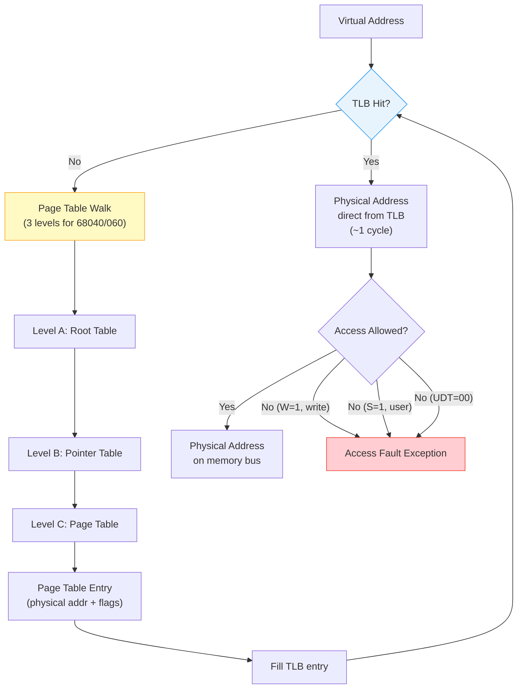
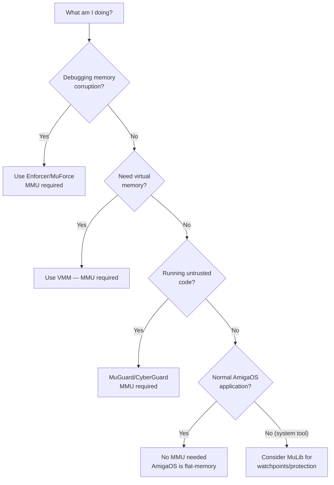

[← Home](../README.md) · [CPU & MMU](README.md)

# MMU Management — 68030/040/060 Memory Management Units

## Overview

The Motorola 68030, 68040, and 68060 include on-chip **MMUs** (Memory Management Units) that provide virtual-to-physical address translation, memory protection, and cache control. The 68020 does not have an on-chip MMU but can pair with an external **68851** MMU. AmigaOS itself does **not use the MMU** for virtual memory — it was designed for a flat address space. However, a surprisingly large ecosystem of third-party software relies on the MMU. See the [Software Overview](#software-that-uses-the-mmu) section for a complete catalog.

---

## MMU Use-Cases — How the Software Works

### Use-Case 1: Enforcer / MuForce — Catching Illegal Memory Accesses

**Problem:** On a classic Amiga, a NULL-pointer dereference (reading from address `$00000000`) or writing past the end of an allocation silently corrupts memory — no exception, no error message. Programs crash unpredictably minutes later in unrelated code.

**How the MMU solves it:**

1. **Build invalid-page table:** Enforcer scans the system memory list and builds an MMU page table where only actual physical RAM ranges are marked valid (`UDT = 01`). The first 4 KB page (`$0000-$0FFF`, containing ExecBase at `$4`) and all unpopulated address space are marked **invalid** (`UDT = 00`).

2. **Trap on access:** When any program tries to read from or write to an invalid page, the MMU raises an *Access Fault Exception* instead of letting the access proceed silently.

3. **Decode the fault:** Enforcer's exception handler examines the exception stack frame to determine: the fault address, whether it was a read or write (RW bit in SSW), the PC at the fault, and CPU register state saved on the supervisor stack.

4. **Report the hit:** Enforcer formats a diagnostic message — the iconic Enforcer hit showing `WORD-WRITE to 00000000 PC: 07895CA4`, register dumps, and with SegTracker loaded, maps the PC back to executable name + hunk + offset.

5. **Continue execution:** The handler emulates the access (returning `$0` for reads) and returns via RTE — the program survives the hit. This is critical: Enforcer is a debugging tool, not a crash enforcer.

**Benefits:**
- Catches NULL dereferences and wild pointer writes instantly at the moment of the bad access, not minutes later
- Zero overhead for valid memory accesses — MMU only fires on truly invalid pages
- Programs survive hits: collect all bugs in one run instead of crashing on the first one

**Cost:** Low-memory reads slightly slower (TLB lookup ~1 cycle vs no MMU overhead). ~200 KB RAM consumed by the MMU translation tree.

---

### Use-Case 2: VMM (memory.library) — Demand-Paged Virtual Memory

**Problem:** An Amiga with 8 MB Fast RAM trying to load an application needing 15 MB. Before VMM, `AllocMem()` simply fails.

**How the MMU solves it:**

1. **Create swap file on disk.** VMM allocates a swap partition or file.
2. **Allocate virtual space:** When an application requests memory, VMM allocates a virtual address range but does NOT back it with physical RAM immediately. All pages are marked swapped (`MAPP_SWAPPED`) in the MMU table.
3. **Page fault on first access:** When the CPU first touches a swapped page, the MMU detects the invalid descriptor and raises an Access Fault Exception.
4. **Page in:** VMM's page fault handler finds a free physical page (or evicts another to disk), reads the requested page from swap into that physical page, updates the MMU table mapping virtual-to-physical with valid flags, and returns via RTE. The CPU re-executes the faulting instruction transparently.
5. **Page out:** When physical RAM runs low, VMM selects a victim page, writes it to swap if dirty, marks it swapped in the MMU table, and frees the physical page for reuse.

**Benefits:**
- Virtual memory limited only by swap file size, not physical RAM
- Transparent to applications — standard `AllocMem()` calls work without code changes

**Performance:** Page fault cost ~10-20 ms (disk seek + read). Thrashing occurs if working set greatly exceeds physical RAM. Best with SCSI-2 or IDE DMA drives.

---

### Use-Case 3: CyberGuard / MuGuardianAngel — Memory Protection & Guard Pages

**Problem:** A program has a buffer overflow writing past its allocation into the neighboring task's memory. AmigaOS has no per-task memory isolation — the corruption is detected only when the victim task crashes, and the culprit is long gone.

**How the MMU solves it:**

1. **Guard pages:** MuGuardianAngel places unmapped pages immediately before and after each memory allocation. These "guard pages" have no physical RAM backing and are marked invalid in the MMU table. A one-byte overrun immediately hits the guard and triggers an access fault.

2. **Per-task isolation:** GuardianAngel surrounds each task's memory with invalid pages. Unlike Enforcer (which catches ALL invalid accesses system-wide), this focuses protection on accidental cross-task corruption.

3. **Access fault on violation:** When Task A writes past its buffer into Task B's space, the MMU fires the access fault. MuGuardianAngel notes which task wrote where, at what PC — identifying the culprit instantly.

4. **Read-only pages for debug:** CyberGuard can mark specific memory ranges as read-only via MMU page descriptors (`W = 1` = write-protected). Writing to these triggers access faults — catching accidental writes to constants, code sections, or shared data.

**Benefits:**
- Buffer overflows and underflows caught at the exact instruction, not hours later
- Per-task memory sandboxing — accidental cross-task writes become immediate access faults
- Write-protect critical data (Kickstart ROM image, system structures) in RAM

**Cost:** Each guard page wastes ~4 KB of RAM per allocation. Per-task isolation requires careful TLB management if not using separate MMU trees.

---

### Use-Case 4: SetPatch / MuSetPatch — Cache Management & FastROM Remapping

**Problem:** On a 68040/060 accelerator with Fast RAM, the CPU's cache is operational but Chip RAM access is slow (16-bit bus, shared with DMA). The Kickstart ROM sits in slow 16-bit ROM space. Written data for blitter DMA stays dirty in the CPU cache and never reaches Chip RAM — causing shimmering pixels, stale data, and poor acceleration.

**How the MMU solves it:**

1. **Set cache modes per page via MMU Configuration file:**
   - **WriteThrough** (CM = 01): CPU writes go BOTH to cache AND to memory — safe for Chip RAM but slower
   - **CopyBack** (CM = 10): CPU writes go only to cache, flushed on demand — fastest for Fast RAM
   - **CacheInhibit / Serialized** (CM = 11): Disable caching entirely — required for custom chip registers

2. **Remap Kickstart to Fast RAM (FastROM):** Copy Kickstart ROM image into Fast RAM at boot, then point MMU page tables for `$F80000-$FFFFFF` at the Fast RAM copy instead of physical ROM. All ROM reads now hit Fast RAM at 32-bit full speed — typically 3-5x faster.

3. **Mark DMA memory regions:** For Chip RAM regions shared with Blitter/Copper/Audio DMA, set cache mode to WriteThrough or CacheInhibit so DMA sees correctly flushed data. Use `CACRF_ClearD` (bit 14) or `CPUSHL` instruction to push dirty cache lines before blitter reads.

4. **MuProtectModules:** The MMU write-protects the Kickstart RAM copy so that buggy programs trying to overwrite "ROM" addresses get access faults instead of silently corrupting system code.

**Benefits:**
- CopyBack on Fast RAM: 2-3x faster writes vs WriteThrough for CPU-only data
- FastROM: Kickstart execution at 32-bit RAM speed — critical for 68040/060; ROM wait states kill superscalar performance
- Correct cache coherency: no shimmering pixels in C2P, no stale DMA data
- Write-protected Kickstart in RAM: protects against accidental corruption

---

### Side-by-Side Comparison

| | Enforcer/MuForce | VMM | MuGuardianAngel | SetPatch/MuSetPatch |
|---|---|---|---|---|
| **MMU feature used** | Invalid page descriptors | Page fault + swap descriptors | Invalid guard pages + write-protect bit | Cache mode bits per page |
| **What it catches** | NULL deref, wild writes to unmapped space | Access to swapped-out page | Buffer overflow across task boundary | Cache coherency bugs, slow ROM access |
| **Hardware cost** | TLB lookup on every access (~1 cycle) | Page fault disk I/O (~10-20 ms) | Guard page RAM (~4 KB per buffer) | None — pure speed gain |
| **Os integration** | Hooks exception vectors | Works via MuLib for OS safety | MuLib provides arbitration | MuLib treats cache/MMU jointly |
| **Best for** | Developers debugging crashes | Users with RAM-starved systems | Developers finding cross-task bugs | Every 040/060 system should have this |


## MMU support in different CPU models

> [!IMPORTANT] **Not all 680x0 CPUs have an MMU.** Motorola sold cost-reduced variants with the MMU (or FPU) stripped:
>
> | CPU | Label | MMU | FPU | Notes |
> |---|---|---|---|---|
> | **68020** | Full | ⚠ external only | ✗ | Requires 68851 companion chip for MMU. Used in Amiga 2500/20 (A2620 card: 68020 + 68881 + 68851) and A2500UX for AMIX Unix |
> | **68EC020** | EC | ✗ | ✗ | Low-cost 020, 24-bit address (16 MB) |
> | **68030** | Full | ✓ on-chip | ✗ | Paged MMU, 256 B I+D cache |
> | **68EC030** | EC | ✗ | ✗ | No MMU — common in budget A1200 accelerators |
> | **68040** | Full | ✓ on-chip | ✓ | Harvard caches (4 KB each) |
> | **68LC040** | LC | ✓ on-chip | ✗ | Has MMU, no FPU |
> | **68EC040** | EC | ✗ | ✗ | Neither MMU nor FPU |
> | **68060** | Full | ✓ on-chip | ✓ | Superscalar, 8 KB caches each |
> | **68LC060** | LC | ✓ on-chip | ✗ | Has MMU, no FPU |
> | **68EC060** | EC | ✗ | ✗ | Neither MMU nor FPU |
>
> **Key:** **EC** (Embedded Controller) = stripped-down, usually no MMU. **LC** (Low Cost) = no FPU, but MMU is present. Always check which variant your accelerator actually has.

### Address Translation Pipeline



---

## MMU Architecture Comparison

| Feature | 68030 | 68040 | 68060 |
|---|---|---|---|
| MMU type | External (on-chip optional) | On-chip, always present | On-chip, always present |
| Page sizes | 256B, 512B, 1K, 2K, 4K, 8K, 16K, 32K | 4K, 8K (fixed) | 4K, 8K (fixed) |
| Table levels | 1–4 configurable | Fixed 3-level | Fixed 3-level |
| TLB entries | 22 (ATC) | 64 (data) + 64 (instruction) | 48 (data) + 48 (instruction) |
| PMMU instructions | `PMOVE`, `PFLUSH`, `PTEST`, `PLOAD` | `PFLUSHA`, `PFLUSHN`, `CINV`, `CPUSH` | Same as 040 |
| Transparent translation | `TT0`, `TT1` (via PMOVE) | `DTT0/1`, `ITT0/1` (via MOVEC) | Same as 040 |
| Supervisor root pointer | `SRP` (via PMOVE) | `SRP` (via MOVEC) | `SRP` (via MOVEC) |
| CPU root pointer | `CRP` (via PMOVE) | `URP` (via MOVEC) | `URP` (via MOVEC) |

---

## Key Registers

### 68030

```
TC  — Translation Control
    Bit 31: E (enable)
    Bits 30–28: SRE, FCL (function code lookup)
    Bits 27–24: PS (page size)
    Bits 23–20: IS (initial shift)
    Bits 19–16: TIA (table index A bits)
    ...

TT0, TT1 — Transparent Translation Registers
    Bit 15: E (enable)
    Bits 31–24: Logical address base
    Bits 23–16: Logical address mask
    Bits 2–0: Function code

CRP — CPU Root Pointer (64-bit)
SRP — Supervisor Root Pointer (64-bit)
```

### 68040/060

```
TC  — Translation Control (MOVEC accessible)
    Bit 15: E (enable translation)
    Bit 14: P (page size: 0=4K, 1=8K)

DTT0, DTT1 — Data Transparent Translation
ITT0, ITT1 — Instruction Transparent Translation
    Same format: base/mask/enable/cache-mode

URP — User Root Pointer (32-bit, MOVEC)
SRP — Supervisor Root Pointer (32-bit, MOVEC)
```

---

## Page Table Entry Format (68040/060)

```
31          12  11  10  9  8  7  6  5  4  3  2  1  0
┌──────────────┬───┬───┬──┬──┬──┬──┬──┬──┬──┬──┬──┐
│ Physical Addr│ U1│ U0│ S│CM1│CM0│ M│ U│ W│  UDT  │
└──────────────┴───┴───┴──┴──┴──┴──┴──┴──┴──┴──┴──┘

UDT: 00=invalid, 01=page descriptor, 10=valid 4-byte, 11=valid 8-byte
W:   write-protected
U:   used (accessed)
M:   modified (dirty)
CM:  cache mode (00=cacheable/writethrough, 01=cacheable/copyback,
     10=noncacheable/serialized, 11=noncacheable)
S:   supervisor only
```

---

## MMU Library Landscape — Review & Feature Matrix

The Amiga has no OS-level MMU support — `exec.library` treats memory as a flat 32-bit space. All MMU functionality comes from third-party libraries. By 2025 the ecosystem has consolidated around Thomas Richter's MuLib stack, but legacy commercial options (Phase5) and early experimental releases are still encountered in the wild.

### Feature Comparison Matrix

| Feature | **MMULib** (Thor) | **Mu680x0Libs** (Thor) | **Phase5 Libs** | **mmu.lha** (early Thor) |
|---|---|---|---|---|
| **Type** | Full MMU framework | CPU replacement libraries | CPU emulation + basic MMU | Alpha/experimental |
| **License** | THOR-Software Licence (free) | THOR-Software Licence (free) | Commercial (Card bundle) | Free / early alpha |
| **Source available** | No (closed, freeware) | No (closed, freeware) | No | No |
| **Latest version** | 47.11 (Nov 2024) | 47.2 (Aug 2022) | Frozen (~2003) | Frozen (~1997) |
| **CPU support** | 68020+68851, 68030, 68040, 68060 | 68020, 68030, 68040, 68060 | 68040, 68060 only | 68030, 68040, 68060 |
| **68040.library / 68060.library** | Included (MMU-aware) | **Included** (optimized, MMU-aware) | Original Phase5 versions | Not included |
| **680x0.library** (uniform API) | ✓ | ✓ | ✗ | ✗ |
| **VMM (virtual memory)** | ✓ (memory.library) | ✓ (uses host mmu.library) | ✗ | ✗ |
| **MuForce** (runtime error detect) | ✓ | ✓ (requires mmu.library) | ✗ | ✗ |
| **MuGuardianAngel** | ✓ | ✗ | ✗ | ✗ |
| **MuRedox** (FPU redirection) | ✓ | ✗ | ✗ | ✗ |
| **MuScan** (MMU table viewer) | ✓ | ✗ | ✗ | ✗ |
| **MuFastZero** (zero-page remap) | ✓ | ✗ | ✗ | ✗ |
| **MuEVD** (Shapeshifter driver) | ✓ | ✗ | ✗ | ✗ |
| **P5Init** (Phase5 compat layer) | ✓ | ✗ | ✗ | ✗ |
| **MMU-Configuration file** | ✓ (ENVARC:) | ✓ (via host mmu.library) | ✗ | ✗ |
| **FastIEEE** (math bypass) | ✓ | ✓ | ✗ | ✗ |
| **A3000 SuperKickstart** | ✓ | ✓ (68030.library) | ✗ | ✗ |
| **68EC/LC CPU support** | ✓ (auto-unloads FPU) | ✓ | ✗ | ✗ |
| **Memory saved vs Phase5** | ~200 KB | ~200 KB | Baseline | N/A |
| **Active maintenance** | ✓ (2024+) | ✗ (2022, legacy) | ✗ (obsolete) | ✗ |

### Individual Library Reviews

#### MMULib (mmu.library) — Thomas Richter

The **gold standard**. Not just a library — a complete MMU management ecosystem. Replaces all CPU libraries with MMU-aware versions that build a shared MMU tree, saving ~200 KB of memory by eliminating duplicated table setups. The `MMU-Configuration` file (in `ENVARC:`) provides declarative control: specify memory layouts, caching modes, and blanking rules in a single text file without writing code.

**Key components bundled with MMULib:**
- `mmu.library` — core API: page mapping, context switching, property queries
- `680x0.library` — uniform CPU abstraction (all apps use this, not 68040/68060 directly)
- `68040.library` / `68060.library` / `68030.library` / `68020.library` — MMU-aware CPU libraries
- `memory.library` — demand-paged virtual memory (VMM)
- `MuForce` — Enforcer successor, catches NULL deref, bounds violations
- `MuGuardianAngel` — surround tasks with guard pages, catch stack overflows
- `MuRedox` — redirects FPU exceptions, enables FPU emulation on EC/LC chips
- `MuScan` — dump current MMU table state for debugging
- `MuFastZero` — remap zero page to Fast RAM (performance boost)
- `MuEVD` — Shapeshifter-compatible video driver routing through MMU
- `P5Init` / `p5emu.library` — Phase5 CyberStorm compatibility shim
- `FastIEEE` — bypass mathieee libraries, call FPSP directly
- `PatchWork` / `Sashimi` —3 third-party contributions (included with permission)

**License:** THOR-Software Licence v3 — free for non-commercial use, redistribution OK on physical media at nominal cost, source NOT provided.

**Installation:**
```
1. Copy LIBS:mmu.library to LIBS:
2. Copy all LIBS:680#?0.library to LIBS:
3. Optionally: copy ENVARC:MMU-Configuration
4. Add MuForce, MuGuardianAngel to startup-sequence
```

#### Mu680x0Libs — Thomas Richter

A **stripped-down alternative** to the full MMULib. This is purely the CPU libraries (68020 through 68060), designed to work WITH a separately installed `mmu.library`. Does NOT include MuForce, VMM, MuGuardianAngel, or the configuration tools. Use this when you want MMU-aware CPU libraries without the full tools suite, or when you're building a minimal system.

**When to choose Mu680x0Libs over MMULib:**
- You already have `mmu.library` installed and only need updated CPU libs
- Disk space is extremely tight (Mu680x0Libs is ~327 KB vs MMULib's full distribution)
- You don't need runtime debugging tools (MuForce/MuGuardianAngel)

**Version note:** Mu680x0Libs was last updated in 2022 (v47.2). For actively maintained CPU libraries, use MMULib instead, which bundles newer versions.

#### Phase5 68040.library / 68060.library — Commercial

Shipped with Phase5 CyberStorm accelerator boards (MK1/MK2/MK3, CyberStorm PPC). These were the original 040/060 trap libraries for Amiga. Functional but **obsolete by modern standards**:
- Build their own private MMU tree (~200 KB wasted if another MMU tool runs)
- No `680x0.library` abstraction layer
- No VMM support
- No runtime debugging integration
- No longer maintained (Phase5 dissolved in early 2000s)
- CPU-specific library must match exact accelerator model

**Legacy use case:** If you have an original Phase5 board with its original install disk, these still work. But for any new or rebuilt setup, MMULib's `P5Init` + `p5emu.library` fully replaces them while adding MuForce/VMM support.

#### mmu.lha (Original Release) — Historical

The first public `mmu.library`, also by Thomas Richter. Early alpha from ~1997. Superseded entirely by MMULib v47.x. Only mentioned here because some ancient distributions still package it and you may encounter the filename in forum posts. Do NOT use this in any current setup.

### Tool Ecosystem

| Tool | Package | Purpose |
|---|---|---|
| **MuForce** | MMULib | Runtime illegal-access detector (Enforcer successor). Hit format: `ENFORCER HIT: 00000000 READ by task "BadApp" at 0002045A` |
| **MuGuardianAngel** | MMULib | Process-level memory isolation — guard pages around each task to catch overflows |
| **MuScan** | MMULib | Print current MMU table: addresses, caching modes, page descriptors — essential for debugging MMU configs |
| **MuRedox** | MMULib | Run FPU-requiring software on LC/EC chips (no hardware FPU) via the fpsp.resource |
| **MuFastZero** | MMULib | Move the zero page ($0) from Chip RAM to Fast RAM, eliminating slow Chip RAM access for NULL-dereference patterns |
| **MuEVD** | MMULib | Shapeshifter (Mac emulator) video driver that routes framebuffer through MMU |
| **P5Init** | MMULib | Detect and configure Phase5 CyberStorm boards at boot, emulating the original Phase5 API |
| **SegTracker** | MMULib | Symbol/line-number tracking for MuForce hits — shows exact source location of crashes |
| **FastIEEE** | MMULib / Mu680x0Libs | Bypass mathieee*.library overhead; call fpsp.resource directly from your math code |
| **ACAInit** | Mu680x0Libs | Experimental MMU setup for Individual Computers ACA accelerators |

### Licensing Quick Reference

| Library | License Type | Cost | Source Code | Redistributable |
|---|---|---|---|---|
| **MMULib** (Thor) | THOR-Software Licence v3 | **Free** | No | ✓ (non-commercial) |
| **Mu680x0Libs** (Thor) | THOR-Software Licence v3 | **Free** | No | ✓ (non-commercial) |
| **Phase5 libs** | Proprietary commercial | **Paid** (card bundle) | No | Only with Phase5 hardware |
| **mmu.lha** (early Thor) | Free (early alpha) | **Free** | No | Obsolete — do not redistribute |

> [!NOTE]
> While no open-source MMU library exists for classic Amiga (all are closed-source), the THOR-Software Licence permits free redistribution, inclusion on cover disks/CD-ROMs, and unlimited non-commercial use. The only restriction is commercial bundling without author permission.

---

## Enforcer — How It Uses MMU

Enforcer maps address `$000000–$0003FF` (low memory) and `$00C00000+` (unassigned ranges) as **invalid pages**. Any access to these causes an MMU exception that Enforcer catches, logs, and allows the program to continue:

```
ENFORCER HIT: 00000000 READ  by task "BadApp" at 0002045A
```

---

## VMM — Virtual Memory

VMM (Virtual Memory Manager) uses the MMU to implement demand-paged virtual memory:
1. Maps physical RAM pages into the address space
2. When RAM is full, pages least-recently-used blocks to a swap file on disk
3. On access to a swapped-out page → MMU exception → VMM reads page back from disk
4. Transparent to applications — they see continuous RAM

---

## Direct MMU Programming (No Library)

```asm
; 68040: Enable MMU with 4K pages
    ; Set up page tables at PAGE_TABLE_BASE...
    movec.l  PAGE_TABLE_BASE,urp    ; set User Root Pointer
    movec.l  PAGE_TABLE_BASE,srp    ; set Supervisor Root Pointer
    move.l   #$8000,d0              ; TC: E=1, P=0 (4K pages)
    movec.l  d0,tc                  ; enable translation!
    pflusha                          ; flush all TLB entries

; 68040: Set transparent translation (map $00000000–$00FFFFFF 1:1)
    move.l   #$00FFE040,d0          ; base=$00, mask=$FF, E=1, CM=writethrough
    movec.l  d0,dtt0                ; data transparent translation 0
    movec.l  d0,itt0                ; instruction transparent translation 0
```

---

## When to Use / When NOT to Use the MMU

| Scenario | Use MMU? | Why |
|---|---|---|
| Debugging memory corruption bugs | **Yes** | Enforcer/MuForce catches NULL-deref and out-of-bounds |
| Need virtual memory (swap) | **Yes** | VMM requires MMU for page fault detection |
| Running untrusted code / sandboxes | **Yes** | Memory protection via MuGuard/CyberGuard |
| Normal application, no debugging | **No** | AmigaOS doesn't use MMU; overhead without benefit |
| Game/demo targeting stock A1200 | **No** | Few A1200 owners have MMU-capable accelerators |
| Performance-critical real-time rendering | **No** | TLB misses add ~20+ cycles; transparent translation is faster |
| Writing a debugger or system tool | **Yes** | Watchpoints, memory breakpoints via MMU |

---

## Named Antipatterns

### 1. "The Incomplete Flush" — Enabling MMU Without PFLUSHA

**Symptom:** Random crashes or wrong addresses after enabling the MMU, especially on 68040/060.

**Why it fails:** The TLB may contain stale entries from a previous MMU configuration. Enabling translation without flushing the TLB causes the CPU to use old mappings for new addresses.

```asm
; BROKEN — stale TLB entries survive
    movec.l  urp,srp           ; set root pointer
    move.l   #$8000,tc         ; enable MMU
    ; TLB still has old entries — random failures!

; CORRECT — always flush after enabling
    movec.l  urp,srp
    pflusha                     ; flush ALL TLB entries first
    move.l   #$8000,tc          ; now enable safely
```

### 2. "The Wrong Tree Level" — Incorrect Page Table Depth

**Symptom:** 68040/060 page tables work on 68030 but crash on 68040, or vice versa.

The 68030 supports 1–4 table levels; the 68040/060 use fixed 3-level trees. Code that builds 4-level tables for the 68030 will produce wrong translations on the 68040.

**Fix:** Use `mmu.library` (MuLib) — it abstracts table construction across CPU families.

### 3. "The Two MMUs" — MuLib and Custom MMU Code Conflict

**Symptom:** Enforcer crashes after you wrote custom MMU init code.

**Why it fails:** If you set up MMU tables directly (via `MOVEC SRP/URP/TC`) and then MuLib also tries to initialize, the two MMU configurations collide. MuLib expects full ownership of the MMU hardware.

**Fix:** Either use MuLib exclusively OR write bare-metal MMU code, never both. If using MuLib, use its API (`SetPageProperties`, `RemapPage`) instead of direct MOVEC.

---

## Pitfalls

### 1. Transparent Translation Overlapping Page Tables

Transparent translation registers (`DTT0`/`ITT0`) override page tables for matching addresses. If you set `DTT0` to cover `$00000000–$00FFFFFF` and your page tables also map that range, the transparent registers win silently — your page table entries are ignored.

**Check:** Ensure transparent translation ranges and page table ranges are **mutually exclusive**.

### 2. Enabling MMU With Uninitialized SRP/URP

```asm
; BROKEN — root pointers contain garbage
    move.l   #$8000,tc          ; E=1 — enable MMU
    ; SRP/URP are uninitialized → CPU walks garbage addresses → bus error

; CORRECT — initialize root pointers first
    movec.l  PAGE_TABLE,urp     ; set User Root Pointer
    movec.l  PAGE_TABLE,srp     ; set Supervisor Root Pointer
    pflusha                      ; flush TLB
    move.l   #$8000,tc           ; now safe to enable
```

---

## Decision Flowchart — Do I Need the MMU?



---

---

## Software That Uses the MMU

### Debugging & Memory Protection

| Software | Purpose | MMU Usage |
|---|---|---|
| **Enforcer** | Detects illegal (NULL/unmapped) memory accesses | Maps low memory as invalid; traps access faults |
| **MuForce** | Enforcer successor (Thor's MuLib stack) | Same mechanism, integrated with mmu.library, adds symbol info via SegTracker |
| **MuGuardianAngel** | Process-level memory isolation | Surrounds each task with unmapped guard pages, catches stack overflow and cross-task corruption |
| **CyberGuard** | Memory protection for debugging (early tool) | Uses MMU to make certain memory ranges read-only or invalid |
| **GuardianAngel** | Predecessor to MuGuardianAngel | Similar guard-page approach |

### Virtual Memory & Memory Expansion

| Software | Purpose | MMU Usage |
|---|---|---|
| **VMM** (memory.library) | Demand-paged virtual memory — swap to disk | Page fault handler maps pages on-access, writes dirty pages to disk; effectively gives 1+ GB virtual space on machines with limited RAM |
| **GigaMem** | Use hard disk space as virtual RAM | Similar to VMM; MMU detects accesses to swapped-out pages and triggers page-in |

### Macintosh Emulation

| Software | Purpose | MMU Usage |
|---|---|---|
| **ShapeShifter** | Free Macintosh 68k emulator | Uses MMU for memory layout (Mac expects specific memory map) and via **MuEVD** video driver for P96 direct framebuffer access |
| **Fusion** | Commercial Mac emulator (Jim Drew) | MMU remaps Amiga memory to match Mac address space; also traps Mac video memory changes for Amiga screen updates |
| **MuEVD** | ShapeShifter/Fusion video driver | Routes Mac framebuffer through MMU to P96 graphics card VRAM with zero-copy access |

### ZX Spectrum Emulation — Z80 Page Mapping

| Software | Purpose | MMU Usage |
|---|---|---|
| **ASp** (Amiga SPectrum) | ZX Spectrum 48K/128K emulator | **Requires** MMU + mmu.library v43 for 128K support; the Spectrum 128K uses bank-switching to fit more RAM into the Z80's 64 KB address space. ASp uses the Amiga MMU to map 16 KB Spectrum RAM pages into the emulated address space **in hardware** — no copying, no per-instruction pointer arithmetic. The MMU does the mapping transparently (~0 cycles for page switches vs megabytes/second of memcpy alternatives) |

> **Why MMU for ZX Spectrum?** The Z80 only addresses 64 KB, but the Spectrum 128K has 128 KB RAM + ROM via bank switching. Emulating this on 68K without an MMU requires either:
>
> 1. Copying 16 KB pages around on every bank switch (slow — megabytes/sec of memcpy)
> 2. Indexing pointers on every emulated Z80 access (slow — per-instruction overhead)
>
> With the MMU: the emulator simply tells the MMU "map physical page X to virtual address Y" and the hardware handles the rest at zero CPU cost. This is exactly what modern hypervisors do with EPT/NPT (Extended/Nested Page Tables).

| **x128** | ZX Spectrum 128K / Pentagon / Scorpion emulator | 68060+ recommended; uses MMU for high-performance page mapping |

### Operating Systems

| Software | Purpose | MMU Usage |
|---|---|---|
| **AMIX** (Amiga UNIX) | AT&T System V Release 4 on Amiga | **Requires** MMU — full UNIX virtual memory, process isolation, demand paging; only runs on A3000UX with 68030 or A2500UX with 68020+68851 |
| **NetBSD/amiga** | NetBSD port for Amiga | **Requires** 68030+ with MMU; full UNIX memory model — mmap, fork, shared libraries via COW |
| **Linux/m68k** | Linux port for Amiga (Debian m68k) | **Requires** MMU; standard Linux virtual memory stack with paging |

### Game Launchers & System Tools

| Software | Purpose | MMU Usage |
|---|---|---|
| **WHDLoad** | Hard disk game installer/launcher with quit-key | **Optional MMU** for: memory protection (guard pages around game), cache management, returning to OS cleanly. Without MMU: uses simpler but less robust methods |
| **SetCPU / CPU** | Cache and MMU configuration tools | Toggle data/instruction caches, burst mode, CopyBack vs WriteThrough, FastROM remapping via MMU |
| **MuFastZero** | Remap zero page to Fast RAM | Uses MMU to relocate address $00000000 from slow Chip RAM to fast 32-bit RAM, boosting performance for NULL-pointer access patterns |
| **Oxypatcher / CyberPatcher** | System patching tools | Uses MMU to write-protect ROM code, then traps write attempts to apply runtime patches |
| **MuProtectModules** | Prevent ROM module corruption | MMU write-protects Kickstart modules in RAM after they're loaded; catches programs that accidentally overwrite system code |
| **BlazeWCP** | Workbench copy-paste accelerator | Uses MMU to provide fast copy-back regions (minor use, mostly cache-mode tweaks) |
| **SegTracker** | Symbol/line-number tracking | Works with MuForce to map crash addresses back to source code locations; not an MMU user itself but essential companion |

### Summary — MMU Requirement by Category

| Category | MMU Required? | Examples |
|---|---|---|
| Debugging / memory protection | **Yes** | Enforcer, MuForce, MuGuardianAngel |
| Virtual memory / swap | **Yes** | VMM, GigaMem |
| Mac emulation | **Yes** (ShapeShifter) / Optional (Fusion) | ShapeShifter, Fusion, MuEVD |
| ZX Spectrum 128K emulation | **Yes** | ASp, x128 |
| Full UNIX/Linux OS | **Yes** | AMIX, NetBSD, Linux/m68k |
| Game launcher (WHDLoad) | **Optional** | Better protection and quit-key with MMU |
| System patches / tools | **Optional** | SetCPU, MuFastZero, Oxypatcher |
| Normal AmigaOS applications | **No** | Most software — flat address space |

---

## Impact on FPGA/Emulation — MiSTer & UAE

### TG68K Core

The TG68K core in MiSTer's Minimig-AGA **does not implement an MMU**. All MMU-related instructions (`PMOVE`, `PFLUSH`, `PTEST`, `MOVEC to SRP/URP/TC`) are either:
- **Trapped as illegal instruction** exceptions
- **Accepted but silently ignored** (depending on the TG68K build)

**Implications:**
- Enforcer, VMM, and MuForce **will not work** on the current MiSTer Minimig core
- Code using `mmu.library` must detect MMU absence via `OpenLibrary()` failure
- Future TG68K updates may add partial MMU support (tracked in the [MiSTer Minimig repo](https://github.com/MiSTer-devel/Minimig-AGA_MiSTer))

### UAE Emulation

WinUAE fully emulates 68030/040/060 MMUs. Enforcer and VMM work in UAE. Use UAE for testing MMU-dependent software before deploying to hardware with real MMU-capable accelerators.

### M68030/M68040 FPGA Cores

For custom FPGA CPU cores with MMU in this workspace (`m68030/`, `m68040/`):
- Implement full ATC/TLB with at least 22 entries (030) or 128 entries (040)
- Support transparent translation registers (TT0/TT1 for 030, DTT0/ITT0 for 040)
- Correctly handle access faults with proper exception stack frames
- Test with Enforcer hit patterns to verify fault detection

---

## Modern Analogies

| Amiga MMU Concept | Modern Equivalent | Notes |
|---|---|---|
| 3-level page table (Root → Pointer → Page) | x86-64 4-level (PML4 → PDPT → PD → PT) | Same structure, fewer levels due to smaller address space |
| `SRP`/`URP` registers | ARM `ttbr0_el1` / `ttbr1_el1` | Split supervisor/user root pointers for isolation |
| `DTT0`/`ITT0` transparent translation | MTRR / PAT (x86 Memory Type Range Registers) | Override page table caching behavior for address ranges |
| Enforcer mapping low mem as invalid | `mprotect(PROT_NONE)` / `mmap(MAP_ANON)` | Trap access to unmapped pages for debugging |
| VMM demand paging | Linux swap + page fault handler | Identical mechanism: access invalid page → fault → load from disk |
| TLB (Translation Lookaside Buffer) | All modern CPUs (x86, ARM, RISC-V) | The same hardware structure with the same purpose |

---

## FAQ

### Does AmigaOS ever use the MMU?

No. Commodore designed AmigaOS for a flat 32-bit address space with no virtual memory. The MMU hardware exists in the CPU but is unused by `exec.library`, `graphics.library`, or any OS component. AmigaOS 4.0+ on PowerPC does use the MMU, but classic 68k AmigaOS does not.

### Can I use Enforcer on a 68030?

Yes. The 68030 has a full MMU. However, many early 68030 accelerator boards omitted the MMU from the CPU mask used (the 68EC030 has no MMU). Check that your board's CPU is a full 68030, not an EC variant.

### Why is my MMU code crashing on real hardware but working in UAE?

UAE's MMU is more forgiving about certain timing dependencies. Common causes:
- Missing `PFLUSHA` after TC write (UAE may auto-flush)
- Transparent translation overlap (UAE may give different priority)
- TLB entry count exceeded (UAE has a larger or unlimited virtual TLB)

---

## References

- Motorola: *MC68030 User's Manual* — MMU chapter
- Motorola: *MC68040 User's Manual* — MMU chapter
- Motorola: *MC68060 User's Manual* — MMU chapter
- Thomas Richter: MuLib documentation (Aminet: `util/libs/MMULib.lha`)
- Enforcer source (public domain)
