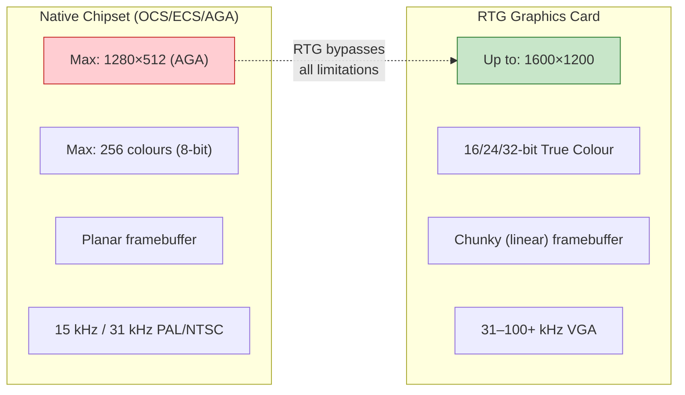
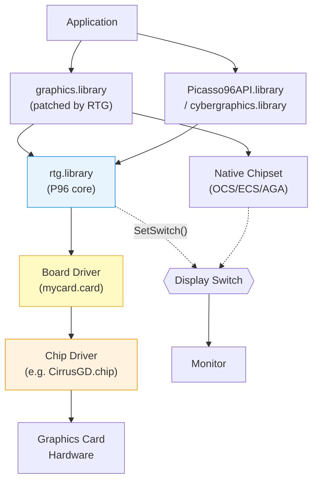
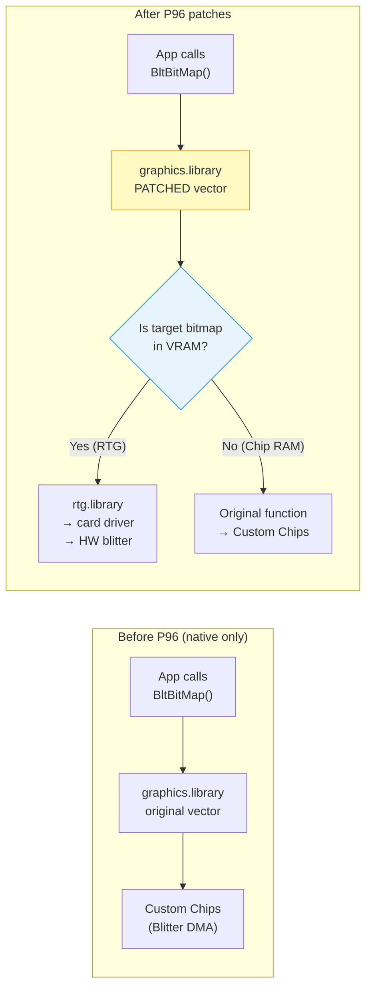
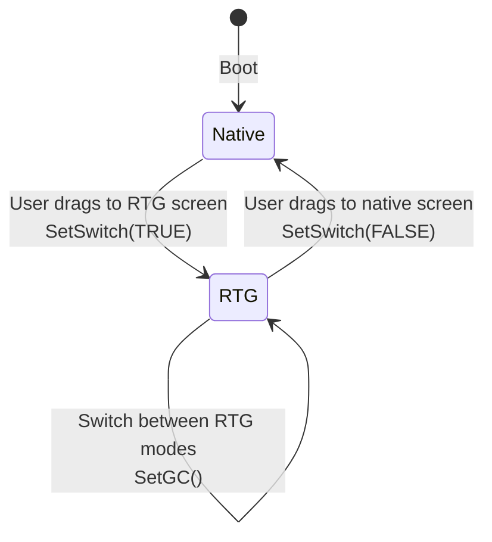
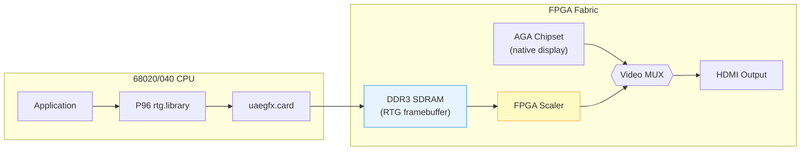
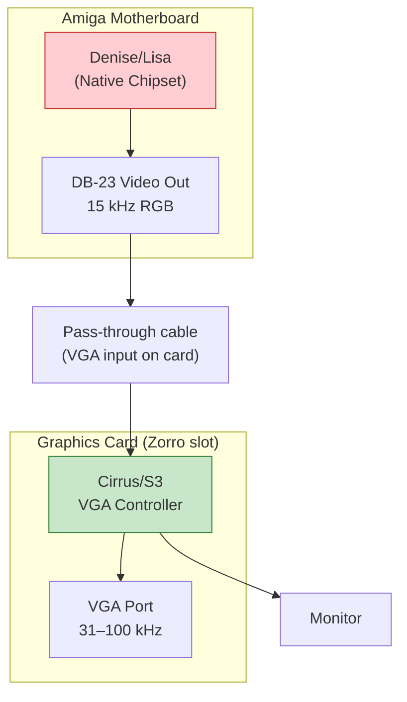
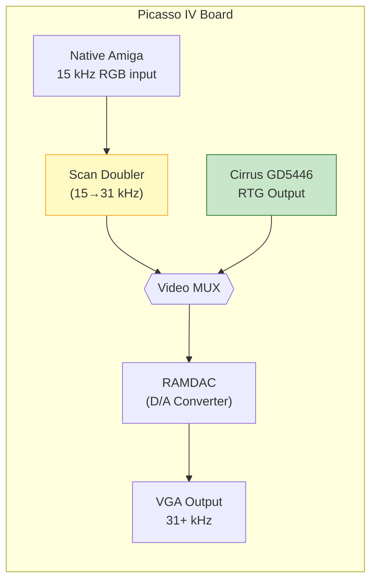
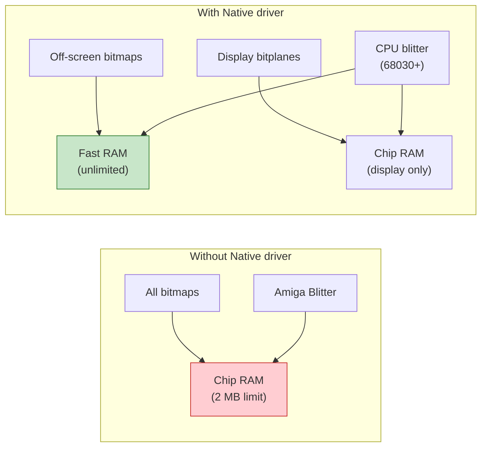

[← Home](../README.md) · [Driver Development](README.md)

# RTG — Retargetable Graphics: Architecture, Hardware, and Driver Development

## Overview

**RTG** (Retargetable Graphics) is the framework that allows AmigaOS to use external graphics cards instead of, or alongside, the native custom chipset (OCS/ECS/AGA). RTG was essential for the Amiga's evolution beyond the 15 kHz PAL/NTSC display limitations, enabling VGA-class resolutions (up to 1600×1200) and true-colour (16/24/32-bit) output.

The two major RTG systems are:
- **Picasso96 (P96)** — the de facto standard, now maintained by Individual Computers
- **CyberGraphX (CGX)** — the earlier competitor, used on CyberVision cards

Both share the same fundamental architecture: a **board driver** model where `.card` library files provide hardware-specific functions called by the RTG system library.

---

## The Problem RTG Solves



### Planar vs Chunky — The Fundamental Difference

The native Amiga chipset uses **planar** pixel storage — colour bits are spread across separate bitplanes. RTG cards use **chunky** (linear, packed) pixel storage:

```
PLANAR (Native Amiga — 4 bitplanes = 16 colours):
  Bitplane 0: 10110010...  ← bit 0 of each pixel's colour
  Bitplane 1: 01100101...  ← bit 1
  Bitplane 2: 11010001...  ← bit 2
  Bitplane 3: 00101100...  ← bit 3

  To read pixel 0's colour: read bit 0 from each plane → combine

CHUNKY (RTG Card — 8-bit indexed):
  Pixel 0: $0D  Pixel 1: $05  Pixel 2: $1B  Pixel 3: $0A ...

  Each pixel's colour stored contiguously — one byte per pixel (8-bit)
  Or: two bytes per pixel (16-bit), three (24-bit), four (32-bit)
```

---

## System Architecture



### How P96 Integrates with the OS — The SetFunction Patch

P96's core trick is **patching the OS itself**. At startup, `rtg.library` uses `exec.library/SetFunction()` to replace function vectors inside `graphics.library` and `intuition.library` with its own versions. After patching, every application that calls standard OS drawing functions is **transparently redirected** to the RTG card — no application changes needed.



#### What Gets Patched — Hooked Function Vectors

| Library | Function (LVO) | Original (Native) | RTG Reimplementation |
|---|---|---|---|
| `graphics.library` | `BltBitMap` (−30) | Programs the Blitter DMA to copy rectangular regions between planar bitmaps in Chip RAM. Uses hardware minterm logic for raster ops (AND/OR/XOR). | Checks source/dest bitmap memory addresses. If either is in card VRAM, calls `BoardInfo->BlitRect()` which programs the card's 2D engine to do a VRAM-to-VRAM rectangle copy. If both are Chip RAM, falls through to original Blitter path. Mixed (Chip↔VRAM) requires CPU-mediated copy across the bus. |
| `graphics.library` | `BltBitMapRastPort` (−606) | Blits a bitmap into a RastPort (with clipping). Uses native Blitter with layer clip rectangles. | Same VRAM detection. For RTG RastPorts, iterates the ClipRect list and calls `BlitRect` for each visible clip rectangle individually, handling layer obscuring. |
| `graphics.library` | `RectFill` (−306) | Programs native Blitter to fill a rectangular region with the RastPort's foreground pen using planar fill mode. | Calls `BoardInfo->FillRect()` which sends a solid-fill command to the card's 2D engine with the pen colour converted to the screen's `RGBFTYPE`. Single register write + blit trigger — extremely fast. |
| `graphics.library` | `Move`/`Draw` (−240/−246) | Uses the Blitter's line-draw mode (BLTCON1 bit 0) to draw a one-pixel-wide line between two points in planar memory. | Calls `BoardInfo->DrawLine()` which programs the card's hardware Bresenham line engine. If DrawLine is NULL, falls back to CPU-computed pixel-by-pixel `WritePixel` into VRAM. |
| `graphics.library` | `WritePixel` (−324) | Computes bitplane offsets, sets/clears the appropriate bit in each plane for the pen colour. | Computes byte offset in chunky VRAM: `offset = y * BytesPerRow + x * BPP`. Writes the pen colour directly as 1/2/3/4 bytes depending on depth. No hardware assist needed — just a bus write. |
| `graphics.library` | `ReadPixel` (−318) | Reads the corresponding bit from each bitplane, assembles the colour index. | Reads 1/2/3/4 bytes from VRAM at the pixel offset. **Very slow on Zorro II** — each read stalls the CPU for a full bus cycle (~1 µs). Avoid in loops. |
| `graphics.library` | `ScrollRaster` (−396) | Uses native Blitter to shift a rectangular region, then clears the exposed strip. | Calls `BlitRect` to shift the rectangle within VRAM, then `FillRect` to clear the newly exposed area. Alternatively, if the entire screen scrolls, uses `SetPanning()` to simply change the display start address — zero-copy scroll. |
| `graphics.library` | `AllocBitMap` (−918) | Allocates a planar bitmap in Chip RAM (`MEMF_CHIP`). Creates N bitplane pointers, one per plane. | If the bitmap is for an RTG screen (friend bitmap is RTG), allocates a contiguous chunky buffer from card VRAM instead. Sets a private flag so all subsequent drawing ops route to the card. The bitmap struct's Planes[0] points to VRAM; Planes[1..7] are NULL (chunky = one plane). |
| `graphics.library` | `FreeBitMap` (−924) | Frees planar bitplane memory back to Chip RAM pool. | If bitmap is in VRAM, frees it from the card's VRAM allocator (managed by `rtg.library`). Clears the RTG flag. |
| `graphics.library` | `SetAPen`/`SetBPen` | Stores pen index in RastPort for subsequent draw calls. | Same — pen storage is RastPort-local. But for hi/true-colour RTG screens, P96 must also resolve the pen to an RGB value via the screen's colour table when the actual draw call happens. |
| `graphics.library` | `LoadRGB32` (−882) | Programs the native colour palette registers ($DFF180–$DFF1BE for OCS, or AGA bank registers). | Calls `BoardInfo->SetColorArray()` which programs the card's RAMDAC palette registers. For 8-bit CLUT screens, this updates the hardware palette. For 16/24/32-bit screens, this updates a software lookup table only. |
| `intuition.library` | `OpenScreen` (−198) | Creates a ViewPort, allocates Chip RAM bitplanes, builds a Copper list for the display, and programs Denise/Lisa registers. | Intercepts the mode ID. If it's an RTG mode: allocates VRAM for the framebuffer, calls `SetGC()` to program the card's CRTC timing registers, calls `SetDAC()` for pixel format, and calls `SetSwitch(TRUE)` to route the monitor to the card's output. No Copper list is built. |
| `intuition.library` | `CloseScreen` (−66) | Tears down ViewPort, frees Copper lists and Chip RAM bitplanes. | Frees VRAM allocations. If this was the last RTG screen, calls `SetSwitch(FALSE)` to return the monitor to native chipset output. |
| `intuition.library` | `ScreenToFront` (−252) | Reorders the screen list and rebuilds the Copper list to display this screen on top. | If the new front screen is on different hardware than the current display (e.g., switching from native to RTG), calls `SetSwitch()` to toggle the monitor. If same hardware, just reorders the screen depth. |
| `intuition.library` | `MoveScreen` (−162) | Adjusts the screen's ViewPort Y-offset for drag-scrolling; Copper list is rebuilt to show the new position. | For RTG screens, calls `SetPanning()` with the new display start offset. The card's CRTC start address register changes — zero-copy, instant scroll. |

The critical decision happens at every call: **is the target bitmap in VRAM (RTG) or Chip RAM (native)?** If the bitmap was allocated by P96 on the graphics card, the call goes to the card driver. If it's a regular Chip RAM bitmap, the original unpatched function is called — the native Blitter handles it as usual.

> This is why RTG is "transparent" — old applications that use proper OS calls (not direct hardware banging) work on RTG screens without modification. The OS is doing the same thing it always did; P96 just redirected where "the same thing" happens.

### Two-Driver Model

P96 splits hardware support into two independent drivers:

| Driver Type | File Extension | Responsibility | Example |
|---|---|---|---|
| **Card Driver** | `.card` | Board identification, Zorro/PCI bus interface, memory mapping, interrupt handling | `PicassoIV.card` |
| **Chip Driver** | `.chip` | VGA/graphics controller programming: CRTC timing, DAC, blitter commands | `CirrusGD.chip` |

This separation means one chip driver can support multiple boards using the same VGA controller:

```
PicassoII.card  ─┐
PicassoIV.card  ─┤── CirrusGD.chip (shared — Cirrus Logic GD542x/5446)
Spectrum.card   ─┘

CyberVision.card ── S3Virge.chip
Mediator_PCI.card ─── Permedia2.chip
```

---

## Graphics Card Hardware

### Major Amiga Graphics Cards

| Card | Controller | Bus | VRAM | Acceleration | Notes |
|---|---|---|---|---|---|
| **Picasso II** | Cirrus GD5426/28 | Zorro II | 1–2 MB DRAM | 2D blitter | Most popular; reliable |
| **Picasso IV** | Cirrus GD5446 | Zorro II/III | 4 MB EDO | 64-bit blitter, 180 MB/s fill | Integrated flicker-fixer + video scaler |
| **CyberVision 64** | S3 Trio64 | Zorro III | 2–4 MB | S3 2D engine | First Zorro III gfx card; Roxxler C2P chip |
| **CyberVision 64/3D** | S3 ViRGE | Zorro III | 4 MB | 2D + basic 3D | ViRGE "decelerator" — 3D was slow |
| **Merlin** | Tseng ET4000W32 | Zorro II/III | 2–4 MB | Tseng blitter | Very fast 2D |
| **Retina Z3** | NCR 77C32BLT | Zorro III | 4 MB | NCR blitter | High-end |
| **uaegfx** | Virtual (UAE) | Virtual | Configurable | Software | Emulator virtual card |
| **MiSTer RTG** | FPGA | Virtual | Shared DDR | Software/HW | MiSTer Amiga core RTG |

### Zorro Bus Memory Mapping

The graphics card's VRAM and registers are mapped into the Amiga's address space via the Zorro expansion bus:

```
Amiga Address Map:
  $0000_0000 ─ $001F_FFFF : Chip RAM (2 MB)
  $00BF_D000 ─ $00BF_DFFF : CIA registers
  $00C0_0000 ─ $00D7_FFFF : Slow RAM (A500 trapdoor)
  $00DC_0000 ─ $00DC_FFFF : RTC
  $00DF_F000 ─ $00DF_FFFF : Custom chip registers (Agnus/Denise/Paula)
  ┌─────────────────────────────────────────────┐
  │ $0020_0000 ─ $009F_FFFF : Zorro II space    │ ← Picasso II maps here
  │   Card VRAM:    $0020_0000 (2 MB window)    │
  │   Card Regs:    $0022_0000 (MMIO)           │
  └─────────────────────────────────────────────┘
  ┌─────────────────────────────────────────────┐
  │ $1000_0000 ─ $7FFF_FFFF : Zorro III space   │ ← Picasso IV (Z3 mode)
  │   Card VRAM:    $4000_0000 (4 MB linear)    │
  │   Card Regs:    $4040_0000 (MMIO)           │
  └─────────────────────────────────────────────┘
```

> [!IMPORTANT]
> **Zorro II limitation**: The 8 MB Zorro II address space is shared by all expansion cards *and* autoconfig Fast RAM. A 2 MB graphics card consumes 25% of available Zorro II space. This is why Zorro III (A3000/A4000) was critical for high-end graphics.

---

## Framebuffer Architecture

### VRAM Layout

The card's VRAM is managed by `rtg.library`. The driver reports available memory via `BoardInfo.MemorySize`, and P96 handles allocation:

```
┌───────────────────────────────────────┐ $0000_0000 (VRAM start)
│ Screen 0 (Workbench)                  │
│ 1024 × 768 × 16bpp = 1,572,864 bytes │
├───────────────────────────────────────┤ $0018_0000
│ Screen 1 (Application)               │
│ 800 × 600 × 32bpp = 1,920,000 bytes  │
├───────────────────────────────────────┤ $0035_4E00
│ Hardware Sprite Data                  │
│ 64 × 64 × 2bpp cursor               │
├───────────────────────────────────────┤
│ Off-screen bitmap cache              │
│ (window backing store, icons, etc.)  │
├───────────────────────────────────────┤
│ Free VRAM                            │
└───────────────────────────────────────┘ MemorySize

Total: 2 MB (Picasso II) / 4 MB (Picasso IV)
```

### Screen Modes and CRTC Timing

The chip driver programs the **CRTC** (CRT Controller) registers to set display timing:

```c
/* SetGC — called when switching to a new display mode: */
BOOL MySetGC(struct BoardInfo *bi, struct ModeInfo *mi, BOOL border)
{
    /* Program CRTC timing registers: */
    WriteRegister(bi, CRTC_HTOTAL,     mi->HorTotal);
    WriteRegister(bi, CRTC_HDISPEND,   mi->HorDispEnd);
    WriteRegister(bi, CRTC_HBLANKSTART, mi->HorBlankStart);
    WriteRegister(bi, CRTC_HBLANKEND,  mi->HorBlankEnd);
    WriteRegister(bi, CRTC_HSYNCSTART, mi->HorSyncStart);
    WriteRegister(bi, CRTC_HSYNCEND,   mi->HorSyncEnd);

    WriteRegister(bi, CRTC_VTOTAL,     mi->VerTotal);
    WriteRegister(bi, CRTC_VDISPEND,   mi->VerDispEnd);
    WriteRegister(bi, CRTC_VSYNCSTART, mi->VerSyncStart);
    WriteRegister(bi, CRTC_VSYNCEND,   mi->VerSyncEnd);

    /* Set pixel depth: */
    SetBitsPerPixel(bi, mi->Depth);  /* 8, 15, 16, 24, 32 */

    /* Set pixel clock (dot clock): */
    SetClock(bi, mi->PixelClock);

    return TRUE;
}
```

---

## Display Switching — Native ↔ RTG

This is the most visible RTG operation for users: switching the monitor between the native chipset and the graphics card.



### Physical Signal Routing

On real hardware, display switching works through one of these mechanisms:

| Method | How It Works | Cards |
|---|---|---|
| **VGA pass-through cable** | Card has VGA input + output. Native signal passes through card; card switches to its own output when active | Picasso II, Merlin |
| **Integrated scan-doubler** | Card accepts native Amiga video and can mix/switch internally | Picasso IV (built-in flicker-fixer) |
| **Monitor with dual input** | Two cables, user switches monitor input | Any card |
| **Software framebuffer copy** | RTG system copies native display to card's VRAM (slow, emulator approach) | UAE/MiSTer (virtual) |

```c
/* SetSwitch — toggle display source: */
BOOL MySetSwitch(struct BoardInfo *bi, BOOL state)
{
    if (state)
    {
        /* Switching TO RTG: */
        /* 1. Enable graphics card output */
        HW_EnableDAC(bi->RegisterBase);
        HW_SetVGAPassthrough(bi->RegisterBase, FALSE);  /* card output */

        /* 2. Optionally disable native display DMA to save bandwidth */
        custom->dmacon = DMAF_RASTER;  /* turn off bitplane DMA */
    }
    else
    {
        /* Switching BACK to native: */
        /* 1. Disable graphics card output */
        HW_DisableDAC(bi->RegisterBase);
        HW_SetVGAPassthrough(bi->RegisterBase, TRUE);   /* pass-through */

        /* 2. Re-enable native display */
        custom->dmacon = DMAF_SETCLR | DMAF_RASTER;
    }
    return state;
}
```

---

## Hardware Acceleration

### What Can Be Accelerated?

RTG cards with a 2D engine can offload these operations from the CPU:

| Operation | Function | Description | Speedup |
|---|---|---|---|
| **Rect Fill** | `FillRect()` | Fill rectangle with solid colour | 10–50× |
| **Rect Blit** | `BlitRect()` | Copy rectangle (VRAM→VRAM) | 5–20× |
| **Screen Scroll** | `BlitRect()` + `SetPanning()` | Scroll display contents | 5–20× |
| **Pattern Fill** | `BlitTemplate()` | Fill with pattern/text glyph | 5–15× |
| **Line Draw** | `DrawLine()` | Bresenham line | 2–10× |
| **Invert Rect** | `InvertRect()` | XOR rectangle (selection highlight) | 5–20× |
| **HW Cursor** | `SetSprite*()` | Hardware sprite cursor | ∞ (zero CPU) |

### Acceleration Implementation Example

```c
/* FillRect — hardware-accelerated solid fill: */
BOOL MyFillRect(struct BoardInfo *bi,
                struct RenderInfo *ri,
                WORD x, WORD y, WORD w, WORD h,
                ULONG pen, UBYTE mask, RGBFTYPE fmt)
{
    /* Calculate VRAM offset: */
    ULONG offset = (ULONG)ri->Memory - (ULONG)bi->MemoryBase;
    offset += y * ri->BytesPerRow + x * GetBytesPerPixel(fmt);

    /* Program the blitter engine: */
    WaitBlitter(bi);  /* wait for previous blit to complete */

    HW_SetBlitDest(bi->RegisterBase, offset);
    HW_SetBlitPitch(bi->RegisterBase, ri->BytesPerRow);
    HW_SetBlitSize(bi->RegisterBase, w, h);
    HW_SetBlitColour(bi->RegisterBase, pen);
    HW_SetBlitMode(bi->RegisterBase, BLIT_FILL);
    HW_StartBlit(bi->RegisterBase);  /* fire! */

    return TRUE;
}
```

### Software Fallback

If a function pointer in `BoardInfo` is NULL, P96 uses a software implementation. This means a minimal driver only needs `FindCard`, `InitCard`, `SetSwitch`, `SetGC`, `SetPanning`, `SetColorArray`, `SetDAC`, and `SetDisplay` — everything else falls back to CPU rendering.

---

## Planar-to-Chunky Conversion (C2P)

When legacy planar software runs on an RTG screen, the system must convert:

```
Planar Data (4 planes):           Chunky Output (8bpp):
  Plane 0: 1 0 1 1 0 0 1 0         Pixel 0: 0101 = $05
  Plane 1: 0 1 0 1 1 0 0 1         Pixel 1: 1010 = $0A
  Plane 2: 1 1 0 0 0 1 1 0    →    Pixel 2: 0100 = $04
  Plane 3: 0 1 1 0 1 1 0 0         Pixel 3: 1011 = $0B
                                    ...
```

This is **extremely CPU-intensive**. The CyberVision 64 included a dedicated **Roxxler** chip for hardware C2P acceleration. Without hardware help, C2P runs at ~2–5 FPS for fullscreen games — which is why RTG was primarily for productivity, not gaming.

> [!WARNING]
> Old games that bang hardware registers directly (writing to `$DFF1xx` colour registers, custom chip DMA) will **never** work on RTG. They must be run on the native chipset display.

---

## The Picasso96 BoardInfo Structure

```c
/* boardinfo.h — key fields from P96 SDK */
struct BoardInfo {
    /* Memory layout: */
    UBYTE          *MemoryBase;       /* VRAM base address (Zorro-mapped) */
    ULONG           MemorySize;       /* Total VRAM available to P96 */
    UBYTE          *RegisterBase;     /* MMIO register base */
    UBYTE          *ChipBase;         /* VGA I/O register base */
    APTR            CardData;         /* Driver private data (per-instance) */

    /* Board identity: */
    ULONG           BoardType;        /* Board ID */
    char            BoardName[32];    /* Human-readable name */

    /* Display state: */
    struct ModeInfo *ModeInfoList;    /* Linked list of supported modes */
    UBYTE           CLUT[256 * 3];    /* Current palette (RGB triplets) */
    BOOL            SoftSpriteWA;     /* TRUE = no HW sprite available */

    /* Required function hooks: */
    APTR            FindCard;         /* LVO -$1E */
    APTR            InitCard;         /* LVO -$24 */
    APTR            SetSwitch;
    APTR            SetColorArray;
    APTR            SetDAC;
    APTR            SetGC;
    APTR            SetPanning;
    APTR            SetDisplay;
    APTR            WaitVerticalSync;

    /* Optional acceleration hooks (NULL = software fallback): */
    APTR            BlitRect;
    APTR            FillRect;
    APTR            InvertRect;
    APTR            DrawLine;
    APTR            BlitTemplate;
    APTR            BlitRectNoMaskComplete;
    APTR            BlitPlanar2Chunky;  /* C2P acceleration */

    /* Hardware sprite hooks: */
    APTR            SetSprite;
    APTR            SetSpritePosition;
    APTR            SetSpriteImage;
    APTR            SetSpriteColor;

    /* Interrupt hooks: */
    APTR            SetInterrupt;       /* VBlank interrupt setup */
    APTR            WaitBlitter;        /* Wait for HW blitter idle */

    /* ... many more fields (see boardinfo.h) ... */
};
```

> Each board instance gets its own `BoardInfo`. Multi-card setups (e.g., two Picasso IVs) each have separate structures. Per-instance state must go in `bi->CardData`, not in driver globals.

---

## Driver Development — FindCard and InitCard

### FindCard

```c
/* Scan Zorro bus for our graphics card: */
BOOL __saveds __asm FindCard(register __a0 struct BoardInfo *bi)
{
    struct ConfigDev *cd = NULL;

    /* Search for our Zorro board: */
    cd = FindConfigDev(cd, MANUFACTURER_VILLAGE_TRONIC, PRODUCT_PICASSO_IV);
    if (!cd) return FALSE;

    /* Map card memory into BoardInfo: */
    bi->MemoryBase   = (UBYTE *)cd->cd_BoardAddr;
    bi->MemorySize   = cd->cd_BoardSize;  /* 4 MB for P-IV */
    bi->RegisterBase = (UBYTE *)cd->cd_BoardAddr + 0x00400000;

    /* Mark the ConfigDev as "driver loaded": */
    cd->cd_Flags |= CDF_CONFIGME;

    return TRUE;
}
```

### InitCard

```c
BOOL __saveds __asm InitCard(register __a0 struct BoardInfo *bi)
{
    /* Register required function hooks: */
    bi->SetSwitch      = (APTR)MySetSwitch;
    bi->SetColorArray  = (APTR)MySetColorArray;
    bi->SetDAC         = (APTR)MySetDAC;
    bi->SetGC          = (APTR)MySetGC;
    bi->SetPanning     = (APTR)MySetPanning;
    bi->SetDisplay     = (APTR)MySetDisplay;
    bi->WaitVerticalSync = (APTR)MyWaitVSync;

    /* Register optional acceleration: */
    bi->FillRect       = (APTR)MyFillRect;
    bi->BlitRect       = (APTR)MyBlitRect;
    bi->DrawLine       = (APTR)MyDrawLine;
    bi->BlitTemplate   = (APTR)MyBlitTemplate;

    /* Hardware sprite: */
    bi->SetSprite        = (APTR)MySetSprite;
    bi->SetSpritePosition = (APTR)MySetSpritePos;
    bi->SetSpriteImage   = (APTR)MySetSpriteImg;
    bi->SetSpriteColor   = (APTR)MySetSpriteColor;
    bi->SoftSpriteWA     = FALSE;  /* we have HW sprite */

    /* Build resolution list: */
    struct ModeInfo *mi;
    /* 640×480 @ 8, 16, 24, 32 bpp */
    mi = AllocModeInfo(640, 480, 8);  AddResolution(bi, mi);
    mi = AllocModeInfo(640, 480, 16); AddResolution(bi, mi);
    mi = AllocModeInfo(640, 480, 24); AddResolution(bi, mi);
    mi = AllocModeInfo(640, 480, 32); AddResolution(bi, mi);
    /* 800×600, 1024×768, 1280×1024... */

    /* Reset the graphics controller: */
    ChipReset(bi->RegisterBase);

    return TRUE;
}
```

---

## MiSTer FPGA RTG Implementation

The MiSTer Amiga core implements RTG as a virtual graphics card:

| Aspect | Implementation |
|---|---|
| **Card identity** | Virtual `uaegfx.card` compatible |
| **VRAM location** | Mapped into shared DDR memory (not Chip RAM) |
| **Acceleration** | FillRect and BlitRect in FPGA logic; rest in software |
| **Display output** | FPGA scaler renders RTG framebuffer to HDMI |
| **Mode switching** | Software-controlled: OSD or automatic (screen drag) |
| **Resolution** | Up to 1920×1080 (limited by scaler) |
| **Colour depth** | 8/16/32-bit |

### Display Pipeline



---

## Installation and Configuration

```
DEVS:Monitors/
  PicassoIV.card        ; board driver library
  PicassoIV             ; monitor definition file (text)

LIBS:Picasso96/
  CirrusGD.chip         ; chip driver
  rtg.library           ; P96 core

SYS:Prefs/Picasso96Mode ; mode editor — select resolutions and refresh rates

; In startup-sequence or user-startup:
C:AddMonitor DEVS:Monitors/PicassoIV
```

---

## RGB Pixel Formats

RTG cards support multiple chunky pixel formats. The `RGBFTYPE` enum defines how colour channels are packed:

| Format | Constant | BPP | Layout | Byte Order |
|---|---|---|---|---|
| CLUT (indexed) | `RGBFB_CLUT` | 8 | Palette index | `[index]` |
| RGB15 | `RGBFB_R5G5B5` | 16 | 1-5-5-5 | `0RRRRRGGGGGBBBBB` |
| RGB16 | `RGBFB_R5G6B5` | 16 | 5-6-5 | `RRRRRGGGGGGBBBBB` |
| BGR15 | `RGBFB_B5G5R5` | 16 | Swapped | `0BBBBBGGGGGRRRRR` |
| RGB24 | `RGBFB_R8G8B8` | 24 | 8-8-8 | `RR GG BB` |
| BGR24 | `RGBFB_B8G8R8` | 24 | Swapped | `BB GG RR` |
| ARGB32 | `RGBFB_A8R8G8B8` | 32 | 8-8-8-8 | `AA RR GG BB` |
| BGRA32 | `RGBFB_B8G8R8A8` | 32 | Swapped | `BB GG RR AA` |
| RGBA32 | `RGBFB_R8G8B8A8` | 32 | Alpha last | `RR GG BB AA` |

> [!IMPORTANT]
> Different VGA controllers prefer different byte orders. Cirrus Logic uses BGR; S3 uses RGB. The chip driver must handle the correct format for its hardware. P96 normalises this through the `RGBFTYPE` system — applications specify the format and the driver translates.

### VRAM Bandwidth Calculations

| Resolution | Depth | Frame Size | @ 60 Hz Bandwidth |
|---|---|---|---|
| 640×480 | 8-bit | 300 KB | 18 MB/s |
| 800×600 | 16-bit | 937 KB | 56 MB/s |
| 1024×768 | 16-bit | 1.5 MB | 90 MB/s |
| 1024×768 | 32-bit | 3 MB | 180 MB/s |
| 1280×1024 | 16-bit | 2.5 MB | 150 MB/s |

> Zorro II bus bandwidth: ~3–5 MB/s (shared). Zorro III: ~37 MB/s (burst). This is why Zorro II cards struggle above 800×600 — the CPU can't write pixels fast enough through the bus bottleneck.

---

## Application-Side API — Using RTG Screens

### Picasso96API.library

```c
/* Open a 16-bit true-colour screen: */
#include <libraries/Picasso96.h>

struct Screen *scr = p96OpenScreenTags(
    P96SA_Width,      800,
    P96SA_Height,     600,
    P96SA_Depth,      16,
    P96SA_RGBFormat,  RGBFB_R5G6B5,
    P96SA_AutoScroll, TRUE,
    P96SA_Title,      "My RTG Screen",
    TAG_DONE);

/* Lock the bitmap for direct pixel access: */
struct RenderInfo ri;
APTR lock = p96LockBitMap(scr->RastPort.BitMap, (UBYTE *)&ri, sizeof(ri));
if (lock)
{
    /* ri.Memory = pointer to pixel data in VRAM */
    /* ri.BytesPerRow = stride */
    UWORD *pixels = (UWORD *)ri.Memory;

    /* Write a red pixel at (100, 50): */
    pixels[50 * (ri.BytesPerRow / 2) + 100] = 0xF800;  /* RGB565 red */

    p96UnlockBitMap(scr->RastPort.BitMap, lock);
}

/* Clean up: */
p96CloseScreen(scr);
```

### CyberGraphX API (cgx)

```c
#include <cybergraphx/cybergraphics.h>

/* Check if a bitmap is on RTG hardware: */
BOOL isRTG = GetCyberMapAttr(bitmap, CYBRMATTR_ISRTG);
ULONG depth = GetCyberMapAttr(bitmap, CYBRMATTR_DEPTH);
ULONG pixfmt = GetCyberMapAttr(bitmap, CYBRMATTR_PIXFMT);

/* Lock bitmap for direct access: */
APTR handle = LockBitMapTags(bitmap,
    LBMI_BASEADDRESS, &baseAddr,
    LBMI_BYTESPERROW, &bytesPerRow,
    LBMI_PIXFMT,      &pixfmt,
    TAG_DONE);

/* ... write pixels directly ... */

UnLockBitMap(handle);

/* Blit a chunky buffer to RTG screen: */
WritePixelArray(chunkyData, 0, 0, srcBytesPerRow,
                rp, destX, destY, width, height,
                RECTFMT_RGB);
```

### Opening RTG Screens with Standard Intuition API

Applications don't need P96API for basic RTG. Standard `OpenScreen()` works if the mode ID is an RTG mode:

```c
/* Query available RTG modes: */
ULONG modeID = BestModeID(
    BIDTAG_NominalWidth,  1024,
    BIDTAG_NominalHeight, 768,
    BIDTAG_Depth,         16,
    BIDTAG_MonitorID,     0,  /* any monitor */
    TAG_DONE);

if (modeID != INVALID_ID)
{
    struct Screen *scr = OpenScreenTags(NULL,
        SA_DisplayID, modeID,
        SA_Width,     1024,
        SA_Height,    768,
        SA_Depth,     16,
        SA_Title,     "RTG via Intuition",
        SA_ShowTitle, TRUE,
        TAG_DONE);
}
```

---

## Video Output — Signal Routing and Monitor Connections

### Dual-Output Architecture

On real Amiga hardware with an RTG card, two independent video signals exist simultaneously:



### How the Pass-Through Cable Works

1. The Amiga's native DB-23 video output connects to the card's **VGA input** via a pass-through adapter
2. When displaying a **native** screen, the card passes the Amiga video signal straight through to the monitor
3. When `SetSwitch(TRUE)` activates RTG, the card **switches** its video multiplexer to output its own VRAM instead
4. The monitor sees a seamless transition — no cable swapping needed

### Picasso IV — Integrated Video Processing

The Picasso IV was unique in having a built-in **scan-doubler/flicker-fixer** and **video scaler**:



This means the Picasso IV can:
- Display native Amiga screens on a standard VGA monitor (scan-doubled from 15 kHz → 31 kHz)
- Seamlessly switch between native and RTG without any video glitching
- Even **overlay** native video onto RTG screens in some configurations (genlock-like)

---

## Screen Management — Multiple Screens on Different Hardware

Intuition manages all screens in a single depth-arranged list, regardless of which hardware renders them:

```
Screen Stack (front to back):
  ┌─ Screen "Workbench"     → RTG: 1024×768×16bpp (Picasso IV)
  ├─ Screen "Deluxe Paint"  → Native: 640×256×32col (AGA)
  └─ Screen "Terminal"      → RTG: 800×600×8bpp (Picasso IV)
```

When the user drags a screen to reveal the one behind it:
- If both screens are on the **same hardware** → smooth drag, hardware handles it
- If screens are on **different hardware** → `SetSwitch()` fires to toggle the monitor between outputs. The "drag to reveal" becomes a hard **cut** — the monitor switches from VGA to native (or vice versa)

> [!WARNING]
> There is no compositing or blending between native and RTG. They are completely independent video pipelines. You see one or the other, never both simultaneously on one monitor.

---

## Performance Considerations

### Bus Bandwidth — The Critical Bottleneck

| Bus | Peak Bandwidth | Practical | Impact |
|---|---|---|---|
| Zorro II | 7.14 MB/s (16-bit) | ~3–5 MB/s | Limits RTG to ~800×600×8bpp at usable speed |
| Zorro III | 37 MB/s (32-bit burst) | ~20–25 MB/s | 1024×768×16bpp comfortable |
| PCI (Mediator) | 133 MB/s | ~80 MB/s | Full-speed modern RTG |
| MiSTer (DDR) | 800+ MB/s | ~400 MB/s | No bottleneck |

### Optimisation Patterns

| Pattern | Description |
|---|---|
| **Minimise CPU VRAM writes** | Only write changed regions, not full frames |
| **Use hardware acceleration** | FillRect/BlitRect are 10–50× faster than CPU |
| **Batch operations** | Queue multiple blits; WaitBlitter once at the end |
| **Avoid ReadPixel on VRAM** | Reads across the bus are extremely slow (stalls CPU) |
| **Use off-screen bitmaps** | Double-buffer: draw in off-screen VRAM, then blit to visible |
| **Match pixel format** | Use the card's native RGBF to avoid format conversion |

### Anti-Patterns

| Anti-Pattern | Problem |
|---|---|
| Reading every pixel from VRAM | Zorro II read = ~1 µs per word; full screen read = seconds |
| Mixing planar and chunky | Forces expensive C2P conversion |
| Direct hardware register access | Bypasses RTG — only works on native chipset |
| Allocating bitmaps in Chip RAM | RTG bitmaps must be in VRAM for acceleration |
| Not checking `GetCyberMapAttr` | Assuming all bitmaps are planar breaks on RTG |

---

## Troubleshooting

| Symptom | Cause | Fix |
|---|---|---|
| Black screen on mode switch | SetSwitch not toggling pass-through correctly | Check VGA cable; verify DAC enable/disable |
| Corrupted display | CRTC timing wrong | Verify HTotal/VTotal/sync values in SetGC |
| Garbled colours | Wrong RGBFTYPE (BGR vs RGB swap) | Match format to VGA controller's native order |
| Slow scrolling | No BlitRect acceleration | Implement hardware blit; check VRAM alignment |
| Cursor flickers | SoftSpriteWA=TRUE | Implement HW cursor (SetSprite*) |
| Guru on screen close | Driver doesn't handle CloseScreen cleanup | Free VRAM allocations in board cleanup |
| Two monitors needed | No pass-through cable or scan doubler | Get Picasso IV or use pass-through adapter |


---

## The "Native" Driver — P96 Without a Graphics Card

Thomas Richter's **Native** driver (Aminet: `driver/moni/Native`) reveals a crucial aspect of P96's architecture: the `rtg.library` can operate **without any graphics card at all**, providing CPU-based blitter replacement for the native chipset display.

### What It Does

The Native driver is deceptively simple — all it does is:
1. Set the environment variable `Picasso96/DisableAmigaBlitter` to `"Yes"`
2. Load `rtg.library`

This is sufficient for P96 to intercept all Blitter operations and redirect them through the CPU, providing the same benefits as the older **FBlit** utility but through the standard P96 framework.

### Why You'd Want This

The native Amiga Blitter can only access **Chip RAM** (the first 2 MB). This forces all bitmaps — window buffers, icons, fonts — to live in Chip RAM, which is precious and limited. With the Native driver:



- **Off-screen bitmaps** (window backing store, icons, gadget imagery) can move to Fast RAM
- Only the **visible display bitplanes** must remain in Chip RAM (for DMA)
- On a 68030+, the CPU is typically **faster** than the aging OCS/ECS Blitter anyway

### The NOBLITTER Tooltype

The Native driver's icon supports the `NOBLITTER` tooltype, which controls how native Amiga blitter operations are handled:

| Setting | Behaviour | When to Use |
|---|---|---|
| `NOBLITTER=YES` (default) | **All** blits go through CPU. Native Amiga Blitter is completely bypassed. | Default. Best for accelerated systems (68030+). Frees Chip RAM. |
| `NOBLITTER=NO` | Native Blitter is used when **both** source and destination are in Chip RAM. Falls back to CPU only for Fast RAM bitmaps. | Use when you want hardware Blitter for DMA-visible operations (e.g., playfield scrolling) but CPU for off-screen work. |

> [!IMPORTANT]
> `NOBLITTER=NO` requires **P96 3.3.3 or later** — earlier versions had a bug where Bobs (Workbench icons, which are Blitter Objects) in Fast RAM would crash if the native Blitter was still enabled, because the Blitter DMA engine physically cannot read Fast RAM addresses.

---

## Compatibility Issues — The RTG Porting Minefield

### The Chip RAM / Fast RAM Split

The most fundamental RTG compatibility issue stems from the memory architecture:

```
Native Amiga:
  Chip RAM ($000000–$1FFFFF): DMA-accessible by all custom chips
    → ALL bitmaps must be here (Blitter, display DMA, sprites all need it)

RTG:
  Card VRAM ($xxxxxxxx): Only accessible by the graphics card
  Fast RAM: CPU-only, no DMA access
  Chip RAM: Still needed for native display, but NOT for RTG bitmaps
```

| Problem | Cause | Symptom |
|---|---|---|
| Application assumes `AllocBitMap` returns Chip RAM | RTG returns VRAM pointer instead | Direct pixel math gives wrong addresses |
| Code reads bitplane pointers directly | RTG bitmap has Planes[0]=VRAM, Planes[1..7]=NULL (chunky) | Writes to garbage addresses, crash |
| `MEMF_CHIP` allocation for graphics buffers | Unnecessary; wastes Chip RAM | Works but defeats RTG's memory benefit |
| Using `BltBitMap` between Chip RAM and VRAM | Requires CPU-mediated cross-bus copy | Very slow on Zorro II — stalls system |

### Software That Breaks on RTG

| Category | Example | Root Cause | Fix |
|---|---|---|---|
| **Hardware banging** | Game writes directly to `$DFF180` colour registers | Bypasses OS entirely | Must run on native screen — unfixable for RTG |
| **Direct bitplane access** | Demo reads `rp->BitMap->Planes[3]` | Assumes planar layout | Use `ReadPixelArray`/`WritePixelArray` |
| **Copper effects** | Colour cycling via Copper list | Copper is native-chipset only | Must use `LoadRGB32` with timer |
| **HAM mode** | HAM6/HAM8 encoding | HAM is a planar encoding trick | No RTG equivalent; must use true-colour |
| **Sprite tricks** | Multiplexed sprites, sprite-field overlays | Hardware sprites are native only | RTG uses software cursor or HW sprite emulation |
| **DMA-dependent timing** | Code waits for Blitter by polling `DMACONR` | RTG blits are CPU, not DMA | Use `WaitBlit()` or P96's `WaitBlitter` |
| **Fixed palette assumptions** | Expects 4-colour Workbench pen mapping | RTG may have 256+ pens | Use `ObtainBestPen()` |

### The FBlit Conflict

**FBlit** (by Greed) and **FText** were pre-RTG utilities that patched `graphics.library` to move bitmaps to Fast RAM. If used alongside P96:

- Both FBlit and P96 try to patch the same library vectors → **double patching** → system crash
- FBlit's bitmap allocator doesn't know about P96's VRAM management → memory corruption
- The Native driver explicitly replaces FBlit's functionality within the P96 framework

> [!CAUTION]
> **Never run FBlit alongside P96.** Remove FBlit and FText from your startup sequence if P96 is installed. The Native driver provides the same benefits without the conflict.

---

## System Tuning — Best Practices

### For Systems WITH an RTG Card

| Setting | Recommendation | Why |
|---|---|---|
| FBlit/FText | **Remove** | Conflicts with P96's own library patching |
| `NOBLITTER` in card driver | `YES` (default) | Card has its own blitter; native Blitter not needed |
| Monitor tooltypes | Match card's native RGB format | Avoids per-pixel format conversion overhead |
| Screen depth | 16-bit for speed, 32-bit for quality | 16-bit = half the bus traffic vs 32-bit |
| Double-buffer | Use off-screen VRAM bitmaps | Prevents tearing; card blit is fast |
| `Picasso96/DisableAmigaBlitter` | `YES` | Ensures all blits route through card, not through slow Chip RAM Blitter |

### For Systems WITHOUT an RTG Card (Native Driver)

| Setting | Recommendation | Why |
|---|---|---|
| Native driver in `DEVS:Monitors` | **Install** | Enables CPU blitter replacement |
| CPU | 68030+ strongly recommended | CPU must be faster than native Blitter (~3.58 MHz DMA) for net benefit |
| `NOBLITTER` in Native icon | `YES` for 68040+, try `NO` for 68030 | 68040/060 CPU blitting is 5–20× faster than hardware Blitter |
| Chip RAM | Reserve for display and audio DMA only | With Native driver, window bitmaps live in Fast RAM |
| Cache | **Enable** CPU data cache | CPU blitting benefits enormously from cache |

### For Emulators (UAE/MiSTer)

| Setting | Recommendation | Why |
|---|---|---|
| `NOBLITTER` | `YES` | Emulated Blitter has overhead; direct CPU write to VRAM is faster in emulation |
| JIT/CPU speed | Maximum | CPU blitting speed scales directly with emulation speed |
| RTG VRAM | 16–32 MB | Generous VRAM avoids allocation failures on high-res modes |
| `uaegfx.card` | Use latest version | Fixes for edge cases in emulated VRAM access |
| Native screens | Use separate screen for Chip-only software | Don't force C2P — let native software use native display |

### Application Developer Best Practices

```c
/* DO: use system bitmap allocation — lets P96 choose Chip vs VRAM */
struct BitMap *bm = AllocBitMap(width, height, depth,
                                BMF_MINPLANES,
                                screen->RastPort.BitMap);  /* friend bitmap! */

/* DON'T: force Chip RAM when not needed */
struct BitMap *bm = AllocBitMap(width, height, depth,
                                BMF_MINPLANES | BMF_DISPLAYABLE,
                                NULL);  /* no friend → defaults to Chip RAM */

/* DO: check if bitmap is RTG before direct access */
if (GetCyberMapAttr(bm, CYBRMATTR_ISRTG))
{
    /* Lock for direct pixel access: */
    APTR handle = LockBitMapTags(bm, ...);
    /* ... use pixel pointer ... */
    UnLockBitMap(handle);
}
else
{
    /* Native planar bitmap — use standard bitplane access */
}

/* DO: use friend bitmaps for compatibility */
/* A "friend" bitmap ensures the same format as the screen's bitmap.
   On native screens → planar in Chip RAM.
   On RTG screens → chunky in VRAM.
   The application doesn't need to know which. */
```

---

## Troubleshooting

| Symptom | Cause | Fix |
|---|---|---|
| Black screen on mode switch | SetSwitch not toggling pass-through correctly | Check VGA cable; verify DAC enable/disable |
| Corrupted display | CRTC timing wrong | Verify HTotal/VTotal/sync values in SetGC |
| Garbled colours | Wrong RGBFTYPE (BGR vs RGB swap) | Match format to VGA controller's native order |
| Slow scrolling | No BlitRect acceleration | Implement hardware blit; check VRAM alignment |
| Cursor flickers | SoftSpriteWA=TRUE | Implement HW cursor (SetSprite*) |
| Guru on screen close | Driver doesn't handle CloseScreen cleanup | Free VRAM allocations in board cleanup |
| Two monitors needed | No pass-through cable or scan doubler | Get Picasso IV or use pass-through adapter |
| Icons disappear/corrupt | FBlit conflict with P96 | Remove FBlit; use Native driver instead |
| Crash on Bob display | `NOBLITTER=NO` with P96 < 3.3.3 | Upgrade P96 or use `NOBLITTER=YES` |
| Workbench slow despite card | Bitmap allocated in Chip RAM, not VRAM | Use `AllocBitMap` with friend bitmap from RTG screen |
| Game crashes on RTG screen | Game writes directly to custom chip registers | Run game on native screen; don't force RTG |

---

## References

- Picasso96 SDK: [iComp P96 Wiki](https://wiki.icomp.de/wiki/P96) — `boardinfo.h`, example drivers
- Aminet: `dev/misc/P96CardDevelop.lha` — official driver development kit
- Aminet: `driver/moni/Native` — Thomas Richter's CPU blitter replacement driver
- CyberGraphX SDK — CGX-specific board driver interface
- UAE RTG source: `uaegfx.card` — reference virtual card implementation
- Village Tronic Picasso IV documentation — scan doubler and video scaler internals
- See also: [display_modes.md](../08_graphics/display_modes.md) — native display modes
- See also: [blitter.md](../08_graphics/blitter.md) — native Blitter (not RTG blitter)
- See also: [device_driver_basics.md](device_driver_basics.md) — general Amiga device driver framework
- See also: [screens.md](../09_intuition/screens.md) — Intuition screen management

