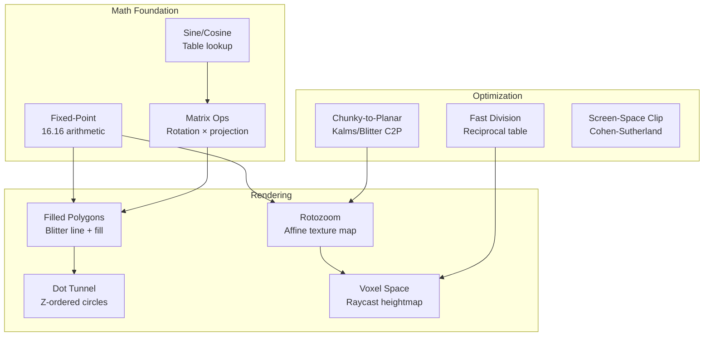
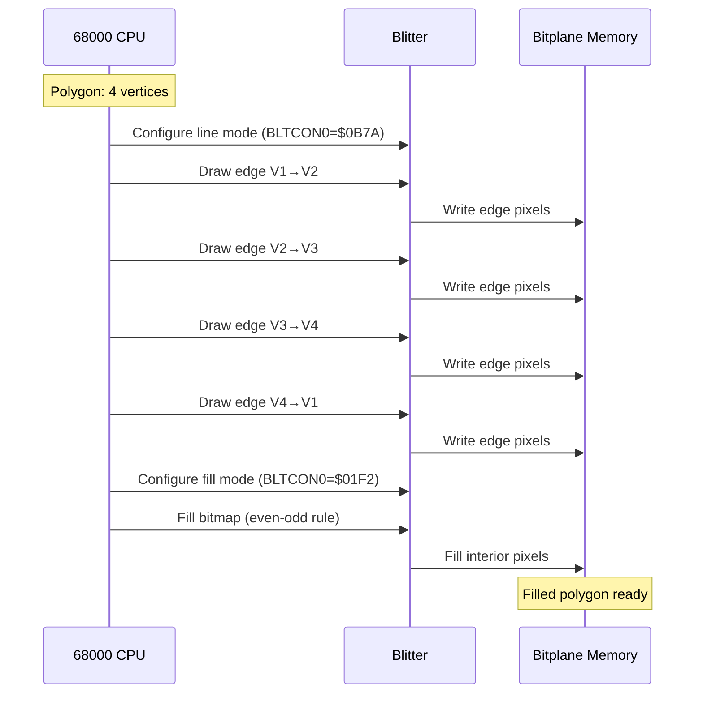
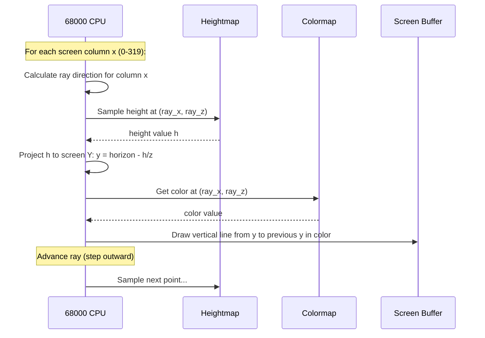
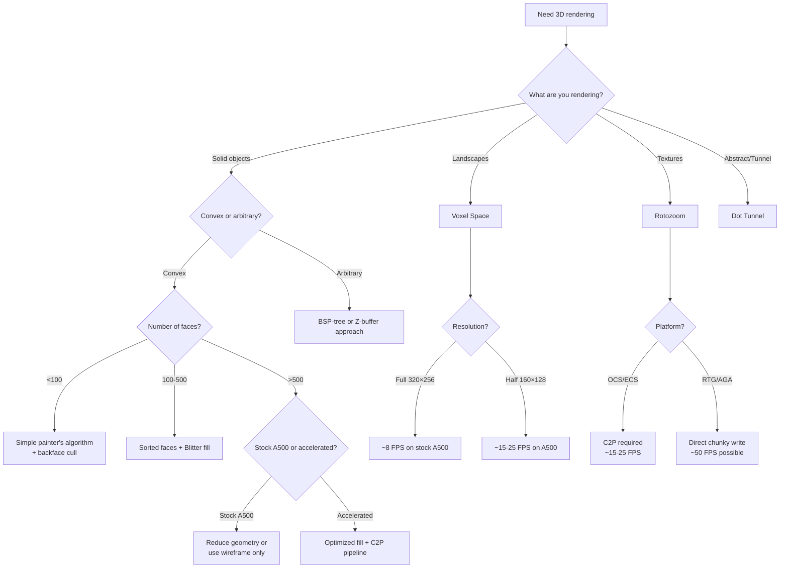
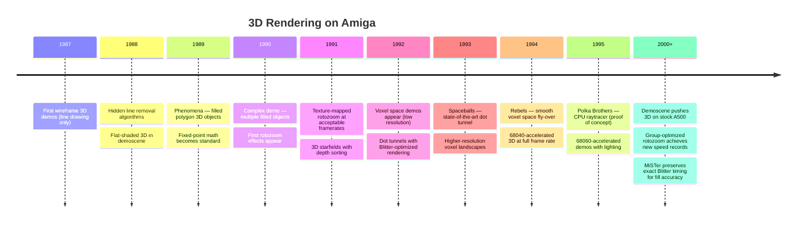

[← Home](../README.md) · [Demoscene Techniques](README.md)

# 3D Rendering — Fixed-Point Math, Blitter Polygons, Rotozoom, Dot Tunnels, and Voxel Space

## Overview

In 1985, the Amiga had no 3D hardware. No matrix engine, no floating-point unit, no texture mapper — just a 7 MHz integer-only 68000, a Blitter that could copy rectangles, and a Copper that could change display registers. Yet by 1990, demoscene coders were rendering real-time filled 3D objects, and by 1994 they were flying through voxel landscapes at playable framerates. The entire 3D pipeline — projection, clipping, rasterization, fill — was built from scratch in hand-tuned 68000 assembly using fixed-point arithmetic.

This article covers the demoscene 3D rendering techniques that made it possible: fixed-point math, Blitter-filled polygons, texture-mapped rotozoom, dot tunnels, and voxel space rendering. Each technique maps to a specific hardware capability — and the demoscene's creative abuse of it.



---

## Foundation: Fixed-Point Arithmetic

The 68000 has no floating-point unit. All 3D math must use integers. The solution is **fixed-point** — encoding fractional values as integers with an implicit decimal point.

### 16.16 Fixed-Point Format

```
┌──────────────────────────────────┬──────────────────────────────────┐
│  Upper 16 bits: integer part     │  Lower 16 bits: fractional part  │
│  (signed, two's complement)      │  (unsigned, represents 0 to ~1)  │
└──────────────────────────────────┴──────────────────────────────────┘

Example: 1.5 = $00018000
         0.25 = $00004000
        -1.0  = $FFFF0000
         π    = $0003243F  (3.14159...)
```

### Fixed-Point Operations

```c
/* fixedpoint.h — 16.16 fixed-point arithmetic for 68000 */

typedef LONG FIXED;   /* 32-bit signed: 16.16 format */

#define INT_TO_FIXED(x)   ((FIXED)((x) << 16))
#define FIXED_TO_INT(x)   ((WORD)((x) >> 16))     /* Truncate */
#define FIXED_TO_INT_R(x) (WORD)(((x) + 0x8000) >> 16)  /* Round */
#define FLOAT_TO_FIXED(f) ((FIXED)((f) * 65536.0))

/* Multiply: result = a × b / 65536
   On 68000, use 32×32→64 MULS.L then shift right 16 */
static inline FIXED fixed_mul(FIXED a, FIXED b) {
    /* 68000 asm:
       move.l  a, d0
       muls.l  b, d0:d1     ; d0:d1 = 64-bit result
       swap    d0            ; d0 = upper 32 bits (already >> 16)
       ; d0 contains the result
    */
    return (FIXED)(((LONG)a * (LONG)b) >> 16);
}

/* Divide: result = a × 65536 / b
   Must multiply first to avoid losing precision */
static inline FIXED fixed_div(FIXED a, FIXED b) {
    /* 68000: be careful with overflow!
       Use reciprocal table for perspective division */
    return (FIXED)(((LONG)a << 16) / (LONG)b);
}
```

### Sine/Cosine Tables

Pre-calculated lookup tables are essential — computing `sin()` at runtime is too slow:

```c
/* trig_tables.c — Pre-calculated 16.16 sine/cosine tables */
/* 1024 entries covering 0-2π, index = angle × 1024 / (2π) */

#define TRIG_TABLE_SIZE 1024
#define ANGLE_2PI      1024    /* Full circle = 1024 units */

/* 16.16 fixed-point: sin values range from -1.0 ($FFFF0000) to 1.0 ($00010000) */
static const FIXED sin_table[TRIG_TABLE_SIZE];  /* Generated at build time */

/* Fast lookup with wrapping */
static inline FIXED fast_sin(int angle) {
    return sin_table[angle & (TRIG_TABLE_SIZE - 1)];
}

static inline FIXED fast_cos(int angle) {
    return sin_table[(angle + 256) & (TRIG_TABLE_SIZE - 1)];  /* cos = sin(x+π/2) */
}
```

---

## Foundation: Matrix Operations

3D rotation uses 3×3 matrices multiplied with vertex coordinates. Each rotation (X, Y, Z axis) is a matrix multiply:

### Rotation Matrix Construction

```c
/* matrix3d.c — 3D rotation matrices using fixed-point */

typedef struct {
    FIXED m[3][3];  /* 3×3 rotation matrix */
} Matrix3D;

/* Build rotation matrix from Euler angles */
void build_rotation_matrix(Matrix3D *mat, int ax, int ay, int az) {
    FIXED sx = fast_sin(ax), cx = fast_cos(ax);
    FIXED sy = fast_sin(ay), cy = fast_cos(ay);
    FIXED sz = fast_sin(az), cz = fast_cos(az);

    /* Combined Z×Y×X rotation (standard demoscene order) */
    mat->m[0][0] = fixed_mul(cy, cz);
    mat->m[0][1] = fixed_mul(fixed_mul(sx, sy), cz) - fixed_mul(cx, sz);
    mat->m[0][2] = fixed_mul(fixed_mul(cx, sy), cz) + fixed_mul(sx, sz);
    mat->m[1][0] = fixed_mul(cy, sz);
    mat->m[1][1] = fixed_mul(fixed_mul(sx, sy), sz) + fixed_mul(cx, cz);
    mat->m[1][2] = fixed_mul(fixed_mul(cx, sy), sz) - fixed_mul(sx, cz);
    mat->m[2][0] = -sy;
    mat->m[2][1] = fixed_mul(sx, cy);
    mat->m[2][2] = fixed_mul(cx, cy);
}

/* Transform a vertex: result = matrix × vertex */
void transform_vertex(const Matrix3D *mat, FIXED vx, FIXED vy, FIXED vz,
                      FIXED *rx, FIXED *ry, FIXED *rz) {
    *rx = fixed_mul(mat->m[0][0], vx) +
          fixed_mul(mat->m[0][1], vy) +
          fixed_mul(mat->m[0][2], vz);
    *ry = fixed_mul(mat->m[1][0], vx) +
          fixed_mul(mat->m[1][1], vy) +
          fixed_mul(mat->m[1][2], vz);
    *rz = fixed_mul(mat->m[2][0], vx) +
          fixed_mul(mat->m[2][1], vy) +
          fixed_mul(mat->m[2][2], vz);
}
```

### Perspective Projection

```c
/* project.c — Perspective projection to screen coordinates */

#define SCREEN_CX  160   /* Center X (320 wide) */
#define SCREEN_CY  128   /* Center Y (256 tall) */
#define FOCAL_LEN  256   /* Focal length in fixed-point */

void project_vertex(FIXED x, FIXED y, FIXED z,
                    WORD *sx, WORD *sy) {
    /* Perspective divide: screen = world × focal / z */
    if (z > INT_TO_FIXED(1)) {  /* Avoid division by zero */
        FIXED scale = fixed_div(INT_TO_FIXED(FOCAL_LEN), z);
        *sx = SCREEN_CX + FIXED_TO_INT(fixed_mul(x, scale));
        *sy = SCREEN_CY - FIXED_TO_INT(fixed_mul(y, scale));  /* Y flipped */
    } else {
        *sx = SCREEN_CX;  /* Behind camera */
        *sy = SCREEN_CY;
    }
}
```

---

## Technique 1: Blitter-Filled Polygons

The Blitter's **line-draw + fill mode** combination is the foundation of Amiga 3D rendering. The process:

1. Draw polygon edges using Blitter line mode (sets pixels at boundaries)
2. Activate Blitter fill mode (fills between set pixels, even→odd fill rule)
3. Result: a filled polygon with zero CPU pixel writing



### Blitter Fill Mode Detail

The Blitter fill uses the **inclusive-odd** fill rule: scanning left to right, it inverts pixels each time it encounters a set bit. This means it fills between pairs of edge pixels:

```asm
; blit_fill.asm — Blitter fill for a single bitplane
; Assumes edges already drawn in the bitmap

        ; Fill from top to bottom of polygon
        lea     $DFF000,a0             ; Custom registers base

        ; Set up fill-mode blit
        move.w  #$01F2,BLTCON0(a0)     ; Fill mode: A→D, fill enabled
        move.w  #$0000,BLTCON1(a0)     ; No line mode, ascending
        move.w  #$FFFF,BLTAFWM(a0)     ; First word mask = all bits
        move.w  #$FFFF,BLTALWM(a0)     ; Last word mask = all bits

        ; Source A = the bitmap data (edge pixels)
        move.l  bitmap_start,BLTAPTH(a0) ; Source address

        ; Destination = same bitmap (fill in-place)
        move.l  bitmap_start,BLTDPTH(a0) ; Dest = source

        ; Blit size: height × width
        ; height = number of scanlines, width = words per line
        move.w  #(HEIGHT<<6)|(WORDS_PER_LINE),BLTSIZE(a0)
        ; Blitter starts immediately
```

### Multiple-Face Sorting (Painter's Algorithm)

For solid 3D objects, faces must be drawn back-to-front (painter's algorithm):

```c
/* face_sort.c — Sort polygon faces by depth for painter's algorithm */

typedef struct {
    WORD   num_vertices;
    WORD   *vertices;    /* Index into vertex array */
    FIXED  avg_z;        /* Average Z depth (for sorting) */
    UWORD  color;        /* Face color */
} Face;

int compare_faces(const void *a, const void *b) {
    FIXED za = ((const Face *)a)->avg_z;
    FIXED zb = ((const Face *)b)->avg_z;
    /* Sort far-to-near (painter's algorithm) */
    if (za > zb) return -1;  /* a is farther, draw first */
    if (za < zb) return  1;
    return 0;
}

void render_object(Face *faces, int num_faces,
                   FIXED *transformed_z) {
    int i;

    /* Calculate average Z for each face */
    for (i = 0; i < num_faces; i++) {
        FIXED sum = 0;
        int j;
        for (j = 0; j < faces[i].num_vertices; j++) {
            sum += transformed_z[faces[i].vertices[j]];
        }
        faces[i].avg_z = sum / faces[i].num_vertices;
    }

    /* Sort back-to-front */
    qsort(faces, num_faces, sizeof(Face), compare_faces);

    /* Draw each face */
    for (i = 0; i < num_faces; i++) {
        draw_filled_polygon(&faces[i]);
    }
}
```

---

## Technique 2: Rotozoom (Affine Texture Mapping)

Rotozoom renders a texture-mapped rectangle that can rotate and scale in real-time. The name comes from **rotate + zoom**. It works by computing a texture coordinate (U,V) for each screen pixel using an affine transform.

### Algorithm

For each screen pixel (x, y), compute texture coordinates:

```
U = U_start + x × dU_dx + y × dU_dy
V = V_start + x × dV_dx + y × dV_dy
```

Where `dU_dx`, `dV_dx`, `dU_dy`, `dV_dy` are the rotation+scale matrix coefficients.

```c
/* rotozoom.c — Affine texture mapping (rotzoom) */

#define SCREEN_W 320
#define SCREEN_H 256
#define TEX_SIZE 256  /* Texture is 256×256 */

extern UBYTE texture[TEX_SIZE][TEX_SIZE];  /* Chunky texture */
extern UBYTE *chunky_buffer;               /* Output chunky buffer */

void render_rotozoom(FIXED cx, FIXED cy,    /* Texture center offset */
                     FIXED angle, FIXED zoom) {
    FIXED cos_a = fast_cos(angle);
    FIXED sin_a = fast_sin(angle);
    FIXED inv_zoom = fixed_div(INT_TO_FIXED(1), zoom);

    /* Rotation × inverse zoom matrix coefficients */
    FIXED du_dx = fixed_mul(cos_a, inv_zoom);
    FIXED dv_dx = fixed_mul(sin_a, inv_zoom);
    FIXED du_dy = fixed_mul(-sin_a, inv_zoom);
    FIXED dv_dy = fixed_mul(cos_a, inv_zoom);

    /* Start position: center of screen maps to texture center */
    FIXED u_start = cx - fixed_mul(INT_TO_FIXED(SCREEN_W/2), du_dx)
                          - fixed_mul(INT_TO_FIXED(SCREEN_H/2), du_dy);
    FIXED v_start = cy - fixed_mul(INT_TO_FIXED(SCREEN_W/2), dv_dx)
                          - fixed_mul(INT_TO_FIXED(SCREEN_H/2), dv_dy);

    UBYTE *dst = chunky_buffer;
    int y;

    for (y = 0; y < SCREEN_H; y++) {
        FIXED u = u_start;
        FIXED v = v_start;
        int x;

        for (x = 0; x < SCREEN_W; x++) {
            /* Texture lookup with wrapping */
            *dst++ = texture[FIXED_TO_INT(u) & 0xFF]
                            [FIXED_TO_INT(v) & 0xFF];

            u += du_dx;
            v += dv_dx;
        }

        u_start += du_dy;
        v_start += dv_dy;
    }

    /* Convert chunky buffer to planar bitplanes (C2P) */
    chunky_to_planar(chunky_buffer, bitplane_data, SCREEN_W, SCREEN_H);
}
```

### Rotozoom in Assembly (Inner Loop)

The 68000 assembly inner loop is highly optimized. The key insight: texture coordinates wrap at power-of-2 boundaries, so masking with `$FF` (256-wide texture) is free using byte-level addressing:

```asm
; rotozoom_inner.asm — Optimized inner loop
; a0 = destination (chunky buffer)
; a1 = texture base (256×256)
; d0 = U (16.16 fixed)
; d1 = V (16.16 fixed)
; d2 = dU/dx (16.16 fixed)
; d3 = dV/dx (16.16 fixed)
; d4 = loop counter (SCREEN_W)

.roto_inner:
        move.l  d0,d5           ; Copy U
        swap    d5              ; d5.w = integer part of U
        move.l  d1,d6           ; Copy V
        swap    d6              ; d6.w = integer part of V

        ; Texture lookup: tex[v & 0xFF][u & 0xFF]
        and.w   #$FF,d5         ; U mask (free wrap)
        and.w   #$FF,d6         ; V mask (free wrap)
        lsl.w   #8,d6           ; V × 256 (row offset)
        move.b  (a1,d5.w),d7    ; Texel = tex[v*256+u]
        move.b  d7,(a0)+        ; Write to chunky buffer

        add.l   d2,d0           ; U += dU/dx
        add.l   d3,d1           ; V += dV/dx
        dbra    d4,.roto_inner
```

---

## Technique 3: Dot Tunnel

The dot tunnel renders concentric rings that appear to fly toward the viewer, creating the illusion of traveling through a tunnel. Each ring is a circle rendered at a specific Z-depth.

### Algorithm

```c
/* dot_tunnel.c — Z-ordered ring tunnel effect */

#define NUM_RINGS   30
#define MAX_Z       1024
#define RING_POINTS 32

typedef struct {
    FIXED z;         /* Depth (0=near, far=background) */
    FIXED radius;    /* Apparent radius (decreases with z) */
    WORD  cx, cy;    /* Center (can be animated) */
    UWORD color;     /* Ring color */
} Ring;

void render_dot_tunnel(Ring *rings, int num_rings, ULONG frame) {
    int i;

    /* Update ring positions (move toward viewer) */
    for (i = 0; i < num_rings; i++) {
        rings[i].z -= INT_TO_FIXED(4);  /* Speed toward viewer */

        /* If ring passed camera, reset to far end */
        if (rings[i].z < INT_TO_FIXED(1)) {
            rings[i].z = INT_TO_FIXED(MAX_Z);
        }

        /* Perspective projection of radius */
        rings[i].radius = fixed_div(
            INT_TO_FIXED(200),     /* Base radius */
            rings[i].z             /* Divide by depth */
        );
    }

    /* Sort rings far-to-near (painter's algorithm) */
    /* ... sort by rings[i].z descending ... */

    /* Draw each ring */
    for (i = 0; i < num_rings; i++) {
        int p;
        int radius = FIXED_TO_INT(rings[i].radius);
        int cx = rings[i].cx + FIXED_TO_INT(
            fixed_mul(fast_sin(frame * 3), INT_TO_FIXED(30)));
        int cy = rings[i].cy + FIXED_TO_INT(
            fixed_mul(fast_cos(frame * 5), INT_TO_FIXED(20)));

        for (p = 0; p < RING_POINTS; p++) {
            int angle = p * 360 / RING_POINTS;
            FIXED sa = fast_sin(angle * TRIG_TABLE_SIZE / 360);
            FIXED ca = fast_cos(angle * TRIG_TABLE_SIZE / 360);

            WORD px = cx + FIXED_TO_INT(fixed_mul(INT_TO_FIXED(radius), sa));
            WORD py = cy + FIXED_TO_INT(fixed_mul(INT_TO_FIXED(radius), ca));

            /* Plot pixel or draw Blitter circle at (px, py) */
            plot_dot(px, py, rings[i].color);
        }
    }
}
```

---

## Technique 4: Voxel Space

Voxel space renders a 3D landscape from a 2D heightmap and colormap. The algorithm casts rays from the viewer, one per screen column, and draws vertical strips of pixels. The result is a fly-over landscape effect, as seen in the 1994 demo "Space Rangers" by Rebels.

### Algorithm (Column-Based Raycasting)



### Voxel Space Implementation

```c
/* voxelspace.c — Column-based voxel landscape rendering */

#define SCREEN_W    320
#define SCREEN_H    256
#define MAP_SIZE    256
#define HORIZON     100   /* Horizon line Y position */
#define MAX_DEPTH   200   /* Maximum ray distance */

extern UBYTE heightmap[MAP_SIZE][MAP_SIZE];
extern UBYTE colormap[MAP_SIZE][MAP_SIZE];
extern UBYTE *chunky_buffer;

void render_voxel_space(FIXED cam_x, FIXED cam_z,
                        FIXED cam_angle, FIXED cam_height) {
    int x;

    for (x = 0; x < SCREEN_W; x++) {
        /* Ray angle: camera angle + column offset */
        FIXED column_offset = INT_TO_FIXED(x - SCREEN_W/2);
        FIXED ray_angle = cam_angle + fixed_div(column_offset,
                                                 INT_TO_FIXED(FOCAL_LEN));

        FIXED ray_dx = fast_cos(ray_angle);  /* Direction X */
        FIXED ray_dz = fast_sin(ray_angle);  /* Direction Z */

        FIXED ray_x = cam_x;
        FIXED ray_z = cam_z;

        WORD prev_draw_y = SCREEN_H;  /* Bottom of column */
        int distance;

        for (distance = 1; distance < MAX_DEPTH; distance++) {
            FIXED dz = fixed_div(INT_TO_FIXED(distance), ray_dz);
            FIXED dx = fixed_div(INT_TO_FIXED(distance), ray_dx);

            /* Current map position */
            int mx = (FIXED_TO_INT(cam_x + dx)) & (MAP_SIZE - 1);
            int mz = (FIXED_TO_INT(cam_z + dz)) & (MAP_SIZE - 1);

            /* Height at this point */
            FIXED terrain_h = INT_TO_FIXED(heightmap[mz][mx]);

            /* Project to screen Y */
            FIXED height_diff = terrain_h - cam_height;
            WORD draw_y = HORIZON -
                FIXED_TO_INT(fixed_div(height_diff,
                    INT_TO_FIXED(distance)));

            /* Only draw if above previously drawn pixel */
            if (draw_y < prev_draw_y) {
                UBYTE color = colormap[mz][mx];
                int y;

                for (y = draw_y; y < prev_draw_y; y++) {
                    chunky_buffer[y * SCREEN_W + x] = color;
                }
                prev_draw_y = draw_y;
            }

            /* Step ray outward */
            ray_x += ray_dx;
            ray_z += ray_dz;
        }
    }

    /* C2P conversion for planar display */
    chunky_to_planar(chunky_buffer, bitplane_data, SCREEN_W, SCREEN_H);
}
```

### Voxel Space Optimization

The naive algorithm is too slow for 50 FPS on a 68000. Key optimizations:

| Optimization | Speedup | How |
|-------------|---------|-----|
| **Reciprocal table** | 2× | Pre-compute 1/z values, avoid division |
| **Step doubling** | 3-4× | Double step size beyond certain depth (less detail needed) |
| **Height caching** | 1.5× | Cache last N height lookups |
| **Reduced resolution** | 2-4× | Render at 160×128 and scale up (acceptable for landscape) |
| **Fast C2P** | 30× | Use Kalms C2P instead of naive conversion |

---

## Performance Budget

### 3D Rendering Costs on Stock A500 (7 MHz 68000)

| Operation | Cycles (approx.) | Notes |
|-----------|------------------|-------|
| Fixed-point multiply | ~28 | `MULS.W` (16×16→32) |
| Fixed-point divide | ~140 | `DIVS.W` — very expensive! |
| Sine table lookup | ~12 | Table indexed by angle |
| Vertex transform | ~300 | 3 multiplies + 3 adds per axis |
| Perspective divide | ~160 | 2 divides per vertex |
| Blitter line draw | ~200/edge | DMA time for edge |
| Blitter fill | ~2000/polygon | Depends on polygon size |
| Full C2P (Kalms) | ~35ms | 320×256 × 8bpp |
| Voxel column | ~500/col | Heightmap lookup + draw |

### Frame Budget (PAL: 20ms per frame)

| Effect | Vertices | Time | FPS |
|--------|----------|------|-----|
| Single flat-shaded cube | 8 | ~3ms | 50 |
| 100-face object | 30+ | ~12ms | 30-50 |
| Rotozoom 320×256 | 0 (per pixel) | ~40ms (with C2P) | 15-25 |
| Dot tunnel 30 rings | 960 dots | ~8ms | 50 |
| Voxel space 320×256 | 64K cols | ~80ms | 6-12 |

---

## Antipatterns

### 1. The Floating-Point Temptation

Using floating-point math on the 68000. The 68881 FPU is optional — most Amigas don't have one. Software floating-point emulation is **100× slower** than fixed-point.

**Broken:**
```c
/* Don't do this — requires FPU or slow software emulation */
float x = sin(angle) * distance;
float y = cos(angle) * distance;
```

**Fixed:**
```c
/* Use fixed-point with pre-calculated tables */
FIXED x = fixed_mul(fast_sin(angle), distance);
FIXED y = fixed_mul(fast_cos(angle), distance);
```

### 2. The Per-Pixel Divide

Calling `fixed_div()` for every pixel in a rotozoom or voxel renderer. Division is the most expensive operation on the 68000 (~140 cycles for 16-bit, ~280 for 32-bit).

**Broken:**
```c
for (x = 0; x < 320; x++) {
    for (y = 0; y < 256; y++) {
        FIXED u = fixed_div(x, z);  /* DIVIDE PER PIXEL! */
        FIXED v = fixed_div(y, z);
    }
}
```

**Fixed:**
```c
/* Pre-compute step values (multiply instead of divide) */
FIXED du_dx = fixed_mul(scale, inv_z);  /* One divide per frame */
FIXED dv_dy = fixed_mul(scale, inv_z);

for (y = 0; y < 256; y++) {
    FIXED u = u_start;
    for (x = 0; x < 320; x++) {
        u += du_dx;  /* ADD, not multiply/divide */
    }
    u_start += du_dy;
}
```

### 3. The Backface Cull Miss

Skipping backface culling for convex objects. Every polygon drawn behind other polygons is wasted Blitter time. A simple dot-product test rejects ~50% of faces.

**Broken:**
```c
/* Draw all faces — 50% are facing away! */
for (i = 0; i < num_faces; i++) {
    draw_filled_polygon(&faces[i]);  /* Wastes time on hidden faces */
}
```

**Fixed:**
```c
for (i = 0; i < num_faces; i++) {
    /* Backface cull: if face normal points away, skip it */
    FIXED nx = compute_normal_x(&faces[i]);
    FIXED nz = compute_normal_z(&faces[i]);
    if (nz < 0) continue;  /* Facing away from camera */

    draw_filled_polygon(&faces[i]);
}
```

### 4. The Unsorted Z-Fight

Drawing faces in random order without depth sorting. Overlapping polygons flicker as they overwrite each other unpredictably each frame.

**Broken:**
```c
/* Draw faces in arbitrary order → z-fighting */
for (i = 0; i < num_faces; i++) {
    draw_filled_polygon(&faces[i]);
}
```

**Fixed:**
```c
/* Sort by average Z depth (painter's algorithm) */
qsort(faces, num_faces, sizeof(Face), compare_faces_back_to_front);
for (i = 0; i < num_faces; i++) {
    draw_filled_polygon(&faces[i]);
}
```

### 5. The Naive C2P

Using a naive chunky-to-planar conversion for rotozoom/voxel output. The naive method processes each pixel individually with bit shifts, taking over 1 second per frame on a stock 68000.

**Broken:**
```c
/* Naive C2P: ~70,000 pixels/sec — 0.9 FPS for 320×256 */
for (i = 0; i < 320*256; i++) {
    int pixel = chunky[i];
    for (bit = 0; bit < 8; bit++) {
        planes[bit][i/8] |= ((pixel >> bit) & 1) << (7 - (i & 7));
    }
}
```

**Fixed:**
```c
/* Use Kalms C2P or Blitter-assisted C2P: ~30× faster */
kalms_c2p(chunky_buffer, planar_data, 320, 256);
/* See pixel_conversion.md for full implementation */
```

---

## Decision Guide



---

## Historical Timeline



---

## Modern Analogies

| Amiga 3D Concept | Modern Equivalent | Why It Maps |
|-----------------|-------------------|-------------|
| Fixed-point 16.16 | Half-precision float (FP16) | Both trade precision for speed |
| Sine lookup table | GPU SFU (Special Function Unit) | Both use hardware-assisted transcendental |
| Blitter fill mode | GPU rasterizer | Both fill polygon interiors |
| Painter's algorithm | Z-buffer / depth test | Both solve polygon visibility |
| Backface culling | GPU backface culling | Both skip invisible faces |
| Rotozoom | Affine texture sampling | Both use 2×2 matrix transform per pixel |
| Voxel space raycasting | Heightfield terrain shader | Both cast rays through a heightmap |
| C2P conversion | Texture swizzle/deswizzle | Both convert between memory layouts |
| Reciprocal table | GPU reciprocal approximation | Both avoid expensive division |
| Chunky buffer | Render-to-texture (FBO) | Both render to off-screen buffer |

---

## Use Cases

| Use Case | Technique | Notable Examples |
|----------|-----------|-----------------|
| 3D game objects | Filled polygons | Flight simulators, Elite clones |
| Rotating logo | Rotozoom | Every demo with a bitmap logo |
| Tunnel fly-through | Dot tunnel | Spaceballs, numerous demos |
| Landscape fly-over | Voxel space | Rebels, numerous demos |
| 3D chess/board games | Filled polygons + sorting | Various Amiga games |
| Virtual reality scenes | Combined techniques | Various demo compos |
| Star field | Z-ordered point rendering | Standard demo effect |
| Wavy floor/ceiling | Rotozoom variant | Doom-like perspective tricks |

---

## FPGA / Emulation Impact

| Concern | Impact | Notes |
|---------|--------|-------|
| **Blitter fill timing** | Fill must use exact inclusive-odd rule | Emulators must match Blitter fill behavior precisely |
| **Line-draw accuracy** | Blitter Bresenham must match real hardware | Affects polygon edge positions |
| **C2P pipeline** | Chunky→Planar timing affects frame rate | Must be accounted for in demo timing |
| **Fixed-point overflow** | 68000 MULS.L/DIVS.L edge cases | 32-bit overflow behavior must match hardware |
| **Blitter-CPU interleaving** | BLTPRI affects CPU stall duration | Must match real Blitter busy-wait timing |

---

## FAQ

**Q: Why not use the FPU for 3D math?**
A: The 68881/68882 FPU is optional hardware that most Amiga models don't have. Software FPU emulation is 50-100× slower than fixed-point integer math. Only 68030/040/060 accelerated Amigas typically have an FPU, and even then, fixed-point is faster for many operations because the 68000's integer multiply is well-optimized.

**Q: What is the fastest C2P for rotozoom?**
A: The Kalms C2P is the standard. For AGA machines with 32-bit Blitter access, a Blitter-assisted C2P can be even faster. For RTG cards, C2P is unnecessary — write directly to chunky VRAM. See [Pixel Conversion](../08_graphics/pixel_conversion.md) for benchmarks.

**Q: How do I handle polygon clipping?**
A: For simple 3D objects, screen-space clipping (Cohen-Sutherland or Sutherland-Hodgman) is sufficient. Clip against the four screen edges. For objects that can go behind the camera, you need near-plane clipping in 3D space — this is much more complex and most demos avoid it by keeping objects in front of the camera.

**Q: Can I do texture-mapped polygons (not just rotozoom)?**
A: Yes, but affine texture mapping (per-polygon UV) produces visible distortion on large polygons. Correct perspective texture mapping requires per-pixel division, which is too slow on a 68000. Most demos use subdivision (split large polygons into smaller ones) or simply use rotozoom for the entire screen.

**Q: What is a dot matrix / voxel display?**
A: A voxel (volume pixel) display renders 3D data as a grid of points. On the Amiga, this typically means rendering heightmap terrain as vertical columns (voxel space) or rendering 3D point clouds. The Blitter's line-draw mode can efficiently render individual dots.

---

## References

### Related Knowledge Base Articles

- [Pixel Conversion](../08_graphics/pixel_conversion.md) — C2P algorithms (Kalms, Blitter, Akiko)
- [Blitter Programming](../08_graphics/blitter/blitter_programming.md) — Fill mode, line draw, minterms
- [Blitter](../08_graphics/blitter/blitter.md) — Blitter hardware architecture
- [Bitmap](../08_graphics/bitmap.md) — Bitplane memory layout, interleaving
- [Copper Effects](copper_effects.md) — Copper-driven display effects
- [Timing Optimization](timing_optimization.md) — Cycle counting, Blitter-CPU interleaving
- [FPU Architecture](../15_fpu_mmu_cache/fpu_architecture.md) — 68881/68882 floating-point

### External Resources

- **Amiga Hardware Reference Manual** — Blitter fill mode, line-draw mode
- **Scoopex Amiga Hardware Programming** (Photon) — [YouTube playlist](https://www.youtube.com/playlist?list=PLc3ltHgmiidpK-s0eP5hTKJnjdTHz0_bW) — Blitter fill mode and line-draw video walkthroughs; companion articles at [coppershade.org](http://coppershade.org/)
- **Pouet.net** — https://www.pouet.net — 3D demo releases with source code
- **Demozoo** — https://demozoo.org — Demoscene production encyclopedia
- **Amiga Graphics Archive** — https://amiga.lychesis.net — Copper-enhanced 3D rendering analysis in commercial games
- **Kalms C2P** — Standard chunky-to-planar implementation
- **Comanche Voxel Engine** — Original voxel space algorithm reference (NovaLogic)
