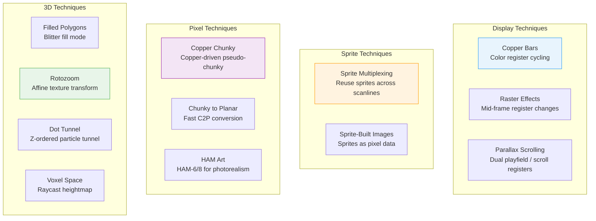
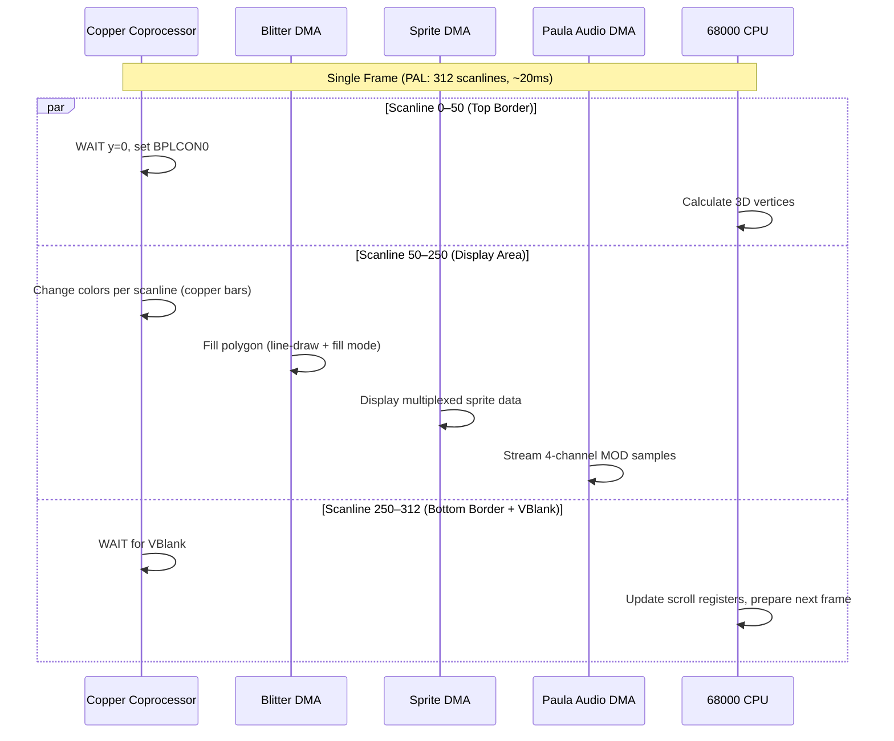

[← Home](../README.md)

# Demoscene Techniques — Pushing the Hardware Beyond Its Limits

## Overview

The Amiga demoscene is a subculture of programmers, artists, and musicians who create real-time audiovisual presentations ("demos") that push the hardware far beyond what Commodore's engineers imagined possible. From 1986 to the present day, Amiga demos have showcased techniques that later became standard in game development and graphics programming: copper bars, raster effects, sprite multiplexing, chunky pixels, rotozoom, dot tunnels, and more.

This section documents the **hardware techniques** that demoscene coders invented or perfected on the Amiga — techniques that are essential knowledge for anyone reverse-engineering games, writing emulators, or building FPGA implementations.

> **Learning path:** For a guided, video-based introduction to these techniques, see the **[Scoopex Amiga Hardware Programming](https://www.youtube.com/playlist?list=PLc3ltHgmiidpK-s0eP5hTKJnjdTHz0_bW)** series by Photon (ScoopexUs) on YouTube — a comprehensive walkthrough of Copper, Blitter, sprites, and hardware banging in 68k assembly, with companion articles at [coppershade.org](http://coppershade.org/).

## Section Index

| File | Description |
|------|-------------|
| [copper_effects.md](copper_effects.md) | Copper bars, raster splits, mid-frame register changes, gradient shading, sine-based color cycling |
| [sprite_techniques.md](sprite_techniques.md) | Sprite multiplexing, sprite-built images, 15-color attached sprites, sprite-BLT interaction |
| [pixel_tricks.md](pixel_tricks.md) | Copper chunky, HAM art, scroll-register tricks, modulo-based wrapping, bobs-vs-sprites |
| [3d_rendering.md](3d_rendering.md) | Fixed-point 3D math, Blitter-filled polygons, rotozoom, dot tunnels, voxel space, matrix operations |
| [timing_optimization.md](timing_optimization.md) | Cycle counting, blitter-CPU interleaving, copper-wait placement, memory access patterns, self-modifying code |

---

## The Demoscene & Hardware — Symbiosis

The key insight of demoscene coding: **the Copper, Blitter, Sprites, and Audio all run via DMA alongside the CPU**. A single frame has the Copper changing display parameters, the Blitter filling polygons, sprites being displayed, audio streaming — all while the CPU computes the next frame's geometry. This parallelism is what made the Amiga unique and what demoscene coders exploited to the absolute limit.

### DMA Budget Per Scanline

| Resource | DMA Slots per Scanline (LoRes) | Used For |
|----------|-------------------------------|----------|
| Bitplanes (4 planes) | 8 of 226 | Display pixel data |
| Sprites (8 sprites) | 4 of 226 | Sprite data fetch |
| Copper | ~1–2 of 226 | Copper instruction execution |
| Blitter | 0–226 of 226 (shared) | Copy/fill/line operations |
| Audio (4 channels) | 1 of 226 | Sample data fetch |
| CPU | Remaining slots | Computation |

> [!NOTE]
> The Blitter and CPU share the same bus cycles. When the Blitter is running, the CPU gets fewer cycles. The `BLTPRI` bit gives the Blitter priority over the CPU entirely — "Blitter Nasty" mode. Demoscene coders use this to time operations precisely.

---

## Famous Demo Effects & Hardware Techniques

| Effect | Hardware Used | First Seen | How It Works |
|--------|-------------|------------|-------------|
| **Copper Bars** | Copper (color registers) | 1987 ([Scoopex](https://www.pouet.net/prod.php?which=5832)) | Copper writes `COLORxx` registers at different Y positions, creating horizontal color bands |
| **Raster Bars** | Copper (BPLCON0) | 1988 ([Red Sector](https://www.pouet.net/prod.php?which=3119)) | Same as copper bars, but also changes bitplane depth/resolution mid-frame for split-screen |
| **Scrolling Sinus** | Copper (scroll registers) | 1988 ([Red Sector](https://www.pouet.net/prod.php?which=3119)) | Per-scanline `BPLxMOD` changes create a sinusoidal wave distortion |
| **Copper Master** | Copper (all registers) | 1990 ([Angels](https://www.pouet.net/prod.php?which=3422)) | Ultimate copper showcase: bars, gradients, chunky, sine effects |
| **Sprite Multiplexing** | Sprites + Copper | 1989 ([Kefrens](https://demozoo.org/groups/658/)) | Copper repositions sprites at different Y positions to display > 8 sprites on screen |
| **Parallax Scrolling** | Dual playfield + scroll regs | 1989 | Two independent bitplane layers scroll at different rates |
| **Copper Chunky** | Copper (color registers only) | 1990 ([Sanity Arte](https://www.pouet.net/prod.php?which=1477)) | No bitplanes at all — Copper writes `COLOR01` per pixel position to create a chunky-pixel display |
| **Filled Vectors** | Blitter (line + fill) | 1991 ([Phenomena Enigma](https://www.pouet.net/prod.php?which=394)) | Blitter draws polygon edges, then fill mode paints the interior |
| **Rotozoom** | CPU math + Blitter copy | 1991 (Complex) | Affine texture transform rendered line-by-line, Blitter copies to bitplanes |
| **Dot Tunnel** | CPU + Blitter | 1993 ([Spaceballs](https://www.pouet.net/prod.php?which=56651)) | Z-ordered circles rendered with Blitter circles, creating a fly-through tunnel |
| **Voxel Space** | CPU + blitter | 1994 (Rebels) | Raycast heightmap with 1-pixel-per-column rendering |
| **Raytracing** | CPU only | 1995 ([Polka Brothers](https://www.pouet.net/prod.php?which=702)) | Pure CPU raytracer at 0.5 FPS — proof of concept |

---

## References

### Related Knowledge Base Articles

- [Copper](../08_graphics/copper.md) — Copper coprocessor hardware: instruction format, UCopList
- [Copper Programming](../08_graphics/copper_programming.md) — Building copper lists, gradients, raster effects
- [Blitter](../08_graphics/blitter.md) — Blitter DMA engine: channels, minterms
- [Blitter Programming](../08_graphics/blitter_programming.md) — Cookie-cut masking, line draw, fill mode
- [Sprites](../08_graphics/sprites.md) — Hardware sprites: DMA, attached sprites, multiplexing
- [Pixel Conversion](../08_graphics/pixel_conversion.md) — Chunky↔Planar: Kalms, Copper Chunky, Akiko
- [Video Timing](../01_hardware/common/video_timing.md) — Scanline anatomy, beam counters, per-frame budgets
- [DMA Architecture](../01_hardware/common/dma_architecture.md) — DMA slot allocation, bus arbitration

### External Resources

- **Pouet.net**: https://www.pouet.net — Demo release database
- **Demozoo**: https://demozoo.org — Demoscene encyclopedia
- **Amiga Demoscene Archive**: https://amigademoscene.com
- **Amiga Graphics Archive**: https://amiga.lychesis.net — Forensic analysis of copper lists, palette tricks, and sprite usage in commercial games
- **Scoopex Amiga Hardware Programming** (Photon): [YouTube playlist](https://www.youtube.com/playlist?list=PLc3ltHgmiidpK-s0eP5hTKJnjdTHz0_bW) — Comprehensive video tutorial series covering Copper, Blitter, sprites, and hardware banging in 68k assembly. Companion site: [coppershade.org](http://coppershade.org/)
- **Copper Demon** (technik): Copper bar tutorial with source code
