[← Home](../README.md) · [Demoscene Techniques](README.md)

# Copper Effects — Bars, Raster Splits, Gradients, and Sine Cycling

## Overview

The Copper is the single most important tool in the demoscene coder's arsenal. With only three instructions — `WAIT`, `MOVE`, and `SKIP` — it can repaint the entire screen 50 times per second, changing color registers, bitplane pointers, scroll offsets, and sprite positions at exact scanline boundaries. Every iconic Amiga demo effect, from the rainbow copper bars in [Red Sector's **Megademo**](https://www.pouet.net/prod.php?which=3119) (1989) to the sinus-scrolling message waves in [**Desert Dream**](https://www.pouet.net/prod.php?which=1483) (1993, [Demozoo](https://demozoo.org/productions/142/)), traces back to someone figuring out how to make the Copper do something Commodore's engineers never intended.

This article covers the specific techniques demoscene coders developed for the Copper: classic copper bars, raster splits for multi-resolution screens, gradient shading, sine-based color cycling, and advanced tricks like copper-generated chunky pixels and mid-frame copper list swaps. For the Copper's hardware architecture and basic programming model, see [Copper](../08_graphics/copper/copper.md) and [Copper Programming](../08_graphics/copper/copper_programming.md).

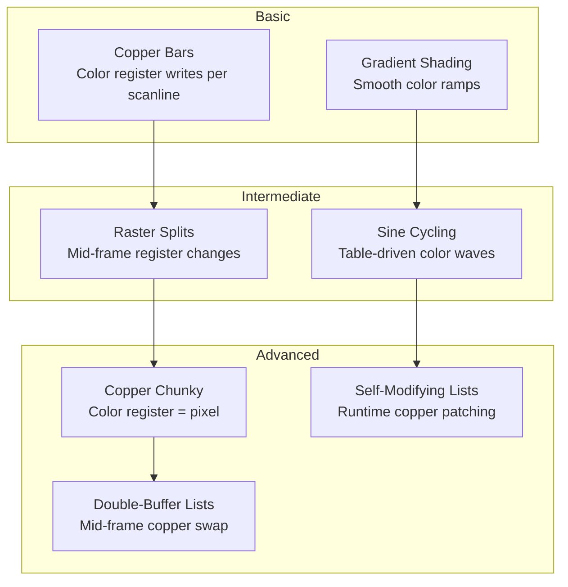

## Demo Screenshots

The following screenshots from [Pouet.net](https://www.pouet.net) show copper effects in landmark demoscene productions. Each captures a single frame of effects that are typically animated at 50 Hz.

| Screenshot | Demo | Year | Copper Technique |
|:---:|:---:|:---:|:---|
| 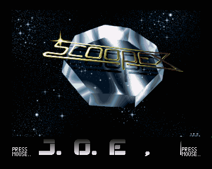 | [Scoopex Megademo](https://www.pouet.net/prod.php?which=5832) | 1987 | First copper bars |
| 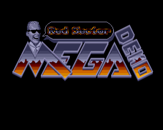 | [Red Sector Megademo](https://www.pouet.net/prod.php?which=3119) | 1989 | Sine-scrolling text, raster splits |
| 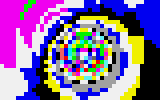 | [Budbrain Megademo](https://www.pouet.net/prod.php?which=1290) | 1990 | Copper bars + vectorbobs |
| 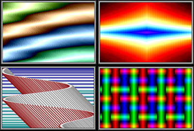 | [Copper Master](https://www.pouet.net/prod.php?which=3422) | 1990 | Ultimate copper showcase |
| 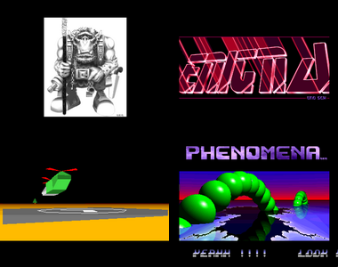 | [Enigma](https://www.pouet.net/prod.php?which=394) | 1991 | Copper + filled vectors |
| 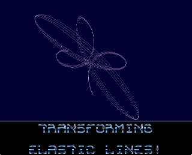 | [Xpose](https://www.pouet.net/prod.php?which=4031) | 1992 | Copper bars extravaganza |
| 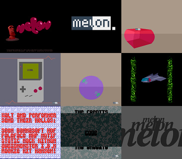 | [Human Target](https://www.pouet.net/prod.php?which=3459) | 1992 | Smooth copper gradients |
|  | [Arte](https://www.pouet.net/prod.php?which=1477) | 1993 | Copper chunky (COLOR01 per pixel) |
| 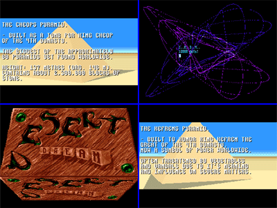 | [Desert Dream](https://www.pouet.net/prod.php?which=1483) | 1993 | Copper parallax + sine scroll |
| 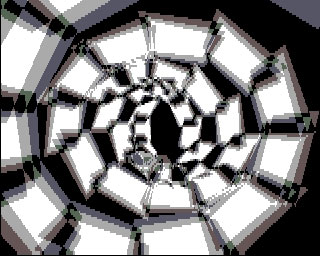 | [Friday at Eight](https://www.pouet.net/prod.php?which=702) | 1995 | Combined copper/Blitter |

---

## Hardware Foundation

### What the Copper Can Write To

The Copper writes to the custom chip register space (`$DFF000–$DFF1FF`). For demo effects, the most important targets are:

| Register | Address | Effect | Used For |
|----------|---------|--------|----------|
| `COLOR00` | `$DFF180` | Background color | Copper bars, gradients |
| `COLOR01`–`COLOR31` | `$DFF182–$DFF1BE` | Palette colors | Gradient fills, chunky pixels |
| `BPLCON0` | `$DFF100` | Bitplane depth/resolution | Raster splits, resolution mixing |
| `BPLCON1` | `$DFF102` | Horizontal scroll offset | Wave distortion, parallax |
| `BPL1MOD`/`BPL2MOD` | `$DFF108`/`$DFF10A` | Bitplane modulo | Sine-wave distortion |
| `BPL1PTH`–`BPL6PTH` | `$DFF0E0–$DFF0EC` | Bitplane pointers | Screen splitting, page flipping |
| `SPRxPTH/L` | `$DFF120–$DFF13E` | Sprite pointers/position | Sprite multiplexing |
| `DIWSTRT`/`DIWSTOP` | `$DFF08E`/`$DFF090` | Display window | Overscan, split display |
| `DDFSTRT`/`DDFSTOP` | `$DFF092`/`$DFF094` | Data fetch window | Resolution changes |

### Copper Instruction Timing

| Instruction | Words | DMA Cycles | Notes |
|-------------|-------|------------|-------|
| `WAIT` | 2 | 2 | Stalls until beam reaches position |
| `MOVE` | 2 | 2 | Writes a value to a register |
| `SKIP` (AGA) | 2 | 2 | Conditional skip of next instruction |
| `WAIT + MOVE` | 4 | 4 | The basic unit of most effects |

> [!IMPORTANT]
> Each `WAIT` + `MOVE` pair costs **4 DMA slots per scanline**. The Copper gets ~226 available slots per LoRes scanline (after bitplane, sprite, and audio DMA). This means roughly **56 color register writes per scanline** maximum — the practical budget for copper effects.

---

## Technique 1: Copper Bars

The classic Amiga demo effect. Copper bars are horizontal bands of color created by writing different values to `COLOR00` (or any color register) at each scanline. The result is a series of colored stripes across the screen.

### How It Works

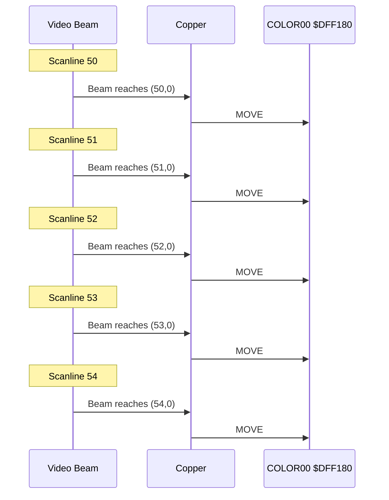

### Complete Copper Bar Example

> 
> 
> *Angels' Copper Master (1990) — the definitive copper bar demonstration, showing dozens of simultaneous color bands.*

```asm
; copper_bars.asm — Classic copper bars (OCS/ECS)
; Assembles with vasm -m68k -Fbin -o copper.bars copper_bars.asm

COPPER_START:
        ; ---- Wait for scanline 30 (top of display) ----
        dc.w    $801E,$FFFE           ; WAIT y=30, x=0 (encoded as 1E, mask FFFE)
        dc.w    $801E,$FFFE           ; WAIT again for strict timing

        ; ---- Bar 1: warm colors (lines 50-58) ----
        dc.w    $8032,$FFFE           ; WAIT line 50
        dc.w    $0180,$0200           ; MOVE #$0200 → COLOR00 (dark red)
        dc.w    $8033,$FFFE           ; WAIT line 51
        dc.w    $0180,$0444           ; MOVE #$0444 → COLOR00 (red)
        dc.w    $8034,$FFFE           ; WAIT line 52
        dc.w    $0180,$0F88           ; MOVE #$0F88 → COLOR00 (orange)
        dc.w    $8035,$FFFE           ; WAIT line 53
        dc.w    $0180,$0FFF           ; MOVE #$0FFF → COLOR00 (bright)
        dc.w    $8036,$FFFE           ; WAIT line 54
        dc.w    $0180,$0F88           ; MOVE #$0F88 → COLOR00 (orange)
        dc.w    $8037,$FFFE           ; WAIT line 55
        dc.w    $0180,$0444           ; MOVE #$0444 → COLOR00 (red)
        dc.w    $8038,$FFFE           ; WAIT line 56
        dc.w    $0180,$0200           ; MOVE #$0200 → COLOR00 (dark red)

        ; ---- Bar 2: cool colors (lines 80-88) ----
        dc.w    $8050,$FFFE           ; WAIT line 80
        dc.w    $0180,$0002           ; MOVE #$0002 → COLOR00 (dark blue)
        dc.w    $8051,$FFFE           ; WAIT line 81
        dc.w    $0180,$0446           ; MOVE #$0446 → COLOR00 (blue)
        dc.w    $8052,$FFFE           ; WAIT line 82
        dc.w    $0180,$088F           ; MOVE #$088F → COLOR00 (cyan)
        dc.w    $8053,$FFFE           ; WAIT line 83
        dc.w    $0180,$0FFF           ; MOVE #$0FFF → COLOR00 (white)
        dc.w    $8054,$FFFE           ; WAIT line 84
        dc.w    $0180,$088F           ; MOVE #$088F → COLOR00 (cyan)
        dc.w    $8055,$FFFE           ; WAIT line 85
        dc.w    $0180,$0446           ; MOVE #$0446 → COLOR00 (blue)
        dc.w    $8056,$FFFE           ; WAIT line 86
        dc.w    $0180,$0002           ; MOVE #$0002 → COLOR00 (dark blue)

        ; ---- Clear background ----
        dc.w    $8060,$FFFE           ; WAIT line 96
        dc.w    $0180,$0000           ; MOVE #$0000 → COLOR00 (black)

        ; ---- End of copper list ----
        dc.w    $FFFF,$FFFE           ; WAIT forever (end marker)
```

### Sine-Animated Copper Bars

> 
> 
> *The Silents' Xpose (1992) — animated copper bars driven by sine tables with multiple phase offsets.*

Static bars are boring. The demoscene animates them by updating the copper list's color values each frame from a pre-calculated sine table:

```c
/* sine_copper.c — Animate copper bars with sine-wave colors */

#include <exec/types.h>
#include <graphics/gfxbase.h>

/* OCS color format: 0RGB, 4 bits per component */
#define RGB(r,g,b)  ((UWORD)(((r)<<8)|((g)<<4)|(b)))

/* Pre-calculated sine table (256 entries, 0-255 range) */
extern const UBYTE sine_table[256];

/* Copper bar definitions — 3 bars, each 9 scanlines */
#define NUM_BARS     3
#define BAR_HEIGHT   9
#define BAR_SPACING  30
#define FIRST_LINE   50

/* Color gradients for each bar (symmetric: dark→bright→dark) */
static const UWORD bar_gradient[BAR_HEIGHT] = {
    RGB(1,0,0), RGB(2,1,0), RGB(4,2,1),
    RGB(8,4,2), RGB(15,8,4),  /* peak */
    RGB(8,4,2), RGB(4,2,1), RGB(2,1,0), RGB(1,0,0)
};

/* Base hue offsets for each bar (r,g,b component weights) */
static const UWORD hue_r[NUM_BARS] = { 15, 0, 0 };
static const UWORD hue_g[NUM_BARS] = { 4, 12, 4 };
static const UWORD hue_b[NUM_BARS] = { 0, 0, 15 };

void update_copper_bars(UWORD *copper_ptr, ULONG frame) {
    int bar, line;

    for (bar = 0; bar < NUM_BARS; bar++) {
        /* Phase offset per bar — creates wave motion */
        int phase = (frame * 3 + bar * 85) & 0xFF;
        int brightness = sine_table[phase]; /* 0-255 */

        for (line = 0; line < BAR_HEIGHT; line++) {
            UWORD *wait_ptr = copper_ptr;      /* WAIT instruction */
            UWORD *move_ptr = copper_ptr + 2;  /* MOVE instruction */
            UWORD grad = bar_gradient[line];

            /* Scale gradient by sine brightness */
            int r = ((grad >> 8) & 0xF) * hue_r[bar] * brightness / (15 * 255);
            int g = ((grad >> 4) & 0xF) * hue_g[bar] * brightness / (15 * 255);
            int b = (grad & 0xF) * hue_b[bar] * brightness / (15 * 255);

            /* Clamp to 0-15 */
            if (r > 15) r = 15;
            if (g > 15) g = 15;
            if (b > 15) b = 15;

            move_ptr[1] = RGB(r, g, b);  /* Patch the MOVE data word */
            copper_ptr += 4;              /* Advance past WAIT+MOVE pair */
        }
    }
}
```

---

## Technique 2: Raster Splits

A raster split changes display parameters mid-frame. The most common use is a **status bar** at the top of the screen (fixed resolution) with a scrolling game area below (different bitplane pointers, scroll offset, or even resolution).

### Split-Screen Architecture

> 
> 
> *Budbrain Megademo (1990) — copper bars and raster splits used to create multiple display regions.*

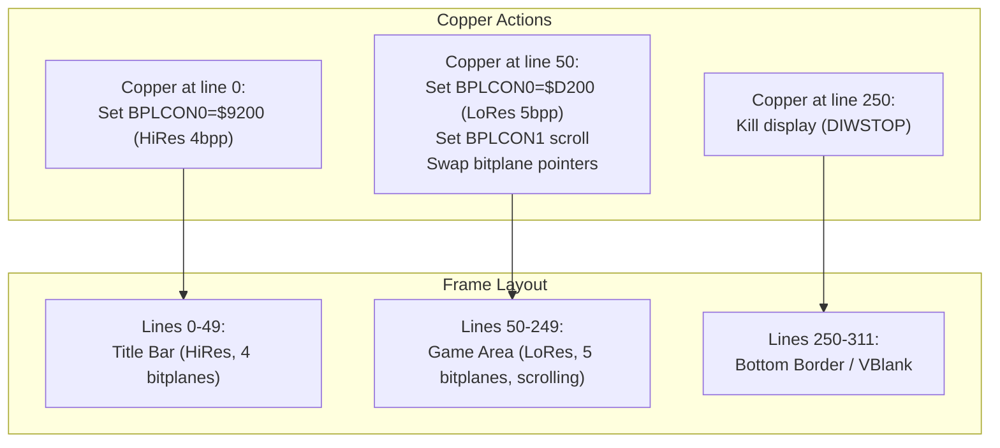

### Split-Screen Copper List

```asm
; raster_split.asm — Status bar + scrolling game area
; Top 44 lines: HiRes 4-bitplane title bar
; Bottom 200 lines: LoRes 5-bitplane scrolling game

COPPER_SPLIT:
        ; ---- Top section: HiRes title bar ----
        dc.w    $8001,$FFFE           ; WAIT line 1
        dc.w    $0100,$9200           ; BPLCON0: HiRes, 4 bitplanes, color on

        ; Set bitplane pointers for title bar image
        dc.w    $00E0,title_bpl1      ; BPL1PTH
        dc.w    $00E2,title_bpl1+2    ; BPL1PTL (word-aligned)
        dc.w    $00E4,title_bpl2
        dc.w    $00E6,title_bpl2+2
        dc.w    $00E8,title_bpl3
        dc.w    $00EA,title_bpl3+2
        dc.w    $00EC,title_bpl4
        dc.w    $00EE,title_bpl4+2

        dc.w    $0108,$0000           ; BPL1MOD = 0 (no modulo for HiRes)
        dc.w    $010A,$0000           ; BPL2MOD = 0

        ; ---- Split point: switch to game area ----
        dc.w    $802C,$FFFE           ; WAIT line 44
        dc.w    $0100,$D200           ; BPLCON0: LoRes, 5 bitplanes, color on

        ; Swap bitplane pointers to game bitmap
        dc.w    $00E0,game_bpl1
        dc.w    $00E2,game_bpl1+2
        dc.w    $00E4,game_bpl2
        dc.w    $00E6,game_bpl2+2
        dc.w    $00E8,game_bpl3
        dc.w    $00EA,game_bpl3+2
        dc.w    $00EC,game_bpl4
        dc.w    $00EE,game_bpl4+2
        dc.w    $00F0,game_bpl5
        dc.w    $00F2,game_bpl5+2

        dc.w    $0102,$0000           ; BPLCON1: scroll = 0 (updated per frame)
        dc.w    $0108,$0000           ; BPL1MOD (updated per frame)
        dc.w    $010A,$0000           ; BPL2MOD

        ; ---- End of display ----
        dc.w    $FFFF,$FFFE           ; WAIT forever
```

---

## Technique 3: Gradient Shading

Gradient shading creates smooth color transitions — the signature "Amiga sky" effect. The technique writes `COLOR01`–`COLORxx` progressively at each scanline, creating a smooth ramp from one color to another.

### Linear Color Interpolation

> 
>
> *Kefrens' Desert Dream (1993) — smooth copper gradients creating the parallax sky effect.*

OCS colors are 4-bit per component (0–15). To create a gradient from color A to color B over N scanlines, interpolate each component independently:

```c
/* gradient.c — Compute copper list for a sky gradient */

#define RGB(r,g,b)  ((UWORD)(((r)<<8)|((g)<<4)|(b)))

void make_gradient_sky(UWORD *copper, int first_line, int num_lines,
                       UWORD color_top, UWORD color_bot) {
    int y;
    int r1 = (color_top >> 8) & 0xF, r2 = (color_bot >> 8) & 0xF;
    int g1 = (color_top >> 4) & 0xF, g2 = (color_bot >> 4) & 0xF;
    int b1 =  color_top       & 0xF, b2 =  color_bot       & 0xF;

    for (y = 0; y < num_lines; y++) {
        /* Linear interpolation with rounding */
        int r = r1 + ((r2 - r1) * y + (num_lines / 2)) / num_lines;
        int g = g1 + ((g2 - g1) * y + (num_lines / 2)) / num_lines;
        int b = b1 + ((b2 - b1) * y + (num_lines / 2)) / num_lines;

        /* WAIT for target line, then MOVE color */
        *copper++ = 0x8001 | ((first_line + y) << 8);  /* WAIT y */
        *copper++ = 0xFFFE;                              /* x mask */
        *copper++ = 0x0180;                              /* MOVE → COLOR00 */
        *copper++ = RGB(r, g, b);
    }
}
```

### Typical Gradient Ramps

| Effect | Top Color | Bottom Color | Lines | Description |
|--------|-----------|-------------|-------|-------------|
| Sunset sky | `$0F44` (orange) | `$0202` (dark blue) | 200 | Warm→cool transition |
| Deep ocean | `$0448` (teal) | `$0002` (navy) | 150 | Light→dark depth |
| Metallic bar | `$0888` (gray) | `$0FFF` (white) | 10 | Specular highlight |
| Dawn | `$0000` (black) | `$0F80` (pink) | 100 | Night→sunrise |

---

## Technique 4: Sine-Based Color Cycling

The demoscene rarely uses static gradients. Instead, color values are driven by sine tables with different phase offsets, creating fluid wave effects. The key insight: **use multiple sine waves with different frequencies and phases**, then combine them.

### Sine Table Generation

```c
/* sine_gen.c — Generate a 256-entry sine table (0-255 range) */
/* In practice, this is pre-computed at build time */

#include <math.h>

void generate_sine_table(UBYTE *table) {
    int i;
    for (i = 0; i < 256; i++) {
        double s = sin(2.0 * 3.14159265 * i / 256.0);
        table[i] = (UBYTE)((s + 1.0) * 127.5);  /* 0-255 range */
    }
}
```

### Multi-Wave Color Cycling

> 
>
> *Melon Dezign's Human Target (1992) — silky smooth copper gradients driven by sine waves.*

The classic demoscene effect cycles three sine waves (one per RGB component) with different frequencies:

```c
/* color_cycle.c — Animate copper bar colors with multi-wave sine */

void animate_color_cycle(UWORD *copper_colors, int num_entries,
                         ULONG frame) {
    int i;
    for (i = 0; i < num_entries; i++) {
        /* Three sine waves: R at 1×, G at 2×, B at 3× frequency */
        int phase_r = (frame * 2 + i * 3) & 0xFF;
        int phase_g = (frame * 3 + i * 5) & 0xFF;
        int phase_b = (frame * 5 + i * 7) & 0xFF;

        int r = sine_table[phase_r] >> 4;  /* 0-15 */
        int g = sine_table[phase_g] >> 4;
        int b = sine_table[phase_b] >> 4;

        copper_colors[i] = RGB(r, g, b);
    }
}
```

> 
>
> *Phenomena's Enigma (1991) — multi-wave sine copper cycling creating a water/plasma effect, combined with filled-vector rendering.*

### Sine Scrolling (Scrolling Sinus)

One of the most iconic effects: a text message that scrolls across the screen in a sine wave pattern. This is achieved by changing `BPLCON1` (scroll offset) or `BPLxMOD` (modulo) per scanline:

```asm
; sine_scroll.asm — Per-scanline BPLCON1 modulation

        ; ---- In VBlank interrupt handler ----
        ; Apply sine-wave scroll offsets to copper list
        ; copper_mod_points[] points to the BPLCON1 MOVE data words

scroll_sine_text:
        move.l  scroll_phase,d0
        addq.l  #2,d0                  ; Advance phase
        move.l  d0,scroll_phase

        lea     sine_table,a0
        lea     copper_mod_points,a1   ; Array of ptrs to MOVE data words
        move.w  #NUM_SCROLL_LINES-1,d1

.next_line:
        move.b  (a0,d0.w),d2           ; Get sine value
        lsr.w   #4,d2                  ; Scale to 0-15 scroll range
        move.w  d2,(a1)+               ; Patch copper MOVE data word
        addq.w  #4,d0                  ; Advance phase per line
        dbra    d1,.next_line
        rts
```

---

## Technique 5: Double-Buffered Copper Lists

Advanced effects swap the active copper list mid-frame. The Copper hardware reads a `COP1LC` register to know where its list starts. By changing `COP1LC` during vertical blank, or even mid-frame, you can chain multiple copper lists together:

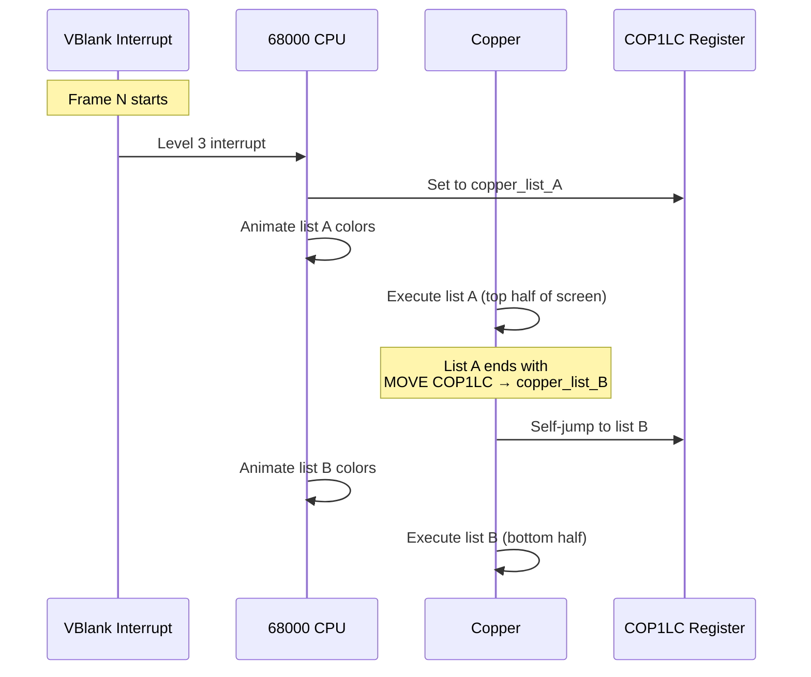

### Copper List Chaining

```asm
; double_copper.asm — Chain two copper lists in one frame

LIST_A:
        ; First half of screen: copper bars
        dc.w    $8032,$FFFE           ; WAIT line 50
        dc.w    $0180,$0F00           ; COLOR00 = blue
        ; ... more bars ...
        dc.w    $8080,$FFFE           ; WAIT line 128

        ; Chain to LIST_B: write COP1LCH and COP1LCL
        dc.w    $0080,LIST_B>>16      ; COP1LCH = high word of LIST_B
        dc.w    $0082,LIST_B&$FFFF    ; COP1LCL = low word
        dc.w    $0088,0                ; COPJMP1 — trigger jump (strobe)
        dc.w    $FFFF,$FFFE           ; Safety WAIT

LIST_B:
        ; Second half: different effects
        dc.w    $8080,$FFFE           ; WAIT line 128
        dc.w    $0180,$000F           ; COLOR00 = red
        ; ... more effects ...
        dc.w    $FFFF,$FFFE           ; End
```

---

## Technique 6: Self-Modifying Copper Lists

Rather than pre-building the entire copper list, the CPU patches it in real-time during vertical blank. This is how most demoscene effects work — the copper list is a template with placeholder values that get overwritten each frame:

```c
/* smc_copper.c — Self-modifying copper list for animated effects */

/* Copper list with placeholders (marked 0xDEAD) */
static UWORD copper_template[] = {
    /* Bar 1: WAIT + MOVE pairs */
    0x8032, 0xFFFE,  0x0180, 0xDEAD,   /* line 50, COLOR00 = ??? */
    0x8033, 0xFFFE,  0x0180, 0xDEAD,   /* line 51 */
    0x8034, 0xFFFE,  0x0180, 0xDEAD,   /* line 52 */
    0x8035, 0xFFFE,  0x0180, 0xDEAD,   /* line 53 */
    0x8036, 0xFFFE,  0x0180, 0xDEAD,   /* line 54 */

    /* Bar 2 */
    0x8050, 0xFFFE,  0x0180, 0xDEAD,   /* line 80 */
    0x8051, 0xFFFE,  0x0180, 0xDEAD,   /* line 81 */
    0x8052, 0xFFFE,  0x0180, 0xDEAD,   /* line 82 */
    0x8053, 0xFFFE,  0x0180, 0xDEAD,   /* line 83 */
    0x8054, 0xFFFE,  0x0180, 0xDEAD,   /* line 84 */

    0xFFFF, 0xFFFE                       /* End */
};

/* Indices of color data words (every 4th word starting at offset 3) */
#define BAR1_START  3   /* Index of first color word for bar 1 */
#define BAR2_START  13  /* Index of first color word for bar 2 */
#define BAR_LEN     5   /* Entries per bar */

void patch_copper_bars(ULONG frame) {
    int i;

    /* Animate bar 1 with sine wave */
    for (i = 0; i < BAR_LEN; i++) {
        int phase = (frame * 4 + i * 20) & 0xFF;
        int bright = sine_table[phase] >> 4;  /* 0-15 */
        copper_template[BAR1_START + i * 4] = RGB(bright, bright/2, 0);
    }

    /* Animate bar 2 with different phase */
    for (i = 0; i < BAR_LEN; i++) {
        int phase = (frame * 6 + i * 25 + 128) & 0xFF;
        int bright = sine_table[phase] >> 4;
        copper_template[BAR2_START + i * 4] = RGB(0, bright/2, bright);
    }
}
```

---

## Antipatterns

### 1. The Copper Overflow

Writing too many color registers per scanline. The Copper has limited DMA bandwidth — each `WAIT` + `MOVE` pair costs 4 slots. On a scanline with heavy bitplane DMA (6 planes HiRes), there may be fewer than 20 slots available.

**Broken:**
```asm
; 32 color register writes on one scanline — WILL FAIL
; with 5+ bitplanes active (DMA starvation)
dc.w    $8032,$FFFE
dc.w    $0180,$0F00   ; COLOR00
dc.w    $0182,$0F00   ; COLOR01
dc.w    $0184,$0F00   ; COLOR02
; ... 29 more COLOR writes ...
```

**Fixed:**
```asm
; Spread color writes across 2-3 scanlines
dc.w    $8032,$FFFE
dc.w    $0180,$0F00   ; COLOR00
dc.w    $0182,$0F00   ; COLOR01
dc.w    $0184,$0F00   ; COLOR02
; ... up to ~10 more is safe with 4 planes LoRes ...

dc.w    $8034,$FFFE   ; Two lines later
dc.w    $0186,$0F00   ; COLOR03
dc.w    $0188,$0F00   ; COLOR04
; ... continue on next scanline ...
```

### 2. The Stale Copper List

Forgetting to update the copper list pointer (`COP1LC`) after modifying the list in RAM. The Copper may have already fetched and cached the old instructions.

**Broken:**
```c
/* Modify copper list in RAM but don't tell Copper */
copper_list[offset] = new_color;
/* Copper still reads cached/stale data! */
```

**Fixed:**
```c
copper_list[offset] = new_color;

/* In VBlank: reload copper pointer to flush cache */
custom.cop1lc = (ULONG)copper_list;
/* Or use COPJMP1 strobe to force immediate reload */
```

### 3. The Over-Scanned WAIT

Setting a WAIT position beyond the visible display area. PAL has 313 scanlines (0–312), NTSC has 263 (0–262). A WAIT for line 313 on PAL wraps incorrectly; on NTSC, anything past line 262 never triggers.

**Broken:**
```asm
; Assumes PAL — breaks on NTSC machines
dc.w    $8138,$FFFE   ; WAIT line 312 (PAL only)
dc.w    $0180,$0000   ; Clear color
```

**Fixed:**
```asm
; Use a safe VBlank wait that works on both PAL and NTSC
dc.w    $FFFF,$FFFE   ; WAIT $FF,$FF — waits forever (end of list)
; Reset at VBlank via interrupt handler instead
```

### 4. The Register Collision

Writing to a register that the CPU or Blitter is also modifying in the same frame. The Copper runs asynchronously — it can clobber a value the CPU just set.

**Broken:**
```c
/* CPU sets COLOR01 for game object highlighting */
custom.color[1] = 0x0FFF;

/* But the copper list also writes COLOR01 at line 100 */
/* → Copper overwrites the CPU's value */
```

**Fixed:**
```c
/* Reserve specific color registers for CPU and others for Copper */
/* CPU uses COLOR00-COLOR03, Copper uses COLOR04-COLOR31 */
custom.color[4] = copper_animated_color;  /* Copper-safe */
```

### 5. The AGA Position Bug

On AGA, the Copper's horizontal position resolution doubles to 8 bits (`$DFF004` BEAMCON0 changes). Using OCS-style horizontal WAIT values produces incorrect timing on AGA hardware. The `BPC` bit in `FMODE` ($DFF1FC) controls whether Copper positions are interpreted as low-res or high-res clock cycles.

**Broken:**
```asm
; OCS copper list used directly on AGA — horizontal timing off
dc.w    $8007,$FFFE   ; WAIT x=7 on OCS, but AGA reads x=3.5
```

**Fixed:**
```asm
; Set FMODE.BPC=0 for OCS-compatible copper timing
; before activating the copper list
dc.w    $01FC,$0000   ; FMODE = 0 (OCS compatibility)

; Or double all horizontal positions for AGA-native mode
dc.w    $800E,$FFFE   ; WAIT x=14 (AGA: same as x=7 OCS)
```

---

## Decision Guide

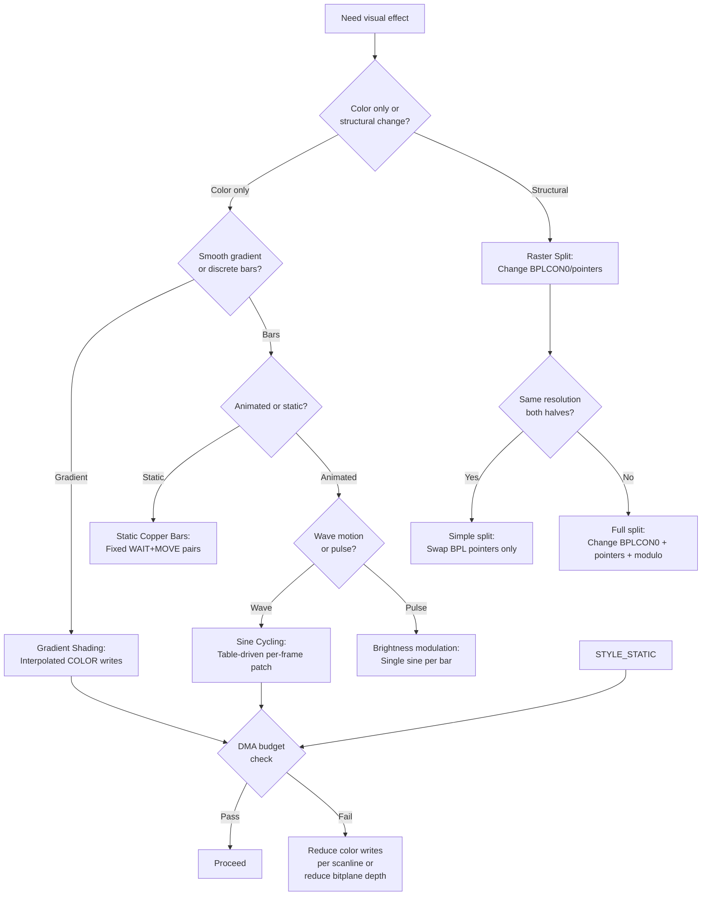

---

## Performance Characteristics

### DMA Budget Per Scanline

| Bitplane Depth | Bitplane DMA Slots | Available for Copper | Max Color Writes |
|---------------|--------------------|---------------------|-----------------|
| 1 plane LoRes | 2 | ~220 | ~55 |
| 2 planes LoRes | 4 | ~218 | ~54 |
| 4 planes LoRes | 8 | ~214 | ~53 |
| 5 planes LoRes | 10 | ~212 | ~53 |
| 6 planes LoRes | 12 | ~210 | ~52 |
| 4 planes HiRes | 16 | ~206 | ~51 |
| 6 planes HiRes | 24 | ~198 | ~49 |

> [!NOTE]
> Each color register write requires 1 WAIT + 1 MOVE = 4 slots. The "Max Color Writes" column assumes one write per scanline with a WAIT at the start. Consecutive writes without WAIT only cost 2 slots each (MOVE only), but the Copper must WAIT at least once to synchronize.

---

## Historical Timeline

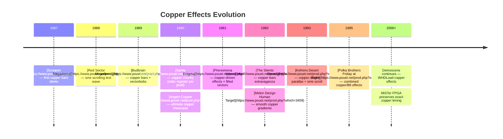

---

## Modern Analogies

| Amiga Copper Concept | Modern Equivalent | Why It Maps |
|---------------------|-------------------|-------------|
| Copper bar (per-line color write) | Fragment shader per-scanline uniform | Both change output color based on Y position |
| Raster split | Render pass boundary | Both change rendering state at a specific point |
| Gradient shading | Vertex color gradient | Both interpolate colors across the screen |
| Sine color cycling | Animated uniform / time-based shader | Both drive color from a function of time |
| Self-modifying copper list | Dynamic command buffer generation | Both generate GPU commands per frame |
| Copper list chaining | Multiple render passes | Both execute separate command sequences sequentially |
| WAIT instruction | GPU pipeline barrier / fence | Both synchronize to display timing |
| DMA slot budget | Memory bandwidth budget | Both limited by available bus cycles per scanline |

---

## Use Cases

| Use Case | Technique | Examples |
|----------|-----------|----------|
| Demo background | Copper bars, sine cycling | [Copper Master](https://www.pouet.net/prod.php?which=3422), [Xpose](https://www.pouet.net/prod.php?which=4031) |
| Game status bar | Raster split | Turrican, Lionheart, Risky Woods |
| Sky/terrain gradient | Gradient shading | Shadow of the Beast, [Agony](https://amiga.lychesis.net/games/Agony.html) |
| Scrolling sine text | BPLCON1/BPLMOD modulation | [Red Sector Megademo](https://www.pouet.net/prod.php?which=3119), [Desert Dream](https://www.pouet.net/prod.php?which=1483) |
| Multi-resolution display | Raster split with BPLCON0 change | Many games (title HiRes, game LoRes) |
| Water/plasma effect | Multi-wave sine cycling | [Enigma](https://www.pouet.net/prod.php?which=394), numerous cracktros |
| Metallic logo shine | Fast gradient sweep across logo | [Human Target](https://www.pouet.net/prod.php?which=3459), [Arte](https://www.pouet.net/prod.php?which=1477) |
| Full-screen copper effect | Copper chunky (see [pixel_tricks.md](pixel_tricks.md)) | [Sanity Arte](https://www.pouet.net/prod.php?which=1477) |

---

## FPGA / Emulation Impact

Copper effects are among the most timing-sensitive code on the Amiga. Accurate emulation requires:

| Concern | Impact | FPGA Notes |
|---------|--------|------------|
| **Cycle-accurate WAIT** | Copper must stall until exact beam position | Minimig/MiSTer implement beam counter compare at cycle granularity |
| **DMA slot allocation** | Copper slots must be reserved correctly after bitplane/sprite DMA | Bus arbiter must interleave correctly |
| **Register write latency** | Copper writes are visible next cycle | Write buffer must not add latency |
| **COPJMP strobes** | List jumps must take effect at exact position | State machine must handle strobe timing |
| **AGA 8-bit horizontal** | FMODE.BPC changes position interpretation | Must track FMODE state at copper fetch time |
| **Self-modifying code** | CPU writes to copper list must be visible to Copper DMA | Requires cache coherency between CPU writes and DMA reads |

> [!WARNING]
> Many WHDLoad patches fix games that relied on specific Copper timing on real hardware. Emulators like WinUAE have "copper timing" settings (exact/default/fast) because some demos only work with specific timing models.

---

## FAQ

**Q: How many color changes can I do per scanline?**
A: On a stock A500 with 4 bitplanes LoRes, approximately 53 WAIT+MOVE pairs per scanline. With 6 bitplanes HiRes, it drops to ~49. Each additional consecutive MOVE (without WAIT) adds 2 slots instead of 4.

**Q: Can the Copper read registers?**
A: No. The Copper has no read capability. It can only WAIT for a beam position and MOVE (write) a value to a register. This is why self-modifying copper lists are done by the CPU writing to Chip RAM — the Copper itself cannot inspect register values.

**Q: What is copper chunky and why is it impressive?**
A: Copper chunky uses the Copper to write `COLOR01` at every pixel position across a scanline, creating a chunky-pixel display without any bitplanes at all. It requires extremely precise timing and works only at low resolution. The technique was most famously used in [Sanity's Arte](https://www.pouet.net/prod.php?which=1477) (1993):

> 
>
> *Sanity's Arte (1993) — full-screen copper chunky: every pixel is a COLOR01 write, no bitplanes used.*

See [pixel_tricks.md](pixel_tricks.md) for the full technique.

**Q: Do copper effects work on AGA?**
A: Yes, with caveats. AGA adds an 8-bit horizontal position (vs OCS 7-bit), controlled by the `BPC` bit in `FMODE`. AGA also has 256-color registers (`COLOR00`–`COLOR255`) instead of 32, allowing much more complex copper effects. However, the higher bandwidth of AGA bitplane DMA leaves fewer slots for the Copper.

**Q: Can I use copper effects from AmigaOS?**
A: Yes, via `UCopList` — the user copper list attached to a `ViewPort`. Intuition merges your copper instructions with its own. See [Copper Programming](../08_graphics/copper/copper_programming.md) for the OS-friendly approach. For full copper control (demos), you take over the hardware directly.

**Q: What happens if the Copper runs past the end of a scanline before finishing?**
A: The Copper simply continues executing on the next scanline. There is no error or trap. The WAIT instruction's purpose is to synchronize — if you don't WAIT, the Copper runs as fast as DMA allows. Effects that don't need per-line synchronization can skip WAITs entirely.

---

## References

### Related Knowledge Base Articles

- [Copper](../08_graphics/copper/copper.md) — Copper coprocessor hardware: instruction format, UCopList
- [Copper Programming](../08_graphics/copper/copper_programming.md) — Building copper lists, gradients, raster effects
- [Pixel Conversion](../08_graphics/pixel_conversion.md) — Copper chunky technique, C2P algorithms
- [Sprites](../08_graphics/sprites.md) — Sprite multiplexing (Copper repositions sprites)
- [Video Timing](../01_hardware/common/video_timing.md) — Scanline anatomy, beam counters
- [DMA Architecture](../01_hardware/common/dma_architecture.md) — DMA slot allocation, bus arbitration
- [Pixel Tricks](pixel_tricks.md) — Copper chunky deep dive

### External Resources

- **Copper Demon** (technik) — Copper bar tutorial with source code
- **Amiga Hardware Reference Manual** — Chapter 6: Copper coprocessor
- **Amiga Graphics Archive** — https://amiga.lychesis.net/specials/Copper.html — Forensic analysis of copper usage in commercial games (Agony, Bio Challenge, Starray, Wings of Death)
- **Scoopex Amiga Hardware Programming** (Photon) — [YouTube playlist](https://www.youtube.com/playlist?list=PLc3ltHgmiidpK-s0eP5hTKJnjdTHz0_bW) — Video walkthroughs of copper bars, raster splits, and sine effects in 68k assembly. Companion articles: [coppershade.org](http://coppershade.org/articles/)
- **Pouet.net** — https://www.pouet.net — Demo database with source code links
- **Demozoo** — https://demozoo.org — Demoscene production encyclopedia

### Notable Demos

| Demo | Group | Year | Key Copper Technique | Link |
|------|-------|------|---------------------|------|
| Megademo | Scoopex | 1987 | First copper bars | [Pouet](https://www.pouet.net/prod.php?which=5832) |
| Megademo | Red Sector Inc. | 1989 | Sine scroll, raster splits | [Pouet](https://www.pouet.net/prod.php?which=3119) |
| Budbrain Megademo | Budbrain | 1990 | Copper bars + vectorbobs | [Pouet](https://www.pouet.net/prod.php?which=1290) |
| Copper Master | Angels | 1990 | Ultimate copper showcase | [Pouet](https://www.pouet.net/prod.php?which=3422) |
| Enigma | Phenomena | 1991 | Copper + filled vectors | [Pouet](https://www.pouet.net/prod.php?which=394) |
| Xpose | The Silents | 1992 | Copper bars extravaganza | [Pouet](https://www.pouet.net/prod.php?which=4031) |
| Human Target | Melon Dezign | 1992 | Smooth copper gradients | [Pouet](https://www.pouet.net/prod.php?which=3459) |
| Arte | Sanity | 1993 | Copper chunky full-screen | [Pouet](https://www.pouet.net/prod.php?which=1477) |
| Desert Dream | Kefrens | 1993 | Copper parallax + sine | [Pouet](https://www.pouet.net/prod.php?which=1483) \| [Demozoo](https://demozoo.org/productions/142/) |
| Friday at Eight | Polka Brothers | 1995 | Combined copper/Blt | [Pouet](https://www.pouet.net/prod.php?which=702) |
