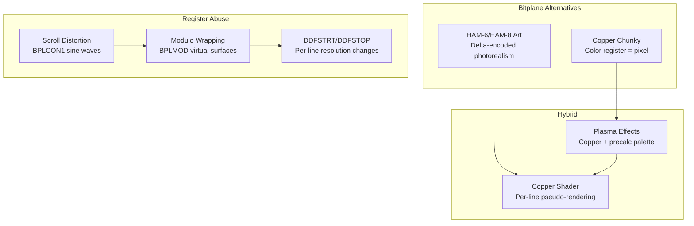
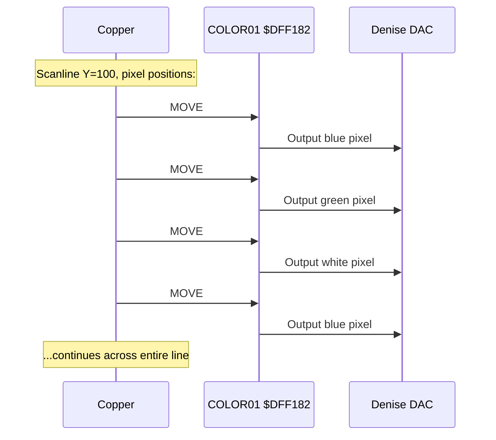
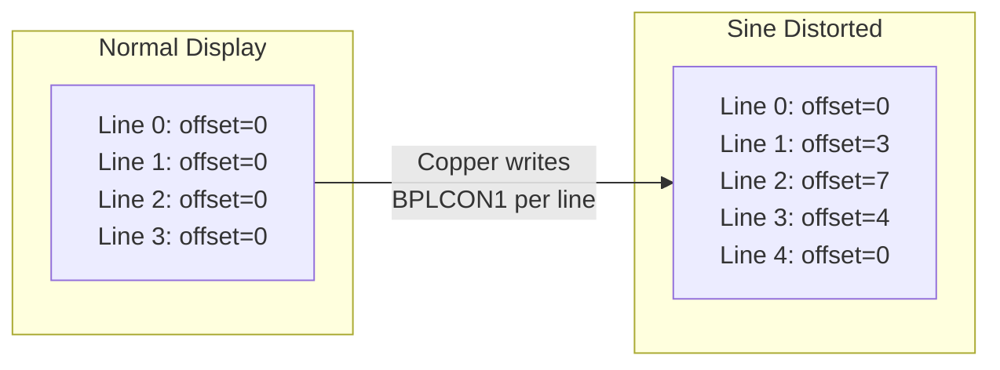
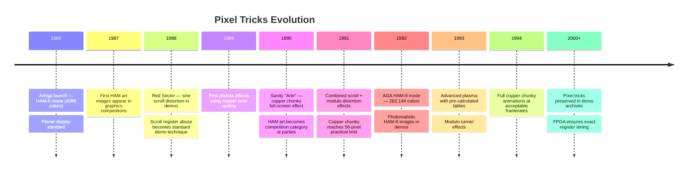

[← Home](../README.md) · [Demoscene Techniques](README.md)

# Pixel Tricks — Copper Chunky, HAM Art, Scroll Register Abuse, and Modulo Wrapping

## Overview

The Amiga's display hardware was designed for planar bitplane graphics — a memory-efficient scheme that matched the DMA streaming pattern perfectly. But the demoscene never accepted "designed for" as a limitation. From 1989 onward, demoscene coders systematically abused every display register to create effects that Commodore's engineers never imagined: **copper chunky** (no bitplanes at all, just color register writes), **HAM art** (photorealistic images in 4096 colors), **scroll-register distortion** (sine-wave text), and **modulo wrapping** (infinite scrolling surfaces).

These techniques share a common thread: they treat the display registers themselves as the primary rendering surface, not the bitplane memory. The Copper, scroll registers, and modulo values become the "pixels" — a fundamental inversion of the intended programming model.



---

## Technique 1: Copper Chunky

The most extreme display hack on the Amiga. Copper chunky creates a pixel display **without any bitplanes at all**. The Copper writes to a single color register (`COLOR01`) at every pixel position across each scanline. The result is a "chunky pixel" display where each pixel's color is set directly by the Copper — no bitplane memory, no Blitter, no CPU rendering.

### Why It Works



### Resolution and Bandwidth

Copper chunky resolution is limited by how many MOVE instructions fit per scanline:

| Mode | Pixels/Line | Colors | DMA Budget | Notes |
|------|------------|--------|------------|-------|
| LoRes (1×) | ~56 | Any of 4096 | WAIT + MOVE = 4 slots/pixel | Sanity "Arte" style |
| LoRes (2×) | ~112 | Any of 4096 | MOVE only = 2 slots/pixel | No WAIT, consecutive moves |
| HiRes (1×) | ~28 | Any of 4096 | More DMA used by bitplanes | Rarely used |

### Copper Chunky Template

```asm
; copper_chunky.asm — Minimal copper chunky (56 pixels wide, 1 line)
; No bitplanes enabled — display comes entirely from COLOR01 writes

COPPER_CHUNKY:
        ; Disable all bitplanes, enable color
        dc.w    $0100,$0200           ; BPLCON0: 0 bitplanes, color on

        ; Wait for display area start
        dc.w    $802C,$FFFE           ; WAIT line 44

        ; Write COLOR01 at each pixel position
        ; Each MOVE takes 2 DMA slots; ~56 pixels per LoRes line
        dc.w    $0182,$0F00           ; COLOR01 = blue (pixel 0)
        dc.w    $0182,$0FF0           ; COLOR01 = cyan (pixel 1)
        dc.w    $0182,$0FFF           ; COLOR01 = white (pixel 2)
        dc.w    $0182,$0F0F           ; COLOR01 = magenta (pixel 3)
        dc.w    $0182,$0FF0           ; COLOR01 = cyan (pixel 4)
        dc.w    $0182,$0F00           ; COLOR01 = blue (pixel 5)
        ; ... repeat for ~56 pixels total ...

        ; End of line — black for rest of frame
        dc.w    $8030,$FFFE           ; WAIT next line
        dc.w    $0182,$0000           ; COLOR01 = black
        dc.w    $FFFF,$FFFE           ; End
```

### Full Copper Chunky Frame

For a full-screen effect, the CPU pre-calculates the copper list each frame, writing color values for every visible pixel:

```c
/* copper_chunky.c — Generate full copper chunky frame */
/* Resolution: ~56 pixels × 200 lines = 11,200 "pixels" */

#define CHUNKY_WIDTH  56
#define CHUNKY_HEIGHT 200
#define FIRST_LINE    44

/* The copper list is an array of UWORDs */
/* Each pixel = 1 MOVE instruction = 2 UWORDs (register, value) */
/* Each line = 1 WAIT (2 UWORDs) + 56 MOVEs (112 UWORDs) = 114 UWORDs */
#define LINE_WORDS  (2 + CHUNKY_WIDTH * 2)
#define TOTAL_WORDS (LINE_WORDS * CHUNKY_HEIGHT + 4)  /* +4 for end marker */

static UWORD copper_list[TOTAL_WORDS];

void generate_chunky_frame(const UBYTE *pixel_data, ULONG frame) {
    int y, x;
    UWORD *cop = copper_list;

    for (y = 0; y < CHUNKY_HEIGHT; y++) {
        /* WAIT for this scanline */
        *cop++ = 0x8001 | (((FIRST_LINE + y) & 0xFF) << 8);
        *cop++ = 0xFFFE;

        /* Write each pixel's color */
        for (x = 0; x < CHUNKY_WIDTH; x++) {
            *cop++ = 0x0182;  /* Register: COLOR01 */
            *cop++ = rgb_palette[pixel_data[y * CHUNKY_WIDTH + x]];
        }
    }

    /* End marker */
    *cop++ = 0xFFFF;
    *cop++ = 0xFFFE;
}
```

> [!WARNING]
> Copper chunky requires **disabling all bitplane DMA** — you cannot display bitplane graphics alongside copper chunky pixels. The technique is mutually exclusive with normal display rendering.

---

## Technique 2: HAM Art

Hold-And-Modify (HAM) mode gives the Amiga 4,096 on-screen colors from only 6 bitplanes. Instead of direct color lookup, HAM encodes most pixels as **deltas** — modifications to the previous pixel's color. This makes HAM ideal for photorealistic images but nearly useless for animation.

### HAM-6 Encoding (OCS/ECS)

| Bit 5 | Bit 4 | Bits 3-0 | Meaning |
|-------|-------|----------|---------|
| 0 | 0 | color index | Use palette[color index] (64 palette entries) |
| 0 | 1 | blue delta | Modify blue component of previous pixel |
| 1 | 0 | red delta | Modify red component of previous pixel |
| 1 | 1 | green delta | Modify green component of previous pixel |

### HAM-8 Encoding (AGA)

| Bits 7-6 | Bits 5-0 | Meaning |
|-----------|----------|---------|
| 00 | palette index | Use palette[index] (64 entries) |
| 01 | blue value | Set blue to 6-bit value, keep R,G |
| 10 | red value | Set red to 6-bit value, keep G,B |
| 11 | green value | Set green to 6-bit value, keep R,B |

### HAM Art Technique

HAM art for demos works by pre-rendering images in HAM mode, then displaying them as static or slowly-animated screens. The trick is managing the delta encoding to minimize color fringing:

```c
/* ham_render.c — Render a pre-calculated image to HAM-6 bitmap */

/* OCS HAM: 6 bitplanes, 4 bits per component, 64 palette + 3 modify modes */
/* Total on-screen colors: 4,096 (12-bit RGB space) */

#define HAM_SET_COLOR   0  /* Use palette entry (bits 3-0 = index 0-15) */
#define HAM_MOD_BLUE    1  /* Modify blue (bits 3-0 = new blue 0-15) */
#define HAM_MOD_RED     2  /* Modify red (bits 3-0 = new red 0-15) */
#define HAM_MOD_GREEN   3  /* Modify green (bits 3-0 = new green 0-15) */

/* Convert a 12-bit RGB pixel to the best HAM encoding
   given the previous pixel's color */
UWORD rgb_to_ham(UWORD target_rgb, UWORD prev_rgb) {
    int tr = (target_rgb >> 8) & 0xF;
    int tg = (target_rgb >> 4) & 0xF;
    int tb =  target_rgb       & 0xF;
    int pr = (prev_rgb >> 8) & 0xF;
    int pg = (prev_rgb >> 4) & 0xF;
    int pb =  prev_rgb       & 0xF;

    int err_r = abs(tr - pr);
    int err_g = abs(tg - pg);
    int err_b = abs(tb - pb);

    /* If exact match in palette → use SET mode */
    /* (simplified: check against 16 base colors) */
    if (err_r == 0 && err_g == 0 && err_b == 0) {
        /* Exact match — encode as palette reference */
        return (HAM_SET_COLOR << 4) | 0;  /* Palette entry 0 */
    }

    /* Choose the component with largest error to modify */
    if (err_b >= err_r && err_b >= err_g) {
        return (HAM_MOD_BLUE << 4) | tb;
    } else if (err_r >= err_g) {
        return (HAM_MOD_RED << 4) | tr;
    } else {
        return (HAM_MOD_GREEN << 4) | tg;
    }
}
```

### HAM Limitations

| Limitation | Impact | Workaround |
|-----------|--------|-----------|
| **Fringing** | Color deltas only change 1 component per pixel | Pre-calculate optimal delta sequences |
| **Slow rendering** | Each pixel depends on previous pixel state | Use Blitter for fast HAM blits |
| **No random access** | Can't set arbitrary pixel without context | Pre-render entire scanlines |
| **Limited animation** | Moving objects create fringing artifacts | Reserve palette entries for sprites/objects |
| **Display artifacts** | Vertical color bleeding from delta chains | Reset color at start of each scanline |

---

## Technique 3: Scroll Register Distortion

`BPLCON1` ($DFF102) controls horizontal scroll offset for the playfield. By changing it per scanline via the Copper, you create wave distortion effects — the classic "sine scrolling text" that defined the Amiga demo aesthetic.

### How Scroll Distortion Works



### Sine Scroll Implementation

```c
/* sine_scroll.c — Generate copper list for sine wave scroll */

#define DISPLAY_LINES 200
#define FIRST_LINE    44
#define SCROLL_WIDTH  16  /* Max scroll offset (0-15 for LoRes) */

void generate_sine_scroll(UWORD *copper, const UBYTE *sine_table,
                          ULONG phase) {
    int y;

    for (y = 0; y < DISPLAY_LINES; y++) {
        int offset;

        /* Get sine value for this line */
        int sine_idx = (phase + y * 4) & 0xFF;
        offset = sine_table[sine_idx] >> 4;  /* 0-15 */

        /* WAIT for this scanline */
        *copper++ = 0x8001 | (((FIRST_LINE + y) & 0xFF) << 8);
        *copper++ = 0xFFFE;

        /* MOVE scroll offset to BPLCON1 */
        *copper++ = 0x0102;                /* BPLCON1 register */
        *copper++ = (offset << 4) | offset; /* Even/odd playfield same */
    }

    /* End marker */
    *copper++ = 0xFFFF;
    *copper++ = 0xFFFE;
}
```

---

## Technique 4: Modulo Wrapping

`BPL1MOD` and `BPL2MOD` ($DFF108/$DFF10A) define the byte offset added to each bitplane's data pointer at the end of a scanline. Normally this compensates for interleaving. By setting the modulo to unusual values, you create **wrapping effects** — the bitmap appears to fold, repeat, or scroll infinitely.

### How Modulo Wrapping Works

```
Normal display (320px wide, 40 bytes/line):
  Line 0: address 0
  Line 1: address 40    (modulo = 40)
  Line 2: address 80

With modulo = -40 (wraps back 40 bytes per line):
  Line 0: address 0     → displays data[0..39]
  Line 1: address -40   → wraps to end of bitmap!
  Line 2: address -80   → wraps further back!

With modulo = 20 (half-width):
  Line 0: address 0     → displays data[0..39]
  Line 1: address 20    → offset by 20 bytes = half-line shift
  Line 2: address 40
```

### Tunnel Effect via Modulo

```c
/* modulo_tunnel.c — Create a tunnel effect using modulo wrapping */

void setup_modulo_tunnel(ULONG frame) {
    int y;
    UWORD *cop = copper_list;

    for (y = 0; y < 200; y++) {
        /* Distance from center creates tunnel perspective */
        int dist = 100 - abs(y - 100);  /* 0 at top/bottom, 100 at center */
        int modulo = dist * 2;          /* Tighter wrapping at center */

        /* WAIT for line */
        *cop++ = 0x8001 | (((FIRST_LINE + y) & 0xFF) << 8);
        *cop++ = 0xFFFE;

        /* Set modulo per line */
        *cop++ = 0x0108;                    /* BPL1MOD */
        *cop++ = (UWORD)(short)modulo;      /* Signed modulo value */
        *cop++ = 0x010A;                    /* BPL2MOD */
        *cop++ = (UWORD)(short)modulo;
    }
}
```

### Scroll Register + Modulo Combined

The most impressive effects combine scroll offset and modulo changes per scanline:

```asm
; combined_distort.asm — Per-line scroll + modulo for wave effect

        ; Line 100: normal
        dc.w    $8064,$FFFE           ; WAIT line 100
        dc.w    $0102,$0000           ; BPLCON1 scroll = 0
        dc.w    $0108,$0028           ; BPL1MOD = 40 (normal)

        ; Line 101: slight wave
        dc.w    $8065,$FFFE           ; WAIT line 101
        dc.w    $0102,$0030           ; BPLCON1 scroll = 3
        dc.w    $0108,$0026           ; BPL1MOD = 38 (slightly tighter)

        ; Line 102: more wave
        dc.w    $8066,$FFFE           ; WAIT line 102
        dc.w    $0102,$0070           ; BPLCON1 scroll = 7
        dc.w    $0108,$0020           ; BPL1MOD = 32 (tighter still)

        ; Line 103: peak wave
        dc.w    $8067,$FFFE           ; WAIT line 103
        dc.w    $0102,$00F0           ; BPLCON1 scroll = 15 (max)
        dc.w    $0108,$0018           ; BPL1MOD = 24

        ; Line 104: coming back
        dc.w    $8068,$FFFE           ; WAIT line 104
        dc.w    $0102,$00A0           ; BPLCON1 scroll = 10
        dc.w    $0108,$0020           ; BPL1MOD = 32
```

---

## Technique 5: Plasma Effects

Plasma is a classic demoscene effect created by overlapping sine waves mapped to a color palette. On the Amiga, plasma is implemented by pre-calculating a color lookup table and using the Copper to write it per scanline (or per block).

### Plasma Generation

```c
/* plasma.c — Generate plasma color values */

#define PLASMA_WIDTH  40  /* One color per 8 pixels (320/8) */
#define PLASMA_HEIGHT 25  /* One color per 8 scanlines (200/8) */
#define NUM_COLORS    64  /* Plasma palette size */

static UWORD plasma_palette[NUM_COLORS];

/* Pre-calculate plasma palette (rainbow gradient) */
void init_plasma_palette(void) {
    int i;
    for (i = 0; i < NUM_COLORS; i++) {
        int phase = i * 360 / NUM_COLORS;
        int r = (int)(8.0 + 7.0 * sin(phase * 3.14159 / 180.0));
        int g = (int)(8.0 + 7.0 * sin((phase + 120) * 3.14159 / 180.0));
        int b = (int)(8.0 + 7.0 * sin((phase + 240) * 3.14159 / 180.0));
        plasma_palette[i] = (r << 8) | (g << 4) | b;
    }
}

/* Calculate plasma value at (x,y) with time offset */
UBYTE plasma_value(int x, int y, ULONG t) {
    int v = 0;
    v += sine_table[(x * 4 + t) & 0xFF];
    v += sine_table[(y * 6 + t * 2) & 0xFF];
    v += sine_table[((x + y) * 3 + t) & 0xFF];
    v += sine_table[((x * 2 - y + t * 3) & 0xFF)];
    return (v >> 2) & 0x3F;  /* 0-63 → palette index */
}
```

---

## Antipatterns

### 1. The Copper Chunky Bandwidth Wall

Attempting copper chunky at too high a resolution. With 5+ bitplanes enabled, there aren't enough DMA slots for per-pixel color writes. The display will flicker, show garbage, or skip pixels.

**Broken:**
```asm
; Trying 112-pixel copper chunky with 4 bitplanes active
; → DMA starvation, half the pixels never get written
dc.w    $0100,$$4200   ; BPLCON0: 4 bitplanes enabled
; ... then try 112 MOVE instructions per line → FAIL
```

**Fixed:**
```asm
; Disable ALL bitplanes for copper chunky
dc.w    $0100,$0200    ; BPLCON0: 0 bitplanes, color on
; Now full DMA bandwidth available for Copper writes
```

### 2. The HAM Fringe

Rendering sharp edges in HAM mode without resetting the color state. Adjacent pixels of very different colors create visible "fringing" as the delta encoding struggles to transition.

**Broken:**
```c
/* Drawing a red square on a blue background in HAM */
/* Each pixel transition goes: blue→red→blue→red → massive fringing */
for (y = 0; y < height; y++) {
    for (x = 0; x < width; x++) {
        /* Each transition needs 2-3 pixels to change color */
        set_ham_pixel(x, y, is_square ? RED : BLUE);  /* Fringes! */
    }
}
```

**Fixed:**
```c
/* Use palette entries for the square colors, and place the
   square on scanline boundaries where HAM state resets */
for (y = 0; y < height; y++) {
    /* At start of each line, set base color from palette */
    set_ham_pixel(0, y, is_square ? RED_PAL_ENTRY : BLUE_PAL_ENTRY);

    /* Now deltas work from a known state */
    for (x = 1; x < width; x++) {
        /* Only use SET mode for sharp transitions */
        if (is_border_pixel(x, y)) {
            set_ham_pixel(x, y, target_palette_entry);
        }
    }
}
```

### 3. The Modulo Overflow

Setting a modulo value that causes bitplane addresses to wrap into non-bitplane memory or cross allocation boundaries. The result is visible garbage, DMA conflicts, or even system crashes.

**Broken:**
```c
/* Modulo too large → bitplane addresses go past allocated memory */
custom.bpl1mod = 0x7FFF;  /* Almost 32KB jump per line! */
/* → Reads from random memory, shows garbage, may crash */
```

**Fixed:**
```c
/* Calculate modulo based on actual bitmap dimensions */
int bytes_per_line = (width / 8) * num_bitplanes;  /* Interleaved */
int modulo = bytes_per_line - (display_bytes_per_line);
custom.bpl1mod = (UWORD)(short)modulo;  /* Sign-extend correctly */
```

### 4. The Scroll Reset Gap

Forgetting that `BPLCON1` scroll applies from the Copper write position to the end of the frame. If you set scroll per-line but forget to reset it, the last value persists for all remaining lines.

**Broken:**
```asm
; Sine scroll lines 50-150, but no reset after line 150
dc.w    $8060,$FFFE           ; WAIT line 96
dc.w    $0102,$0070           ; Scroll = 7
; ... more lines ...
dc.w    $8096,$FFFE           ; WAIT line 150 (last sine line)
dc.w    $0102,$0003           ; Scroll = 3
; BUG: Lines 151+ still have scroll=3!
```

**Fixed:**
```asm
; After the sine section, reset scroll to 0
dc.w    $8097,$FFFE           ; WAIT line 151
dc.w    $0102,$0000           ; Reset scroll to 0
```

### 5. The Palette Stride

Assuming HAM palette entries are contiguous. HAM-6 uses only 16 palette entries (0–15) for SET mode — the upper 48 entries of the 64-entry palette are not directly accessible via HAM SET codes.

**Broken:**
```c
/* Setting HAM palette entry 32 — NOT accessible via HAM SET! */
ham_palette[32] = 0x0FFF;
/* HAM SET mode only uses bits 3-0 → entries 0-15 */
```

**Fixed:**
```c
/* Only entries 0-15 are usable with HAM SET (00xxxx) */
/* Place your most important anchor colors in entries 0-15 */
ham_palette[0] = 0x0000;  /* Black (background) */
ham_palette[1] = 0x0FFF;  /* White (highlights) */
/* ... entries 2-15 for key scene colors */
```

---

## Decision Guide

```mermaid
flowchart TD
    START[Need pixel-level effect] --> Q1{Bitplanes available?}
    Q1 -->|No bitplanes needed| CC[Copper Chunky<br/>~56px wide, any colors]
    Q1 -->|Yes, need bitplanes| Q2{Photorealistic or generated?}

    Q2 -->|Photorealistic| HAM[HAM-6/HAM-8 Art<br/>4096/262,144 colors]
    Q2 -->|Generated/procedural| Q3{Wave distortion or wrapping?}

    Q3 -->|Wave distortion| Q4{Horizontal or vertical?}
    Q3 -->|Surface wrapping| MOD[Modulo Wrapping]

    Q4 -->|Horizontal| SCROLL[BPLCON1 Sine Scroll]
    Q4 -->|Vertical| Q5{Color cycling or structure?}

    Q5 -->|Color only| PLASMA[Plasma / Color Cycling]
    Q5 -->|Structural| SPLIT[Raster Split (see copper_effects.md)]

    CC --> BUDGET{DMA budget<br/>for copper writes?}
    HAM --> BUDGET2{Accept fringing<br/>at sharp edges?}
    SCROLL --> BUDGET
    MOD --> BUDGET

    BUDGET -->|Sufficient| OK[Proceed]
    BUDGET -->|Insufficient| REDUCE[Reduce width or<br/>disable bitplanes]
    BUDGET2 -->|Yes| OK2[Proceed with HAM]
    BUDGET2 -->|No| ALT[Use 6-bitplane normal mode<br/>or copper chunky instead]
```

---

## Historical Timeline



---

## Modern Analogies

| Amiga Pixel Trick | Modern Equivalent | Why It Maps |
|------------------|-------------------|-------------|
| Copper chunky | Fragment shader per-pixel output | Both generate color per pixel programmatically |
| HAM delta encoding | DXT/Etc2 texture compression | Both store deltas from neighbors, not absolute values |
| Scroll register distortion | Vertex displacement shader | Both deform the output geometry |
| Modulo wrapping | UV coordinate wrapping/repeating | Both tile the source data |
| Plasma effect | GPU procedural texture | Both generate visuals from math functions |
| Per-line register changes | Per-scanline render state | Both change parameters at Y boundaries |
| Self-modifying copper list | Dynamic command buffer | Both generate GPU commands per frame |
| Color register palette | CLUT (Color Lookup Table) | Both map indices to RGB values |

---

## Use Cases

| Use Case | Technique | Notable Examples |
|----------|-----------|-----------------|
| Full-screen chunky graphics | Copper chunky | Sanity "Arte", ASD demos |
| Photorealistic static images | HAM-6/HAM-8 | Amiga art competitions, IPF cover art |
| Sine-wave text scroll | BPLCON1 distortion | Every Amiga demo with scrolling text |
| Wave distortion effect | Scroll + modulo combined | Red Sector, Kefrens demos |
| Background plasma | Copper color cycling | Numerous demos, cracktros |
| Tunnel perspective | Modulo wrapping | "Tunnel" demo effect |
| Virtual scrolling surface | Modulo repeat | Racing games, side-scrollers |
| Color gradient animation | Per-line color writes | Copper bar variants |

---

## FPGA / Emulation Impact

| Concern | Impact | Notes |
|---------|--------|-------|
| **Copper chunky timing** | Exact per-cycle color register writes | Denise must latch COLORxx at precise pixel positions |
| **HAM delta decoding** | Per-pixel color state machine | Must track running R/G/B across entire scanline |
| **Scroll register latency** | BPLCON1 changes take effect next line | Must match hardware pipeline delay |
| **Modulo arithmetic** | Signed 16-bit addition to address | Address wrapping must handle 24-bit space correctly |
| **BPLCON0 bitplane disable** | 0-bitplane mode must suppress all BPL DMA | Copper chunky depends on zero bitplane DMA |
| **HAM-8 AGA extension** | 8-bitplane HAM mode with 6-bit deltas | AGA Lisa chip HAM decoder must be implemented |

---

## FAQ

**Q: Can copper chunky animate at full frame rate?**
A: Rarely. A 56×200 copper chunky frame requires generating ~11,200 copper instructions per frame. On a 7 MHz 68000, that takes most of the frame time. Most copper chunky demos animate at reduced resolution or partial updates.

**Q: Why not always use HAM for more colors?**
A: HAM's delta encoding makes it nearly impossible to render sharp-edited graphics or animations. Any pixel transition that requires changing more than one color component creates visible fringing. HAM is excellent for pre-rendered images but terrible for real-time rendering.

**Q: What's the difference between plasma and copper bars?**
A: Copper bars are horizontal bands of uniform color (one color per scanline or per group of scanlines). Plasma varies color both horizontally and vertically using sine-based lookup tables, creating a 2D color field. Plasma typically renders to bitplanes (pre-calculated pixel data) while copper bars use register writes only.

**Q: Can I combine copper chunky with normal bitplane graphics?**
A: Not simultaneously — copper chunky requires disabling all bitplane DMA. However, you can use copper chunky on some scanlines and bitplane graphics on others, switching `BPLCON0` mid-frame via the Copper. This is rarely done because the copper list size doubles.

**Q: How does modulo wrapping differ from scroll wrapping?**
A: Scroll (`BPLCON1`) shifts pixel data horizontally within a scanline by 0–15 pixels. Modulo (`BPL1MOD`) changes the byte offset between consecutive scanlines in memory — it affects which memory addresses are read for each line, not how the bits are shifted. They produce different visual effects: scroll creates smooth horizontal displacement, modulo creates discontinuous "jumps" in the displayed data.

**Q: What is EHB (Extra Half-Brite) and how does it relate?**
A: EHB is a 6-bitplane mode where the 32nd palette entry is automatically generated as a half-brightness copy of entries 0–31, giving 64 colors. It's not a "pixel trick" per se — it's a hardware feature of ECS+. It can be combined with copper effects for interesting results but is documented separately in [HAM & EHB Modes](../08_graphics/ham_ehb_modes.md).

---

## References

### Related Knowledge Base Articles

- [Pixel Conversion](../08_graphics/pixel_conversion.md) — C2P algorithms, copper chunky theory
- [HAM & EHB Modes](../08_graphics/ham_ehb_modes.md) — HAM-6/HAM-8 encoding, EHB mode
- [Copper Effects](copper_effects.md) — Copper bars, gradients, raster splits
- [Display Modes](../08_graphics/display_modes.md) — ModeID, BPLCON0 settings
- [Video Timing](../01_hardware/common/video_timing.md) — Scanline structure, beam position
- [Blitter Programming](../08_graphics/blitter/blitter_programming.md) — Blitter fill for HAM rendering

### External Resources

- **Amiga Hardware Reference Manual** — Chapter 3: BPLCON0/1, HAM mode, scroll registers
- **Amiga Graphics Archive** — https://amiga.lychesis.net/specials/Copper.html — Copper chunky and gradient analysis in commercial games
- **Scoopex Amiga Hardware Programming** (Photon) — [YouTube playlist](https://www.youtube.com/playlist?list=PLc3ltHgmiidpK-s0eP5hTKJnjdTHz0_bW) — Bitplane and copper-based effects walkthroughs; companion site: [coppershade.org](http://coppershade.org/)
- **Pouet.net** — https://www.pouet.net — Copper chunky and plasma demos
- **Demozoo** — https://demozoo.org — Demoscene production encyclopedia
- **HAM Encoder** — Various tools for converting images to HAM format
