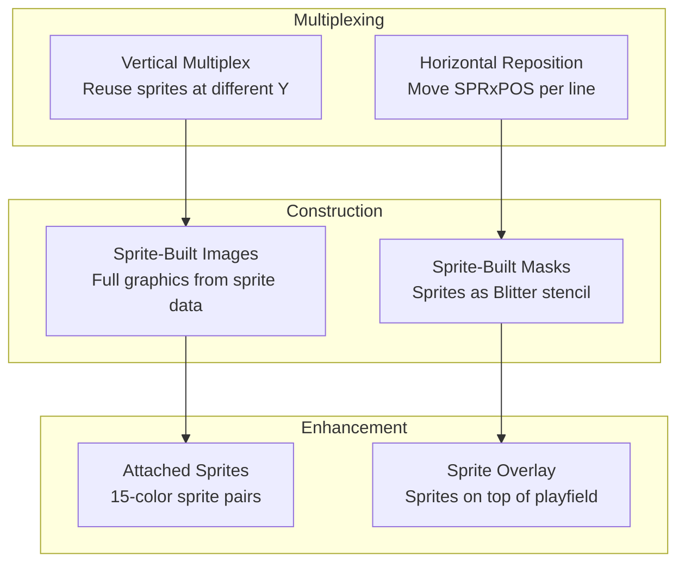
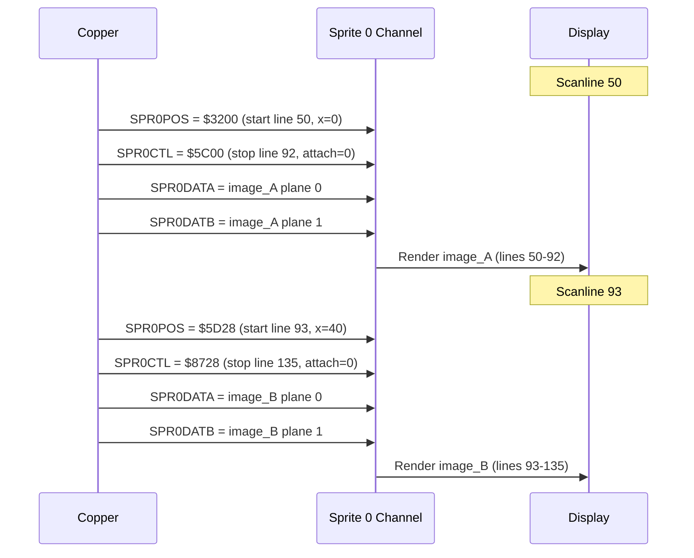
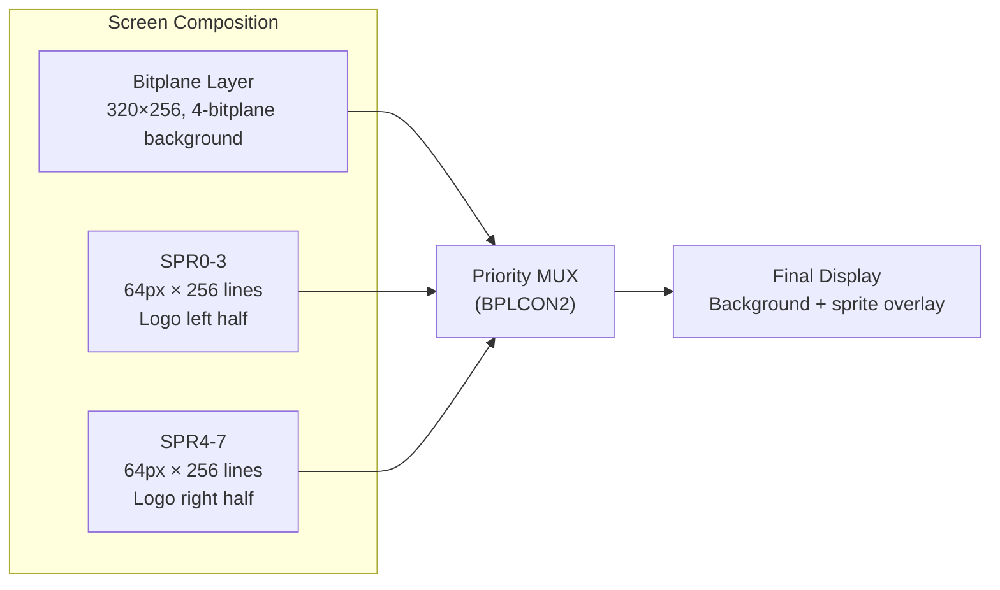
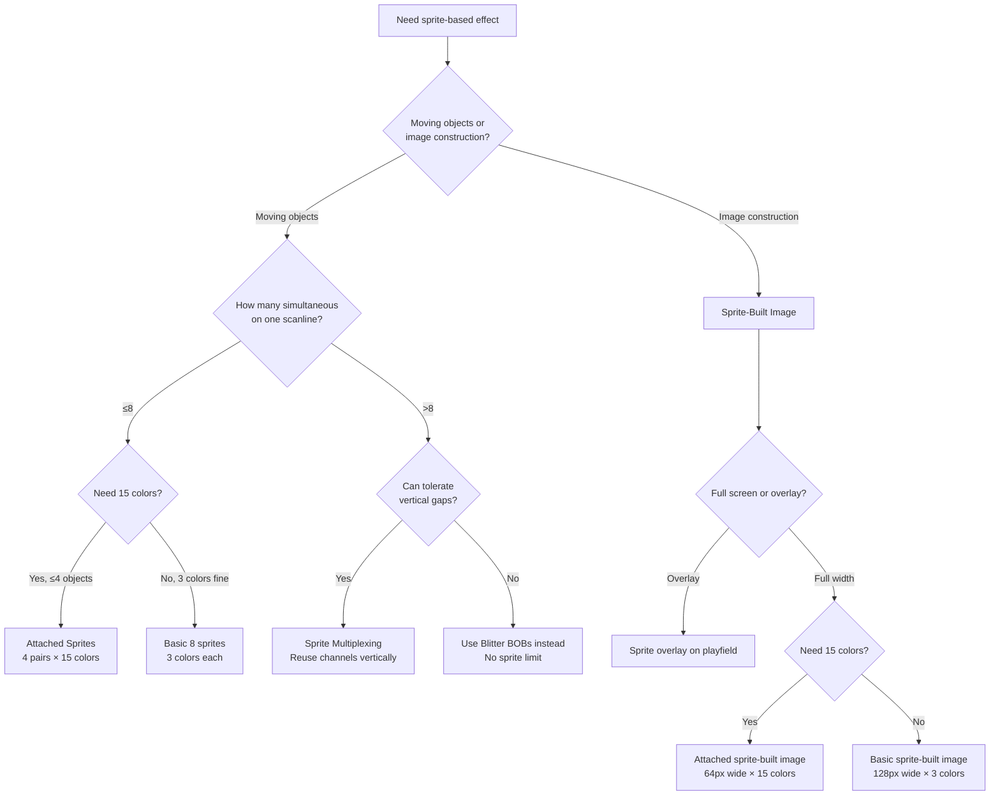
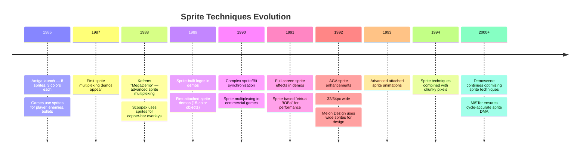

[← Home](../README.md) · [Demoscene Techniques](README.md)

# Sprite Techniques — Multiplexing, Sprite-Built Images, and Attached Sprites

## Overview

The Amiga has 8 hardware sprite channels, each displaying a 16-pixel-wide, arbitrarily-tall image in 3 colors (plus transparent). That sounds limiting — and it is, for games that need dozens of moving objects. But the demoscene turned this constraint into a creative engine. By repositioning sprites at different scanlines (multiplexing), building full-screen images from sprite data, and combining pairs into 15-color attached sprites, demoscene coders extracted far more from 8 channels than Commodore intended.

This article covers the specific demoscene sprite techniques that go beyond basic sprite usage. For the hardware architecture, DMA timing, and OS-level sprite API, see [Sprites](../08_graphics/sprites.md).



---

## Hardware Recap

### Sprite DMA Channels

| Sprite | DMA Slots/Line | Position Reg | Data Regs | Colors | Notes |
|--------|---------------|-------------|-----------|--------|-------|
| SPR0 | 2 | `$DFF140` | `$DFF144`/`6` | COLOR17/COLOR18 + COLOR00 | Usually mouse pointer |
| SPR1 | 2 | `$DFF148` | `$DFF14C`/`E` | COLOR19/COLOR20 + COLOR00 | |
| SPR2 | 2 | `$DFF150` | `$DFF154`/`6` | COLOR21/COLOR22 + COLOR00 | |
| SPR3 | 2 | `$DFF158` | `$DFF15C`/`E` | COLOR23/COLOR24 + COLOR00 | |
| SPR4 | 2 | `$DFF160` | `$DFF164`/`6` | COLOR25/COLOR26 + COLOR00 | |
| SPR5 | 2 | `$DFF168` | `$DFF16C`/`E` | COLOR27/COLOR28 + COLOR00 | |
| SPR6 | 2 | `$DFF170` | `$DFF174`/`6` | COLOR29/COLOR30 + COLOR00 | |
| SPR7 | 2 | `$DFF178` | `$DFF17C`/`E` | COLOR31/COLOR32 + COLOR00 | |

### Sprite Data Format

Each sprite line is 2 words (32 bits). For a standard 16-pixel-wide, 3-color sprite, each word contains one bitplane of the image:

```
┌─────────────────────────────────────┐
│  Word 1 (bitplane 0)  │  Word 2 (bitplane 1)  │
│  bits: 16 pixels      │  bits: 16 pixels      │
└─────────────────────────────────────┘

Color mapping:
  00 = transparent (playfield shows through)
  01 = color register A  (e.g., COLOR17 for SPR0)
  10 = color register B  (e.g., COLOR18 for SPR0)
  11 = both set → COLOR00 (shared with background!)
```

### Sprite Control Registers

| Register | Address | Description |
|----------|---------|-------------|
| `SPRxPOS` | `$DFF140+8n` | Vertical start (bits 15-8) + horizontal start (bits 7-0) |
| `SPRxCTL` | `$DFF142+8n` | Vertical stop (bits 15-8) + attach bit (bit 7) + control |
| `SPRxDATA` | `$DFF144+8n` | Data bitplane 0 (write-only) |
| `SPRxDATB` | `$DFF146+8n` | Data bitplane 1 (write-only) |

> [!NOTE]
> Sprite position encoding: The 8-bit horizontal component uses low-resolution pixel units ($00 = leftmost visible, max ~$DA). The 8-bit vertical component is the scanline number (PAL: 0–311, NTSC: 0–261).

---

## Technique 1: Sprite Multiplexing

The most important demoscene sprite technique. The Amiga's 8 sprites each persist from their start scanline to their stop scanline. By repositioning a sprite mid-frame (via the Copper writing new `SPRxPOS`/`SPRxCTL` values), the same hardware channel displays different images at different vertical positions.

### How Multiplexing Works



### Multiplexed Sprite Setup

The Copper writes new position and data values for each sprite at each repositioning point:

```asm
; sprite_mux.asm — Multiplex sprite 0 at two vertical positions

SPRITE_MUX_COPPER:
        ; ---- First instance: lines 50-79 (30 lines) ----
        dc.w    $8032,$FFFE           ; WAIT line 50
        dc.w    $0140,$3200           ; SPR0POS: start line 50, x=0
        dc.w    $0142,$4E00           ; SPR0CTL: stop line 78, no attach

        ; Sprite 0 data pointer in Copper (sets SPR0DATA/DATB via DMA)
        dc.w    $0180,$0000           ; COLOR00 = black (sprite uses it)

        ; ---- Reposition at line 80 ----
        dc.w    $8050,$FFFE           ; WAIT line 80
        dc.w    $0140,$5028           ; SPR0POS: start line 80, x=40
        dc.w    $0142,$6A28           ; SPR0CTL: stop line 106, x=40

        ; ---- Reposition again at line 110 ----
        dc.w    $806E,$FFFE           ; WAIT line 110
        dc.w    $0140,$6E50           ; SPR0POS: start line 110, x=80
        dc.w    $0142,$8C50           ; SPR0CTL: stop line 140, x=80

        dc.w    $FFFF,$FFFE           ; End
```

### Multiplexing Limits

| Factor | Constraint | Practical Limit |
|--------|-----------|-----------------|
| **DMA bandwidth** | 2 slots per sprite per scanline (8 sprites = 16 slots) | All 8 sprites always consume 16 slots — fixed cost |
| **Copper repositioning** | 2 WAIT+MOVE pairs per reposition (8 words) | ~7 repositions per scanline in LoRes 4-plane |
| **Vertical spacing** | Must wait for sprite stop before restarting | Minimum ~1 scanline gap between instances |
| **Data storage** | Each sprite instance needs its own data in Chip RAM | Limited by Chip RAM budget |
| **Horizontal position** | Single 8-bit value, max ~$DA (218 pixels LoRes) | LoRes only; HiRes sprites need different encoding |

### Typical Multiplexing Budgets

| Configuration | Sprites | Multiplexes/Sprite | Total Objects | Colors |
|--------------|---------|-------------------|---------------|--------|
| 8 sprites × 1 mux | 8 | 1 | 8 | 3 each |
| 8 sprites × 3 mux | 8 | 3 | 24 | 3 each |
| 4 sprites × 5 mux | 4 | 5 | 20 | 3 each |
| 8 attached × 2 mux | 4 pairs | 2 | 8 | 15 each |

---

## Technique 2: Sprite-Built Images

Instead of using sprites for moving objects, demoscene coders use sprite data to construct static images — logos, borders, or even full-screen graphics. This frees bitplane memory for the main display and lets sprites act as an overlay layer.

### How It Works

1. Arrange 8 sprites vertically (no multiplexing) to cover the full screen height
2. Each sprite is 16 pixels wide × the full display height (~256 lines)
3. Total sprite coverage: 8 × 16 = 128 pixels wide, full height
4. Combine with bitplanes for the remaining horizontal space

### Logo Construction from Sprites



```c
/* sprite_logo.c — Build a 128-pixel-wide logo from 8 sprites */

#define LOGO_WIDTH  128   /* 8 sprites × 16 pixels */
#define LOGO_HEIGHT 256

/* Each sprite line = 2 words = 32 bits = 16 pixels × 2 bitplanes
   For a logo, we need to convert our image data to sprite format */

struct SpriteData {
    UWORD pos;      /* SPRxPOS value */
    UWORD ctl;      /* SPRxCTL value */
    UWORD data[LOGO_HEIGHT];  /* Bitplane 0 */
    UWORD datb[LOGO_HEIGHT];  /* Bitplane 1 */
};

/* Initialize 8 sprites to display a 128-pixel logo */
void init_sprite_logo(struct SpriteData sprites[8], int start_y) {
    int i;

    for (i = 0; i < 8; i++) {
        int x = i * 16;  /* Each sprite starts 16px after the previous */

        /* Position: high byte = Y, low byte = X (lowres units) */
        sprites[i].pos = (start_y << 8) | (x & 0xFF);

        /* Control: stop Y = start_y + LOGO_HEIGHT - 1 */
        int stop_y = start_y + LOGO_HEIGHT - 1;
        sprites[i].ctl = (stop_y << 8) | (x & 0xFF);

        /* Data is already in sprite format (2 words per line) */
        /* Would be filled from pre-converted image data */
    }
}
```

---

## Technique 3: Attached Sprites (15-Color)

Normal sprites have 3 colors. **Attached sprites** combine two sprite channels (even+odd, like SPR0+SPR1) into a single image with 15 colors. The even sprite provides bitplanes 0-1, the odd sprite provides bitplanes 2-3. Together, they form a 4-bitplane (16-color, one transparent) image.

### Attachment Encoding

The `attach` bit in `SPRxCTL` (bit 7) tells Denise to combine the sprite pair:

```asm
; attached_sprites.asm — 15-color sprite pair (SPR0 + SPR1)

        ; ---- Set up SPR0 (even: bitplanes 0,1) ----
        dc.w    $0140,$3200           ; SPR0POS: line 50, x=0
        dc.w    $0142,$5A80           ; SPR0CTL: stop line 90, ATTACH=1 (bit 7)

        ; ---- Set up SPR1 (odd: bitplanes 2,3) ----
        dc.w    $0148,$3200           ; SPR1POS: SAME position as SPR0
        dc.w    $014A,$5A00           ; SPR1CTL: stop line 90, ATTACH=0 (odd)

        ; ---- Set 15-color palette for SPR0+SPR1 ----
        ; SPR0 colors: COLOR17 (01), COLOR18 (10), COLOR00 (11)
        ; SPR1 colors: COLOR19 (01), COLOR20 (10), COLOR00 (11)
        ; Combined mapping:
        ;   0000 = transparent
        ;   0001 = COLOR17  (SPR0 only, bit 0)
        ;   0010 = COLOR18  (SPR0 only, bit 1)
        ;   0011 = COLOR00  (both)
        ;   0101 = COLOR19  (SPR1 only, bit 2)
        ;   ...
        ;   1111 = COLOR00  (all bits set)
```

### Attached Sprite Color Table

| Bits (3210) | Color Register | Notes |
|-------------|---------------|-------|
| 0000 | Transparent | Playfield visible |
| 0001 | COLOR17 | Even sprite, plane 0 |
| 0010 | COLOR18 | Even sprite, plane 1 |
| 0011 | COLOR00 | Both planes of even sprite |
| 0101 | COLOR19 | Odd sprite, plane 0 |
| 0110 | COLOR20 | Odd sprite, plane 1 |
| 0111 | COLOR00 | Odd combined |
| 1001 | COLOR17+19 | Mixed |
| 1010 | COLOR18+20 | Mixed |
| ... | Various | See full table below |

> [!NOTE]
> The 4-bit combination gives 16 values. Value 0 is transparent, and values where both even and odd planes are all-ones map to `COLOR00`. The remaining 12 values use the sprite's own color registers (COLOR17–COLOR20 for the SPR0+SPR1 pair), giving effectively 15 distinct non-transparent colors.

### Attached Pair Assignments

| Even Sprite | Odd Sprite | Color Registers | Available |
|-------------|-----------|-----------------|-----------|
| SPR0 | SPR1 | COLOR17, COLOR18, COLOR19, COLOR20 + COLOR00 | 15 colors |
| SPR2 | SPR3 | COLOR21, COLOR22, COLOR23, COLOR24 + COLOR00 | 15 colors |
| SPR4 | SPR5 | COLOR25, COLOR26, COLOR27, COLOR28 + COLOR00 | 15 colors |
| SPR6 | SPR7 | COLOR29, COLOR30, COLOR31, COLOR32 + COLOR00 | 15 colors |

---

## Technique 4: Sprite Overlay with Priority Control

`BPLCON2` (bit 6) controls whether sprites appear above or below playfield bitplanes. Demoscene effects exploit this to create overlay effects — sprites that appear in front of or behind the playfield for visual layering:

```asm
; Set sprites behind playfield (for background effects)
dc.w    $0104,$0040           ; BPLCON2: sprites behind playfield

; Set sprites in front of playfield (default, for overlays)
dc.w    $0104,$0000           ; BPLCON2: sprites in front
```

This can be changed mid-frame by the Copper, enabling sprites to appear behind bitplanes in one area and in front in another — a common technique in multi-layer parallax effects.

---

## Technique 5: Sprite-Based Color Effects

Each sprite's color registers can be changed by the Copper per scanline. This enables per-line color animation on sprite graphics:

```asm
; Animate sprite colors per scanline for rainbow effect
dc.w    $8032,$FFFE           ; WAIT line 50
dc.w    $0188,$0F00           ; COLOR17 = blue (SPR0 color A)
dc.w    $8033,$FFFE           ; WAIT line 51
dc.w    $0188,$0FF0           ; COLOR17 = cyan
dc.w    $8034,$FFFE           ; WAIT line 52
dc.w    $0188,$0FFF           ; COLOR17 = white
; ... continues for full rainbow
```

This technique is the basis for many demo effects where a sprite "absorbs" the current background color and appears to change color as it moves.

---

## Antipatterns

### 1. The Invisible Sprite

Forgetting to set sprite color registers. By default, all sprite colors are `$0000` (black), which is also the default background color — making sprites invisible against a black background.

**Broken:**
```c
/* Sprite is there but invisible — COLOR17/18 match background */
custom.spr[0].pos = pos_value;
custom.spr[0].ctl = ctl_value;
/* Colors never set → invisible on black background */
```

**Fixed:**
```c
custom.spr[0].pos = pos_value;
custom.spr[0].ctl = ctl_value;

/* Set sprite colors to visible values */
custom.color[17] = 0x0FFF;  /* Bright white */
custom.color[18] = 0x0F00;  /* Blue */
```

### 2. The Overlapping Multiplex

Repositioning a sprite before its previous instance has finished displaying. The sprite channel can only hold one position at a time — setting a new start position while the old one is still active causes visual artifacts.

**Broken:**
```asm
; Sprite 0 starts at line 50, runs to line 100
dc.w    $0140,$3200           ; SPR0POS: start=50
dc.w    $0142,$6400           ; SPR0CTL: stop=100

; But reposition at line 70 — before line 100 stop!
dc.w    $8046,$FFFE           ; WAIT line 70
dc.w    $0140,$4628           ; SPR0POS: start=70 ← CONFLICT!
```

**Fixed:**
```asm
; Let first instance finish (stop line 100), then reposition
dc.w    $8064,$FFFE           ; WAIT line 100 (after stop)
dc.w    $0140,$6428           ; SPR0POS: start=100, x=40
dc.w    $0142,$8C28           ; SPR0CTL: stop=140, x=40
```

### 3. The Misaligned Attached Pair

Attached sprites require both even and odd sprites to have identical positions. Even a 1-pixel offset breaks the 15-color illusion.

**Broken:**
```asm
dc.w    $0140,$3200           ; SPR0POS: line 50, x=0
dc.w    $0148,$3201           ; SPR1POS: line 50, x=1 ← OFFSET!
```

**Fixed:**
```asm
dc.w    $0140,$3200           ; SPR0POS: line 50, x=0
dc.w    $0148,$3200           ; SPR1POS: line 50, x=0 ← SAME!
```

### 4. The Sprite DMA Starvation

Disabling sprite DMA (`DMACON` bit 3) but still writing to sprite position registers. Without DMA, no sprite data is fetched — the registers are set but nothing appears.

**Broken:**
```c
custom.dmacon = 0x8100;  /* Enable DMA, but forgot sprite bit (bit 3) */
/* Sprites won't display even though positions are set */
```

**Fixed:**
```c
custom.dmacon = 0x8100 | 0x0008;  /* Enable DMA + sprite DMA (SPR0-DMA) */
/* Or simply: */
custom.dmacon = 0x81FF;  /* Enable all DMA channels */
```

### 5. The AGA Width Trap

AGA allows 32-pixel and 64-pixel wide sprites via `FMODE` settings. But the sprite data format changes — wider sprites need more words per line. Using OCS-format sprite data with AGA wide-sprite settings produces garbage.

**Broken:**
```c
/* Set 32-pixel sprite mode but provide 16-pixel data */
custom.fmode = 0x0030;  /* SPR_FMODE = 32-bit fetch */
/* Sprite data still only 2 words/line (16px) → garbage */
```

**Fixed:**
```c
if (aga_detected) {
    custom.fmode = 0x0030;  /* 32-bit sprite fetch */
    /* Provide 4 words per line (32px × 2 bitplanes) */
} else {
    custom.fmode = 0x0000;  /* OCS: 16-bit fetch */
    /* Provide 2 words per line (16px × 2 bitplanes) */
}
```

---

## Decision Guide



---

## Performance Analysis

### Sprite DMA Cost (Fixed, Always Paid)

| Configuration | DMA Slots/Scanline | Notes |
|--------------|--------------------|-------|
| All 8 sprites enabled | 16 | Fixed cost regardless of use |
| Sprites disabled | 0 | Can reclaim 16 slots for other DMA |
| 4 sprites (0-3) | 8 | Common for 2 attached pairs |

### Multiplexing Overhead

| Operation | Copper Words | DMA Slots | Notes |
|-----------|-------------|-----------|-------|
| Reposition (POS+CTL) | 4 | 4 | WAIT + MOVE × 2 |
| With new data pointers | 8 | 8 | POS + CTL + DATA/DATB ptrs |
| Full reposition + colors | 12 | 12 | Above + 2 color register writes |

> [!TIP]
> Each sprite reposition costs 4–12 DMA slots per scanline at the reposition line. Plan multiplexing points carefully — avoid repositioning all 8 sprites on the same scanline.

---

## Historical Timeline



---

## Modern Analogies

| Amiga Sprite Concept | Modern Equivalent | Why It Maps |
|---------------------|-------------------|-------------|
| Sprite multiplexing | Instance rendering / draw-call batching | Same object data reused at different positions |
| Sprite-built image | GPU sprite atlas / billboard rendering | Multiple small textures composited into scene |
| Attached sprites | Alpha channel / RGBA4444 textures | More color depth by combining data from two sources |
| SPRxPOS reposition | Transform matrix update | Changing draw position per instance |
| Sprite priority (BPLCON2) | Z-sort / depth buffer | Controls which layer appears on top |
| Sprite DMA | GPU texture fetch | Autonomous hardware fetches pixel data |
| 16px width limit | Texture dimension constraints | Hardware-imposed maximum per unit |
| Color register per sprite | Per-object palette / uniform | Color lookup specific to each sprite |

---

## Use Cases

| Use Case | Technique | Notable Examples |
|----------|-----------|-----------------|
| Game player/enemy objects | Basic sprites + multiplex | Turrican, Shadow of the Beast |
| Mouse pointer | SPR0 (reserved by OS) | Workbench |
| Demo logo overlay | Sprite-built image | Melon Dezign, Sanity |
| Large colorful objects | Attached sprites (15-color) | Kefrens, Phenomena demos |
| Parallax background layer | Sprite overlay behind playfield | Lionheart, Leander |
| Status bar icons | Fixed sprites | Many games |
| Sprite-sprite collision | CLXCON/CLXDAT hardware | Turrican (sprite collision detection) |
| Color-cycling objects | Per-line sprite color changes | Numerous demos |

---

## FPGA / Emulation Impact

| Concern | Impact | Notes |
|---------|--------|-------|
| **Sprite DMA timing** | Must fetch exactly 2 words per sprite per scanline | Minimig/MiSTer implement precise DMA slot scheduler |
| **Attached sprite decoding** | Denise must combine even+odd data correctly | 4-bitplane lookup from 2 sprite channels |
| **SPRxPOS/CTL latency** | Position changes take effect next line | Must match real hardware delay |
| **CLXCON collision detection** | Hardware collision between sprites/bitplanes | Required for games like Turrican |
| **AGA FMODE sprite width** | 32/64px sprites change data format | FMODE.SPR_FMODE must be tracked |
| **Sprite data staging** | Denise latches data at end of scanline for next line | Pipeline behavior must be emulated |

---

## FAQ

**Q: How many sprites can I display on screen at once?**
A: 8 per scanline (hardware limit). With multiplexing, you can reuse each channel multiple times vertically — a common demo technique shows 30+ "sprites" using 8 channels multiplexed 4 times each.

**Q: Can sprites be wider than 16 pixels?**
A: On OCS/ECS, no — 16 pixels is the fixed hardware width. On AGA, `FMODE` bits can set 16, 32, or 64 pixel widths. For OCS, wider objects require Blitter BOBs or multiple sprites side by side.

**Q: Why does SPR0 sometimes conflict with the mouse pointer?**
A: Intuition reserves SPR0 and SPR1 for the mouse pointer. If you take over the hardware (demos), you can use all 8 sprites. If running under the OS, use only SPR2-SPR7 or use the `ExtSprite` API (V39+) which cooperates with Intuition.

**Q: What happens when sprites overlap?**
A: Lower-numbered sprites have priority — SPR0 appears on top of SPR1, which appears on top of SPR2, etc. The sprite/playfield priority is controlled by `BPLCON2`.

**Q: Can I use sprites and Blitter BOBs together?**
A: Yes. Sprites are DMA-driven and cost zero CPU time. BOBs are software-driven (Blitter copies) and cost Blitter DMA time. Many games use sprites for small, frequently-moving objects and BOBs for larger or more colorful ones.

**Q: What is CLXCON and how does collision detection work?**
A: `CLXCON` (`$DFF098`) configures which sprite and bitplane bits are included in collision detection. `CLXDAT` (`$DFF00E`) reports detected collisions. The hardware compares sprite and bitplane data in real-time and sets bits when matching pixels overlap. See [Sprites](../08_graphics/sprites.md) for full details.

---

## References

### Related Knowledge Base Articles

- [Sprites](../08_graphics/sprites.md) — Full hardware sprite architecture, DMA timing, collision detection
- [AGA Sprites](../01_hardware/aga_a1200_a4000/aga_sprites.md) — AGA sprite enhancements: 32/64px, FMODE, color banks
- [Copper Effects](copper_effects.md) — Copper-driven sprite repositioning
- [Pixel Tricks](pixel_tricks.md) — Chunky pixel techniques using sprites
- [Blitter Programming](../08_graphics/blitter/blitter_programming.md) — BOB rendering (sprite alternative)
- [Animation](../08_graphics/animation.md) — GEL system: VSprites (software sprites)
- [DMA Architecture](../01_hardware/common/dma_architecture.md) — DMA slot allocation

### External Resources

- **Amiga Hardware Reference Manual** — Chapter 5: Sprites
- **Amiga Graphics Archive** — https://amiga.lychesis.net — Sprite multiplexing and copper-driven sprite repositioning in commercial games
- **Scoopex Amiga Hardware Programming** (Photon) — [YouTube playlist](https://www.youtube.com/playlist?list=PLc3ltHgmiidpK-s0eP5hTKJnjdTHz0_bW) — Sprite programming episodes covering hardware setup, multiplexing, and attached sprites
- **Pouet.net** — https://www.pouet.net — Sprite-based demo releases
- **Demozoo** — https://demozoo.org — Demoscene encyclopedia
- **AMIGA Machine Code Tutorial** — Lexington — Sprite programming from scratch
