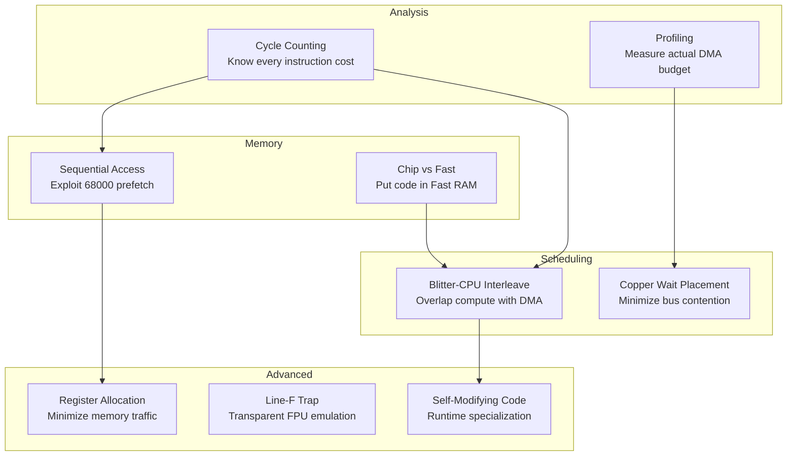
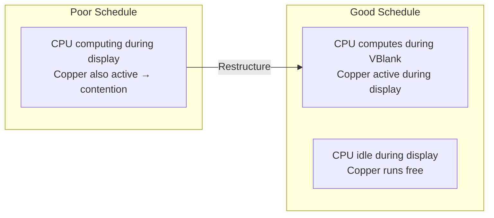
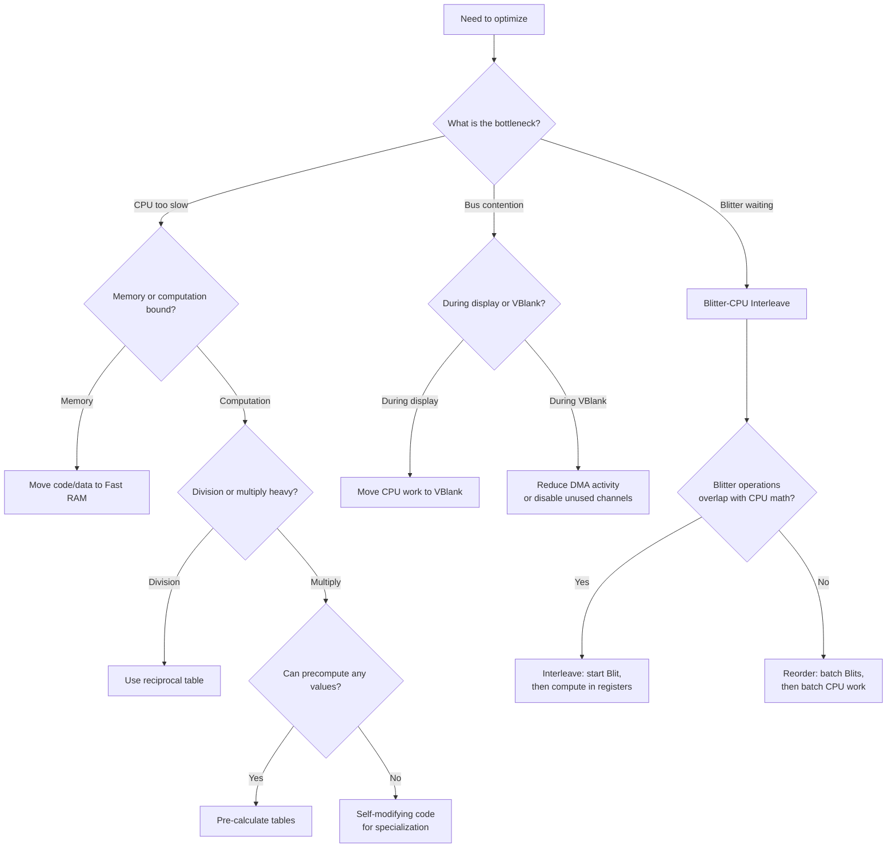
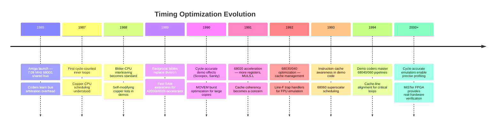

[← Home](../README.md) · [Demoscene Techniques](README.md)

# Timing Optimization — Cycle Counting, Blitter-CPU Interleaving, and Self-Modifying Code

## Overview

On a stock Amiga 500, the 68000 runs at 7.09 MHz and must share memory bandwidth with the Copper, Blitter, bitplane DMA, sprite DMA, and audio DMA — all running simultaneously. A PAL frame lasts exactly **19,968 CPU cycles** (20ms). After DMA steals its share, the CPU might only get **8,000–12,000 usable cycles per frame**. Every instruction, every memory access, every bus arbitration event is a battle for scarce bandwidth.

Demoscene coding is the art of extracting maximum performance from this constrained environment. This article covers the timing optimization techniques that demoscene coders developed: cycle-accurate instruction scheduling, Blitter-CPU interleaving to recover stolen cycles, copper-wait placement to minimize stalls, memory access pattern optimization, and self-modifying code for runtime specialization.



---

## Foundation: The DMA Budget

### Per-Frame Cycle Budget (PAL)

| Resource | Cycles per Frame | Percentage | Notes |
|----------|-----------------|------------|-------|
| **Total frame** | 19,968 | 100% | 312 scanlines × 226.8 DMA slots/line × ~2 cycles |
| Bitplane DMA | 2,496–7,488 | 12–37% | Depends on depth/resolution |
| Sprite DMA | 1,248 | 6% | Fixed: 8 sprites always active |
| Audio DMA | 312 | 1.5% | Fixed: 4 channels |
| Copper DMA | 624–1,248 | 3–6% | Depends on copper list length |
| Refresh DMA | 624 | 3% | DRAM refresh (fixed) |
| **Available for CPU + Blitter** | ~9,000–15,000 | 45–75% | Shared between CPU and Blitter |

### The Key Constraint: Bus Arbitration

The 68000 and DMA controllers share the same memory bus. When DMA is active, the CPU **stalls** — it cannot fetch instructions or data. The `BLTPRI` bit (Blitter Nasty mode) gives the Blitter total bus priority, starving the CPU almost completely:

| Mode | Blitter Priority | CPU Gets | Use When |
|------|-----------------|----------|----------|
| Normal (`BLTPRI=0`) | Every 4th cycle | ~75% of remaining cycles | Normal operation |
| Blitter Nasty (`BLTPRI=1`) | All cycles | ~0% (only between Blitter cycles) | Critical Blitter operations |

---

## Technique 1: Cycle Counting

Every 68000 instruction has a known cycle cost. Demoscene coders count cycles the way a financial analyst counts dollars — every single one matters.

### 68000 Instruction Cycle Costs (Most Common)

| Instruction | Cycles | Notes |
|-------------|--------|-------|
| `MOVE.W Dn,Dn` | 4 | Register-to-register: fastest |
| `MOVE.W (An),Dn` | 8 | Memory read: 4 + 4 (prefetch penalty) |
| `MOVE.W Dn,(An)` | 8 | Memory write |
| `MOVE.L (An)+,(An)+` | 12 | Post-increment: 2 memory accesses |
| `ADD.W Dn,Dn` | 4 | Register add |
| `ADD.W #imm,Dn` | 8 | Immediate add (2 words to fetch) |
| `MULS.W Dn,Dn` | 28 | Signed 16×16→32 multiply |
| `MULU.W Dn,Dn` | 28 | Unsigned multiply |
| `DIVS.W Dn,Dn` | 44-140 | Signed divide: 44 best, 140 worst |
| `MULS.L Dn,Dn` | ~28-44 | 68020+: 32×32→64 multiply |
| `DBRA Dn,label` | 10 (taken) / 6 (exit) | Loop branch |
| `BRA label` | 10 | Unconditional branch |
| `BCC label` | 8 (taken) / 6 (not) | Conditional branch |
| `JSR (An)` | 12 | Subroutine call |
| `RTS` | 12 | Return |
| `LEA (An),An` | 4 | Address computation (no memory access) |
| `SWAP Dn` | 4 | Swap 16-bit halves |
| `LSL.W #n,Dn` | 6+n | Shift left: 6 + number of positions |
| `ROL.W #n,Dn` | 6+n | Rotate left |
| `MOVE.W (An)+,Dn` | 8 | Read with auto-increment |

### DMA Stall Impact

When DMA is active, instruction cycles increase due to bus contention:

```c
/*
 * Effective cycle cost = base_cycles + dma_stalls
 *
 * dma_stalls depends on:
 *   1. Number of DMA channels active on current scanline
 *   2. Whether the access is to Chip RAM or Fast RAM
 *   3. BLTPRI (Blitter Nasty) mode
 *
 * Rule of thumb on stock A500:
 *   - With 4 bitplanes LoRes, DMA steals ~40% of bus cycles
 *   - With 6 bitplanes HiRes, DMA steals ~60% of bus cycles
 *   - During Blitter operation (normal): CPU gets ~25% of cycles
 *   - During Blitter Nasty: CPU gets ~0-5% of cycles
 */
```

---

## Technique 2: Blitter-CPU Interleaving

The most important optimization on the Amiga. When the Blitter is running (copying, filling, drawing lines), the CPU normally stalls waiting for bus access. **Interleaving** means finding useful work for the CPU to do during Blitter wait periods — computation that doesn't require memory access (register-only operations).

### The Interleaving Principle

```mermaid
gantt
    title Blitter-CPU Interleaving (Single Frame)
    dateFormat X
    axisFormat %s

    section CPU
    Compute 3D vertices    :crit, 0, 4
    (stalled by Blitter)   : 4, 7
    Compute more vertices  :crit, 7, 9
    (stalled by Blitter)   : 9, 12
    Prepare next blit      :crit, 12, 14

    section Blitter
    Fill polygon A         :active, 0, 7
    Fill polygon B         :active, 7, 12
    Fill polygon C         :active, 12, 16
```



### Implementation Pattern

```c
/*
 * interleave.c — Blitter-CPU interleaving pattern
 *
 * The key: start a Blitter operation, then do CPU computation
 * that only uses registers (no memory access) while Blitter runs.
 */

void render_frame(void) {
    /* Phase 1: Start Blitter fill for first polygon */
    start_blitter_fill(&polygons[0]);

    /* Phase 2: CPU computes next polygon's vertex positions
       while Blitter fills the first one.
       IMPORTANT: Only register-to-register operations here!
       Any memory access will stall until Blitter finishes. */
    {
        register FIXED rx asm("d0");
        register FIXED ry asm("d1");
        register FIXED rz asm("d2");

        /* Transform vertices for polygon 2 — register-only math */
        rx = fixed_mul(m00, vx1) + fixed_mul(m01, vy1) + fixed_mul(m02, vz1);
        ry = fixed_mul(m10, vx1) + fixed_mul(m11, vy1) + fixed_mul(m12, vz1);
        rz = fixed_mul(m20, vx1) + fixed_mul(m21, vy1) + fixed_mul(m22, vz1);

        /* Store results (will stall if Blitter still running) */
        screen_x1 = project_x(rx, rz);
        screen_y1 = project_y(ry, rz);
    }

    /* Phase 3: Wait for Blitter to finish, then start next blit */
    wait_blitter();
    start_blitter_fill(&polygons[1]);

    /* Phase 4: More CPU computation for polygon 3... */
    /* ... repeat ... */
}
```

### Assembly Interleaving

In 68000 assembly, the interleaving is explicit:

```asm
; interleave.asm — Start Blitter, do CPU work, wait for Blitter

        ; ---- Start Blitter fill for polygon A ----
        lea     $DFF000,a6
        move.w  #$01F2,BLTCON0(a6)     ; Fill mode
        move.l  poly_a_data,BLTAPTH(a6)
        move.l  poly_a_data,BLTDPTH(a6)
        move.w  #(HEIGHT<<6)|WIDTH_BLT,BLTSIZE(a6)  ; Start!

        ; ---- CPU work: compute polygon B vertices ----
        ; These are register-only operations, no memory access
        ; (the data was pre-loaded into registers)
        move.l  d0,d4           ; 4 cycles
        muls.w  d1,d4           ; 28 cycles
        add.l   d4,d2           ; 4 cycles  (36 total)
        swap    d2              ; 4 cycles  (40 total)
        move.w  d2,d5           ; 4 cycles  (44 total)
        muls.w  d3,d5           ; 28 cycles (72 total)
        ; ... more register math ...

        ; ---- Now we need memory — check if Blitter is done ----
.blit_wait:
        btst    #6,DMACONR(a6)  ; Read DMA status (1 memory access)
        bne.s   .blit_wait      ; Loop if Blitter busy

        ; ---- Start Blitter fill for polygon B ----
        move.w  #$01F2,BLTCON0(a6)
        move.l  poly_b_data,BLTAPTH(a6)
        move.l  poly_b_data,BLTDPTH(a6)
        move.w  #(HEIGHT2<<6)|WIDTH_BLT,BLTSIZE(a6)  ; Start!

        ; ---- CPU work: compute polygon C vertices ----
        ; ... register-only math again ...
```

---

## Technique 3: Copper-Wait Placement

The Copper competes with the CPU for bus cycles. Poorly-placed copper lists steal cycles from the CPU during critical computation windows. The optimization: **move copper activity to scanlines where the CPU is idle** (during vertical blank or display border areas).

### Optimal Copper-CPU Scheduling



### Practical Scheduling

```c
/*
 * schedule.c — Optimal copper-CPU scheduling
 *
 * Principle: Move CPU-heavy computation to VBlank period
 * when the Copper is idle (already executed its list).
 * Let the Copper do its work during the display period
 * when the CPU has less to do.
 */

void main_loop(void) {
    while (1) {
        /* Wait for VBlank (vertical blanking interval)
           During VBlank: no display DMA, minimal Copper activity */
        WaitTOF();  /* Wait for Top of Frame */

        /* ---- VBlank period: CPU-heavy computation ---- */
        /* This runs during lines 0-19 (top border) and
           lines 250-311 (bottom border + VBlank)
           Minimal DMA contention here! */
        update_3d_vertices();
        update_physics();
        update_audio_buffers();
        build_copper_list();

        /* ---- Display period: let Copper run ---- */
        /* During lines 20-249, the Copper is writing color
           registers and the CPU should do minimal work.
           Only Blitter operations (which have their own DMA)
           or register-only computation should happen here. */
        render_blitter_objects();
    }
}
```

---

## Technique 4: Memory Access Optimization

The 68000 has a 2-word instruction prefetch pipeline. Sequential memory accesses are faster because the prefetch buffer is already filled. Random accesses cause pipeline refills and additional wait states.

### Memory Access Rules

| Access Pattern | Effective Speed | Notes |
|---------------|----------------|-------|
| Sequential read (post-increment) | Fast | Prefetch buffer hits |
| Sequential write (post-increment) | Fast | Blitter-style linear access |
| Random read (indexed) | Slow | Pipeline refill + possible cache miss |
| Register-only operations | Fastest | No memory access at all |
| Chip RAM access | Variable | DMA contention adds wait states |
| Fast RAM access | Consistent | No DMA contention |

### Optimization Techniques

```asm
; memory_opt.asm — Optimize memory access patterns

        ; ---- BAD: Random access pattern ----
        move.w  0(a0,d0.w*2),d1       ; Indexed: pipeline stall
        move.w  2(a0,d1.w*2),d2       ; Indexed: pipeline stall
        move.w  4(a0,d2.w*2),d3       ; Indexed: pipeline stall

        ; ---- GOOD: Sequential access with post-increment ----
        move.w  (a0)+,d1              ; Sequential: fast
        move.w  (a0)+,d2              ; Sequential: fast
        move.w  (a0)+,d3              ; Sequential: fast

        ; ---- GOOD: Process in cache-line-friendly blocks ----
        ; Unroll loops for sequential access
        movem.l (a0)+,d0-d7           ; Burst read: 8 registers
        ; ... process d0-d7 ...
        movem.l d0-d7,(a1)+           ; Burst write: 8 registers
```

### Chip RAM vs Fast RAM Strategy

| Data Type | Best Location | Why |
|-----------|-------------|-----|
| Copper lists | Chip RAM | Copper DMA can only read Chip RAM |
| Bitplane data | Chip RAM | Display DMA can only read Chip RAM |
| Sprite data | Chip RAM | Sprite DMA can only read Chip RAM |
| Audio sample data | Chip RAM | Audio DMA can only read Chip RAM |
| **Code (instructions)** | **Fast RAM** | No DMA contention, consistent speed |
| **Vertex data** | **Fast RAM** | No DMA stalls during computation |
| **Sine tables** | **Fast RAM** | No DMA stalls during lookup |
| **Stack** | **Fast RAM** | No DMA stalls during JSR/RTS/PEA |
| Lookup tables | Fast RAM | No DMA stalls during indexed access |

> [!TIP]
> On a stock A500 with only 512 KB Chip RAM, there is no Fast RAM — all code runs in Chip RAM and contends with DMA. The A501 trapdoor expansion adds 512 KB of "Slow RAM" (Trapdoor RAM, a.k.a. "Ranger" memory) which is not true Fast RAM but doesn't conflict with DMA, making it ~30% faster for code execution than Chip RAM.

---

## Technique 5: Self-Modifying Code

Self-modifying code (SMC) changes its own instructions at runtime. On the Amiga, this is used for:

1. **Loop unrolling with constants** — Patch immediate values in unrolled loops
2. **Branch optimization** — Replace computed branches with direct branches
3. **Copper list generation** — Write copper instructions directly into the instruction stream
4. **Function specialization** — Remove condition checks for known states

### SMC for Copper List Patching

The most common demoscene SMC pattern: a copper list is embedded in the code segment, and the CPU patches the color values each frame:

```asm
; smc_copper.asm — Self-modifying copper list

        ; The copper list lives in the code segment
        ; Color values are patched by the CPU each frame
copper_list:
        dc.w    $8032,$FFFE
        dc.w    $0180,$DEAD           ; ← CPU patches $DEAD each frame
        dc.w    $8050,$FFFE
        dc.w    $0180,$BEEF           ; ← CPU patches $BEEF each frame
        dc.w    $FFFF,$FFFE

update_copper:
        ; Calculate new colors for this frame
        move.w  #some_color,d0

        ; Patch copper list directly (self-modifying!)
        move.w  d0,copper_list+3*2    ; Overwrite $DEAD

        move.w  #other_color,d0
        move.w  d0,copper_list+7*2    ; Overwrite $BEEF
        rts
```

### SMC for Loop Specialization

```asm
; smc_loop.asm — Self-modifying loop with patched constant

        ; The loop inner constant starts as a placeholder
inner_count:
        dc.w    320                    ; ← Patched at runtime

render_line:
        move.w  inner_count(pc),d0     ; Load (possibly patched) count
.next_pixel:
        ; ... pixel processing ...
        dbra    d0,.next_pixel
        rts

; Somewhere during setup:
specialize_loop:
        ; If we know we only need 160 pixels, patch the count
        move.w  #160,inner_count(pc)
        rts
```

> [!WARNING]
> Self-modifying code requires the modified instructions to be in **writable memory** (RAM, not ROM). On the 68000, there is no instruction cache, so modified instructions take effect immediately. On the 68020+ with instruction cache, you must flush the cache after modification (`CPUSHA IC` on 68040, `MOVEC CACR,D0; BCLR #8,D0; MOVEC D0,CACR` on 68030).

---

## Technique 6: Fast Division via Reciprocal Table

Division is the most expensive 68000 operation (up to 140 cycles). For 3D rendering where division by Z is needed for every vertex, demoscene coders pre-compute reciprocal tables:

```c
/* reciprocal.c — Pre-computed 1/z table for fast division */

#define RECIP_TABLE_SIZE 1024
#define RECIP_SHIFT      16     /* 16.16 fixed-point */

static FIXED recip_table[RECIP_TABLE_SIZE];

void build_reciprocal_table(void) {
    int i;
    for (i = 1; i < RECIP_TABLE_SIZE; i++) {
        /* 1.0 / i in 16.16 fixed-point */
        recip_table[i] = ((FIXED)1 << RECIP_SHIFT) / i;
    }
    recip_table[0] = 0x7FFFFFFF;  /* "Infinity" */
}

/* Fast divide: x / z ≈ x × recip_table[z] */
static inline FIXED fast_div(FIXED x, int z) {
    if (z <= 0 || z >= RECIP_TABLE_SIZE) return 0;
    return fixed_mul(x, recip_table[z]);
}
```

---

## Technique 7: Line-F Trap (FPU Transparency)

On 68040/060 systems, floating-point instructions that the FPU doesn't implement in hardware trigger a **Line-F exception** (trap vector $2C). The OS provides emulation routines, but demoscene coders can install custom traps that are faster than the OS defaults:

```asm
; linef_trap.asm — Custom Line-F trap handler for 68040/060

        ; Install custom Line-F handler
        move.l  $2C.w,old_linef_handler   ; Save old handler
        lea     my_linef_handler,a0
        move.l  a0,$2C.w                   ; Install new handler

        ; The handler decodes the trapped FPU instruction
        ; and executes an optimized software equivalent
my_linef_handler:
        move.l  (sp),a0            ; Get faulting PC
        move.w  (a0),d0            ; Read the FPU opcode
        and.w   #$FE00,d0          ; Mask to Line-F family
        cmp.w   #$F200,d0          ; Is it an FPU instruction?
        beq.s   .handle_fpu
        ; ... chain to old handler if not ...

.handle_fpu:
        ; Decode specific FPU instruction and emulate
        ; (e.g., FSIN → table lookup + interpolation)
        ; ... specific emulation code ...
        addq.l  #2,(sp)            ; Skip past the FPU opcode
        rte                        ; Return from exception
```

---

## Antipatterns

### 1. The Blitter Busy Loop

Polling the Blitter's busy flag in a tight loop while the CPU could be doing useful work.

**Broken:**
```c
/* CPU does nothing while waiting for Blitter */
start_blitter_fill(&poly);
while (blitter_busy()) {
    /* Tight loop — wastes every cycle */
}
start_blitter_fill(&next_poly);
```

**Fixed:**
```c
start_blitter_fill(&poly);

/* Do useful register-only work while Blitter runs */
compute_next_vertices();  /* Register math only */
prepare_next_blit_params();

/* Now check if Blitter is done */
while (blitter_busy()) {}  /* Minimal wait */
start_blitter_fill(&next_poly);
```

### 2. The Chip RAM Code Trap

Running performance-critical code from Chip RAM on a system with Fast RAM available. Chip RAM access is slowed by DMA contention.

**Broken:**
```c
/* Code runs in Chip RAM by default */
void hot_function(void) {
    /* Every instruction fetch contends with DMA */
    for (i = 0; i < 1000; i++) { ... }
}
```

**Fixed:**
```c
/* Copy hot function to Fast RAM at startup */
extern UBYTE fast_ram_code[];
extern const UBYTE hot_function_src[];
extern const UBYTE hot_function_end[];

void init(void) {
    ULONG size = hot_function_end - hot_function_src;
    memcpy(fast_ram_code, hot_function_src, size);
    /* Call fast_ram_code() instead of hot_function() */
}
```

### 3. The Naive Division

Using `DIVS.W` or `DIVS.L` in inner loops. Division is 44-140 cycles on 68000 — the single most expensive instruction.

**Broken:**
```asm
; Division in inner loop — 140 cycles each!
.loop:
        divs.w  d1,d0           ; d0 = d0 / d1 (SLOW!)
        ; ...
        dbra    d7,.loop
```

**Fixed:**
```asm
; Pre-compute reciprocal, use multiply instead
        move.w  recip_table(pc,d1.w*2),d2  ; Load 1/divisor
.loop:
        muls.w  d2,d0           ; d0 = d0 × (1/divisor) — 28 cycles
        ; ...
        dbra    d7,.loop
```

### 4. The Indexed Array Trap

Using register-indirect with index addressing (`d(An,Dn.W)`) in tight loops. The 68000's pipeline stalls on non-sequential accesses.

**Broken:**
```asm
; Indexed access — breaks sequential prefetch
        move.w  (a0,d0.w*2),d1  ; Random access: pipeline stall
        move.w  (a0,d2.w*2),d3  ; Random access: pipeline stall
```

**Fixed:**
```asm
; Restructure data for sequential access
        lea     (a0,d0.w*2),a1  ; Compute base address once
        move.w  (a1)+,d1        ; Sequential: fast
        move.w  (a1)+,d3        ; Sequential: fast
```

### 5. The Cache-Coherency Miss

On 68030+ with data cache enabled, modifying code or copper lists without flushing the cache. The CPU reads stale cached data instead of the modified version.

**Broken:**
```c
/* Modify copper list in RAM, but cache has old values */
copper_list[offset] = new_color;
/* On 68030+, the CPU may read the old value from cache! */
custom.cop1lc = (ULONG)copper_list;
```

**Fixed:**
```c
copper_list[offset] = new_color;

/* Flush data cache for modified region (68030+) */
#if defined(__m68030) || defined(__m68040)
    CacheClearU();  /* Or flush specific address range */
#endif

custom.cop1lc = (ULONG)copper_list;
```

---

## Decision Guide



---

## Historical Timeline



---

## Modern Analogies

| Amiga Optimization | Modern Equivalent | Why It Maps |
|-------------------|-------------------|-------------|
| Cycle counting | GPU occupancy profiling | Both count execution units per cycle |
| Blitter-CPU interleave | Async compute (GPU) | Both overlap independent operations |
| Chip vs Fast RAM | VRAM vs system RAM | Both have bandwidth vs capacity tradeoffs |
| Self-modifying code | JIT compilation | Both generate code at runtime |
| Reciprocal table | Fast inverse sqrt / RCP | Both approximate division with table/LUT |
| Copper-wait scheduling | Pipeline barrier placement | Both minimize stalls from synchronization |
| MOVEM burst read | SIMD load (NEON/SSE) | Both load multiple values in one operation |
| Cache flush | Cache maintenance instructions | Both ensure data consistency |
| Bus arbitration | Memory bandwidth allocation | Both divide bandwidth between agents |
| Register allocation | Register allocation (compiler) | Both minimize memory traffic |

---

## Use Cases

| Use Case | Technique | Impact |
|----------|-----------|--------|
| 3D vertex transform | Blitter-CPU interleave | ~2× throughput |
| Inner loop rendering | Cycle counting + fast RAM | ~30% speedup |
| Division-heavy code | Reciprocal table | ~5× vs DIVS |
| Dynamic effects | Self-modifying copper list | Eliminates copy overhead |
| Blitter-heavy frame | Interleave + scheduling | ~50% more CPU time |
| Fast data copy | MOVEM burst | ~4× vs MOVE.W loop |
| 68040/060 code | Cache management | Prevents stale data bugs |
| Interrupt handlers | Register-only computation | Minimal latency |
| Audio mixing | Fast RAM + sequential access | Consistent 50 FPS |

---

## FPGA / Emulation Impact

| Concern | Impact | Notes |
|---------|--------|-------|
| **Cycle-accurate timing** | Demos that rely on exact cycle counts break if timing is wrong | WinUAE "cycle-exact" mode required for many demos |
| **Bus arbitration** | CPU/DMA cycle interleaving must match Agnus scheduler | Minimig implements 4-cycle DMA slots |
| **68000 prefetch** | Instruction prefetch buffer must be modeled | Affects branch timing and instruction pairing |
| **Blitter busy detection** | `DMACONR` bit 6 timing must be exact | Some demos poll at precise cycle counts |
| **Cache behavior** | 68020+ instruction/data cache affects timing | Emulators must model cache size and replacement policy |
| **Self-modifying code** | Instruction cache flush must work correctly | 68040+ demos depend on `CPUSHA` instruction |

> [!NOTE]
> The MiSTer Amiga core (based on Minimig) implements cycle-exact bus arbitration, which is why many timing-sensitive demos work on MiSTer but not on simpler FPGA implementations that approximate timing.

---

## FAQ

**Q: How do I measure actual DMA contention on real hardware?**
A: Use the E-Clock counter (`ReadEClock()`) or the CIA timers to measure execution time of specific code blocks. Compare timing with display DMA enabled vs disabled. The difference reveals the DMA overhead. Alternatively, use WinUAE's built-in profiler in cycle-exact mode.

**Q: Is self-modifying code still useful on modern processors?**
A: Not on x86/ARM — their deeply pipelined superscalar architectures with complex branch prediction make SMC counterproductive (cache invalidation stalls). On the 68000, which has no cache and a simple 2-stage prefetch, SMC is nearly free and often beneficial.

**Q: What is "Blitter Nasty" mode and when should I use it?**
A: Setting `BLTPRI` (bit 10 in `DMACON`) gives the Blitter total bus priority, leaving almost no cycles for the CPU. Use it only when the Blitter operation is the critical path and you have no useful CPU work to do. In practice, most demos use normal Blitter mode with interleaving instead.

**Q: How much faster is Fast RAM really?**
A: On an A1200 with Fast RAM expansion, code runs ~2-3× faster when placed in Fast RAM vs Chip RAM (during display), because there is no DMA contention. During VBlank (no display DMA), the difference is much smaller. The improvement is most dramatic during the display period when bitplane DMA is active.

**Q: Can I use all these techniques together?**
A: Yes, and the best demos do. The optimal pattern is: schedule CPU computation during VBlank, interleave register-only computation during Blitter operations, use Fast RAM for code and data tables, and patch copper lists via self-modifying code. The techniques are complementary.

**Q: What is the single most impactful optimization?**
A: **Blitter-CPU interleaving**. On a stock A500, the Blitter and CPU share the bus. If you wait for the Blitter to finish before doing any CPU work, you waste 50-75% of available cycles. Starting the Blitter and then doing register-only computation nearly doubles effective throughput.

---

## References

### Related Knowledge Base Articles

- [DMA Architecture](../01_hardware/common/dma_architecture.md) — DMA slot allocation, bus arbitration
- [Bus Architecture](../01_hardware/common/bus_architecture.md) — CPU/DMA bus sharing, wait states
- [Cache Management](../15_fpu_mmu_cache/cache_management.md) — CACR, CacheClearU, coherency
- [68040/68060 Libraries](../15_fpu_mmu_cache/68040_68060_libraries.md) — Line-F trap handlers, FPU emulation
- [Blitter Programming](../08_graphics/blitter/blitter_programming.md) — Fill mode, line draw, Blitter timing
- [3D Rendering](3d_rendering.md) — Fixed-point math, C2P costs
- [Copper Effects](copper_effects.md) — Copper list timing, DMA budgets

### External Resources

- **68000 Instruction Timing** — Motorola M68000 Programmer's Reference Manual, Appendix A
- **Amiga Hardware Reference Manual** — DMA timing, bus arbitration
- **WinUAE** — Cycle-exact Amiga emulator with profiler
- **Pouet.net** — https://www.pouet.net — Demo source code with optimization notes
- **Demozoo** — https://demozoo.org — Demoscene encyclopedia
- **Amiga Graphics Archive** — https://amiga.lychesis.net — Per-game copper list and DMA budget analysis
- **Scoopex Amiga Hardware Programming** (Photon) — [YouTube playlist](https://www.youtube.com/playlist?list=PLc3ltHgmiidpK-s0eP5hTKJnjdTHz0_bW) — Cycle-exact programming techniques and DMA interleaving; companion site: [coppershade.org](http://coppershade.org/)
